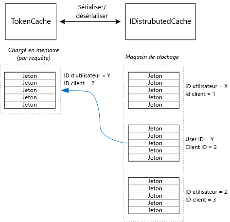

# <a name="cache-access-tokens"></a>Mettre en cache des jetons d’accès

[ Exemple de code][sample application]

Il est relativement coûteux d’obtenir un jeton d’accès OAuth, car cette opération requiert une requête HTTP au point de terminaison de jeton. Par conséquent, il est bon de mettre en cache les jetons lorsque cela est possible. La [bibliothèque d’authentification Azure AD][ADAL] (ADAL) met automatiquement en cache les jetons obtenus à partir d’Azure AD, notamment des jetons d’actualisation.

ADAL fournit une implémentation de cache de jeton par défaut. Toutefois, ce cache de jeton est destiné aux applications clientes natives et n’est **pas** approprié pour les applications web :

* Il s’agit d’une instance statique, qui n’est pas thread-safe.
* Elle ne convient pas pour un grand nombre d’utilisateurs, car les jetons de tous les utilisateurs sont placés dans le même dictionnaire.
* Elle ne peut pas être partagée entre les serveurs web d’une batterie de serveurs.

Au lieu de cela, vous devez implémenter un cache de jeton personnalisé qui dérive de la classe `TokenCache` ADAL mais qui est adapté à un environnement serveur et fournit le niveau d’isolation souhaité entre les jetons de différents utilisateurs.

La classe `TokenCache` stocke un dictionnaire de jetons, indexées par émetteur, ressource, ID de client et utilisateur. Un cache de jeton personnalisé doit écrire ce dictionnaire dans un magasin de stockage, comme un cache Redis.

Dans l’application Surveys de Tailspin, la classe `DistributedTokenCache` implémente le cache de jeton. Cette implémentation utilise l’abstraction [IDistributedCache][distributed-cache] d’ASP.NET Core. De cette façon, toute implémentation d’ `IDistributedCache` peut être utilisée comme magasin de stockage.

* Par défaut, l’application Surveys utilise un cache Redis.
* Pour un serveur web à instance unique, vous pouvez utiliser le cache en mémoire [ASP.NET Core][in-memory-cache]. (Cette option est également idéale pour exécuter l’application localement pendant le développement.)

`DistributedTokenCache` stocke les données du cache en tant que paires clé/valeur dans le magasin de stockage. La clé est l’ID d’utilisateur, plus l’ID client. Ainsi, le magasin de stockage conserve des données de cache distinctes pour chaque combinaison unique utilisateur/client.



Le magasin de stockage est partitionné par utilisateur. Pour chaque requête HTTP, les jetons de cet utilisateur sont lus à partir du magasin de stockage et chargés dans le dictionnaire `TokenCache` . Si Redis est utilisé comme magasin de stockage, chaque instance de serveur d’une batterie de serveurs lit/écrit dans le même cache, et cette approche est adaptée pour de nombreux utilisateurs.

## <a name="encrypting-cached-tokens"></a>Chiffrement des jetons mis en cache
Les jetons sont des données sensibles, car elles donnent accès aux ressources d’un utilisateur. (En outre, contrairement à un mot de passe d’utilisateur, vous ne pouvez pas simplement stocker un code de hachage du jeton.) Par conséquent, il est essentiel de protéger les jetons. Le cache Redis est protégé par un mot de passe, mais si quelqu'un obtient le mot de passe, cette personne peut accéder à tous les jetons d’accès mis en cache. Pour cette raison, `DistributedTokenCache` chiffre toutes les données qu’il écrit dans le magasin de stockage. Le chiffrement est effectué à l’aide des API de [protection des données][data-protection] ASP.NET Core.

> [!NOTE]
> Si vous effectuez un déploiement sur des sites web Azure, les clés de chiffrement sont sauvegardées dans le stockage réseau et synchronisées sur tous les ordinateurs (voir [Durée de vie et de gestion de clés][key-management]). Par défaut, les clés ne sont pas chiffrées lors de leur exécution dans les sites web Azure, mais vous pouvez [activer le chiffrement à l’aide d’un certificat X.509][x509-cert-encryption].
> 
> 

## <a name="distributedtokencache-implementation"></a>Implémentation de DistributedTokenCache
La classe `DistributedTokenCache` dérive de la classe [TokenCache][tokencache-class] ADAL.

Dans le constructeur, la classe `DistributedTokenCache` crée une clé pour l’utilisateur actuel et charge le cache à partir du magasin de stockage :

```csharp
public DistributedTokenCache(
    ClaimsPrincipal claimsPrincipal,
    IDistributedCache distributedCache,
    ILoggerFactory loggerFactory,
    IDataProtectionProvider dataProtectionProvider)
    : base()
{
    _claimsPrincipal = claimsPrincipal;
    _cacheKey = BuildCacheKey(_claimsPrincipal);
    _distributedCache = distributedCache;
    _logger = loggerFactory.CreateLogger<DistributedTokenCache>();
    _protector = dataProtectionProvider.CreateProtector(typeof(DistributedTokenCache).FullName);
    AfterAccess = AfterAccessNotification;
    LoadFromCache();
}
```

La clé est créée en concaténant l’identifiant utilisateur et l’ID client. Ces deux éléments proviennent de revendications se trouvant dans le `ClaimsPrincipal`de l’utilisateur :

```csharp
private static string BuildCacheKey(ClaimsPrincipal claimsPrincipal)
{
    string clientId = claimsPrincipal.FindFirstValue("aud", true);
    return string.Format(
        "UserId:{0}::ClientId:{1}",
        claimsPrincipal.GetObjectIdentifierValue(),
        clientId);
}
```

Pour charger les données du cache, lisez l’objet blob sérialisé à partir du magasin de stockage, puis appelez `TokenCache.Deserialize` pour convertir l’objet blob en données de cache.

```csharp
private void LoadFromCache()
{
    byte[] cacheData = _distributedCache.Get(_cacheKey);
    if (cacheData != null)
    {
        this.Deserialize(_protector.Unprotect(cacheData));
    }
}
```

Chaque fois que la bibliothèque ADAL accède au cache, elle déclenche un événement `AfterAccess` . Si les données du cache ont changé, la propriété `HasStateChanged` a la valeur true. Dans ce cas, mettez à jour le magasin de stockage pour refléter la modification et affectez à `HasStateChanged` la valeur false.

```csharp
public void AfterAccessNotification(TokenCacheNotificationArgs args)
{
    if (this.HasStateChanged)
    {
        try
        {
            if (this.Count > 0)
            {
                _distributedCache.Set(_cacheKey, _protector.Protect(this.Serialize()));
            }
            else
            {
                // There are no tokens for this user/client, so remove the item from the cache.
                _distributedCache.Remove(_cacheKey);
            }
            this.HasStateChanged = false;
        }
        catch (Exception exp)
        {
            _logger.WriteToCacheFailed(exp);
            throw;
        }
    }
}
```

TokenCache envoie deux autres événements :

* `BeforeWrite`. Appelé juste avant que la bibliothèque ADAL effectue une opération d’écriture dans le cache. Vous pouvez l’utiliser pour implémenter une stratégie d’accès concurrentiel.
* `BeforeAccess`. Appelé juste avant que la bibliothèque ADAL effectue une opération de lecture à partir du cache. Vous pouvez recharger ici le cache pour obtenir la version la plus récente.

Dans le cas présent, nous avons décidé de ne pas gérer ces deux événements.

* Pour l’accès concurrentiel, la dernière écriture prévaut. Cela ne pose pas de problème, car les jetons sont stockés séparément pour chaque utilisateur/client. Un conflit ne peut survenir que si le même utilisateur a deux sessions de connexion simultanées.
* Pour la lecture, nous chargeons le cache à chaque requête. Les requêtes sont à durée de vie limitée. Si le cache est modifié pendant cette période, la requête suivante utilise la nouvelle valeur.

[**Suivant**][client-assertion]

<!-- links -->
[ADAL]: https://msdn.microsoft.com/library/azure/jj573266.aspx
[client-assertion]: ./client-assertion.md
[data-protection]: /aspnet/core/security/data-protection/
[distributed-cache]: /aspnet/core/performance/caching/distributed
[key-management]: /aspnet/core/security/data-protection/configuration/default-settings
[in-memory-cache]: /aspnet/core/performance/caching/memory
[tokencache-class]: https://msdn.microsoft.com/library/azure/microsoft.identitymodel.clients.activedirectory.tokencache.aspx
[x509-cert-encryption]: /aspnet/core/security/data-protection/implementation/key-encryption-at-rest#x509-certificate
[sample application]: https://github.com/mspnp/multitenant-saas-guidance
