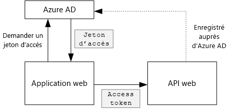
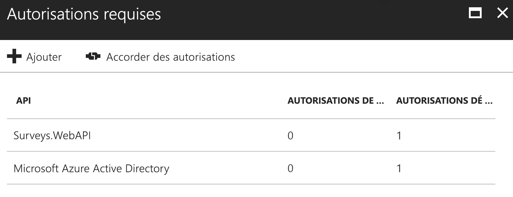

# <a name="secure-a-backend-web-api"></a><span data-ttu-id="283e2-103">Sécuriser une API web principale</span><span class="sxs-lookup"><span data-stu-id="283e2-103">Secure a backend web API</span></span>

<span data-ttu-id="283e2-104">[ Exemple de code][sample application]</span><span class="sxs-lookup"><span data-stu-id="283e2-104">[ Sample code][sample application]</span></span>

<span data-ttu-id="283e2-105">L’application [Surveys de Tailspin] utilise une API web de serveur principal pour gérer les opérations CRUD sur les enquêtes.</span><span class="sxs-lookup"><span data-stu-id="283e2-105">The [Tailspin Surveys] application uses a backend web API to manage CRUD operations on surveys.</span></span> <span data-ttu-id="283e2-106">Par exemple, quand un utilisateur clique sur « My Surveys », l’application web envoie une requête HTTP à l’API web :</span><span class="sxs-lookup"><span data-stu-id="283e2-106">For example, when a user clicks "My Surveys", the web application sends an HTTP request to the web API:</span></span>

```http
GET /users/{userId}/surveys
```

<span data-ttu-id="283e2-107">L’API web renvoie un objet JSON :</span><span class="sxs-lookup"><span data-stu-id="283e2-107">The web API returns a JSON object:</span></span>

```http
{
  "Published":[],
  "Own":[
    {"Id":1,"Title":"Survey 1"},
    {"Id":3,"Title":"Survey 3"},
    ],
  "Contribute": [{"Id":8,"Title":"My survey"}]
}
```

<span data-ttu-id="283e2-108">Comme l’API web n’autorise pas les requêtes anonymes, l’application web doit s’authentifier à l’aide des jetons du porteur OAuth 2.</span><span class="sxs-lookup"><span data-stu-id="283e2-108">The web API does not allow anonymous requests, so the web app must authenticate itself using OAuth 2 bearer tokens.</span></span>

> [!NOTE]
> <span data-ttu-id="283e2-109">Il s’agit d’un scénario serveur à serveur.</span><span class="sxs-lookup"><span data-stu-id="283e2-109">This is a server-to-server scenario.</span></span> <span data-ttu-id="283e2-110">L’application ne fait aucun appel AJAX à l’API à partir du client navigateur.</span><span class="sxs-lookup"><span data-stu-id="283e2-110">The application does not make any AJAX calls to the API from the browser client.</span></span>

<span data-ttu-id="283e2-111">Il existe deux approches principales possibles :</span><span class="sxs-lookup"><span data-stu-id="283e2-111">There are two main approaches you can take:</span></span>

* <span data-ttu-id="283e2-112">Identité d’utilisateur délégué.</span><span class="sxs-lookup"><span data-stu-id="283e2-112">Delegated user identity.</span></span> <span data-ttu-id="283e2-113">L’application web s’authentifie avec l’identité de l’utilisateur.</span><span class="sxs-lookup"><span data-stu-id="283e2-113">The web application authenticates with the user's identity.</span></span>
* <span data-ttu-id="283e2-114">Identité d’application.</span><span class="sxs-lookup"><span data-stu-id="283e2-114">Application identity.</span></span> <span data-ttu-id="283e2-115">L’application web s’authentifie avec son ID client, à l’aide du flux d’informations d’identification du client OAuth2.</span><span class="sxs-lookup"><span data-stu-id="283e2-115">The web application authenticates with its client ID, using OAuth2 client credential flow.</span></span>

<span data-ttu-id="283e2-116">L’application de Tailspin implémente l’identité d’utilisateur délégué.</span><span class="sxs-lookup"><span data-stu-id="283e2-116">The Tailspin application implements delegated user identity.</span></span> <span data-ttu-id="283e2-117">Voici les principales différences :</span><span class="sxs-lookup"><span data-stu-id="283e2-117">Here are the main differences:</span></span>

<span data-ttu-id="283e2-118">**Identité d’utilisateur délégué :**</span><span class="sxs-lookup"><span data-stu-id="283e2-118">**Delegated user identity:**</span></span>

* <span data-ttu-id="283e2-119">Le jeton du porteur envoyé à l’API web contient l’identité de l’utilisateur.</span><span class="sxs-lookup"><span data-stu-id="283e2-119">The bearer token sent to the web API contains the user identity.</span></span>
* <span data-ttu-id="283e2-120">L’API web prend des décisions d’autorisation basées sur l’identité de l’utilisateur.</span><span class="sxs-lookup"><span data-stu-id="283e2-120">The web API makes authorization decisions based on the user identity.</span></span>
* <span data-ttu-id="283e2-121">L’application web doit gérer les erreurs 403 (Refusé) à partir de l’API web, si l’utilisateur n’est pas autorisé à effectuer une action.</span><span class="sxs-lookup"><span data-stu-id="283e2-121">The web application needs to handle 403 (Forbidden) errors from the web API, if the user is not authorized to perform an action.</span></span>
* <span data-ttu-id="283e2-122">En général, l’application web prend toujours des décisions d’autorisation qui affectent l’interface utilisateur, comme l’affichage ou le masquage des éléments d’interface utilisateur).</span><span class="sxs-lookup"><span data-stu-id="283e2-122">Typically, the web application still makes some authorization decisions that affect UI, such as showing or hiding UI elements).</span></span>
* <span data-ttu-id="283e2-123">L’API web peut potentiellement être utilisée par des clients non approuvés, comme une application JavaScript ou une application cliente native.</span><span class="sxs-lookup"><span data-stu-id="283e2-123">The web API can potentially be used by untrusted clients, such as a JavaScript application or a native client application.</span></span>

<span data-ttu-id="283e2-124">**Identité d’application :**</span><span class="sxs-lookup"><span data-stu-id="283e2-124">**Application identity:**</span></span>

* <span data-ttu-id="283e2-125">L’API web n’obtient pas d’informations sur l’utilisateur.</span><span class="sxs-lookup"><span data-stu-id="283e2-125">The web API does not get information about the user.</span></span>
* <span data-ttu-id="283e2-126">L’API web ne peut déclarer aucune autorisation basée sur l’identité de l’utilisateur.</span><span class="sxs-lookup"><span data-stu-id="283e2-126">The web API cannot perform any authorization based on the user identity.</span></span> <span data-ttu-id="283e2-127">Toutes les décisions d’autorisation sont prises par l’application web.</span><span class="sxs-lookup"><span data-stu-id="283e2-127">All authorization decisions are made by the web application.</span></span>  
* <span data-ttu-id="283e2-128">L’API web ne peut pas être utilisée par un client non approuvé (application JavaScript ou cliente native).</span><span class="sxs-lookup"><span data-stu-id="283e2-128">The web API cannot be used by an untrusted client (JavaScript or native client application).</span></span>
* <span data-ttu-id="283e2-129">Cette approche peut être un peu plus simple à implémenter, car il n’existe aucune logique d’autorisation dans l’API web.</span><span class="sxs-lookup"><span data-stu-id="283e2-129">This approach may be somewhat simpler to implement, because there is no authorization logic in the Web API.</span></span>

<span data-ttu-id="283e2-130">Dans les deux approches, l’application web doit obtenir un jeton d’accès, qui correspond aux informations d’identification nécessaires pour appeler l’API web.</span><span class="sxs-lookup"><span data-stu-id="283e2-130">In either approach, the web application must get an access token, which is the credential needed to call the web API.</span></span>

* <span data-ttu-id="283e2-131">Pour l’identité d’utilisateur délégué, le jeton doit provenir d’un fournisseur d’identité, qui peut émettre un jeton pour le compte de l’utilisateur.</span><span class="sxs-lookup"><span data-stu-id="283e2-131">For delegated user identity, the token has to come from the IDP, which can issue a token on behalf of the user.</span></span>
* <span data-ttu-id="283e2-132">Pour les informations d’identification du client, une application peut obtenir le jeton à partir de l’IDP ou héberger son propre serveur de jetons.</span><span class="sxs-lookup"><span data-stu-id="283e2-132">For client credentials, an application might get the token from the IDP or host its own token server.</span></span> <span data-ttu-id="283e2-133">(Mais n’écrivez pas un serveur de jetons à partir de zéro ; utilisez une infrastructure bien testée comme [IdentityServer4].) Si vous vous authentifiez avec d’Azure AD, il est vivement recommandé pour obtenir le jeton d’accès auprès d’Azure AD, même avec les flux d’informations d’identification du client.</span><span class="sxs-lookup"><span data-stu-id="283e2-133">(But don't write a token server from scratch; use a well-tested framework like [IdentityServer4].) If you authenticate with Azure AD, it's strongly recommended to get the access token from Azure AD, even with client credential flow.</span></span>

<span data-ttu-id="283e2-134">Le reste de cet article part du principe que l’application s’authentifie auprès d’Azure AD.</span><span class="sxs-lookup"><span data-stu-id="283e2-134">The rest of this article assumes the application is authenticating with Azure AD.</span></span>



## <a name="register-the-web-api-in-azure-ad"></a><span data-ttu-id="283e2-136">Inscription de l’API web dans Azure AD</span><span class="sxs-lookup"><span data-stu-id="283e2-136">Register the web API in Azure AD</span></span>

<span data-ttu-id="283e2-137">Pour qu’Azure AD émette un jeton du porteur pour l’API web, vous devez configurer certains paramètres dans Azure AD.</span><span class="sxs-lookup"><span data-stu-id="283e2-137">In order for Azure AD to issue a bearer token for the web API, you need to configure some things in Azure AD.</span></span>

1. <span data-ttu-id="283e2-138">Inscrivez l’API web dans Azure AD.</span><span class="sxs-lookup"><span data-stu-id="283e2-138">Register the web API in Azure AD.</span></span>

2. <span data-ttu-id="283e2-139">Ajoutez l’ID client de l’application web au manifeste d’application de l’API web, dans la propriété `knownClientApplications` .</span><span class="sxs-lookup"><span data-stu-id="283e2-139">Add the client ID of the web app to the web API application manifest, in the `knownClientApplications` property.</span></span> <span data-ttu-id="283e2-140">Consultez la page [Mettre à jour les manifestes de l’application].</span><span class="sxs-lookup"><span data-stu-id="283e2-140">See [Update the application manifests].</span></span>

3. <span data-ttu-id="283e2-141">Donnez à l’application web l’autorisation d’appeler l’API web.</span><span class="sxs-lookup"><span data-stu-id="283e2-141">Give the web application permission to call the web API.</span></span> <span data-ttu-id="283e2-142">Dans le Portail de gestion Azure, vous pouvez définir deux types d’autorisation : les « autorisations d’application » pour l’identité d’application (flux d’informations d’identification du client) ou les « autorisations déléguées » pour l’identité d’utilisateur délégué.</span><span class="sxs-lookup"><span data-stu-id="283e2-142">In the Azure Management Portal, you can set two types of permissions: "Application Permissions" for application identity (client credential flow), or "Delegated Permissions" for delegated user identity.</span></span>

   

## <a name="getting-an-access-token"></a><span data-ttu-id="283e2-144">Obtention d’un jeton d’accès</span><span class="sxs-lookup"><span data-stu-id="283e2-144">Getting an access token</span></span>

<span data-ttu-id="283e2-145">Avant d’appeler l’API web, l’application web obtient un jeton d’accès à partir d’Azure AD.</span><span class="sxs-lookup"><span data-stu-id="283e2-145">Before calling the web API, the web application gets an access token from Azure AD.</span></span> <span data-ttu-id="283e2-146">Dans une application .NET, utilisez la [bibliothèque d’authentification Azure AD (ADAL) pour .NET][ADAL].</span><span class="sxs-lookup"><span data-stu-id="283e2-146">In a .NET application, use the [Azure AD Authentication Library (ADAL) for .NET][ADAL].</span></span>

<span data-ttu-id="283e2-147">Dans le flux du code d’autorisation OAuth 2, l’application échange un code d’autorisation contre un jeton d’accès.</span><span class="sxs-lookup"><span data-stu-id="283e2-147">In the OAuth 2 authorization code flow, the application exchanges an authorization code for an access token.</span></span> <span data-ttu-id="283e2-148">Le code suivant utilise la bibliothèque ADAL pour obtenir le jeton d’accès.</span><span class="sxs-lookup"><span data-stu-id="283e2-148">The following code uses ADAL to get the access token.</span></span> <span data-ttu-id="283e2-149">Ce code est appelé pendant l’événement `AuthorizationCodeReceived` .</span><span class="sxs-lookup"><span data-stu-id="283e2-149">This code is called during the `AuthorizationCodeReceived` event.</span></span>

```csharp
// The OpenID Connect middleware sends this event when it gets the authorization code.
public override async Task AuthorizationCodeReceived(AuthorizationCodeReceivedContext context)
{
    string authorizationCode = context.ProtocolMessage.Code;
    string authority = "https://login.microsoftonline.com/" + tenantID
    string resourceID = "https://tailspin.onmicrosoft.com/surveys.webapi" // App ID URI
    ClientCredential credential = new ClientCredential(clientId, clientSecret);

    AuthenticationContext authContext = new AuthenticationContext(authority, tokenCache);
    AuthenticationResult authResult = await authContext.AcquireTokenByAuthorizationCodeAsync(
        authorizationCode, new Uri(redirectUri), credential, resourceID);

    // If successful, the token is in authResult.AccessToken
}
```

<span data-ttu-id="283e2-150">Voici les différents paramètres qui sont nécessaires :</span><span class="sxs-lookup"><span data-stu-id="283e2-150">Here are the various parameters that are needed:</span></span>

* <span data-ttu-id="283e2-151">`authority`.</span><span class="sxs-lookup"><span data-stu-id="283e2-151">`authority`.</span></span> <span data-ttu-id="283e2-152">Dérivé de l’ID de locataire de l’utilisateur connecté.</span><span class="sxs-lookup"><span data-stu-id="283e2-152">Derived from the tenant ID of the signed in user.</span></span> <span data-ttu-id="283e2-153">(Pas l’ID de locataire du fournisseur SaaS)</span><span class="sxs-lookup"><span data-stu-id="283e2-153">(Not the tenant ID of the SaaS provider)</span></span>  
* <span data-ttu-id="283e2-154">`authorizationCode`.</span><span class="sxs-lookup"><span data-stu-id="283e2-154">`authorizationCode`.</span></span> <span data-ttu-id="283e2-155">Code d’authentification que vous avez obtenu du fournisseur d’identité.</span><span class="sxs-lookup"><span data-stu-id="283e2-155">the auth code that you got back from the IDP.</span></span>
* <span data-ttu-id="283e2-156">`clientId`.</span><span class="sxs-lookup"><span data-stu-id="283e2-156">`clientId`.</span></span> <span data-ttu-id="283e2-157">ID client de l’application web.</span><span class="sxs-lookup"><span data-stu-id="283e2-157">The web application's client ID.</span></span>
* <span data-ttu-id="283e2-158">`clientSecret`.</span><span class="sxs-lookup"><span data-stu-id="283e2-158">`clientSecret`.</span></span> <span data-ttu-id="283e2-159">Clé secrète client de l’application web.</span><span class="sxs-lookup"><span data-stu-id="283e2-159">The web application's client secret.</span></span>
* <span data-ttu-id="283e2-160">`redirectUri`.</span><span class="sxs-lookup"><span data-stu-id="283e2-160">`redirectUri`.</span></span> <span data-ttu-id="283e2-161">URI de redirection que vous définissez pour OpenID Connect.</span><span class="sxs-lookup"><span data-stu-id="283e2-161">The redirect URI that you set for OpenID connect.</span></span> <span data-ttu-id="283e2-162">Il s’agit de l’endroit où le fournisseur d’identité rappelle avec le jeton.</span><span class="sxs-lookup"><span data-stu-id="283e2-162">This is where the IDP calls back with the token.</span></span>
* <span data-ttu-id="283e2-163">`resourceID`.</span><span class="sxs-lookup"><span data-stu-id="283e2-163">`resourceID`.</span></span> <span data-ttu-id="283e2-164">URI d’ID d’application de l’API web, que vous avez créé quand vous avez inscrit l’API web dans Azure AD.</span><span class="sxs-lookup"><span data-stu-id="283e2-164">The App ID URI of the web API, which you created when you registered the web API in Azure AD</span></span>
* <span data-ttu-id="283e2-165">`tokenCache`.</span><span class="sxs-lookup"><span data-stu-id="283e2-165">`tokenCache`.</span></span> <span data-ttu-id="283e2-166">Objet qui met en cache les jetons d’accès.</span><span class="sxs-lookup"><span data-stu-id="283e2-166">An object that caches the access tokens.</span></span> <span data-ttu-id="283e2-167">Consultez la page [Mise en cache de jeton].</span><span class="sxs-lookup"><span data-stu-id="283e2-167">See [Token caching].</span></span>

<span data-ttu-id="283e2-168">Si `AcquireTokenByAuthorizationCodeAsync` réussit, la bibliothèque ADAL met en cache le jeton.</span><span class="sxs-lookup"><span data-stu-id="283e2-168">If `AcquireTokenByAuthorizationCodeAsync` succeeds, ADAL caches the token.</span></span> <span data-ttu-id="283e2-169">Vous pouvez obtenir ultérieurement le jeton à partir du cache en appelant AcquireTokenSilentAsync :</span><span class="sxs-lookup"><span data-stu-id="283e2-169">Later, you can get the token from the cache by calling AcquireTokenSilentAsync:</span></span>

```csharp
AuthenticationContext authContext = new AuthenticationContext(authority, tokenCache);
var result = await authContext.AcquireTokenSilentAsync(resourceID, credential, new UserIdentifier(userId, UserIdentifierType.UniqueId));
```

<span data-ttu-id="283e2-170">où `userId` est l’ID d’objet de l’utilisateur, qui se trouve dans la revendication `http://schemas.microsoft.com/identity/claims/objectidentifier`.</span><span class="sxs-lookup"><span data-stu-id="283e2-170">where `userId` is the user's object ID, which is found in the `http://schemas.microsoft.com/identity/claims/objectidentifier` claim.</span></span>

## <a name="using-the-access-token-to-call-the-web-api"></a><span data-ttu-id="283e2-171">Utilisation du jeton d’accès pour appeler l’API web.</span><span class="sxs-lookup"><span data-stu-id="283e2-171">Using the access token to call the web API</span></span>

<span data-ttu-id="283e2-172">Une fois que vous avez le jeton, envoyez-le dans l’en-tête d’autorisation des requêtes HTTP à l’API web.</span><span class="sxs-lookup"><span data-stu-id="283e2-172">Once you have the token, send it in the Authorization header of the HTTP requests to the web API.</span></span>

```http
Authorization: Bearer xxxxxxxxxx
```

<span data-ttu-id="283e2-173">La méthode d’extension suivante de l’application Surveys définit l’en-tête d’autorisation sur une requête HTTP, à l’aide de la classe **HttpClient** .</span><span class="sxs-lookup"><span data-stu-id="283e2-173">The following extension method from the Surveys application sets the Authorization header on an HTTP request, using the **HttpClient** class.</span></span>

```csharp
public static async Task<HttpResponseMessage> SendRequestWithBearerTokenAsync(this HttpClient httpClient, HttpMethod method, string path, object requestBody, string accessToken, CancellationToken ct)
{
    var request = new HttpRequestMessage(method, path);
    if (requestBody != null)
    {
        var json = JsonConvert.SerializeObject(requestBody, Formatting.None);
        var content = new StringContent(json, Encoding.UTF8, "application/json");
        request.Content = content;
    }

    request.Headers.Authorization = new AuthenticationHeaderValue("Bearer", accessToken);
    request.Headers.Accept.Add(new MediaTypeWithQualityHeaderValue("application/json"));

    var response = await httpClient.SendAsync(request, ct);
    return response;
}
```

## <a name="authenticating-in-the-web-api"></a><span data-ttu-id="283e2-174">Authentification dans l’API web</span><span class="sxs-lookup"><span data-stu-id="283e2-174">Authenticating in the web API</span></span>

<span data-ttu-id="283e2-175">L’API web doit authentifier le jeton du porteur.</span><span class="sxs-lookup"><span data-stu-id="283e2-175">The web API has to authenticate the bearer token.</span></span> <span data-ttu-id="283e2-176">Dans ASP.NET Core, vous pouvez utiliser le package [Microsoft.AspNet.Authentication.JwtBearer][JwtBearer].</span><span class="sxs-lookup"><span data-stu-id="283e2-176">In ASP.NET Core, you can use the [Microsoft.AspNet.Authentication.JwtBearer][JwtBearer] package.</span></span> <span data-ttu-id="283e2-177">Ce package fournit un middleware qui permet à l’application de recevoir des jetons de porteur OpenID Connect.</span><span class="sxs-lookup"><span data-stu-id="283e2-177">This package provides middleware that enables the application to receive OpenID Connect bearer tokens.</span></span>

<span data-ttu-id="283e2-178">Inscrivez le middleware dans la classe `Startup` de votre API web.</span><span class="sxs-lookup"><span data-stu-id="283e2-178">Register the middleware in your web API `Startup` class.</span></span>

```csharp
public void Configure(IApplicationBuilder app, IHostingEnvironment env, ApplicationDbContext dbContext, ILoggerFactory loggerFactory)
{
    // ...

    app.UseJwtBearerAuthentication(new JwtBearerOptions {
        Audience = configOptions.AzureAd.WebApiResourceId,
        Authority = Constants.AuthEndpointPrefix,
        TokenValidationParameters = new TokenValidationParameters {
            ValidateIssuer = false
        },
        Events= new SurveysJwtBearerEvents(loggerFactory.CreateLogger<SurveysJwtBearerEvents>())
    });

    // ...
}
```

* <span data-ttu-id="283e2-179">**Audience**.</span><span class="sxs-lookup"><span data-stu-id="283e2-179">**Audience**.</span></span> <span data-ttu-id="283e2-180">Affectez à ce paramètre l’URL d’ID d’application de l’API web que vous avez créée quand vous avez inscrit l’API web dans Azure AD.</span><span class="sxs-lookup"><span data-stu-id="283e2-180">Set this to the App ID URL for the web API, which you created when you registered the web API with Azure AD.</span></span>
* <span data-ttu-id="283e2-181">**Authority**.</span><span class="sxs-lookup"><span data-stu-id="283e2-181">**Authority**.</span></span> <span data-ttu-id="283e2-182">Pour une application mutualisée, définissez ce paramètre sur `https://login.microsoftonline.com/common/`.</span><span class="sxs-lookup"><span data-stu-id="283e2-182">For a multitenant application, set this to `https://login.microsoftonline.com/common/`.</span></span>
* <span data-ttu-id="283e2-183">**TokenValidationParameters**.</span><span class="sxs-lookup"><span data-stu-id="283e2-183">**TokenValidationParameters**.</span></span> <span data-ttu-id="283e2-184">Pour une application multi-locataire, définissez **ValidateIssuer** sur la valeur False.</span><span class="sxs-lookup"><span data-stu-id="283e2-184">For a multitenant application, set **ValidateIssuer** to false.</span></span> <span data-ttu-id="283e2-185">Cela signifie que l’application validera l’émetteur.</span><span class="sxs-lookup"><span data-stu-id="283e2-185">That means the application will validate the issuer.</span></span>
* <span data-ttu-id="283e2-186">**Events** est une classe dérivée de **JwtBearerEvents**.</span><span class="sxs-lookup"><span data-stu-id="283e2-186">**Events** is a class that derives from **JwtBearerEvents**.</span></span>

### <a name="issuer-validation"></a><span data-ttu-id="283e2-187">Validation de l’émetteur</span><span class="sxs-lookup"><span data-stu-id="283e2-187">Issuer validation</span></span>

<span data-ttu-id="283e2-188">Validez l’émetteur du jeton dans l’événement **JwtBearerEvents.TokenValidated**.</span><span class="sxs-lookup"><span data-stu-id="283e2-188">Validate the token issuer in the **JwtBearerEvents.TokenValidated** event.</span></span> <span data-ttu-id="283e2-189">L’émetteur est envoyé dans la revendication « iss ».</span><span class="sxs-lookup"><span data-stu-id="283e2-189">The issuer is sent in the "iss" claim.</span></span>

<span data-ttu-id="283e2-190">Dans l’application Surveys, l’API web ne gère pas [l’inscription du locataire].</span><span class="sxs-lookup"><span data-stu-id="283e2-190">In the Surveys application, the web API doesn't handle [tenant sign-up].</span></span> <span data-ttu-id="283e2-191">Par conséquent, elle vérifie uniquement si l’émetteur se trouve déjà dans la base de données de l’application.</span><span class="sxs-lookup"><span data-stu-id="283e2-191">Therefore, it just checks if the issuer is already in the application database.</span></span> <span data-ttu-id="283e2-192">Si ce n’est pas le cas, elle lève une exception, ce qui provoque l’échec de l’authentification.</span><span class="sxs-lookup"><span data-stu-id="283e2-192">If not, it throws an exception, which causes authentication to fail.</span></span>

```csharp
public override async Task TokenValidated(TokenValidatedContext context)
{
    var principal = context.Ticket.Principal;
    var tenantManager = context.HttpContext.RequestServices.GetService<TenantManager>();
    var userManager = context.HttpContext.RequestServices.GetService<UserManager>();
    var issuerValue = principal.GetIssuerValue();
    var tenant = await tenantManager.FindByIssuerValueAsync(issuerValue);

    if (tenant == null)
    {
        // The caller was not from a trusted issuer. Throw to block the authentication flow.
        throw new SecurityTokenValidationException();
    }

    var identity = principal.Identities.First();

    // Add new claim for survey_userid
    var registeredUser = await userManager.FindByObjectIdentifier(principal.GetObjectIdentifierValue());
    identity.AddClaim(new Claim(SurveyClaimTypes.SurveyUserIdClaimType, registeredUser.Id.ToString()));
    identity.AddClaim(new Claim(SurveyClaimTypes.SurveyTenantIdClaimType, registeredUser.TenantId.ToString()));

    // Add new claim for Email
    var email = principal.FindFirst(ClaimTypes.Upn)?.Value;
    if (!string.IsNullOrWhiteSpace(email))
    {
        identity.AddClaim(new Claim(ClaimTypes.Email, email));
    }
}
```

<span data-ttu-id="283e2-193">Comme le montre cet exemple, vous pouvez également utiliser l’événement **TokenValidated** pour modifier les revendications.</span><span class="sxs-lookup"><span data-stu-id="283e2-193">As this example shows, you can also use the **TokenValidated** event to modify the claims.</span></span> <span data-ttu-id="283e2-194">N’oubliez pas que les revendications proviennent directement d’Azure AD.</span><span class="sxs-lookup"><span data-stu-id="283e2-194">Remember that the claims come directly from Azure AD.</span></span> <span data-ttu-id="283e2-195">Si l’application web modifie les revendications qu’elle obtient, ces modifications n’apparaîtront pas dans le jeton du porteur reçu par l’API web.</span><span class="sxs-lookup"><span data-stu-id="283e2-195">If the web application modifies the claims that it gets, those changes won't show up in the bearer token that the web API receives.</span></span> <span data-ttu-id="283e2-196">Pour plus d’informations, voir [Transformations de revendications][claims-transformation].</span><span class="sxs-lookup"><span data-stu-id="283e2-196">For more information, see [Claims transformations][claims-transformation].</span></span>

## <a name="authorization"></a><span data-ttu-id="283e2-197">Authorization</span><span class="sxs-lookup"><span data-stu-id="283e2-197">Authorization</span></span>

<span data-ttu-id="283e2-198">Pour obtenir une description générale de l’autorisation, voir [Autorisation basée sur les ressources et les rôles][Authorization].</span><span class="sxs-lookup"><span data-stu-id="283e2-198">For a general discussion of authorization, see [Role-based and resource-based authorization][Authorization].</span></span>

<span data-ttu-id="283e2-199">L’intergiciel (middleware) JwtBearer gère les réponses d’autorisation.</span><span class="sxs-lookup"><span data-stu-id="283e2-199">The JwtBearer middleware handles the authorization responses.</span></span> <span data-ttu-id="283e2-200">Par exemple, pour limiter une action de contrôleur aux seuls utilisateurs authentifiés, utilisez l’attribut **[Authorize]** et spécifiez **JwtBearerDefaults.AuthenticationScheme** en tant que schéma d’authentification :</span><span class="sxs-lookup"><span data-stu-id="283e2-200">For example, to restrict a controller action to authenticated users, use the **[Authorize]** atrribute and specify **JwtBearerDefaults.AuthenticationScheme** as the authentication scheme:</span></span>

```csharp
[Authorize(ActiveAuthenticationSchemes = JwtBearerDefaults.AuthenticationScheme)]
```

<span data-ttu-id="283e2-201">Cela renvoie un code d’état 401 si l’utilisateur n’est pas authentifié.</span><span class="sxs-lookup"><span data-stu-id="283e2-201">This returns a 401 status code if the user is not authenticated.</span></span>

<span data-ttu-id="283e2-202">Pour restreindre une action de contrôleur en fonction de la stratégie d’autorisation, spécifiez le nom de la stratégie dans l’attribut **[Authorize]**  :</span><span class="sxs-lookup"><span data-stu-id="283e2-202">To restrict a controller action by authorizaton policy, specify the policy name in the **[Authorize]** attribute:</span></span>

```csharp
[Authorize(Policy = PolicyNames.RequireSurveyCreator)]
```

<span data-ttu-id="283e2-203">Cela renvoie un code d’état 401 si l’utilisateur n’est pas authentifié, et 403 si l’utilisateur est authentifié mais non autorisé.</span><span class="sxs-lookup"><span data-stu-id="283e2-203">This returns a 401 status code if the user is not authenticated, and 403 if the user is authenticated but not authorized.</span></span> <span data-ttu-id="283e2-204">Inscrivez la stratégie au démarrage :</span><span class="sxs-lookup"><span data-stu-id="283e2-204">Register the policy on startup:</span></span>

```csharp
public void ConfigureServices(IServiceCollection services)
{
    services.AddAuthorization(options =>
    {
        options.AddPolicy(PolicyNames.RequireSurveyCreator,
            policy =>
            {
                policy.AddRequirements(new SurveyCreatorRequirement());
                policy.RequireAuthenticatedUser(); // Adds DenyAnonymousAuthorizationRequirement
                policy.AddAuthenticationSchemes(JwtBearerDefaults.AuthenticationScheme);
            });
        options.AddPolicy(PolicyNames.RequireSurveyAdmin,
            policy =>
            {
                policy.AddRequirements(new SurveyAdminRequirement());
                policy.RequireAuthenticatedUser(); // Adds DenyAnonymousAuthorizationRequirement
                policy.AddAuthenticationSchemes(JwtBearerDefaults.AuthenticationScheme);
            });
    });

    // ...
}
```

<span data-ttu-id="283e2-205">[**Suivant**][token cache]</span><span class="sxs-lookup"><span data-stu-id="283e2-205">[**Next**][token cache]</span></span>

<!-- links -->
[ADAL]: https://msdn.microsoft.com/library/azure/jj573266.aspx
[JwtBearer]: https://www.nuget.org/packages/Microsoft.AspNet.Authentication.JwtBearer

[Surveys de Tailspin]: tailspin.md
[Tailspin Surveys]: tailspin.md
[IdentityServer4]: https://github.com/IdentityServer/IdentityServer4
[Mettre à jour les manifestes de l’application]: ./run-the-app.md#update-the-application-manifests
[Update the application manifests]: ./run-the-app.md#update-the-application-manifests
[Mise en cache de jeton]: token-cache.md
[Token caching]: token-cache.md
[l’inscription du locataire]: signup.md
[tenant sign-up]: signup.md
[claims-transformation]: claims.md#claims-transformations
[Authorization]: authorize.md
[sample application]: https://github.com/mspnp/multitenant-saas-guidance
[token cache]: token-cache.md
