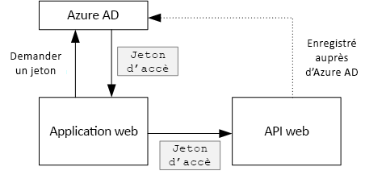

# <a name="secure-a-backend-web-api"></a>Sécuriser une API web principale

[ Exemple de code][sample application]

L’application [Tailspin Surveys] utilise une API web de serveur principal pour gérer les opérations CRUD sur les enquêtes. Par exemple, quand un utilisateur clique sur « My Surveys », l’application web envoie une requête HTTP à l’API web :

```
GET /users/{userId}/surveys
```

L’API web renvoie un objet JSON :

```
{
  "Published":[],
  "Own":[
    {"Id":1,"Title":"Survey 1"},
    {"Id":3,"Title":"Survey 3"},
    ],
  "Contribute": [{"Id":8,"Title":"My survey"}]
}
```

Comme l’API web n’autorise pas les requêtes anonymes, l’application web doit s’authentifier à l’aide des jetons du porteur OAuth 2.

> [!NOTE]
> Il s’agit d’un scénario serveur à serveur. L’application ne fait aucun appel AJAX à l’API à partir du client navigateur.
> 
> 

Il existe deux approches principales possibles :

* Identité d’utilisateur délégué. L’application web s’authentifie avec l’identité de l’utilisateur.
* Identité d’application. L’application web s’authentifie avec son ID client, à l’aide du flux d’informations d’identification du client OAuth2.

L’application de Tailspin implémente l’identité d’utilisateur délégué. Voici les principales différences :

**Identité d’utilisateur délégué**

* Le jeton du porteur envoyé à l’API web contient l’identité de l’utilisateur.
* L’API web prend des décisions d’autorisation basées sur l’identité de l’utilisateur.
* L’application web doit gérer les erreurs 403 (Refusé) à partir de l’API web, si l’utilisateur n’est pas autorisé à effectuer une action.
* En général, l’application web prend toujours des décisions d’autorisation qui affectent l’interface utilisateur, comme l’affichage ou le masquage des éléments d’interface utilisateur).
* L’API web peut potentiellement être utilisée par des clients non approuvés, comme une application JavaScript ou une application cliente native.

**Identité d’application**

* L’API web n’obtient pas d’informations sur l’utilisateur.
* L’API web ne peut déclarer aucune autorisation basée sur l’identité de l’utilisateur. Toutes les décisions d’autorisation sont prises par l’application web.  
* L’API web ne peut pas être utilisée par un client non approuvé (application JavaScript ou cliente native).
* Cette approche peut être un peu plus simple à implémenter, car il n’existe aucune logique d’autorisation dans l’API web.

Dans les deux approches, l’application web doit obtenir un jeton d’accès, qui correspond aux informations d’identification nécessaires pour appeler l’API web.

* Pour l’identité d’utilisateur délégué, le jeton doit provenir d’un fournisseur d’identité, qui peut émettre un jeton pour le compte de l’utilisateur.
* Pour les informations d’identification du client, une application peut obtenir le jeton à partir de l’IDP ou héberger son propre serveur de jetons. (Mais n’écrivez pas un serveur de jetons à partir de zéro ; utilisez une infrastructure bien testée comme [IdentityServer4].) Si vous vous authentifiez avec d’Azure AD, il est vivement recommandé pour obtenir le jeton d’accès auprès d’Azure AD, même avec les flux d’informations d’identification du client.

Le reste de cet article part du principe que l’application s’authentifie auprès d’Azure AD.



## <a name="register-the-web-api-in-azure-ad"></a>Inscription de l’API web dans Azure AD
Pour qu’Azure AD émette un jeton du porteur pour l’API web, vous devez configurer certains paramètres dans Azure AD.

1. Inscrivez l’API web dans Azure AD.

2. Ajoutez l’ID client de l’application web au manifeste d’application de l’API web, dans la propriété `knownClientApplications` . Consultez la page [Mettre à jour les manifestes de l’application].

3. Donnez à l’application web l’autorisation d’appeler l’API web. Dans le portail de gestion Azure, vous pouvez définir deux types d’autorisations : les « autorisations d’application » pour l’identité d’application (flux d’informations d’identification du client) ou les « autorisations déléguées » pour l’identité d’utilisateur délégué.
   
   

## <a name="getting-an-access-token"></a>Obtention d’un jeton d’accès
Avant d’appeler l’API web, l’application web obtient un jeton d’accès à partir d’Azure AD. Dans une application .NET, utilisez la [bibliothèque d’authentification Azure AD (ADAL) pour .NET][ADAL].

Dans le flux du code d’autorisation OAuth 2, l’application échange un code d’autorisation contre un jeton d’accès. Le code suivant utilise la bibliothèque ADAL pour obtenir le jeton d’accès. Ce code est appelé pendant l’événement `AuthorizationCodeReceived` .

```csharp
// The OpenID Connect middleware sends this event when it gets the authorization code.   
public override async Task AuthorizationCodeReceived(AuthorizationCodeReceivedContext context)
{
    string authorizationCode = context.ProtocolMessage.Code;
    string authority = "https://login.microsoftonline.com/" + tenantID
    string resourceID = "https://tailspin.onmicrosoft.com/surveys.webapi" // App ID URI
    ClientCredential credential = new ClientCredential(clientId, clientSecret);

    AuthenticationContext authContext = new AuthenticationContext(authority, tokenCache);
    AuthenticationResult authResult = await authContext.AcquireTokenByAuthorizationCodeAsync(
        authorizationCode, new Uri(redirectUri), credential, resourceID);

    // If successful, the token is in authResult.AccessToken
}
```

Voici les différents paramètres qui sont nécessaires :

* `authority`. Dérivé de l’ID de locataire de l’utilisateur connecté. (Pas l’ID de locataire du fournisseur SaaS)  
* `authorizationCode`. Code d’authentification que vous avez obtenu du fournisseur d’identité.
* `clientId`. ID client de l’application web.
* `clientSecret`. Clé secrète client de l’application web.
* `redirectUri`. URI de redirection que vous définissez pour OpenID Connect. Il s’agit de l’endroit où le fournisseur d’identité rappelle avec le jeton.
* `resourceID`. URI d’ID d’application de l’API web, que vous avez créé quand vous avez inscrit l’API web dans Azure AD.
* `tokenCache`. Objet qui met en cache les jetons d’accès. Consultez la page [Mise en cache de jeton].

Si `AcquireTokenByAuthorizationCodeAsync` réussit, la bibliothèque ADAL met en cache le jeton. Vous pouvez obtenir ultérieurement le jeton à partir du cache en appelant AcquireTokenSilentAsync :

```csharp
AuthenticationContext authContext = new AuthenticationContext(authority, tokenCache);
var result = await authContext.AcquireTokenSilentAsync(resourceID, credential, new UserIdentifier(userId, UserIdentifierType.UniqueId));
```

où `userId` est l’ID d’objet de l’utilisateur, qui se trouve dans la revendication `http://schemas.microsoft.com/identity/claims/objectidentifier`.

## <a name="using-the-access-token-to-call-the-web-api"></a>Utilisation du jeton d’accès pour appeler l’API web.
Une fois que vous avez le jeton, envoyez-le dans l’en-tête d’autorisation des requêtes HTTP à l’API web.

```
Authorization: Bearer xxxxxxxxxx
```

La méthode d’extension suivante de l’application Surveys définit l’en-tête d’autorisation sur une requête HTTP, à l’aide de la classe **HttpClient** .

```csharp
public static async Task<HttpResponseMessage> SendRequestWithBearerTokenAsync(this HttpClient httpClient, HttpMethod method, string path, object requestBody, string accessToken, CancellationToken ct)
{
    var request = new HttpRequestMessage(method, path);
    if (requestBody != null)
    {
        var json = JsonConvert.SerializeObject(requestBody, Formatting.None);
        var content = new StringContent(json, Encoding.UTF8, "application/json");
        request.Content = content;
    }

    request.Headers.Authorization = new AuthenticationHeaderValue("Bearer", accessToken);
    request.Headers.Accept.Add(new MediaTypeWithQualityHeaderValue("application/json"));

    var response = await httpClient.SendAsync(request, ct);
    return response;
}
```

## <a name="authenticating-in-the-web-api"></a>Authentification dans l’API web
L’API web doit authentifier le jeton du porteur. Dans ASP.NET Core, vous pouvez utiliser le package [Microsoft.AspNet.Authentication.JwtBearer][JwtBearer]. Ce package fournit un middleware qui permet à l’application de recevoir des jetons de porteur OpenID Connect.

Inscrivez le middleware dans la classe `Startup` de votre API web.

```csharp
public void Configure(IApplicationBuilder app, IHostingEnvironment env, ApplicationDbContext dbContext, ILoggerFactory loggerFactory)
{
    // ...

    app.UseJwtBearerAuthentication(new JwtBearerOptions {
        Audience = configOptions.AzureAd.WebApiResourceId,
        Authority = Constants.AuthEndpointPrefix,
        TokenValidationParameters = new TokenValidationParameters {
            ValidateIssuer = false
        },
        Events= new SurveysJwtBearerEvents(loggerFactory.CreateLogger<SurveysJwtBearerEvents>())
    });
    
    // ...
}
```

* **Audience**. Affectez à ce paramètre l’URL d’ID d’application de l’API web que vous avez créée quand vous avez inscrit l’API web dans Azure AD.
* **Authority**. Pour une application mutualisée, définissez ce paramètre sur `https://login.microsoftonline.com/common/`.
* **TokenValidationParameters**. Pour une application multi-locataire, définissez **ValidateIssuer** sur la valeur False. Cela signifie que l’application validera l’émetteur.
* **Events** est une classe dérivée de **JwtBearerEvents**.

### <a name="issuer-validation"></a>Validation de l’émetteur
Validez l’émetteur du jeton dans l’événement **JwtBearerEvents.TokenValidated**. L’émetteur est envoyé dans la revendication « iss ».

Dans l’application Surveys, l’API web ne gère pas [Inscription du locataire]. Par conséquent, elle vérifie uniquement si l’émetteur se trouve déjà dans la base de données de l’application. Si ce n’est pas le cas, elle lève une exception, ce qui provoque l’échec de l’authentification.

```csharp
public override async Task TokenValidated(TokenValidatedContext context)
{
    var principal = context.Ticket.Principal;
    var tenantManager = context.HttpContext.RequestServices.GetService<TenantManager>();
    var userManager = context.HttpContext.RequestServices.GetService<UserManager>();
    var issuerValue = principal.GetIssuerValue();
    var tenant = await tenantManager.FindByIssuerValueAsync(issuerValue);

    if (tenant == null)
    {
        // The caller was not from a trusted issuer. Throw to block the authentication flow.
        throw new SecurityTokenValidationException();
    }

    var identity = principal.Identities.First();

    // Add new claim for survey_userid
    var registeredUser = await userManager.FindByObjectIdentifier(principal.GetObjectIdentifierValue());
    identity.AddClaim(new Claim(SurveyClaimTypes.SurveyUserIdClaimType, registeredUser.Id.ToString()));
    identity.AddClaim(new Claim(SurveyClaimTypes.SurveyTenantIdClaimType, registeredUser.TenantId.ToString()));

    // Add new claim for Email
    var email = principal.FindFirst(ClaimTypes.Upn)?.Value;
    if (!string.IsNullOrWhiteSpace(email))
    {
        identity.AddClaim(new Claim(ClaimTypes.Email, email));
    }
}
```

Comme le montre cet exemple, vous pouvez également utiliser l’événement **TokenValidated** pour modifier les revendications. N’oubliez pas que les revendications proviennent directement d’Azure AD. Si l’application web modifie les revendications qu’elle obtient, ces modifications n’apparaîtront pas dans le jeton du porteur reçu par l’API web. Pour plus d’informations, voir [Transformations de revendications][claims-transformation].

## <a name="authorization"></a>Authorization
Pour obtenir une description générale de l’autorisation, voir [Autorisation basée sur les ressources et les rôles][Authorization]. 

L’intergiciel (middleware) JwtBearer gère les réponses d’autorisation. Par exemple, pour limiter une action de contrôleur aux seuls utilisateurs authentifiés, utilisez l’attribut **[Authorize]** et spécifiez **JwtBearerDefaults.AuthenticationScheme** en tant que schéma d’authentification :

```csharp
[Authorize(ActiveAuthenticationSchemes = JwtBearerDefaults.AuthenticationScheme)]
```

Cela renvoie un code d’état 401 si l’utilisateur n’est pas authentifié.

Pour restreindre une action de contrôleur en fonction de la stratégie d’autorisation, spécifiez le nom de la stratégie dans l’attribut **[Authorize]**  :

```csharp
[Authorize(Policy = PolicyNames.RequireSurveyCreator)]
```

Cela renvoie un code d’état 401 si l’utilisateur n’est pas authentifié, et 403 si l’utilisateur est authentifié mais non autorisé. Inscrivez la stratégie au démarrage :

```csharp
public void ConfigureServices(IServiceCollection services)
{
    services.AddAuthorization(options =>
    {
        options.AddPolicy(PolicyNames.RequireSurveyCreator,
            policy =>
            {
                policy.AddRequirements(new SurveyCreatorRequirement());
                policy.RequireAuthenticatedUser(); // Adds DenyAnonymousAuthorizationRequirement 
                policy.AddAuthenticationSchemes(JwtBearerDefaults.AuthenticationScheme);
            });
        options.AddPolicy(PolicyNames.RequireSurveyAdmin,
            policy =>
            {
                policy.AddRequirements(new SurveyAdminRequirement());
                policy.RequireAuthenticatedUser(); // Adds DenyAnonymousAuthorizationRequirement 
                policy.AddAuthenticationSchemes(JwtBearerDefaults.AuthenticationScheme);
            });
    });
    
    // ...
}
```

[**Suivant**][token cache]

<!-- links -->
[ADAL]: https://msdn.microsoft.com/library/azure/jj573266.aspx
[JwtBearer]: https://www.nuget.org/packages/Microsoft.AspNet.Authentication.JwtBearer

[Tailspin Surveys]: tailspin.md
[IdentityServer4]: https://github.com/IdentityServer/IdentityServer4
[Mettre à jour les manifestes de l’application]: ./run-the-app.md#update-the-application-manifests
[Mise en cache de jeton]: token-cache.md
[Inscription du locataire]: signup.md
[claims-transformation]: claims.md#claims-transformations
[Authorization]: authorize.md
[sample application]: https://github.com/mspnp/multitenant-saas-guidance
[token cache]: token-cache.md
