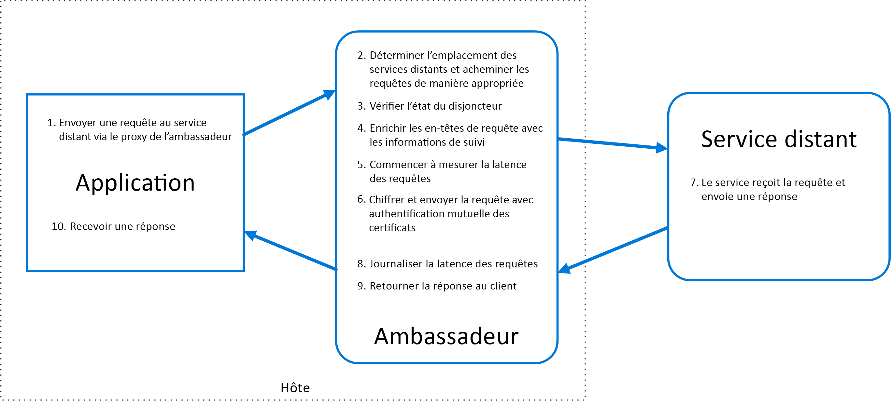

# Modèle ambassadeurAmbassador pattern

Créez des services d’assistance qui envoient des requêtes réseau pour le compte d’applications ou d’un service consommateur.Create helper services that send network requests on behalf of a consumer service or application. Un service Ambassadeur peut être considéré comme un proxy hors processus colocalisé avec le client.An ambassador service can be thought of as an out-of-process proxy that is co-located with the client.

Ce modèle peut être utile pour décharger des tâches de connectivité client courantes telles que la surveillance, la journalisation, le routage, la sécurité (par exemple, TLS), mais aussi des [modèles de résilience][resiliency-patterns] sans dépendance à un quelconque langage.This pattern can be useful for offloading common client connectivity tasks such as monitoring, logging, routing, security (such as TLS), and [resiliency patterns][resiliency-patterns] in a language agnostic way. Il est souvent utilisé avec des applications héritées ou d’autres applications qui sont difficiles à modifier afin d’étendre leurs capacités de mise en réseau.It is often used with legacy applications, or other applications that are difficult to modify, in order to extend their networking capabilities. Il peut également être utilisé par une équipe spécialisée pour implémenter ces fonctionnalités.It can also enable a specialized team to implement those features.

## Contexte et problèmeContext and problem

Les applications cloud résilientes nécessitent des fonctionnalités telles que [le disjoncteur](./circuit-breaker.md), le routage, le contrôle et la supervision ainsi que la possibilité d’effectuer des mises à jour de configuration au niveau du réseau.Resilient cloud-based applications require features such as [circuit breaking](./circuit-breaker.md), routing, metering and monitoring, and the ability to make network-related configuration updates. Il peut être difficile, voire impossible, de mettre à jour les applications héritées ou les bibliothèques de code existantes pour ajouter ces fonctionnalités, car le code n’est pas conservé ou qu’il est difficilement modifiable par l’équipe de développement.It may be difficult or impossible to update legacy applications or existing code libraries to add these features, because the code is no longer maintained or can't be easily modified by the development team.

Les appels réseau peuvent également nécessiter une configuration importante en matière de connexion, d’authentification et d’autorisation.Network calls may also require substantial configuration for connection, authentication, and authorization. Si ces appels sont utilisés dans plusieurs applications et générés à l’aide de plusieurs langages et infrastructures, ils doivent être configurés pour chacune de ces instances.If these calls are used across multiple applications, built using multiple languages and frameworks, the calls must be configured for each of these instances. En outre, il est possible que les fonctionnalités réseau et de sécurité doivent être gérées par une équipe centrale au sein de votre organisation.In addition, network and security functionality may need to be managed by a central team within your organization. En présence d’une base de code volumineuse, il peut être risqué pour cette équipe de mettre à jour un code d’application qu’elle ne connait pas bien.With a large code base, it can be risky for that team to update application code they aren't familiar with.

## SolutionSolution

Placez les bibliothèques et les infrastructures client dans un processus externe qui agit comme un proxy entre votre application et les services externes.Put client frameworks and libraries into an external process that acts as a proxy between your application and external services. Déployez le proxy dans le même environnement d’hôte que votre application pour pouvoir contrôler les fonctionnalités de routage, de résilience et de sécurité, et éviter toute restriction d’accès liée à l’hôte.Deploy the proxy on the same host environment as your application to allow control over routing, resiliency, security features, and to avoid any host-related access restrictions. Vous pouvez également utiliser le modèle ambassadeur pour normaliser et étendre l’instrumentation.You can also use the ambassador pattern to standardize and extend instrumentation. Le proxy peut analyser les indicateurs de performance tels que la latence ou l’utilisation des ressources, et ce dans le même environnement que celui de l’application.The proxy can monitor performance metrics such as latency or resource usage, and this monitoring happens in the same host environment as the application.

Les fonctionnalités qui sont déchargées vers l’ambassadeur peuvent être gérées indépendamment de l’application.Features that are offloaded to the ambassador can be managed independently of the application. Vous pouvez mettre à jour et modifier l’ambassadeur sans que cela n’ait d’incidence sur les fonctionnalités héritées de l’application.You can update and modify the ambassador without disturbing the application's legacy functionality. Les différentes équipes spécialisées peuvent également implémenter et gérer les fonctionnalités de sécurité, de mise en réseau ou d’authentification qui ont été déplacées vers l’ambassadeur.It also allows for separate, specialized teams to implement and maintain security, networking, or authentication features that have been moved to the ambassador.

Les services Ambassadeur peuvent être déployés en tant que [side-car](./sidecar.md) pour accompagner le cycle de vie d’une application ou d’un service consommateur.Ambassador services can be deployed as a [sidecar](./sidecar.md) to accompany the lifecycle of a consuming application or service. Si un ambassadeur est partagé par plusieurs processus distincts sur un ordinateur hôte commun, vous pouvez aussi le déployer en tant que démon ou service Windows.Alternatively, if an ambassador is shared by multiple separate processes on a common host, it can be deployed as a daemon or Windows service. Si le service consommateur est exécuté en conteneur, l’ambassadeur doit être créé en tant que conteneur distinct sur le même ordinateur hôte et les liaisons appropriées doivent être configurées pour établir la communication entre les deux instances.If the consuming service is containerized, the ambassador should be created as a separate container on the same host, with the appropriate links configured for communication.

## Problèmes et considérationsIssues and considerations

- Le proxy provoque une augmentation de la latence.The proxy adds some latency overhead. Demandez-vous si une bibliothèque cliente, appelée directement par l’application, pourrait être une meilleure approche.Consider whether a client library, invoked directly by the application, is a better approach.
- Demandez-vous quel impact pourrait avoir l’intégration de fonctionnalités généralisées au proxy.Consider the possible impact of including generalized features in the proxy. L’ambassadeur pourrait par exemple gérer de nouvelles tentatives, mais cela pourrait s’avérer risqué, sauf si toutes les opérations sont idempotentes.For example, the ambassador could handle retries, but that might not be safe unless all operations are idempotent.
- Envisagez de déployer un mécanisme qui permettrait au client de transférer du contexte au proxy, et inversement.Consider a mechanism to allow the client to pass some context to the proxy, as well as back to the client. Par exemple, ajoutez des en-têtes de requête HTTP pour refuser de nouvelles tentatives ou spécifiez le nombre maximal de tentatives autorisées.For example, include HTTP request headers to opt out of retry or specify the maximum number of times to retry.
- Déterminez de quelle manière vous allez empaqueter et déployer le proxy.Consider how you will package and deploy the proxy.
- Choisissez d’utiliser une instance partagée unique pour tous les clients ou une instance pour chaque client.Consider whether to use a single shared instance for all clients or an instance for each client.

## Quand utiliser ce modèleWhen to use this pattern

Utilisez ce modèle dans les situations suivantes :Use this pattern when you:

- Vous devez générer un ensemble commun de fonctionnalités de connectivité client pour plusieurs langages ou infrastructures.Need to build a common set of client connectivity features for multiple languages or frameworks.
- Vous devez décharger des problèmes de connectivité client transversaux vers les développeurs d’infrastructure ou d’autres équipes plus spécialisées.Need to offload cross-cutting client connectivity concerns to infrastructure developers or other more specialized teams.
- Vous devez répondre à des exigences de connectivité cloud ou de cluster dans une application héritée ou une application qui est difficile à modifier.Need to support cloud or cluster connectivity requirements in a legacy application or an application that is difficult to modify.

Ce modèle peut ne pas convenir :This pattern may not be suitable:

- Lorsque la latence des requêtes réseau est critique.When network request latency is critical. Un proxy introduira un surcroît de latence qui, bien que minimal, pourrait dans certains cas affecter l’application.A proxy will introduce some overhead, although minimal, and in some cases this may affect the application.
- Lorsque les fonctionnalités de connectivité client sont consommées par un seul langage.When client connectivity features are consumed by a single language. Dans ce cas, il peut être plus judicieux d’utiliser une bibliothèque cliente qui est distribuée aux équipes de développement sous la forme d’un package.In that case, a better option might be a client library that is distributed to the development teams as a package.
- Lorsque les fonctionnalités de connectivité ne peuvent pas être généralisées et nécessitent une intégration plus étroite avec l’application cliente.When connectivity features cannot be generalized and require deeper integration with the client application.

## ExemplesExample

Le diagramme suivant illustre une application envoyant une requête à un service distant via un proxy Ambassadeur.The following diagram shows an application making a request to a remote service via an ambassador proxy. L’ambassadeur assure le routage, la rupture de circuit et la journalisation.The ambassador provides routing, circuit breaking, and logging. Il appelle le service distant, puis renvoie la réponse à l’application cliente :It calls the remote service and then returns the response to the client application:

## Aide connexeRelated guidance

- [Modèle side-carSidecar pattern](./sidecar.md)

<!-- links -->

[resiliency-patterns]: ./category/resiliency.md
