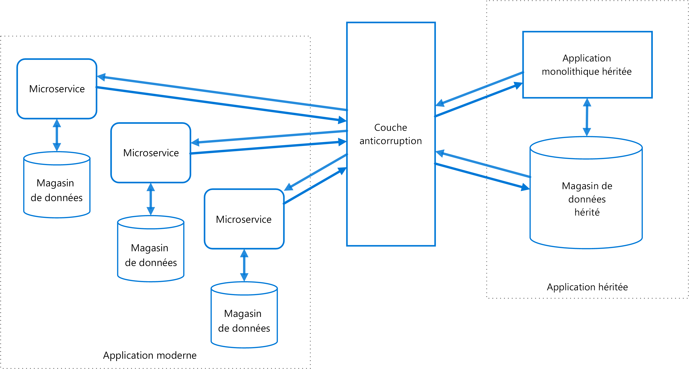

# Modèle de couche de lutte contre la corruptionAnti-Corruption Layer pattern

Implémentez une couche de façade ou d’adaptateur entre différents sous-systèmes qui ne partagent pas la même sémantique.Implement a façade or adapter layer between different subsystems that don't share the same semantics. Cette couche traduit les requêtes qu’un sous-système envoie à l’autre sous-système.This layer translates requests that one subsystem makes to the other subsystem. Utilisez ce modèle pour vous assurer que la conception d’une application n’est pas limitée par les dépendances aux sous-systèmes externes.Use this pattern to ensure that an application's design is not limited by dependencies on outside subsystems. Ce modèle a d’abord été décrit par Eric Evans dans *Domain-Driven Design* (Conception orientée domaine).This pattern was first described by Eric Evans in *Domain-Driven Design*.

## Contexte et problèmeContext and problem

La plupart des applications s’appuient sur d’autres systèmes pour certaines données ou fonctionnalités.Most applications rely on other systems for some data or functionality. Par exemple, lorsqu’une application héritée est migrée vers un système moderne, elle peut toujours avoir besoin de ressources héritées existantes.For example, when a legacy application is migrated to a modern system, it may still need existing legacy resources. De nouvelles fonctionnalités doivent être en mesure d’appeler le système hérité.New features must be able to call the legacy system. Cela est particulièrement vrai lorsqu’il s’agit de migrations graduelles pour lesquelles différentes fonctionnalités d’une application plus importante sont déplacées vers un système moderne au fil du temps.This is especially true of gradual migrations, where different features of a larger application are moved to a modern system over time.

Souvent, ces systèmes hérités connaissent des problèmes de qualité comme des schémas de données complexes ou des API obsolètes.Often these legacy systems suffer from quality issues such as convoluted data schemas or obsolete APIs. Les fonctionnalités et technologies utilisées dans les systèmes hérités peuvent varier considérablement par rapport à des systèmes plus modernes.The features and technologies used in legacy systems can vary widely from more modern systems. Pour interagir avec le système hérité, la nouvelle application doit éventuellement prendre en charge une infrastructure, des protocoles, des modèles de données, des API obsolètes ou d’autres fonctionnalités que vous n’implémenteriez pas dans une application moderne.To interoperate with the legacy system, the new application may need to support outdated infrastructure, protocols, data models, APIs, or other features that you wouldn't otherwise put into a modern application.

Maintenir l’accès entre les systèmes nouveaux et hérités peut forcer le nouveau système à respecter au moins certaines API ou d’autres sémantiques du système hérité.Maintaining access between new and legacy systems can force the new system to adhere to at least some of the legacy system's APIs or other semantics. Lorsque ces fonctionnalités héritées ont des problèmes de qualité, le fait de les prendre en charge « corrompt » ce qui pourrait être une application moderne correctement conçue.When these legacy features have quality issues, supporting them "corrupts" what might otherwise be a cleanly designed modern application. 

Des problèmes similaires peuvent se produire avec n’importe quel système externe que votre équipe de développement ne contrôle pas, pas uniquement avec les systèmes hérités.Similar issues can arise with any external system that your developmenmt team doesn't control, not just legacy systems. 

## SolutionSolution

Isolez les différents sous-systèmes en plaçant une couche de lutte contre la corruption entre eux.Isolate the different subsystems by placing an anti-corruption layer between them. Cette couche traduit les communications entre les deux systèmes, ce qui permet à un système de rester identique alors que l’autre système peut éviter de compromettre sa conception et son approche technologique.This layer translates communications between the two systems, allowing one system to remain unchanged while the other can avoid compromising its design and technological approach.

 

Le diagramme ci-dessus illustre une application comprenant deux sous-systèmes.The diagram above shows an application with two subsystems. Le sous-système A appelle le sous-système B à travers une couche de lutte contre la corruption.Subsystem A calls to subsystem B through an anti-corruption layer. La communication entre le sous-système A et la couche de lutte contre la corruption utilise toujours le modèle de données et l’architecture du sous-système A. Les appels à partir de la couche de lutte contre la corruption vers le sous-système B sont conformes au modèle de données ou aux méthodes de ce sous-système.Communication between subsystem A and the anti-corruption layer always uses the data model and architecture of subsystem A. Calls from the anti-corruption layer to subsystem B conform to that subsystem's data model or methods. La couche de lutte contre la corruption contient toute la logique nécessaire pour effectuer la traduction entre les deux systèmes.The anti-corruption layer contains all of the logic necessary to translate between the two systems. La couche peut être implémentée en tant que composant dans l’application ou en tant que service indépendant.The layer can be implemented as a component within the application or as an independent service.

## Problèmes et considérationsIssues and considerations

- La couche de lutte contre la corruption peut ajouter de la latence aux appels effectués entre les deux systèmes.The anti-corruption layer may add latency to calls made between the two systems.
- La couche de lutte contre la corruption ajoute un service supplémentaire qui doit être géré et maintenu.The anti-corruption layer adds an additional service that must be managed and maintained.
- Réfléchissez à la façon dont votre couche de lutte contre la corruption va être mise à l’échelle.Consider how your anti-corruption layer will scale.
- Évaluez si vous avez besoin de plus d’une couche de lutte contre la corruption.Consider whether you need more than one anti-corruption layer. Vous pouvez décomposer les fonctionnalités en plusieurs services à l’aide de différents langages ou technologies ; vous pouvez également choisir de partitionner la couche de lutte contre la corruption pour d’autres raisons.You may want to decompose functionality into multiple services using different technologies or languages, or there may be other reasons to partition the anti-corruption layer.
- Réfléchissez à la façon dont la couche de lutte contre la corruption sera gérée par rapport à vos autres applications ou services.Consider how the anti-corruption layer will be managed in relation with your other applications or services. Comment sera-t-elle intégrée à vos processus de surveillance, de mise en production et de configuration ?How will it be integrated into your monitoring, release, and configuration processes?
- Assurez-vous que la cohérence des transactions et des données est conservée et qu’elle peut être surveillée.Make sure transaction and data consistency are maintained and can be monitored.
- Déterminez si la couche de lutte contre la corruption doit gérer toutes les communications entre différents sous-systèmes ou uniquement un sous-ensemble de fonctionnalités.Consider whether the anti-corruption layer needs to handle all communication between different subsystems, or just a subset of features. 
- Si la couche de lutte contre la corruption fait partie d’une stratégie de migration d’application, déterminez si elle sera permanente, ou si elle sera mise hors service une fois toutes les fonctionnalités hérités migrées.If the anti-corruption layer is part of an application migration strategy, consider whether it will be permanent, or will be retired after all legacy functionality has been migrated.

## Quand utiliser ce modèleWhen to use this pattern

Utilisez ce modèle dans les situations suivantes :Use this pattern when:

- Une migration est planifiée pour avoir lieu en plusieurs étapes, mais l’intégration entre les systèmes nouveaux et hérités doit être maintenue.A migration is planned to happen over multiple stages, but integration between new and legacy systems needs to be maintained.
- Deux ou plusieurs sous-systèmes ont des sémantiques différentes, mais doivent tout de même communiquer.Two or more subsystems have different semantics, but still need to communicate. 

Ce modèle peut ne pas convenir s’il n’y a aucune différence de sémantique significative entre les systèmes nouveaux et hérités.This pattern may not be suitable if there are no significant semantic differences between new and legacy systems. 

## Aide connexeRelated guidance

- [Modèle d’étranglementStrangler pattern](./strangler.md)
