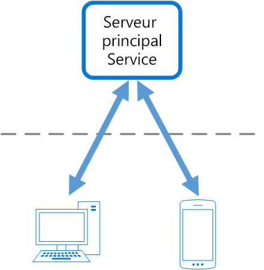
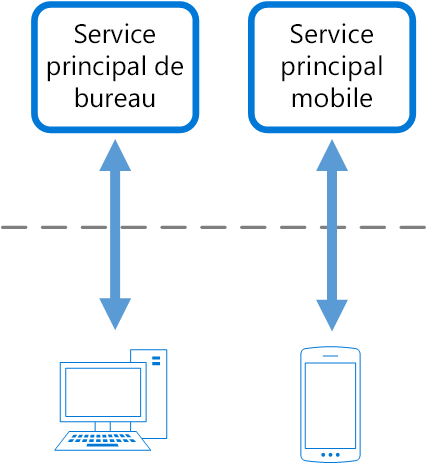

# Modèle de services principaux destinés aux frontauxBackends for Frontends pattern

Créez différents services principaux destinés à être utilisés par des applications ou interfaces frontales spécifiques.Create separate backend services to be consumed by specific frontend applications or interfaces. Ce modèle se révèle utile lorsque vous souhaitez personnaliser un même service principal pour plusieurs interfaces.This pattern is useful when you want to avoid customizing a single backend for multiple interfaces. Ce modèle a d’abord été décrit par Sam Newman.This pattern was first described by Sam Newman.

## Contexte et problèmeContext and problem

À l’origine, une application peut être destinée à une interface utilisateur web de bureau.An application may initially be targeted at a desktop web UI. Un service principal est généralement développé en parallèle et fournit les fonctionnalités requises par cette interface utilisateur.Typically, a backend service is developed in parallel that provides the features needed for that UI. À mesure que la base d’utilisateurs de l’application augmente, une application mobile est développée et doit interagir avec le même service principal.As the application's user base grows, a mobile application is developed that must interact with the same backend. Le service principal devient un service principal à usage général, répondant aussi bien aux exigences des interfaces de bureau qu’à celles des interfaces mobiles.The backend service becomes a general-purpose backend, serving the requirements of both the desktop and mobile interfaces.

Toutefois, les fonctionnalités d’un appareil mobile diffèrent sensiblement de celles d’un navigateur de bureau en termes de taille d’écran, de performances et de limitations d’affichage.But the capabilities of a mobile device differ significantly from a desktop browser, in terms screen size, performance, and display limitations. Par conséquent, les impératifs d’un service principal d’application mobile sont distincts de ceux d’une interface utilisateur web de bureau.As a result, the requirements for a mobile application backend differ from the desktop web UI. 

Le service principal doit donc satisfaire à des exigences contradictoires.These differences result in competing requirements for the backend. Le service principal nécessite des modifications régulières et significatives pour desservir à la fois l’interface utilisateur web de bureau et l’application mobile.The backend requires regular and significant changes to serve both the desktop web UI and the mobile application. Étant donné que des équipes d’interface distinctes travaillent souvent sur chaque frontal, le service principal devient un goulot d’étranglement dans le processus de développement.Often, separate interface teams work on each frontend, causing the backend to become a bottleneck in the development process. Les exigences de mise à jour conflictuelles et l’obligation de maintenir le service opérationnel pour les deux frontaux peuvent nécessiter un travail considérable sur une seule ressource déployable.Conflicting update requirements, and the need to keep the service working for both frontends, can result in spending a lot of effort on a single deployable resource.

 

L’activité de développement étant axée sur le service principal, il est possible qu’une équipe distincte soit créée pour gérer et mettre à jour le service principal.As the development activity focuses on the backend service, a separate team may be created to manage and maintain the backend. Les équipes de développement d’interface se retrouvent alors déconnectées de l’équipe de service principal, contraignant ainsi cette dernière à trouver un équilibre entre les exigences contradictoires des différentes équipes d’interface utilisateur.Ultimately, this results in a disconnect between the interface and backend development teams, placing a burden on the backend team to balance the competing requirements of the different UI teams. Lorsqu’une équipe d’interface requiert l’apport de modifications au service principal, ces modifications doivent être validées auprès des autres équipes d’interface avant de pouvoir être intégrées au service principal.When one interface team requires changes to the backend, those changes must be validated with other interface teams before they can be integrated into the backend. 

## SolutionSolution

Créez un service principal par interface utilisateur.Create one backend per user interface. Ajustez le comportement et les performances de chaque service principal pour qu’ils répondent au mieux aux besoins de l’environnement frontal, sans vous soucier d’affecter l’expérience des autres frontaux.Fine tune the behavior and performance of each backend to best match the needs of the frontend environment, without worrying about affecting other frontend experiences.

 

Étant donné que chaque service principal est propre à une interface, il peut être optimisé pour cette dernière.Because each backend is specific to one interface, it can be optimized for that interface. Par conséquent, il sera moins volumineux, moins complexe et probablement plus rapide qu’un service principal générique qui tente de répondre aux exigences de toutes les interfaces.As a result, it will be smaller, less complex, and likely faster than a generic backend that tries to satisfy the requirements for all interfaces. Chaque équipe d’interface a la possibilité de contrôler son propre service principal et ne dépend pas d’une équipe de développement de service principal centralisée.Each interface team has autonomy to control their own backend and doesn't rely on a centralized backend development team. L’équipe d’interface dispose ainsi d’une réelle flexibilité en matière de sélection de langue, de cadence de mise en production, de hiérarchisation des charges de travail et d’intégration de fonctionnalités à son service principal.This gives the interface team flexibility in language selection, release cadence, prioritization of workload, and feature integration in their backend.

Pour plus d’informations, consultez [Pattern: Backends For Frontends](http://samnewman.io/patterns/architectural/bff/) (Modèle : Services principaux destinés aux frontaux).For more information, see [Pattern: Backends For Frontends](http://samnewman.io/patterns/architectural/bff/).

## Problèmes et considérationsIssues and considerations

- Considérez le nombre de services principaux à déployer.Consider how many backends to deploy.
- Si différentes interfaces (telles que des clients mobiles) doivent exécuter les mêmes requêtes, déterminez s’il est nécessaire d’implémenter un service principal pour chaque interface, ou si un seul service principal suffit.If different interfaces (such as mobile clients) will make the same requests, consider whether it is necessary to implement a backend for each interface, or if a single backend will suffice.
- L’implémentation de ce modèle implique le plus souvent une duplication de code entre les services.Code duplication across services is highly likely when implementing this pattern.
- Les services principaux axés sur un frontal doivent uniquement contenir la logique et le comportement propres au client.Frontend-focused backend services should only contain client-specific logic and behavior. La logique métier générale et les autres fonctionnalités globales doivent être gérées à un autre emplacement de votre application.General business logic and other global features should be managed elsewhere in your application.
- Pensez à la façon dont ce modèle peut se refléter dans les responsabilités d’une équipe de développement.Think about how this pattern might be reflected in the responsibilities of a development team.
- Prenez en compte le temps que prendra l’implémentation de ce modèle.Consider how long it will take to implement this pattern. La tâche de création d’autres services principaux occasionnera-t-elle une dette technique, pendant que vous continuerez à prendre en charge le service principal générique existant ?Will the effort of building the new backends incur technical debt, while you continue to support the existing generic backend?

## Quand utiliser ce modèleWhen to use this pattern

Utilisez ce modèle dans les situations suivantes :Use this pattern when:

- Un service principal partagé ou à usage général doit être entretenu avec des coûts de développement substantiels.A shared or general purpose backend service must be maintained with significant development overhead.
- Vous devez optimiser le service principal pour les exigences d’interfaces clientes spécifiques.You want to optimize the backend for the requirements of specific client interfaces.
- Des personnalisations sont appliquées à un service principal à usage général pour prendre en charge plusieurs interfaces.Customizations are made to a general-purpose backend to accommodate multiple interfaces.
- Une autre langue se révèle mieux adaptée au service principal d’une interface utilisateur différente.An alternative language is better suited for the backend of a different user interface.

Ce modèle peut ne pas convenir dans les cas suivants :This pattern may not be suitable:

- Les interfaces envoient des requêtes identiques ou similaires au service principal.When interfaces make the same or similar requests to the backend.
- Une seule interface est utilisée pour interagir avec le service principal.When only one interface is used to interact with the backend.

## Aide connexeRelated guidance

- [Gateway Aggregation pattern](./gateway-aggregation.md) (Modèle d’agrégation de passerelle)[Gateway Aggregation pattern](./gateway-aggregation.md)
- [Modèle de déchargement de passerelleGateway Offloading pattern](./gateway-offloading.md)
- [Gateway Routing pattern](./gateway-routing.md) (Modèle de routage de passerelle)[Gateway Routing pattern](./gateway-routing.md)

