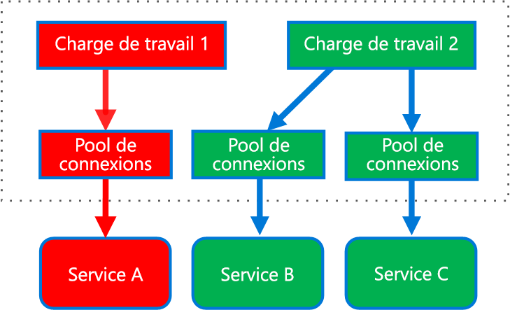
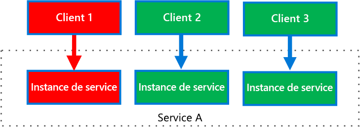

# <a name="bulkhead-pattern"></a>Modèle de cloisonnement

Isolez les éléments d’une application sous forme de pools afin qu’en cas de défaillance de l’un d’eux, les autres continuent à fonctionner.

Ce modèle est nommé *cloisonnement*, car il est comparable aux cloisons qui séparent les différents compartiments d’un navire. Si la coque d’un navire subit une avarie, seule la section endommagée se remplit d’eau, empêchant ainsi le navire de couler.

## <a name="context-and-problem"></a>Contexte et problème

Une application basée sur le cloud peut inclure plusieurs services comptant chacun un ou plusieurs consommateurs. Une charge excessive ou une défaillance dans un service auront une incidence sur tous les consommateurs du service.

En outre, un consommateur peut envoyer des requêtes à plusieurs services simultanément en utilisant des ressources pour chaque requête. Lorsque le consommateur adresse une requête à un service qui est mal configuré ou qui ne répond pas, il est possible que les ressources utilisées par cette requête ne soient pas libérées suffisamment vite. À mesure que l’envoi de requêtes au service se poursuit, ces ressources risquent de finir par s’épuiser. Par exemple, il est possible que le pool de connexions du client ait été consommé en totalité. Lorsque cette situation se produit, elle affecte également les requêtes que le consommateur envoie à d’autres services. En fin de compte, le consommateur ne peut plus adresser de requêtes au service qui ne répondait pas à l’origine, ni à aucun autre service.

Ce même problème d’épuisement des ressources affecte les services desservant plusieurs consommateurs. Un grand nombre de requêtes émanant d’un même client peut épuiser les ressources disponibles dans le service. Les autres consommateurs ne sont plus en mesure de consommer le service, ce qui entraîne un effet de défaillances en cascade.

## <a name="solution"></a>Solution

Partitionnez les instances de service en différents groupes basés sur les exigences des consommateurs en matière de charge et de disponibilité. Cette conception vous permet d’isoler les défaillances et de préserver les fonctionnalités des services auprès de certains consommateurs, même dans l’éventualité d’une défaillance.

Un consommateur peut également partitionner les ressources pour garantir que celles qui sont utilisées pour appeler un service n’affectent pas celles qui permettent d’appeler un autre service. Par exemple, un consommateur qui appelle plusieurs services peut se voir attribuer un pool de connexions pour chaque service. Si un service devient défaillant, cela affecte uniquement le pool de connexions attribué à ce service, permettant ainsi au consommateur de continuer à utiliser les autres services.

Ce modèle offre les avantages suivants :

- Les consommateurs et les services sont isolés des défaillances en cascade. Un problème affectant un consommateur ou un service peut être isolé dans sa propre cloison, empêchant ainsi la défaillance de la totalité de la solution.
- Vous pouvez préserver certaines fonctionnalités en cas de défaillance d’un service. Les autres services et fonctionnalités de l’application continueront à fonctionner.
- Vous pouvez déployer des services qui offrent différentes qualités de service pour les applications consommatrices. Vous avez la possibilité de configurer un pool de consommateurs hautement prioritaire pour l’utilisation des services à priorité élevée.

Le diagramme ci-après illustre des cloisons structurées autour de pools de connexions qui appellent des services individuels. Si le Service A devient défaillant ou pose un autre problème, le pool de connexions est isolé, de sorte que seules les charges de travail qui utilisent le pool de threads attribué au Service A sont affectées par le problème. Les charges de travail qui utilisent les Services B et C ne sont pas touchées par le problème et peuvent se poursuivre sans interruption.



Le diagramme ci-après représente plusieurs clients appelant un seul service. Une instance de service distincte est attribuée à chaque client. Le Client 1 a effectué trop de requêtes et a submergé son instance. Étant donné que chaque instance de service est isolée des autres, les autres clients peuvent continuer à effectuer des appels.



## <a name="issues-and-considerations"></a>Problèmes et considérations

- Définissez des partitions basées sur les exigences métiers et techniques de l’application.
- Lorsque vous partitionnez des services ou des consommateurs en cloisons, tenez compte du niveau d’isolation offert par la technologie, ainsi que des gains en termes de coût, de performances et de facilité de gestion.
- Envisagez de combiner les cloisons avec les modèles de nouvelle tentative, de disjoncteur et de limitation afin d’assurer une gestion des erreurs plus élaborée.
- Lorsque vous partitionnez les consommateurs en cloisons, pensez à utiliser des processus, des pools de threads et des sémaphores. Les projets tels que [Netflix Hystrix][hystrix] et [Polly][polly] offrent une infrastructure pour la création de cloisons de consommateurs.
- Lorsque vous partitionnez des services en cloisons, envisagez de les déployer dans des machines virtuelles, des conteneurs ou des processus distincts. Les conteneurs offrent un bon niveau d’isolation des ressources pour un coût relativement faible.
- Les services qui communiquent à l’aide de messages asynchrones peuvent être isolés par le biais de différents ensembles de files d’attente. Chaque file d’attente peut disposer d’un ensemble dédié d’instances traitant les messages de la file d’attente, ou d’un groupe d’instances unique utilisant un algorithme pour le traitement des opérations d’enlèvement de la file d’attente et de répartition.
- Déterminez le niveau de granularité des cloisons. Par exemple, si vous souhaitez répartir des clients entre plusieurs partitions, vous pouvez placer chaque client dans une partition distincte, ou placer plusieurs clients dans une seule partition.
- Surveillez les performances et le Contrat de niveau de service de chaque partition.

## <a name="when-to-use-this-pattern"></a>Quand utiliser ce modèle

Utilisez ce modèle pour :

- isoler les ressources utilisées pour la consommation d’un ensemble de services principaux, notamment si l’application peut assurer un certain niveau de fonctionnalité, même si l’un des services ne répond pas ;
- isoler les consommateurs critiques des consommateurs standard ;
- protéger l’application des défaillances en cascade.

Ce modèle peut ne pas convenir dans les cas suivants :

- Une utilisation moins efficace des ressources n’est pas acceptable dans le projet.
- Ce surcroît de complexité n’est pas nécessaire.

## <a name="example"></a>Exemples

Le fichier de configuration Kubernetes ci-après crée un conteneur isolé pour l’exécution d’un seul service, doté de ses propres ressources et limites d’UC et de mémoire.

```yml
apiVersion: v1
kind: Pod
metadata:
  name: drone-management
spec:
  containers:
  - name: drone-management-container
    image: drone-service
    resources:
      requests:
        memory: "64Mi"
        cpu: "250m"
      limits:
        memory: "128Mi"
        cpu: "1"
```

## <a name="related-guidance"></a>Aide connexe

- [Conception d’applications Azure fiables](../reliability/index.md)
- [Modèle Disjoncteur](./circuit-breaker.md)
- [Modèle Nouvelle tentative](./retry.md)
- [Modèle de limitation](./throttling.md)

<!-- links -->

[hystrix]: https://github.com/Netflix/Hystrix
[polly]: https://github.com/App-vNext/Polly
