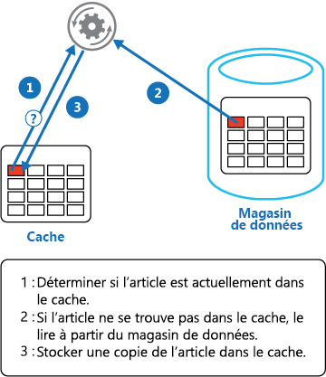

# <a name="cache-aside-pattern"></a><span data-ttu-id="fb528-104">Modèle Cache-Aside</span><span class="sxs-lookup"><span data-stu-id="fb528-104">Cache-Aside pattern</span></span>

[!INCLUDE [header](../_includes/header.md)]

<span data-ttu-id="fb528-105">Chargez les données à la demande dans un cache à partir d’une banque de données.</span><span class="sxs-lookup"><span data-stu-id="fb528-105">Load data on demand into a cache from a data store.</span></span> <span data-ttu-id="fb528-106">Cela peut améliorer les performances et aider à maintenir la cohérence entre les données contenues dans le cache et les données résidant dans la banque de données sous-jacente.</span><span class="sxs-lookup"><span data-stu-id="fb528-106">This can improve performance and also helps to maintain consistency between data held in the cache and data in the underlying data store.</span></span>

## <a name="context-and-problem"></a><span data-ttu-id="fb528-107">Contexte et problème</span><span class="sxs-lookup"><span data-stu-id="fb528-107">Context and problem</span></span>

<span data-ttu-id="fb528-108">Les applications utilisent un cache pour optimiser l’accès répété aux informations contenues dans une banque de données.</span><span class="sxs-lookup"><span data-stu-id="fb528-108">Applications use a cache to improve repeated access to information held in a data store.</span></span> <span data-ttu-id="fb528-109">Toutefois, on peut difficilement s’attendre à ce que les données mises en cache soient toujours entièrement cohérentes avec les données contenues dans la banque de données.</span><span class="sxs-lookup"><span data-stu-id="fb528-109">However, it's impractical to expect that cached data will always be completely consistent with the data in the data store.</span></span> <span data-ttu-id="fb528-110">Les applications doivent implémenter une stratégie pour s’assurer que les données contenues dans le cache soient le plus à jour possible, mais également pour identifier et gérer les situations dans lesquelles les données du cache sont devenues obsolètes.</span><span class="sxs-lookup"><span data-stu-id="fb528-110">Applications should implement a strategy that helps to ensure that the data in the cache is as up-to-date as possible, but can also detect and handle situations that arise when the data in the cache has become stale.</span></span>

## <a name="solution"></a><span data-ttu-id="fb528-111">Solution</span><span class="sxs-lookup"><span data-stu-id="fb528-111">Solution</span></span>

<span data-ttu-id="fb528-112">De nombreux systèmes de mise en cache disponibles sur le marché intègrent des opérations de double lecture et de double écriture/d’écriture différée.</span><span class="sxs-lookup"><span data-stu-id="fb528-112">Many commercial caching systems provide read-through and write-through/write-behind operations.</span></span> <span data-ttu-id="fb528-113">Dans ces systèmes, une application récupère des données en établissant une référence au cache.</span><span class="sxs-lookup"><span data-stu-id="fb528-113">In these systems, an application retrieves data by referencing the cache.</span></span> <span data-ttu-id="fb528-114">Si les données ne se trouvent pas dans le cache, elles sont récupérées dans la banque de données et ajoutées au cache.</span><span class="sxs-lookup"><span data-stu-id="fb528-114">If the data isn't in the cache, it's retrieved from the data store and added to the cache.</span></span> <span data-ttu-id="fb528-115">Les modifications apportées aux données contenues dans le cache sont automatiquement répercutées dans la banque de données.</span><span class="sxs-lookup"><span data-stu-id="fb528-115">Any modifications to data held in the cache are automatically written back to the data store as well.</span></span>

<span data-ttu-id="fb528-116">Pour les caches qui n’offrent pas cette fonctionnalité, il revient aux applications qui utilisent le cache d’assurer la mise à jour des données.</span><span class="sxs-lookup"><span data-stu-id="fb528-116">For caches that don't provide this functionality, it's the responsibility of the applications that use the cache to maintain the data.</span></span>

<span data-ttu-id="fb528-117">Une application peut émuler la fonctionnalité de mise en cache avec double lecture en implémentant la stratégie Cache-Aside.</span><span class="sxs-lookup"><span data-stu-id="fb528-117">An application can emulate the functionality of read-through caching by implementing the cache-aside strategy.</span></span> <span data-ttu-id="fb528-118">Cette stratégie charge des données dans le cache à la demande.</span><span class="sxs-lookup"><span data-stu-id="fb528-118">This strategy loads data into the cache on demand.</span></span> <span data-ttu-id="fb528-119">La figure montre comment utiliser le modèle Cache-Aside pour stocker des données dans le cache.</span><span class="sxs-lookup"><span data-stu-id="fb528-119">The figure illustrates using the Cache-Aside pattern to store data in the cache.</span></span>




<span data-ttu-id="fb528-121">Si une application met à jour les informations, elle peut appliquer la stratégie de double écriture en répercutant la modification dans la banque de données et en invalidant l’élément correspondant dans le cache.</span><span class="sxs-lookup"><span data-stu-id="fb528-121">If an application updates information, it can follow the write-through strategy by making the modification to the data store, and by invalidating the corresponding item in the cache.</span></span>

<span data-ttu-id="fb528-122">Lorsque l’application aura à nouveau besoin de cet élément, la stratégie Cache-Aside permettra de récupérer les données mises à jour dans la banque de données et de les ajouter au cache.</span><span class="sxs-lookup"><span data-stu-id="fb528-122">When the item is next required, using the cache-aside strategy will cause the updated data to be retrieved from the data store and added back into the cache.</span></span>

## <a name="issues-and-considerations"></a><span data-ttu-id="fb528-123">Problèmes et considérations</span><span class="sxs-lookup"><span data-stu-id="fb528-123">Issues and considerations</span></span>

<span data-ttu-id="fb528-124">Prenez en compte les points suivants lorsque vous choisissez comment implémenter ce modèle :</span><span class="sxs-lookup"><span data-stu-id="fb528-124">Consider the following points when deciding how to implement this pattern:</span></span> 

<span data-ttu-id="fb528-125">**Durée de vie des données mises en cache**.</span><span class="sxs-lookup"><span data-stu-id="fb528-125">**Lifetime of cached data**.</span></span> <span data-ttu-id="fb528-126">De nombreux caches intègrent une stratégie d’expiration qui invalide les données et les supprime du cache si elles n’ont pas été consultées pendant une certaine période.</span><span class="sxs-lookup"><span data-stu-id="fb528-126">Many caches implement an expiration policy that invalidates data and removes it from the cache if it's not accessed for a specified period.</span></span> <span data-ttu-id="fb528-127">Pour que la stratégie Cache-Aside soit efficace, assurez-vous que la stratégie d’expiration correspond au modèle d’accès pour les applications qui utilisent les données.</span><span class="sxs-lookup"><span data-stu-id="fb528-127">For cache-aside to be effective, ensure that the expiration policy matches the pattern of access for applications that use the data.</span></span> <span data-ttu-id="fb528-128">Ne configurez pas un délai d’expiration trop court, car les applications pourraient alors récupérer des données en continu dans la banque de données pour les ajouter au cache.</span><span class="sxs-lookup"><span data-stu-id="fb528-128">Don't make the expiration period too short because this can cause applications to continually retrieve data from the data store and add it to the cache.</span></span> <span data-ttu-id="fb528-129">De même, ne configurez pas un délai d’expiration trop long pour éviter que les données en cache deviennent obsolètes.</span><span class="sxs-lookup"><span data-stu-id="fb528-129">Similarly, don't make the expiration period so long that the cached data is likely to become stale.</span></span> <span data-ttu-id="fb528-130">N’oubliez pas que la mise en cache est particulièrement efficace pour des données relativement statiques ou des données qui sont fréquemment lues.</span><span class="sxs-lookup"><span data-stu-id="fb528-130">Remember that caching is most effective for relatively static data, or data that is read frequently.</span></span>

<span data-ttu-id="fb528-131">**Éviction des données**.</span><span class="sxs-lookup"><span data-stu-id="fb528-131">**Evicting data**.</span></span> <span data-ttu-id="fb528-132">La plupart des caches étant de plus petite taille que les banques de données d’où proviennent les données, ils n’ont parfois d’autre choix que de supprimer des données.</span><span class="sxs-lookup"><span data-stu-id="fb528-132">Most caches have a limited size compared to the data store where the data originates, and they'll evict data if necessary.</span></span> <span data-ttu-id="fb528-133">La plupart des caches adoptent une stratégie qui consiste à supprimer les données les moins récemment utilisées. Il est néanmoins possible de personnaliser cette stratégie.</span><span class="sxs-lookup"><span data-stu-id="fb528-133">Most caches adopt a least-recently-used policy for selecting items to evict, but this might be customizable.</span></span> <span data-ttu-id="fb528-134">Configurez la propriété d’expiration globale ainsi que d’autres propriétés du cache et la propriété d’expiration de chaque élément mis en cache pour limiter les coûts associés à la mise en cache.</span><span class="sxs-lookup"><span data-stu-id="fb528-134">Configure the global expiration property and other properties of the cache, and the expiration property of each cached item, to ensure that the cache is cost effective.</span></span> <span data-ttu-id="fb528-135">Il n’est pas toujours judicieux d’appliquer une stratégie d’éviction globale pour chaque élément présent dans le cache.</span><span class="sxs-lookup"><span data-stu-id="fb528-135">It isn't always appropriate to apply a global eviction policy to every item in the cache.</span></span> <span data-ttu-id="fb528-136">Par exemple, si la récupération d’un élément mis en cache à partir de la banque de données s’avère très coûteuse, il peut être judicieux de conserver cet élément dans le cache au détriment d’autres éléments fréquemment lus mais moins coûteux.</span><span class="sxs-lookup"><span data-stu-id="fb528-136">For example, if a cached item is very expensive to retrieve from the data store, it can be beneficial to keep this item in the cache at the expense of more frequently accessed but less costly items.</span></span>

<span data-ttu-id="fb528-137">**Amorçage du cache**.</span><span class="sxs-lookup"><span data-stu-id="fb528-137">**Priming the cache**.</span></span> <span data-ttu-id="fb528-138">De nombreuses solutions préremplissent le cache avec des données dont une application est susceptible d’avoir besoin au moment du démarrage.</span><span class="sxs-lookup"><span data-stu-id="fb528-138">Many solutions prepopulate the cache with the data that an application is likely to need as part of the startup processing.</span></span> <span data-ttu-id="fb528-139">Le modèle Cache-Aside peut toujours être utile si certaines de ces données expirent ou sont supprimées.</span><span class="sxs-lookup"><span data-stu-id="fb528-139">The Cache-Aside pattern can still be useful if some of this data expires or is evicted.</span></span>

<span data-ttu-id="fb528-140">**Cohérence**.</span><span class="sxs-lookup"><span data-stu-id="fb528-140">**Consistency**.</span></span> <span data-ttu-id="fb528-141">L’implémentation du modèle Cache-Aside ne garantit pas la cohérence entre la banque de données et le cache.</span><span class="sxs-lookup"><span data-stu-id="fb528-141">Implementing the Cache-Aside pattern doesn't guarantee consistency between the data store and the cache.</span></span> <span data-ttu-id="fb528-142">Un élément de la banque de données peut être modifié à tout moment par un processus externe, et cette modification peut ne pas être répercutée dans le cache jusqu’au prochain chargement de l’élément.</span><span class="sxs-lookup"><span data-stu-id="fb528-142">An item in the data store can be changed at any time by an external process, and this change might not be reflected in the cache until the next time the item is loaded.</span></span> <span data-ttu-id="fb528-143">Dans un système qui réplique les données dans différentes banques de données, ce problème peut s’aggraver si la synchronisation intervient fréquemment.</span><span class="sxs-lookup"><span data-stu-id="fb528-143">In a system that replicates data across data stores, this problem can become serious if synchronization occurs frequently.</span></span>

<span data-ttu-id="fb528-144">**Mise en cache locale (en mémoire)**.</span><span class="sxs-lookup"><span data-stu-id="fb528-144">**Local (in-memory) caching**.</span></span> <span data-ttu-id="fb528-145">Un cache peut être localement associé à une instance d’application et stocké en mémoire.</span><span class="sxs-lookup"><span data-stu-id="fb528-145">A cache could be local to an application instance and stored in-memory.</span></span> <span data-ttu-id="fb528-146">Le modèle Cache-Aside peut s’avérer utile dans cet environnement si une application accède aux mêmes données de manière répétée.</span><span class="sxs-lookup"><span data-stu-id="fb528-146">Cache-aside can be useful in this environment if an application repeatedly accesses the same data.</span></span> <span data-ttu-id="fb528-147">Toutefois, un cache local est privé, ce qui permet aux différentes instances d’application d’avoir chacune une copie des mêmes données en cache.</span><span class="sxs-lookup"><span data-stu-id="fb528-147">However, a local cache is private and so different application instances could each have a copy of the same cached data.</span></span> <span data-ttu-id="fb528-148">Ces données peuvent rapidement devenir incohérentes entre les caches, et il peut être nécessaire de faire expirer les données conservées dans un cache privé et de les actualiser plus fréquemment.</span><span class="sxs-lookup"><span data-stu-id="fb528-148">This data could quickly become inconsistent between caches, so it might be necessary to expire data held in a private cache and refresh it more frequently.</span></span> <span data-ttu-id="fb528-149">Dans ces scénarios, analysez les avantages d’utiliser un mécanisme de mise en cache partagé ou distribué.</span><span class="sxs-lookup"><span data-stu-id="fb528-149">In these scenarios, consider investigating the use of a shared or a distributed caching mechanism.</span></span>

## <a name="when-to-use-this-pattern"></a><span data-ttu-id="fb528-150">Quand utiliser ce modèle</span><span class="sxs-lookup"><span data-stu-id="fb528-150">When to use this pattern</span></span>

<span data-ttu-id="fb528-151">Utilisez ce modèle dans les situations suivantes :</span><span class="sxs-lookup"><span data-stu-id="fb528-151">Use this pattern when:</span></span>

- <span data-ttu-id="fb528-152">Un cache ne fournit pas d’opérations de double lecture et de double écriture natives.</span><span class="sxs-lookup"><span data-stu-id="fb528-152">A cache doesn't provide native read-through and write-through operations.</span></span>
- <span data-ttu-id="fb528-153">La demande en ressources n’est pas prévisible.</span><span class="sxs-lookup"><span data-stu-id="fb528-153">Resource demand is unpredictable.</span></span> <span data-ttu-id="fb528-154">Ce modèle permet aux applications de charger des données à la demande.</span><span class="sxs-lookup"><span data-stu-id="fb528-154">This pattern enables applications to load data on demand.</span></span> <span data-ttu-id="fb528-155">Il n’émet aucune hypothèse sur les données dont aura besoin une application.</span><span class="sxs-lookup"><span data-stu-id="fb528-155">It makes no assumptions about which data an application will require in advance.</span></span>

<span data-ttu-id="fb528-156">Ce modèle peut ne pas convenir :</span><span class="sxs-lookup"><span data-stu-id="fb528-156">This pattern might not be suitable:</span></span>

- <span data-ttu-id="fb528-157">Lorsque le jeu de données mises en cache est statique.</span><span class="sxs-lookup"><span data-stu-id="fb528-157">When the cached data set is static.</span></span> <span data-ttu-id="fb528-158">Si les données ne tiennent pas dans l’espace de cache disponible, amorcez le cache avec les données au démarrage et appliquez une stratégie qui empêche l’expiration des données.</span><span class="sxs-lookup"><span data-stu-id="fb528-158">If the data will fit into the available cache space, prime the cache with the data on startup and apply a policy that prevents the data from expiring.</span></span>
- <span data-ttu-id="fb528-159">Pour mettre en cache les informations d’état de session dans une application web hébergée dans une batterie de serveurs web.</span><span class="sxs-lookup"><span data-stu-id="fb528-159">For caching session state information in a web application hosted in a web farm.</span></span> <span data-ttu-id="fb528-160">Dans cet environnement, vous devez éviter d’introduire des dépendances basées sur l’affinité client-serveur.</span><span class="sxs-lookup"><span data-stu-id="fb528-160">In this environment, you should avoid introducing dependencies based on client-server affinity.</span></span>

## <a name="example"></a><span data-ttu-id="fb528-161">Exemples</span><span class="sxs-lookup"><span data-stu-id="fb528-161">Example</span></span>

<span data-ttu-id="fb528-162">Dans Microsoft Azure, vous pouvez utiliser le Cache Redis Azure pour créer un cache distribué qui peut être partagé par plusieurs instances d’une application.</span><span class="sxs-lookup"><span data-stu-id="fb528-162">In Microsoft Azure you can use Azure Redis Cache to create a distributed cache that can be shared by multiple instances of an application.</span></span> 

<span data-ttu-id="fb528-163">Pour vous connecter à une instance de Cache Redis Azure, appelez la méthode statique `Connect` et transmettez la chaîne de connexion.</span><span class="sxs-lookup"><span data-stu-id="fb528-163">To connect to an Azure Redis Cache instance, call the static `Connect` method and pass in the connection string.</span></span> <span data-ttu-id="fb528-164">La méthode renvoie un élément `ConnectionMultiplexer` qui représente la connexion.</span><span class="sxs-lookup"><span data-stu-id="fb528-164">The method returns a `ConnectionMultiplexer` that represents the connection.</span></span> <span data-ttu-id="fb528-165">Pour partager une instance `ConnectionMultiplexer` dans votre application, vous pouvez utiliser une propriété statique qui renvoie une instance connectée, comme dans l’exemple suivant.</span><span class="sxs-lookup"><span data-stu-id="fb528-165">One approach to sharing a `ConnectionMultiplexer` instance in your application is to have a static property that returns a connected instance, similar to the following example.</span></span> <span data-ttu-id="fb528-166">Cette approche fournit une méthode thread-safe permettant d’initialiser une seule instance connectée.</span><span class="sxs-lookup"><span data-stu-id="fb528-166">This approach provides a thread-safe way to initialize only a single connected instance.</span></span>

```csharp
private static ConnectionMultiplexer Connection;

// Redis Connection string info
private static Lazy<ConnectionMultiplexer> lazyConnection = new Lazy<ConnectionMultiplexer>(() =>
{
    string cacheConnection = ConfigurationManager.AppSettings["CacheConnection"].ToString();
    return ConnectionMultiplexer.Connect(cacheConnection);
});

public static ConnectionMultiplexer Connection => lazyConnection.Value;
```

<span data-ttu-id="fb528-167">La méthode `GetMyEntityAsync` dans l’exemple de code suivant illustre une implémentation du modèle Cache-Aside basé sur le Cache Redis Azure.</span><span class="sxs-lookup"><span data-stu-id="fb528-167">The `GetMyEntityAsync` method in the following code example shows an implementation of the Cache-Aside pattern based on Azure Redis Cache.</span></span> <span data-ttu-id="fb528-168">Cette méthode récupère un objet à partir du cache à l’aide de l’approche en double lecture.</span><span class="sxs-lookup"><span data-stu-id="fb528-168">This method retrieves an object from the cache using the read-through approach.</span></span>

<span data-ttu-id="fb528-169">Un objet est identifié en utilisant un identifiant entier comme clé.</span><span class="sxs-lookup"><span data-stu-id="fb528-169">An object is identified by using an integer ID as the key.</span></span> <span data-ttu-id="fb528-170">La méthode `GetMyEntityAsync` tente de récupérer un élément avec cette clé à partir du cache.</span><span class="sxs-lookup"><span data-stu-id="fb528-170">The `GetMyEntityAsync` method tries to retrieve an item with this key from the cache.</span></span> <span data-ttu-id="fb528-171">Si un élément correspondant est trouvé, celui-ci est renvoyé.</span><span class="sxs-lookup"><span data-stu-id="fb528-171">If a matching item is found, it's returned.</span></span> <span data-ttu-id="fb528-172">Si aucune correspondance n’est trouvée dans le cache, la méthode `GetMyEntityAsync` récupère l’objet à partir d’une banque de données, l’ajoute au cache, puis le renvoie.</span><span class="sxs-lookup"><span data-stu-id="fb528-172">If there's no match in the cache, the `GetMyEntityAsync` method retrieves the object from a data store, adds it to the cache, and then returns it.</span></span> <span data-ttu-id="fb528-173">Le code qui lit les données de la banque de données n’est pas présenté ici, car il varie selon la banque de données.</span><span class="sxs-lookup"><span data-stu-id="fb528-173">The code that actually reads the data from the data store is not shown here, because it depends on the data store.</span></span> <span data-ttu-id="fb528-174">Notez que l’élément mis en cache est configuré pour expirer afin qu’il ne devienne pas obsolète dans le cas où il serait mis à jour à un autre endroit.</span><span class="sxs-lookup"><span data-stu-id="fb528-174">Note that the cached item is configured to expire to prevent it from becoming stale if it's updated elsewhere.</span></span>


```csharp
// Set five minute expiration as a default
private const double DefaultExpirationTimeInMinutes = 5.0;

public async Task<MyEntity> GetMyEntityAsync(int id)
{
  // Define a unique key for this method and its parameters.
  var key = $"MyEntity:{id}";
  var cache = Connection.GetDatabase();
  
  // Try to get the entity from the cache.
  var json = await cache.StringGetAsync(key).ConfigureAwait(false);
  var value = string.IsNullOrWhiteSpace(json) 
                ? default(MyEntity) 
                : JsonConvert.DeserializeObject<MyEntity>(json);
  
  if (value == null) // Cache miss
  {
    // If there's a cache miss, get the entity from the original store and cache it.
    // Code has been omitted because it's data store dependent.  
    value = ...;

    // Avoid caching a null value.
    if (value != null)
    {
      // Put the item in the cache with a custom expiration time that 
      // depends on how critical it is to have stale data.
      await cache.StringSetAsync(key, JsonConvert.SerializeObject(value)).ConfigureAwait(false);
      await cache.KeyExpireAsync(key, TimeSpan.FromMinutes(DefaultExpirationTimeInMinutes)).ConfigureAwait(false);
    }
  }

  return value;
}
```

>  <span data-ttu-id="fb528-175">Les exemples utilisent l’API du Cache Redis Azure pour accéder à la banque de données et récupérer des informations à partir du cache.</span><span class="sxs-lookup"><span data-stu-id="fb528-175">The examples use the Azure Redis Cache API to access the store and retrieve information from the cache.</span></span> <span data-ttu-id="fb528-176">Pour plus d’informations, consultez les articles [Using Microsoft Azure Redis Cache](https://docs.microsoft.com/azure/redis-cache/cache-dotnet-how-to-use-azure-redis-cache) (Utilisation du Cache Redis Microsoft Azure) et [Création d’une application web avec le Cache Redis](https://docs.microsoft.com/azure/redis-cache/cache-web-app-howto).</span><span class="sxs-lookup"><span data-stu-id="fb528-176">For more information, see [Using Microsoft Azure Redis Cache](https://docs.microsoft.com/azure/redis-cache/cache-dotnet-how-to-use-azure-redis-cache) and [How to create a Web App with Redis Cache](https://docs.microsoft.com/azure/redis-cache/cache-web-app-howto)</span></span>

<span data-ttu-id="fb528-177">La méthode `UpdateEntityAsync` illustrée ci-dessous montre comment invalider un objet dans le cache lorsque sa valeur est modifiée par l’application.</span><span class="sxs-lookup"><span data-stu-id="fb528-177">The `UpdateEntityAsync` method shown below demonstrates how to invalidate an object in the cache when the value is changed by the application.</span></span> <span data-ttu-id="fb528-178">Le code met à jour la banque de données d’origine, puis supprime l’élément en cache du cache.</span><span class="sxs-lookup"><span data-stu-id="fb528-178">The code updates the original data store and then removes the cached item from the cache.</span></span>

```csharp
public async Task UpdateEntityAsync(MyEntity entity)
{
    // Update the object in the original data store.
    await this.store.UpdateEntityAsync(entity).ConfigureAwait(false); 

    // Invalidate the current cache object.
    var cache = Connection.GetDatabase();
    var id = entity.Id;
    var key = $"MyEntity:{id}"; // The key for the cached object.
    await cache.KeyDeleteAsync(key).ConfigureAwait(false); // Delete this key from the cache.
}
```

> [!NOTE]
> <span data-ttu-id="fb528-179">L’ordre dans lequel sont effectuées les étapes est important.</span><span class="sxs-lookup"><span data-stu-id="fb528-179">The order of the steps is important.</span></span> <span data-ttu-id="fb528-180">Mettez à jour la banque de données *avant* de supprimer l’élément du cache.</span><span class="sxs-lookup"><span data-stu-id="fb528-180">Update the data store *before* removing the item from the cache.</span></span> <span data-ttu-id="fb528-181">Si vous supprimez d’abord l’élément mis en cache, un client pourrait avoir le temps d’extraire l’élément avant que la banque de données ne soit mise à jour.</span><span class="sxs-lookup"><span data-stu-id="fb528-181">If you remove the cached item first, there is a small window of time when a client might fetch the item before the data store is updated.</span></span> <span data-ttu-id="fb528-182">En raison de cette absence dans le cache (l’élément a été supprimé du cache), la version antérieure de l’élément serait extraite de la banque de données et ajoutée au cache.</span><span class="sxs-lookup"><span data-stu-id="fb528-182">That will result in a cache miss (because the item was removed from the cache), causing the earlier version of the item to be fetched from the data store and added back into the cache.</span></span> <span data-ttu-id="fb528-183">On obtiendrait donc des données en cache obsolètes.</span><span class="sxs-lookup"><span data-stu-id="fb528-183">The result will be stale cache data.</span></span>


## <a name="related-guidance"></a><span data-ttu-id="fb528-184">Aide connexe</span><span class="sxs-lookup"><span data-stu-id="fb528-184">Related guidance</span></span> 

<span data-ttu-id="fb528-185">Les informations suivantes peuvent également être pertinentes durant l’implémentation de ce modèle :</span><span class="sxs-lookup"><span data-stu-id="fb528-185">The following information may be relevant when implementing this pattern:</span></span>

- <span data-ttu-id="fb528-186">[Recommandations en matière de cache](https://docs.microsoft.com/azure/architecture/best-practices/caching).</span><span class="sxs-lookup"><span data-stu-id="fb528-186">[Caching Guidance](https://docs.microsoft.com/azure/architecture/best-practices/caching).</span></span> <span data-ttu-id="fb528-187">Fournit des informations supplémentaires sur la façon dont vous pouvez mettre en cache des données dans une solution cloud, ainsi que les points à prendre en compte lorsque vous implémentez un cache.</span><span class="sxs-lookup"><span data-stu-id="fb528-187">Provides additional information on how you can cache data in a cloud solution, and the issues that you should consider when you implement a cache.</span></span>

- <span data-ttu-id="fb528-188">[Manuel d’introduction à la cohérence des données](https://msdn.microsoft.com/library/dn589800.aspx).</span><span class="sxs-lookup"><span data-stu-id="fb528-188">[Data Consistency Primer](https://msdn.microsoft.com/library/dn589800.aspx).</span></span> <span data-ttu-id="fb528-189">Les applications cloud utilisent généralement des données réparties dans plusieurs banques de données.</span><span class="sxs-lookup"><span data-stu-id="fb528-189">Cloud applications typically use data that's spread across data stores.</span></span> <span data-ttu-id="fb528-190">La gestion et la maintenance de la cohérence des données dans cet environnement constituent un aspect essentiel du système, notamment par rapport aux problèmes de concurrence et de disponibilité pouvant survenir.</span><span class="sxs-lookup"><span data-stu-id="fb528-190">Managing and maintaining data consistency in this environment is a critical aspect of the system, particularly the concurrency and availability issues that can arise.</span></span> <span data-ttu-id="fb528-191">Ce manuel décrit les problèmes de cohérence des données distribuées et explique comment une application peut implémenter la cohérence éventuelle pour garantir la disponibilité des données.</span><span class="sxs-lookup"><span data-stu-id="fb528-191">This primer describes issues about consistency across distributed data, and summarizes how an application can implement eventual consistency to maintain the availability of data.</span></span>
