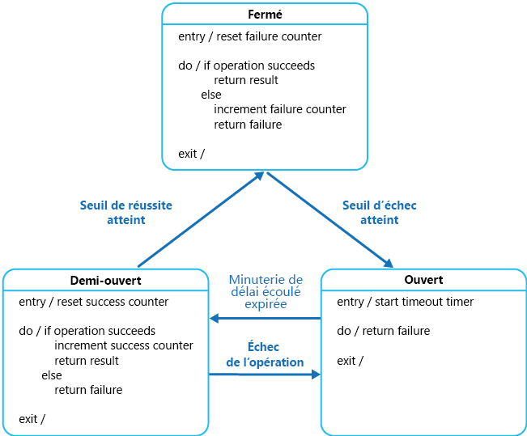

# <a name="circuit-breaker-pattern"></a><span data-ttu-id="bcd85-104">Modèle Disjoncteur</span><span class="sxs-lookup"><span data-stu-id="bcd85-104">Circuit Breaker pattern</span></span>

<span data-ttu-id="bcd85-105">Gérer les erreurs pour lesquelles la récupération peut prendre un certain temps lors de la connexion à une ressource ou à un service distant.</span><span class="sxs-lookup"><span data-stu-id="bcd85-105">Handle faults that might take a variable amount of time to recover from, when connecting to a remote service or resource.</span></span> <span data-ttu-id="bcd85-106">Cela peut améliorer la stabilité et la résilience d’une application.</span><span class="sxs-lookup"><span data-stu-id="bcd85-106">This can improve the stability and resiliency of an application.</span></span>

## <a name="context-and-problem"></a><span data-ttu-id="bcd85-107">Contexte et problème</span><span class="sxs-lookup"><span data-stu-id="bcd85-107">Context and problem</span></span>

<span data-ttu-id="bcd85-108">Dans un environnement distribué, les appels à des ressources et services distants peuvent échouer en raison d’erreurs temporaires telles que des connexions réseau lentes, des expirations de délais d’attente, ou encore une indisponibilité temporaire ou une sollicitation trop importante des ressources.</span><span class="sxs-lookup"><span data-stu-id="bcd85-108">In a distributed environment, calls to remote resources and services can fail due to transient faults, such as slow network connections, timeouts, or the resources being overcommitted or temporarily unavailable.</span></span> <span data-ttu-id="bcd85-109">Ces erreurs disparaissent en général automatiquement après un court laps de temps, et une application cloud fiable doit être prête à les gérer à l’aide d’une stratégie telle que le [modèle Nouvelle tentative][retry-pattern].</span><span class="sxs-lookup"><span data-stu-id="bcd85-109">These faults typically correct themselves after a short period of time, and a robust cloud application should be prepared to handle them by using a strategy such as the [Retry pattern][retry-pattern].</span></span>

<span data-ttu-id="bcd85-110">Toutefois, dans certaines situations les erreurs sont dues à des événements imprévus et peuvent durer beaucoup plus longtemps.</span><span class="sxs-lookup"><span data-stu-id="bcd85-110">However, there can also be situations where faults are due to unanticipated events, and that might take much longer to fix.</span></span> <span data-ttu-id="bcd85-111">Ces erreurs peuvent aller d’une perte partielle de connectivité à la défaillance complète d’un service.</span><span class="sxs-lookup"><span data-stu-id="bcd85-111">These faults can range in severity from a partial loss of connectivity to the complete failure of a service.</span></span> <span data-ttu-id="bcd85-112">Dans ces cas-là, il ne sert à rien qu’une application effectue de nouvelles tentatives qui sont vouées à l’échec. Au lieu de cela, elle doit rapidement reconnaître que l’opération a échoué et traiter cet échec en conséquence.</span><span class="sxs-lookup"><span data-stu-id="bcd85-112">In these situations it might be pointless for an application to continually retry an operation that is unlikely to succeed, and instead the application should quickly accept that the operation has failed and handle this failure accordingly.</span></span>

<span data-ttu-id="bcd85-113">De plus, si un service est très occupé, un échec dans une partie du système peut entraîner des défaillances en cascade.</span><span class="sxs-lookup"><span data-stu-id="bcd85-113">Additionally, if a service is very busy, failure in one part of the system might lead to cascading failures.</span></span> <span data-ttu-id="bcd85-114">Par exemple, une opération qui appelle un service peut être configurée pour implémenter un délai d’attente et répondre avec un message d’échec si le service ne répond pas pendant cette période.</span><span class="sxs-lookup"><span data-stu-id="bcd85-114">For example, an operation that invokes a service could be configured to implement a timeout, and reply with a failure message if the service fails to respond within this period.</span></span> <span data-ttu-id="bcd85-115">Toutefois, cette stratégie peut entraîner le blocage de plusieurs demandes simultanées à la même opération jusqu’à ce que le délai d’attente ait expiré.</span><span class="sxs-lookup"><span data-stu-id="bcd85-115">However, this strategy could cause many concurrent requests to the same operation to be blocked until the timeout period expires.</span></span> <span data-ttu-id="bcd85-116">Ces demandes bloquées peuvent contenir des ressources système critiques telles que de la mémoire, des threads, des connexions de base de données, et ainsi de suite.</span><span class="sxs-lookup"><span data-stu-id="bcd85-116">These blocked requests might hold critical system resources such as memory, threads, database connections, and so on.</span></span> <span data-ttu-id="bcd85-117">Ces ressources peuvent ainsi être épuisées, entraînant l’échec d’autres parties du système qui doivent utiliser les mêmes ressources.</span><span class="sxs-lookup"><span data-stu-id="bcd85-117">Consequently, these resources could become exhausted, causing failure of other possibly unrelated parts of the system that need to use the same resources.</span></span> <span data-ttu-id="bcd85-118">Dans ces situations, il serait préférable que l’opération échoue immédiatement et que l’appel du service soit tenté uniquement s’il est susceptible de réussir.</span><span class="sxs-lookup"><span data-stu-id="bcd85-118">In these situations, it would be preferable for the operation to fail immediately, and only attempt to invoke the service if it's likely to succeed.</span></span> <span data-ttu-id="bcd85-119">Notez que la définition d’un délai d’attente plus court peut aider à résoudre ce problème, mais il ne faut pas qu’il soit si court que l’opération échoue la plupart du temps, même si la demande au service aboutirait finalement.</span><span class="sxs-lookup"><span data-stu-id="bcd85-119">Note that setting a shorter timeout might help to resolve this problem, but the timeout shouldn't be so short that the operation fails most of the time, even if the request to the service would eventually succeed.</span></span>

## <a name="solution"></a><span data-ttu-id="bcd85-120">Solution</span><span class="sxs-lookup"><span data-stu-id="bcd85-120">Solution</span></span>

<span data-ttu-id="bcd85-121">Le modèle Disjoncteur, popularisé par Michael Nygard dans son livre, [Release it!](https://pragprog.com/book/mnee/release-it) (Libérez-le !), peut empêcher qu’une application ne tente d’exécuter à répétition une opération qui échouera probablement.</span><span class="sxs-lookup"><span data-stu-id="bcd85-121">The Circuit Breaker pattern, popularized by Michael Nygard in his book, [Release It!](https://pragprog.com/book/mnee/release-it), can prevent an application from repeatedly trying to execute an operation that's likely to fail.</span></span> <span data-ttu-id="bcd85-122">Cela lui permet de continuer sans attendre que l’erreur soit corrigée ou sans gaspiller des cycles de processeur pendant qu’elle détermine qu’il s’agit d’une erreur de longue durée.</span><span class="sxs-lookup"><span data-stu-id="bcd85-122">Allowing it to continue without waiting for the fault to be fixed or wasting CPU cycles while it determines that the fault is long lasting.</span></span> <span data-ttu-id="bcd85-123">Le modèle Disjoncteur permet également à une application de détecter si l’erreur a été corrigée.</span><span class="sxs-lookup"><span data-stu-id="bcd85-123">The Circuit Breaker pattern also enables an application to detect whether the fault has been resolved.</span></span> <span data-ttu-id="bcd85-124">Si le problème semble avoir été résolu, l’application peut essayer d’appeler l’opération.</span><span class="sxs-lookup"><span data-stu-id="bcd85-124">If the problem appears to have been fixed, the application can try to invoke the operation.</span></span>

> <span data-ttu-id="bcd85-125">L’objectif du modèle Disjoncteur est différent de celui du modèle Nouvelle tentative.</span><span class="sxs-lookup"><span data-stu-id="bcd85-125">The purpose of the Circuit Breaker pattern is different than the Retry pattern.</span></span> <span data-ttu-id="bcd85-126">Le modèle Nouvelle tentative permet à une application de retenter une opération en partant du principe qu’elle finira par réussir.</span><span class="sxs-lookup"><span data-stu-id="bcd85-126">The Retry pattern enables an application to retry an operation in the expectation that it'll succeed.</span></span> <span data-ttu-id="bcd85-127">Le modèle Disjoncteur empêche une application d’effectuer une opération qui échouera probablement.</span><span class="sxs-lookup"><span data-stu-id="bcd85-127">The Circuit Breaker pattern prevents an application from performing an operation that is likely to fail.</span></span> <span data-ttu-id="bcd85-128">Une application peut combiner ces deux modèles en utilisant le modèle Nouvelle tentative pour appeler une opération par le biais d’un disjoncteur.</span><span class="sxs-lookup"><span data-stu-id="bcd85-128">An application can combine these two patterns by using the Retry pattern to invoke an operation through a circuit breaker.</span></span> <span data-ttu-id="bcd85-129">Toutefois, la logique de nouvelle tentative doit être sensible aux exceptions retournées par le disjoncteur, et abandonner les nouvelles tentatives si le disjoncteur indique qu’une erreur n’est pas temporaire.</span><span class="sxs-lookup"><span data-stu-id="bcd85-129">However, the retry logic should be sensitive to any exceptions returned by the circuit breaker and abandon retry attempts if the circuit breaker indicates that a fault is not transient.</span></span>

<span data-ttu-id="bcd85-130">Un disjoncteur agit comme un proxy pour les opérations qui risquent d’échouer.</span><span class="sxs-lookup"><span data-stu-id="bcd85-130">A circuit breaker acts as a proxy for operations that might fail.</span></span> <span data-ttu-id="bcd85-131">Le proxy doit contrôler le nombre d’échecs qui se sont produits récemment, et utiliser ces informations pour décider s’il faut autoriser la poursuite de l’opération ou simplement retourner une exception immédiatement.</span><span class="sxs-lookup"><span data-stu-id="bcd85-131">The proxy should monitor the number of recent failures that have occurred, and use this information to decide whether to allow the operation to proceed, or simply return an exception immediately.</span></span>

<span data-ttu-id="bcd85-132">Le proxy peut être implémenté en tant que machine d’état avec les états suivants qui simulent la fonctionnalité d’un disjoncteur électrique :</span><span class="sxs-lookup"><span data-stu-id="bcd85-132">The proxy can be implemented as a state machine with the following states that mimic the functionality of an electrical circuit breaker:</span></span>

- <span data-ttu-id="bcd85-133">**Fermé** : la demande de l’application est routée vers l’opération.</span><span class="sxs-lookup"><span data-stu-id="bcd85-133">**Closed**: The request from the application is routed to the operation.</span></span> <span data-ttu-id="bcd85-134">Le proxy tient à jour un décompte du nombre d’échecs récents, et si l’appel à l’opération n’aboutit pas, le proxy incrémente ce nombre.</span><span class="sxs-lookup"><span data-stu-id="bcd85-134">The proxy maintains a count of the number of recent failures, and if the call to the operation is unsuccessful the proxy increments this count.</span></span> <span data-ttu-id="bcd85-135">Si le nombre d’échecs récents dépasse un seuil spécifié pendant une période donnée, le proxy est placé à l’état **Ouvert**.</span><span class="sxs-lookup"><span data-stu-id="bcd85-135">If the number of recent failures exceeds a specified threshold within a given time period, the proxy is placed into the **Open** state.</span></span> <span data-ttu-id="bcd85-136">À ce stade, le proxy démarre un minuteur de délai d’attente, et quand ce minuteur expire le proxy est placé à l’état **Demi-ouvert**.</span><span class="sxs-lookup"><span data-stu-id="bcd85-136">At this point the proxy starts a timeout timer, and when this timer expires the proxy is placed into the **Half-Open** state.</span></span>

    > <span data-ttu-id="bcd85-137">Le minuteur de délai d’attente a pour but de donner au système suffisamment de temps pour résoudre le problème qui a provoqué l’échec, avant d’autoriser l’application à tenter une nouvelle fois d’effectuer l’opération.</span><span class="sxs-lookup"><span data-stu-id="bcd85-137">The purpose of the timeout timer is to give the system time to fix the problem that caused the failure before allowing the application to try to perform the operation again.</span></span>

- <span data-ttu-id="bcd85-138">**Ouvert** : la demande de l’application échoue immédiatement et une exception est retournée à l’application.</span><span class="sxs-lookup"><span data-stu-id="bcd85-138">**Open**: The request from the application fails immediately and an exception is returned to the application.</span></span>

- <span data-ttu-id="bcd85-139">**Demi-ouvert** : un nombre limité de demandes provenant de l’application est autorisé à traverser le disjoncteur et à appeler l’opération.</span><span class="sxs-lookup"><span data-stu-id="bcd85-139">**Half-Open**: A limited number of requests from the application are allowed to pass through and invoke the operation.</span></span> <span data-ttu-id="bcd85-140">Si ces demandes réussissent, on considère que l’erreur ayant provoqué l’échec a été corrigée et le disjoncteur passe à l’état **Fermé** (le compteur d’échecs est réinitialisé).</span><span class="sxs-lookup"><span data-stu-id="bcd85-140">If these requests are successful, it's assumed that the fault that was previously causing the failure has been fixed and the circuit breaker switches to the **Closed** state (the failure counter is reset).</span></span> <span data-ttu-id="bcd85-141">Si une demande échoue, le disjoncteur considère que l’erreur est toujours présente. Il repasse donc à l’état **Ouvert** et redémarre le minuteur de délai d’attente pour accorder au système un délai supplémentaire pour récupérer suite à la défaillance.</span><span class="sxs-lookup"><span data-stu-id="bcd85-141">If any request fails, the circuit breaker assumes that the fault is still present so it reverts back to the **Open** state and restarts the timeout timer to give the system a further period of time to recover from the failure.</span></span>

    > <span data-ttu-id="bcd85-142">L’état **Demi-ouvert** est utile pour empêcher qu’un service en train de récupérer ne soit submergé soudainement de demandes.</span><span class="sxs-lookup"><span data-stu-id="bcd85-142">The **Half-Open** state is useful to prevent a recovering service from suddenly being flooded with requests.</span></span> <span data-ttu-id="bcd85-143">Quand un service est en cours de récupération, il peut être capable de prendre en charge un volume limité de demandes jusqu’à ce que la récupération soit terminée, mais pendant que la récupération est en cours un flux de travail peut provoquer un nouvel échec ou l’expiration du délai de service.</span><span class="sxs-lookup"><span data-stu-id="bcd85-143">As a service recovers, it might be able to support a limited volume of requests until the recovery is complete, but while recovery is in progress a flood of work can cause the service to time out or fail again.</span></span>



<span data-ttu-id="bcd85-145">Dans la figure, le compteur d’échecs utilisé par l’état **Fermé** est temporel.</span><span class="sxs-lookup"><span data-stu-id="bcd85-145">In the figure, the failure counter used by the **Closed** state is time based.</span></span> <span data-ttu-id="bcd85-146">Il est réinitialisé automatiquement à intervalles réguliers.</span><span class="sxs-lookup"><span data-stu-id="bcd85-146">It's automatically reset at periodic intervals.</span></span> <span data-ttu-id="bcd85-147">Cela empêche que le disjoncteur ne passe à l’état **Ouvert** s’il rencontre des défaillances occasionnelles.</span><span class="sxs-lookup"><span data-stu-id="bcd85-147">This helps to prevent the circuit breaker from entering the **Open** state if it experiences occasional failures.</span></span> <span data-ttu-id="bcd85-148">Le seuil d’échec qui fait basculer le disjoncteur à l’état **Ouvert** est atteint uniquement quand un nombre spécifié d’échecs se sont produits pendant un intervalle spécifié.</span><span class="sxs-lookup"><span data-stu-id="bcd85-148">The failure threshold that trips the circuit breaker into the **Open** state is only reached when a specified number of failures have occurred during a specified interval.</span></span> <span data-ttu-id="bcd85-149">Le compteur utilisé par l’état **Demi-ouvert** enregistre le nombre de tentatives d’appel de l’opération qui ont réussi.</span><span class="sxs-lookup"><span data-stu-id="bcd85-149">The counter used by the **Half-Open** state records the number of successful attempts to invoke the operation.</span></span> <span data-ttu-id="bcd85-150">Le disjoncteur repasse à l’état **Fermé** une fois qu’un nombre spécifié d’appels d’opérations consécutifs ont abouti.</span><span class="sxs-lookup"><span data-stu-id="bcd85-150">The circuit breaker reverts to the **Closed** state after a specified number of consecutive operation invocations have been successful.</span></span> <span data-ttu-id="bcd85-151">Si un appel échoue, le disjoncteur bascule immédiatement à l’état **Ouvert** et le compteur de réussites est réinitialisé la prochaine fois qu’il bascule à l’état **Demi-ouvert**.</span><span class="sxs-lookup"><span data-stu-id="bcd85-151">If any invocation fails, the circuit breaker enters the **Open** state immediately and the success counter will be reset the next time it enters the **Half-Open** state.</span></span>

> <span data-ttu-id="bcd85-152">Le mode de récupération du système est géré en externe, éventuellement par la restauration ou le redémarrage d’un composant défectueux ou la réparation d’une connexion réseau.</span><span class="sxs-lookup"><span data-stu-id="bcd85-152">How the system recovers is handled externally, possibly by restoring or restarting a failed component or repairing a network connection.</span></span>

<span data-ttu-id="bcd85-153">Le modèle Disjoncteur assure la stabilité pendant que le système récupère après un échec, et il réduit l’impact sur les performances.</span><span class="sxs-lookup"><span data-stu-id="bcd85-153">The Circuit Breaker pattern provides stability while the system recovers from a failure and minimizes the impact on performance.</span></span> <span data-ttu-id="bcd85-154">Il peut aider à maintenir le temps de réponse du système en rejetant rapidement une demande pour une opération qui échouera probablement, plutôt que d’attendre que l’opération expire ou ne retourne jamais.</span><span class="sxs-lookup"><span data-stu-id="bcd85-154">It can help to maintain the response time of the system by quickly rejecting a request for an operation that's likely to fail, rather than waiting for the operation to time out, or never return.</span></span> <span data-ttu-id="bcd85-155">Si le disjoncteur déclenche un événement chaque fois qu’il change d’état, cette information peut être utilisée pour surveiller l’intégrité de la partie du système protégée par le disjoncteur, ou pour alerter l’administrateur quand un disjoncteur bascule à l’état **Ouvert**.</span><span class="sxs-lookup"><span data-stu-id="bcd85-155">If the circuit breaker raises an event each time it changes state, this information can be used to monitor the health of the part of the system protected by the circuit breaker, or to alert an administrator when a circuit breaker trips to the **Open** state.</span></span>

<span data-ttu-id="bcd85-156">Le modèle est personnalisable et peut être adapté en fonction du type de défaillance possible.</span><span class="sxs-lookup"><span data-stu-id="bcd85-156">The pattern is customizable and can be adapted according to the type of the possible failure.</span></span> <span data-ttu-id="bcd85-157">Par exemple, vous pouvez appliquer un minuteur de délai d’attente croissant à un disjoncteur.</span><span class="sxs-lookup"><span data-stu-id="bcd85-157">For example, you can apply an increasing timeout timer to a circuit breaker.</span></span> <span data-ttu-id="bcd85-158">Vous pouvez placer initialement le disjoncteur à l’état **Ouvert** pendant quelques secondes et, si l’échec n’a pas été résolu, augmenter le délai de quelques minutes, et ainsi de suite.</span><span class="sxs-lookup"><span data-stu-id="bcd85-158">You could place the circuit breaker in the **Open** state for a few seconds initially, and then if the failure hasn't been resolved increase the timeout to a few minutes, and so on.</span></span> <span data-ttu-id="bcd85-159">Dans certains cas, plutôt que de faire en sorte que l’état **Ouvert** retourne un échec et déclenche une exception, il peut être utile de retourner une valeur par défaut qui est significative pour l’application.</span><span class="sxs-lookup"><span data-stu-id="bcd85-159">In some cases, rather than the **Open** state returning failure and raising an exception, it could be useful to return a default value that is meaningful to the application.</span></span>

## <a name="issues-and-considerations"></a><span data-ttu-id="bcd85-160">Problèmes et considérations</span><span class="sxs-lookup"><span data-stu-id="bcd85-160">Issues and considerations</span></span>

<span data-ttu-id="bcd85-161">Prenez en compte les points suivants quand vous choisissez comment implémenter ce modèle :</span><span class="sxs-lookup"><span data-stu-id="bcd85-161">You should consider the following points when deciding how to implement this pattern:</span></span>

<span data-ttu-id="bcd85-162">**Gestion des exceptions**.</span><span class="sxs-lookup"><span data-stu-id="bcd85-162">**Exception Handling**.</span></span> <span data-ttu-id="bcd85-163">Une application appelant une opération par le biais d’un disjoncteur doit pouvoir gérer les exceptions déclenchées si l’opération n’est pas disponible.</span><span class="sxs-lookup"><span data-stu-id="bcd85-163">An application invoking an operation through a circuit breaker must be prepared to handle the exceptions raised if the operation is unavailable.</span></span> <span data-ttu-id="bcd85-164">Le traitement des exceptions est propre à l’application.</span><span class="sxs-lookup"><span data-stu-id="bcd85-164">The way exceptions are handled will be application specific.</span></span> <span data-ttu-id="bcd85-165">Par exemple, une application peut temporairement dégrader ses fonctionnalités, appeler une opération de remplacement pour tenter d’effectuer la même tâche ou obtenir les mêmes données, ou signaler l’exception à l’utilisateur et lui demander de réessayer ultérieurement.</span><span class="sxs-lookup"><span data-stu-id="bcd85-165">For example, an application could temporarily degrade its functionality, invoke an alternative operation to try to perform the same task or obtain the same data, or report the exception to the user and ask them to try again later.</span></span>

<span data-ttu-id="bcd85-166">**Types d’exceptions**.</span><span class="sxs-lookup"><span data-stu-id="bcd85-166">**Types of Exceptions**.</span></span> <span data-ttu-id="bcd85-167">Une demande peut échouer pour de nombreuses raisons, certaines d’entre elles pouvant indiquer un type de défaillance plus grave que d’autres.</span><span class="sxs-lookup"><span data-stu-id="bcd85-167">A request might fail for many reasons, some of which might indicate a more severe type of failure than others.</span></span> <span data-ttu-id="bcd85-168">Par exemple, une demande peut échouer car un service distant s’est bloqué et plusieurs minutes seront nécessaires à sa récupération, ou à cause d’une expiration de délai d’attente due à une surcharge temporaire du service.</span><span class="sxs-lookup"><span data-stu-id="bcd85-168">For example, a request might fail because a remote service has crashed and will take several minutes to recover, or because of a timeout due to the service being temporarily overloaded.</span></span> <span data-ttu-id="bcd85-169">Un disjoncteur peut être en mesure d’examiner les types d’exceptions qui se produisent et d’ajuster sa stratégie d’après la nature de ces exceptions.</span><span class="sxs-lookup"><span data-stu-id="bcd85-169">A circuit breaker might be able to examine the types of exceptions that occur and adjust its strategy depending on the nature of these exceptions.</span></span> <span data-ttu-id="bcd85-170">Par exemple, vous pouvez faire en sorte qu’un plus grand nombre d’exceptions de délai d’attente soit nécessaires pour faire basculer le disjoncteur à l’état **Ouvert**, par rapport au nombre de défaillances dues à une indisponibilité totale du service.</span><span class="sxs-lookup"><span data-stu-id="bcd85-170">For example, it might require a larger number of timeout exceptions to trip the circuit breaker to the **Open** state compared to the number of failures due to the service being completely unavailable.</span></span>

<span data-ttu-id="bcd85-171">**Journalisation**.</span><span class="sxs-lookup"><span data-stu-id="bcd85-171">**Logging**.</span></span> <span data-ttu-id="bcd85-172">Un disjoncteur doit consigner toutes les demandes ayant échoué (et éventuellement celles ayant réussi) pour permettre à un administrateur de surveiller l’intégrité de l’opération.</span><span class="sxs-lookup"><span data-stu-id="bcd85-172">A circuit breaker should log all failed requests (and possibly successful requests) to enable an administrator to monitor the health of the operation.</span></span>

<span data-ttu-id="bcd85-173">**Capacité de restauration**.</span><span class="sxs-lookup"><span data-stu-id="bcd85-173">**Recoverability**.</span></span> <span data-ttu-id="bcd85-174">Vous devez configurer le disjoncteur pour qu’il corresponde au modèle de récupération probable de l’opération qu’il protège.</span><span class="sxs-lookup"><span data-stu-id="bcd85-174">You should configure the circuit breaker to match the likely recovery pattern of the operation it's protecting.</span></span> <span data-ttu-id="bcd85-175">Par exemple, si le disjoncteur reste à l’état **Ouvert** pendant une longue période, il peut lever des exceptions même si la cause de l’échec a disparu.</span><span class="sxs-lookup"><span data-stu-id="bcd85-175">For example, if the circuit breaker remains in the **Open** state for a long period, it could raise exceptions even if the reason for the failure has been resolved.</span></span> <span data-ttu-id="bcd85-176">De même, un disjoncteur peut fluctuer et réduire le temps de réponse des applications s’il bascule trop rapidement de l’état **Ouvert** à l’état **Demi-ouvert**.</span><span class="sxs-lookup"><span data-stu-id="bcd85-176">Similarly, a circuit breaker could fluctuate and reduce the response times of applications if it switches from the **Open** state to the **Half-Open** state too quickly.</span></span>

<span data-ttu-id="bcd85-177">**Test des opérations ayant échoué**.</span><span class="sxs-lookup"><span data-stu-id="bcd85-177">**Testing Failed Operations**.</span></span> <span data-ttu-id="bcd85-178">À l’état **Ouvert**, plutôt que d’utiliser un minuteur pour déterminer quand basculer à l’état **Demi-ouvert**, un disjoncteur peut exécuter régulièrement un test ping sur la ressource ou le service distant pour déterminer s’il ou elle est de nouveau disponible.</span><span class="sxs-lookup"><span data-stu-id="bcd85-178">In the **Open** state, rather than using a timer to determine when to switch to the **Half-Open** state, a circuit breaker can instead periodically ping the remote service or resource to determine whether it's become available again.</span></span> <span data-ttu-id="bcd85-179">Cette commande ping peut prendre la forme d’une tentative d’appel d’une opération qui a précédemment échoué. Vous pourriez aussi utiliser une opération spéciale fournie par le service distant spécifiquement pour tester l’intégrité du service, comme indiqué par le [Modèle de surveillance de point de terminaison d’intégrité](health-endpoint-monitoring.md).</span><span class="sxs-lookup"><span data-stu-id="bcd85-179">This ping could take the form of an attempt to invoke an operation that had previously failed, or it could use a special operation provided by the remote service specifically for testing the health of the service, as described by the [Health Endpoint Monitoring pattern](health-endpoint-monitoring.md).</span></span>

<span data-ttu-id="bcd85-180">**Remplacement manuel**.</span><span class="sxs-lookup"><span data-stu-id="bcd85-180">**Manual Override**.</span></span> <span data-ttu-id="bcd85-181">Dans un système où le temps de récupération pour une opération ayant échoué est très variable, il est préférable de fournir une option de réinitialisation manuelle qui permet à un administrateur de fermer un disjoncteur (et de réinitialiser le compteur d’échecs).</span><span class="sxs-lookup"><span data-stu-id="bcd85-181">In a system where the recovery time for a failing operation is extremely variable, it's beneficial to provide a manual reset option that enables an administrator to close a circuit breaker (and reset the failure counter).</span></span> <span data-ttu-id="bcd85-182">De même, un administrateur peut forcer un disjoncteur à l’état **Ouvert** (et redémarrer le minuteur de délai d’attente) si l’opération protégée par le disjoncteur est temporairement indisponible.</span><span class="sxs-lookup"><span data-stu-id="bcd85-182">Similarly, an administrator could force a circuit breaker into the **Open** state (and restart the timeout timer) if the operation protected by the circuit breaker is temporarily unavailable.</span></span>

<span data-ttu-id="bcd85-183">**Accès concurrentiel**.</span><span class="sxs-lookup"><span data-stu-id="bcd85-183">**Concurrency**.</span></span> <span data-ttu-id="bcd85-184">Le même disjoncteur peut être sollicité par un grand nombre d’instances simultanées d’une application.</span><span class="sxs-lookup"><span data-stu-id="bcd85-184">The same circuit breaker could be accessed by a large number of concurrent instances of an application.</span></span> <span data-ttu-id="bcd85-185">L’implémentation ne doit pas bloquer les demandes simultanées, ni ajouter une surcharge excessive à chaque appel à une opération.</span><span class="sxs-lookup"><span data-stu-id="bcd85-185">The implementation shouldn't block concurrent requests or add excessive overhead to each call to an operation.</span></span>

<span data-ttu-id="bcd85-186">**Différenciation des ressources**.</span><span class="sxs-lookup"><span data-stu-id="bcd85-186">**Resource Differentiation**.</span></span> <span data-ttu-id="bcd85-187">Soyez prudent lors de l’utilisation d’un disjoncteur unique pour un type de ressource s’il peut y avoir plusieurs fournisseurs indépendants sous-jacents.</span><span class="sxs-lookup"><span data-stu-id="bcd85-187">Be careful when using a single circuit breaker for one type of resource if there might be multiple underlying independent providers.</span></span> <span data-ttu-id="bcd85-188">Par exemple, dans un magasin de données qui contient plusieurs partitions, l’une d’entre elles peut être entièrement accessible alors qu’une autre rencontre un problème temporaire.</span><span class="sxs-lookup"><span data-stu-id="bcd85-188">For example, in a data store that contains multiple shards, one shard might be fully accessible while another is experiencing a temporary issue.</span></span> <span data-ttu-id="bcd85-189">Si les réponses aux erreurs dans ces scénarios sont fusionnées, une application risque de tenter d’accéder à certaines partitions même quand l’échec est très probable, tandis que l’accès à d’autres partitions risque d’être bloqué alors qu’il a toutes les chances de réussir.</span><span class="sxs-lookup"><span data-stu-id="bcd85-189">If the error responses in these scenarios are merged, an application might try to access some shards even when failure is highly likely, while access to other shards might be blocked even though it's likely to succeed.</span></span>

<span data-ttu-id="bcd85-190">**Disjonctage accéléré**.</span><span class="sxs-lookup"><span data-stu-id="bcd85-190">**Accelerated Circuit Breaking**.</span></span> <span data-ttu-id="bcd85-191">Parfois, une réponse d’échec peut contenir suffisamment d’informations pour que le disjoncteur bascule immédiatement et le demeure pendant un laps de temps minimum.</span><span class="sxs-lookup"><span data-stu-id="bcd85-191">Sometimes a failure response can contain enough information for the circuit breaker to trip immediately and stay tripped for a minimum amount of time.</span></span> <span data-ttu-id="bcd85-192">Par exemple, la réponse d’erreur d’une ressource partagée qui est surchargée peut indiquer qu’une nouvelle tentative immédiate n’est pas recommandée, et que l’application doit plutôt réessayer dans quelques minutes.</span><span class="sxs-lookup"><span data-stu-id="bcd85-192">For example, the error response from a shared resource that's overloaded could indicate that an immediate retry isn't recommended and that the application should instead try again in a few minutes.</span></span>

> [!NOTE]
> <span data-ttu-id="bcd85-193">Un service peut retourner l’erreur HTTP 429 (Demandes trop nombreuses) s’il limite le client, ou l’erreur HTTP 503 (Service indisponible) si le service n’est pas disponible actuellement.</span><span class="sxs-lookup"><span data-stu-id="bcd85-193">A service can return HTTP 429 (Too Many Requests) if it is throttling the client, or HTTP 503 (Service Unavailable) if the service is not currently available.</span></span> <span data-ttu-id="bcd85-194">La réponse peut inclure des informations supplémentaires, telles que la durée prévue du retard.</span><span class="sxs-lookup"><span data-stu-id="bcd85-194">The response can include additional information, such as the anticipated duration of the delay.</span></span>

<span data-ttu-id="bcd85-195">**Relecture des demandes ayant échoué**.</span><span class="sxs-lookup"><span data-stu-id="bcd85-195">**Replaying Failed Requests**.</span></span> <span data-ttu-id="bcd85-196">À l’état **Ouvert**, au lieu de simplement échouer rapidement, un disjoncteur peut aussi enregistrer les détails de chaque demande dans un journal, et faire en sorte que ces demandes soient relues quand la ressource ou le service distant redevient disponible.</span><span class="sxs-lookup"><span data-stu-id="bcd85-196">In the **Open** state, rather than simply failing quickly, a circuit breaker could also record the details of each request to a journal and arrange for these requests to be replayed when the remote resource or service becomes available.</span></span>

<span data-ttu-id="bcd85-197">**Délais d’attente inappropriés sur les services externes**.</span><span class="sxs-lookup"><span data-stu-id="bcd85-197">**Inappropriate Timeouts on External Services**.</span></span> <span data-ttu-id="bcd85-198">Il est possible qu’un disjoncteur ne puisse pas protéger entièrement les applications contre les opérations qui échouent dans des services externes configurés avec un long délai d’attente.</span><span class="sxs-lookup"><span data-stu-id="bcd85-198">A circuit breaker might not be able to fully protect applications from operations that fail in external services that are configured with a lengthy timeout period.</span></span> <span data-ttu-id="bcd85-199">Si le délai d’attente est trop long, un thread exécutant un disjoncteur peut être bloqué pendant une période prolongée avant que le disjoncteur n’indique que l’opération a échoué.</span><span class="sxs-lookup"><span data-stu-id="bcd85-199">If the timeout is too long, a thread running a circuit breaker might be blocked for an extended period before the circuit breaker indicates that the operation has failed.</span></span> <span data-ttu-id="bcd85-200">Pendant ce temps, de nombreuses autres instances peuvent également tenter d’appeler le service par le biais du disjoncteur, et occuper un nombre important de threads avant que toutes n’échouent.</span><span class="sxs-lookup"><span data-stu-id="bcd85-200">In this time, many other application instances might also try to invoke the service through the circuit breaker and tie up a significant number of threads before they all fail.</span></span>

## <a name="when-to-use-this-pattern"></a><span data-ttu-id="bcd85-201">Quand utiliser ce modèle</span><span class="sxs-lookup"><span data-stu-id="bcd85-201">When to use this pattern</span></span>

<span data-ttu-id="bcd85-202">Utilisez ce modèle :</span><span class="sxs-lookup"><span data-stu-id="bcd85-202">Use this pattern:</span></span>

- <span data-ttu-id="bcd85-203">Pour empêcher qu’une application n’essaie d’appeler un service distant ou d’accéder à une ressource partagée, si cette opération a de grandes chances d’échouer.</span><span class="sxs-lookup"><span data-stu-id="bcd85-203">To prevent an application from trying to invoke a remote service or access a shared resource if this operation is highly likely to fail.</span></span>

<span data-ttu-id="bcd85-204">Ce modèle n’est pas recommandé :</span><span class="sxs-lookup"><span data-stu-id="bcd85-204">This pattern isn't recommended:</span></span>

- <span data-ttu-id="bcd85-205">Pour la gestion de l’accès aux ressources privées locales dans une application, comme la structure de données en mémoire.</span><span class="sxs-lookup"><span data-stu-id="bcd85-205">For handling access to local private resources in an application, such as in-memory data structure.</span></span> <span data-ttu-id="bcd85-206">Dans cet environnement, l’utilisation d’un disjoncteur ajouterait une surcharge à votre système.</span><span class="sxs-lookup"><span data-stu-id="bcd85-206">In this environment, using a circuit breaker would add overhead to your system.</span></span>
- <span data-ttu-id="bcd85-207">Comme substitut pour la gestion des exceptions dans la logique métier de vos applications.</span><span class="sxs-lookup"><span data-stu-id="bcd85-207">As a substitute for handling exceptions in the business logic of your applications.</span></span>

## <a name="example"></a><span data-ttu-id="bcd85-208">Exemples</span><span class="sxs-lookup"><span data-stu-id="bcd85-208">Example</span></span>

<span data-ttu-id="bcd85-209">Dans une application web, plusieurs pages sont remplies avec des données extraites à partir d’un service externe.</span><span class="sxs-lookup"><span data-stu-id="bcd85-209">In a web application, several of the pages are populated with data retrieved from an external service.</span></span> <span data-ttu-id="bcd85-210">Si le système implémente une mise en cache minimale, la plupart des accès à ces pages provoquent un aller-retour vers le service.</span><span class="sxs-lookup"><span data-stu-id="bcd85-210">If the system implements minimal caching, most hits to these pages will cause a round trip to the service.</span></span> <span data-ttu-id="bcd85-211">Les connexions de l’application web au service peuvent être configurées avec un délai d’expiration (en général 60 secondes) et, si le service ne répond pas dans le délai imparti, la logique dans chaque page web considère que le service est indisponible et lève une exception.</span><span class="sxs-lookup"><span data-stu-id="bcd85-211">Connections from the web application to the service could be configured with a timeout period (typically 60 seconds), and if the service doesn't respond in this time the logic in each web page will assume that the service is unavailable and throw an exception.</span></span>

<span data-ttu-id="bcd85-212">Toutefois, si le service échoue et que le système est très occupé, les utilisateurs peuvent être contraints d’attendre jusqu’à 60 secondes avant qu’une exception ne se produise.</span><span class="sxs-lookup"><span data-stu-id="bcd85-212">However, if the service fails and the system is very busy, users could be forced to wait for up to 60 seconds before an exception occurs.</span></span> <span data-ttu-id="bcd85-213">Finalement, des ressources telles que de la mémoire, des connexions et des threads risquent d’être épuisées, empêchant d’autres utilisateurs de se connecter au système même s’ils n’accèdent pas à des pages qui extraient des données à partir du service.</span><span class="sxs-lookup"><span data-stu-id="bcd85-213">Eventually resources such as memory, connections, and threads could be exhausted, preventing other users from connecting to the system, even if they aren't accessing pages that retrieve data from the service.</span></span>

<span data-ttu-id="bcd85-214">La montée en charge du système par l’ajout de serveurs web et l’implémentation de l’équilibrage de charge peut retarder l’épuisement des ressources, mais elle ne résout pas le problème car les demandes des utilisateurs n’auront toujours pas de réponse et tous les serveurs web risquent quand même d’être à cours de ressources.</span><span class="sxs-lookup"><span data-stu-id="bcd85-214">Scaling the system by adding further web servers and implementing load balancing might delay when resources become exhausted, but it won't resolve the issue because user requests will still be unresponsive and all web servers could still eventually run out of resources.</span></span>

<span data-ttu-id="bcd85-215">Encapsuler la logique qui se connecte au service et extrait les données dans un disjoncteur pourrait aider à résoudre ce problème et à gérer l’échec du service de façon plus élégante.</span><span class="sxs-lookup"><span data-stu-id="bcd85-215">Wrapping the logic that connects to the service and retrieves the data in a circuit breaker could help to solve this problem and handle the service failure more elegantly.</span></span> <span data-ttu-id="bcd85-216">Les demandes des utilisateurs échoueront quand même, mais plus rapidement, et les ressources ne seront pas bloquées.</span><span class="sxs-lookup"><span data-stu-id="bcd85-216">User requests will still fail, but they'll fail more quickly and the resources won't be blocked.</span></span>

<span data-ttu-id="bcd85-217">La classe `CircuitBreaker` tient à jour les informations d’état concernant un disjoncteur dans un objet qui implémente l’interface `ICircuitBreakerStateStore` illustrée dans le code suivant.</span><span class="sxs-lookup"><span data-stu-id="bcd85-217">The `CircuitBreaker` class maintains state information about a circuit breaker in an object that implements the `ICircuitBreakerStateStore` interface shown in the following code.</span></span>

```csharp
interface ICircuitBreakerStateStore
{
  CircuitBreakerStateEnum State { get; }

  Exception LastException { get; }

  DateTime LastStateChangedDateUtc { get; }

  void Trip(Exception ex);

  void Reset();

  void HalfOpen();

  bool IsClosed { get; }
}
```

<span data-ttu-id="bcd85-218">La propriété `State` indique l’état actuel du disjoncteur et a la valeur **Open**, **HalfOpen** ou **Closed** telle que définie par l’énumération `CircuitBreakerStateEnum`.</span><span class="sxs-lookup"><span data-stu-id="bcd85-218">The `State` property indicates the current state of the circuit breaker, and will be either **Open**, **HalfOpen**, or **Closed** as defined by the `CircuitBreakerStateEnum` enumeration.</span></span> <span data-ttu-id="bcd85-219">La propriété `IsClosed` doit être true si le disjoncteur est fermé, mais false s’il est ouvert ou à demi ouvert.</span><span class="sxs-lookup"><span data-stu-id="bcd85-219">The `IsClosed` property should be true if the circuit breaker is closed, but false if it's open or half open.</span></span> <span data-ttu-id="bcd85-220">La méthode `Trip` fait basculer le disjoncteur à l’état ouvert et enregistre l’exception qui a provoqué le changement d’état, ainsi que la date et l’heure de l’exception.</span><span class="sxs-lookup"><span data-stu-id="bcd85-220">The `Trip` method switches the state of the circuit breaker to the open state and records the exception that caused the change in state, together with the date and time that the exception occurred.</span></span> <span data-ttu-id="bcd85-221">Les propriétés `LastException` et `LastStateChangedDateUtc` retournent ces informations.</span><span class="sxs-lookup"><span data-stu-id="bcd85-221">The `LastException` and the `LastStateChangedDateUtc` properties return this information.</span></span> <span data-ttu-id="bcd85-222">La méthode `Reset` ferme le disjoncteur et la méthode `HalfOpen` le fait passer à l’état demi-ouvert.</span><span class="sxs-lookup"><span data-stu-id="bcd85-222">The `Reset` method closes the circuit breaker, and the `HalfOpen` method sets the circuit breaker to half open.</span></span>

<span data-ttu-id="bcd85-223">La classe `InMemoryCircuitBreakerStateStore` dans l’exemple contient une implémentation de l’interface `ICircuitBreakerStateStore`.</span><span class="sxs-lookup"><span data-stu-id="bcd85-223">The `InMemoryCircuitBreakerStateStore` class in the example contains an implementation of the `ICircuitBreakerStateStore` interface.</span></span> <span data-ttu-id="bcd85-224">La classe `CircuitBreaker` crée une instance de cette classe pour contenir l’état du disjoncteur.</span><span class="sxs-lookup"><span data-stu-id="bcd85-224">The `CircuitBreaker` class creates an instance of this class to hold the state of the circuit breaker.</span></span>

<span data-ttu-id="bcd85-225">La méthode `ExecuteAction` dans la classe `CircuitBreaker` encapsule une opération, spécifiée comme délégué `Action`.</span><span class="sxs-lookup"><span data-stu-id="bcd85-225">The `ExecuteAction` method in the `CircuitBreaker` class wraps an operation, specified as an `Action` delegate.</span></span> <span data-ttu-id="bcd85-226">Si le disjoncteur est fermé, `ExecuteAction` appelle le délégué `Action`.</span><span class="sxs-lookup"><span data-stu-id="bcd85-226">If the circuit breaker is closed, `ExecuteAction` invokes the `Action` delegate.</span></span> <span data-ttu-id="bcd85-227">Si l’opération échoue, un gestionnaire d’exceptions appelle `TrackException`, qui fait passer le disjoncteur à l’état ouvert.</span><span class="sxs-lookup"><span data-stu-id="bcd85-227">If the operation fails, an exception handler calls `TrackException`, which sets the circuit breaker state to open.</span></span> <span data-ttu-id="bcd85-228">L’exemple de code suivant met en évidence ce flux.</span><span class="sxs-lookup"><span data-stu-id="bcd85-228">The following code example highlights this flow.</span></span>

```csharp
public class CircuitBreaker
{
  private readonly ICircuitBreakerStateStore stateStore =
    CircuitBreakerStateStoreFactory.GetCircuitBreakerStateStore();

  private readonly object halfOpenSyncObject = new object ();
  ...
  public bool IsClosed { get { return stateStore.IsClosed; } }

  public bool IsOpen { get { return !IsClosed; } }

  public void ExecuteAction(Action action)
  {
    ...
    if (IsOpen)
    {
      // The circuit breaker is Open.
      ... (see code sample below for details)
    }

    // The circuit breaker is Closed, execute the action.
    try
    {
      action();
    }
    catch (Exception ex)
    {
      // If an exception still occurs here, simply
      // retrip the breaker immediately.
      this.TrackException(ex);

      // Throw the exception so that the caller can tell
      // the type of exception that was thrown.
      throw;
    }
  }

  private void TrackException(Exception ex)
  {
    // For simplicity in this example, open the circuit breaker on the first exception.
    // In reality this would be more complex. A certain type of exception, such as one
    // that indicates a service is offline, might trip the circuit breaker immediately.
    // Alternatively it might count exceptions locally or across multiple instances and
    // use this value over time, or the exception/success ratio based on the exception
    // types, to open the circuit breaker.
    this.stateStore.Trip(ex);
  }
}
```

<span data-ttu-id="bcd85-229">L’exemple suivant montre le code (omis dans l’exemple précédent) qui est exécuté si le disjoncteur n’est pas fermé.</span><span class="sxs-lookup"><span data-stu-id="bcd85-229">The following example shows the code (omitted from the previous example) that is executed if the circuit breaker isn't closed.</span></span> <span data-ttu-id="bcd85-230">Il vérifie d’abord si le disjoncteur est ouvert depuis plus longtemps que la durée spécifiée par le champ `OpenToHalfOpenWaitTime` local dans la classe `CircuitBreaker`.</span><span class="sxs-lookup"><span data-stu-id="bcd85-230">It first checks if the circuit breaker has been open for a period longer than the time specified by the local `OpenToHalfOpenWaitTime` field in the `CircuitBreaker` class.</span></span> <span data-ttu-id="bcd85-231">Si c’est le cas, la méthode `ExecuteAction` fait passer le disjoncteur à l’état demi-ouvert, puis tente d’effectuer l’opération spécifiée par le délégué `Action`.</span><span class="sxs-lookup"><span data-stu-id="bcd85-231">If this is the case, the `ExecuteAction` method sets the circuit breaker to half open, then tries to perform the operation specified by the `Action` delegate.</span></span>

<span data-ttu-id="bcd85-232">Si l’opération réussit, le disjoncteur est réinitialisé à l’état fermé.</span><span class="sxs-lookup"><span data-stu-id="bcd85-232">If the operation is successful, the circuit breaker is reset to the closed state.</span></span> <span data-ttu-id="bcd85-233">Si l’opération échoue, il est rebasculé à l’état ouvert et l’heure de l’exception est mise à jour pour que le disjoncteur attende pendant un laps de temps supplémentaire avant de réessayer d’exécuter l’opération.</span><span class="sxs-lookup"><span data-stu-id="bcd85-233">If the operation fails, it is tripped back to the open state and the time the exception occurred is updated so that the circuit breaker will wait for a further period before trying to perform the operation again.</span></span>

<span data-ttu-id="bcd85-234">Si le disjoncteur est ouvert depuis un laps de temps inférieur à la valeur `OpenToHalfOpenWaitTime`, la méthode `ExecuteAction` lève simplement une exception `CircuitBreakerOpenException` et retourne l’erreur qui a fait basculer le disjoncteur à l’état ouvert.</span><span class="sxs-lookup"><span data-stu-id="bcd85-234">If the circuit breaker has only been open for a short time, less than the `OpenToHalfOpenWaitTime` value, the `ExecuteAction` method simply throws a `CircuitBreakerOpenException` exception and returns the error that caused the circuit breaker to transition to the open state.</span></span>

<span data-ttu-id="bcd85-235">Cet exemple utilise aussi un verrou pour empêcher que le disjoncteur n’essaie d’effectuer des appels simultanés à l’opération pendant qu’il est à demi ouvert.</span><span class="sxs-lookup"><span data-stu-id="bcd85-235">Additionally, it uses a lock to prevent the circuit breaker from trying to perform concurrent calls to the operation while it's half open.</span></span> <span data-ttu-id="bcd85-236">Une tentative simultanée d’appel de l’opération est traitée comme si le disjoncteur était ouvert, et échoue avec une exception comme décrit plus loin.</span><span class="sxs-lookup"><span data-stu-id="bcd85-236">A concurrent attempt to invoke the operation will be handled as if the circuit breaker was open, and it'll fail with an exception as described later.</span></span>

```csharp
    ...
    if (IsOpen)
    {
      // The circuit breaker is Open. Check if the Open timeout has expired.
      // If it has, set the state to HalfOpen. Another approach might be to
      // check for the HalfOpen state that had be set by some other operation.
      if (stateStore.LastStateChangedDateUtc + OpenToHalfOpenWaitTime < DateTime.UtcNow)
      {
        // The Open timeout has expired. Allow one operation to execute. Note that, in
        // this example, the circuit breaker is set to HalfOpen after being
        // in the Open state for some period of time. An alternative would be to set
        // this using some other approach such as a timer, test method, manually, and
        // so on, and check the state here to determine how to handle execution
        // of the action.
        // Limit the number of threads to be executed when the breaker is HalfOpen.
        // An alternative would be to use a more complex approach to determine which
        // threads or how many are allowed to execute, or to execute a simple test
        // method instead.
        bool lockTaken = false;
        try
        {
          Monitor.TryEnter(halfOpenSyncObject, ref lockTaken);
          if (lockTaken)
          {
            // Set the circuit breaker state to HalfOpen.
            stateStore.HalfOpen();

            // Attempt the operation.
            action();

            // If this action succeeds, reset the state and allow other operations.
            // In reality, instead of immediately returning to the Closed state, a counter
            // here would record the number of successful operations and return the
            // circuit breaker to the Closed state only after a specified number succeed.
            this.stateStore.Reset();
            return;
          }
          catch (Exception ex)
          {
            // If there's still an exception, trip the breaker again immediately.
            this.stateStore.Trip(ex);

            // Throw the exception so that the caller knows which exception occurred.
            throw;
          }
          finally
          {
            if (lockTaken)
            {
              Monitor.Exit(halfOpenSyncObject);
            }
          }
        }
      }
      // The Open timeout hasn't yet expired. Throw a CircuitBreakerOpen exception to
      // inform the caller that the call was not actually attempted,
      // and return the most recent exception received.
      throw new CircuitBreakerOpenException(stateStore.LastException);
    }
    ...
```

<span data-ttu-id="bcd85-237">Pour utiliser un objet `CircuitBreaker` pour protéger une opération, une application crée une instance de la classe `CircuitBreaker` et appelle la méthode `ExecuteAction`, en spécifiant l’opération à effectuer en tant que paramètre.</span><span class="sxs-lookup"><span data-stu-id="bcd85-237">To use a `CircuitBreaker` object to protect an operation, an application creates an instance of the `CircuitBreaker` class and invokes the `ExecuteAction` method, specifying the operation to be performed as the parameter.</span></span> <span data-ttu-id="bcd85-238">L’application doit être prête à intercepter l’exception `CircuitBreakerOpenException` si l’opération échoue car le disjoncteur est ouvert.</span><span class="sxs-lookup"><span data-stu-id="bcd85-238">The application should be prepared to catch the `CircuitBreakerOpenException` exception if the operation fails because the circuit breaker is open.</span></span> <span data-ttu-id="bcd85-239">Le code suivant montre un exemple :</span><span class="sxs-lookup"><span data-stu-id="bcd85-239">The following code shows an example:</span></span>

```csharp
var breaker = new CircuitBreaker();

try
{
  breaker.ExecuteAction(() =>
  {
    // Operation protected by the circuit breaker.
    ...
  });
}
catch (CircuitBreakerOpenException ex)
{
  // Perform some different action when the breaker is open.
  // Last exception details are in the inner exception.
  ...
}
catch (Exception ex)
{
  ...
}
```

## <a name="related-patterns-and-guidance"></a><span data-ttu-id="bcd85-240">Conseils et modèles connexes</span><span class="sxs-lookup"><span data-stu-id="bcd85-240">Related patterns and guidance</span></span>

<span data-ttu-id="bcd85-241">Les modèles suivants peuvent également être utiles lors de l’implémentation de ce modèle :</span><span class="sxs-lookup"><span data-stu-id="bcd85-241">The following patterns might also be useful when implementing this pattern:</span></span>

- <span data-ttu-id="bcd85-242">[Modèle Nouvelles tentatives][retry-pattern].</span><span class="sxs-lookup"><span data-stu-id="bcd85-242">[Retry Pattern][retry-pattern].</span></span> <span data-ttu-id="bcd85-243">Décrit comment une application peut gérer les défaillances temporaires anticipées quand elle tente de se connecter à un service ou à une ressource réseau en réessayant d’exécuter en toute transparence une opération qui a échoué précédemment.</span><span class="sxs-lookup"><span data-stu-id="bcd85-243">Describes how an application can handle anticipated temporary failures when it tries to connect to a service or network resource by transparently retrying an operation that has previously failed.</span></span>

- <span data-ttu-id="bcd85-244">[Modèle Surveillance de point de terminaison](health-endpoint-monitoring.md).</span><span class="sxs-lookup"><span data-stu-id="bcd85-244">[Health Endpoint Monitoring Pattern](health-endpoint-monitoring.md).</span></span> <span data-ttu-id="bcd85-245">Un disjoncteur peut tester l’intégrité d’un service en envoyant une demande à un point de terminaison exposé par le service.</span><span class="sxs-lookup"><span data-stu-id="bcd85-245">A circuit breaker might be able to test the health of a service by sending a request to an endpoint exposed by the service.</span></span> <span data-ttu-id="bcd85-246">Le service doit retourner des informations indiquant son état.</span><span class="sxs-lookup"><span data-stu-id="bcd85-246">The service should return information indicating its status.</span></span>


[retry-pattern]: ./retry.md
