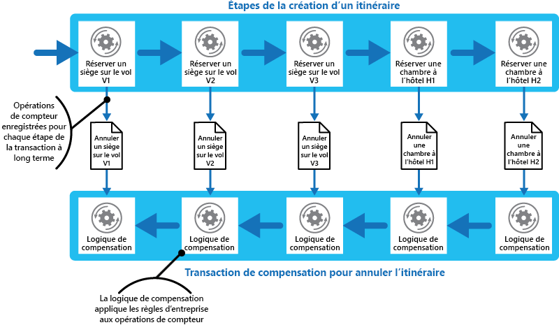

# Modèle de transaction de compensation

[!INCLUDE [header](../_includes/header.md)]

Annulez le travail effectué par une série d’étapes, qui définissent ensemble une opération cohérente, dans le cas où une ou plusieurs de ces étapes échouent. Les opérations qui suivent le modèle de cohérence éventuelle sont couramment rencontrées dans les applications hébergées dans le cloud qui implémentent des flux de travail et des processus professionnels complexes.

## Contexte et problème

Les applications qui s’exécutent dans le cloud modifient fréquemment des données. Ces données peuvent provenir de diverses sources de données réparties dans différents emplacements géographiques. Pour éviter la contention et améliorer les performances dans un environnement distribué, une application ne devrait pas tenter de garantir une cohérence transactionnelle élevée. Au lieu de cela, l’application devrait implémenter une cohérence éventuelle. Dans ce modèle, une opération métier type se compose d’une série d’étapes distinctes. Pendant l’exécution de ces étapes, la vue d’ensemble de l’état du système peut être incohérente, mais lorsque l’opération est terminée et que toutes les étapes ont été exécutées, le système devrait à nouveau devenir cohérent.

> Le [Manuel d’introduction à la cohérence des données](https://msdn.microsoft.com/library/dn589800.aspx) explique pourquoi les transactions distribuées n’offrent que peu d’évolutivité et présente les principes du modèle de cohérence éventuelle.

L’une des difficultés du modèle de cohérence éventuelle est la gestion d’une étape qui a échoué. Dans ce cas, il peut être nécessaire d’annuler tout le travail effectué par les étapes précédentes de l’opération. Toutefois, les données ne peuvent pas simplement être restaurées car elles peuvent avoir été modifiées par d’autres instances simultanées de l’application. Même dans les cas où les données n’ont pas été modifiées par une instance simultanée, l’annulation d’une étape ne suffira peut-être pas à restaurer l’état d’origine. Il peut être nécessaire d’appliquer des règles spécifiques à l’entreprise (reportez-vous à l’exemple du site web de voyage dans la section Exemple).

Si une opération qui implémente la cohérence éventuelle s’étend sur plusieurs banques de données hétérogènes, l’annulation des différentes étapes de l’opération nécessitera d’accéder à chacune des banques de données. Le travail effectué dans chaque banque de données doit être annulé de manière fiable pour rétablir la cohérence du système.

Il arrive qu’une base de données ne contienne pas toutes les données affectées par une opération qui implémente la cohérence éventuelle. Dans un environnement d’architecture orientée services, une opération peut appeler une action dans un service et entraîner une modification de l’état de ce service. Pour annuler l’opération, ce changement d’état doit également être annulé. Cela peut nécessiter d’appeler à nouveau le service et d’effectuer une autre action qui annule les effets de la première action.

## Solution

La solution consiste à implémenter une transaction de compensation. Les étapes d’une transaction de compensation doivent annuler les effets des étapes de l’opération d’origine. Une transaction de compensation ne peut pas simplement remplacer l’état actuel par l’état dans lequel se trouvait le système au début de l’opération car cette approche pourrait annuler les modifications apportées par d’autres instances simultanées d’une application. Au lieu de cela, il faut mettre en place un processus intelligent qui prend en compte toute tâche effectuée par les instances simultanées. Ce processus varie généralement en fonction de l’application et de la nature du travail effectué par l’opération d’origine.

Une approche courante consiste à utiliser un flux de travail pour implémenter une opération cohérente qui nécessite une compensation. Au cours de l’exécution de l’opération d’origine, le système enregistre des informations sur chaque étape et identifie la manière dont le travail effectué par l’étape en cours peut être annulé. Si l’opération échoue à un moment donné, le flux de travail effectue un retour en arrière sur les étapes effectuées et annule chacune de ces étapes. Notez qu’une transaction de compensation n’annule pas forcément les étapes dans l’ordre où elles ont été effectuées dans l’opération d’origine et qu’il est possible d’effectuer certaines des étapes d’annulation en parallèle.

> Cette approche est similaire à la stratégie Sagas présentée sur [le blog de Clemens Vasters](https://vasters.com/clemensv/2012/09/01/Sagas.aspx).

Une transaction de compensation est également une opération de cohérence éventuelle qui peut échouer. Le système doit être en mesure de relancer la transaction de compensation à partir du point de défaillance et de poursuivre son exécution. Il peut être nécessaire de répéter une étape qui a échoué. Les étapes d’une transaction de compensation doivent donc être définies en tant que commandes idempotentes. Pour plus d’informations, consultez l’article [Idempotency Patterns](https://blog.jonathanoliver.com/idempotency-patterns/) sur le blog de Jonathan Oliver.

Dans certains cas, il n’est pas possible de reprendre l’opération à partir d’une étape qui a échoué, sauf via une intervention manuelle. Dans ces situations, le système doit générer une alerte et fournir autant d’informations que possible sur la raison de l’échec.

## Problèmes et considérations

Prenez en compte les points suivants lorsque vous choisissez comment implémenter ce modèle :

Il n’est pas toujours facile de déterminer quand une étape d’une opération qui implémente la cohérence éventuelle a échoué. Une étape peut ne pas échouer immédiatement mais être bloquée. Il peut alors être nécessaire d’implémenter un mécanisme impliquant un délai d’expiration.

-Une logique de compensation peut difficilement être généralisée. La transaction de compensation varie en fonction de chaque application. Elle s’appuie sur les informations dont dispose l’application pour pouvoir annuler les effets de chaque étape d’une opération ayant échoué.

Vous devez définir les étapes d’une transaction de compensation en tant que commandes idempotentes. Ainsi, les étapes pourront être répétées même si la transaction de compensation échoue.

L’infrastructure qui gère les étapes de l’opération d’origine et de la transaction de compensation doit être résiliente. Elle ne doit pas perdre les informations requises pour compenser une étape ayant échoué, et elle doit être en mesure de contrôler de manière fiable la progression de la logique de compensation.

Une transaction de compensation ne rétablit pas forcément l’état des données dans le système tel qu’il l’était au début de l’opération d’origine. Au lieu de cela, elle compense le travail effectué par les étapes qui ont été exécutées avec succès avant l’échec de l’opération.

Il n’est pas nécessaire que les étapes de la transaction de compensation soient effectuées dans l’ordre inverse des étapes de l’opération d’origine. Par exemple, une banque de données peut être plus sensible aux incohérences qu’une autre. Par conséquent, les étapes de la transaction de compensation qui annulent les modifications apportées à cette banque de données devront être exécutées en premier.

Pour augmenter les chances de réussite de l’opération de compensation, il peut être judicieux d’appliquer un verrou avec un délai d’expiration court à chaque ressource requise pour exécuter une opération et d’obtenir ces ressources en amont. Le travail doit être effectué uniquement une fois toutes les ressources obtenues. Toutes les actions doivent être finalisées avant expiration des verrous.

Envisagez d’utiliser la logique de nouvelle tentative qui est généralement plus indulgente pour limiter les erreurs qui déclenchent une transaction de compensation. Lorsqu’une étape d’une opération qui implémente la cohérence éventuelle échoue, essayez de traiter l’erreur comme une exception temporaire et répétez l’étape. Arrêtez l’opération et démarrez une transaction de compensation uniquement si une étape échoue à plusieurs reprises ou de manière définitive.

> Les difficultés de mise en œuvre d’une transaction de compensation sont quasiment les mêmes que pour l’implémentation de la cohérence éventuelle. Pour en savoir plus, reportez-vous à la section Considerations for Implementing Eventual Consistency (Considérations relatives à l’implémentation de la cohérence éventuelle) du [Manuel d’introduction à la cohérence des données](https://msdn.microsoft.com/library/dn589800.aspx).

## Quand utiliser ce modèle

Utilisez ce modèle uniquement pour les opérations qui doivent être annulées si elles échouent. Si possible, concevez vos solutions de manière à ne pas avoir à gérer la complexité liée aux transactions de compensation.

## Exemples

Prenons l’exemple d’un site web sur lequel les clients peuvent réserver leur itinéraire de voyage. Un seul itinéraire peut comprendre plusieurs vols et hôtels. Un client qui part de Seattle en direction de Londres, puis de Paris, pourrait suivre les étapes suivantes pour créer son itinéraire :

1. Réservation d’un siège sur le vol F1 reliant Seattle à Londres.
2. Réservation d’un siège sur le vol F2 reliant Londres à Paris.
3. Réservation d’un siège sur le vol F3 reliant Paris à Seattle.
4. Réservation d’une chambre à l’hôtel H1 à Londres.
5. Réservation d’une chambre à l’hôtel H2 à Paris.

Ces étapes constituent une opération de cohérence éventuelle, même si chaque étape correspond à une action distincte. Par conséquent, outre l’exécution de ces étapes, le système doit enregistrer les opérations de réversion requises pour annuler chaque étape au cas où le client décide d’annuler l’itinéraire. Les étapes nécessaires pour effectuer les opérations de réversion peuvent ensuite être exécutées dans le cadre d’une transaction de compensation.

Notez que les étapes de la transaction de compensation ne seront pas forcément effectuées dans l’ordre inverse des étapes d’origine, et que la logique de chaque étape de la transaction de compensation devra prendre en compte les éventuelles règles inhérentes à l’entreprise. Par exemple, l’annulation de la réservation d’un vol n’impliquera pas forcément un remboursement total de la somme payée par le client. La figure illustre l’exécution d’une transaction de compensation afin d’annuler une transaction à long terme pour réserver un itinéraire de voyage.

> [!NOTE]
> Il est parfois possible d’exécuter en parallèle les étapes de la transaction de compensation. Cela dépend de la façon dont vous avez conçu la logique de compensation pour chaque étape.

Dans de nombreuses solutions d’entreprise, l’échec d’une seule étape ne nécessite pas toujours une réinitialisation de l’état d’origine du système via une transaction de compensation. Par exemple, si&mdash;après avoir réservé les vols F1, F2 et F3 dans le scénario du site web de voyage&mdash;le client ne parvient pas à réserver une chambre à l’hôtel H1, il est préférable de proposer au client une chambre dans un autre hôtel de la ville plutôt que d’annuler tous les vols. Le client peut toujours décider d’annuler (auquel cas la transaction de compensation s’exécute et annule les réservations effectuées sur les vols F1, F2 et F3), mais cette décision doit être prise par le client et non pas par le système.

## Conseils et modèles connexes

Les modèles et les conseils suivants peuvent aussi présenter un intérêt quand il s’agit d’implémenter ce modèle :

- [Data Consistency Primer](https://msdn.microsoft.com/library/dn589800.aspx) (Manuel d’introduction à la cohérence des données). Le modèle de transaction de compensation est souvent utilisé pour annuler les opérations qui implémentent le modèle de cohérence éventuelle. Ce manuel présente les avantages et les inconvénients de la cohérence éventuelle.

- [Modèle Planificateur-Agent-Superviseur](./scheduler-agent-supervisor.md). Ce modèle décrit comment implémenter des systèmes résilients qui exécutent des opérations métiers utilisant des ressources et des services distribués. Parfois, il peut être nécessaire d’annuler le travail effectué par une opération à l’aide d’une transaction de compensation.

- [Modèle Nouvelle tentative](./retry.md). Les transactions de compensation peuvent s’avérer coûteuses. Il est possible de limiter leur utilisation en implémentant une stratégie efficace consistant à relancer les opérations ayant échoué en suivant le modèle Nouvelle tentative.
