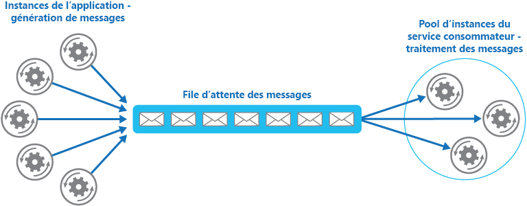

# <a name="competing-consumers-pattern"></a><span data-ttu-id="2281a-104">Modèle des consommateurs concurrents</span><span class="sxs-lookup"><span data-stu-id="2281a-104">Competing Consumers pattern</span></span>

[!INCLUDE [header](../_includes/header.md)]

<span data-ttu-id="2281a-105">Ce modèle vise à permettre à plusieurs consommateurs concurrents de traiter les messages reçus sur un même canal de messagerie.</span><span class="sxs-lookup"><span data-stu-id="2281a-105">Enable multiple concurrent consumers to process messages received on the same messaging channel.</span></span> <span data-ttu-id="2281a-106">Un système peut ainsi traiter simultanément plusieurs messages de façon à optimiser le débit, à améliorer la scalabilité et la disponibilité et à équilibrer la charge de travail.</span><span class="sxs-lookup"><span data-stu-id="2281a-106">This enables a system to process multiple messages concurrently to optimize throughput, to improve scalability and availability, and to balance the workload.</span></span>

## <a name="context-and-problem"></a><span data-ttu-id="2281a-107">Contexte et problème</span><span class="sxs-lookup"><span data-stu-id="2281a-107">Context and problem</span></span>

<span data-ttu-id="2281a-108">Une application s’exécutant dans le cloud a de nombreuses demandes à gérer.</span><span class="sxs-lookup"><span data-stu-id="2281a-108">An application running in the cloud is expected to handle a large number of requests.</span></span> <span data-ttu-id="2281a-109">Plutôt que de traiter chaque demande de façon synchrone, une technique courante consiste pour l’application à les passer à un autre service (service consommateur) via un système de messagerie pour être traitées de façon asynchrone.</span><span class="sxs-lookup"><span data-stu-id="2281a-109">Rather than process each request synchronously, a common technique is for the application to pass them through a messaging system to another service (a consumer service) that handles them asynchronously.</span></span> <span data-ttu-id="2281a-110">Cette stratégie permet de s’assurer que la logique métier de l’application n’est pas bloquée pendant le traitement des demandes.</span><span class="sxs-lookup"><span data-stu-id="2281a-110">This strategy helps to ensure that the business logic in the application isn't blocked while the requests are being processed.</span></span>

<span data-ttu-id="2281a-111">Le nombre de demandes peut varier considérablement au fil du temps, et ce pour diverses raisons.</span><span class="sxs-lookup"><span data-stu-id="2281a-111">The number of requests can vary significantly over time for many reasons.</span></span> <span data-ttu-id="2281a-112">Une augmentation soudaine de l’activité utilisateur ou des demandes agrégées en provenance de plusieurs locataires clients peut occasionner une charge de travail imprévisible.</span><span class="sxs-lookup"><span data-stu-id="2281a-112">A sudden increase in user activity or aggregated requests coming from multiple tenants can cause an unpredictable workload.</span></span> <span data-ttu-id="2281a-113">Aux heures de pointe, un système peut être amené à traiter plusieurs centaines de demandes à la seconde, alors qu’à d’autres moments, leur nombre peut être très faible.</span><span class="sxs-lookup"><span data-stu-id="2281a-113">At peak hours a system might need to process many hundreds of requests per second, while at other times the number could be very small.</span></span> <span data-ttu-id="2281a-114">Par ailleurs, la nature du travail effectué pour traiter ces demandes peut varier considérablement.</span><span class="sxs-lookup"><span data-stu-id="2281a-114">Additionally, the nature of the work performed to handle these requests might be highly variable.</span></span> <span data-ttu-id="2281a-115">Si une instance unique du service consommateur est utilisée, elle peut se trouver submergée par les demandes ou le système de messagerie peut-être surchargé par un afflux de messages en provenance de l’application.</span><span class="sxs-lookup"><span data-stu-id="2281a-115">Using a single instance of the consumer service can cause that instance to become flooded with requests, or the messaging system might be overloaded by an influx of messages coming from the application.</span></span> <span data-ttu-id="2281a-116">Pour gérer cette charge de travail fluctuante, le système peut exécuter plusieurs instances du service consommateur.</span><span class="sxs-lookup"><span data-stu-id="2281a-116">To handle this fluctuating workload, the system can run multiple instances of the consumer service.</span></span> <span data-ttu-id="2281a-117">Cependant, ces consommateurs doivent être coordonnés pour faire en sorte que chaque message ne soit qu’à un seul consommateur.</span><span class="sxs-lookup"><span data-stu-id="2281a-117">However, these consumers must be coordinated to ensure that each message is only delivered to a single consumer.</span></span> <span data-ttu-id="2281a-118">La charge de travail doit aussi faire l’objet d’un équilibrage de charge entre les consommateurs pour empêcher une instance de devenir un goulot d’étranglement.</span><span class="sxs-lookup"><span data-stu-id="2281a-118">The workload also needs to be load balanced across consumers to prevent an instance from becoming a bottleneck.</span></span>

## <a name="solution"></a><span data-ttu-id="2281a-119">Solution</span><span class="sxs-lookup"><span data-stu-id="2281a-119">Solution</span></span>

<span data-ttu-id="2281a-120">Utilisez une file d’attente de messages pour implémenter le canal de communication entre l’application et les instances du service consommateur.</span><span class="sxs-lookup"><span data-stu-id="2281a-120">Use a message queue to implement the communication channel between the application and the instances of the consumer service.</span></span> <span data-ttu-id="2281a-121">L’application poste les demandes sous forme de messages dans la file d’attente, et les instances du service consommateur reçoivent les messages de la file d’attente pour ensuite les traiter.</span><span class="sxs-lookup"><span data-stu-id="2281a-121">The application posts requests in the form of messages to the queue, and the consumer service instances receive messages from the queue and process them.</span></span> <span data-ttu-id="2281a-122">Cette approche permet à un même pool d’instances du service consommateur de traiter les messages de n’importe quelle instance de l’application.</span><span class="sxs-lookup"><span data-stu-id="2281a-122">This approach enables the same pool of consumer service instances to handle messages from any instance of the application.</span></span> <span data-ttu-id="2281a-123">La figure illustre l’utilisation d’une file d’attente de messages pour distribuer le travail aux instances d’un service.</span><span class="sxs-lookup"><span data-stu-id="2281a-123">The figure illustrates using a message queue to distribute work to instances of a service.</span></span>



<span data-ttu-id="2281a-125">Cette solution offre les avantages suivants :</span><span class="sxs-lookup"><span data-stu-id="2281a-125">This solution has the following benefits:</span></span>

- <span data-ttu-id="2281a-126">Elle fournit un système à charge nivelée qui peut gérer les écarts importants dans le volume de demandes envoyées par les instances de l’application.</span><span class="sxs-lookup"><span data-stu-id="2281a-126">It provides a load-leveled system that can handle wide variations in the volume of requests sent by application instances.</span></span> <span data-ttu-id="2281a-127">La file d’attente joue le rôle de tampon entre les instances de l’application et les instances du service consommateur.</span><span class="sxs-lookup"><span data-stu-id="2281a-127">The queue acts as a buffer between the application instances and the consumer service instances.</span></span> <span data-ttu-id="2281a-128">L’impact sur la disponibilité et la réactivité de l’application et des instances du service peut ainsi s’en trouver limité, comme décrit dans [Modèle de nivellement de charge basé sur une file d’attente](queue-based-load-leveling.md).</span><span class="sxs-lookup"><span data-stu-id="2281a-128">This can help to minimize the impact on availability and responsiveness for both the application and the service instances, as described by the [Queue-based Load Leveling pattern](queue-based-load-leveling.md).</span></span> <span data-ttu-id="2281a-129">La gestion d’un message qui demande un traitement de longue durée n’empêche pas la gestion simultanée d’autres messages par d’autres instances du service consommateur.</span><span class="sxs-lookup"><span data-stu-id="2281a-129">Handling a message that requires some long-running processing doesn't prevent other messages from being handled concurrently by other instances of the consumer service.</span></span>

- <span data-ttu-id="2281a-130">Elle améliore la fiabilité.</span><span class="sxs-lookup"><span data-stu-id="2281a-130">It improves reliability.</span></span> <span data-ttu-id="2281a-131">Si un producteur communique directement avec un consommateur au lieu d’utiliser ce modèle, mais qu’il ne surveille pas le consommateur, il est fort probable que les messages seront perdus ou ne pourront pas être traités en cas de défaillance du consommateur.</span><span class="sxs-lookup"><span data-stu-id="2281a-131">If a producer communicates directly with a consumer instead of using this pattern, but doesn't monitor the consumer, there's a high probability that messages could be lost or fail to be processed if the consumer fails.</span></span> <span data-ttu-id="2281a-132">Dans ce modèle, les messages ne sont pas envoyés à une instance de service spécifique.</span><span class="sxs-lookup"><span data-stu-id="2281a-132">In this pattern, messages aren't sent to a specific service instance.</span></span> <span data-ttu-id="2281a-133">Une instance de service défaillante ne bloquera pas un producteur, et les messages pourront être traités par n’importe quelle instance de service active.</span><span class="sxs-lookup"><span data-stu-id="2281a-133">A failed service instance won't block a producer, and messages can be processed by any working service instance.</span></span>

- <span data-ttu-id="2281a-134">Elle ne nécessite pas de coordination complexe entre les consommateurs ou entre le producteur et les instances de consommateur.</span><span class="sxs-lookup"><span data-stu-id="2281a-134">It doesn't require complex coordination between the consumers, or between the producer and the consumer instances.</span></span> <span data-ttu-id="2281a-135">La file d’attente de messages offre la garantie que chaque message est remis au moins une fois.</span><span class="sxs-lookup"><span data-stu-id="2281a-135">The message queue ensures that each message is delivered at least once.</span></span>

- <span data-ttu-id="2281a-136">Elle est scalable.</span><span class="sxs-lookup"><span data-stu-id="2281a-136">It's scalable.</span></span> <span data-ttu-id="2281a-137">Le système peut augmenter ou diminuer dynamiquement le nombre d’instances du service consommateur à mesure que le volume de messages évolue.</span><span class="sxs-lookup"><span data-stu-id="2281a-137">The system can dynamically increase or decrease the number of instances of the consumer service as the volume of messages fluctuates.</span></span>

- <span data-ttu-id="2281a-138">Elle peut améliorer la résilience si la file d’attente de messages fournit des opérations de lecture transactionnelles.</span><span class="sxs-lookup"><span data-stu-id="2281a-138">It can improve resiliency if the message queue provides transactional read operations.</span></span> <span data-ttu-id="2281a-139">Si une instance du service consommateur lit et traite le message dans le cadre d’une opération transactionnelle et que l’instance du service consommateur subit une défaillance, ce modèle peut faire en sorte que le message soit retourné à la file d’attente pour être récupéré et traité par une autre instance du service consommateur.</span><span class="sxs-lookup"><span data-stu-id="2281a-139">If a consumer service instance reads and processes the message as part of a transactional operation, and the consumer service instance fails, this pattern can ensure that the message will be returned to the queue to be picked up and handled by another instance of the consumer service.</span></span>

## <a name="issues-and-considerations"></a><span data-ttu-id="2281a-140">Problèmes et considérations</span><span class="sxs-lookup"><span data-stu-id="2281a-140">Issues and considerations</span></span>

<span data-ttu-id="2281a-141">Prenez en compte les points suivants lorsque vous choisissez comment implémenter ce modèle :</span><span class="sxs-lookup"><span data-stu-id="2281a-141">Consider the following points when deciding how to implement this pattern:</span></span>

- <span data-ttu-id="2281a-142">**Classement des messages** :</span><span class="sxs-lookup"><span data-stu-id="2281a-142">**Message ordering**.</span></span> <span data-ttu-id="2281a-143">l’ordre dans lequel les instances du service consommateur reçoivent les messages n’est pas garanti et ne reflète pas nécessairement l’ordre dans lequel les messages ont été créés.</span><span class="sxs-lookup"><span data-stu-id="2281a-143">The order in which consumer service instances receive messages isn't guaranteed, and doesn't necessarily reflect the order in which the messages were created.</span></span> <span data-ttu-id="2281a-144">Concevez le système de sorte que le traitement des messages soit idempotent. Vous éliminerez ainsi toute dépendance vis-à-vis de l’ordre de traitement des messages.</span><span class="sxs-lookup"><span data-stu-id="2281a-144">Design the system to ensure that message processing is idempotent because this will help to eliminate any dependency on the order in which messages are handled.</span></span> <span data-ttu-id="2281a-145">Pour plus d’informations, consultez [Idempotency Patterns](http://blog.jonathanoliver.com/idempotency-patterns/) sur le blog de Jonathan Oliver.</span><span class="sxs-lookup"><span data-stu-id="2281a-145">For more information, see [Idempotency Patterns](http://blog.jonathanoliver.com/idempotency-patterns/) on Jonathon Oliver’s blog.</span></span>

    > <span data-ttu-id="2281a-146">Les files d’attente Microsoft Azure Service Bus peuvent implémenter un classement premier entrée premier sorti en utilisant des sessions de messagerie.</span><span class="sxs-lookup"><span data-stu-id="2281a-146">Microsoft Azure Service Bus Queues can implement guaranteed first-in-first-out ordering of messages by using message sessions.</span></span> <span data-ttu-id="2281a-147">Pour plus d’informations, consultez [Modèles de messagerie utilisant des sessions](https://msdn.microsoft.com/magazine/jj863132.aspx).</span><span class="sxs-lookup"><span data-stu-id="2281a-147">For more information, see [Messaging Patterns Using Sessions](https://msdn.microsoft.com/magazine/jj863132.aspx).</span></span>

- <span data-ttu-id="2281a-148">**Conception de services à des fins de résilience** :</span><span class="sxs-lookup"><span data-stu-id="2281a-148">**Designing services for resiliency**.</span></span> <span data-ttu-id="2281a-149">si le système est conçu pour détecter et redémarrer les instances de service en échec, il peut être nécessaire d’implémenter le traitement effectué par les instances de service en tant qu’opérations idempotent pour limiter les effets d’un message unique qui serait récupéré et traité plusieurs fois.</span><span class="sxs-lookup"><span data-stu-id="2281a-149">If the system is designed to detect and restart failed service instances, it might be necessary to implement the processing performed by the service instances as idempotent operations to minimize the effects of a single message being retrieved and processed more than once.</span></span>

- <span data-ttu-id="2281a-150">**Détection des messages incohérents** :</span><span class="sxs-lookup"><span data-stu-id="2281a-150">**Detecting poison messages**.</span></span> <span data-ttu-id="2281a-151">un message au format incorrect ou une tâche qui nécessite un accès à des ressources non disponibles peut entraîner l’échec d’une instance de service.</span><span class="sxs-lookup"><span data-stu-id="2281a-151">A malformed message, or a task that requires access to resources that aren't available, can cause a service instance to fail.</span></span> <span data-ttu-id="2281a-152">Le système doit éviter que ces messages soient retournés à la file d’attente et au lieu de cela capturer et stocker les détails de ces messages à un autre emplacement en vue de leur analyse, si nécessaire.</span><span class="sxs-lookup"><span data-stu-id="2281a-152">The system should prevent such messages being returned to the queue, and instead capture and store the details of these messages elsewhere so that they can be analyzed if necessary.</span></span>

- <span data-ttu-id="2281a-153">**Gestion des résultats** :</span><span class="sxs-lookup"><span data-stu-id="2281a-153">**Handling results**.</span></span> <span data-ttu-id="2281a-154">l’instance de service traitant un message est entièrement dissociée de la logique d’application qui génère le message, et il se peut qu’elles ne puissent pas communiquer directement.</span><span class="sxs-lookup"><span data-stu-id="2281a-154">The service instance handling a message is fully decoupled from the application logic that generates the message, and they might not be able to communicate directly.</span></span> <span data-ttu-id="2281a-155">Si l’instance de service génère des résultats qui doivent être retransmis à la logique d’application, ces informations doivent être stockées à un emplacement accessible aux deux.</span><span class="sxs-lookup"><span data-stu-id="2281a-155">If the service instance generates results that must be passed back to the application logic, this information must be stored in a location that's accessible to both.</span></span> <span data-ttu-id="2281a-156">Pour éviter que la logique d’application récupère des données incomplètes, le système doit indiquer à quel moment le traitement est terminé.</span><span class="sxs-lookup"><span data-stu-id="2281a-156">In order to prevent the application logic from retrieving incomplete data the system must indicate when processing is complete.</span></span>

     > <span data-ttu-id="2281a-157">Si vous utilisez Azure, un processus de travail peut retransmettre les résultats à la logique d’application en utilisant une file d’attente de réponses de messages dédiée.</span><span class="sxs-lookup"><span data-stu-id="2281a-157">If you're using Azure, a worker process can pass results back to the application logic by using a dedicated message reply queue.</span></span> <span data-ttu-id="2281a-158">La logique d’application doit pouvoir mettre en corrélation ces résultats avec le message d’origine.</span><span class="sxs-lookup"><span data-stu-id="2281a-158">The application logic must be able to correlate these results with the original message.</span></span> <span data-ttu-id="2281a-159">Ce scénario est décrit plus en détail dans [Notions élémentaires sur la messagerie asynchrone](https://msdn.microsoft.com/library/dn589781.aspx).</span><span class="sxs-lookup"><span data-stu-id="2281a-159">This scenario is described in more detail in the [Asynchronous Messaging Primer](https://msdn.microsoft.com/library/dn589781.aspx).</span></span>

- <span data-ttu-id="2281a-160">**Mise à l’échelle du système de messagerie** :</span><span class="sxs-lookup"><span data-stu-id="2281a-160">**Scaling the messaging system**.</span></span> <span data-ttu-id="2281a-161">dans une solution à grande échelle, une file d’attente de messages unique peut être submergée par le nombre de messages et devenir un goulot d’étranglement dans le système.</span><span class="sxs-lookup"><span data-stu-id="2281a-161">In a large-scale solution, a single message queue could be overwhelmed by the number of messages and become a bottleneck in the system.</span></span> <span data-ttu-id="2281a-162">Dans ce cas, envisagez de partitionner le système de messagerie pour envoyer les messages de producteurs spécifiques à une file d’attente particulière, ou utilisez l’équilibrage de charge pour répartir les messages entre plusieurs files d’attente de messages.</span><span class="sxs-lookup"><span data-stu-id="2281a-162">In this situation, consider partitioning the messaging system to send messages from specific producers to a particular queue, or use load balancing to distribute messages across multiple message queues.</span></span>

- <span data-ttu-id="2281a-163">**Assurer la fiabilité du système de messagerie** :</span><span class="sxs-lookup"><span data-stu-id="2281a-163">**Ensuring reliability of the messaging system**.</span></span> <span data-ttu-id="2281a-164">disposer d’un système de messagerie fiable est une nécessité pour garantir qu’un message ne se perd pas après avoir été mis en file d’attente par l’application.</span><span class="sxs-lookup"><span data-stu-id="2281a-164">A reliable messaging system is needed to guarantee that after the application enqueues a message it won't be lost.</span></span> <span data-ttu-id="2281a-165">Il s’agit d’une condition essentielle pour garantir que tous les messages sont remis au moins une fois.</span><span class="sxs-lookup"><span data-stu-id="2281a-165">This is essential for ensuring that all messages are delivered at least once.</span></span>

## <a name="when-to-use-this-pattern"></a><span data-ttu-id="2281a-166">Quand utiliser ce modèle</span><span class="sxs-lookup"><span data-stu-id="2281a-166">When to use this pattern</span></span>

<span data-ttu-id="2281a-167">Utilisez ce modèle dans les situations suivantes :</span><span class="sxs-lookup"><span data-stu-id="2281a-167">Use this pattern when:</span></span>

- <span data-ttu-id="2281a-168">La charge de travail d’une application est divisée en tâches qui peuvent s’exécuter de façon asynchrone.</span><span class="sxs-lookup"><span data-stu-id="2281a-168">The workload for an application is divided into tasks that can run asynchronously.</span></span>
- <span data-ttu-id="2281a-169">Les tâches sont indépendantes et peuvent s’exécuter en parallèle.</span><span class="sxs-lookup"><span data-stu-id="2281a-169">Tasks are independent and can run in parallel.</span></span>
- <span data-ttu-id="2281a-170">le volume de travail est très variable, ce qui nécessite une solution scalable.</span><span class="sxs-lookup"><span data-stu-id="2281a-170">The volume of work is highly variable, requiring a scalable solution.</span></span>
- <span data-ttu-id="2281a-171">La solution doit offrir une haute disponibilité et doit être résiliente en cas d’échec du traitement d’une tâche.</span><span class="sxs-lookup"><span data-stu-id="2281a-171">The solution must provide high availability, and must be resilient if the processing for a task fails.</span></span>

<span data-ttu-id="2281a-172">Ce modèle peut ne pas avoir d’utilité dans les cas suivants :</span><span class="sxs-lookup"><span data-stu-id="2281a-172">This pattern might not be useful when:</span></span>

- <span data-ttu-id="2281a-173">Il n’est pas facile de séparer la charge de travail d’application en tâches discrètes ou il existe un niveau de dépendance élevé entre les tâches.</span><span class="sxs-lookup"><span data-stu-id="2281a-173">It's not easy to separate the application workload into discrete tasks, or there's a high degree of dependence between tasks.</span></span>
- <span data-ttu-id="2281a-174">Les tâches doivent être effectuées de façon synchrone et la logique d’application doit attendre qu’une tâche se termine avant de continuer.</span><span class="sxs-lookup"><span data-stu-id="2281a-174">Tasks must be performed synchronously, and the application logic must wait for a task to complete before continuing.</span></span>
- <span data-ttu-id="2281a-175">Les tâches doivent être effectuées dans un ordre précis.</span><span class="sxs-lookup"><span data-stu-id="2281a-175">Tasks must be performed in a specific sequence.</span></span>

> <span data-ttu-id="2281a-176">Certains systèmes de messagerie prennent en charge les sessions qui permettent à un producteur de regrouper les messages et de veiller à ce qu’ils soient tous gérés par le même consommateur.</span><span class="sxs-lookup"><span data-stu-id="2281a-176">Some messaging systems support sessions that enable a producer to group messages together and ensure that they're all handled by the same consumer.</span></span> <span data-ttu-id="2281a-177">Ce mécanisme peut être utilisé avec des messages classés par ordre de priorité (s’ils sont pris en charge) pour implémenter une forme de classement de messages qui remet les messages dans l’ordre d’un producteur à un consommateur unique.</span><span class="sxs-lookup"><span data-stu-id="2281a-177">This mechanism can be used with prioritized messages (if they are supported) to implement a form of message ordering that delivers messages in sequence from a producer to a single consumer.</span></span>

## <a name="example"></a><span data-ttu-id="2281a-178">Exemple</span><span class="sxs-lookup"><span data-stu-id="2281a-178">Example</span></span>

<span data-ttu-id="2281a-179">Azure propose des files d’attente de stockage et des files d’attente Service Bus qui peuvent servir de mécanisme pour l’implémenter ce modèle.</span><span class="sxs-lookup"><span data-stu-id="2281a-179">Azure provides storage queues and Service Bus queues that can act as a mechanism for implementing this pattern.</span></span> <span data-ttu-id="2281a-180">La logique d’application peut poster des messages dans une file d’attente, et les consommateurs implémentés comme tâches dans un ou plusieurs rôles peuvent récupérer les messages de cette file d’attente et les traiter.</span><span class="sxs-lookup"><span data-stu-id="2281a-180">The application logic can post messages to a queue, and consumers implemented as tasks in one or more roles can retrieve messages from this queue and process them.</span></span> <span data-ttu-id="2281a-181">Pour des besoins de résilience, une file d’attente Service Bus permet à un consommateur d’utiliser le mode `PeekLock` quand il s’agit de récupérer un message dans la file d’attente.</span><span class="sxs-lookup"><span data-stu-id="2281a-181">For resiliency, a Service Bus queue enables a consumer to use `PeekLock` mode when it retrieves a message from the queue.</span></span> <span data-ttu-id="2281a-182">Ce mode ne supprime pas réellement le message ; il ne fait que le masquer aux autres consommateurs.</span><span class="sxs-lookup"><span data-stu-id="2281a-182">This mode doesn't actually remove the message, but simply hides it from other consumers.</span></span> <span data-ttu-id="2281a-183">Le consommateur d’origine peut supprimer le message à l’issue de son traitement.</span><span class="sxs-lookup"><span data-stu-id="2281a-183">The original consumer can delete the message when it's finished processing it.</span></span> <span data-ttu-id="2281a-184">En cas de défaillance du consommateur, le mode PeekLock expire et le message redevient visible, ce qui permet à un autre consommateur de le récupérer.</span><span class="sxs-lookup"><span data-stu-id="2281a-184">If the consumer fails, the peek lock will time out and the message will become visible again, allowing another consumer to retrieve it.</span></span>

> <span data-ttu-id="2281a-185">Pour obtenir des informations détaillées sur l’utilisation des files d’attente Azure Service Bus, consultez [Files d’attente, rubriques et abonnements Service Bus](https://msdn.microsoft.com/library/windowsazure/hh367516.aspx).</span><span class="sxs-lookup"><span data-stu-id="2281a-185">For detailed information on using Azure Service Bus queues, see [Service Bus queues, topics, and subscriptions](https://msdn.microsoft.com/library/windowsazure/hh367516.aspx).</span></span>
<span data-ttu-id="2281a-186">Pour plus d’informations sur l’utilisation des files d’attente de stockage Azure, consultez [Prise en main du stockage de files d’attente Azure à l’aide de .NET](https://azure.microsoft.com/documentation/articles/storage-dotnet-how-to-use-queues/).</span><span class="sxs-lookup"><span data-stu-id="2281a-186">For information on using Azure storage queues, see [Get started with Azure Queue storage using .NET](https://azure.microsoft.com/documentation/articles/storage-dotnet-how-to-use-queues/).</span></span>

<span data-ttu-id="2281a-187">Le code suivant de la classe `QueueManager` de la solution CompetingConsumers disponible sur [GitHub](https://github.com/mspnp/cloud-design-patterns/tree/master/competing-consumers) montre comment créer une file d’attente en utilisant une instance `QueueClient` dans le gestionnaire d’événements `Start` d’un rôle web ou de travail.</span><span class="sxs-lookup"><span data-stu-id="2281a-187">The following code from the `QueueManager` class in CompetingConsumers solution available on [GitHub](https://github.com/mspnp/cloud-design-patterns/tree/master/competing-consumers) shows how you can create a queue by using a `QueueClient` instance in the `Start` event handler in a web or worker role.</span></span>

```csharp
private string queueName = ...;
private string connectionString = ...;
...

public async Task Start()
{
  // Check if the queue already exists.
  var manager = NamespaceManager.CreateFromConnectionString(this.connectionString);
  if (!manager.QueueExists(this.queueName))
  {
    var queueDescription = new QueueDescription(this.queueName);

    // Set the maximum delivery count for messages in the queue. A message
    // is automatically dead-lettered after this number of deliveries. The
    // default value for dead letter count is 10.
    queueDescription.MaxDeliveryCount = 3;

    await manager.CreateQueueAsync(queueDescription);
  }
  ...

  // Create the queue client. By default the PeekLock method is used.
  this.client = QueueClient.CreateFromConnectionString(
    this.connectionString, this.queueName);
}
```

<span data-ttu-id="2281a-188">L’extrait de code suivant montre comment une application peut créer et envoyer un lot de messages à la file d’attente.</span><span class="sxs-lookup"><span data-stu-id="2281a-188">The next code snippet shows how an application can create and send a batch of messages to the queue.</span></span>

```csharp
public async Task SendMessagesAsync()
{
  // Simulate sending a batch of messages to the queue.
  var messages = new List<BrokeredMessage>();

  for (int i = 0; i < 10; i++)
  {
    var message = new BrokeredMessage() { MessageId = Guid.NewGuid().ToString() };
    messages.Add(message);
  }
  await this.client.SendBatchAsync(messages);
}
```

<span data-ttu-id="2281a-189">Le code suivant montre comment une instance de service consommateur peut recevoir des messages de la file d’attente en suivant une approche basée sur les événements.</span><span class="sxs-lookup"><span data-stu-id="2281a-189">The following code shows how a consumer service instance can receive messages from the queue by following an event-driven approach.</span></span> <span data-ttu-id="2281a-190">Le paramètre `processMessageTask` de la méthode `ReceiveMessages` est un délégué qui fait référence au code à exécuter à la réception d’un message.</span><span class="sxs-lookup"><span data-stu-id="2281a-190">The `processMessageTask` parameter to the `ReceiveMessages` method is a delegate that references the code to run when a message is received.</span></span> <span data-ttu-id="2281a-191">Ce code s’exécute de façon asynchrone.</span><span class="sxs-lookup"><span data-stu-id="2281a-191">This code is run asynchronously.</span></span>

```csharp
private ManualResetEvent pauseProcessingEvent;
...

public void ReceiveMessages(Func<BrokeredMessage, Task> processMessageTask)
{
  // Set up the options for the message pump.
  var options = new OnMessageOptions();

  // When AutoComplete is disabled it's necessary to manually
  // complete or abandon the messages and handle any errors.
  options.AutoComplete = false;
  options.MaxConcurrentCalls = 10;
  options.ExceptionReceived += this.OptionsOnExceptionReceived;

  // Use of the Service Bus OnMessage message pump.
  // The OnMessage method must be called once, otherwise an exception will occur.
  this.client.OnMessageAsync(
    async (msg) =>
    {
      // Will block the current thread if Stop is called.
      this.pauseProcessingEvent.WaitOne();

      // Execute processing task here.
      await processMessageTask(msg);
    },
    options);
}
...

private void OptionsOnExceptionReceived(object sender,
  ExceptionReceivedEventArgs exceptionReceivedEventArgs)
{
  ...
}
```

<span data-ttu-id="2281a-192">Notez que les fonctionnalités de mise à l’échelle automatique, telles que celles disponibles dans Azure, peuvent être utilisées pour démarrer et arrêter des instances de rôle à mesure que la longueur de la file d’attente évolue.</span><span class="sxs-lookup"><span data-stu-id="2281a-192">Note that autoscaling features, such as those available in Azure, can be used to start and stop role instances as the queue length fluctuates.</span></span> <span data-ttu-id="2281a-193">Pour plus d’informations, consultez [Recommandations en matière de mise à l’échelle automatique](https://msdn.microsoft.com/library/dn589774.aspx).</span><span class="sxs-lookup"><span data-stu-id="2281a-193">For more information, see [Autoscaling Guidance](https://msdn.microsoft.com/library/dn589774.aspx).</span></span> <span data-ttu-id="2281a-194">De même, il n’est pas nécessaire de conserver une correspondance un-à-un entre les instances de rôle et les processus de travail (une même instance de rôle peut implémenter plusieurs processus de travail).</span><span class="sxs-lookup"><span data-stu-id="2281a-194">Also, it's not necessary to maintain a one-to-one correspondence between role instances and worker processes&mdash;a single role instance can implement multiple worker processes.</span></span> <span data-ttu-id="2281a-195">Pour plus d’informations, consultez [Modèle de consolidation des ressources de calcul](compute-resource-consolidation.md).</span><span class="sxs-lookup"><span data-stu-id="2281a-195">For more information, see [Compute Resource Consolidation pattern](compute-resource-consolidation.md).</span></span>

## <a name="related-patterns-and-guidance"></a><span data-ttu-id="2281a-196">Conseils et modèles connexes</span><span class="sxs-lookup"><span data-stu-id="2281a-196">Related patterns and guidance</span></span>

<span data-ttu-id="2281a-197">Les modèles et les conseils suivants peuvent présenter un intérêt quand il s’agit d’implémenter ce modèle :</span><span class="sxs-lookup"><span data-stu-id="2281a-197">The following patterns and guidance might be relevant when implementing this pattern:</span></span>

- <span data-ttu-id="2281a-198">[Notions élémentaires sur la messagerie asynchrone](https://msdn.microsoft.com/library/dn589781.aspx) :</span><span class="sxs-lookup"><span data-stu-id="2281a-198">[Asynchronous Messaging Primer](https://msdn.microsoft.com/library/dn589781.aspx).</span></span> <span data-ttu-id="2281a-199">les files d’attente de messages sont un mécanisme de communication asynchrone.</span><span class="sxs-lookup"><span data-stu-id="2281a-199">Message queues are an asynchronous communications mechanism.</span></span> <span data-ttu-id="2281a-200">Si un service consommateur doit envoyer une réponse à une application, il peut être nécessaire d’implémenter une certaine forme de messagerie de réponse.</span><span class="sxs-lookup"><span data-stu-id="2281a-200">If a consumer service needs to send a reply to an application, it might be necessary to implement some form of response messaging.</span></span> <span data-ttu-id="2281a-201">Le document Notions élémentaires sur la messagerie asynchrone fournit des informations sur la façon d’implémenter une messagerie de demande/réponse en utilisant des files d’attente de messages.</span><span class="sxs-lookup"><span data-stu-id="2281a-201">The Asynchronous Messaging Primer provides information on how to implement request/reply messaging using message queues.</span></span>

- <span data-ttu-id="2281a-202">[Recommandations en matière de mise à l’échelle automatique](https://msdn.microsoft.com/library/dn589774.aspx) :</span><span class="sxs-lookup"><span data-stu-id="2281a-202">[Autoscaling Guidance](https://msdn.microsoft.com/library/dn589774.aspx).</span></span> <span data-ttu-id="2281a-203">il est possible de démarrer et d’arrêter des instances d’un service consommateur, car la longueur de la file d’attente dans laquelle les applications postent les messages est variable.</span><span class="sxs-lookup"><span data-stu-id="2281a-203">It might be possible to start and stop instances of a consumer service since the length of the queue applications post messages on varies.</span></span> <span data-ttu-id="2281a-204">La mise à l’échelle automatique peut contribuer à maintenir le débit pendant les périodes d’intense traitement.</span><span class="sxs-lookup"><span data-stu-id="2281a-204">Autoscaling can help to maintain throughput during times of peak processing.</span></span>

- <span data-ttu-id="2281a-205">[Modèle de consolidation des ressources de calcul](compute-resource-consolidation.md) :</span><span class="sxs-lookup"><span data-stu-id="2281a-205">[Compute Resource Consolidation Pattern](compute-resource-consolidation.md).</span></span> <span data-ttu-id="2281a-206">il est possible de consolider plusieurs instances d’un service consommateur dans un processus unique pour réduire les coûts et les surcharges de gestion.</span><span class="sxs-lookup"><span data-stu-id="2281a-206">It might be possible to consolidate multiple instances of a consumer service into a single process to reduce costs and management overhead.</span></span> <span data-ttu-id="2281a-207">Le modèle de consolidation des ressources de calcul décrit les avantages et les inconvénients de cette approche.</span><span class="sxs-lookup"><span data-stu-id="2281a-207">The Compute Resource Consolidation pattern describes the benefits and tradeoffs of following this approach.</span></span>

- <span data-ttu-id="2281a-208">[Modèle de nivellement de la charge basé sur une file d’attente](queue-based-load-leveling.md) :</span><span class="sxs-lookup"><span data-stu-id="2281a-208">[Queue-based Load Leveling Pattern](queue-based-load-leveling.md).</span></span> <span data-ttu-id="2281a-209">l’introduction d’une file d’attente de messages peut doter le système de capacités de résilience, permettant ainsi aux instances du service de gérer des volumes très variables de demandes en provenance d’instances d’application.</span><span class="sxs-lookup"><span data-stu-id="2281a-209">Introducing a message queue can add resiliency to the system, enabling service instances to handle widely varying volumes of requests from application instances.</span></span> <span data-ttu-id="2281a-210">La file d’attente de messages fait office de tampon, ce qui a pour effet de niveler la charge.</span><span class="sxs-lookup"><span data-stu-id="2281a-210">The message queue acts as a buffer, which levels the load.</span></span> <span data-ttu-id="2281a-211">Le modèle de nivellement de la charge basé sur une file d’attente décrit plus en détail ce scénario.</span><span class="sxs-lookup"><span data-stu-id="2281a-211">The Queue-based Load Leveling pattern describes this scenario in more detail.</span></span>

- <span data-ttu-id="2281a-212">Ce modèle s’accompagne d’un [exemple d’application](https://github.com/mspnp/cloud-design-patterns/tree/master/competing-consumers).</span><span class="sxs-lookup"><span data-stu-id="2281a-212">This pattern has a [sample application](https://github.com/mspnp/cloud-design-patterns/tree/master/competing-consumers) associated with it.</span></span>
