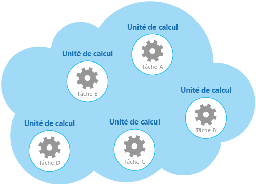
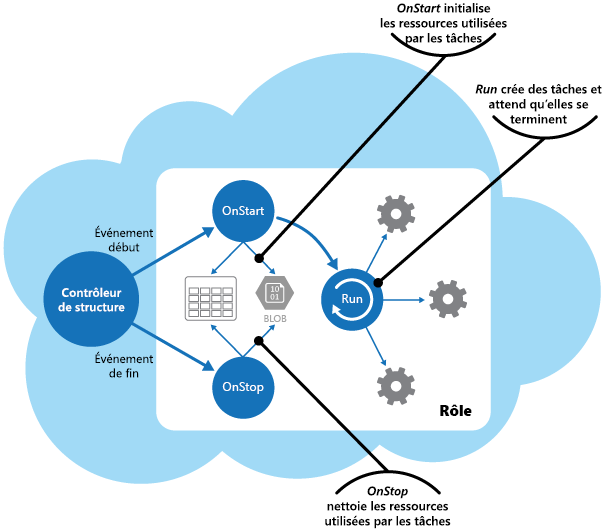

# <a name="compute-resource-consolidation-pattern"></a>Modèle de consolidation des ressources de calcul

[!INCLUDE [header](../_includes/header.md)]

Consolidez plusieurs tâches ou opérations en une seule unité de calcul. Cela permet d’augmenter l’utilisation des ressources de calcul et de réduire les coûts et la surcharge de gestion associés au traitement du calcul dans des applications hébergées dans le cloud.

## <a name="context-and-problem"></a>Contexte et problème

Une application cloud implémente souvent des opérations diverses. Dans certaines solutions, il est logique de suivre le principe de conception de séparation des problèmes initial et de diviser ces opérations en unités de calcul distinctes hébergées et déployées de façon individuelle (par exemple en tant qu’applications web App Service séparées, que machines virtuelles séparées ou rôles de service cloud séparés). Toutefois, bien que cette stratégie permette de simplifier l’étude logique de la solution, le fait de déployer un grand nombre d’unités de calcul pour la même application peut augmenter les coûts d’hébergement du runtime et rendre plus complexe la gestion du système.

À titre d’exemple, la figure illustre la structure simplifiée d’une solution hébergée dans le cloud qui est implémentée à l’aide de plusieurs unités de calcul. Chaque unité de calcul s’exécute dans son propre environnement virtuel. Chaque fonction a été implémentée en tant que tâche séparée (de la Tâche A à la Tâche E) s’exécutant dans sa propre unité de calcul.




Chaque unité de calcul consomme des ressources facturables, même lorsqu’elle est inactive ou peu utilisée. Par conséquent, cette solution n’est pas toujours la plus rentable.

Dans Azure, ce problème s’applique aux rôles dans un service cloud, App Services et des machines virtuelles. Ces éléments s’exécutent dans leur propre environnement virtuel. L’exécution d’une collection de rôles, sites Web ou de machines virtuelles séparés qui sont conçus pour exécuter un groupe d’opérations bien définies, mais qui ont besoin de communiquer et de coopérer car ils font partie d’une solution unique, peut constituer une utilisation inefficace des ressources.

## <a name="solution"></a>Solution

Dans l’optique de faciliter la réduction des coûts, l’augmentation de l’utilisation et l’amélioration de la vitesse de communication et la diminution de la gestion, il est possible de consolider plusieurs tâches ou opérations dans une seule unité de calcul.

Les tâches peuvent être regroupées en fonction de critères basés sur les fonctionnalités fournies par l’environnement et les coûts associés à ces fonctionnalités. Une approche courante consiste à rechercher des tâches qui ont un profil similaire en matière d’exigences de traitement, de durée de vie et d’extensibilité. Le regroupement de ces éléments leur permet d’effectuer une mise à l’échelle en tant qu’unité. L’élasticité fournie par de nombreux environnements cloud permet de démarrer et d’arrêter des instances supplémentaires d’une unité de calcul en fonction de la charge de travail. Par exemple, Azure propose une fonctionnalité de mise à l’échelle automatique que vous pouvez appliquer à des rôles dans un service cloud, App Services et des machines virtuelles. Pour plus d’informations, consultez [Mise à l’échelle automatique](https://msdn.microsoft.com/library/dn589774.aspx).

En tant que contre-exemple pour montrer comment l’extensibilité peut être utilisée pour déterminer quelles opérations ne doivent pas être regroupées, pensez aux deux tâches suivantes :

- La tâche 1 interroge les messages peu fréquents et non sensibles au temps envoyés à une file d’attente.
- La tâche 2 gère les pics de trafic réseau de volume élevé.

La seconde tâche nécessite de l’élasticité qui peut impliquer le démarrage et l’arrêt d’un grand nombre d’instances de l’unité de calcul. Appliquer la même mise à l’échelle à la première tâche entraînerait simplement davantage de tâches d’écoute de messages peu fréquents dans la même file d’attente et constitue un gaspillage de ressources.

Dans de nombreux environnements cloud, il est possible de spécifier les ressources disponibles sur une unité de calcul en termes de nombre de cœurs de processeur, de quantité de mémoire, d’espace disque, etc. En règle générale, plus il y a de ressources spécifiées, plus le coût est élevé. Pour faire des économies, il est important d’optimiser le travail qu’une unité de calcul coûteuse effectue, et de ne pas la laisser inactive pendant une période prolongée.

S’il existe des tâches qui nécessitent beaucoup de ressources de processeur lors de courtes périodes de pics d’activité, envisagez de les consolider dans une seule unité de calcul qui fournit la puissance nécessaire. Toutefois, il est important d’équilibrer ce besoin pour que les ressources coûteuses restent occupées par rapport à la contention qui pourrait se produire si elles étaient trop sollicitées. Les tâches gourmandes en ressources de calcul et longues à exécuter ne doivent pas partager la même unité de calcul par exemple.

## <a name="issues-and-considerations"></a>Problèmes et considérations

Prenez en compte les points suivants lorsque vous implémentez ce modèle :

**L’extensibilité et l’élasticité**. De nombreuses solutions cloud implémentent l’extensibilité et l’élasticité au niveau de l’unité de calcul en démarrant et arrêtant des instances d’unités. Évitez de regrouper des tâches ayant des exigences d’extensibilité en conflit dans la même unité de calcul.

**Durée de vie**. L’infrastructure cloud recycle périodiquement l’environnement virtuel qui héberge une unité de calcul. Lorsqu’il existe de nombreuses tâches longues à exécuter à l’intérieur d’une unité de calcul, il peut être nécessaire de configurer l’unité pour l’empêcher d’être recyclée tant que ces tâches ne sont pas terminées. Vous pouvez également concevoir les tâches en utilisant une approche de création de points de contrôle qui leur permet de s’arrêter de façon nette et de reprendre à partir du point où elles ont été interrompues lorsque l’unité de calcul est redémarrée.

**Cadence de mise en production**. Si l’implémentation ou la configuration d’une tâche change fréquemment, il peut être nécessaire d’arrêter l’unité de calcul hébergeant le code mis à jour, de reconfigurer et de redéployer l’unité puis de la redémarrer. Ce processus nécessitera également l’arrêt, le redéploiement et le redémarrage de toutes les autres tâches dans la même unité de calcul.

**Sécurité**. Des tâches dans la même unité de calcul peuvent partager le même contexte de sécurité et être en mesure d’accéder aux mêmes ressources. Il doit y avoir un niveau élevé d’approbation entre les tâches et vous devez être sûr qu’une tâche ne va pas corrompre une autre ou y nuire. En outre, augmenter le nombre de tâches s’exécutant dans une unité de calcul augmente la surface d’attaque de l’unité. Chaque tâche est uniquement aussi sûre que celle avec le plus de vulnérabilités.

**Tolérance de panne**. Si une tâche dans une unité de calcul échoue ou se comporte de façon anormale, elle peut affecter les autres tâches s’exécutant dans la même unité. Par exemple, si une tâche ne démarre pas correctement, elle peut entraîner l’échec de l’ensemble de la logique de démarrage de l’unité de calcul et empêcher les autres taches de la même unité de s’exécuter.

**Contention**. Évitez d’introduire de la contention entre les tâches qui sont en concurrence pour bénéficier des ressources de la même unité de calcul. Dans l’idéal, les tâches qui partagent la même unité de calcul doivent présenter des caractéristiques d’utilisation de ressources différentes. Par exemple, deux tâches gourmandes en ressources de calcul ne doivent probablement pas résider dans la même unité de calcul, comme c’est le cas pour deux tâches qui utilisent d’importantes quantités de mémoire. Toutefois, associer une tâche gourmande en ressources de calcul à une tâche requérant une grande quantité de mémoire est possible.

> [!NOTE]
>  Envisagez de consolider des ressources de calcul uniquement pour un système qui a été en production pendant un certain temps, afin que les opérateurs et développeurs puissent surveiller le système et créer une _carte thermique_ qui identifie la façon dont chaque tâche utilise les différentes ressources. Cette carte peut être utilisée pour déterminer les tâches les plus adaptées au partage de ressources de calcul.

**Complexité**. Combiner plusieurs tâches dans une seule unité de calcul complique le code dans l’unité et le rend plus difficile à tester, déboguer et maintenir.

**Architecture logique stable**. Concevez et implémentez le code dans chaque tâche de façon à ce qu’il n’ait pas besoin d’être modifié même si l’environnement physique dans lequel la tâche s’exécute change.

**Autres stratégies**. Consolider des ressources de calcul n’est qu’une des méthodes permettant de réduire les coûts associés à l’exécution simultanée de plusieurs tâches. Cette opération nécessite une planification et une surveillance précises pour vous assurer que l’approche reste efficace. D’autres stratégies peuvent être plus appropriées, selon la nature du travail et l’emplacement où se trouvent les utilisateurs qui exécutent ces tâches. Par exemple, la décomposition fonctionnelle de la charge de travail (comme décrit dans [Compute Partitioning Guidance](https://msdn.microsoft.com/library/dn589773.aspx) (Conseils sur le partitionnement du calcul)) peut être une option plus judicieuse.

## <a name="when-to-use-this-pattern"></a>Quand utiliser ce modèle

Utilisez ce modèle pour les tâches qui ne sont pas rentables si elles s’exécutent dans leurs propres unités de calcul. Si une tâche est la plupart du temps à l’état inactif, l’exécuter dans une unité dédiée peut être coûteux.

Ce modèle peut ne pas être adapté pour les tâches qui effectuent des opérations critiques tolérantes aux pannes ou pour les tâches qui traitent des données privées ou extrêmement sensibles et qui nécessitent leur propre contexte de sécurité. Ces tâches doivent s’exécutent dans leur propre environnement isolé, dans une unité de calcul distincte.

## <a name="example"></a>Exemple

Lors de la création d’un service cloud sur Azure, il est possible de consolider le traitement effectué par plusieurs tâches dans un rôle unique. Il s’agit généralement d’un rôle de travail qui exécute des tâches de traitement asynchrone ou en arrière-plan.

> Dans certains cas, il est possible d’inclure les tâches de traitement asynchrone ou en arrière-plan dans le rôle Web. Cette technique permet de réduire les coûts et de simplifier le déploiement, même si elle peut avoir un impact sur l’extensibilité et la réactivité de l’interface publique fournie par le rôle Web. L’article [Combining Multiple Azure Worker Roles into an Azure Web Role](http://www.31a2ba2a-b718-11dc-8314-0800200c9a66.com/2012/02/combining-multiple-azure-worker-roles.html) (Associer plusieurs rôles de travail Azure dans un rôle Web Azure) décrit en détail l’implémentation de tâches de traitement asynchrone ou en arrière-plan dans un rôle Web.

Le rôle est responsable du démarrage et de l’arrêt des tâches. Lorsque le contrôleur de structure Azure charge un rôle, il déclenche l’événement `Start` pour le rôle. Vous pouvez remplacer la méthode `OnStart` de la classe `WebRole` ou `WorkerRole` pour gérer cet événement, par exemple, pour initialiser les données et autres ressources dont les tâches de cette méthode dépendent.

Lorsque la méthode `OnStart ` se termine, le rôle peut commencer à répondre aux requêtes. Vous pouvez obtenir plus d’informations et de conseils sur l’utilisation des méthodes `OnStart` et `Run` dans un rôle en consultant la section [Application Startup Processes](https://msdn.microsoft.com/library/ff803371.aspx#sec16) (Processus de démarrage d’application) dans le guide des pratiques et modèles [Moving Applications to the Cloud](https://msdn.microsoft.com/library/ff728592.aspx) (Déplacer des applications dans le cloud).

> Gardez le code de la méthode `OnStart` aussi concis que possible. Azure n’impose aucune limite quant au temps nécessaire pour que cette méthode se termine, mais le rôle ne pourra pas commencer à répondre aux requêtes réseau qui lui sont envoyées tant que cette méthode n’est pas terminée.

Lorsque la méthode `OnStart` est terminée, le rôle exécute la méthode `Run`. À ce stade, le contrôleur de structure peut démarrer l’envoi de requêtes au rôle.

Placez le code qui crée les tâches dans la méthode `Run`. Notez que la méthode `Run` définit la durée de vie de l’instance de rôle. Lorsque cette méthode est terminée, le contrôleur de structure fera en sorte d’arrêter le rôle.

Lorsqu’un rôle s’arrête ou est recyclé, le contrôleur de structure empêche la réception d’autres requêtes entrantes de l’équilibreur de charge et déclenche l’événement `Stop`. Vous pouvez capturer cet événement en remplaçant la méthode `OnStop` du rôle et effectuer une réorganisation avant la fin du rôle.

> Les actions de la méthode `OnStop` doivent être effectuées dans un délai de cinq minutes (ou 30 secondes si vous utilisez l’émulateur Azure sur un ordinateur local). Dans le cas contraire, le contrôleur de structure Azure suppose que le rôle est bloqué et va forcer son arrêt.

Les tâches sont démarrées par la méthode `Run` qui attend que les tâches se terminent. Les tâches implémentent la logique métier du service cloud et peuvent répondre aux messages publiés dans le rôle via l’équilibreur de charge Azure. La figure illustre le cycle de vie des tâches et des ressources dans un rôle d’un service cloud Azure.




Le fichier _WorkerRole.cs_ du projet _ComputeResourceConsolidation.Worker_ montre un exemple d’implémentation de ce modèle dans un service cloud Azure.

> Le projet _ComputeResourceConsolidation.Worker_ fait partie de la solution _ComputeResourceConsolidation_ disponible au téléchargement sur [GitHub](https://github.com/mspnp/cloud-design-patterns/tree/master/compute-resource-consolidation).

Les méthodes `MyWorkerTask1` et `MyWorkerTask2` montrent comment effectuer différentes tâches dans le même rôle de travail. Le code ci-après présente `MyWorkerTask1`. Il s’agit d’une tâche simple qui reste inactive pendant 30 secondes avant de générer un message de trace. Ce processus est répété jusqu’à ce que la tâche soit annulée. Le code dans `MyWorkerTask2` est similaire.

```csharp
// A sample worker role task.
private static async Task MyWorkerTask1(CancellationToken ct)
{
  // Fixed interval to wake up and check for work and/or do work.
  var interval = TimeSpan.FromSeconds(30);

  try
  {
    while (!ct.IsCancellationRequested)
    {
      // Wake up and do some background processing if not canceled.
      // TASK PROCESSING CODE HERE
      Trace.TraceInformation("Doing Worker Task 1 Work");

      // Go back to sleep for a period of time unless asked to cancel.
      // Task.Delay will throw an OperationCanceledException when canceled.
      await Task.Delay(interval, ct);
    }
  }
  catch (OperationCanceledException)
  {
    // Expect this exception to be thrown in normal circumstances or check
    // the cancellation token. If the role instances are shutting down, a
    // cancellation request will be signaled.
    Trace.TraceInformation("Stopping service, cancellation requested");

    // Rethrow the exception.
    throw;
  }
}
```

> L’exemple de code montre une implémentation courante d’un processus en arrière-plan. Dans une application réelle, vous pouvez suivre cette même structure, à ceci près que vous devez placer votre propre logique de traitement dans le corps de la boucle qui attend la requête d’annulation.

Une fois que le rôle de travail a initialisé les ressources qu’il utilise, la méthode `Run` démarre deux tâches simultanément, comme illustré ici.

```csharp
/// <summary>
/// The cancellation token source use to cooperatively cancel running tasks
/// </summary>
private readonly CancellationTokenSource cts = new CancellationTokenSource();

/// <summary>
/// List of running tasks on the role instance
/// </summary>
private readonly List<Task> tasks = new List<Task>();

// RoleEntry Run() is called after OnStart().
// Returning from Run() will cause a role instance to recycle.
public override void Run()
{
  // Start worker tasks and add to the task list
  tasks.Add(MyWorkerTask1(cts.Token));
  tasks.Add(MyWorkerTask2(cts.Token));

  foreach (var worker in this.workerTasks)
  {
      this.tasks.Add(worker);
  }

  Trace.TraceInformation("Worker host tasks started");
  // The assumption is that all tasks should remain running and not return,
  // similar to role entry Run() behavior.
  try
  {
    Task.WaitAll(tasks.ToArray());
  }
  catch (AggregateException ex)
  {
    Trace.TraceError(ex.Message);

    // If any of the inner exceptions in the aggregate exception
    // are not cancellation exceptions then re-throw the exception.
    ex.Handle(innerEx => (innerEx is OperationCanceledException));
  }

  // If there wasn't a cancellation request, stop all tasks and return from Run()
  // An alternative to canceling and returning when a task exits would be to
  // restart the task.
  if (!cts.IsCancellationRequested)
  {
    Trace.TraceInformation("Task returned without cancellation request");
    Stop(TimeSpan.FromMinutes(5));
  }
}
...
```

Dans cet exemple, la méthode `Run` attend la fin des tâches. Si une tâche est annulée, la méthode `Run` part du principe que le rôle est en cours d’arrêt et attend que les tâches restantes soient annulées avant la fin (elle attend cinq minutes maximum avant de s’arrêter). Si une tâche échoue en raison d’une exception attendue, la méthode `Run` annule la tâche.

> Vous pouvez implémenter des stratégies de gestion des exceptions et de surveillance plus complètes dans la méthode `Run` comme le redémarrage des tâches qui ont échoué ou l’intégration du code qui permet au rôle d’arrêter et de démarrer des tâches individuelles.

La méthode `Stop` présentée dans le code suivant est appelée lorsque le contrôleur de structure arrête l’instance de rôle (elle est appelée à partir de la méthode `OnStop`). Le code arrête correctement chaque tâche en l’annulant. Si une tâche prend plus de cinq minutes pour se terminer, le traitement de l’annulation dans la méthode `Stop` cesse d’attendre et le rôle est terminé.

```csharp
// Stop running tasks and wait for tasks to complete before returning
// unless the timeout expires.
private void Stop(TimeSpan timeout)
{
  Trace.TraceInformation("Stop called. Canceling tasks.");
  // Cancel running tasks.
  cts.Cancel();

  Trace.TraceInformation("Waiting for canceled tasks to finish and return");

  // Wait for all the tasks to complete before returning. Note that the
  // emulator currently allows 30 seconds and Azure allows five
  // minutes for processing to complete.
  try
  {
    Task.WaitAll(tasks.ToArray(), timeout);
  }
  catch (AggregateException ex)
  {
    Trace.TraceError(ex.Message);

    // If any of the inner exceptions in the aggregate exception
    // are not cancellation exceptions then rethrow the exception.
    ex.Handle(innerEx => (innerEx is OperationCanceledException));
  }
}
```

## <a name="related-patterns-and-guidance"></a>Conseils et modèles connexes

Les modèles et les conseils suivants peuvent aussi présenter un intérêt quand il s’agit d’implémenter ce modèle :

- [Mise à l’échelle automatique](https://msdn.microsoft.com/library/dn589774.aspx). La mise à l’échelle automatique peut être utilisée pour démarrer et arrêter des instances de service qui hébergent des ressources de calcul, en fonction de la demande prévue pour le traitement.

- [Compute Partitioning Guidance](https://msdn.microsoft.com/library/dn589773.aspx) (Conseils sur le partitionnement du calcul). Cet article explique comment allouer les services et composants d’un service cloud pour minimiser les coûts de fonctionnement tout en préservant l’extensibilité, les performances, la disponibilité et la sécurité du service.

- Ce modèle comprend un [exemple d’application](https://github.com/mspnp/cloud-design-patterns/tree/master/compute-resource-consolidation) téléchargeable.
