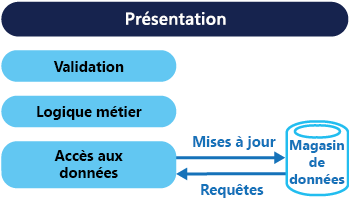
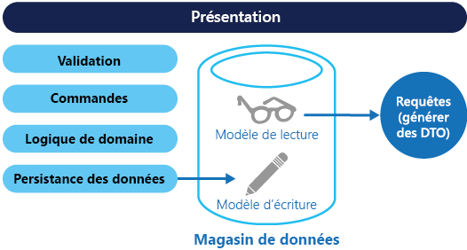

# <a name="command-and-query-responsibility-segregation-cqrs-pattern"></a>Modèle de séparation des responsabilités en matière de commande et de requête (CQRS)

[!INCLUDE [header](../_includes/header.md)]

Séparez les opérations qui lisent les données des opérations qui mettent à jour les données en utilisant des interfaces distinctes. Cela permet d’optimiser les performances, l’extensibilité et la sécurité. Ce modèle prend en charge l’évolution du système au fil du temps via davantage de flexibilité et empêche les commandes de mise à jour d’introduire des conflits de fusion au niveau du domaine.

## <a name="context-and-problem"></a>Contexte et problème

Dans les systèmes de gestion de données traditionnels, les commandes (mises à jour des données) et les requêtes (demandes de données) sont exécutées par rapport au même ensemble d’entités dans un répertoire de données unique. Ces entités peuvent être un sous-ensemble de lignes dans une ou plusieurs tables d’une base de données relationnelle telle que SQL Server.

En général, dans ces systèmes, toutes les opérations de création, de lecture, de mise à jour et de suppression (CRUD) sont appliquées à la même représentation de l’entité. Par exemple, un objet de transfert de données (DTO) représentant un client est récupéré dans le magasin de données par la couche d’accès aux données (DAL) et affiché à l’écran. Un utilisateur met à jour certains champs du DTO (par exemple, via la liaison de données) et le DTO est ensuite enregistré dans le magasin de données par la couche DAL. Le même DTO est utilisé pour les opérations de lecture et d’écriture. La figure illustre une architecture CRUD traditionnelle.



Les conceptions CRUD traditionnelles fonctionnent bien quand une logique métier limitée est appliquée aux opérations de données uniquement. Les mécanismes structurels fournis par les outils de développement permettent de créer très rapidement un code d’accès aux données, que vous pouvez ensuite personnaliser à votre convenance.

Toutefois, l’approche CRUD traditionnelle présente certains inconvénients :

- Cela signifie souvent qu’il existe une incompatibilité entre les représentations d’écriture et de lecture des données, telles que des colonnes ou propriétés supplémentaires qui doivent être mises à jour correctement même si elles ne sont pas requises dans le cadre d’une opération.

- Il y a des risques de contention des données lorsque les enregistrements sont verrouillés dans le magasin de données d’un domaine collaboratif où plusieurs acteurs travaillent en parallèle sur le même ensemble de données. Ou vous pouvez rencontrer des conflits de mise à jour causés par des mises à jour simultanées quand le verrouillage optimiste est utilisé. Ces risques augmentent à mesure que la complexité et le débit du système évoluent. En outre, l’approche traditionnelle peut avoir des conséquences négatives sur les performances en raison de la charge sur la couche d’accès aux données et le magasin de données, et la complexité des requêtes nécessaire pour récupérer des informations.

- Elle peut compliquer la gestion de la sécurité et des autorisations, car chaque entité est soumise à des opérations de lecture et d’écriture qui peuvent exposer des données dans le mauvais contexte.

> Pour une meilleure compréhension des limites de l’approche CRUD, consultez [CRUD, Only When You Can Afford It](https://blogs.msdn.microsoft.com/maarten_mullender/2004/07/23/crud-only-when-you-can-afford-it-revisited/) (L’approche CRUD uniquement lorsque vous pouvez vous le permettre).

## <a name="solution"></a>Solution

Séparation des responsabilités en matière de commande et de requête (CQRS) est un modèle qui sépare les opérations qui lisent les données (requêtes) des opérations qui mettent à jour les données (commandes) en utilisant des interfaces distinctes. Cela signifie que les modèles de données utilisés pour les requêtes et les mises à jour sont différents. Les modèles peuvent ensuite être isolés, comme indiqué dans la figure suivante, même si cela n’est pas une exigence absolue.



En comparaison avec le modèle de données unique utilisé dans les systèmes basés sur l’approche CRUD, l’utilisation des modèles de requête et de mise à jour séparées pour les données des systèmes basés sur l’approche CQRS simplifie la conception et l’implémentation. Toutefois, à la différence des conceptions CRUD, le code CQRS ne peut pas être généré automatiquement à l’aide des mécanismes structurels.

Le modèle de requête pour la lecture des données et le modèle de mise à jour pour l’écriture de données peuvent accéder au même magasin physique, peut-être à l’aide de vues SQL ou en générant des projections à la volée. Cependant, il est courant pour séparer les données dans des magasins physiques différents pour optimiser les performances, l’extensibilité et la sécurité, comme indiqué dans la figure suivante.


Le magasin de lecture peut être un réplica en lecture seule du magasin d’écriture, ou les magasins de lecture et d’écriture peuvent avoir une structure complètement différente. Utiliser plusieurs réplicas en lecture seule du magasin de lecture peut considérablement accroître les performances des requêtes et la réactivité de l’interface utilisateur de l’application, en particulier dans les scénarios distribués où les réplicas en lecture seule se trouvent à proximité des instances d’application. Certains systèmes de base de données (SQL Server) fournissent des fonctionnalités supplémentaires telles que le basculement des réplicas pour optimiser la disponibilité.

La séparation des magasins de lecture et d’écriture permet également de les mettre à l’échelle de façon individuelle en fonction de la charge. Par exemple, les magasins de lecture sont généralement confrontés à une charge plus importante que les magasins d’écriture.

Lorsque le modèle de requête/lecture contient des données dénormalisées (consultez [Materialized View pattern](materialized-view.md) (Modèle de vue matérialisée)), les performances sont optimisées lors de la lecture des données de chacune des vues d’une application ou lors de l’interrogation de données dans le système.

## <a name="issues-and-considerations"></a>Problèmes et considérations

Prenez en compte les points suivants lorsque vous choisissez comment implémenter ce modèle :

- Diviser le magasin de données en magasins physiques distincts pour les opérations de lecture et d’écriture permet d’accroître les performances et la sécurité d’un système, mais peut également apporter de la complexité en termes de résilience et de cohérence éventuelle. Le magasin de modèle de lecture peut être mis à jour pour refléter les modifications du magasin de modèle d’écriture, et il peut être difficile de détecter le moment où un utilisateur a émis une requête basée sur des données de lecture périmées, ce qui signifie que l’opération ne peut pas se terminer.

    > Pour obtenir une description de la cohérence éventuelle, consultez [Data Consistency Primer](https://msdn.microsoft.com/library/dn589800.aspx) (Manuel d’introduction à la cohérence des données).

- Envisagez d’appliquer l’approche CQRS à des sections limitées de votre système, là où elle sera le plus utile.

- Une approche courante pour le déploiement de la cohérence éventuelle consiste à utiliser l’approvisionnement en événements avec le modèle CQRS, afin que le modèle d’écriture soit un flux d’événements en mode ajouter uniquement piloté par l’exécution de commandes. Ces événements sont utilisés pour mettre à jour les vues matérialisées qui agissent en tant que modèle de lecture. Pour plus d’informations, consultez [Approvisionnement en événements et CQRS](https://msdn.microsoft.com/library/dn568103.aspx#EventSourcingandCQRS).

## <a name="when-to-use-this-pattern"></a>Quand utiliser ce modèle

Ce modèle est utile dans les situations suivantes :

- Les domaines collaboratifs dans lesquels plusieurs opérations sont effectuées en parallèle sur les mêmes données. CQRS vous permet de définir des commandes avec suffisamment de granularité pour réduire les conflits de fusion au niveau du domaine (tous les conflits qui surviennent peuvent être fusionnés par la commande), même lors de la mise à jour de ce qui semble être des données du même type.

- Les interfaces utilisateur basées sur les tâches où les utilisateurs sont guidés tout au long d’un processus complexe comme une série d’étapes ou avec des modèles de domaine complexes. Ce modèle peut également être utile pour les équipes connaissant déjà les techniques de conception pilotée par domaine. Le modèle d’écriture possède une pile de traitement de commande complète avec une logique métier, une validation d’entrée et une validation métier pour garantir que tout est toujours cohérent pour chacun des agrégats (chaque cluster d’objets associés traité comme une unité pour les modifications de données) du modèle d’écriture. Le modèle de lecture n’a aucune pile de validation ou de logique métier et renvoie simplement un DTO pour une utilisation dans un modèle de vue. Le modèle de lecture est cohérent de manière éventuelle avec le modèle d’écriture.

- Les scénarios où les performances des lectures de données doivent être ajustées séparément des performances des écritures de données, en particulier lorsque le taux de lecture/d’écriture est très élevé et lorsqu’une mise à l’échelle horizontale est requise. Par exemple, dans de nombreux systèmes le nombre d’opérations de lecture est beaucoup plus important que le nombre d’opérations d’écriture. Pour prendre en charge cela, envisagez d’augmenter la taille des instances du modèle de lecture et d’exécuter le modèle d’écriture sur une ou quelques instances uniquement. Un petit nombre d’instances de modèle d’écriture permet également de réduire la fréquence des conflits de fusion.

- Les scénarios dans lesquels une équipe de développeurs peut se concentrer sur le modèle de domaine complexe appartenant au modèle d’écriture et dans lesquels une autre équipe peut se concentrer sur le modèle de lecture et les interfaces utilisateur.

- Les scénarios dans lesquels le système doit évoluer au fil du temps et peut contenir plusieurs versions du modèle, ou dans lesquels les règles d’entreprise changent régulièrement.

- L’intégration à d’autres systèmes, surtout en association avec l’approvisionnement en événements, où l’échec temporal d’un sous-système ne doit pas affecter la disponibilité des autres.

Ce modèle n’est pas recommandé dans les situations suivantes :

- Quand le domaine ou les règles d’entreprise sont simples.

- Quand une interface utilisateur simple de style CRUD et les opérations d’accès aux données associées sont suffisantes.

- Pour l’implémentation dans tout le système. Il existe des composants spécifiques d’un scénario de gestion de données global dans lequel le modèle CQRS peut être utile, mais cela peut ajouter un certain degré de complexité alors que cela n’est pas nécessaire.

## <a name="event-sourcing-and-cqrs"></a>Approvisionnement en événements et CQRS

Le modèle CQRS est souvent utilisé avec le modèle d’approvisionnement en événements. Les systèmes basés sur le modèle CQRS utilisent des modèles de données de lecture et d’écriture séparés, tous adaptés aux tâches appropriées et souvent situés dans des magasins distincts physiquement. Lorsqu’il est utilisé avec le modèle [Approvisionnement en événements](event-sourcing.md), le magasin d’événements est le modèle d’écriture, ainsi que la source officielle d’informations. Le modèle de lecture d’un système basé sur le modèle CQRS fournit des vues matérialisées des données, généralement sous forme de vues extrêmement dénormalisées. Ces vues sont personnalisées en fonction des interfaces et affichent les exigences de l’application, ce qui permet d’optimiser les performances de requête et d’affichage.

L’utilisation du flux d’événements en tant que magasin d’écriture au lieu de données réelles à un point dans le temps évite les conflits de mise à jour d’un agrégat unique et optimise les performances et l’extensibilité. Les événements peuvent être utilisés pour générer de façon asynchrone des vues matérialisées des données qui servent à remplir le magasin de lecture.

Étant donné que le magasin d’événements est la source officielle d’informations, il est possible de supprimer les vues matérialisées et de réexécuter tous les événements passés pour créer une représentation de l’état actuel lorsque le système évolue ou lorsque le modèle de lecture doit changer. Les vues matérialisées sont en effet un cache durable en lecture seule des données.

Lorsque vous utilisez CQRS avec le modèle d’approvisionnement en événements, réfléchissez aux points suivants :

- Comme avec n’importe quel système dans lequel les magasins d’écriture et de lecture sont séparés, les systèmes basés sur ce modèle ne sont plus cohérents de manière éventuelle. Il y aura un certain délai entre l’événement généré et le magasin de données mis à jour.

- Le modèle ajoute un certain degré de complexité, car le code doit être créé pour initier et traiter des événements, ainsi que pour assembler ou mettre à jour les vues ou objets appropriés nécessaires par requêtes ou un modèle de lecture. La complexité du modèle CQRS lorsqu’il est utilisé avec le modèle d’approvisionnement en événements peut compliquer une implémentation réussie et nécessite une approche différente pour la conception des systèmes. Toutefois, l’approvisionnement en événements peut faciliter la modélisation du domaine et la régénération des vues ou leur création, car la nature des modifications des données est préservée.

- Générer des vues matérialisées à utiliser dans le modèle de lecture ou les projections des données en réexécutant et en traitant les événements d’entités spécifiques ou de collections d’entités peut nécessiter une utilisation des ressources et un temps de traitement importants. Cela est particulièrement vrai si des valeurs d’une longue période doivent être analysées ou additionnées, car tous les événements associés doivent être examinés. Corrigez ce problème en implémentant des captures instantanées des données à des intervalles planifiés, comme un compteur indiquant le nombre total d’occurrences d’une action spécifique ou l’état actuel d’une entité.

## <a name="example"></a>exemples

Le code suivant présente certains extraits d’un exemple d’implémentation CQRS qui utilise diverses définitions pour les modèles de lecture et d’écriture. Les interfaces du modèle n’imposent pas de fonctionnalités des magasins de données sous-jacents ; elles peuvent également évoluer et être ajustées de façon indépendante car elles sont séparées.

Le code suivant montre la définition du modèle de lecture.

```csharp
// Query interface
namespace ReadModel
{
  public interface ProductsDao
  {
    ProductDisplay FindById(int productId);
    ICollection<ProductDisplay> FindByName(string name);
    ICollection<ProductInventory> FindOutOfStockProducts();
    ICollection<ProductDisplay> FindRelatedProducts(int productId);
  }

  public class ProductDisplay
  {
    public int Id { get; set; }
    public string Name { get; set; }
    public string Description { get; set; }
    public decimal UnitPrice { get; set; }
    public bool IsOutOfStock { get; set; }
    public double UserRating { get; set; }
  }

  public class ProductInventory
  {
    public int Id { get; set; }
    public string Name { get; set; }
    public int CurrentStock { get; set; }
  }
}
```

Le système permet aux utilisateurs d’évaluer des produits. Le code d’application effectue cette opération à l’aide de la commande `RateProduct` indiquée dans le code suivant.

```csharp
public interface ICommand
{
  Guid Id { get; }
}

public class RateProduct : ICommand
{
  public RateProduct()
  {
    this.Id = Guid.NewGuid();
  }
  public Guid Id { get; set; }
  public int ProductId { get; set; }
  public int Rating { get; set; }
  public int UserId {get; set; }
}
```

Le système utilise la classe `ProductsCommandHandler` pour gérer les commandes envoyées par l’application. En règle générale, les clients envoient des commandes au domaine via un système de messagerie comme une file d’attente. Le gestionnaire de commandes accepte ces commandes et appelle les méthodes de l’interface du domaine. La granularité de chaque commande est conçue pour réduire le risque de requêtes en conflit. Le code suivant montre une description de la classe `ProductsCommandHandler`.

```csharp
public class ProductsCommandHandler :
    ICommandHandler<AddNewProduct>,
    ICommandHandler<RateProduct>,
    ICommandHandler<AddToInventory>,
    ICommandHandler<ConfirmItemShipped>,
    ICommandHandler<UpdateStockFromInventoryRecount>
{
  private readonly IRepository<Product> repository;

  public ProductsCommandHandler (IRepository<Product> repository)
  {
    this.repository = repository;
  }

  void Handle (AddNewProduct command)
  {
    ...
  }

  void Handle (RateProduct command)
  {
    var product = repository.Find(command.ProductId);
    if (product != null)
    {
      product.RateProduct(command.UserId, command.Rating);
      repository.Save(product);
    }
  }

  void Handle (AddToInventory command)
  {
    ...
  }

  void Handle (ConfirmItemsShipped command)
  {
    ...
  }

  void Handle (UpdateStockFromInventoryRecount command)
  {
    ...
  }
}
```

Le code suivant illustre l’interface `IProductsDomain` du modèle d’écriture.

```csharp
public interface IProductsDomain
{
  void AddNewProduct(int id, string name, string description, decimal price);
  void RateProduct(int userId, int rating);
  void AddToInventory(int productId, int quantity);
  void ConfirmItemsShipped(int productId, int quantity);
  void UpdateStockFromInventoryRecount(int productId, int updatedQuantity);
}
```

Notez également de quelle façon l’interface `IProductsDomain` contient des méthodes qui ont une signification dans le domaine. En règle générale, dans un environnement CRUD ces méthodes auraient des noms génériques tels que `Save` ou `Update`, et auraient un DTO comme argument unique. L’approche CQRS peut être conçue pour répondre aux besoins des systèmes de gestion des stocks et de l’activité de cette organisation.

## <a name="related-patterns-and-guidance"></a>Conseils et modèles connexes

Les modèles et les conseils suivants peuvent être utiles quand il s’agit d’implémenter ce modèle :

- Pour comparer CQRS à d’autres styles d’architecture, consultez [Styles d’architecture](/azure/architecture/guide/architecture-styles/) et [Style d’architecture CQRS](/azure/architecture/guide/architecture-styles/cqrs).

- [Data Consistency Primer](https://msdn.microsoft.com/library/dn589800.aspx) (Manuel d’introduction à la cohérence des données). Cet article explique les problèmes généralement rencontrés en raison de la cohérence éventuelle entre les magasins de données de lecture et d’écriture lors de l’utilisation du modèle CQRS et la façon dont ces problèmes peuvent être résolus.

- [Partitionnement des données](https://msdn.microsoft.com/library/dn589795.aspx). Cet article décrit la façon dont les magasins de données de lecture et d’écriture utilisés dans le modèle CQRS peuvent être divisés en partitions gérées et accessibles de façon distincte pour améliorer l’extensibilité, réduire la contention et optimiser les performances.

- [Event Sourcing Pattern](event-sourcing.md) (Modèle d’approvisionnement en événements). Cet article décrit plus en détail la façon dont l’approvisionnement en événements peut être utilisé avec le modèle CQRS pour simplifier les tâches dans des domaines complexes tout en améliorant les performances, l’extensibilité et la réactivité. Il explique également comment proposer de la cohérence pour les données transactionnelles tout en maintenant un historique et des journaux d’audit complets qui peuvent mettre en place des actions de compensation.

- [Modèle de vue matérialisée](materialized-view.md). Le mode de lecture d’une implémentation CQRS peut contenir des vues matérialisées des données du modèle d’écriture, ou le modèle de lecture peut être utilisé pour générer des vues matérialisées.

- Le guide des modèles et pratiques [CQRS Journey](http://aka.ms/cqrs) (Découverte de CQRS). En particulier [Introducing the Command Query Responsibility Segregation Pattern](https://msdn.microsoft.com/library/jj591573.aspx) (Présentation du modèle de séparation des responsabilités en matière de commande et de requête) qui explore le modèle et les situations dans lesquelles il peut vous être utile et [Epilogue: Lessons Learned](https://msdn.microsoft.com/library/jj591568.aspx) (Épilogue : leçons apprises) qui vous aide à comprendre certains des problèmes liés à l’utilisation de ce domaine.

- L’article [CQRS de Martin Fowler](http://martinfowler.com/bliki/CQRS.html) qui explique les notions de base du modèle et propose des liens vers d’autres ressources utiles.

- [Les articles de Greg Young](http://codebetter.com/gregyoung/) qui abordent de nombreux aspects du modèle CQRS.
