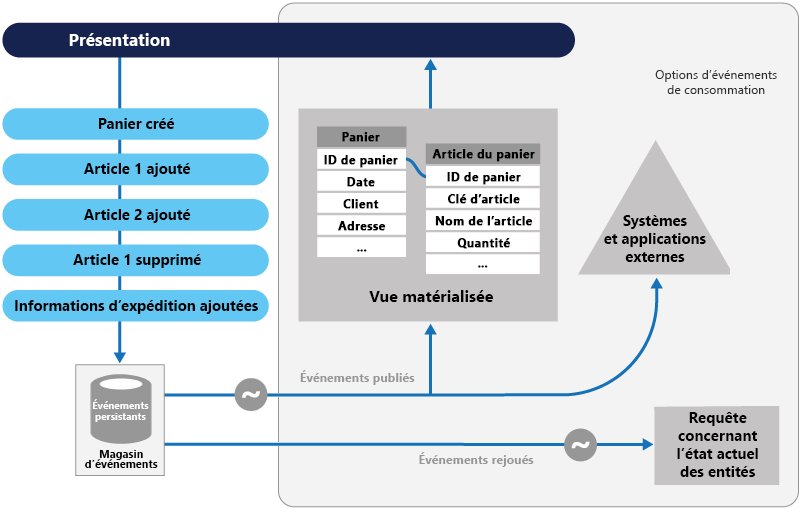
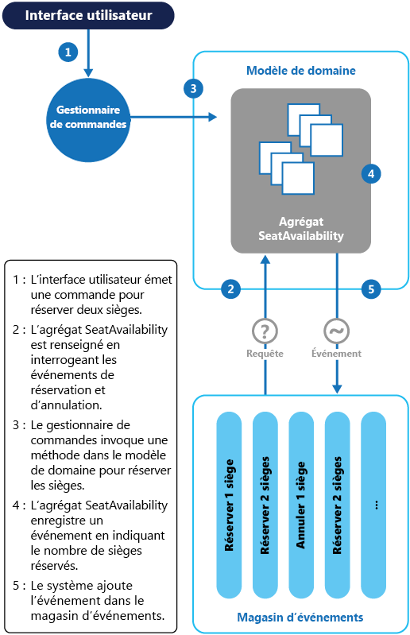

# Modèle d'approvisionnement en événementsEvent Sourcing pattern

[!INCLUDE [header](../_includes/header.md)]

Au lieu de stocker uniquement l’état actuel des données dans un domaine, utilisez un magasin d’ajout uniquement pour enregistrer la série complète d’actions exécutées sur ces données.Instead of storing just the current state of the data in a domain, use an append-only store to record the full series of actions taken on that data.
Le magasin joue le rôle de système d’enregistrement et peut être utilisé pour matérialiser les objets du domaine.The store acts as the system of record and can be used to materialize the domain objects. Cela peut simplifier les tâches dans les domaines complexes, en évitant d’avoir à synchroniser le modèle de données et le domaine de l’entreprise, tout en améliorant les performances, l’évolutivité et la réactivité.This can simplify tasks in complex domains, by avoiding the need to synchronize the data model and the business domain, while improving performance, scalability, and responsiveness. Il peut également assurer la cohérence des données transactionnelles et conserver un historique et des journaux d’audit complets qui peuvent activer des actions de compensation.It can also provide consistency for transactional data, and maintain full audit trails and history that can enable compensating actions.

## Contexte et problèmeContext and problem

La plupart des applications utilisent des données et l’approche habituelle consiste à ce que l’application les mette à jour lorsque les utilisateurs les utilisent.Most applications work with data, and the typical approach is for the application to maintain the current state of the data by updating it as users work with it. Par exemple, dans le modèle traditionnel de création, lecture, mise à jour et suppression (CRUD) le traitement type des données consiste à lire les données depuis le magasin, y apporter des modifications et mettre à jour l’état actuel des données avec les nouvelles valeurs&mdash;souvent au moyen de transactions qui verrouillent les données.For example, in the traditional create, read, update, and delete (CRUD) model a typical data process is to read data from the store, make some modifications to it, and update the current state of the data with the new values&mdash;often by using transactions that lock the data.

L’approche CRUD présente certaines limites :The CRUD approach has some limitations:

- Les systèmes CRUD effectuent les opérations de mise à jour directement sur un magasin de données, ce qui peut ralentir les performances et la réactivité, et limiter l’extensibilité, en raison de la charge de traitement requise.CRUD systems perform update operations directly against a data store, which can slow down performance and responsiveness, and limit scalability, due to the processing overhead it requires.

- Dans un domaine de collaboration comportant plusieurs utilisateurs simultanés, des conflits de mise à jour des données sont possibles, car les opérations de mise à jour s’effectuent sur un seul élément des données.In a collaborative domain with many concurrent users, data update conflicts are more likely because the update operations take place on a single item of data.

- À moins qu’il existe un mécanisme d’audit supplémentaire qui enregistre les détails de chaque opération dans un journal séparé, l’historique est perdu.Unless there's an additional auditing mechanism that records the details of each operation in a separate log, history is lost.

> Pour une meilleure compréhension des limites de l’approche CRUD, consultez [CRUD, Only When You Can Afford It](https://blogs.msdn.microsoft.com/maarten_mullender/2004/07/23/crud-only-when-you-can-afford-it-revisited/) (L’approche CRUD uniquement lorsque vous pouvez vous le permettre).For a deeper understanding of the limits of the CRUD approach see [CRUD, Only When You Can Afford It](https://blogs.msdn.microsoft.com/maarten_mullender/2004/07/23/crud-only-when-you-can-afford-it-revisited/).

## SolutionSolution

Le modèle d’approvisionnement en événements définit une approche de gestion des opérations sur les données qui est guidée par une séquence d’événements, dont chacun est enregistré dans un magasin d’ajout uniquement.The Event Sourcing pattern defines an approach to handling operations on data that's driven by a sequence of events, each of which is recorded in an append-only store. Le code applicatif envoie une série d’événements qui décrivent de manière impérative chaque action se produisant sur les données du magasin d’événements, où elles sont conservées.Application code sends a series of events that imperatively describe each action that has occurred on the data to the event store, where they're persisted. Chaque événement représente un ensemble de modifications des données (comme `AddedItemToOrder`).Each event represents a set of changes to the data (such as `AddedItemToOrder`).

Les événements sont conservés dans un magasin d’événements qui joue le rôle de système d’enregistrement (la source de données faisant autorité) sur l’état actuel des données.The events are persisted in an event store that acts as the system of record (the authoritative data source) about the current state of the data. Le magasin d’événements publie généralement ces événements afin que les consommateurs puissent être avertis et les traiter si nécessaire.The event store typically publishes these events so that consumers can be notified and can handle them if needed. Les consommateurs pourraient, par exemple, initier des tâches qui appliquent les opérations des événements à d’autres systèmes, ou effectuer toute autre action associée nécessaire pour terminer l’opération.Consumers could, for example, initiate tasks that apply the operations in the events to other systems, or perform any other associated action that's required to complete the operation. Notez que le code applicatif qui génère les événements est découplé des systèmes qui s’abonnent aux événements.Notice that the application code that generates the events is decoupled from the systems that subscribe to the events.

Les événements publiés par le magasin d’événements servent généralement à conserver les vues matérialisées des entités car les actions dans l’application les modifient, ainsi que pour l’intégration avec les systèmes externes.Typical uses of the events published by the event store are to maintain materialized views of entities as actions in the application change them, and for integration with external systems. Par exemple, un système peut conserver une vue matérialisée de toutes les commandes client utilisée pour remplir des parties de l’interface utilisateur.For example, a system can maintain a materialized view of all customer orders that's used to populate parts of the UI. Lorsque l’application ajoute de nouvelles commandes, ajoute ou supprime des articles de la commande et ajoute des informations d’expédition, les événements qui décrivent ces modifications peuvent être gérés et utilisés pour mettre à jour la [vue matérialisée](materialized-view.md).As the application adds new orders, adds or removes items on the order, and adds shipping information, the events that describe these changes can be handled and used to update the [materialized view](materialized-view.md).

En outre, les applications peuvent, à tout moment, lire l’historique des événements et l’utiliser pour matérialiser l’état actuel d’une entité en relisant et exploitant tous les événements liés à cette entité.In addition, at any point it's possible for applications to read the history of events, and use it to materialize the current state of an entity by playing back and consuming all the events related to that entity. Cela peut être effectué à la demande pour matérialiser un objet de domaine lors du traitement d’une requête, ou par le biais d’une tâche planifiée afin que l’état de l’entité puisse être conservé sous la forme d’une vue matérialisée pour prendre en charge la couche de présentation.This can occur on demand to materialize a domain object when handling a request, or through a scheduled task so that the state of the entity can be stored as a materialized view to support the presentation layer.

La figure montre une vue d’ensemble du modèle, y compris certaines des options d’utilisation du flux d’événements telles que la création d’une vue matérialisée, l’intégration des événements avec des systèmes et applications externes et la relecture des événements pour créer des projections de l’état actuel d’entités spécifiques.The figure shows an overview of the pattern, including some of the options for using the event stream such as creating a materialized view, integrating events with external applications and systems, and replaying events to create projections of the current state of specific entities.

Le modèle d'approvisionnement en événements offre les avantages suivants :The Event Sourcing pattern provides the following advantages:

- Les événements sont immuables et peuvent être conservés au moyen d’une opération d’ajout uniquement.Events are immutable and can be stored using an append-only operation. L’interface utilisateur, le flux de travail ou le processus qui a déclenché un événement peut continuer, et les tâches qui gèrent les événements peuvent s’exécuter en arrière-plan.The user interface, workflow, or process that initiated an event can continue, and tasks that handle the events can run in the background. Ceci, associé à l’absence de contention lors du traitement des transactions, peut considérablement améliorer les performances et l’évolutivité des applications, surtout pour le niveau de présentation ou l’interface utilisateur.This, combined with the fact that there's no contention during the processing of transactions, can vastly improve performance and scalability for applications, especially for the presentation level or user interface.

- Les événements sont des objets simples qui décrivent certaines actions qui se sont produites, ainsi que toutes les données associées nécessaires pour décrire l’action représentée par l’événement.Events are simple objects that describe some action that occurred, together with any associated data required to describe the action represented by the event. Les événements ne mettent pas directement à jour un magasin de données.Events don't directly update a data store. Ils sont simplement enregistrés afin d’être traités au moment opportun.They're simply recorded for handling at the appropriate time. Cela permet de simplifier la mise en œuvre et la gestion.This can simplify implementation and management.

- Les événements ont généralement un sens pour les experts de domaine, tandis que l’[anomalie d’impédance objet-relationnel](https://en.wikipedia.org/wiki/Object-relational_impedance_mismatch) peut rendre difficile à comprendre les tables de base de données complexes.Events typically have meaning for a domain expert, whereas [object-relational impedance mismatch](https://en.wikipedia.org/wiki/Object-relational_impedance_mismatch) can make complex database tables hard to understand. Les tables sont des constructions artificielles qui représentent l’état actuel du système, et non les événements qui se sont produits.Tables are artificial constructs that represent the current state of the system, not the events that occurred.

- L’approvisionnement en événements peut permettre d’éviter que les mises à jour simultanées ne provoquent des conflits car cela évite d’avoir mettre à jour directement des objets dans le magasin de données.Event sourcing can help prevent concurrent updates from causing conflicts because it avoids the requirement to directly update objects in the data store. Toutefois, le modèle de domaine doit toujours être conçu de manière à se protéger lui-même contre les requêtes pouvant entraîner un état incohérent.However, the domain model must still be designed to protect itself from requests that might result in an inconsistent state.

- Le stockage d’ajout uniquement des événements fournit une piste d’audit pouvant être utilisée pour surveiller les actions effectuées sur un magasin de données, régénérer l’état actuel sous forme de vues matérialisées ou de projections en relisant les événements à tout moment, et vous aider à tester et déboguer le système.The append-only storage of events provides an audit trail that can be used to monitor actions taken against a data store, regenerate the current state as materialized views or projections by replaying the events at any time, and assist in testing and debugging the system. En outre, la nécessité d’utiliser des événements de compensation pour annuler les modifications fournit un historique des modifications qui ont été annulées, ce qui ne serait pas possible si le modèle stockait simplement l’état actuel.In addition, the requirement to use compensating events to cancel changes provides a history of changes that were reversed, which wouldn't be the case if the model simply stored the current state. La liste des événements peut également être utilisée pour analyser les performances applicatives et détecter les tendances de comportement des utilisateurs, ou pour obtenir d’autres informations utiles.The list of events can also be used to analyze application performance and detect user behavior trends, or to obtain other useful business information.

- Le magasin d’événements déclenche des événements et les tâches effectuent des opérations en réponse à ces événements.The event store raises events, and tasks perform operations in response to those events. Ce découplage des tâches à partir des événements favorise la flexibilité et l’extensibilité.This decoupling of the tasks from the events provides flexibility and extensibility. Les tâches connaissent le type d’événement et ses données, mais pas l’opération qui a déclenché l’événement.Tasks know about the type of event and the event data, but not about the operation that triggered the event. En outre, plusieurs tâches peuvent gérer chaque événement.In addition, multiple tasks can handle each event. Cela facilite l’intégration avec d’autres services et systèmes qui écoutent uniquement les nouveaux événements déclenchés par le magasin d’événements.This enables easy integration with other services and systems that only listen for new events raised by the event store. Toutefois, les événements d’approvisionnement en événements ont tendance à être à un très bas niveau et il peut être nécessaire de générer à la place des événements d’intégration spécifiques.However, the event sourcing events tend to be very low level, and it might be necessary to generate specific integration events instead.

> L’approvisionnement en événements est couramment associé au modèle CQRS en effectuant les tâches de gestion des données en réponse aux événements et en matérialisant les vues à partir des événements stockés.Event sourcing is commonly combined with the CQRS pattern by performing the data management tasks in response to the events, and by materializing views from the stored events.

## Problèmes et considérationsIssues and considerations

Prenez en compte les points suivants lorsque vous choisissez comment implémenter ce modèle :Consider the following points when deciding how to implement this pattern:

Le système sera finalement cohérent uniquement lors de la création de vues matérialisées ou de la génération de projections de données par la relecture d’événements.The system will only be eventually consistent when creating materialized views or generating projections of data by replaying events. Il existe une certaine latence entre le moment où une application ajoute des événements au magasin d’événements suite au traitement d’une requête, la publication des événements et leur traitement par les consommateurs des événements.There's some delay between an application adding events to the event store as the result of handling a request, the events being published, and consumers of the events handling them. Pendant ce temps, les nouveaux événements qui décrivent les modifications supplémentaires apportées aux entités peuvent être parvenus au magasin d’événements.During this period, new events that describe further changes to entities might have arrived at the event store.

> [!NOTE]
> Pour plus d’informations sur la cohérence éventuelle, consultez [Data Consistency Primer](https://msdn.microsoft.com/library/dn589800.aspx)(Manuel d’introduction à la cohérence des données).See the [Data Consistency Primer](https://msdn.microsoft.com/library/dn589800.aspx) for information about eventual consistency.

Le magasin d’événements est la source permanente d’informations et les données d’événement ne doivent donc jamais être actualisées.The event store is the permanent source of information, and so the event data should never be updated. La seule façon de mettre à jour une entité pour annuler une modification est d’ajouter un événement de compensation au magasin d’événements.The only way to update an entity to undo a change is to add a compensating event to the event store. Si le format (plutôt que les données) des événements persistants doit être modifié, lors d’une migration par exemple, il peut être difficile de combiner dans le magasin des événements existants avec la nouvelle version.If the format (rather than the data) of the persisted events needs to change, perhaps during a migration, it can be difficult to combine existing events in the store with the new version. Il peut être nécessaire d’itérer sur tous les événements en effectuant des modifications afin qu’ils soient compatibles avec le nouveau format, ou d’ajouter de nouveaux événements qui utilisent le nouveau format.It might be necessary to iterate through all the events making changes so they're compliant with the new format, or add new events that use the new format. Pensez à utiliser une étampe de version sur chaque version du schéma d’événement pour conserver à la fois l’ancien et le nouveau format d’événement.Consider using a version stamp on each version of the event schema to maintain both the old and the new event formats.

Les applications multithread et plusieurs instances d’applications peuvent stocker des événements dans le magasin d’événements.Multi-threaded applications and multiple instances of applications might be storing events in the event store. La cohérence des événements dans le magasin d’événements est indispensable, tout comme l’ordre des événements qui affectent une entité spécifique (l’ordre dans lequel les modifications s’appliquent à une entité affecte son état actuel).The consistency of events in the event store is vital, as is the order of events that affect a specific entity (the order that changes occur to an entity affects its current state). L’ajout d’un horodatage à chaque événement peut permettre d’éviter les problèmes.Adding a timestamp to every event can help to avoid issues. Une autre pratique courante consiste à annoter chaque événement issu d’une requête avec un identificateur incrémentiel.Another common practice is to annotate each event resulting from a request with an incremental identifier. Si deux personnes tentent d’ajouter des événements à la même entité au même moment, le magasin d’événements peut rejeter un événement correspondant à un identificateur d’entité existant et à un identificateur d’événement.If two actions attempt to add events for the same entity at the same time, the event store can reject an event that matches an existing entity identifier and event identifier.

Il n’existe aucune approche standard ou mécanismes existants (comme des requêtes SQL) pour lire les événements afin d’obtenir des informations.There's no standard approach, or existing mechanisms such as SQL queries, for reading the events to obtain information. Un flux d’événements constitue les seules données pouvant être extraites en utilisant comme critère un identificateur d’événement.The only data that can be extracted is a stream of events using an event identifier as the criteria. L’ID d’événement correspond généralement à des entités individuelles.The event ID typically maps to individual entities. L’état actuel d’une entité peut être déterminé uniquement en relisant tous les événements s’y rapportant par rapport à l’état d’origine de cette entité.The current state of an entity can be determined only by replaying all of the events that relate to it against the original state of that entity.

La longueur de chaque flux d’événements a une incidence sur la gestion et la mise à jour du système.The length of each event stream affects managing and updating the system. Si les flux de données sont volumineux, pensez à créer des instantanés à intervalles réguliers (un nombre spécifié d’événements, par exemple).If the streams are large, consider creating snapshots at specific intervals such as a specified number of events. L’état actuel de l’entité peut être obtenu à partir de l’instantané et en relisant les événements qui se sont produits après ce moment précis.The current state of the entity can be obtained from the snapshot and by replaying any events that occurred after that point in time. Pour plus d’informations sur la création d’instantanés de données, consultez [Snapshot on Martin Fowler’s Enterprise Application Architecture website](http://martinfowler.com/eaaDev/Snapshot.html) (Instantané du site Web Enterprise Application Architecture de Martin Fowler) et [Master-Subordinate Snapshot Replication](https://msdn.microsoft.com/library/ff650012.aspx) (Réplication de capture instantanée maître-subordonné).For more information about creating snapshots of data, see [Snapshot on Martin Fowler’s Enterprise Application Architecture website](http://martinfowler.com/eaaDev/Snapshot.html) and [Master-Subordinate Snapshot Replication](https://msdn.microsoft.com/library/ff650012.aspx).

Même si l’approvisionnement en événements réduit le risque de mises à jour conflictuelles des données, l’application doit rester en mesure de traiter les incohérences résultant de la cohérence éventuelle et de l’absence de transactions.Even though event sourcing minimizes the chance of conflicting updates to the data, the application must still be able to deal with inconsistencies that result from eventual consistency and the lack of transactions. Par exemple, un événement indiquant une réduction dans l’inventaire du stock peut arriver dans le magasin de données alors même qu’une commande pour cet élément est en train d’être passée. Il est alors nécessaire de procéder au rapprochement des deux opérations, soit en en informant le client ou bien en créant une commande différée.For example, an event that indicates a reduction in stock inventory might arrive in the data store while an order for that item is being placed, resulting in a requirement to reconcile the two operations either by advising the customer or creating a back order.

La publication de l’événement peut avoir lieu « au moins une fois », c’est pourquoi les consommateurs des événements doivent être idempotents.Event publication might be “at least once,” and so consumers of the events must be idempotent. Ils ne doivent pas réappliquer la mise à jour décrite dans un événement si celui-ci est traité plusieurs fois.They must not reapply the update described in an event if the event is handled more than once. Par exemple, si plusieurs instances d’un consommateur conservent un agrégat de la propriété d’une entité, comme le nombre total de commandes passées, seule une instance doit réussir à incrémenter l’agrégat lorsqu’un événement de passage de commande se produit.For example, if multiple instances of a consumer maintain an aggregate an entity's property, such as the total number of orders placed, only one must succeed in incrementing the aggregate when an order placed event occurs. Même si cela n’est pas une caractéristique majeure des d’événements d’approvisionnement, c’est la décision de mise en œuvre habituelle.While this isn't a key characteristic of event sourcing, it's the usual implementation decision.

## Quand utiliser ce modèleWhen to use this pattern

Utilisez ce modèle dans les situations suivantes :Use this pattern in the following scenarios:

- Lorsque vous souhaitez capturer l’intention, l’objectif ou le motif des données.When you want to capture intent, purpose, or reason in the data. Par exemple, les modifications apportées à une entité client peuvent être capturées sous la forme d’une série de types d’événements spécifiques comme _A déménagé_, _Compte clôturé_ ou _Décédé_.For example, changes to a customer entity can be captured as a series of specific event types such as _Moved home_, _Closed account_, or _Deceased_.

- Lorsqu’il est essentiel de limiter ou de prévenir complètement le risque de mises à jour conflictuelles des données.When it's vital to minimize or completely avoid the occurrence of conflicting updates to data.

- Lorsque vous souhaitez enregistrer les événements qui se produisent et pouvoir les relire afin de restaurer l’état d’un système, restaurer les modifications ou conserver un historique et journal d’audit.When you want to record events that occur, and be able to replay them to restore the state of a system, roll back changes, or keep a history and audit log. Par exemple, lorsqu’une tâche implique plusieurs étapes, vous devrez peut-être exécuter certaines actions pour restaurer les mises à jour, puis relire certaines étapes afin de rétablir les données à un état cohérent.For example, when a task involves multiple steps you might need to execute actions to revert updates and then replay some steps to bring the data back into a consistent state.

- Lorsque l’utilisation des événements est une caractéristique naturelle du fonctionnement de l’application et nécessite peu d’effort supplémentaire de développement ou de mise en œuvre.When using events is a natural feature of the operation of the application, and requires little additional development or implementation effort.

- Lorsque vous devez découpler le processus de saisie ou de mise à jour des données des tâches nécessaires à l’application de ces actions.When you need to decouple the process of inputting or updating data from the tasks required to apply these actions. Cela peut être pour améliorer les performances de l’interface utilisateur ou distribuer les événements à d’autres écouteurs qui agissent lorsque les événements se produisent.This might be to improve UI performance, or to distribute events to other listeners that take action when the events occur. Par exemple, l’intégration d’un système de paie avec un site Web de soumission des dépenses de telle sorte que les événements déclenchés par le magasin d’événements en réponse aux mises à jour des données effectuées sur le site Web soient consommés par le site Web et le système de paie.For example, integrating a payroll system with an expense submission website so that events raised by the event store in response to data updates made in the website are consumed by both the website and the payroll system.

- Lorsque vous souhaitez disposer de la flexibilité nécessaire pour modifier le format des modèles matérialisés et des données d’entité si les besoins changent, ou&mdash;en cas d’utilisation conjointe avec CQRS&mdash;si vous devez adapter un modèle de lecture ou les vues qui exposent les données.When you want flexibility to be able to change the format of materialized models and entity data if requirements change, or&mdash;when used in conjunction with CQRS&mdash;you need to adapt a read model or the views that expose the data.

- Lorsqu’il est utilisé conjointement avec CQRS et que la cohérence éventuelle est acceptable lorsqu’un modèle de lecture est mis à jour, ou que l’impact sur les performances de la réalimentation des entités et des données à partir d’un flux d’événements est acceptable.When used in conjunction with CQRS, and eventual consistency is acceptable while a read model is updated, or the performance impact of rehydrating entities and data from an event stream is acceptable.

Ce modèle peut s’avérer inutile dans les situations suivantes :This pattern might not be useful in the following situations:

- Domaines simples ou de petite taille, systèmes ayant peu ou aucune logique d’entreprise, ou systèmes non domaine fonctionnant naturellement bien avec les mécanismes de gestion de données CRUD traditionnels.Small or simple domains, systems that have little or no business logic, or nondomain systems that naturally work well with traditional CRUD data management mechanisms.

- Systèmes où la cohérence et les mises à jour en temps réel des vues des données sont requises.Systems where consistency and real-time updates to the views of the data are required.

- Systèmes où les pistes d’audit, l’historique et les fonctionnalités de restauration et de relecture des actions ne sont pas requis.Systems where audit trails, history, and capabilities to roll back and replay actions are not required.

- Systèmes présentant uniquement un très faible nombre d’occurrences de mises à jour conflictuelles des données sous-jacentes.Systems where there's only a very low occurrence of conflicting updates to the underlying data. Par exemple, les systèmes qui ajoutent surtout des données au lieu de les mettre à jour.For example, systems that predominantly add data rather than updating it.

## ExemplesExample

Un système de gestion de conférences doit suivre le nombre de réservations effectuées afin de pouvoir vérifier s’il reste des places disponibles lorsqu’un participant potentiel tente d’effectuer une réservation.A conference management system needs to track the number of completed bookings for a conference so that it can check whether there are seats still available when a potential attendee tries to make a booking. Le système peut stocker le nombre total de réservations pour une conférence d’au moins deux façons possibles :The system could store the total number of bookings for a conference in at least two ways:

- Il peut stocker les informations sur le nombre total de réservations sous la forme d’une entité distincte dans une base de données contenant des informations de réservation.The system could store the information about the total number of bookings as a separate entity in a database that holds booking information. Lorsque des réservations sont effectuées ou annulées, le système peut incrémenter ou décrémenter ce nombre comme il convient.As bookings are made or canceled, the system could increment or decrement this number as appropriate. Cette approche est simple en théorie, mais peut entraîner des problèmes d’extensibilité si un grand nombre de participants tente de réserver des places sur une courte période de temps.This approach is simple in theory, but can cause scalability issues if a large number of attendees are attempting to book seats during a short period of time. Par exemple, dans les derniers jours avant la clôture des réservations.For example, in the last day or so prior to the booking period closing.

- Le système peut stocker des informations sur les réservations et les annulations sous la forme d’événements conservés dans un magasin d’événements.The system could store information about bookings and cancellations as events held in an event store. Il peut ensuite calculer le nombre de places disponibles en relisant ces événements.It could then calculate the number of seats available by replaying these events. Cette approche peut être plus évolutive en raison de l’immuabilité des événements.This approach can be more scalable due to the immutability of events. Le système doit seulement être en mesure de lire les données du magasin d’événements, ou d’ajouter des données au magasin d’événements.The system only needs to be able to read data from the event store, or append data to the event store. Les informations d’événement sur les réservations et les annulations ne sont jamais modifiées.Event information about bookings and cancellations is never modified.

Le diagramme suivant illustre la façon dont le sous-système de réservation de places du système de gestion de conférences peut être implémenté grâce à l’approvisionnement en événements.The following diagram illustrates how the seat reservation subsystem of the conference management system might be implemented using event sourcing.

Voici la séquence d’actions permettant de réserver deux places :The sequence of actions for reserving two seats is as follows:

1. L’interface utilisateur émet une commande pour réserver des places pour deux participants.The user interface issues a command to reserve seats for two attendees. La commande est traitée par un gestionnaire de commandes distinct.The command is handled by a separate command handler. Logique qui est dissociée de l’interface utilisateur et est responsable du traitement des requêtes publiées sous forme de commandes.A piece of logic that is decoupled from the user interface and is responsible for handling requests posted as commands.

2. Un agrégat contenant des informations sur toutes les réservations pour la conférence est élaboré en interrogeant les événements qui décrivent les réservations et les annulations.An aggregate containing information about all reservations for the conference is constructed by querying the events that describe bookings and cancellations. Cet agrégat est appelé `SeatAvailability` et est contenu dans un modèle de domaine qui présente les méthodes d’interrogation et de modification des données dans l’agrégat.This aggregate is called `SeatAvailability`, and is contained within a domain model that exposes methods for querying and modifying the data in the aggregate.

    > Pour optimiser les opérations, vous pouvez envisager d’utiliser des captures instantanées (afin que vous n’avez pas besoin d’interroger et de relire la liste complète des événements pour obtenir l’état actuel de l’agrégat) et de conserver une copie mise en cache de l’agrégat dans la mémoire.Some optimizations to consider are using snapshots (so that you don’t need to query and replay the full list of events to obtain the current state of the aggregate), and maintaining a cached copy of the aggregate in memory.

3. Le gestionnaire de commandes appelle une méthode exposée par le modèle de domaine pour effectuer les réservations.The command handler invokes a method exposed by the domain model to make the reservations.

4. L’agrégat `SeatAvailability` enregistre un événement qui contient le nombre de places réservées.The `SeatAvailability` aggregate records an event containing the number of seats that were reserved. La prochaine fois que l’agrégat appliquera des événements, toutes les réservations seront utilisées pour calculer le nombre de places restantes.The next time the aggregate applies events, all the reservations will be used to compute how many seats remain.

5. Le système ajoute le nouvel événement à la liste des événements dans le magasin d’événements.The system appends the new event to the list of events in the event store.

Si un utilisateur annule une place, le système suit un processus similaire, sauf que le gestionnaire de commandes émet une commande qui génère un événement d’annulation de place et l’ajoute dans le magasin d’événements.If a user cancels a seat, the system follows a similar process except the command handler issues a command that generates a seat cancellation event and appends it to the event store.

En plus d’accroître l’extensibilité, l’utilisation d’un magasin d’événements fournit également un historique complet, ou piste d’audit, des réservations et annulations d’une conférence.As well as providing more scope for scalability, using an event store also provides a complete history, or audit trail, of the bookings and cancellations for a conference. Les événements du magasin d’événements constituent l’enregistrement le plus précis.The events in the event store are the accurate record. Il n’est pas nécessaire de conserver les agrégats d’une autre manière, car le système peut facilement relire les événements et restaurer l’état à n’importe quel instant donné.There is no need to persist aggregates in any other way because the system can easily replay the events and restore the state to any point in time.

> Vous trouverez plus d’informations sur cet exemple dans [Présentation de l’approvisionnement en événements](https://msdn.microsoft.com/library/jj591559.aspx).You can find more information about this example in [Introducing Event Sourcing](https://msdn.microsoft.com/library/jj591559.aspx).

## Conseils et modèles connexesRelated patterns and guidance

Les modèles et les conseils suivants peuvent aussi présenter un intérêt quand il s’agit d’implémenter ce modèle :The following patterns and guidance might also be relevant when implementing this pattern:

- [Modèle de séparation des responsabilités en matière de commande et de requête (CQRS)](cqrs.md).[Command and Query Responsibility Segregation (CQRS) Pattern](cqrs.md). Le magasin d’écriture qui fournit la source permanente d’informations relatives à une implémentation CQRS est souvent basé sur une implémentation du modèle d’approvisionnement en événements.The write store that provides the permanent source of information for a CQRS implementation is often based on an implementation of the Event Sourcing pattern. Décrit comment séparer les opérations qui lisent les données dans une application des opérations qui mettent à jour les données en utilisant des interfaces distinctes.Describes how to segregate the operations that read data in an application from the operations that update data by using separate interfaces.

- [Modèle de vue matérialisée](materialized-view.md).[Materialized View Pattern](materialized-view.md). Le magasin de données utilisé dans un système basé sur l’approvisionnement en événements n’est généralement idéal pour assurer une interrogation efficace.The data store used in a system based on event sourcing is typically not well suited to efficient querying. L’approche courante consiste à générer des vues préremplies des données à intervalles réguliers, ou lorsque les données changent.Instead, a common approach is to generate prepopulated views of the data at regular intervals, or when the data changes. Montre comment procéder.Shows how this can be done.

- [Modèle de transaction de compensation](compensating-transaction.md).[Compensating Transaction Pattern](compensating-transaction.md). Les données existantes dans un magasin d’approvisionnement en événements ne sont pas mises à jour. À la place, de nouvelles entrées sont ajoutées pour assurer la transition de l’état des entités vers les nouvelles valeurs.The existing data in an event sourcing store is not updated, instead new entries are added that transition the state of entities to the new values. Pour annuler une modification, on utilise les entrées de compensation car il n’est pas possible de simplement annuler la modification précédente.To reverse a change, compensating entries are used because it isn't possible to simply reverse the previous change. Décrit comment annuler le travail qui a été effectué par une opération précédente.Describes how to undo the work that was performed by a previous operation.

- [Data Consistency Primer](https://msdn.microsoft.com/library/dn589800.aspx) (Manuel d’introduction à la cohérence des données).[Data Consistency Primer](https://msdn.microsoft.com/library/dn589800.aspx). En cas d’utilisation de l’approvisionnement en événements avec un magasin de lecture distinct ou des vues matérialisées, les données de lecture ne sont pas immédiatement cohérentes, mais uniquement cohérentes.When using event sourcing with a separate read store or materialized views, the read data won't be immediately consistent, instead it'll be only eventually consistent. Résume les problèmes se rapportant à la conservation de la cohérence des données distribuées.Summarizes the issues surrounding maintaining consistency over distributed data.

- [Conseils sur le partitionnement des données](https://msdn.microsoft.com/library/dn589795.aspx).[Data Partitioning Guidance](https://msdn.microsoft.com/library/dn589795.aspx). Les données sont souvent partitionnées lorsque vous utilisez l’approvisionnement en événements pour améliorer l’extensibilité, réduire la contention et optimiser les performances.Data is often partitioned when using event sourcing to improve scalability, reduce contention, and optimize performance. Décrit comment diviser les données en partitions distinctes, et les problèmes pouvant survenir.Describes how to divide data into discrete partitions, and the issues that can arise.

- Billet de Greg Young [Pourquoi utiliser l’approvisionnement en événements ?](http://codebetter.com/gregyoung/2010/02/20/why-use-event-sourcing/).Greg Young’s post [Why use Event Sourcing?](http://codebetter.com/gregyoung/2010/02/20/why-use-event-sourcing/).
