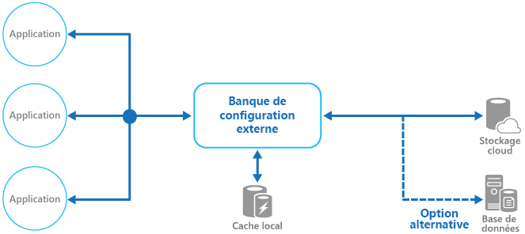

# <a name="external-configuration-store-pattern"></a><span data-ttu-id="fb452-104">Modèle de magasin de configurations externe</span><span class="sxs-lookup"><span data-stu-id="fb452-104">External Configuration Store pattern</span></span>

[!INCLUDE [header](../_includes/header.md)]

<span data-ttu-id="fb452-105">Déplacez les informations de configuration depuis le package de déploiement d’application vers un emplacement centralisé.</span><span class="sxs-lookup"><span data-stu-id="fb452-105">Move configuration information out of the application deployment package to a centralized location.</span></span> <span data-ttu-id="fb452-106">Ainsi, vous pouvez gérer et contrôler les données de configuration plus facilement et partager les données de configuration entre les applications et les instances d’application.</span><span class="sxs-lookup"><span data-stu-id="fb452-106">This can provide opportunities for easier management and control of configuration data, and for sharing configuration data across applications and application instances.</span></span>

## <a name="context-and-problem"></a><span data-ttu-id="fb452-107">Contexte et problème</span><span class="sxs-lookup"><span data-stu-id="fb452-107">Context and problem</span></span>

<span data-ttu-id="fb452-108">La plupart des environnements d’exécution d’application contiennent des informations de configuration qui sont conservées dans les fichiers déployés avec l’application.</span><span class="sxs-lookup"><span data-stu-id="fb452-108">The majority of application runtime environments include configuration information that's held in files deployed with the application.</span></span> <span data-ttu-id="fb452-109">Dans certains cas, il est possible de modifier ces fichiers pour changer le comportement de l’application après son déploiement.</span><span class="sxs-lookup"><span data-stu-id="fb452-109">In some cases, it's possible to edit these files to change the application behavior after it's been deployed.</span></span> <span data-ttu-id="fb452-110">Toutefois, les modifications apportées à la configuration nécessitent le redéploiement de l’application, ce qui entraîne souvent des temps d’arrêt inacceptables et autres traitements administratifs.</span><span class="sxs-lookup"><span data-stu-id="fb452-110">However, changes to the configuration require the application be redeployed, often resulting in unacceptable downtime and other administrative overhead.</span></span>

<span data-ttu-id="fb452-111">En outre, les fichiers de configuration locale limitent la configuration à une seule application, alors que le partage des paramètres de configuration entre plusieurs applications pourrait parfois s’avérer utile.</span><span class="sxs-lookup"><span data-stu-id="fb452-111">Local configuration files also limit the configuration to a single application, but sometimes it would be useful to share configuration settings across multiple applications.</span></span> <span data-ttu-id="fb452-112">À titre d’exemple, citons les chaînes de connexion de base de données, les informations relatives aux thèmes de l’interface utilisateur ou les URL de files d’attente et de stockage utilisées par un ensemble d’applications connexe.</span><span class="sxs-lookup"><span data-stu-id="fb452-112">Examples include database connection strings, UI theme information, or the URLs of queues and storage used by a related set of applications.</span></span>

<span data-ttu-id="fb452-113">Il est difficile de gérer les modifications apportées aux configurations locales sur plusieurs instances en cours d’exécution de l’application, en particulier dans un scénario de type cloud.</span><span class="sxs-lookup"><span data-stu-id="fb452-113">It's challenging to manage changes to local configurations across multiple running instances of the application, especially in a cloud-hosted scenario.</span></span> <span data-ttu-id="fb452-114">En effet, les instances risquent d’utiliser différents paramètres de configuration durant le déploiement de la mise à jour.</span><span class="sxs-lookup"><span data-stu-id="fb452-114">It can result in instances using different configuration settings while the update is being deployed.</span></span>

<span data-ttu-id="fb452-115">En outre, les mises à jour des applications et des composants peuvent nécessiter des modifications des schémas de configuration.</span><span class="sxs-lookup"><span data-stu-id="fb452-115">In addition, updates to applications and components might require changes to configuration schemas.</span></span> <span data-ttu-id="fb452-116">De nombreux systèmes de configuration ne prennent pas en charge différentes versions des informations de configuration.</span><span class="sxs-lookup"><span data-stu-id="fb452-116">Many configuration systems don't support different versions of configuration information.</span></span>

## <a name="solution"></a><span data-ttu-id="fb452-117">Solution</span><span class="sxs-lookup"><span data-stu-id="fb452-117">Solution</span></span>

<span data-ttu-id="fb452-118">Stockez les informations de configuration dans un stockage externe et fournissez une interface qui peut être utilisée pour lire et mettre à jour les paramètres de configuration rapidement et efficacement.</span><span class="sxs-lookup"><span data-stu-id="fb452-118">Store the configuration information in external storage, and provide an interface that can be used to quickly and efficiently read and update configuration settings.</span></span> <span data-ttu-id="fb452-119">Le type de magasin externe dépend de l’environnement d’hébergement et d’exécution de l’application.</span><span class="sxs-lookup"><span data-stu-id="fb452-119">The type of external store depends on the hosting and runtime environment of the application.</span></span> <span data-ttu-id="fb452-120">Dans un scénario de type cloud, il s’agit généralement d’un service de stockage cloud, mais ce peut être une base de données hébergée ou un autre système.</span><span class="sxs-lookup"><span data-stu-id="fb452-120">In a cloud-hosted scenario it's typically a cloud-based storage service, but could be a hosted database or other system.</span></span>

<span data-ttu-id="fb452-121">Le magasin de stockage que vous choisissez pour les informations de configuration doit avoir une interface qui offre un accès cohérent et facile à utiliser.</span><span class="sxs-lookup"><span data-stu-id="fb452-121">The backing store you choose for configuration information should have an interface that provides consistent and easy-to-use access.</span></span> <span data-ttu-id="fb452-122">Il doit exposer les informations dans un format correctement typé et structuré.</span><span class="sxs-lookup"><span data-stu-id="fb452-122">It should expose the information in a correctly typed and structured format.</span></span> <span data-ttu-id="fb452-123">Le cas échéant, l’implémentation doit aussi autoriser l’accès des utilisateurs afin de protéger les données de configuration et être suffisamment flexible pour permettre le stockage de plusieurs versions de la configuration (par exemple, développement, préproduction ou production, y compris plusieurs versions Release de chacune d’elles).</span><span class="sxs-lookup"><span data-stu-id="fb452-123">The implementation might also need to authorize users’ access in order to protect configuration data, and be flexible enough to allow storage of multiple versions of the configuration (such as development, staging, or production, including multiple release versions of each one).</span></span>

> <span data-ttu-id="fb452-124">De nombreux systèmes de configuration intégrés lisent les données quand l’application démarre et les mettent en cache en mémoire afin de les rendre rapidement accessibles et de réduire au minimum l’impact sur les performances de l’application.</span><span class="sxs-lookup"><span data-stu-id="fb452-124">Many built-in configuration systems read the data when the application starts up, and cache the data in memory to provide fast access and minimize the impact on application performance.</span></span> <span data-ttu-id="fb452-125">Selon le type de magasin de stockage utilisé et la latence de ce magasin, il peut être utile d’implémenter un mécanisme de mise en cache dans le magasin de configuration externe.</span><span class="sxs-lookup"><span data-stu-id="fb452-125">Depending on the type of backing store used, and the latency of this store, it might be helpful to implement a caching mechanism within the external configuration store.</span></span> <span data-ttu-id="fb452-126">Pour plus d’informations, consultez [Conseils de mise en cache](https://msdn.microsoft.com/library/dn589802.aspx).</span><span class="sxs-lookup"><span data-stu-id="fb452-126">For more information, see the [Caching Guidance](https://msdn.microsoft.com/library/dn589802.aspx).</span></span> <span data-ttu-id="fb452-127">La figure illustre une vue d’ensemble du modèle de magasin de configuration externe avec le cache local facultatif.</span><span class="sxs-lookup"><span data-stu-id="fb452-127">The figure illustrates an overview of the External Configuration Store pattern with optional local cache.</span></span>



## <a name="issues-and-considerations"></a><span data-ttu-id="fb452-129">Problèmes et considérations</span><span class="sxs-lookup"><span data-stu-id="fb452-129">Issues and considerations</span></span>

<span data-ttu-id="fb452-130">Prenez en compte les points suivants lorsque vous choisissez comment implémenter ce modèle :</span><span class="sxs-lookup"><span data-stu-id="fb452-130">Consider the following points when deciding how to implement this pattern:</span></span>

<span data-ttu-id="fb452-131">Choisissez un magasin de stockage qui offre des performances acceptables, un haut niveau de disponibilité, une certaine fiabilité et qui peut être sauvegardé dans le cadre du processus de maintenance et d’administration des applications.</span><span class="sxs-lookup"><span data-stu-id="fb452-131">Choose a backing store that offers acceptable performance, high availability, robustness, and can be backed up as part of the application maintenance and administration process.</span></span> <span data-ttu-id="fb452-132">Dans une application hébergée sur le cloud, utiliser un mécanisme de stockage cloud est généralement un bon choix pour répondre à ces exigences.</span><span class="sxs-lookup"><span data-stu-id="fb452-132">In a cloud-hosted application, using a cloud storage mechanism is usually a good choice to meet these requirements.</span></span>

<span data-ttu-id="fb452-133">Concevez le schéma du magasin de stockage afin qu’il puisse contenir des types d’informations variés.</span><span class="sxs-lookup"><span data-stu-id="fb452-133">Design the schema of the backing store to allow flexibility in the types of information it can hold.</span></span> <span data-ttu-id="fb452-134">Vérifiez qu’il satisfait à toutes les contraintes de configuration requises, telles que les données typées, les collections de paramètres, la diversité des versions de paramètres et toute autre fonctionnalité nécessaire aux applications qui l’utilisent.</span><span class="sxs-lookup"><span data-stu-id="fb452-134">Ensure that it provides for all configuration requirements such as typed data, collections of settings, multiple versions of settings, and any other features that the applications using it require.</span></span> <span data-ttu-id="fb452-135">Le schéma doit être facile à étendre pour prendre en charge des paramètres supplémentaires selon les besoins.</span><span class="sxs-lookup"><span data-stu-id="fb452-135">The schema should be easy to extend to support additional settings as requirements change.</span></span>

<span data-ttu-id="fb452-136">Prenez en considération les capacités physiques du magasin de stockage, sa relation au mode de stockage des informations de configuration et les effets sur les performances.</span><span class="sxs-lookup"><span data-stu-id="fb452-136">Consider the physical capabilities of the backing store, how it relates to the way configuration information is stored, and the effects on performance.</span></span> <span data-ttu-id="fb452-137">Par exemple, le stockage d’un document XML contenant les informations de configuration nécessite que l’interface de configuration ou l’application analyse le document afin de lire les différents paramètres.</span><span class="sxs-lookup"><span data-stu-id="fb452-137">For example, storing an XML document containing configuration information will require either the configuration interface or the application to parse the document in order to read individual settings.</span></span> <span data-ttu-id="fb452-138">Cela rend plus compliquée la mise à jour d’un paramètre, bien que la mise en cache des paramètres puisse aider à compenser la baisse des performances de lecture.</span><span class="sxs-lookup"><span data-stu-id="fb452-138">It'll make updating a setting more complicated, though caching the settings can help to offset slower read performance.</span></span>

<span data-ttu-id="fb452-139">Considérez la façon dont l’interface de configuration doit permettre de contrôler l’étendue et l’héritage des paramètres de configuration.</span><span class="sxs-lookup"><span data-stu-id="fb452-139">Consider how the configuration interface will permit control of the scope and inheritance of configuration settings.</span></span> <span data-ttu-id="fb452-140">Par exemple, il peut être nécessaire de limiter l’étendue des paramètres de configuration à l’ordinateur, à l’application et à l’organisation.</span><span class="sxs-lookup"><span data-stu-id="fb452-140">For example, it might be a requirement to scope configuration settings at the organization, application, and the machine level.</span></span> <span data-ttu-id="fb452-141">Il se peut qu’elle doive prendre en charge la délégation du contrôle de l’accès à différentes étendues et interdire à des applications spécifiques de remplacer les paramètres ou les autoriser à le faire.</span><span class="sxs-lookup"><span data-stu-id="fb452-141">It might need to support delegation of control over access to different scopes, and to prevent or allow individual applications to override settings.</span></span>

<span data-ttu-id="fb452-142">Assurez-vous que l’interface de configuration peut exposer les données de configuration dans les formats requis (valeurs typées, collections, paires clé/valeur, conteneurs de propriétés, entre autres).</span><span class="sxs-lookup"><span data-stu-id="fb452-142">Ensure that the configuration interface can expose the configuration data in the required formats such as typed values, collections, key/value pairs, or property bags.</span></span>

<span data-ttu-id="fb452-143">Considérez la façon dont l’interface du magasin de configuration doit se comporter si les paramètres contiennent des erreurs ou font défaut dans le magasin de sauvegarde.</span><span class="sxs-lookup"><span data-stu-id="fb452-143">Consider how the configuration store interface will behave when settings contain errors, or don't exist in the backing store.</span></span> <span data-ttu-id="fb452-144">Il peut être approprié de retourner les paramètres par défaut et de consigner les erreurs.</span><span class="sxs-lookup"><span data-stu-id="fb452-144">It might be appropriate to return default settings and log errors.</span></span> <span data-ttu-id="fb452-145">Envisagez également des aspects tels que le respect de la casse dans les clés ou les noms des paramètres de configuration, le stockage et la gestion des données binaires et la gestion des valeurs null ou vides.</span><span class="sxs-lookup"><span data-stu-id="fb452-145">Also consider aspects such as the case sensitivity of configuration setting keys or names, the storage and handling of binary data, and the ways that null or empty values are handled.</span></span>

<span data-ttu-id="fb452-146">Déterminez la façon dont les données de configuration doivent être protégées afin que seul l’accès aux utilisateurs et applications appropriés soit autorisé.</span><span class="sxs-lookup"><span data-stu-id="fb452-146">Consider how to protect the configuration data to allow access to only the appropriate users and applications.</span></span> <span data-ttu-id="fb452-147">Il s’agit probablement d’une fonctionnalité de l’interface du magasin de configuration, mais il est également nécessaire de s’assurer que les données du magasin de stockage ne sont pas directement accessibles sans l’autorisation appropriée.</span><span class="sxs-lookup"><span data-stu-id="fb452-147">This is likely a feature of the configuration store interface, but it's also necessary to ensure that the data in the backing store can't be accessed directly without the appropriate permission.</span></span> <span data-ttu-id="fb452-148">Mettez en place une séparation stricte entre les autorisations requises pour lire et pour écrire des données de configuration.</span><span class="sxs-lookup"><span data-stu-id="fb452-148">Ensure strict separation between the permissions required to read and to write configuration data.</span></span> <span data-ttu-id="fb452-149">En outre, déterminez si vous devez chiffrer tout ou partie des paramètres de configuration et la façon dont vous devez implémenter cela dans l’interface du magasin de configuration.</span><span class="sxs-lookup"><span data-stu-id="fb452-149">Also consider whether you need to encrypt some or all of the configuration settings, and how this'll be implemented in the configuration store interface.</span></span>

<span data-ttu-id="fb452-150">Les configurations stockées de manière centralisée, qui modifient le comportement de l’application pendant l’exécution, sont extrêmement importantes et doivent être déployées, mises à jour et gérées en utilisant les mêmes mécanismes que pour le déploiement du code d’une application.</span><span class="sxs-lookup"><span data-stu-id="fb452-150">Centrally stored configurations, which change application behavior during runtime, are critically important and should be deployed, updated, and managed using the same mechanisms as deploying application code.</span></span> <span data-ttu-id="fb452-151">Par exemple, les modifications qui peuvent affecter plusieurs applications doivent être effectuées à l’aide d’un test complet et d’une approche de déploiement intermédiaire afin que la modification soit appropriée pour toutes les applications qui utilisent cette configuration.</span><span class="sxs-lookup"><span data-stu-id="fb452-151">For example, changes that can affect more than one application must be carried out using a full test and staged deployment approach to ensure that the change is appropriate for all applications that use this configuration.</span></span> <span data-ttu-id="fb452-152">Si un administrateur modifie un paramètre pour mettre à jour une application, l’opération risque d’affecter les autres applications qui utilisent le même paramètre.</span><span class="sxs-lookup"><span data-stu-id="fb452-152">If an administrator edits a setting to update one application, it could adversely impact other applications that use the same setting.</span></span>

<span data-ttu-id="fb452-153">Si une application met en cache les informations de configuration, elle doit être alertée si la configuration est modifiée.</span><span class="sxs-lookup"><span data-stu-id="fb452-153">If an application caches configuration information, the application needs to be alerted if the configuration changes.</span></span> <span data-ttu-id="fb452-154">Il peut être possible d’implémenter une stratégie d’expiration sur les données de configuration mises en cache afin que ces informations soient automatiquement actualisées à intervalles réguliers et que toute modification soit récupérée (et traitée en conséquence).</span><span class="sxs-lookup"><span data-stu-id="fb452-154">It might be possible to implement an expiration policy over cached configuration data so that this information is automatically refreshed periodically and any changes picked up (and acted on).</span></span>

## <a name="when-to-use-this-pattern"></a><span data-ttu-id="fb452-155">Quand utiliser ce modèle</span><span class="sxs-lookup"><span data-stu-id="fb452-155">When to use this pattern</span></span>

<span data-ttu-id="fb452-156">Ce modèle est utile dans les situations suivantes :</span><span class="sxs-lookup"><span data-stu-id="fb452-156">This pattern is useful for:</span></span>

- <span data-ttu-id="fb452-157">Paramètres de configuration partagés entre plusieurs applications et instances d’application, ou quand une configuration standard doit être appliquée à plusieurs applications et instances d’application.</span><span class="sxs-lookup"><span data-stu-id="fb452-157">Configuration settings that are shared between multiple applications and application instances, or where a standard configuration must be enforced across multiple applications and application instances.</span></span>

- <span data-ttu-id="fb452-158">Système de configuration standard qui ne prend pas en charge tous les paramètres de configuration requis, tels que le stockage d’images ou les types de données complexes.</span><span class="sxs-lookup"><span data-stu-id="fb452-158">A standard configuration system that doesn't support all of the required configuration settings, such as storing images or complex data types.</span></span>

- <span data-ttu-id="fb452-159">En tant que magasin complémentaire pour certains des paramètres des applications, avec possibilité éventuelle pour celles-ci de remplacer tout ou partie des paramètres stockés de manière centralisée.</span><span class="sxs-lookup"><span data-stu-id="fb452-159">As a complementary store for some of the settings for applications, perhaps allowing applications to override some or all of the centrally-stored settings.</span></span>

- <span data-ttu-id="fb452-160">Comme moyen de simplifier l’administration de plusieurs applications et éventuellement pour analyser l’utilisation des paramètres de configuration en consignant tout ou partie des types d’accès au magasin de configuration.</span><span class="sxs-lookup"><span data-stu-id="fb452-160">As a way to simplify administration of multiple applications, and optionally for monitoring use of configuration settings by logging some or all types of access to the configuration store.</span></span>

## <a name="example"></a><span data-ttu-id="fb452-161">Exemples</span><span class="sxs-lookup"><span data-stu-id="fb452-161">Example</span></span>

<span data-ttu-id="fb452-162">Dans une application hébergée par Microsoft Azure, un choix classique pour stocker les informations de configuration de manière externe consiste à utiliser Stockage Azure.</span><span class="sxs-lookup"><span data-stu-id="fb452-162">In a Microsoft Azure hosted application, a typical choice for storing configuration information externally is to use Azure Storage.</span></span> <span data-ttu-id="fb452-163">Cette solution est résiliente, offre des performances élevées et est répliquée trois fois avec basculement automatique pour offrir une haute disponibilité.</span><span class="sxs-lookup"><span data-stu-id="fb452-163">This is resilient, offers high performance, and is replicated three times with automatic failover to offer high availability.</span></span> <span data-ttu-id="fb452-164">Le stockage Table Azure fournit un magasin de clés/valeurs avec la possibilité d’utiliser un schéma flexible pour les valeurs.</span><span class="sxs-lookup"><span data-stu-id="fb452-164">Azure Table storage provides a key/value store with the ability to use a flexible schema for the values.</span></span> <span data-ttu-id="fb452-165">Le stockage Blob Azure fournit un magasin hiérarchique basé sur un conteneur, qui peut contenir n’importe quel type de données dans des objets blob nommés individuellement.</span><span class="sxs-lookup"><span data-stu-id="fb452-165">Azure Blob storage provides a hierarchical, container-based store that can hold any type of data in individually named blobs.</span></span>

<span data-ttu-id="fb452-166">L’exemple suivant montre comment un magasin de configuration peut être implémenté sur le stockage Blob pour stocker et exposer des informations de configuration.</span><span class="sxs-lookup"><span data-stu-id="fb452-166">The following example shows how a configuration store can be implemented over Blob storage to store and expose configuration information.</span></span> <span data-ttu-id="fb452-167">La classe `BlobSettingsStore` extrait le stockage Blob pour stocker les informations de configuration et implémente l’interface `ISettingsStore` illustrée dans le code suivant.</span><span class="sxs-lookup"><span data-stu-id="fb452-167">The `BlobSettingsStore` class abstracts Blob storage for holding configuration information, and implements the `ISettingsStore` interface shown in the following code.</span></span>

> <span data-ttu-id="fb452-168">Ce code est fourni dans le projet _ExternalConfigurationStore.Cloud_ de la solution _ExternalConfigurationStore_, disponible à partir de [GitHub](https://github.com/mspnp/cloud-design-patterns/tree/master/external-configuration-store).</span><span class="sxs-lookup"><span data-stu-id="fb452-168">This code is provided in the _ExternalConfigurationStore.Cloud_ project in the _ExternalConfigurationStore_ solution, available from [GitHub](https://github.com/mspnp/cloud-design-patterns/tree/master/external-configuration-store).</span></span>

```csharp
public interface ISettingsStore
{
    Task<string> GetVersionAsync();

    Task<Dictionary<string, string>> FindAllAsync();
}
```

<span data-ttu-id="fb452-169">Cette interface définit des méthodes pour récupérer et mettre à jour les paramètres de configuration stockés dans le magasin de configuration et inclut un numéro de version qui peut être utilisé pour détecter si des paramètres de configuration ont été modifiés récemment.</span><span class="sxs-lookup"><span data-stu-id="fb452-169">This interface defines methods for retrieving and updating configuration settings held in the configuration store, and includes a version number that can be used to detect whether any configuration settings have been modified recently.</span></span> <span data-ttu-id="fb452-170">La classe `BlobSettingsStore` utilise la propriété `ETag` de l’objet blob pour implémenter le contrôle de version.</span><span class="sxs-lookup"><span data-stu-id="fb452-170">The `BlobSettingsStore` class uses the `ETag` property of the blob to implement versioning.</span></span> <span data-ttu-id="fb452-171">La propriété `ETag` est mise à jour automatiquement chaque fois que l’objet blob est écrit.</span><span class="sxs-lookup"><span data-stu-id="fb452-171">The `ETag` property is updated automatically each time the blob is written.</span></span>

> <span data-ttu-id="fb452-172">Par nature, cette solution simple expose tous les paramètres de configuration en tant que valeurs de chaîne plutôt que valeurs typées.</span><span class="sxs-lookup"><span data-stu-id="fb452-172">By design, this simple solution exposes all configuration settings as string values rather than typed values.</span></span>

<span data-ttu-id="fb452-173">La classe `ExternalConfigurationManager` fournit un wrapper autour d’un objet `BlobSettingsStore`.</span><span class="sxs-lookup"><span data-stu-id="fb452-173">The `ExternalConfigurationManager` class provides a wrapper around a `BlobSettingsStore` object.</span></span> <span data-ttu-id="fb452-174">Une application peut utiliser cette classe pour stocker et récupérer des informations de configuration.</span><span class="sxs-lookup"><span data-stu-id="fb452-174">An application can use this class to store and retrieve configuration information.</span></span> <span data-ttu-id="fb452-175">Cette classe utilise la bibliothèque Microsoft [Reactive Extensions](https://msdn.microsoft.com/library/hh242985.aspx) pour exposer toutes les modifications apportées à la configuration par le biais d’une implémentation de l’interface `IObservable`.</span><span class="sxs-lookup"><span data-stu-id="fb452-175">This class uses the Microsoft [Reactive Extensions](https://msdn.microsoft.com/library/hh242985.aspx) library to expose any changes made to the configuration through an implementation of the `IObservable` interface.</span></span> <span data-ttu-id="fb452-176">Si un paramètre est modifié en appelant la méthode `SetAppSetting`, l’événement `Changed` est déclenché et tous les abonnés à cet événement sont notifiés.</span><span class="sxs-lookup"><span data-stu-id="fb452-176">If a setting is modified by calling the `SetAppSetting` method, the `Changed` event is raised and all subscribers to this event will be notified.</span></span>

<span data-ttu-id="fb452-177">Notez que tous les paramètres sont également mis en cache dans un objet `Dictionary` à l’intérieur de la classe `ExternalConfigurationManager` pour un accès rapide.</span><span class="sxs-lookup"><span data-stu-id="fb452-177">Note that all settings are also cached in a `Dictionary` object inside the `ExternalConfigurationManager` class for fast access.</span></span> <span data-ttu-id="fb452-178">La méthode `GetSetting` utilisée pour récupérer un paramètre de configuration lit les données dans le cache.</span><span class="sxs-lookup"><span data-stu-id="fb452-178">The `GetSetting` method used to retrieve a configuration setting reads the data from the cache.</span></span> <span data-ttu-id="fb452-179">Si le paramètre est introuvable dans le cache, il est récupéré de l’objet `BlobSettingsStore`.</span><span class="sxs-lookup"><span data-stu-id="fb452-179">If the setting isn't found in the cache, it's retrieved from the `BlobSettingsStore` object instead.</span></span>

<span data-ttu-id="fb452-180">La méthode `GetSettings` appelle la méthode `CheckForConfigurationChanges` afin de déterminer si les informations de configuration dans le stockage blob ont été modifiées.</span><span class="sxs-lookup"><span data-stu-id="fb452-180">The `GetSettings` method invokes the `CheckForConfigurationChanges` method to detect whether the configuration information in blob storage has changed.</span></span> <span data-ttu-id="fb452-181">À cette fin, elle examine le numéro de version et le compare au numéro de version actuel détenu par l’objet `ExternalConfigurationManager`.</span><span class="sxs-lookup"><span data-stu-id="fb452-181">It does this by examining the version number and comparing it with the current version number held by the `ExternalConfigurationManager` object.</span></span> <span data-ttu-id="fb452-182">Si une ou plusieurs modifications ont eu lieu, l’événement `Changed` est déclenché et les paramètres de configuration mis en cache dans l’objet `Dictionary` sont actualisés.</span><span class="sxs-lookup"><span data-stu-id="fb452-182">If one or more changes have occurred, the `Changed` event is raised and the configuration settings cached in the `Dictionary` object are refreshed.</span></span> <span data-ttu-id="fb452-183">Il s’agit d’une application du [modèle de type cache-aside](./cache-aside.md).</span><span class="sxs-lookup"><span data-stu-id="fb452-183">This is an application of the [Cache-Aside pattern](./cache-aside.md).</span></span>

<span data-ttu-id="fb452-184">L’exemple de code suivant montre comment sont implémentés l’événement `Changed` et les méthodes `GetSettings` et `CheckForConfigurationChanges` :</span><span class="sxs-lookup"><span data-stu-id="fb452-184">The following code sample shows how the `Changed` event, the `GetSettings` method, and the `CheckForConfigurationChanges` method are implemented:</span></span>

```csharp
public class ExternalConfigurationManager : IDisposable
{
  // An abstraction of the configuration store.
  private readonly ISettingsStore settings;
  private readonly ISubject<KeyValuePair<string, string>> changed;
  ...
  private readonly ReaderWriterLockSlim settingsCacheLock = new ReaderWriterLockSlim();
  private readonly SemaphoreSlim syncCacheSemaphore = new SemaphoreSlim(1);  
  ...
  private Dictionary<string, string> settingsCache;
  private string currentVersion;
  ...
  public ExternalConfigurationManager(ISettingsStore settings, ...)
  {
    this.settings = settings;
    ...
  }
  ...
  public IObservable<KeyValuePair<string, string>> Changed => this.changed.AsObservable();
  ...

  public string GetAppSetting(string key)
  {
    ...
    // Try to get the value from the settings cache.
    // If there's a cache miss, get the setting from the settings store and refresh the settings cache.

    string value;
    try
    {
        this.settingsCacheLock.EnterReadLock();

        this.settingsCache.TryGetValue(key, out value);
    }
    finally
    {
        this.settingsCacheLock.ExitReadLock();
    }

    return value;
  }
  ...
  private void CheckForConfigurationChanges()
  {
    try
    {
        // It is assumed that updates are infrequent.
        // To avoid race conditions in refreshing the cache, synchronize access to the in-memory cache.
        await this.syncCacheSemaphore.WaitAsync();

        var latestVersion = await this.settings.GetVersionAsync();

        // If the versions are the same, nothing has changed in the configuration.
        if (this.currentVersion == latestVersion) return;

        // Get the latest settings from the settings store and publish changes.
        var latestSettings = await this.settings.FindAllAsync();

        // Refresh the settings cache.
        try
        {
            this.settingsCacheLock.EnterWriteLock();

            if (this.settingsCache != null)
            {
                //Notify settings changed
                latestSettings.Except(this.settingsCache).ToList().ForEach(kv => this.changed.OnNext(kv));
            }
            this.settingsCache = latestSettings;
        }
        finally
        {
            this.settingsCacheLock.ExitWriteLock();
        }

        // Update the current version.
        this.currentVersion = latestVersion;
    }
    catch (Exception ex)
    {
        this.changed.OnError(ex);
    }
    finally
    {
        this.syncCacheSemaphore.Release();
    }
  }
}
```

> <span data-ttu-id="fb452-185">La classe `ExternalConfigurationManager` fournit également une propriété nommée `Environment`.</span><span class="sxs-lookup"><span data-stu-id="fb452-185">The `ExternalConfigurationManager` class also provides a property named `Environment`.</span></span> <span data-ttu-id="fb452-186">Cette propriété prend en charge différentes configurations pour une application s’exécutant dans différents environnements, par exemple préproduction et production.</span><span class="sxs-lookup"><span data-stu-id="fb452-186">This property supports varying configurations for an application running in different environments, such as staging and production.</span></span>

<span data-ttu-id="fb452-187">Un objet `ExternalConfigurationManager` peut aussi interroger l’objet `BlobSettingsStore` régulièrement pour déterminer si des modifications ont eu lieu.</span><span class="sxs-lookup"><span data-stu-id="fb452-187">An `ExternalConfigurationManager` object can also query the `BlobSettingsStore` object periodically for any changes.</span></span> <span data-ttu-id="fb452-188">Dans le code suivant, la méthode `StartMonitor` appelle `CheckForConfigurationChanges` à intervalle régulier pour détecter les modifications et déclencher l’événement `Changed`, comme indiqué précédemment.</span><span class="sxs-lookup"><span data-stu-id="fb452-188">In the following code, the `StartMonitor` method calls `CheckForConfigurationChanges` at an interval to detect any changes and raise the `Changed` event, as described earlier.</span></span>

```csharp
public class ExternalConfigurationManager : IDisposable
{
  ...
  private readonly ISubject<KeyValuePair<string, string>> changed;
  private Dictionary<string, string> settingsCache;
  private readonly CancellationTokenSource cts = new CancellationTokenSource();
  private Task monitoringTask;
  private readonly TimeSpan interval;

  private readonly SemaphoreSlim timerSemaphore = new SemaphoreSlim(1);
  ...
  public ExternalConfigurationManager(string environment) : this(new BlobSettingsStore(environment), TimeSpan.FromSeconds(15), environment)
  {
  }
  
  public ExternalConfigurationManager(ISettingsStore settings, TimeSpan interval, string environment)
  {
      this.settings = settings;
      this.interval = interval;
      this.CheckForConfigurationChangesAsync().Wait();
      this.changed = new Subject<KeyValuePair<string, string>>();
      this.Environment = environment;
  }
  ...
  /// <summary>
  /// Check to see if the current instance is monitoring for changes
  /// </summary>
  public bool IsMonitoring => this.monitoringTask != null && !this.monitoringTask.IsCompleted;

  /// <summary>
  /// Start the background monitoring for configuration changes in the central store
  /// </summary>
  public void StartMonitor()
  {
      if (this.IsMonitoring)
          return;

      try
      {
          this.timerSemaphore.Wait();

          // Check again to make sure we are not already running.
          if (this.IsMonitoring)
              return;

          // Start running our task loop.
          this.monitoringTask = ConfigChangeMonitor();
      }
      finally
      {
          this.timerSemaphore.Release();
      }
  }

  /// <summary>
  /// Loop that monitors for configuration changes
  /// </summary>
  /// <returns></returns>
  public async Task ConfigChangeMonitor()
  {
      while (!cts.Token.IsCancellationRequested)
      {
          await this.CheckForConfigurationChangesAsync();
          await Task.Delay(this.interval, cts.Token);
      }
  }

  /// <summary>
  /// Stop monitoring for configuration changes
  /// </summary>
  public void StopMonitor()
  {
      try
      {
          this.timerSemaphore.Wait();

          // Signal the task to stop.
          this.cts.Cancel();

          // Wait for the loop to stop.
          this.monitoringTask.Wait();

          this.monitoringTask = null;
      }
      finally
      {
          this.timerSemaphore.Release();
      }
  }

  public void Dispose()
  {
      this.cts.Cancel();
  }
  ...
}
```

<span data-ttu-id="fb452-189">La classe `ExternalConfigurationManager` est instanciée en tant qu’instance singleton par la classe `ExternalConfiguration` illustrée ci-dessous.</span><span class="sxs-lookup"><span data-stu-id="fb452-189">The `ExternalConfigurationManager` class is instantiated as a singleton instance by the `ExternalConfiguration` class shown below.</span></span>

```csharp
public static class ExternalConfiguration
{
    private static readonly Lazy<ExternalConfigurationManager> configuredInstance = new Lazy<ExternalConfigurationManager>(
        () =>
        {
            var environment = CloudConfigurationManager.GetSetting("environment");
            return new ExternalConfigurationManager(environment);
        });

    public static ExternalConfigurationManager Instance => configuredInstance.Value;
}
```

<span data-ttu-id="fb452-190">Le code suivant provient de la classe `WorkerRole` du projet _ExternalConfigurationStore.Cloud_.</span><span class="sxs-lookup"><span data-stu-id="fb452-190">The following code is taken from the `WorkerRole` class in the _ExternalConfigurationStore.Cloud_ project.</span></span> <span data-ttu-id="fb452-191">Il montre comment l’application utilise la classe `ExternalConfiguration` pour lire un paramètre.</span><span class="sxs-lookup"><span data-stu-id="fb452-191">It shows how the application uses the `ExternalConfiguration` class to read a setting.</span></span>

```csharp
public override void Run()
{
  // Start monitoring configuration changes.
  ExternalConfiguration.Instance.StartMonitor();

  // Get a setting.
  var setting = ExternalConfiguration.Instance.GetAppSetting("setting1");
  Trace.TraceInformation("Worker Role: Get setting1, value: " + setting);

  this.completeEvent.WaitOne();
}
```

<span data-ttu-id="fb452-192">Le code suivant, également tiré de la classe `WorkerRole`, montre comment l’application s’abonne aux événements de configuration.</span><span class="sxs-lookup"><span data-stu-id="fb452-192">The following code, also from the `WorkerRole` class, shows how the application subscribes to configuration events.</span></span>

```csharp
public override bool OnStart()
{
  ...
  // Subscribe to the event.
  ExternalConfiguration.Instance.Changed.Subscribe(
     m => Trace.TraceInformation("Configuration has changed. Key:{0} Value:{1}",
          m.Key, m.Value),
     ex => Trace.TraceError("Error detected: " + ex.Message));
  ...
}
```

## <a name="related-patterns-and-guidance"></a><span data-ttu-id="fb452-193">Conseils et modèles connexes</span><span class="sxs-lookup"><span data-stu-id="fb452-193">Related patterns and guidance</span></span>

- <span data-ttu-id="fb452-194">Un exemple illustrant ce modèle est disponible sur [GitHub](https://github.com/mspnp/cloud-design-patterns/tree/master/external-configuration-store).</span><span class="sxs-lookup"><span data-stu-id="fb452-194">A sample that demonstrates this pattern is available on [GitHub](https://github.com/mspnp/cloud-design-patterns/tree/master/external-configuration-store).</span></span>
