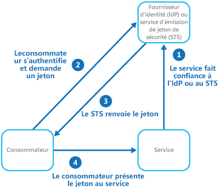
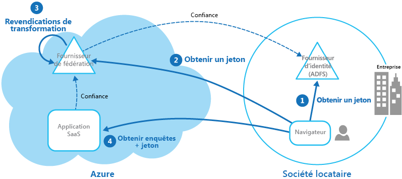

# Modèle d’identité fédéréeFederated Identity pattern

[!INCLUDE [header](../_includes/header.md)]

Déléguez l’authentification à un fournisseur d’identité externe.Delegate authentication to an external identity provider. Cette approche permet de simplifier le développement, de réduire au minimum la nécessité d’administrer les utilisateurs et d’améliorer l’expérience utilisateur de l’application.This can simplify development, minimize the requirement for user administration, and improve the user experience of the application.

## Contexte et problèmeContext and problem

En règle générale, les utilisateurs ont besoin de recourir à plusieurs applications fournies et hébergées par différentes organisations avec lesquelles ils ont une relation professionnelle.Users typically need to work with multiple applications provided and hosted by different organizations they have a business relationship with. Ces utilisateurs peuvent être amenés à utiliser des informations d’identification spécifiques (et différentes) pour chacune d’elles.These users might be required to use specific (and different) credentials for each one. Les conséquences peuvent être les suivantes :This can:

- **Dissociation de l’expérience utilisateur**.**Cause a disjointed user experience**. Les utilisateurs oublient souvent leurs informations d’identification de connexion si elles diffèrent d’une application à l’autre.Users often forget sign-in credentials when they have many different ones.

- **Exposition des failles de sécurité**.**Expose security vulnerabilities**. Quand un utilisateur quitte la société, le compte doit immédiatement être mis hors service.When a user leaves the company the account must immediately be deprovisioned. Il est facile d’oublier cela dans les grandes organisations.It's easy to overlook this in large organizations.

- **Complication de la gestion des utilisateurs**.**Complicate user management**. Les administrateurs doivent gérer les informations d’identification pour tous les utilisateurs et effectuer d’autres tâches telles que fournir des rappels de mot de passe.Administrators must manage credentials for all of the users, and perform additional tasks such as providing password reminders.

Les utilisateurs préfèrent généralement utiliser les mêmes informations d’identification pour toutes ces applications.Users typically prefer to use the same credentials for all these applications.

## SolutionSolution

Implémentez un mécanisme d’authentification pouvant utiliser l’identité fédérée.Implement an authentication mechanism that can use federated identity. Séparez l’authentification des utilisateurs du code d’application et déléguez l’authentification à un fournisseur d’identité approuvé.Separate user authentication from the application code, and delegate authentication to a trusted identity provider. Vous pouvez ainsi simplifier le développement et permettre aux utilisateurs de s’authentifier à l’aide d’un large éventail de fournisseurs d’identité (IdP) tout en réduisant les coûts d’administration.This can simplify development and allow users to authenticate using a wider range of identity providers (IdP) while minimizing the administrative overhead. En outre, vous pouvez séparer clairement l’authentification de l’autorisation.It also allows you to clearly decouple authentication from authorization.

Les fournisseurs d’identité approuvés incluent les annuaires d’entreprise, les services de fédération locaux et autres services de jeton de sécurité (STS) fournis par des partenaires commerciaux ou des fournisseurs d’identité sociaux qui peuvent authentifier les utilisateurs disposant d’un compte Microsoft, Google, Yahoo! ou Facebook, par exemple.The trusted identity providers include corporate directories, on-premises federation services, other security token services (STS) provided by business partners, or social identity providers that can authenticate users who have, for example, a Microsoft, Google, Yahoo!, or Facebook account.

La figure illustre le modèle d’identité fédérée quand une application cliente doit accéder à un service qui requiert une authentification.The figure illustrates the Federated Identity pattern when a client application needs to access a service that requires authentication. L’authentification est effectuée par un IdP qui fonctionne conjointement avec un STS.The authentication is performed by an IdP that works in concert with an STS. L’IdP émet des jetons de sécurité qui fournissent des informations sur l’utilisateur authentifié.The IdP issues security tokens that provide information about the authenticated user. Ces informations, appelées revendications, incluent l’identité de l’utilisateur et, éventuellement, d’autres informations telles que l’appartenance au rôle et des droits d’accès plus précis.This information, referred to as claims, includes the user’s identity, and might also include other information such as role membership and more granular access rights.

Ce modèle est souvent appelé contrôle d’accès basé sur les revendications.This model is often called claims-based access control. Les applications et services autorisent l’accès aux fonctions et fonctionnalités d’après les revendications contenues dans le jeton.Applications and services authorize access to features and functionality based on the claims contained in the token. Le service qui requiert une authentification doit approuver l’IdP.The service that requires authentication must trust the IdP. L’application cliente contacte l’IdP qui effectue l’authentification.The client application contacts the IdP that performs the authentication. Si l’authentification réussit, l’IdP retourne un jeton contenant les revendications qui identifient l’utilisateur au STS (notez que l’IdP et le STS peuvent être le même service).If the authentication is successful, the IdP returns a token containing the claims that identify the user to the STS (note that the IdP and STS can be the same service). Le STS peut transformer et augmenter les revendications dans le jeton en fonction de règles prédéfinies, avant de le retourner au client.The STS can transform and augment the claims in the token based on predefined rules, before returning it to the client. L’application cliente peut ensuite passer ce jeton au service en tant que preuve de son identité.The client application can then pass this token to the service as proof of its identity.

> La chaîne d’approbation peut comporter des STS supplémentaires.There might be additional STSs in the chain of trust. Par exemple, dans le scénario décrit plus loin, un STS local approuve un autre STS qui est responsable de l’accès à un fournisseur d’identité pour authentifier l’utilisateur.For example, in the scenario described later, an on-premises STS trusts another STS that is responsible for accessing an identity provider to authenticate the user. Cette approche est courante dans les scénarios d’entreprise où il existe un annuaire et un STS locaux.This approach is common in enterprise scenarios where there's an on-premises STS and directory.

L’authentification fédérée fournit une solution basée sur des normes au problème d’approbation d’identités entre différents domaines et peut prendre en charge l’authentification unique.Federated authentication provides a standards-based solution to the issue of trusting identities across diverse domains, and can support single sign-on. Elle se développe parmi tous les types d’applications, en particulier les applications hébergées dans le cloud, car elle prend en charge l’authentification unique sans nécessiter une connexion réseau directe aux fournisseurs d’identité.It's becoming more common across all types of applications, especially cloud-hosted applications, because it supports single sign-on without requiring a direct network connection to identity providers. L’utilisateur n’a pas besoin d’entrer d’informations d’identification pour chaque application.The user doesn't have to enter credentials for every application. Cela accroît la sécurité, en empêchant la création d’informations d’identification nécessaires pour accéder à de nombreuses applications différentes et masque les informations d’identification de l’utilisateur à la vue de tous, sauf du fournisseur d’identité d’origine.This increases security because it prevents the creation of credentials required to access many different applications, and it also hides the user’s credentials from all but the original identity provider. Les applications ne voient que les informations d’identité authentifiées contenues dans le jeton.Applications see just the authenticated identity information contained within the token.

En outre, l’identité fédérée a l’avantage majeur que la gestion de l’identité et des informations d’identification revient au fournisseur d’identité.Federated identity also has the major advantage that management of the identity and credentials is the responsibility of the identity provider. L’application ou le service n’a pas besoin de fournir de fonctionnalités de gestion d’identité.The application or service doesn't need to provide identity management features. En outre, dans les scénarios d’entreprise, l’annuaire d’entreprise n’a pas besoin de connaître l’utilisateur s’il approuve le fournisseur d’identité.In addition, in corporate scenarios, the corporate directory doesn't need to know about the user if it trusts the identity provider. Ainsi, l’annuaire se voit déchargé de toutes les tâches administratives liées à la gestion de l’identité de l’utilisateur.This removes all the administrative overhead of managing the user identity within the directory.

## Problèmes et considérationsIssues and considerations

Considérez les éléments suivants quand vous concevez des applications qui implémentent l’authentification fédérée :Consider the following when designing applications that implement federated authentication:

- L’authentification peut être un point de défaillance unique.Authentication can be a single point of failure. Si vous déployez votre application sur plusieurs centres de données, envisagez de déployer votre mécanisme de gestion des identités sur les mêmes centres de données pour assurer la disponibilité et la fiabilité des applications.If you deploy your application to multiple datacenters, consider deploying your identity management mechanism to the same datacenters to maintain application reliability and availability.

- Les outils d’authentification permettent de configurer le contrôle d’accès en fonction des revendications de rôle contenues dans le jeton d’authentification.Authentication tools make it possible to configure access control based on role claims contained in the authentication token. Cette approche est souvent appelée contrôle d’accès en fonction du rôle (RBAC) et peut permettre un niveau de contrôle plus précis de l’accès aux fonctionnalités et aux ressources.This is often referred to as role-based access control (RBAC), and it can allow a more granular level of control over access to features and resources.

- Contrairement à un annuaire d’entreprise, l’authentification basée sur les revendications à l’aide de fournisseurs d’identité sociaux ne fournit généralement pas d’informations sur l’utilisateur authentifié, à part une adresse e-mail et, éventuellement, un nom.Unlike a corporate directory, claims-based authentication using social identity providers doesn't usually provide information about the authenticated user other than an email address, and perhaps a name. Certains fournisseurs d’identité sociaux, tels qu’un compte Microsoft, ne fournissent qu’un identificateur unique.Some social identity providers, such as a Microsoft account, provide only a unique identifier. Généralement, l’application doit conserver certaines informations sur les utilisateurs inscrits et être capable de faire correspondre ces informations à l’identificateur contenu dans les revendications au sein du jeton.The application usually needs to maintain some information on registered users, and be able to match this information to the identifier contained in the claims in the token. En général, cette opération est effectuée par le biais de l’inscription quand l’utilisateur accède pour la première fois à l’application, puis les informations sont injectées dans le jeton en tant que revendications supplémentaires après chaque authentification.Typically this is done through registration when the user first accesses the application, and information is then injected into the token as additional claims after each authentication.

- Si plusieurs fournisseurs d’identité sont configurés pour le STS, il doit détecter le fournisseur d’identité vers lequel l’utilisateur doit être redirigé pour l’authentification.If there's more than one identity provider configured for the STS, it must detect which identity provider the user should be redirected to for authentication. Ce processus est appelé découverte de domaine d’accueil.This process is called home realm discovery. Le STS peut être en mesure d’effectuer cette opération automatiquement à partir d’une adresse e-mail ou d’un nom d’utilisateur fourni par l’utilisateur, d’un sous-domaine de l’application à laquelle accède l’utilisateur, de l’étendue des adresses IP de l’utilisateur ou du contenu d’un cookie stocké dans le navigateur de l’utilisateur.The STS might be able to do this automatically based on an email address or user name that the user provides, a subdomain of the application that the user is accessing, the user’s IP address scope, or on the contents of a cookie stored in the user’s browser. Par exemple, si l’utilisateur a entré une adresse e-mail dans le domaine Microsoft, comme user@live.com, le STS redirige l’utilisateur vers la page de connexion au compte Microsoft.For example, if the user entered an email address in the Microsoft domain, such as user@live.com, the STS will redirect the user to the Microsoft account sign-in page. À l’occasion des visites ultérieures, le STS peut utiliser un cookie pour indiquer que la dernière connexion s’est effectuée avec un compte Microsoft.On later visits, the STS could use a cookie to indicate that the last sign in was with a Microsoft account. Si la découverte automatique ne peut pas déterminer le domaine d’accueil, le STS affiche une page de découverte de domaine d’accueil qui répertorie les fournisseurs d’identité approuvés, et l’utilisateur doit sélectionner celui qu’il souhaite utiliser.If automatic discovery can't determine the home realm, the STS will display a home realm discovery page that lists the trusted identity providers, and the user must select the one they want to use.

## Quand utiliser ce modèleWhen to use this pattern

Ce modèle est utile pour les scénarios tels que les suivants :This pattern is useful for scenarios such as:

- **Authentification unique dans l’entreprise**.**Single sign-on in the enterprise**. Dans ce scénario, vous devez authentifier les employés pour les applications d’entreprise hébergées dans le cloud hors de la limite de sécurité de l’entreprise, sans qu’ils aient besoin de se connecter chaque fois qu’ils accèdent à une application.In this scenario you need to authenticate employees for corporate applications that are hosted in the cloud outside the corporate security boundary, without requiring them to sign in every time they visit an application. L’expérience utilisateur est la même que durant l’utilisation d’applications locales, configuration dans laquelle ils sont authentifiés quand ils se connectent à un réseau d’entreprise, puis ont accès à toutes les applications appropriées sans avoir à se reconnecter.The user experience is the same as when using on-premises applications where they're authenticated when signing in to a corporate network, and from then on have access to all relevant applications without needing to sign in again.

- **Identité fédérée avec plusieurs partenaires**.**Federated identity with multiple partners**. Dans ce scénario, vous devez authentifier les employés de l’entreprise et les partenaires commerciaux qui ne disposent pas de comptes dans l’annuaire d’entreprise.In this scenario you need to authenticate both corporate employees and business partners who don't have accounts in the corporate directory. Ce scénario est courant dans les applications B2B, les applications qui s’intègrent à des services tiers et dans les situations où des entreprises dotées de différents systèmes informatiques ont des ressources partagées ou fusionnées.This is common in business-to-business applications, applications that integrate with third-party services, and where companies with different IT systems have merged or shared resources.

- **Identité fédérée dans les applications SaaS**.**Federated identity in SaaS applications**. Dans ce scénario, les éditeurs de logiciels indépendants proposent des services prêts à l’emploi pour plusieurs clients ou locataires.In this scenario independent software vendors provide a ready-to-use service for multiple clients or tenants. Chaque locataire s’authentifie à l’aide d’un fournisseur d’identité approprié.Each tenant authenticates using a suitable identity provider. Par exemple, les utilisateurs professionnels utilisent leurs informations d’identification d’entreprise, tandis que les consommateurs et les clients du locataire utilisent leurs informations d’identification d’identité sociale.For example, business users will use their corporate credentials, while consumers and clients of the tenant will use their social identity credentials.

Ce modèle peut s’avérer inutile dans les situations suivantes :This pattern might not be useful in the following situations:

- Tous les utilisateurs de l’application peuvent être authentifiés par le même fournisseur d’identité.All users of the application can be authenticated by one identity provider, and there's no requirement to authenticate using any other identity provider. Cette situation est courante dans les applications métier qui ont recours à un annuaire d’entreprise (accessible dans l’application) pour l’authentification, en utilisant un VPN ou, dans un scénario hébergé sur le cloud, en utilisant une connexion de réseau virtuel entre l’annuaire local et l’application.This is typical in business applications that use a corporate directory (accessible within the application) for authentication, by using a VPN, or (in a cloud-hosted scenario) through a virtual network connection between the on-premises directory and the application.

- L’application a initialement été créée à l’aide d’un autre mécanisme d’authentification, peut-être avec des magasins d’utilisateurs personnalisés, ou n’a pas la capacité de gérer les standards de négociation utilisés par les technologies basées sur les revendications.The application was originally built using a different authentication mechanism, perhaps with custom user stores, or doesn't have the capability to handle the negotiation standards used by claims-based technologies. L’introduction de l’authentification basée sur les revendications et du contrôle d’accès dans des applications existantes peut être complexe et probablement non rentable.Retrofitting claims-based authentication and access control into existing applications can be complex, and probably not cost effective.

## ExempleExample

Une organisation héberge une application SaaS (Software as a Service) multi-locataire dans Microsoft Azure.An organization hosts a multi-tenant software as a service (SaaS) application in Microsoft Azure. L’application comprend un site web que les locataires peuvent utiliser pour gérer celle-ci pour leurs propres utilisateurs.The application includes a website that tenants can use to manage the application for their own users. L’application permet aux locataires d’accéder au site web à l’aide d’une identité fédérée qui est générée par Active Directory Federation Services (ADFS) quand un utilisateur est authentifié par l’annuaire Active Directory de cette organisation.The application allows tenants to access the website by using a federated identity that is generated by Active Directory Federation Services (ADFS) when a user is authenticated by that organization’s own Active Directory.

L’illustration montre comment les locataires s’authentifient auprès de leur propre fournisseur d’identité (étape 1), en l’occurrence ADFS.The figure shows how tenants authenticate with their own identity provider (step 1), in this case ADFS. Après avoir authentifié un locataire, ADFS émet un jeton.After successfully authenticating a tenant, ADFS issues a token. Le navigateur client transmet ce jeton au fournisseur de fédération de l’application SaaS, qui approuve les jetons émis par le service ADFS du locataire, afin de récupérer un jeton qui est valide pour le fournisseur de fédération SaaS (étape 2).The client browser forwards this token to the SaaS application’s federation provider, which trusts tokens issued by the tenant’s ADFS, in order to get back a token that is valid for the SaaS federation provider (step 2). Si nécessaire, le fournisseur de fédération SaaS transforme les revendications dans le jeton en revendications que l’application reconnaît (étape 3) avant de retourner le nouveau jeton au navigateur client.If necessary, the SaaS federation provider performs a transformation on the claims in the token into claims that the application recognizes (step 3) before returning the new token to the client browser. L’application approuve les jetons émis par le fournisseur de fédération SaaS et utilise les revendications dans le jeton pour appliquer des règles d’autorisation (étape 4).The application trusts tokens issued by the SaaS federation provider and uses the claims in the token to apply authorization rules (step 4).

Les locataires n’ont pas besoin de mémoriser des informations d’identification distinctes pour accéder à l’application, et un administrateur au sein de l’entreprise du locataire peut configurer dans son propre service ADFS la liste des utilisateurs qui peuvent accéder à l’application.Tenants won't need to remember separate credentials to access the application, and an administrator at the tenant’s company can configure in its own ADFS the list of users that can access the application.

## Aide connexeRelated guidance

- [Microsoft Azure Active DirectoryMicrosoft Azure Active Directory](https://azure.microsoft.com/services/active-directory/)
- [Services de domaine Active DirectoryActive Directory Domain Services](https://msdn.microsoft.com/library/bb897402.aspx)
- [Active Directory Federation ServicesActive Directory Federation Services](https://msdn.microsoft.com/library/bb897402.aspx)
- [Gestion des identités pour les applications multi-locataires dans Microsoft AzureIdentity management for multitenant applications in Microsoft Azure](https://azure.microsoft.com/documentation/articles/guidance-multitenant-identity/)
- [Applications multi-locataires dans AzureMultitenant Applications in Azure](https://azure.microsoft.com/documentation/articles/dotnet-develop-multitenant-applications/)
