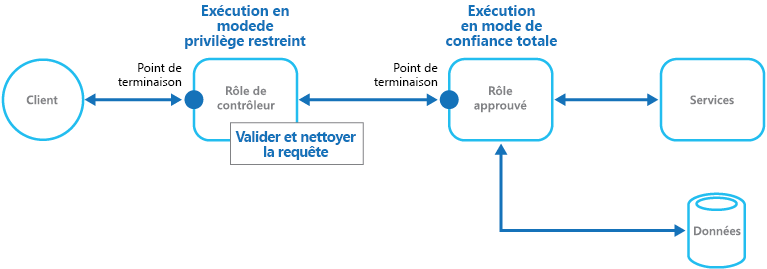

# Modèle d’opérateur de contrôle

[!INCLUDE [header](../_includes/header.md)]

Protégez les applications et services à l’aide d’une instance d’hôte dédiée qui agit comme un intermédiaire entre les clients et l’application ou le service, valide et assainit les requêtes, et transmet les requêtes et les données entre eux. Cela peut fournir une couche supplémentaire de sécurité et limiter la surface d’attaque du système.

## Contexte et problème

Les applications exposent leurs fonctionnalités aux clients en acceptant et en traitant des requêtes. Dans les scénarios d’hébergement cloud, les applications exposent des points de terminaison auxquels se connectent les clients et incluent généralement le code permettant de gérer les requêtes des clients. Ce code procède à l’authentification et à la validation, effectue une partie ou la totalité du traitement des requêtes et est susceptible d’accéder au stockage et à d’autres services à la place du client.

Si un utilisateur malveillant est en mesure de compromettre le système et d’accéder à l’environnement hébergeant l’application, les mécanismes de sécurité utilisés, tels que les informations d’identification et les clés de stockage, ainsi que les services et les données auxquels il accède, sont exposés. Par conséquent, l’utilisateur malveillant peut accéder sans restrictions à des informations sensibles et à d’autres services.

## Solution

Pour réduire le risque que des clients accèdent aux services et informations sensibles, découplez les hôtes ou les tâches qui exposent des points de terminaison publics du code qui traite les requêtes et accède au stockage. Pour ce faire, utilisez une façade ou une tâche dédiée qui interagit avec les clients, puis transmet la requête &mdash;éventuellement via une interface découplée&mdash; aux hôtes ou aux tâches qui traiteront la requête. La figure fournit une vue d’ensemble globale de ce modèle.

Le modèle d’opérateur de contrôle peut simplement servir à protéger le stockage, ou il peut être utilisé comme une façade plus complète pour protéger toutes les fonctions de l’application. Les facteurs importants sont les suivants :

- **Validation contrôlée**. L’opérateur de contrôle valide toutes les requêtes et rejette celles qui ne respectent pas les exigences de validation.
- **Risque et exposition limités**. L’opérateur de contrôle n’a pas accès aux informations d’identification ni aux clés utilisées par l’hôte approuvé pour accéder au stockage et aux services. Si l’opérateur de contrôle est compromis, l’attaquant n’a pas accès à ces informations d’identification ni aux clés.
- **Sécurité appropriée**. L’opérateur de contrôle s’exécute dans un mode à privilèges limités, tandis que le reste de l’application s’exécute en mode de sécurité totale, nécessaire pour accéder au stockage et aux services. Si l’opérateur de contrôle est compromis, il ne peut pas accéder directement aux données ni aux services de l’application.

Ce modèle agit comme un pare-feu dans une topographie réseau standard. Il permet à l’opérateur de contrôle d’examiner les requêtes et de prendre une décision sur la transmission de la requête à l’hôte approuvé (parfois appelé le keymaster) qui effectue les tâches requises. Cette décision exige généralement de l’opérateur de contrôle qu’il valide et assainisse le contenu de la requête avant de la transmettre à l’hôte approuvé.

## Problèmes et considérations

Prenez en compte les points suivants lorsque vous choisissez comment implémenter ce modèle :

- Assurez-vous que les hôtes approuvés auxquels l’opérateur de contrôle transfère les requêtes exposent uniquement des points de terminaison internes ou protégés et seulement connectés à l’opérateur de contrôle. Les hôtes approuvés ne doivent pas exposer des interfaces ou des points de terminaison externes.
- L’opérateur de contrôle doit s’exécuter dans un mode à privilèges limités. En général, cela implique d’exécuter l’opérateur de contrôle et l’hôte approuvé dans des services hébergés distincts ou sur des machines virtuelles différentes.
- L’opérateur de contrôle ne doit effectuer aucun traitement lié à l’application ou aux services, ni accéder aux données. Sa fonction consiste exclusivement à valider et à assainir les requêtes. Les hôtes approuvés peuvent avoir besoin d’effectuer une validation supplémentaire de requêtes, mais la validation de base doit être effectuée par l’opérateur de contrôle.
- Utilisez un canal de communication sécurisé (HTTPS, SSL ou TLS) entre l’opérateur de contrôle et les hôtes approuvés ou les tâches si possible. Toutefois, certains environnements d’hébergement ne prennent pas en charge HTTPS sur les points de terminaison internes.
- L’ajout de la couche supplémentaire à l’application pour implémenter le modèle d’opérateur de contrôle est susceptible d’influer sur les performances en raison du traitement supplémentaire et de la communication réseau nécessaires.
- L’instance d’opérateur de contrôle peut être un point de défaillance unique. Pour réduire l’impact d’une défaillance, envisagez de déployer des instances supplémentaires et d’utiliser un mécanisme de mise à l’échelle automatique pour garantir la capacité nécessaire au maintient de la disponibilité.

## Quand utiliser ce modèle

Ce modèle est utile dans les situations suivantes :

- Applications qui gèrent des informations sensibles, exposent des services qui doivent présentent un degré élevé de protection contre les attaques malveillantes, ou effectuent des opérations critiques qui ne doivent pas être interrompues.
- Applications distribuées où il est nécessaire pour effectuer la validation des requêtes séparément des tâches principales ou de centraliser cette validation pour simplifier la maintenance et l’administration.

## Exemples

Dans un scénario d’hébergement cloud, ce modèle peut être implémenté en découplant le rôle d’opérateur de contrôle ou de machine virtuelle des rôles approuvés et des services dans une application. Pour ce faire, utilisez un point de terminaison interne, une file d’attente ou un stockage comme mécanisme de communication intermédiaire. La figure illustre l’utilisation d’un point de terminaison interne.

## Modèles associés

Le [modèle de clé Valet](./valet-key.md) peut également être intéressant lorsque vous implémentez le modèle d’opérateur de contrôle. Lors de la communication entre l’opérateur de contrôle et les rôles approuvés, il est conseillé de renforcer la sécurité à l’aide de clés ou de jetons qui limitent les autorisations pour accéder aux ressources. Décrit l’utilisation d’un jeton ou d’une clé qui fournit aux clients un accès direct limité à une ressource ou un service spécifique.
