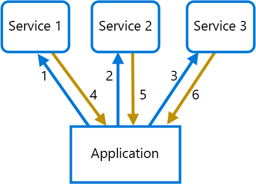

# <a name="gateway-aggregation-pattern"></a>Modèle d’agrégation de passerelle

Utilisez une passerelle pour agréger plusieurs requêtes individuelles dans une requête unique. Ce modèle est utile lorsqu’un client doit effectuer plusieurs appels à différents systèmes principaux pour exécuter une opération.

## <a name="context-and-problem"></a>Contexte et problème

Pour exécuter une tâche unique, un client peut avoir besoin d’effectuer plusieurs appels à différents services principaux. Une application qui a besoin de nombreux services pour effectuer une tâche doit étendre ses ressources pour chaque requête. Lorsqu’une fonctionnalité ou un service est ajouté(e) à l’application, des requêtes supplémentaires sont nécessaires, ce qui augmente le nombre de ressources et d’appels réseau requis. Les échanges excessifs entre un client et un serveur principal peuvent nuire aux performances et à l’évolutivité de l’application.  Avec les architectures de microservice, ce problème est devenu encore plus courant, car les applications reposant sur de nombreux services de plus petite taille génèrent naturellement un nombre plus élevé d’appels entre les services. 

Dans le diagramme suivant, le client envoie des requêtes à chaque service (1,2,3). Chaque service traite la requête et renvoie la réponse à l’application (4,5,6). Sur un réseau cellulaire avec une latence généralement élevée, le fait d’utiliser des requêtes individuelles de cette manière est inefficace et peut entraîner une rupture de la connectivité ou des requêtes incomplètes. Alors que chaque requête peut être effectuée en parallèle, l’application doit envoyer, attendre et traiter les données pour chaque requête sur des connexions distinctes, ce qui augmente les risques de défaillance.

 

## <a name="solution"></a>Solution

Utilisez une passerelle pour réduire les échanges excessifs entre le client et les services. La passerelle reçoit les requêtes des clients, les répartit entre les différents systèmes principaux, puis agrège les résultats et les renvoie au client qui a émis la requête.

Ce modèle peut réduire le nombre de requêtes que l’application envoie aux services principaux et améliorer les performances des applications sur des réseaux à latence élevée.

Dans le diagramme suivant, l’application envoie une requête à la passerelle (1). La requête contient un ensemble de requêtes supplémentaires. La passerelle décompose ces requêtes et traite chacune d’entre elles en l’envoyant au service approprié (2). Chaque service renvoie une réponse à la passerelle (3). La passerelle combine les réponses de chaque service et envoie la réponse finale à l’application (4). L’application envoie une seule requête et reçoit une seule réponse de la passerelle.


## <a name="issues-and-considerations"></a>Problèmes et considérations

- La passerelle ne doit pas générer de couplage entre les différents services principaux.
- La passerelle doit se trouver à proximité des services principaux pour réduire la latence autant que possible.
- Le service de passerelle peut introduire un point de défaillance unique. Vérifiez que la passerelle est conçue de manière à répondre aux besoins de disponibilité de votre application.
- La passerelle peut introduire un goulot d’étranglement. Vérifiez que la passerelle offre les performances adéquates pour gérer la charge de trafic et qu’elle peut être mise à l’échelle pour répondre à la croissance que vous avez anticipée.
- Effectuez un test de charge sur la passerelle pour vous assurer de ne pas introduire d’échecs en cascade dans les services.
- Implémentez une conception résiliente en utilisant des techniques telles que [les cloisons][bulkhead], [la rupture de circuit][circuit-breaker], [les nouvelles tentatives][retry]et les délais d’expiration.
- Si un ou plusieurs appels de service sont trop longs, il est possible d’appliquer un délai d’expiration et de retourner un ensemble partiel de données. Réfléchissez à la manière dont votre application va gérer ce scénario.
- Utilisez des E/S asynchrones pour vous assurer qu’un retard au niveau du serveur principal ne nuira pas aux performances de l’application.
- Appliquez un traçage distribué à l’aide des ID de corrélation pour tracer chaque appel.
- Contrôlez les métriques des requêtes et les tailles des réponses.
- Envisagez d’appliquer une stratégie de basculement consistant à renvoyer les données en cache afin de gérer les échecs.
- Au lieu de générer une agrégation au sein de la passerelle, envisagez de déployer un service d’agrégation derrière la passerelle. L’agrégation des requêtes entraînera probablement des besoins en ressources différents des autres services dans la passerelle, ce qui peut avoir un impact sur les fonctionnalités de routage et de déchargement de la passerelle.

## <a name="when-to-use-this-pattern"></a>Quand utiliser ce modèle

Utilisez ce modèle dans les situations suivantes :

- Un client doit communiquer avec plusieurs services principaux pour effectuer une opération.
- Le client peut utiliser des réseaux avec une latence importante, tels que les réseaux cellulaires.

Ce modèle peut ne pas convenir dans les cas suivants :

- Vous souhaitez réduire le nombre d’appels entre un client et un service unique dans le cadre de plusieurs opérations. Dans ce scénario, il peut être préférable d’ajouter une opération par lot au niveau du service.
- Le client ou l’application se trouve à proximité des services principaux et la latence n’est pas un facteur important.

## <a name="example"></a>Exemple

L’exemple suivant montre comment créer un service d’agrégation de passerelle NGINX simple à l’aide de Lua.

```lua
worker_processes  4;

events {
  worker_connections 1024;
}

http {
  server {
    listen 80;

    location = /batch {
      content_by_lua '
        ngx.req.read_body()

        -- read json body content
        local cjson = require "cjson"
        local batch = cjson.decode(ngx.req.get_body_data())["batch"]

        -- create capture_multi table
        local requests = {}
        for i, item in ipairs(batch) do
          table.insert(requests, {item.relative_url, { method = ngx.HTTP_GET}})
        end

        -- execute batch requests in parallel
        local results = {}
        local resps = { ngx.location.capture_multi(requests) }
        for i, res in ipairs(resps) do
          table.insert(results, {status = res.status, body = cjson.decode(res.body), header = res.header})
        end

        ngx.say(cjson.encode({results = results}))
      ';
    }

    location = /service1 {
      default_type application/json;
      echo '{"attr1":"val1"}';
    }

    location = /service2 {
      default_type application/json;
      echo '{"attr2":"val2"}';
    }
  }
}
```

## <a name="related-guidance"></a>Aide connexe

- [Backends for Frontends pattern](./backends-for-frontends.md) (Modèle de services principaux destinés aux frontaux)
- [Modèle de déchargement de passerelle](./gateway-offloading.md)
- [Gateway Routing pattern](./gateway-routing.md) (Modèle de routage de passerelle)

[bulkhead]: ./bulkhead.md
[circuit-breaker]: ./circuit-breaker.md
[retry]: ./retry.md