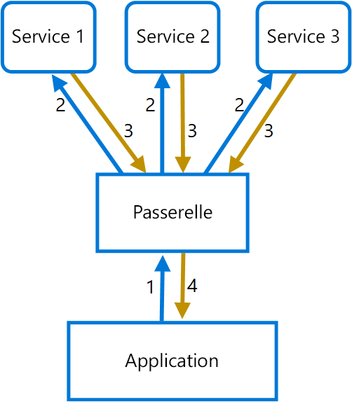

# <a name="gateway-aggregation-pattern"></a><span data-ttu-id="f5237-104">Modèle d’agrégation de passerelle</span><span class="sxs-lookup"><span data-stu-id="f5237-104">Gateway Aggregation pattern</span></span>

<span data-ttu-id="f5237-105">Utilisez une passerelle pour agréger plusieurs requêtes individuelles dans une requête unique.</span><span class="sxs-lookup"><span data-stu-id="f5237-105">Use a gateway to aggregate multiple individual requests into a single request.</span></span> <span data-ttu-id="f5237-106">Ce modèle est utile lorsqu’un client doit effectuer plusieurs appels à différents systèmes principaux pour exécuter une opération.</span><span class="sxs-lookup"><span data-stu-id="f5237-106">This pattern is useful when a client must make multiple calls to different backend systems to perform an operation.</span></span>

## <a name="context-and-problem"></a><span data-ttu-id="f5237-107">Contexte et problème</span><span class="sxs-lookup"><span data-stu-id="f5237-107">Context and problem</span></span>

<span data-ttu-id="f5237-108">Pour exécuter une tâche unique, un client peut avoir besoin d’effectuer plusieurs appels à différents services principaux.</span><span class="sxs-lookup"><span data-stu-id="f5237-108">To perform a single task, a client may have to make multiple calls to various backend services.</span></span> <span data-ttu-id="f5237-109">Une application qui a besoin de nombreux services pour effectuer une tâche doit étendre ses ressources pour chaque requête.</span><span class="sxs-lookup"><span data-stu-id="f5237-109">An application that relies on many services to perform a task must expend resources on each request.</span></span> <span data-ttu-id="f5237-110">Lorsqu’une fonctionnalité ou un service est ajouté(e) à l’application, des requêtes supplémentaires sont nécessaires, ce qui augmente le nombre de ressources et d’appels réseau requis.</span><span class="sxs-lookup"><span data-stu-id="f5237-110">When any new feature or service is added to the application, additional requests are needed, further increasing resource requirements and network calls.</span></span> <span data-ttu-id="f5237-111">Les échanges excessifs entre un client et un serveur principal peuvent nuire aux performances et à l’évolutivité de l’application.</span><span class="sxs-lookup"><span data-stu-id="f5237-111">This chattiness between a client and a backend can adversely impact the performance and scale of the application.</span></span>  <span data-ttu-id="f5237-112">Avec les architectures de microservice, ce problème est devenu encore plus courant, car les applications reposant sur de nombreux services de plus petite taille génèrent naturellement un nombre plus élevé d’appels entre les services.</span><span class="sxs-lookup"><span data-stu-id="f5237-112">Microservice architectures have made this problem more common, as applications built around many smaller services naturally have a higher amount of cross-service calls.</span></span>

<span data-ttu-id="f5237-113">Dans le diagramme suivant, le client envoie des requêtes à chaque service (1,2,3).</span><span class="sxs-lookup"><span data-stu-id="f5237-113">In the following diagram, the client sends requests to each service (1,2,3).</span></span> <span data-ttu-id="f5237-114">Chaque service traite la requête et renvoie la réponse à l’application (4,5,6).</span><span class="sxs-lookup"><span data-stu-id="f5237-114">Each service processes the request and sends the response back to the application (4,5,6).</span></span> <span data-ttu-id="f5237-115">Sur un réseau cellulaire avec une latence généralement élevée, le fait d’utiliser des requêtes individuelles de cette manière est inefficace et peut entraîner une rupture de la connectivité ou des requêtes incomplètes.</span><span class="sxs-lookup"><span data-stu-id="f5237-115">Over a cellular network with typically high latency, using individual requests in this manner is inefficient and could result in broken connectivity or incomplete requests.</span></span> <span data-ttu-id="f5237-116">Alors que chaque requête peut être effectuée en parallèle, l’application doit envoyer, attendre et traiter les données pour chaque requête sur des connexions distinctes, ce qui augmente les risques de défaillance.</span><span class="sxs-lookup"><span data-stu-id="f5237-116">While each request may be done in parallel, the application must send, wait, and process data for each request, all on separate connections, increasing the chance of failure.</span></span>


## <a name="solution"></a><span data-ttu-id="f5237-118">Solution</span><span class="sxs-lookup"><span data-stu-id="f5237-118">Solution</span></span>

<span data-ttu-id="f5237-119">Utilisez une passerelle pour réduire les échanges excessifs entre le client et les services.</span><span class="sxs-lookup"><span data-stu-id="f5237-119">Use a gateway to reduce chattiness between the client and the services.</span></span> <span data-ttu-id="f5237-120">La passerelle reçoit les requêtes des clients, les répartit entre les différents systèmes principaux, puis agrège les résultats et les renvoie au client qui a émis la requête.</span><span class="sxs-lookup"><span data-stu-id="f5237-120">The gateway receives client requests, dispatches requests to the various backend systems, and then aggregates the results and sends them back to the requesting client.</span></span>

<span data-ttu-id="f5237-121">Ce modèle peut réduire le nombre de requêtes que l’application envoie aux services principaux et améliorer les performances des applications sur des réseaux à latence élevée.</span><span class="sxs-lookup"><span data-stu-id="f5237-121">This pattern can reduce the number of requests that the application makes to backend services, and improve application performance over high-latency networks.</span></span>

<span data-ttu-id="f5237-122">Dans le diagramme suivant, l’application envoie une requête à la passerelle (1).</span><span class="sxs-lookup"><span data-stu-id="f5237-122">In the following diagram, the application sends a request to the gateway (1).</span></span> <span data-ttu-id="f5237-123">La requête contient un ensemble de requêtes supplémentaires.</span><span class="sxs-lookup"><span data-stu-id="f5237-123">The request contains a package of additional requests.</span></span> <span data-ttu-id="f5237-124">La passerelle décompose ces requêtes et traite chacune d’entre elles en l’envoyant au service approprié (2).</span><span class="sxs-lookup"><span data-stu-id="f5237-124">The gateway decomposes these and processes each request by sending it to the relevant service (2).</span></span> <span data-ttu-id="f5237-125">Chaque service renvoie une réponse à la passerelle (3).</span><span class="sxs-lookup"><span data-stu-id="f5237-125">Each service returns a response to the gateway (3).</span></span> <span data-ttu-id="f5237-126">La passerelle combine les réponses de chaque service et envoie la réponse finale à l’application (4).</span><span class="sxs-lookup"><span data-stu-id="f5237-126">The gateway combines the responses from each service and sends the response to the application (4).</span></span> <span data-ttu-id="f5237-127">L’application envoie une seule requête et reçoit une seule réponse de la passerelle.</span><span class="sxs-lookup"><span data-stu-id="f5237-127">The application makes a single request and receives only a single response from the gateway.</span></span>



## <a name="issues-and-considerations"></a><span data-ttu-id="f5237-129">Problèmes et considérations</span><span class="sxs-lookup"><span data-stu-id="f5237-129">Issues and considerations</span></span>

- <span data-ttu-id="f5237-130">La passerelle ne doit pas générer de couplage entre les différents services principaux.</span><span class="sxs-lookup"><span data-stu-id="f5237-130">The gateway should not introduce service coupling across the backend services.</span></span>
- <span data-ttu-id="f5237-131">La passerelle doit se trouver à proximité des services principaux pour réduire la latence autant que possible.</span><span class="sxs-lookup"><span data-stu-id="f5237-131">The gateway should be located near the backend services to reduce latency as much as possible.</span></span>
- <span data-ttu-id="f5237-132">Le service de passerelle peut introduire un point de défaillance unique.</span><span class="sxs-lookup"><span data-stu-id="f5237-132">The gateway service may introduce a single point of failure.</span></span> <span data-ttu-id="f5237-133">Vérifiez que la passerelle est conçue de manière à répondre aux besoins de disponibilité de votre application.</span><span class="sxs-lookup"><span data-stu-id="f5237-133">Ensure the gateway is properly designed to meet your application's availability requirements.</span></span>
- <span data-ttu-id="f5237-134">La passerelle peut introduire un goulot d’étranglement.</span><span class="sxs-lookup"><span data-stu-id="f5237-134">The gateway may introduce a bottleneck.</span></span> <span data-ttu-id="f5237-135">Vérifiez que la passerelle offre les performances adéquates pour gérer la charge de trafic et qu’elle peut être mise à l’échelle pour répondre à la croissance que vous avez anticipée.</span><span class="sxs-lookup"><span data-stu-id="f5237-135">Ensure the gateway has adequate performance to handle load and can be scaled to meet your anticipated growth.</span></span>
- <span data-ttu-id="f5237-136">Effectuez un test de charge sur la passerelle pour vous assurer de ne pas introduire d’échecs en cascade dans les services.</span><span class="sxs-lookup"><span data-stu-id="f5237-136">Perform load testing against the gateway to ensure you don't introduce cascading failures for services.</span></span>
- <span data-ttu-id="f5237-137">Implémentez une conception résiliente en utilisant des techniques telles que [les cloisons][bulkhead], [la rupture de circuit][circuit-breaker], [les nouvelles tentatives][retry]et les délais d’expiration.</span><span class="sxs-lookup"><span data-stu-id="f5237-137">Implement a resilient design, using techniques such as [bulkheads][bulkhead], [circuit breaking][circuit-breaker], [retry][retry], and timeouts.</span></span>
- <span data-ttu-id="f5237-138">Si un ou plusieurs appels de service sont trop longs, il est possible d’appliquer un délai d’expiration et de retourner un ensemble partiel de données.</span><span class="sxs-lookup"><span data-stu-id="f5237-138">If one or more service calls takes too long, it may be acceptable to timeout and return a partial set of data.</span></span> <span data-ttu-id="f5237-139">Réfléchissez à la manière dont votre application va gérer ce scénario.</span><span class="sxs-lookup"><span data-stu-id="f5237-139">Consider how your application will handle this scenario.</span></span>
- <span data-ttu-id="f5237-140">Utilisez des E/S asynchrones pour vous assurer qu’un retard au niveau du serveur principal ne nuira pas aux performances de l’application.</span><span class="sxs-lookup"><span data-stu-id="f5237-140">Use asynchronous I/O to ensure that a delay at the backend doesn't cause performance issues in the application.</span></span>
- <span data-ttu-id="f5237-141">Appliquez un traçage distribué à l’aide des ID de corrélation pour tracer chaque appel.</span><span class="sxs-lookup"><span data-stu-id="f5237-141">Implement distributed tracing using correlation IDs to track each individual call.</span></span>
- <span data-ttu-id="f5237-142">Contrôlez les métriques des requêtes et les tailles des réponses.</span><span class="sxs-lookup"><span data-stu-id="f5237-142">Monitor request metrics and response sizes.</span></span>
- <span data-ttu-id="f5237-143">Envisagez d’appliquer une stratégie de basculement consistant à renvoyer les données en cache afin de gérer les échecs.</span><span class="sxs-lookup"><span data-stu-id="f5237-143">Consider returning cached data as a failover strategy to handle failures.</span></span>
- <span data-ttu-id="f5237-144">Au lieu de générer une agrégation au sein de la passerelle, envisagez de déployer un service d’agrégation derrière la passerelle.</span><span class="sxs-lookup"><span data-stu-id="f5237-144">Instead of building aggregation into the gateway, consider placing an aggregation service behind the gateway.</span></span> <span data-ttu-id="f5237-145">L’agrégation des requêtes entraînera probablement des besoins en ressources différents des autres services dans la passerelle, ce qui peut avoir un impact sur les fonctionnalités de routage et de déchargement de la passerelle.</span><span class="sxs-lookup"><span data-stu-id="f5237-145">Request aggregation will likely have different resource requirements than other services in the gateway and may impact the gateway's routing and offloading functionality.</span></span>

## <a name="when-to-use-this-pattern"></a><span data-ttu-id="f5237-146">Quand utiliser ce modèle</span><span class="sxs-lookup"><span data-stu-id="f5237-146">When to use this pattern</span></span>

<span data-ttu-id="f5237-147">Utilisez ce modèle dans les situations suivantes :</span><span class="sxs-lookup"><span data-stu-id="f5237-147">Use this pattern when:</span></span>

- <span data-ttu-id="f5237-148">Un client doit communiquer avec plusieurs services principaux pour effectuer une opération.</span><span class="sxs-lookup"><span data-stu-id="f5237-148">A client needs to communicate with multiple backend services to perform an operation.</span></span>
- <span data-ttu-id="f5237-149">Le client peut utiliser des réseaux avec une latence importante, tels que les réseaux cellulaires.</span><span class="sxs-lookup"><span data-stu-id="f5237-149">The client may use networks with significant latency, such as cellular networks.</span></span>

<span data-ttu-id="f5237-150">Ce modèle peut ne pas convenir dans les cas suivants :</span><span class="sxs-lookup"><span data-stu-id="f5237-150">This pattern may not be suitable when:</span></span>

- <span data-ttu-id="f5237-151">Vous souhaitez réduire le nombre d’appels entre un client et un service unique dans le cadre de plusieurs opérations.</span><span class="sxs-lookup"><span data-stu-id="f5237-151">You want to reduce the number of calls between a client and a single service across multiple operations.</span></span> <span data-ttu-id="f5237-152">Dans ce scénario, il peut être préférable d’ajouter une opération par lot au niveau du service.</span><span class="sxs-lookup"><span data-stu-id="f5237-152">In that scenario, it may be better to add a batch operation to the service.</span></span>
- <span data-ttu-id="f5237-153">Le client ou l’application se trouve à proximité des services principaux et la latence n’est pas un facteur important.</span><span class="sxs-lookup"><span data-stu-id="f5237-153">The client or application is located near the backend services and latency is not a significant factor.</span></span>

## <a name="example"></a><span data-ttu-id="f5237-154">Exemples</span><span class="sxs-lookup"><span data-stu-id="f5237-154">Example</span></span>

<span data-ttu-id="f5237-155">L’exemple suivant montre comment créer un service d’agrégation de passerelle NGINX simple à l’aide de Lua.</span><span class="sxs-lookup"><span data-stu-id="f5237-155">The following example illustrates how to create a simple a gateway aggregation NGINX service using Lua.</span></span>

```lua
worker_processes  4;

events {
  worker_connections 1024;
}

http {
  server {
    listen 80;

    location = /batch {
      content_by_lua '
        ngx.req.read_body()

        -- read json body content
        local cjson = require "cjson"
        local batch = cjson.decode(ngx.req.get_body_data())["batch"]

        -- create capture_multi table
        local requests = {}
        for i, item in ipairs(batch) do
          table.insert(requests, {item.relative_url, { method = ngx.HTTP_GET}})
        end

        -- execute batch requests in parallel
        local results = {}
        local resps = { ngx.location.capture_multi(requests) }
        for i, res in ipairs(resps) do
          table.insert(results, {status = res.status, body = cjson.decode(res.body), header = res.header})
        end

        ngx.say(cjson.encode({results = results}))
      ';
    }

    location = /service1 {
      default_type application/json;
      echo '{"attr1":"val1"}';
    }

    location = /service2 {
      default_type application/json;
      echo '{"attr2":"val2"}';
    }
  }
}
```

## <a name="related-guidance"></a><span data-ttu-id="f5237-156">Aide connexe</span><span class="sxs-lookup"><span data-stu-id="f5237-156">Related guidance</span></span>

- <span data-ttu-id="f5237-157">[Backends for Frontends pattern](./backends-for-frontends.md) (Modèle de services principaux destinés aux frontaux)</span><span class="sxs-lookup"><span data-stu-id="f5237-157">[Backends for Frontends pattern](./backends-for-frontends.md)</span></span>
- [<span data-ttu-id="f5237-158">Modèle de déchargement de passerelle</span><span class="sxs-lookup"><span data-stu-id="f5237-158">Gateway Offloading pattern</span></span>](./gateway-offloading.md)
- <span data-ttu-id="f5237-159">[Gateway Routing pattern](./gateway-routing.md) (Modèle de routage de passerelle)</span><span class="sxs-lookup"><span data-stu-id="f5237-159">[Gateway Routing pattern](./gateway-routing.md)</span></span>

[bulkhead]: ./bulkhead.md
[circuit-breaker]: ./circuit-breaker.md
[retry]: ./retry.md