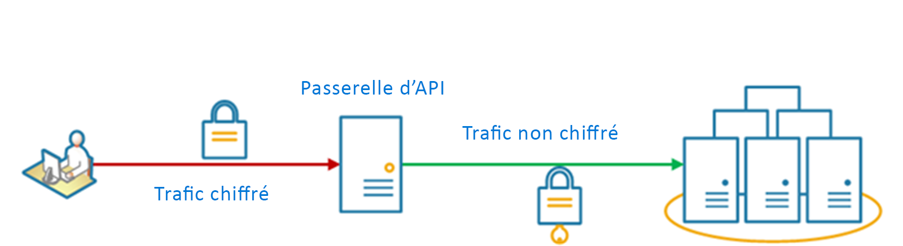

# <a name="gateway-offloading-pattern"></a>Modèle de déchargement de passerelle

Déchargez des fonctionnalités de service partagé ou spécialisé sur un proxy de passerelle. Ce modèle peut simplifier le développement d’applications en déplaçant les fonctionnalités de service partagé, comme l’utilisation des certificats SSL, d’autres parties de l’application vers la passerelle.

## <a name="context-and-problem"></a>Contexte et problème

Certaines fonctionnalités sont couramment utilisées dans plusieurs services et elles doivent être configurées, gérées et maintenues. Un service partagé ou spécialisé qui est distribué avec chaque déploiement d’application augmente la surcharge administrative et accroît la probabilité qu’une erreur de déploiement se produise. Les mises à jour d’une fonctionnalité partagée doivent être déployées sur tous les services qui partagent cette fonctionnalité.

Gérer correctement des problèmes de sécurité (validation de jeton, chiffrement, gestion de certificats SSL) et d’autres tâches complexes peut exiger que les membres de l’équipe soient extrêmement spécialisés. Par exemple, un certificat requis par une application doit être configuré et déployé sur toutes les instances de l’application. Avec chaque nouveau déploiement, le certificat doit être géré pour garantir qu’il n’expire pas. Les certificats courants sur le point d’expirer doivent être mis à jour, testés et vérifiés sur chaque déploiement d’application.

D’autres services courants comme l’authentification, l’autorisation, la journalisation, la surveillance ou la [limitation](./throttling.md) peuvent être difficiles à implémenter et à gérer dans un grand nombre de déploiements. Il peut être préférable de consolider ce type de fonctionnalité, afin de réduire la surcharge et les risques d’erreurs.

## <a name="solution"></a>Solution

Déchargez certaines fonctionnalités sur une passerelle d’API, particulièrement les questions transversales comme la gestion des certificats, l’authentification, la terminaison SSL, la surveillance, la traduction de protocole ou la limitation.

Le schéma suivant montre une passerelle d’API qui termine les connexions SSL entrantes. Il demande des données pour le compte du demandeur d’origine à partir d’un serveur HTTP en amont de la passerelle d’API.

 

Ce modèle présente les avantages suivants :

- Simplifiez le développement de services en supprimant le besoin de distribution et de maintien des ressources de prise en charge, comme les certificats de serveur web et la configuration des sites web sécurisés. Une configuration plus simple permet une gestion et une extensibilité plus aisées, à l’instar des mises à niveau des services.

- Offrez aux équipes dédiées la possibilité d’implémenter des fonctionnalités qui nécessitent une expertise particulière telle que la sécurité. Cela permet à votre équipe métier de se concentrer sur les fonctionnalités de l’application et de laisser les experts traiter les problèmes propres à leur domaine.

- Offrez une certaine cohérence pour la surveillance et la journalisation des requêtes et des réponses. Même si un service n’est pas correctement instrumenté, la passerelle peut être configurée pour assurer un niveau minimal de surveillance et de journalisation.

## <a name="issues-and-considerations"></a>Problèmes et considérations

- Vérifiez que la passerelle d’API est hautement disponible et résistante à l’échec. Évitez les points de défaillance uniques en exécutant plusieurs instances de votre passerelle d’API.
- Assurez-vous que la passerelle est conçue pour répondre aux besoins en termes de capacité et de mise à l’échelle de votre application et de vos points de terminaison. Vérifiez que la passerelle ne se transforme pas en goulot d’étranglement pour l’application et qu’elle est suffisamment évolutive.
- Déchargez uniquement les fonctionnalités qui sont utilisées par l’intégralité de l’application, telles que la sécurité ou le transfert de données.
- La logique métier ne doit jamais être déchargée vers la passerelle d’API.
- Si vous avez besoin de suivre des transactions, envisagez de générer des ID de corrélation à des fins de journalisation.

## <a name="when-to-use-this-pattern"></a>Quand utiliser ce modèle

Utilisez ce modèle dans les situations suivantes :

- Un déploiement d’application qui a un problème partagé comme les certificats SSL ou le chiffrement.
- Une fonctionnalité commune à plusieurs déploiements d’application qui peuvent avoir différents besoins en matière de ressources, comme des ressources de mémoire, une capacité de stockage ou des connexions réseau.
- Vous souhaitez confier la responsabilité des problèmes comme la sécurité réseau, la limitation ou d’autres soucis de limites réseau à une équipe plus spécialisée.

Ce modèle peut ne pas convenir s’il introduit le couplage entre les services.

## <a name="example"></a>Exemples

Avec Nginx en tant qu’appliance de déchargement SSL, la configuration suivante termine une connexion SSL entrante et la distribue à l’un des trois serveurs HTTP en amont.

```console
upstream iis {
        server  10.3.0.10    max_fails=3    fail_timeout=15s;
        server  10.3.0.20    max_fails=3    fail_timeout=15s;
        server  10.3.0.30    max_fails=3    fail_timeout=15s;
}

server {
        listen 443;
        ssl on;
        ssl_certificate /etc/nginx/ssl/domain.cer;
        ssl_certificate_key /etc/nginx/ssl/domain.key;

        location / {
                set $targ iis;
                proxy_pass http://$targ;
                proxy_set_header X-Forwarded-For $proxy_add_x_forwarded_for;
                proxy_set_header X-Forwarded-Proto https;
proxy_set_header X-Real-IP $remote_addr;
                proxy_set_header Host $host;
        }
}
```

Sur Azure, vous pouvez le faire en [configurant un arrêt de SSL sur Application Gateway](/azure/application-gateway/tutorial-ssl-cli).

## <a name="related-guidance"></a>Aide connexe

- [Backends for Frontends pattern](./backends-for-frontends.md) (Modèle de services principaux destinés aux frontaux)
- [Gateway Aggregation pattern](./gateway-aggregation.md) (Modèle d’agrégation de passerelle)
- [Modèle de routage de passerelle](./gateway-routing.md)
