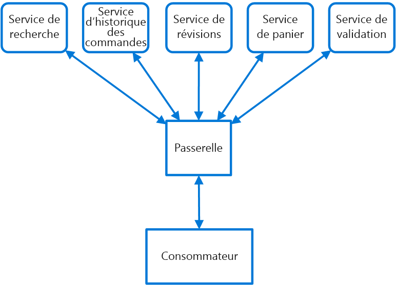

# <a name="gateway-routing-pattern"></a><span data-ttu-id="60932-103">Modèle de routage de passerelle</span><span class="sxs-lookup"><span data-stu-id="60932-103">Gateway Routing pattern</span></span>

<span data-ttu-id="60932-104">Acheminez les requêtes vers plusieurs services à l’aide d’un seul point de terminaison.</span><span class="sxs-lookup"><span data-stu-id="60932-104">Route requests to multiple services using a single endpoint.</span></span> <span data-ttu-id="60932-105">Ce modèle est utile lorsque vous souhaitez exposer plusieurs services sur un seul point de terminaison et quand vous voulez créer un routage vers le service approprié basé sur la requête.</span><span class="sxs-lookup"><span data-stu-id="60932-105">This pattern is useful when you wish to expose multiple services on a single endpoint and route to the appropriate service based on the request.</span></span>

## <a name="context-and-problem"></a><span data-ttu-id="60932-106">Contexte et problème</span><span class="sxs-lookup"><span data-stu-id="60932-106">Context and problem</span></span>

<span data-ttu-id="60932-107">Lorsqu’un client a besoin d’utiliser plusieurs services, configurer un point de terminaison distinct pour chaque service et gérer chacun de ces points de terminaison peut s’avérer complexe.</span><span class="sxs-lookup"><span data-stu-id="60932-107">When a client needs to consume multiple services, setting up a separate endpoint for each service and having the client manage each endpoint can be challenging.</span></span> <span data-ttu-id="60932-108">Par exemple, une application de e-commerce peut fournir des services comme faire des recherches, laisser des avis, remplir son panier, effectuer des paiements et consulter l’historique des commandes.</span><span class="sxs-lookup"><span data-stu-id="60932-108">For example, an e-commerce application might provide services such as search, reviews, cart, checkout, and order history.</span></span> <span data-ttu-id="60932-109">Chaque service possède une API différente avec laquelle le client doit interagir, et le client doit avoir des informations sur tous les points de terminaison pour pouvoir se connecter aux services.</span><span class="sxs-lookup"><span data-stu-id="60932-109">Each service has a different API that the client must interact with, and the client must know about each endpoint in order to connect to the services.</span></span> <span data-ttu-id="60932-110">En cas de modification d’une API, le client doit également être mis à jour.</span><span class="sxs-lookup"><span data-stu-id="60932-110">If an API changes, the client must be updated as well.</span></span> <span data-ttu-id="60932-111">Si vous refactorisez un service en deux ou plusieurs services distincts, le code doit être modifié dans le service et le client.</span><span class="sxs-lookup"><span data-stu-id="60932-111">If you refactor a service into two or more separate services, the code must change in both the service and the client.</span></span>

## <a name="solution"></a><span data-ttu-id="60932-112">Solution</span><span class="sxs-lookup"><span data-stu-id="60932-112">Solution</span></span>

<span data-ttu-id="60932-113">Placez une passerelle devant un ensemble d’applications, de services ou de déploiements.</span><span class="sxs-lookup"><span data-stu-id="60932-113">Place a gateway in front of a set of applications, services, or deployments.</span></span> <span data-ttu-id="60932-114">Utilisez le routage de couche Application 7 pour acheminer la requête vers les instances appropriées.</span><span class="sxs-lookup"><span data-stu-id="60932-114">Use application Layer 7 routing to route the request to the appropriate instances.</span></span>

<span data-ttu-id="60932-115">Avec ce modèle, l’application cliente doit uniquement connaître des informations sur un point de terminaison unique et communiquer avec celui-ci.</span><span class="sxs-lookup"><span data-stu-id="60932-115">With this pattern, the client application only needs to know about and communicate with a single endpoint.</span></span> <span data-ttu-id="60932-116">Si un service est consolidé ou décomposé, le client ne doit pas nécessairement être mis à jour.</span><span class="sxs-lookup"><span data-stu-id="60932-116">If a service is consolidated or decomposed, the client does not necessarily require updating.</span></span> <span data-ttu-id="60932-117">Il peut continuer à envoyer des requêtes à la passerelle et seul le routage change.</span><span class="sxs-lookup"><span data-stu-id="60932-117">It can continue making requests to the gateway, and only the routing changes.</span></span>

<span data-ttu-id="60932-118">Une passerelle vous permet également d’extraire les services principaux à partir des clients, ce qui simplifie les appels des clients lors de l’application des modifications dans les services principaux derrière la passerelle.</span><span class="sxs-lookup"><span data-stu-id="60932-118">A gateway also lets you abstract backend services from the clients, allowing you to keep client calls simple while enabling changes in the backend services behind the gateway.</span></span> <span data-ttu-id="60932-119">Les appels des clients peuvent être acheminés vers n’importe quels services nécessaires pour gérer le comportement du client attendu, ce qui vous permet d’ajouter, de fractionner et de réorganiser des services derrière la passerelle sans modifier le client.</span><span class="sxs-lookup"><span data-stu-id="60932-119">Client calls can be routed to whatever service or services need to handle the expected client behavior, allowing you to add, split, and reorganize services behind the gateway without changing the client.</span></span>


 
<span data-ttu-id="60932-120">Ce modèle peut également simplifier le déploiement en vous permettant de gérer la façon dont les mises à jour sont déployées aux utilisateurs.</span><span class="sxs-lookup"><span data-stu-id="60932-120">This pattern can also help with deployment, by allowing you to manage how updates are rolled out to users.</span></span> <span data-ttu-id="60932-121">Lorsqu’une nouvelle version de votre service est déployée, elle peut être déployée en parallèle avec la version existante.</span><span class="sxs-lookup"><span data-stu-id="60932-121">When a new version of your service is deployed, it can be deployed in parallel with the existing version.</span></span> <span data-ttu-id="60932-122">Le routage vous permettre de contrôler quelle version du service est présentée aux clients, ce qui vous donne la possibilité d’utiliser diverses stratégies de mise en production (déploiement de mises à jour incrémentiel, en parallèle ou intégral).</span><span class="sxs-lookup"><span data-stu-id="60932-122">Routing let you control what version of the service is presented to the clients, giving you the flexibility to use various release strategies, whether incremental, parallel, or complete rollouts of updates.</span></span> <span data-ttu-id="60932-123">Les problèmes détectés après avoir déployé le nouveau service peuvent être corrigés rapidement en modifiant la configuration au niveau de la passerelle, sans affecter les clients.</span><span class="sxs-lookup"><span data-stu-id="60932-123">Any issues discovered after the new service is deployed can be quickly reverted by making a configuration change at the gateway, without affecting clients.</span></span>

## <a name="issues-and-considerations"></a><span data-ttu-id="60932-124">Problèmes et considérations</span><span class="sxs-lookup"><span data-stu-id="60932-124">Issues and considerations</span></span>

- <span data-ttu-id="60932-125">Le service de passerelle peut introduire un point de défaillance unique.</span><span class="sxs-lookup"><span data-stu-id="60932-125">The gateway service may introduce a single point of failure.</span></span> <span data-ttu-id="60932-126">Vérifiez qu’il est correctement conçu pour répondre à vos besoins de disponibilité.</span><span class="sxs-lookup"><span data-stu-id="60932-126">Ensure it is properly designed to meet your availability requirements.</span></span> <span data-ttu-id="60932-127">Pensez aux capacités de tolérance de panne et de résilience lors de l’implémentation.</span><span class="sxs-lookup"><span data-stu-id="60932-127">Consider resiliency and fault tolerance capabilities when implementing.</span></span>
- <span data-ttu-id="60932-128">Le service de passerelle peut introduire un goulot d’étranglement.</span><span class="sxs-lookup"><span data-stu-id="60932-128">The gateway service may introduce a bottleneck.</span></span> <span data-ttu-id="60932-129">Vérifiez que les performances de la passerelle sont appropriées pour gérer la charge et qu’elle peut facilement évoluer en fonction de vos envies de croissance futures.</span><span class="sxs-lookup"><span data-stu-id="60932-129">Ensure the gateway has adequate performance to handle load and can easily scale in line with your growth expectations.</span></span>
- <span data-ttu-id="60932-130">Effectuez un test de charge sur la passerelle pour vous assurer de ne pas introduire d’échecs en cascade dans les services.</span><span class="sxs-lookup"><span data-stu-id="60932-130">Perform load testing against the gateway to ensure you don't introduce cascading failures for services.</span></span>
- <span data-ttu-id="60932-131">Le routage de passerelle est au niveau 7.</span><span class="sxs-lookup"><span data-stu-id="60932-131">Gateway routing is level 7.</span></span> <span data-ttu-id="60932-132">Il peut être basé sur IP, port, en-tête ou URL.</span><span class="sxs-lookup"><span data-stu-id="60932-132">It can be based on IP, port, header, or URL.</span></span>

## <a name="when-to-use-this-pattern"></a><span data-ttu-id="60932-133">Quand utiliser ce modèle</span><span class="sxs-lookup"><span data-stu-id="60932-133">When to use this pattern</span></span>

<span data-ttu-id="60932-134">Utilisez ce modèle dans les situations suivantes :</span><span class="sxs-lookup"><span data-stu-id="60932-134">Use this pattern when:</span></span>

- <span data-ttu-id="60932-135">Un client doit utiliser plusieurs services accessibles derrière une passerelle.</span><span class="sxs-lookup"><span data-stu-id="60932-135">A client needs to consume multiple services that can be accessed behind a gateway.</span></span>
- <span data-ttu-id="60932-136">Vous souhaitez simplifier les applications clientes à l’aide d’un seul point de terminaison.</span><span class="sxs-lookup"><span data-stu-id="60932-136">You wish to simplify client applications by using a single endpoint.</span></span>
- <span data-ttu-id="60932-137">Vous avez besoin d’acheminer les requêtes de points de terminaison adressables externes vers des points de terminaison virtuels internes, par exemple exposer des ports sur une machine virtuelle vers des adresses IP virtuelles de cluster.</span><span class="sxs-lookup"><span data-stu-id="60932-137">You need to route requests from externally addressable endpoints to internal virtual endpoints, such as exposing ports on a VM to cluster virtual IP addresses.</span></span>

<span data-ttu-id="60932-138">Ce modèle peut ne pas convenir lorsque vous avez une application simple qui utilise uniquement un ou deux services.</span><span class="sxs-lookup"><span data-stu-id="60932-138">This pattern may not be suitable when you have a simple application that uses only one or two services.</span></span>

## <a name="example"></a><span data-ttu-id="60932-139">Exemple</span><span class="sxs-lookup"><span data-stu-id="60932-139">Example</span></span>

<span data-ttu-id="60932-140">Avec Nginx en tant que routeur, voici un exemple de fichier de configuration simple d’un serveur qui achemine des requêtes pour des applications se trouvant sur différents répertoires virtuels vers des machines distinctes au niveau du back end.</span><span class="sxs-lookup"><span data-stu-id="60932-140">Using Nginx as the router, the following is a simple example configuration file for a server that routes requests for applications residing on different virtual directories to different machines at the back end.</span></span>

```
server {
    listen 80;
    server_name domain.com;

    location /app1 {
        proxy_pass http://10.0.3.10:80;
    }

    location /app2 {
        proxy_pass http://10.0.3.20:80;
    }

    location /app3 {
        proxy_pass http://10.0.3.30:80;
    }
}
```

## <a name="related-guidance"></a><span data-ttu-id="60932-141">Aide connexe</span><span class="sxs-lookup"><span data-stu-id="60932-141">Related guidance</span></span>

- <span data-ttu-id="60932-142">[Backends for Frontends pattern](./backends-for-frontends.md) (Modèle de services principaux destinés aux frontaux)</span><span class="sxs-lookup"><span data-stu-id="60932-142">[Backends for Frontends pattern](./backends-for-frontends.md)</span></span>
- <span data-ttu-id="60932-143">[Gateway Aggregation pattern](./gateway-aggregation.md) (Modèle d’agrégation de passerelle)</span><span class="sxs-lookup"><span data-stu-id="60932-143">[Gateway Aggregation pattern](./gateway-aggregation.md)</span></span>
- [<span data-ttu-id="60932-144">Modèle de déchargement de passerelle</span><span class="sxs-lookup"><span data-stu-id="60932-144">Gateway Offloading pattern</span></span>](./gateway-offloading.md)


