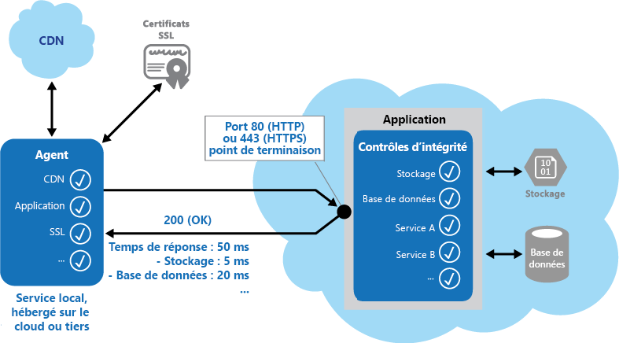

# <a name="health-endpoint-monitoring-pattern"></a><span data-ttu-id="f246c-104">Modèle Surveillance de point de terminaison</span><span class="sxs-lookup"><span data-stu-id="f246c-104">Health Endpoint Monitoring pattern</span></span>

[!INCLUDE [header](../_includes/header.md)]

<span data-ttu-id="f246c-105">Implémentez des contrôles fonctionnels dans une application à laquelle des outils externes peuvent accéder par le biais de points de terminaison exposés à intervalles réguliers.</span><span class="sxs-lookup"><span data-stu-id="f246c-105">Implement functional checks in an application that external tools can access through exposed endpoints at regular intervals.</span></span> <span data-ttu-id="f246c-106">Cela peut aider à vérifier que les applications et les services fonctionnent correctement.</span><span class="sxs-lookup"><span data-stu-id="f246c-106">This can help to verify that applications and services are performing correctly.</span></span>

## <a name="context-and-problem"></a><span data-ttu-id="f246c-107">Contexte et problème</span><span class="sxs-lookup"><span data-stu-id="f246c-107">Context and problem</span></span>

<span data-ttu-id="f246c-108">Nous vous recommandons d’analyser les applications web et services principaux pour être sûr qu’ils sont disponibles et fonctionnent correctement (d’ailleurs, il s’agit souvent d’une exigence professionnelle).</span><span class="sxs-lookup"><span data-stu-id="f246c-108">It's a good practice, and often a business requirement, to monitor web applications and back-end services, to ensure they're available and performing correctly.</span></span> <span data-ttu-id="f246c-109">Toutefois, il est plus difficile de surveiller les services exécutés dans le cloud que les services locaux.</span><span class="sxs-lookup"><span data-stu-id="f246c-109">However, it's more difficult to monitor services running in the cloud than it is to monitor on-premises services.</span></span> <span data-ttu-id="f246c-110">Par exemple, vous ne contrôlez pas totalement l’environnement d’hébergement, et les services dépendent généralement d’autres services fournis par des fournisseurs de plateformes ou autres.</span><span class="sxs-lookup"><span data-stu-id="f246c-110">For example, you don't have full control of the hosting environment, and the services typically depend on other services provided by platform vendors and others.</span></span>

<span data-ttu-id="f246c-111">De nombreux facteurs affectent les applications hébergées dans le cloud, tels que la latence du réseau, les performances et la disponibilité des systèmes de calcul et de stockage sous-jacents, et la bande passante réseau entre eux.</span><span class="sxs-lookup"><span data-stu-id="f246c-111">There are many factors that affect cloud-hosted applications such as network latency, the performance and availability of the underlying compute and storage systems, and the network bandwidth between them.</span></span> <span data-ttu-id="f246c-112">Le service peut échouer entièrement ou partiellement en raison de l’un de ces facteurs.</span><span class="sxs-lookup"><span data-stu-id="f246c-112">The service can fail entirely or partially due to any of these factors.</span></span> <span data-ttu-id="f246c-113">Ainsi, vous devez vérifier régulièrement que le service fonctionne correctement pour garantir le niveau de disponibilité exigé, qui peut faire partie de votre contrat de niveau de service (SLA).</span><span class="sxs-lookup"><span data-stu-id="f246c-113">Therefore, you must verify at regular intervals that the service is performing correctly to ensure the required level of availability, which might be part of your service level agreement (SLA).</span></span>

## <a name="solution"></a><span data-ttu-id="f246c-114">Solution</span><span class="sxs-lookup"><span data-stu-id="f246c-114">Solution</span></span>

<span data-ttu-id="f246c-115">Implémentez la surveillance de l’intégrité en envoyant des demandes à un point de terminaison sur l’application.</span><span class="sxs-lookup"><span data-stu-id="f246c-115">Implement health monitoring by sending requests to an endpoint on the application.</span></span> <span data-ttu-id="f246c-116">L’application doit effectuer les vérifications nécessaires et retourner une indication de son état.</span><span class="sxs-lookup"><span data-stu-id="f246c-116">The application should perform the necessary checks, and return an indication of its status.</span></span>

<span data-ttu-id="f246c-117">Un contrôle de surveillance de l’intégrité combine en général deux facteurs :</span><span class="sxs-lookup"><span data-stu-id="f246c-117">A health monitoring check typically combines two factors:</span></span>

- <span data-ttu-id="f246c-118">Les contrôles (le cas échéant) effectués par l’application ou le service en réponse à la demande envoyée au point de terminaison de vérification de l’intégrité.</span><span class="sxs-lookup"><span data-stu-id="f246c-118">The checks (if any) performed by the application or service in response to the request to the health verification endpoint.</span></span>
- <span data-ttu-id="f246c-119">L’analyse des résultats par l’outil ou le framework qui effectue le contrôle de vérification de l’intégrité.</span><span class="sxs-lookup"><span data-stu-id="f246c-119">Analysis of the results by the tool or framework that performs the health verification check.</span></span>

<span data-ttu-id="f246c-120">Le code de réponse indique l’état de l’application et éventuellement les composants ou services qu’elle utilise.</span><span class="sxs-lookup"><span data-stu-id="f246c-120">The response code indicates the status of the application and, optionally, any components or services it uses.</span></span> <span data-ttu-id="f246c-121">Le contrôle de latence ou de temps de réponse est effectué par l’outil ou le framework de surveillance.</span><span class="sxs-lookup"><span data-stu-id="f246c-121">The latency or response time check is performed by the monitoring tool or framework.</span></span> <span data-ttu-id="f246c-122">La figure présente une vue d’ensemble du modèle.</span><span class="sxs-lookup"><span data-stu-id="f246c-122">The figure provides an overview of the pattern.</span></span>



<span data-ttu-id="f246c-124">Le code de surveillance de l’intégrité peut effectuer d’autres contrôles dans l’application :</span><span class="sxs-lookup"><span data-stu-id="f246c-124">Other checks that might be carried out by the health monitoring code in the application include:</span></span>
- <span data-ttu-id="f246c-125">Vérification de la disponibilité ou du temps de réponse du stockage cloud ou d’une base de données.</span><span class="sxs-lookup"><span data-stu-id="f246c-125">Checking cloud storage or a database for availability and response time.</span></span>
- <span data-ttu-id="f246c-126">Vérification d’autres ressources ou services situés dans l’application, ou situés ailleurs mais utilisés par l’application.</span><span class="sxs-lookup"><span data-stu-id="f246c-126">Checking other resources or services located in the application, or located elsewhere but used by the application.</span></span>

<span data-ttu-id="f246c-127">Il existe des outils et services qui surveillent des applications web en soumettant une demande à un ensemble de points de terminaison configurable et en évaluant les résultats par rapport à un ensemble de règles configurables.</span><span class="sxs-lookup"><span data-stu-id="f246c-127">Services and tools are available that monitor web applications by submitting a request to a configurable set of endpoints, and evaluating the results against a set of configurable rules.</span></span> <span data-ttu-id="f246c-128">Il est relativement facile de créer un point de terminaison de service dont la seule fonction est d’effectuer certains tests fonctionnels sur le système.</span><span class="sxs-lookup"><span data-stu-id="f246c-128">It's relatively easy to create a service endpoint whose sole purpose is to perform some functional tests on the system.</span></span>

<span data-ttu-id="f246c-129">Voici quelques-uns des contrôles que les outils de surveillance peuvent effectuer :</span><span class="sxs-lookup"><span data-stu-id="f246c-129">Typical checks that can be performed by the monitoring tools include:</span></span>

- <span data-ttu-id="f246c-130">Validation du code de réponse.</span><span class="sxs-lookup"><span data-stu-id="f246c-130">Validating the response code.</span></span> <span data-ttu-id="f246c-131">Par exemple, une réponse HTTP 200 (OK) indique que l’application a répondu sans erreur.</span><span class="sxs-lookup"><span data-stu-id="f246c-131">For example, an HTTP response of 200 (OK) indicates that the application responded without error.</span></span> <span data-ttu-id="f246c-132">Le système de surveillance peut également contrôler d’autres codes de réponse pour fournir des résultats plus complets.</span><span class="sxs-lookup"><span data-stu-id="f246c-132">The monitoring system might also check for other response codes to give more comprehensive results.</span></span>
- <span data-ttu-id="f246c-133">Vérification du contenu de la réponse pour détecter les erreurs, même quand le code d’état 200 (OK) est retourné.</span><span class="sxs-lookup"><span data-stu-id="f246c-133">Checking the content of the response to detect errors, even when a 200 (OK) status code is returned.</span></span> <span data-ttu-id="f246c-134">Cela permet de détecter les erreurs qui affectent uniquement une section de la page web retournée ou de la réponse du service.</span><span class="sxs-lookup"><span data-stu-id="f246c-134">This can detect errors that affect only a section of the returned web page or service response.</span></span> <span data-ttu-id="f246c-135">Vous pouvez par exemple vérifier le titre d’une page ou rechercher une expression spécifique qui indique que la page correcte a été retournée.</span><span class="sxs-lookup"><span data-stu-id="f246c-135">For example, checking the title of a page or looking for a specific phrase that indicates the correct page was returned.</span></span>
- <span data-ttu-id="f246c-136">Mesure du temps de réponse, qui indique une combinaison de la latence du réseau et de la durée nécessaire à l’application pour exécuter la demande.</span><span class="sxs-lookup"><span data-stu-id="f246c-136">Measuring the response time, which indicates a combination of the network latency and the time that the application took to execute the request.</span></span> <span data-ttu-id="f246c-137">Une valeur croissante peut indiquer un problème au niveau de l’application ou du réseau.</span><span class="sxs-lookup"><span data-stu-id="f246c-137">An increasing value can indicate an emerging problem with the application or network.</span></span>
- <span data-ttu-id="f246c-138">Vérification de ressources ou services situés en dehors de l’application, comme un réseau de distribution de contenu utilisé par l’application pour remettre du contenu à partir de caches globaux.</span><span class="sxs-lookup"><span data-stu-id="f246c-138">Checking resources or services located outside the application, such as a content delivery network used by the application to deliver content from global caches.</span></span>
- <span data-ttu-id="f246c-139">Vérification de l’expiration des certificats SSL.</span><span class="sxs-lookup"><span data-stu-id="f246c-139">Checking for expiration of SSL certificates.</span></span>
- <span data-ttu-id="f246c-140">Mesure du temps de réponse d’une recherche DNS pour l’URL de l’application, afin de mesurer la latence DNS et les échecs DNS.</span><span class="sxs-lookup"><span data-stu-id="f246c-140">Measuring the response time of a DNS lookup for the URL of the application to measure DNS latency and DNS failures.</span></span>
- <span data-ttu-id="f246c-141">Validation de l’URL retournée par la recherche DNS, pour vérifier que les entrées sont correctes.</span><span class="sxs-lookup"><span data-stu-id="f246c-141">Validating the URL returned by the DNS lookup to ensure correct entries.</span></span> <span data-ttu-id="f246c-142">Cela peut aider à éviter la redirection des demandes malveillantes suite à une attaque du serveur DNS.</span><span class="sxs-lookup"><span data-stu-id="f246c-142">This can help to avoid malicious request redirection through a successful attack on the DNS server.</span></span>

<span data-ttu-id="f246c-143">Il est également utile, dans la mesure du possible, d’exécuter ces contrôles à partir de différents emplacements locaux ou hébergés pour mesurer et comparer les temps de réponse.</span><span class="sxs-lookup"><span data-stu-id="f246c-143">It's also useful, where possible, to run these checks from different on-premises or hosted locations to measure and compare response times.</span></span> <span data-ttu-id="f246c-144">Dans l’idéal, vous devez surveiller les applications à partir d’emplacements qui sont proches des clients, pour obtenir une vue précise des performances de chaque emplacement.</span><span class="sxs-lookup"><span data-stu-id="f246c-144">Ideally you should monitor applications from locations that are close to customers to get an accurate view of the performance from each location.</span></span> <span data-ttu-id="f246c-145">En plus de fournir un mécanisme de vérification plus robuste, les résultats peuvent vous aider à choisir l’emplacement de déploiement de l’application&mdash;et s’il faut la déployer dans plusieurs centres de données.</span><span class="sxs-lookup"><span data-stu-id="f246c-145">In addition to providing a more robust checking mechanism, the results can help you decide on the deployment location for the application&mdash;and whether to deploy it in more than one datacenter.</span></span>

<span data-ttu-id="f246c-146">Vous devez aussi exécuter des tests sur toutes les instances de service utilisées par les clients, pour vérifier que l’application fonctionne correctement pour tous les clients.</span><span class="sxs-lookup"><span data-stu-id="f246c-146">Tests should also be run against all the service instances that customers use to ensure the application is working correctly for all customers.</span></span> <span data-ttu-id="f246c-147">Par exemple, si le stockage du client est réparti sur plusieurs comptes de stockage, le processus de surveillance doit tous les vérifier.</span><span class="sxs-lookup"><span data-stu-id="f246c-147">For example, if customer storage is spread across more than one storage account, the monitoring process should check all of these.</span></span>

## <a name="issues-and-considerations"></a><span data-ttu-id="f246c-148">Problèmes et considérations</span><span class="sxs-lookup"><span data-stu-id="f246c-148">Issues and considerations</span></span>

<span data-ttu-id="f246c-149">Prenez en compte les points suivants lorsque vous choisissez comment implémenter ce modèle :</span><span class="sxs-lookup"><span data-stu-id="f246c-149">Consider the following points when deciding how to implement this pattern:</span></span>

<span data-ttu-id="f246c-150">Comment valider la réponse.</span><span class="sxs-lookup"><span data-stu-id="f246c-150">How to validate the response.</span></span> <span data-ttu-id="f246c-151">Par exemple, un seul code d’état 200 (OK) suffit-il pour vérifier que l’application fonctionne correctement ?</span><span class="sxs-lookup"><span data-stu-id="f246c-151">For example, is just a single 200 (OK) status code sufficient to verify the application is working correctly?</span></span> <span data-ttu-id="f246c-152">Même si cela fournit la mesure la plus simple de la disponibilité des applications, et s’il s’agit de l’implémentation minimale de ce modèle, cela ne fournit que peu d’informations sur les opérations, les tendances et les éventuels problèmes à venir dans l’application.</span><span class="sxs-lookup"><span data-stu-id="f246c-152">While this provides the most basic measure of application availability, and is the minimum implementation of this pattern, it provides little information about the operations, trends, and possible upcoming issues in the application.</span></span>

   >  <span data-ttu-id="f246c-153">Vérifiez que l’application retourne correctement un code d’état 200 (OK) uniquement quand la ressource cible est détectée et traitée.</span><span class="sxs-lookup"><span data-stu-id="f246c-153">Make sure that the application correctly returns a 200 (OK) only when the target resource is found and processed.</span></span> <span data-ttu-id="f246c-154">Dans certains scénarios, par exemple quand vous utilisez une page maître pour héberger la page web cible, le serveur retourne un code d’état 200 (OK) au lieu d’un code 404 (Introuvable), même quand la page de contenu cible est introuvable.</span><span class="sxs-lookup"><span data-stu-id="f246c-154">In some scenarios, such as when using a master page to host the target web page, the server sends back a 200 (OK) status code instead of a 404 (Not Found) code, even when the target content page was not found.</span></span>

<span data-ttu-id="f246c-155">Le nombre de points de terminaison à exposer pour une application.</span><span class="sxs-lookup"><span data-stu-id="f246c-155">The number of endpoints to expose for an application.</span></span> <span data-ttu-id="f246c-156">Une approche consiste à exposer au moins un point de terminaison pour les services de base utilisés par l’application, et un autre pour les services de priorité inférieure. Ceci permet d’affecter différents niveaux d’importance à chaque résultat de surveillance.</span><span class="sxs-lookup"><span data-stu-id="f246c-156">One approach is to expose at least one endpoint for the core services that the application uses and another for lower priority services, allowing different levels of importance to be assigned to each monitoring result.</span></span> <span data-ttu-id="f246c-157">Pour bénéficier d’une granularité de surveillance supplémentaire, vous pouvez exposer plusieurs points de terminaison, par exemple un pour chaque service de base.</span><span class="sxs-lookup"><span data-stu-id="f246c-157">Also consider exposing more endpoints, such as one for each core service, for additional monitoring granularity.</span></span> <span data-ttu-id="f246c-158">Ainsi, un contrôle de vérification de l’intégrité peut vérifier la base de données, le stockage et un service de géocodage externe utilisé par une application, chacun nécessitant un niveau de disponibilité et un temps de réponse différent.</span><span class="sxs-lookup"><span data-stu-id="f246c-158">For example, a health verification check might check the database, storage, and an external geocoding service that an application uses, with each requiring a different level of uptime and response time.</span></span> <span data-ttu-id="f246c-159">L’application peut toujours être saine si le service de géocodage ou une autre tâche en arrière-plan n’est pas disponible pendant quelques minutes.</span><span class="sxs-lookup"><span data-stu-id="f246c-159">The application could still be healthy if the geocoding service, or some other background task, is unavailable for a few minutes.</span></span>

<span data-ttu-id="f246c-160">S’il vaut mieux utiliser le même point de terminaison pour la surveillance et pour l’accès général, mais vers un chemin spécifique conçu pour les contrôles de vérification de l’intégrité, par exemple /HealthCheck/{GUID}/ sur le point de terminaison d’accès général.</span><span class="sxs-lookup"><span data-stu-id="f246c-160">Whether to use the same endpoint for monitoring as is used for general access, but to a specific path designed for health verification checks, for example, /HealthCheck/{GUID}/ on the general access endpoint.</span></span> <span data-ttu-id="f246c-161">Ainsi, certains tests fonctionnels de l’application peuvent être exécutés par les outils de surveillance (tels que l’ajout de l’inscription d’un utilisateur, la connexion et la prise d’une commande test) tout en vérifiant que le point de terminaison d’accès général est disponible.</span><span class="sxs-lookup"><span data-stu-id="f246c-161">This allows some functional tests in the application to be run by the monitoring tools, such as adding a new user registration, signing in, and placing a test order, while also verifying that the general access endpoint is available.</span></span>

<span data-ttu-id="f246c-162">Le type d’informations à collecter dans le service en réponse aux demandes de surveillance, et comment retourner ces informations.</span><span class="sxs-lookup"><span data-stu-id="f246c-162">The type of information to collect in the service in response to monitoring requests, and how to return this information.</span></span> <span data-ttu-id="f246c-163">La plupart des outils et frameworks existants examinent uniquement le code d’état HTTP retourné par le point de terminaison.</span><span class="sxs-lookup"><span data-stu-id="f246c-163">Most existing tools and frameworks look only at the HTTP status code that the endpoint returns.</span></span> <span data-ttu-id="f246c-164">Pour retourner et valider des informations supplémentaires, vous devrez peut-être créer un service ou un utilitaire de surveillance personnalisé.</span><span class="sxs-lookup"><span data-stu-id="f246c-164">To return and validate additional information, you might have to create a custom monitoring utility or service.</span></span>

<span data-ttu-id="f246c-165">La quantité d’informations à collecter.</span><span class="sxs-lookup"><span data-stu-id="f246c-165">How much information to collect.</span></span> <span data-ttu-id="f246c-166">Un traitement excessif lors de la vérification peut surcharger l’application et avoir un impact sur d’autres utilisateurs.</span><span class="sxs-lookup"><span data-stu-id="f246c-166">Performing excessive processing during the check can overload the application and impact other users.</span></span> <span data-ttu-id="f246c-167">La durée nécessaire peut dépasser le délai d’expiration du système de surveillance, et l’application risque d’être marquée comme étant indisponible.</span><span class="sxs-lookup"><span data-stu-id="f246c-167">The time it takes might exceed the timeout of the monitoring system so it marks the application as unavailable.</span></span> <span data-ttu-id="f246c-168">La plupart des applications incluent une instrumentation telle que des gestionnaires d’erreurs et des compteurs de performances qui enregistrent les performances et des informations d’erreurs détaillées dans des journaux. Ces informations peuvent suffire et éviter d’avoir à retourner des informations supplémentaires à partir d’un contrôle de vérification de l’intégrité.</span><span class="sxs-lookup"><span data-stu-id="f246c-168">Most applications include instrumentation such as error handlers and performance counters that log performance and detailed error information, this might be sufficient instead of returning additional information from a health verification check.</span></span>

<span data-ttu-id="f246c-169">Mise en cache de l’état du point de terminaison.</span><span class="sxs-lookup"><span data-stu-id="f246c-169">Caching the endpoint status.</span></span> <span data-ttu-id="f246c-170">L’exécution trop fréquente d’un contrôle d’intégrité peut être couteuse.</span><span class="sxs-lookup"><span data-stu-id="f246c-170">It could be expensive to run the health check too frequently.</span></span> <span data-ttu-id="f246c-171">Si l’état d’intégrité est indiqué sur un tableau de bord (par exemple), vous ne souhaitez pas que chaque requête faite depuis le tableau de bord déclenche un contrôle d’intégrité.</span><span class="sxs-lookup"><span data-stu-id="f246c-171">If the health status is reported through a dashboard, for example, you don't want every request from the dashboard to trigger a health check.</span></span> <span data-ttu-id="f246c-172">Vérifiez plutôt l’intégrité du système périodiquement et mettez l’état en cache.</span><span class="sxs-lookup"><span data-stu-id="f246c-172">Instead, periodically check the system health and cache the status.</span></span> <span data-ttu-id="f246c-173">Exposez un point de terminaison qui retourne l’état mis en cache.</span><span class="sxs-lookup"><span data-stu-id="f246c-173">Expose an endpoint that returns the cached status.</span></span>

<span data-ttu-id="f246c-174">Comment configurer la sécurité des points de terminaison de surveillance pour les protéger contre l’accès public, qui risque d’exposer l’application à des attaques malveillantes, d’exposer des informations sensibles ou de favoriser les attaques par déni de service (DoS).</span><span class="sxs-lookup"><span data-stu-id="f246c-174">How to configure security for the monitoring endpoints to protect them from public access, which might expose the application to malicious attacks, risk the exposure of sensitive information, or attract denial of service (DoS) attacks.</span></span> <span data-ttu-id="f246c-175">En général, cette configuration de la sécurité doit être effectuée dans l’application, pour pouvoir être mise à jour facilement sans avoir à redémarrer l’application.</span><span class="sxs-lookup"><span data-stu-id="f246c-175">Typically this should be done in the application configuration so that it can be updated easily without restarting the application.</span></span> <span data-ttu-id="f246c-176">Vous pouvez appliquer une ou plusieurs des techniques suivantes :</span><span class="sxs-lookup"><span data-stu-id="f246c-176">Consider using one or more of the following techniques:</span></span>

- <span data-ttu-id="f246c-177">Sécurisez le point de terminaison en exigeant l’authentification.</span><span class="sxs-lookup"><span data-stu-id="f246c-177">Secure the endpoint by requiring authentication.</span></span> <span data-ttu-id="f246c-178">Pour cela, utilisez une clé de sécurité d’authentification dans l’en-tête de demande ou passez les informations d’identification avec la demande, sous réserve que l’outil ou le service de surveillance prenne en charge l’authentification.</span><span class="sxs-lookup"><span data-stu-id="f246c-178">You can do this by using an authentication security key in the request header or by passing credentials with the request, provided that the monitoring service or tool supports authentication.</span></span>

  - <span data-ttu-id="f246c-179">Utilisez un point de terminaison obscur ou masqué.</span><span class="sxs-lookup"><span data-stu-id="f246c-179">Use an obscure or hidden endpoint.</span></span> <span data-ttu-id="f246c-180">Par exemple, exposez le point de terminaison sur une adresse IP différente de celle utilisée par l’URL d’application par défaut, configurez le point de terminaison sur un port HTTP non standard et/ou utilisez un chemin complexe à la page de test.</span><span class="sxs-lookup"><span data-stu-id="f246c-180">For example, expose the endpoint on a different IP address to that used by the default application URL, configure the endpoint on a nonstandard HTTP port, and/or use a complex path to the test page.</span></span> <span data-ttu-id="f246c-181">Vous pouvez généralement spécifier des ports et des adresses de point de terminaison supplémentaires dans la configuration de l’application, et ajouter des entrées pour ces points de terminaison au serveur DNS si nécessaire pour éviter d’avoir à spécifier l’adresse IP directement.</span><span class="sxs-lookup"><span data-stu-id="f246c-181">You can usually specify additional endpoint addresses and ports in the application configuration, and add entries for these endpoints to the DNS server if required to avoid having to specify the IP address directly.</span></span>

  - <span data-ttu-id="f246c-182">Exposez une méthode sur un point de terminaison qui accepte un paramètre tel qu’une valeur de clé ou une valeur de mode d’opération.</span><span class="sxs-lookup"><span data-stu-id="f246c-182">Expose a method on an endpoint that accepts a parameter such as a key value or an operation mode value.</span></span> <span data-ttu-id="f246c-183">En fonction de la valeur fournie pour ce paramètre, quand une demande est reçue, le code peut effectuer un test ou un ensemble de tests spécifique, ou retourner un code d’erreur 404 (Introuvable) si la valeur du paramètre n’est pas reconnue.</span><span class="sxs-lookup"><span data-stu-id="f246c-183">Depending on the value supplied for this parameter, when a request is received the code can perform a specific test or set of tests, or return a 404 (Not Found) error if the parameter value isn't recognized.</span></span> <span data-ttu-id="f246c-184">Vous pouvez définir les valeurs de paramètre reconnues dans la configuration de l’application.</span><span class="sxs-lookup"><span data-stu-id="f246c-184">The recognized parameter values could be set in the application configuration.</span></span>

     >  <span data-ttu-id="f246c-185">Les attaques DoS auront probablement un impact moindre sur un point de terminaison distinct qui effectue des tests fonctionnels de base sans compromettre le fonctionnement de l’application.</span><span class="sxs-lookup"><span data-stu-id="f246c-185">DoS attacks are likely to have less impact on a separate endpoint that performs basic functional tests without compromising the operation of the application.</span></span> <span data-ttu-id="f246c-186">Dans l’idéal, évitez d’utiliser un test susceptible d’exposer des informations sensibles.</span><span class="sxs-lookup"><span data-stu-id="f246c-186">Ideally, avoid using a test that might expose sensitive information.</span></span> <span data-ttu-id="f246c-187">Si vous devez retourner des informations qui peuvent être utiles à un agresseur, réfléchissez à la façon dont vous protégerez le point de terminaison et les données contre tout accès non autorisé.</span><span class="sxs-lookup"><span data-stu-id="f246c-187">If you must return information that might be useful to an attacker, consider how you'll protect the endpoint and the data from unauthorized access.</span></span> <span data-ttu-id="f246c-188">Dans ce cas, s’appuyer uniquement sur l’obscurité n’est pas suffisant.</span><span class="sxs-lookup"><span data-stu-id="f246c-188">In this case just relying on obscurity isn't enough.</span></span> <span data-ttu-id="f246c-189">Vous devez également envisager l’utilisation d’une connexion HTTPS et le chiffrement des données sensibles, mais cela augmentera la charge sur le serveur.</span><span class="sxs-lookup"><span data-stu-id="f246c-189">You should also consider using an HTTPS connection and encrypting any sensitive data, although this will increase the load on the server.</span></span>

- <span data-ttu-id="f246c-190">Comment accéder à un point de terminaison sécurisé à l’aide de l’authentification.</span><span class="sxs-lookup"><span data-stu-id="f246c-190">How to access an endpoint that's secured using authentication.</span></span> <span data-ttu-id="f246c-191">Les outils et frameworks ne peuvent pas tous être configurés pour inclure des informations d’identification avec la demande de vérification de l’intégrité.</span><span class="sxs-lookup"><span data-stu-id="f246c-191">Not all tools and frameworks can be configured to include credentials with the health verification request.</span></span> <span data-ttu-id="f246c-192">Par exemple, les fonctionnalités de vérification de l’intégrité intégrées à Microsoft Azure ne peuvent pas fournir d’informations d’identification pour l’authentification.</span><span class="sxs-lookup"><span data-stu-id="f246c-192">For example, Microsoft Azure built-in health verification features can't provide authentication credentials.</span></span> <span data-ttu-id="f246c-193">[Pingdom](https://www.pingdom.com/), [Panopta](https://www.panopta.com/), [NewRelic](https://newrelic.com/) et [Statuscake](https://www.statuscake.com/) constituent des solutions alternatives.</span><span class="sxs-lookup"><span data-stu-id="f246c-193">Some third-party alternatives are [Pingdom](https://www.pingdom.com/), [Panopta](https://www.panopta.com/), [NewRelic](https://newrelic.com/), and [Statuscake](https://www.statuscake.com/).</span></span>

- <span data-ttu-id="f246c-194">Comment vérifier que les performances de l’agent de surveillance sont correctes.</span><span class="sxs-lookup"><span data-stu-id="f246c-194">How to ensure that the monitoring agent is performing correctly.</span></span> <span data-ttu-id="f246c-195">Une approche consiste à exposer un point de terminaison qui retourne simplement une valeur à partir de la configuration de l’application ou une valeur aléatoire qui peut être utilisée pour tester l’agent.</span><span class="sxs-lookup"><span data-stu-id="f246c-195">One approach is to expose an endpoint that simply returns a value from the application configuration or a random value that can be used to test the agent.</span></span>

   >  <span data-ttu-id="f246c-196">Vérifiez également que le système de surveillance exécute des contrôles sur lui-même, par exemple un test intégré et un test automatique, pour éviter qu’il n’émette de faux résultats positifs.</span><span class="sxs-lookup"><span data-stu-id="f246c-196">Also ensure that the monitoring system performs checks on itself, such as a self-test and built-in test, to avoid it issuing false positive results.</span></span>

## <a name="when-to-use-this-pattern"></a><span data-ttu-id="f246c-197">Quand utiliser ce modèle</span><span class="sxs-lookup"><span data-stu-id="f246c-197">When to use this pattern</span></span>

<span data-ttu-id="f246c-198">Ce modèle est utile dans les situations suivantes :</span><span class="sxs-lookup"><span data-stu-id="f246c-198">This pattern is useful for:</span></span>
- <span data-ttu-id="f246c-199">Surveillance d’applications web et de sites web pour vérifier la disponibilité.</span><span class="sxs-lookup"><span data-stu-id="f246c-199">Monitoring websites and web applications to verify availability.</span></span>
- <span data-ttu-id="f246c-200">Surveillance d’applications web et de sites web pour vérifier le bon fonctionnement.</span><span class="sxs-lookup"><span data-stu-id="f246c-200">Monitoring websites and web applications to check for correct operation.</span></span>
- <span data-ttu-id="f246c-201">Surveillance de services de couche intermédiaire ou de services partagés pour détecter et isoler une défaillance susceptible de perturber d’autres applications.</span><span class="sxs-lookup"><span data-stu-id="f246c-201">Monitoring middle-tier or shared services to detect and isolate a failure that could disrupt other applications.</span></span>
- <span data-ttu-id="f246c-202">En complément de l’instrumentation existante dans l’application, telle que les compteurs de performances et les gestionnaires d’erreurs.</span><span class="sxs-lookup"><span data-stu-id="f246c-202">Complementing existing instrumentation in the application, such as performance counters and error handlers.</span></span> <span data-ttu-id="f246c-203">La vérification de l’intégrité ne se substitue pas à l’obligation de journalisation et d’audit dans l’application.</span><span class="sxs-lookup"><span data-stu-id="f246c-203">Health verification checking doesn't replace the requirement for logging and auditing in the application.</span></span> <span data-ttu-id="f246c-204">L’instrumentation peut fournir des informations précieuses pour un framework existant qui surveille des compteurs et des journaux d’erreurs pour détecter les défaillances ou autres problèmes.</span><span class="sxs-lookup"><span data-stu-id="f246c-204">Instrumentation can provide valuable information for an existing framework that monitors counters and error logs to detect failures or other issues.</span></span> <span data-ttu-id="f246c-205">Toutefois, elle ne peut pas fournir d’informations si l’application n’est pas disponible.</span><span class="sxs-lookup"><span data-stu-id="f246c-205">However, it can't provide information if the application is unavailable.</span></span>

## <a name="example"></a><span data-ttu-id="f246c-206">Exemples</span><span class="sxs-lookup"><span data-stu-id="f246c-206">Example</span></span>

<span data-ttu-id="f246c-207">Les exemples de code suivants, tirés de la classe `HealthCheckController` (un exemple qui illustre ce modèle est disponible sur [GitHub](https://github.com/mspnp/cloud-design-patterns/tree/master/health-endpoint-monitoring)), montrent comment exposer un point de terminaison pour exécuter différents contrôles d’intégrité.</span><span class="sxs-lookup"><span data-stu-id="f246c-207">The following code examples, taken from the `HealthCheckController` class (a sample that demonstrates this pattern is available on [GitHub](https://github.com/mspnp/cloud-design-patterns/tree/master/health-endpoint-monitoring)), demonstrates exposing an endpoint for performing a range of health checks.</span></span>

<span data-ttu-id="f246c-208">La méthode `CoreServices`, illustrée ci-dessous en langage C#, effectue une série de contrôles sur des services utilisés dans l’application.</span><span class="sxs-lookup"><span data-stu-id="f246c-208">The `CoreServices` method, shown below in C#, performs a series of checks on services used in the application.</span></span> <span data-ttu-id="f246c-209">Si tous les tests s’exécutent sans erreur, la méthode retourne un code d’état 200 (OK).</span><span class="sxs-lookup"><span data-stu-id="f246c-209">If all of the tests run without error, the method returns a 200 (OK) status code.</span></span> <span data-ttu-id="f246c-210">Si l’un des tests lève une exception, la méthode retourne un code d’état 500 (Erreur interne).</span><span class="sxs-lookup"><span data-stu-id="f246c-210">If any of the tests raises an exception, the method returns a 500 (Internal Error) status code.</span></span> <span data-ttu-id="f246c-211">La méthode peut éventuellement retourner des informations supplémentaires quand une erreur se produit, si le framework ou l’outil de surveillance peut les exploiter.</span><span class="sxs-lookup"><span data-stu-id="f246c-211">The method could optionally return additional information when an error occurs, if the monitoring tool or framework is able to make use of it.</span></span>

```csharp
public ActionResult CoreServices()
{
  try
  {
    // Run a simple check to ensure the database is available.
    DataStore.Instance.CoreHealthCheck();

    // Run a simple check on our external service.
    MyExternalService.Instance.CoreHealthCheck();
  }
  catch (Exception ex)
  {
    Trace.TraceError("Exception in basic health check: {0}", ex.Message);

    // This can optionally return different status codes based on the exception.
    // Optionally it could return more details about the exception.
    // The additional information could be used by administrators who access the
    // endpoint with a browser, or using a ping utility that can display the
    // additional information.
    return new HttpStatusCodeResult((int)HttpStatusCode.InternalServerError);
  }
  return new HttpStatusCodeResult((int)HttpStatusCode.OK);
}
```
<span data-ttu-id="f246c-212">La méthode `ObscurePath` montre comment lire un chemin à partir de la configuration d’application et l’utiliser comme point de terminaison pour les tests.</span><span class="sxs-lookup"><span data-stu-id="f246c-212">The `ObscurePath` method shows how you can read a path from the application configuration and use it as the endpoint for tests.</span></span> <span data-ttu-id="f246c-213">Cet exemple, en C#, montre également comment accepter un ID comme paramètre et l’utiliser pour vérifier si les requêtes sont valides.</span><span class="sxs-lookup"><span data-stu-id="f246c-213">This example, in C#, also shows how you can accept an ID as a parameter and use it to check for valid requests.</span></span>

```csharp
public ActionResult ObscurePath(string id)
{
  // The id could be used as a simple way to obscure or hide the endpoint.
  // The id to match could be retrieved from configuration and, if matched,
  // perform a specific set of tests and return the result. If not matched it
  // could return a 404 (Not Found) status.

  // The obscure path can be set through configuration to hide the endpoint.
  var hiddenPathKey = CloudConfigurationManager.GetSetting("Test.ObscurePath");

  // If the value passed does not match that in configuration, return 404 (Not Found).
  if (!string.Equals(id, hiddenPathKey))
  {
    return new HttpStatusCodeResult((int)HttpStatusCode.NotFound);
  }

  // Else continue and run the tests...
  // Return results from the core services test.
  return this.CoreServices();
}
```

<span data-ttu-id="f246c-214">La méthode `TestResponseFromConfig` montre comment exposer un point de terminaison qui effectue un contrôle pour une valeur de paramètre de configuration spécifiée.</span><span class="sxs-lookup"><span data-stu-id="f246c-214">The `TestResponseFromConfig` method shows how you can expose an endpoint that performs a check for a specified configuration setting value.</span></span>

```csharp
public ActionResult TestResponseFromConfig()
{
  // Health check that returns a response code set in configuration for testing.
  var returnStatusCodeSetting = CloudConfigurationManager.GetSetting(
                                                          "Test.ReturnStatusCode");

  int returnStatusCode;

  if (!int.TryParse(returnStatusCodeSetting, out returnStatusCode))
  {
    returnStatusCode = (int)HttpStatusCode.OK;
  }

  return new HttpStatusCodeResult(returnStatusCode);
}
```
## <a name="monitoring-endpoints-in-azure-hosted-applications"></a><span data-ttu-id="f246c-215">Surveillance des points de terminaison dans les applications hébergées Azure</span><span class="sxs-lookup"><span data-stu-id="f246c-215">Monitoring endpoints in Azure hosted applications</span></span>

<span data-ttu-id="f246c-216">Voici quelques options pour la surveillance des points de terminaison dans les applications Azure :</span><span class="sxs-lookup"><span data-stu-id="f246c-216">Some options for monitoring endpoints in Azure applications are:</span></span>

- <span data-ttu-id="f246c-217">Utiliser les fonctionnalités de surveillance intégrées d’Azure</span><span class="sxs-lookup"><span data-stu-id="f246c-217">Use the built-in monitoring features of Azure.</span></span>

- <span data-ttu-id="f246c-218">Utiliser un service ou un framework tiers tel que Microsoft System Center Operations Manager</span><span class="sxs-lookup"><span data-stu-id="f246c-218">Use a third-party service or a framework such as Microsoft System Center Operations Manager.</span></span>

- <span data-ttu-id="f246c-219">Créer un utilitaire ou un service personnalisé qui s’exécute sur votre propre serveur ou sur un serveur hébergé</span><span class="sxs-lookup"><span data-stu-id="f246c-219">Create a custom utility or a service that runs on your own or on a hosted server.</span></span>

   >  <span data-ttu-id="f246c-220">Bien qu’Azure fournisse un ensemble relativement complet d’options de surveillance, vous pouvez utiliser des services et des outils supplémentaires pour obtenir d’autres informations.</span><span class="sxs-lookup"><span data-stu-id="f246c-220">Even though Azure provides a reasonably comprehensive set of monitoring options, you can use additional services and tools to provide extra information.</span></span> <span data-ttu-id="f246c-221">Azure Management Services fournit un mécanisme de surveillance intégré pour les règles d’alerte.</span><span class="sxs-lookup"><span data-stu-id="f246c-221">Azure Management Services provides a built-in monitoring mechanism for alert rules.</span></span> <span data-ttu-id="f246c-222">La section Alertes de la page des services de gestion dans le portail Azure vous permet de configurer jusqu’à dix règles d’alerte par abonnement pour vos services.</span><span class="sxs-lookup"><span data-stu-id="f246c-222">The alerts section of the management services page in the Azure portal allows you to configure up to ten alert rules per subscription for your services.</span></span> <span data-ttu-id="f246c-223">Ces règles spécifient une condition et une valeur de seuil pour un service, telle que la charge de l’UC ou le nombre de demandes ou d’erreurs par seconde, et le service peut envoyer automatiquement des notifications par e-mail aux adresses que vous définissez dans chaque règle.</span><span class="sxs-lookup"><span data-stu-id="f246c-223">These rules specify a condition and a threshold value for a service such as CPU load, or the number of requests or errors per second, and the service can automatically send email notifications to addresses you define in each rule.</span></span>

<span data-ttu-id="f246c-224">Les conditions que vous pouvez surveiller varient en fonction du mécanisme d’hébergement que vous choisissez pour votre application (par exemple, sites web, services cloud, machines virtuelles ou services mobiles), mais tous ces mécanismes incluent la possibilité de créer une règle d’alerte qui utilise un point de terminaison web que vous spécifiez dans les paramètres de votre service.</span><span class="sxs-lookup"><span data-stu-id="f246c-224">The conditions you can monitor vary depending on the hosting mechanism you choose for your application (such as Web Sites, Cloud Services, Virtual Machines, or Mobile Services), but all of these include the ability to create an alert rule that uses a web endpoint you specify in the settings for your service.</span></span> <span data-ttu-id="f246c-225">Ce point de terminaison doit répondre en temps opportun pour que le système d’alerte puisse détecter si l’application fonctionne correctement.</span><span class="sxs-lookup"><span data-stu-id="f246c-225">This endpoint should respond in a timely way so that the alert system can detect that the application is operating correctly.</span></span>

>  <span data-ttu-id="f246c-226">En savoir plus sur la [création de notifications d’alerte][portal-alerts].</span><span class="sxs-lookup"><span data-stu-id="f246c-226">Read more information about [creating alert notifications][portal-alerts].</span></span>

<span data-ttu-id="f246c-227">Si vous hébergez votre application dans des machines virtuelles ou des rôles de travail et web de Services cloud Azure, vous pouvez tirer parti de l’un des services intégrés à Azure appelé Traffic Manager.</span><span class="sxs-lookup"><span data-stu-id="f246c-227">If you host your application in Azure Cloud Services web and worker roles or Virtual Machines, you can take advantage of one of the built-in services in Azure called Traffic Manager.</span></span> <span data-ttu-id="f246c-228">Traffic Manager est un service de routage et d’équilibrage de charge qui peut distribuer les demandes à des instances spécifiques de votre application hébergée par les services cloud en fonction d’une gamme de règles et de paramètres.</span><span class="sxs-lookup"><span data-stu-id="f246c-228">Traffic Manager is a routing and load-balancing service that can distribute requests to specific instances of your Cloud Services hosted application based on a range of rules and settings.</span></span>

<span data-ttu-id="f246c-229">En plus de router les demandes, Traffic Manager exécute une requête ping sur une URL, un port et un chemin relatif que vous spécifiez régulièrement pour déterminer, parmi les instances de l’application définies dans ses règles, lesquelles sont actives et répondent aux requêtes.</span><span class="sxs-lookup"><span data-stu-id="f246c-229">In addition to routing requests, Traffic Manager pings a URL, port, and relative path that you specify on a regular basis to determine which instances of the application defined in its rules are active and are responding to requests.</span></span> <span data-ttu-id="f246c-230">S’il détecte un code d’état 200 (OK), Traffic Manager marque l’application comme étant disponible.</span><span class="sxs-lookup"><span data-stu-id="f246c-230">If it detects a status code 200 (OK), it marks the application as available.</span></span> <span data-ttu-id="f246c-231">S’il détecte un autre code d’état, il marque l’application comme étant hors connexion.</span><span class="sxs-lookup"><span data-stu-id="f246c-231">Any other status code causes Traffic Manager to mark the application as offline.</span></span> <span data-ttu-id="f246c-232">Vous pouvez afficher l’état dans la console de Traffic Manager et configurer la règle pour rediriger les demandes vers d’autres instances de l’application qui répondent.</span><span class="sxs-lookup"><span data-stu-id="f246c-232">You can view the status in the Traffic Manager console, and configure the rule to reroute requests to other instances of the application that are responding.</span></span>

<span data-ttu-id="f246c-233">Toutefois, Traffic Manager n’attend que dix secondes pour recevoir une réponse à partir de l’URL de surveillance.</span><span class="sxs-lookup"><span data-stu-id="f246c-233">However, Traffic Manager will only wait ten seconds to receive a response from the monitoring URL.</span></span> <span data-ttu-id="f246c-234">Ainsi, vous devez vérifier que votre code de vérification de l’intégrité s’exécute pendant ce laps de temps, en prenant en compte la latence du réseau pour l’aller-retour entre Traffic Manager et votre application.</span><span class="sxs-lookup"><span data-stu-id="f246c-234">Therefore, you should ensure that your health verification code executes in this time, allowing for network latency for the round trip from Traffic Manager to your application and back again.</span></span>

>  <span data-ttu-id="f246c-235">En savoir plus sur l’utilisation de [Traffic Manager pour surveiller vos applications](https://azure.microsoft.com/documentation/services/traffic-manager/).</span><span class="sxs-lookup"><span data-stu-id="f246c-235">Read more information about using [Traffic Manager to monitor your applications](https://azure.microsoft.com/documentation/services/traffic-manager/).</span></span> <span data-ttu-id="f246c-236">Traffic Manager est également abordé dans [Multiple Datacenter Deployment Guidance (Recommandations pour le déploiement dans plusieurs centres de données)](https://msdn.microsoft.com/library/dn589779.aspx).</span><span class="sxs-lookup"><span data-stu-id="f246c-236">Traffic Manager is also discussed in [Multiple Datacenter Deployment Guidance](https://msdn.microsoft.com/library/dn589779.aspx).</span></span>

## <a name="related-guidance"></a><span data-ttu-id="f246c-237">Aide connexe</span><span class="sxs-lookup"><span data-stu-id="f246c-237">Related guidance</span></span>

<span data-ttu-id="f246c-238">Les conseils suivants peuvent être utiles lors de l’implémentation de ce modèle :</span><span class="sxs-lookup"><span data-stu-id="f246c-238">The following guidance can be useful when implementing this pattern:</span></span>
- <span data-ttu-id="f246c-239">[Instrumentation and Telemetry Guidance (Recommandations relatives à l’instrumentation et la télémétrie)](https://msdn.microsoft.com/library/dn589775.aspx).</span><span class="sxs-lookup"><span data-stu-id="f246c-239">[Instrumentation and Telemetry Guidance](https://msdn.microsoft.com/library/dn589775.aspx).</span></span> <span data-ttu-id="f246c-240">La vérification de l’intégrité des services et des composants s’effectue généralement par l’interrogation, mais il est également utile de disposer d’informations pour surveiller les performances des applications et détecter les événements qui se produisent au moment de l’exécution.</span><span class="sxs-lookup"><span data-stu-id="f246c-240">Checking the health of services and components is typically done by probing, but it's also useful to have information in place to monitor application performance and detect events that occur at runtime.</span></span> <span data-ttu-id="f246c-241">Ces données peuvent être retransmises aux outils de surveillance en guise d’informations supplémentaires pour la surveillance de l’intégrité.</span><span class="sxs-lookup"><span data-stu-id="f246c-241">This data can be transmitted back to monitoring tools as additional information for health monitoring.</span></span> <span data-ttu-id="f246c-242">L’article Instrumentation and Telemetry Guidance explore la collecte des informations de diagnostics à distance par l’instrumentation dans les applications.</span><span class="sxs-lookup"><span data-stu-id="f246c-242">Instrumentation and Telemetry Guidance explores gathering remote diagnostics information that's collected by instrumentation in applications.</span></span>
- <span data-ttu-id="f246c-243">[Recevoir les notifications d’alerte][portal-alerts].</span><span class="sxs-lookup"><span data-stu-id="f246c-243">[Receiving alert notifications][portal-alerts].</span></span>
- <span data-ttu-id="f246c-244">Ce modèle comprend un [exemple d’application](https://github.com/mspnp/cloud-design-patterns/tree/master/health-endpoint-monitoring) téléchargeable.</span><span class="sxs-lookup"><span data-stu-id="f246c-244">This pattern includes a downloadable [sample application](https://github.com/mspnp/cloud-design-patterns/tree/master/health-endpoint-monitoring).</span></span>

[portal-alerts]: https://azure.microsoft.com/documentation/articles/insights-receive-alert-notifications/
