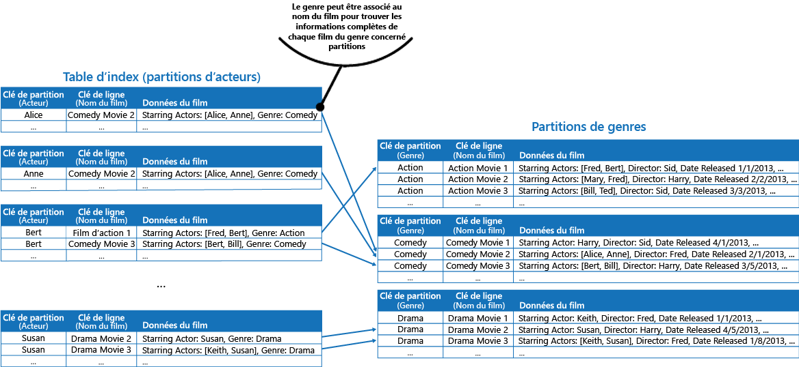

# Modèle de table d’indexIndex Table pattern

[!INCLUDE [header](../_includes/header.md)]

Créez des index sur les champs des magasins de données qui sont souvent référencés par les requêtes.Create indexes over the fields in data stores that are frequently referenced by queries. Ce modèle peut améliorer les performances de requêtes en permettant aux applications de localiser plus rapidement les données à extraire d’un magasin de données.This pattern can improve query performance by allowing applications to more quickly locate the data to retrieve from a data store.

## Contexte et problèmeContext and problem

De nombreux magasins de données organisent les données pour une collection d’entités à l’aide de la clé primaire.Many data stores organize the data for a collection of entities using the primary key. Une application peut utiliser cette clé pour localiser et récupérer des données.An application can use this key to locate and retrieve data. L’illustration présente un exemple de magasin de données contenant des informations client.The figure shows an example of a data store holding customer information. La clé primaire est l’ID client.The primary key is the Customer ID. L’illustration présente les informations client classées par la clé primaire (ID client).The figure shows customer information organized by the primary key (Customer ID).

Alors que la clé primaire est utile pour les requêtes qui extraient des données en fonction de la valeur de cette clé, une application peut ne pas être en mesure d’utiliser la clé primaire si elle a besoin de récupérer des données basées sur un autre champ.While the primary key is valuable for queries that fetch data based on the value of this key, an application might not be able to use the primary key if it needs to retrieve data based on some other field. Dans l’exemple du client, une application ne peut pas utiliser la clé primaire d’ID client pour récupérer les clients si elle interroge les données uniquement en référençant la valeur d’un autre attribut, tel que la ville dans laquelle se trouve le client.In the customers example, an application can't use the Customer ID primary key to retrieve customers if it queries data solely by referencing the value of some other attribute, such as the town in which the customer is located. Pour effectuer une requête comme celle-ci, l’application devra peut-être extraire et examiner chaque enregistrement client, ce qui peut être un processus assez lent.To perform a query such as this, the application might have to fetch and examine every customer record, which could be a slow process.

De nombreux systèmes de gestion de base de données relationnelle prennent en charge les index secondaires.Many relational database management systems support secondary indexes. Un index secondaire est une structure de données distincte, organisée par un ou plusieurs champs de clé non primaires (secondaires), et il indique où sont stockées les données pour chaque valeur indexée.A secondary index is a separate data structure that's organized by one or more nonprimary (secondary) key fields, and it indicates where the data for each indexed value is stored. Les éléments dans un index secondaire sont généralement triés en fonction de la valeur des clés secondaires pour permettre une recherche rapide des données.The items in a secondary index are typically sorted by the value of the secondary keys to enable fast lookup of data. Ces index sont généralement gérés automatiquement par le système de gestion de base de données.These indexes are usually maintained automatically by the database management system.

Vous pouvez créer autant d’index secondaires que nécessaire pour prendre en charge les différentes requêtes effectuées par votre application.You can create as many secondary indexes as you need to support the different queries that your application performs. Par exemple, il est utile d’ajouter un index secondaire sur le champ Ville dans une table Clients d’une base de données relationnelle dans laquelle l’ID client est la clé primaire, si l’application recherche fréquemment des clients selon la ville dans laquelle ils résident.For example, in a Customers table in a relational database where the Customer ID is the primary key, it's beneficial to add a secondary index over the town field if the application frequently looks up customers by the town where they reside.

Toutefois, bien que les index secondaires soient courants dans les systèmes relationnels, la plupart des magasins de données NoSQL utilisés par les applications cloud ne fournissent pas de fonctionnalité équivalente.However, although secondary indexes are common in relational systems, most NoSQL data stores used by cloud applications don't provide an equivalent feature.

## SolutionSolution

Si le magasin de données ne prend pas en charge les index secondaires, vous pouvez les émuler manuellement en créant vos propres tables d’index.If the data store doesn't support secondary indexes, you can emulate them manually by creating your own index tables. Une table d’index organise les données selon une clé spécifiée.An index table organizes the data by a specified key. Trois stratégies sont généralement utilisées pour structurer une table d’index, selon le nombre d’index secondaires requis et la nature des requêtes effectuées par une application.Three strategies are commonly used for structuring an index table, depending on the number of secondary indexes that are required and the nature of the queries that an application performs.

La première stratégie consiste à dupliquer les données dans chaque table d’index, mais en les organisant selon différentes clés (dénormalisation complète).The first strategy is to duplicate the data in each index table but organize it by different keys (complete denormalization). La figure suivante présente des tables d’index qui organisent les mêmes informations client par ville et par nom de famille.The next figure shows index tables that organize the same customer information by Town and LastName.

Cette stratégie est appropriée si les données sont relativement statiques par rapport au nombre de fois où elles sont recherchées à l’aide de chaque clé.This strategy is appropriate if the data is relatively static compared to the number of times it's queried using each key. Si les données sont plus dynamiques, les frais de traitement pour la gestion de chaque table d’index deviennent trop importants pour que cette approche soit utile.If the data is more dynamic, the processing overhead of maintaining each index table becomes too large for this approach to be useful. En outre, si le volume de données est très important, la quantité d’espace nécessaire pour stocker les données dupliquées sera considérable.Also, if the volume of data is very large, the amount of space required to store the duplicate data is significant.

La seconde stratégie consiste à créer des tables d’index normalisées organisées selon différentes clés, et à référencer les données d’origine à l’aide de la clé primaire au lieu de les dupliquer, comme indiqué dans l’illustration suivante.The second strategy is to create normalized index tables organized by different keys and reference the original data by using the primary key rather than duplicating it, as shown in the following figure. Les données d’origine sont appelées table de faits.The original data is called a fact table.

Cette technique économise de l’espace et réduit les frais de gestion des données dupliquées.This technique saves space and reduces the overhead of maintaining duplicate data. L’inconvénient est qu’une application doit effectuer deux opérations de recherche pour trouver des données à l’aide d’une clé secondaire.The disadvantage is that an application has to perform two lookup operations to find data using a secondary key. Elle doit trouver la clé primaire pour les données dans la table d’index, puis utiliser la clé primaire pour rechercher les données dans la table de faits.It has to find the primary key for the data in the index table, and then use the primary key to look up the data in the fact table.

La troisième stratégie consiste à créer des tables d’index partiellement normalisées organisées selon différentes clés qui dupliquent les champs fréquemment récupérés.The third strategy is to create partially normalized index tables organized by different keys that duplicate frequently retrieved fields. Référencez la table de faits pour accéder à des champs moins utilisés.Reference the fact table to access less frequently accessed fields. La prochaine figure illustre comment les données fréquemment utilisées sont dupliquées dans chaque table d’index.The next figure shows how commonly accessed data is duplicated in each index table.

Avec cette stratégie, vous pouvez trouver un équilibre entre les deux premières méthodes.With this strategy, you can strike a balance between the first two approaches. Les données des requêtes courantes peuvent être récupérées rapidement à l’aide d’une seule recherche, même si les frais de maintenance et d’espace ne sont pas aussi importants que pour la duplication de l’ensemble de données.The data for common queries can be retrieved quickly by using a single lookup, while the space and maintenance overhead isn't as significant as duplicating the entire data set.

Si une application recherche fréquemment des données en spécifiant une combinaison de valeurs (par exemple, « Rechercher tous les clients qui vivent à Redmond et qui ont pour nom de famille Smith »), vous pouvez implémenter les clés dans les éléments dans la table d’index comme une concaténation de l’attribut Ville et de l’attribut Nom de famille.If an application frequently queries data by specifying a combination of values (for example, “Find all customers that live in Redmond and that have a last name of Smith”), you could implement the keys to the items in the index table as a concatenation of the Town attribute and the LastName attribute. La figure suivante illustre une table d’index basée sur des clés composites.The next figure shows an index table based on composite keys. Les clés sont classées par Ville, puis par Nom de famille pour les enregistrements qui ont la même valeur pour l’attribut Ville.The keys are sorted by Town, and then by LastName for records that have the same value for Town.

Les tables d’index peuvent accélérer les opérations de requête sur les données partitionnées, et sont particulièrement utiles lorsque la clé de partition est hachée.Index tables can speed up query operations over sharded data, and are especially useful where the shard key is hashed. La figure suivante présente un exemple où la clé de partition est un hachage de l’ID client.The next figure shows an example where the shard key is a hash of the Customer ID. La table d’index peut organiser les données par des valeurs non hachées (Ville et Nom de famille) et fournir la clé de partition hachée en tant que données de recherche.The index table can organize data by the nonhashed value (Town and LastName), and provide the hashed shard key as the lookup data. Cela peut empêcher l’application de calculer à plusieurs reprises les clés de hachage (ce qui s’avère être une opération coûteuse) si elle a besoin de récupérer des données contenues dans une plage, ou d’extraire des données dans l’ordre de la clé non hachée.This can save the application from repeatedly calculating hash keys (an expensive operation) if it needs to retrieve data that falls within a range, or it needs to fetch data in order of the nonhashed key. Par exemple, le système peur résoudre rapidement une requête telle que « Rechercher tous les clients qui vivent à Redmond » en repérant les éléments correspondants dans la table d’index, dans laquelle ils sont tous stockés dans un bloc contigu.For example, a query such as “Find all customers that live in Redmond” can be quickly resolved by locating the matching items in the index table, where they're all stored in a contiguous block. Ensuite, suivez les références jusqu’aux données clients à l’aide des clés de partition stockées dans la table d’index.Then, follow the references to the customer data using the shard keys stored in the index table.

## Problèmes et considérationsIssues and considerations

Prenez en compte les points suivants lorsque vous choisissez comment implémenter ce modèle :Consider the following points when deciding how to implement this pattern:

- Les frais de gestion des index secondaires peuvent être importants.The overhead of maintaining secondary indexes can be significant. Vous devez analyser et comprendre les requêtes utilisées par votre application.You must analyze and understand the queries that your application uses. Créez uniquement des tables d’index si elles doivent être utilisées régulièrement.Only create index tables when they're likely to be used regularly. Ne créez pas de tables d’index spéculatives pour prendre en charge les requêtes qu’une application ne peut pas réaliser, ou qu’elle ne peut réaliser que de manière occasionnelle.Don't create speculative index tables to support queries that an application doesn't perform, or performs only occasionally.
- La duplication des données dans une table d’index peut générer des frais importants au niveau des coûts de stockage et des efforts requis pour gérer plusieurs copies de données.Duplicating data in an index table can add significant overhead in storage costs and the effort required to maintain multiple copies of data.
- L’implémentation d’une table d’index en tant que structure normalisée qui référence les données d’origine nécessite l’exécution de deux opérations de recherche par une application, afin de trouver des données.Implementing an index table as a normalized structure that references the original data requires an application to perform two lookup operations to find data. La première opération examine la table d’index pour récupérer la clé primaire, et la seconde utilise la clé primaire pour extraire les données.The first operation searches the index table to retrieve the primary key, and the second uses the primary key to fetch the data.
- Si un système incorpore un certain nombre de tables d’index sur des jeux de données très volumineux, il peut être difficile de maintenir la cohérence entre les tables d’index et les données d’origine.If a system incorporates a number of index tables over very large data sets, it can be difficult to maintain consistency between index tables and the original data. Il est possible de concevoir l’application autour du modèle de cohérence éventuelle.It might be possible to design the application around the eventual consistency model. Par exemple, pour insérer, mettre à jour ou supprimer des données, une application peut publier un message dans une file d’attente et laisser une tâche distincte effectuer l’opération et gérer les tables d’index qui référencent ces données de manière asynchrone.For example, to insert, update, or delete data, an application could post a message to a queue and let a separate task perform the operation and maintain the index tables that reference this data asynchronously. Pour en savoir plus sur l’implémentation de cohérence éventuelle, voir [Manuel d’introduction à la cohérence des données](https://msdn.microsoft.com/library/dn589800.aspx).For more information about implementing eventual consistency, see the [Data Consistency Primer](https://msdn.microsoft.com/library/dn589800.aspx).

   >  Les tables de stockage Microsoft Azure prennent en charge les mises à jour transactionnelles pour les modifications apportées aux données contenues dans la même partition (désignées comme transactions de groupe d’entités).Microsoft Azure storage tables support transactional updates for changes made to data held in the same partition (referred to as entity group transactions). Si vous pouvez stocker les données pour une table de faits et une ou plusieurs tables d’index dans la même partition, vous pouvez utiliser cette fonctionnalité pour assurer la cohérence.If you can store the data for a fact table and one or more index tables in the same partition, you can use this feature to help ensure consistency.

- Les tables d’index peuvent elles-mêmes être partitionnées ou fractionnées.Index tables might themselves be partitioned or sharded.

## Quand utiliser ce modèleWhen to use this pattern

Utilisez ce modèle pour améliorer les performances des requêtes lorsqu’une application doit fréquemment récupérer des données à l’aide d’une clé autre que la clé primaire (ou de partition).Use this pattern to improve query performance when an application frequently needs to retrieve data by using a key other than the primary (or shard) key.

Ce modèle peut ne pas avoir d’utilité dans les cas suivants :This pattern might not be useful when:

- Les données sont volatiles.Data is volatile. Une table d’index peut très rapidement devenir obsolète, devenant ainsi inefficace ou engendrant des frais de gestion de la table d’index supérieurs à toutes les économies réalisées en l’utilisant.An index table can become out of date very quickly, making it ineffective or making the overhead of maintaining the index table greater than any savings made by using it.
- Un champ sélectionné en tant que clé secondaire pour une table d’index est non discriminatoire et ne peut posséder qu’un petit ensemble de valeurs (par exemple, sexe).A field selected as the secondary key for an index table is nondiscriminating and can only have a small set of values (for example, gender).
- L’équilibre entre les valeurs de données pour un champ sélectionné en tant que clé secondaire pour une table d’index est extrêmement faussé.The balance of the data values for a field selected as the secondary key for an index table are highly skewed. Par exemple, si 90 % des enregistrements contiennent la même valeur dans un champ, alors la création et la gestion d’une table d’index pour rechercher des données en fonction de ce champ peuvent engendrer plus de frais qu’une analyse des données faite de manière séquentielle.For example, if 90% of the records contain the same value in a field, then creating and maintaining an index table to look up data based on this field might create more overhead than scanning sequentially through the data. Toutefois, si des requêtes ciblent très fréquemment des valeurs qui se trouvent dans les 10 % restants, cet index peut être utile.However, if queries very frequently target values that lie in the remaining 10%, this index can be useful. Vous devez comprendre les requêtes que votre application exécute, ainsi que la fréquence à laquelle elles sont réalisées.You should understand the queries that your application is performing, and how frequently they're performed.

## ExempleExample

Les tables de stockage Azure fournissent un magasin de clés hautement évolutives/données de valeur pour les applications en cours d’exécution dans le cloud.Azure storage tables provide a highly scalable key/value data store for applications running in the cloud. Les applications stockent et récupèrent des valeurs de données en spécifiant une clé.Applications store and retrieve data values by specifying a key. Les valeurs de données peuvent contenir plusieurs champs, mais la structure d’un élément de données est opaque pour le stockage de table, qui gère simplement un élément de données comme un tableau d’octets.The data values can contain multiple fields, but the structure of a data item is opaque to table storage, which simply handles a data item as an array of bytes.

Les tables de stockage Azure prennent également en charge le partitionnement.Azure storage tables also support sharding. La clé de partitionnement comprend deux éléments, une clé de partition et une clé de ligne.The sharding key includes two elements, a partition key and a row key. Les éléments qui ont la même clé de partition sont stockés dans la même partition. Dans une partition, les éléments sont stockés dans l’ordre de clé de ligne.Items that have the same partition key are stored in the same partition (shard), and the items are stored in row key order within a shard. Le stockage de table est optimisé pour l’exécution de requêtes qui récupèrent les données comprises dans une plage contiguë de valeurs de clé de ligne dans une partition.Table storage is optimized for performing queries that fetch data falling within a contiguous range of row key values within a partition. Si vous générez des applications cloud qui stockent des informations dans les tables Azure, vous devez structurer vos données en tenant compte de cette fonctionnalité.If you're building cloud applications that store information in Azure tables, you should structure your data with this feature in mind.

Par exemple, imaginez une application qui stocke des informations sur des films.For example, consider an application that stores information about movies. L’application recherche souvent les films par genre (action, documentaire, historique, comédie, drame, etc).The application frequently queries movies by genre (action, documentary, historical, comedy, drama, and so on). Vous pouvez créer une table Azure avec des partitions pour chaque genre en utilisant le genre comme clé de partition, et en spécifiant le nom du film comme clé de ligne, comme indiqué dans la figure suivante.You could create an Azure table with partitions for each genre by using the genre as the partition key, and specifying the movie name as the row key, as shown in the next figure.

Cette approche est moins efficace si l’application doit également rechercher les films par acteur principal.This approach is less effective if the application also needs to query movies by starring actor. Dans ce cas, vous pouvez créer une table Azure distincte, qui agit en tant que table d’index.In this case, you can create a separate Azure table that acts as an index table. La clé de partition est l’acteur et la clé de ligne est le nom du film.The partition key is the actor and the row key is the movie name. Les données de chaque acteur doivent être stockées dans des partitions distinctes.The data for each actor will be stored in separate partitions. Si un film comprend plusieurs acteurs, on trouvera le même film dans plusieurs partitions.If a movie stars more than one actor, the same movie will occur in multiple partitions.

Vous pouvez dupliquer les données de film dans les valeurs contenues par chaque partition en adoptant la première approche décrite dans la section Solution ci-dessus.You can duplicate the movie data in the values held by each partition by adopting the first approach described in the Solution section above. Toutefois, il est probable que chaque film soit répliqué plusieurs fois (une fois pour chaque acteur) ; il serait donc plus efficace de dénormaliser partiellement les données pour prendre en charge les requêtes les plus courantes (par exemple, les noms des autres acteurs) et permettre à une application de récupérer tous les détails restants en incluant la clé de partition nécessaire pour trouver les informations complètes dans les partitions du genre.However, it's likely that each movie will be replicated several times (once for each actor), so it might be more efficient to partially denormalize the data to support the most common queries (such as the names of the other actors) and enable an application to retrieve any remaining details by including the partition key necessary to find the complete information in the genre partitions. Cette approche est décrite par la troisième option dans la section Solution.This approach is described by the third option in the Solution section. La figure suivante illustre cette approche.The next figure shows this approach.

## Conseils et modèles connexesRelated patterns and guidance

Les modèles et les conseils suivants peuvent aussi présenter un intérêt quand il s’agit d’implémenter ce modèle :The following patterns and guidance might also be relevant when implementing this pattern:

- [Manuel d’introduction à la cohérence des données](https://msdn.microsoft.com/library/dn589800.aspx).[Data Consistency Primer](https://msdn.microsoft.com/library/dn589800.aspx). Une table d’index doit être gérée lorsque les données qu’elle indexe changent.An index table must be maintained as the data that it indexes changes. Dans le cloud, il n’est pas toujours possible ou approprié de réaliser des opérations qui mettent à jour un index dans le cadre de la même transaction qui modifie les données.In the cloud, it might not be possible or appropriate to perform operations that update an index as part of the same transaction that modifies the data. Dans ce cas, une approche cohérente est plus adaptée.In that case, an eventually consistent approach is more suitable. Fournit des informations sur les problèmes de cohérence éventuelle.Provides information on the issues surrounding eventual consistency.
- [Modèle de partitionnement](https://msdn.microsoft.com/library/dn589797.aspx).[Sharding pattern](https://msdn.microsoft.com/library/dn589797.aspx). Le modèle de table d’index est souvent utilisé conjointement avec les données partitionnées à l’aide de partitions.The Index Table pattern is frequently used in conjunction with data partitioned by using shards. Le modèle de partitionnement fournit plus d’informations sur la manière de diviser un magasin de données dans un ensemble de partitions.The Sharding pattern provides more information on how to divide a data store into a set of shards.
- [Modèle de vue matérialisée](materialized-view.md).[Materialized View pattern](materialized-view.md). Au lieu d’indexer les données pour prendre en charge les requêtes qui synthétisent les données, il peut être plus approprié de créer une vue matérialisée des données.Instead of indexing data to support queries that summarize data, it might be more appropriate to create a materialized view of the data. Décrit le mode de prise en charge des requêtes de résumé efficaces en générant des vues préremplies sur les données.Describes how to support efficient summary queries by generating prepopulated views over data.
