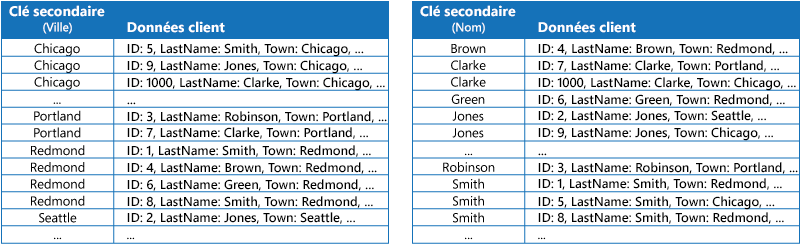
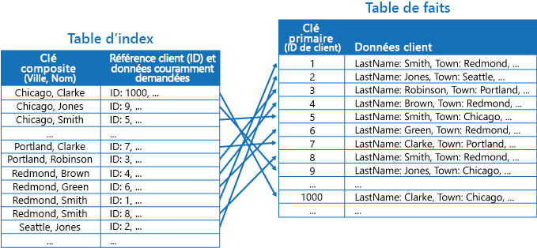
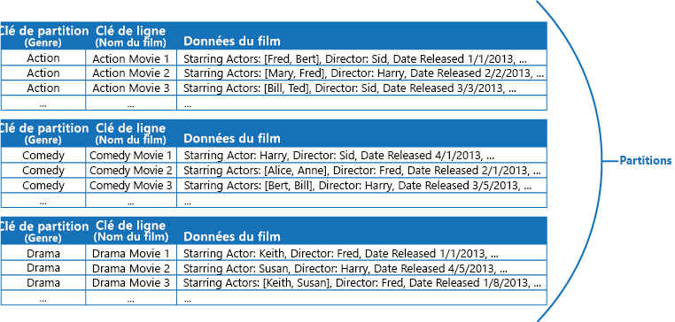

# Modèle de table d’index

[!INCLUDE [header](../_includes/header.md)]

Créez des index sur les champs des magasins de données qui sont souvent référencés par les requêtes. Ce modèle peut améliorer les performances de requêtes en permettant aux applications de localiser plus rapidement les données à extraire d’un magasin de données.

## Contexte et problème

De nombreux magasins de données organisent les données pour une collection d’entités à l’aide de la clé primaire. Une application peut utiliser cette clé pour localiser et récupérer des données. L’illustration présente un exemple de magasin de données contenant des informations client. La clé primaire est l’ID client. L’illustration présente les informations client classées par la clé primaire (ID client).

Alors que la clé primaire est utile pour les requêtes qui extraient des données en fonction de la valeur de cette clé, une application peut ne pas être en mesure d’utiliser la clé primaire si elle a besoin de récupérer des données basées sur un autre champ. Dans l’exemple du client, une application ne peut pas utiliser la clé primaire d’ID client pour récupérer les clients si elle interroge les données uniquement en référençant la valeur d’un autre attribut, tel que la ville dans laquelle se trouve le client. Pour effectuer une requête comme celle-ci, l’application devra peut-être extraire et examiner chaque enregistrement client, ce qui peut être un processus assez lent.

De nombreux systèmes de gestion de base de données relationnelle prennent en charge les index secondaires. Un index secondaire est une structure de données distincte, organisée par un ou plusieurs champs de clé non primaires (secondaires), et il indique où sont stockées les données pour chaque valeur indexée. Les éléments dans un index secondaire sont généralement triés en fonction de la valeur des clés secondaires pour permettre une recherche rapide des données. Ces index sont généralement gérés automatiquement par le système de gestion de base de données.

Vous pouvez créer autant d’index secondaires que nécessaire pour prendre en charge les différentes requêtes effectuées par votre application. Par exemple, il est utile d’ajouter un index secondaire sur le champ Ville dans une table Clients d’une base de données relationnelle dans laquelle l’ID client est la clé primaire, si l’application recherche fréquemment des clients selon la ville dans laquelle ils résident.

Toutefois, bien que les index secondaires soient courants dans les systèmes relationnels, la plupart des magasins de données NoSQL utilisés par les applications cloud ne fournissent pas de fonctionnalité équivalente.

## Solution

Si le magasin de données ne prend pas en charge les index secondaires, vous pouvez les émuler manuellement en créant vos propres tables d’index. Une table d’index organise les données selon une clé spécifiée. Trois stratégies sont généralement utilisées pour structurer une table d’index, selon le nombre d’index secondaires requis et la nature des requêtes effectuées par une application.

La première stratégie consiste à dupliquer les données dans chaque table d’index, mais en les organisant selon différentes clés (dénormalisation complète). La figure suivante présente des tables d’index qui organisent les mêmes informations client par ville et par nom de famille.

Cette stratégie est appropriée si les données sont relativement statiques par rapport au nombre de fois où elles sont recherchées à l’aide de chaque clé. Si les données sont plus dynamiques, les frais de traitement pour la gestion de chaque table d’index deviennent trop importants pour que cette approche soit utile. En outre, si le volume de données est très important, la quantité d’espace nécessaire pour stocker les données dupliquées sera considérable.

La seconde stratégie consiste à créer des tables d’index normalisées organisées selon différentes clés, et à référencer les données d’origine à l’aide de la clé primaire au lieu de les dupliquer, comme indiqué dans l’illustration suivante. Les données d’origine sont appelées table de faits.

Cette technique économise de l’espace et réduit les frais de gestion des données dupliquées. L’inconvénient est qu’une application doit effectuer deux opérations de recherche pour trouver des données à l’aide d’une clé secondaire. Elle doit trouver la clé primaire pour les données dans la table d’index, puis utiliser la clé primaire pour rechercher les données dans la table de faits.

La troisième stratégie consiste à créer des tables d’index partiellement normalisées organisées selon différentes clés qui dupliquent les champs fréquemment récupérés. Référencez la table de faits pour accéder à des champs moins utilisés. La prochaine figure illustre comment les données fréquemment utilisées sont dupliquées dans chaque table d’index.

Avec cette stratégie, vous pouvez trouver un équilibre entre les deux premières méthodes. Les données des requêtes courantes peuvent être récupérées rapidement à l’aide d’une seule recherche, même si les frais de maintenance et d’espace ne sont pas aussi importants que pour la duplication de l’ensemble de données.

Si une application recherche fréquemment des données en spécifiant une combinaison de valeurs (par exemple, « Rechercher tous les clients qui vivent à Redmond et qui ont pour nom de famille Smith »), vous pouvez implémenter les clés dans les éléments dans la table d’index comme une concaténation de l’attribut Ville et de l’attribut Nom de famille. La figure suivante illustre une table d’index basée sur des clés composites. Les clés sont classées par Ville, puis par Nom de famille pour les enregistrements qui ont la même valeur pour l’attribut Ville.

Les tables d’index peuvent accélérer les opérations de requête sur les données partitionnées, et sont particulièrement utiles lorsque la clé de partition est hachée. La figure suivante présente un exemple où la clé de partition est un hachage de l’ID client. La table d’index peut organiser les données par des valeurs non hachées (Ville et Nom de famille) et fournir la clé de partition hachée en tant que données de recherche. Cela peut empêcher l’application de calculer à plusieurs reprises les clés de hachage (ce qui s’avère être une opération coûteuse) si elle a besoin de récupérer des données contenues dans une plage, ou d’extraire des données dans l’ordre de la clé non hachée. Par exemple, le système peur résoudre rapidement une requête telle que « Rechercher tous les clients qui vivent à Redmond » en repérant les éléments correspondants dans la table d’index, dans laquelle ils sont tous stockés dans un bloc contigu. Ensuite, suivez les références jusqu’aux données clients à l’aide des clés de partition stockées dans la table d’index.

## Problèmes et considérations

Prenez en compte les points suivants lorsque vous choisissez comment implémenter ce modèle :

- Les frais de gestion des index secondaires peuvent être importants. Vous devez analyser et comprendre les requêtes utilisées par votre application. Créez uniquement des tables d’index si elles doivent être utilisées régulièrement. Ne créez pas de tables d’index spéculatives pour prendre en charge les requêtes qu’une application ne peut pas réaliser, ou qu’elle ne peut réaliser que de manière occasionnelle.
- La duplication des données dans une table d’index peut générer des frais importants au niveau des coûts de stockage et des efforts requis pour gérer plusieurs copies de données.
- L’implémentation d’une table d’index en tant que structure normalisée qui référence les données d’origine nécessite l’exécution de deux opérations de recherche par une application, afin de trouver des données. La première opération examine la table d’index pour récupérer la clé primaire, et la seconde utilise la clé primaire pour extraire les données.
- Si un système incorpore un certain nombre de tables d’index sur des jeux de données très volumineux, il peut être difficile de maintenir la cohérence entre les tables d’index et les données d’origine. Il est possible de concevoir l’application autour du modèle de cohérence éventuelle. Par exemple, pour insérer, mettre à jour ou supprimer des données, une application peut publier un message dans une file d’attente et laisser une tâche distincte effectuer l’opération et gérer les tables d’index qui référencent ces données de manière asynchrone. Pour en savoir plus sur l’implémentation de cohérence éventuelle, voir [Manuel d’introduction à la cohérence des données](https://msdn.microsoft.com/library/dn589800.aspx).

   >  Les tables de stockage Microsoft Azure prennent en charge les mises à jour transactionnelles pour les modifications apportées aux données contenues dans la même partition (désignées comme transactions de groupe d’entités). Si vous pouvez stocker les données pour une table de faits et une ou plusieurs tables d’index dans la même partition, vous pouvez utiliser cette fonctionnalité pour assurer la cohérence.

- Les tables d’index peuvent elles-mêmes être partitionnées ou fractionnées.

## Quand utiliser ce modèle

Utilisez ce modèle pour améliorer les performances des requêtes lorsqu’une application doit fréquemment récupérer des données à l’aide d’une clé autre que la clé primaire (ou de partition).

Ce modèle peut ne pas avoir d’utilité dans les cas suivants :

- Les données sont volatiles. Une table d’index peut très rapidement devenir obsolète, devenant ainsi inefficace ou engendrant des frais de gestion de la table d’index supérieurs à toutes les économies réalisées en l’utilisant.
- Un champ sélectionné en tant que clé secondaire pour une table d’index est non discriminatoire et ne peut posséder qu’un petit ensemble de valeurs (par exemple, sexe).
- L’équilibre entre les valeurs de données pour un champ sélectionné en tant que clé secondaire pour une table d’index est extrêmement faussé. Par exemple, si 90 % des enregistrements contiennent la même valeur dans un champ, alors la création et la gestion d’une table d’index pour rechercher des données en fonction de ce champ peuvent engendrer plus de frais qu’une analyse des données faite de manière séquentielle. Toutefois, si des requêtes ciblent très fréquemment des valeurs qui se trouvent dans les 10 % restants, cet index peut être utile. Vous devez comprendre les requêtes que votre application exécute, ainsi que la fréquence à laquelle elles sont réalisées.

## Exemple

Les tables de stockage Azure fournissent un magasin de clés hautement évolutives/données de valeur pour les applications en cours d’exécution dans le cloud. Les applications stockent et récupèrent des valeurs de données en spécifiant une clé. Les valeurs de données peuvent contenir plusieurs champs, mais la structure d’un élément de données est opaque pour le stockage de table, qui gère simplement un élément de données comme un tableau d’octets.

Les tables de stockage Azure prennent également en charge le partitionnement. La clé de partitionnement comprend deux éléments, une clé de partition et une clé de ligne. Les éléments qui ont la même clé de partition sont stockés dans la même partition. Dans une partition, les éléments sont stockés dans l’ordre de clé de ligne. Le stockage de table est optimisé pour l’exécution de requêtes qui récupèrent les données comprises dans une plage contiguë de valeurs de clé de ligne dans une partition. Si vous générez des applications cloud qui stockent des informations dans les tables Azure, vous devez structurer vos données en tenant compte de cette fonctionnalité.

Par exemple, imaginez une application qui stocke des informations sur des films. L’application recherche souvent les films par genre (action, documentaire, historique, comédie, drame, etc). Vous pouvez créer une table Azure avec des partitions pour chaque genre en utilisant le genre comme clé de partition, et en spécifiant le nom du film comme clé de ligne, comme indiqué dans la figure suivante.

Cette approche est moins efficace si l’application doit également rechercher les films par acteur principal. Dans ce cas, vous pouvez créer une table Azure distincte, qui agit en tant que table d’index. La clé de partition est l’acteur et la clé de ligne est le nom du film. Les données de chaque acteur doivent être stockées dans des partitions distinctes. Si un film comprend plusieurs acteurs, on trouvera le même film dans plusieurs partitions.

Vous pouvez dupliquer les données de film dans les valeurs contenues par chaque partition en adoptant la première approche décrite dans la section Solution ci-dessus. Toutefois, il est probable que chaque film soit répliqué plusieurs fois (une fois pour chaque acteur) ; il serait donc plus efficace de dénormaliser partiellement les données pour prendre en charge les requêtes les plus courantes (par exemple, les noms des autres acteurs) et permettre à une application de récupérer tous les détails restants en incluant la clé de partition nécessaire pour trouver les informations complètes dans les partitions du genre. Cette approche est décrite par la troisième option dans la section Solution. La figure suivante illustre cette approche.

## Conseils et modèles connexes

Les modèles et les conseils suivants peuvent aussi présenter un intérêt quand il s’agit d’implémenter ce modèle :

- [Manuel d’introduction à la cohérence des données](https://msdn.microsoft.com/library/dn589800.aspx). Une table d’index doit être gérée lorsque les données qu’elle indexe changent. Dans le cloud, il n’est pas toujours possible ou approprié de réaliser des opérations qui mettent à jour un index dans le cadre de la même transaction qui modifie les données. Dans ce cas, une approche cohérente est plus adaptée. Fournit des informations sur les problèmes de cohérence éventuelle.
- [Modèle de partitionnement](https://msdn.microsoft.com/library/dn589797.aspx). Le modèle de table d’index est souvent utilisé conjointement avec les données partitionnées à l’aide de partitions. Le modèle de partitionnement fournit plus d’informations sur la manière de diviser un magasin de données dans un ensemble de partitions.
- [Modèle de vue matérialisée](materialized-view.md). Au lieu d’indexer les données pour prendre en charge les requêtes qui synthétisent les données, il peut être plus approprié de créer une vue matérialisée des données. Décrit le mode de prise en charge des requêtes de résumé efficaces en générant des vues préremplies sur les données.
