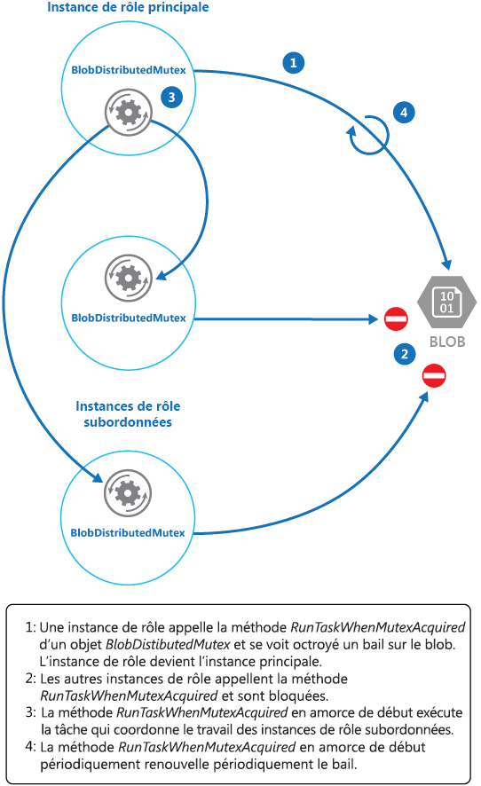

# <a name="leader-election-pattern"></a>Modèle d’élection du responsable

[!INCLUDE [header](../_includes/header.md)]

Coordonnez les actions effectuées par un ensemble d’instances de collaboration dans une application distribuée en élisant l’instance responsable qui sera chargée de gérer les autres. Vous pourrez ainsi éviter les conflits entre les instances, la contention pour des ressources partagées ou des interférences inopinées avec le travail effectué par d’autres instances.

## <a name="context-and-problem"></a>Contexte et problème

Une application cloud type a de nombreuses tâches simultanées à coordonner. Ces tâches peuvent toutes être des instances exécutant le même code et accédant aux mêmes ressources. Elles peuvent aussi travailler ensemble en parallèle pour effectuer chacune leur part d’un calcul complexe.

Si les instances de tâche s’exécutent la plupart du temps séparément, il peut aussi s’avérer nécessaire de coordonner leurs actions individuelles pour éviter les conflits, la contention pour des ressources partagées ou des interférences inopinées avec le travail effectué par d’autres instances de tâche.

Par exemple : 

- Dans un système cloud qui implémente une mise à l’échelle horizontale, plusieurs instances d’une même tâche peuvent s’exécuter en même temps, chaque instance servant un utilisateur différent. Si ces instances écrivent dans une ressource partagée, il est nécessaire de coordonner leurs actions pour éviter que chaque instance remplace les modifications apportées par les autres.
- Si les tâches effectuent chacune en parallèle une partie d’un calcul complexe, les résultats doivent être agrégés une fois que toutes les tâches sont terminées.

Les instances de tâche étant toutes des homologues, il n’y a pas de responsable naturel pouvant faire office de coordinateur ou d’agrégateur.

## <a name="solution"></a>Solution

Une instance de tâche unique doit être élue pour remplir le rôle de responsable dans le but de coordonner les actions des autres instances de tâche subordonnée. Si toutes les instances de tâche exécutent le même code, chacune est capable de jouer le rôle de responsable. Par conséquent, l’élection doit être gérée avec soin pour éviter que plusieurs instances occupent le rôle de responsable en même temps.

Le mécanisme de sélection du responsable proposé par le système doit être fiable. Cette méthode doit faire face à certains événements tels que les pannes réseau ou les échecs de processus. Dans bon nombre de solutions, les instances de tâche subordonnée surveillent le responsable via une méthode de vérification des pulsations d’un certain type ou par l’interrogation. Si le responsable désigné s’arrête de manière inattendue ou si les instances de tâche subordonnée ne peuvent plus y accéder du fait d’une défaillance réseau, elles doivent élire un nouveau responsable.

Il existe plusieurs stratégies pour élire un responsable parmi différentes tâches au sein d’un environnement distribué, à savoir :

- Choix de l’instance de tâche dont l’ID de processus ou d’instance est le plus faiblement classé.
- Course à l’acquisition d’un mutex partagé et distribué. La première instance de tâche qui acquiert le mutex est le responsable. Cependant, le système doit garantir que si le responsable s’arrête ou se déconnecte du reste du système, le mutex est libéré pour permettre à une autre instance de tâche de devenir le responsable.
- Implémentation de l’un des algorithmes d’élection du responsable courants tels que l’[algorithme du plus fort (Bully)](https://www.cs.colostate.edu/~cs551/CourseNotes/Synchronization/BullyExample.html) ou l’[algorithme en anneau (Ring)](https://www.cs.colostate.edu/~cs551/CourseNotes/Synchronization/RingElectExample.html). Ces algorithmes considèrent que chaque candidat à l’élection possède un ID unique et qu’il peut communiquer de manière fiable avec les autres candidats.

## <a name="issues-and-considerations"></a>Problèmes et considérations

Prenez en compte les points suivants lorsque vous choisissez comment implémenter ce modèle :

- Le processus d’élection d’un responsable doit être résilient face aux défaillances temporaires et permanentes.
- Une défaillance du responsable ou son indisponibilité (par exemple, suite à un échec de communication) doit pouvoir être détectée. Les exigences de rapidité de détection varient en fonction du système. Certains systèmes peuvent fonctionner sans responsable pendant un bref laps de temps, au cours duquel une défaillance temporaire pourra éventuellement être résolue. Dans d’autres cas, la défaillance du responsable doit être détectée immédiatement de façon à déclencher une nouvelle élection.
- Dans un système qui implémente une mise à l’échelle automatique horizontale, le responsable peut s’arrêter si le système diminue ses capacités et retire certaines ressources informatiques.
- L’utilisation d’un mutex partagé et distribué crée une dépendance vis-à-vis du service externe qui fournit le mutex. Le service constitue un point de défaillance unique. S’il devient inaccessible pour une raison quelconque, le système ne peut plus élire de responsable.
- L’utilisation d’un processus dédié unique comme responsable est une approche simple. Cependant, si le processus subit une défaillance, son redémarrage risque de prendre beaucoup de temps. Or, la latence qui en découle peut nuire aux performances et aux temps de réponse des autres processus si ceux-ci attendent que le responsable coordonne une opération.
- L’implémentation manuelle de l’un des algorithmes d’élection du responsable offre davantage de souplesse quand il s’agit d’ajuster et d’optimiser le code.

## <a name="when-to-use-this-pattern"></a>Quand utiliser ce modèle

Utilisez ce modèle quand les tâches au sein d’une application distribuée, telle qu’une solution hébergé dans le cloud, a besoin d’une coordination minutieuse et qu’il n’existe pas de responsable naturel.

> Évitez de faire du responsable un goulot d’étranglement dans le système. Le rôle du responsable est de coordonner le travail lié aux tâches subordonnées. Il n’est pas nécessairement tenu de participer à ce travail proprement dit, même s’il doit être en mesure de le faire si la tâche n’est pas élue responsable.

Ce modèle peut ne pas avoir d’utilité dans les cas suivants :

- Il existe un responsable naturel ou un processus dédié qui peut toujours faire office de responsable. Par exemple, il est peut-être possible d’implémenter un processus de singleton qui coordonne les instances de tâche. Si ce processus échoue ou devient instable, le système peut l’arrêter et le redémarrer.
- La coordination entre les tâches peut être accomplie en utilisant une méthode plus légère. Par exemple, si plusieurs instances de tâche ont simplement besoin d’un accès coordonné à une ressource partagée, une meilleure solution est d’utiliser le verrouillage optimiste ou pessimiste pour contrôler l’accès.
- Une solution tierce est plus appropriée. Par exemple, le service Microsoft Azure HDInsight (basé sur Apache Hadoop) utilise les services fournis par Apache Zookeeper pour coordonner le mappage et réduire les tâches qui collectent et synthétisent les données.

## <a name="example"></a>Exemples

Le projet DistributedMutex de la solution LeaderElection (un exemple illustrant ce modèle est disponible sur [GitHub](https://github.com/mspnp/cloud-design-patterns/tree/master/leader-election)) montre comment utiliser un bail sur un objet blob Stockage Microsoft Azure pour fournir un mécanisme permettant d’implémenter un mutex partagé et distribué. Ce mutex peut être utilisé pour élire un responsable parmi un groupe d’instances de rôle dans un service cloud Azure. La première instance de rôle à acquérir le bail est élue responsable et le reste jusqu’à ce qu’elle libère le bail ou qu’elle ne puisse pas le renouveler. Les autres instances de rôle peuvent continuer à surveiller le bail de l’objet blob si le responsable n’est plus disponible.

> Un bail d’objet blob est un verrou d’écriture exclusif sur un objet blob. Un même objet blob peut être l’objet d’un seul bail à un instant donné. Une instance de rôle peut demander un bail sur un objet blob spécifié, qui lui sera accordé si aucune autre instance de rôle ne détient un bail sur le même objet blob. Dans le cas contraire, la demande lèvera une exception.
>
> Pour éviter qu’une instance de rôle en échec conserve le bail indéfiniment, spécifiez une durée de vie pour le bail. Une fois arrivé à expiration, le bail deviendra disponible. Cependant, une instance de rôle peut demander à ce que le bail qu’elle détient lui soit renouvelé. Il lui est alors accordé pour une période supplémentaire. L’instance de rôle peut répéter continuellement ce processus si elle souhaite conserver le bail.
> Pour plus d’informations sur la façon de louer un objet blob, consultez [Louer un objet blob (API REST)](https://msdn.microsoft.com/library/azure/ee691972.aspx).

La classe `BlobDistributedMutex` dans l’exemple C# suivant contient la méthode `RunTaskWhenMutexAquired` qui permet à une instance de rôle de tenter d’acquérir un bail sur un objet blob spécifié. Les détails de l’objet blob (nom, conteneur et compte de stockage) sont passés au constructeur dans un objet `BlobSettings` au moment où l’objet `BlobDistributedMutex` est créé (cet objet est un struct simple qui est inclus dans l’exemple de code). Le constructeur accepte aussi un `Task` qui fait référence au code que doit exécuter l’instance de rôle si elle réussit à acquérir le bail sur l’objet blob et est élue responsable. Notez que le code qui gère les détails de bas niveau de l’acquisition du bail est implémenté dans une classe d’assistance distincte nommée `BlobLeaseManager`.

```csharp
public class BlobDistributedMutex
{
  ...
  private readonly BlobSettings blobSettings;
  private readonly Func<CancellationToken, Task> taskToRunWhenLeaseAcquired;
  ...

  public BlobDistributedMutex(BlobSettings blobSettings,
           Func<CancellationToken, Task> taskToRunWhenLeaseAquired)
  {
    this.blobSettings = blobSettings;
    this.taskToRunWhenLeaseAquired = taskToRunWhenLeaseAquired;
  }

  public async Task RunTaskWhenMutexAcquired(CancellationToken token)
  {
    var leaseManager = new BlobLeaseManager(blobSettings);
    await this.RunTaskWhenBlobLeaseAcquired(leaseManager, token);
  }
  ...
```

La méthode `RunTaskWhenMutexAquired` dans l’exemple de code ci-dessus appelle la méthode `RunTaskWhenBlobLeaseAcquired` figurant dans l’exemple de code suivant pour acquérir le bail. La méthode `RunTaskWhenBlobLeaseAcquired` s’exécute de façon asynchrone. Si le bail est acquis avec succès, l’instance de rôle est élue responsable. Le rôle du délégué `taskToRunWhenLeaseAcquired` est d’effectuer le travail qui coordonne les autres instances de rôle. Si le bail n’est pas acquis, une autre instance de rôle est élue responsable et l’instance de rôle active reste subordonnée. Notez que `TryAcquireLeaseOrWait` est une méthode d’assistance qui utilise l’objet `BlobLeaseManager` pour acquérir le bail.

```csharp
  private async Task RunTaskWhenBlobLeaseAcquired(
    BlobLeaseManager leaseManager, CancellationToken token)
  {
    while (!token.IsCancellationRequested)
    {
      // Try to acquire the blob lease.
      // Otherwise wait for a short time before trying again.
      string leaseId = await this.TryAquireLeaseOrWait(leaseManager, token);

      if (!string.IsNullOrEmpty(leaseId))
      {
        // Create a new linked cancellation token source so that if either the
        // original token is canceled or the lease can't be renewed, the
        // leader task can be canceled.
        using (var leaseCts =
          CancellationTokenSource.CreateLinkedTokenSource(new[] { token }))
        {
          // Run the leader task.
          var leaderTask = this.taskToRunWhenLeaseAquired.Invoke(leaseCts.Token);
          ...
        }
      }
    }
    ...
  }
```

La tâche démarrée par le responsable s’exécute aussi de façon asynchrone. Pendant l’exécution de cette tâche, la méthode `RunTaskWhenBlobLeaseAquired` figurant dans l’exemple de code suivant tente régulièrement de renouveler le bail. Cela permet de vérifier que l’instance de rôle est toujours responsable. Dans l’exemple de solution, le délai entre les demandes de renouvellement est inférieur à la durée spécifiée du bail pour empêcher une autre instance de rôle d’être élue responsable. Si le renouvellement échoue pour une raison quelconque, la tâche est annulée.

Si le bail ne peut pas être renouvelé ou que la tâche est annulée (peut-être à la suite de l’arrêt de l’instance de rôle), le bail est libéré. À ce stade, cette instance de rôle (ou une autre) peut être élue responsable. L’extrait de code ci-dessous illustre cette partie du processus.

```csharp
  private async Task RunTaskWhenBlobLeaseAcquired(
    BlobLeaseManager leaseManager, CancellationToken token)
  {
    while (...)
    {
      ...
      if (...)
      {
        ...
        using (var leaseCts = ...)
        {
          ...
          // Keep renewing the lease in regular intervals.
          // If the lease can't be renewed, then the task completes.
          var renewLeaseTask =
            this.KeepRenewingLease(leaseManager, leaseId, leaseCts.Token);

          // When any task completes (either the leader task itself or when it
          // couldn't renew the lease) then cancel the other task.
          await CancelAllWhenAnyCompletes(leaderTask, renewLeaseTask, leaseCts);
        }
      }
    }
  }
  ...
}
```

`KeepRenewingLease` est une méthode d’assistance qui utilise l’objet `BlobLeaseManager` pour renouveler le bail. La méthode `CancelAllWhenAnyCompletes` annule les tâches spécifiées comme étant les deux premiers paramètres. Le diagramme suivant illustre l’utilisation de la classe `BlobDistributedMutex` pour élire un responsable et exécuter une tâche qui coordonne les opérations.



L’exemple de code suivant montre comment utiliser la classe `BlobDistributedMutex` dans un rôle de travail. Ce code acquiert un bail sur un objet blob nommé `MyLeaderCoordinatorTask` dans le conteneur du bail au niveau du stockage de développement et indique que le code défini dans la méthode `MyLeaderCoordinatorTask` doit s’exécuter si l’instance de rôle est élue responsable.

```csharp
var settings = new BlobSettings(CloudStorageAccount.DevelopmentStorageAccount,
  "leases", "MyLeaderCoordinatorTask");
var cts = new CancellationTokenSource();
var mutex = new BlobDistributedMutex(settings, MyLeaderCoordinatorTask);
mutex.RunTaskWhenMutexAcquired(this.cts.Token);
...

// Method that runs if the role instance is elected the leader
private static async Task MyLeaderCoordinatorTask(CancellationToken token)
{
  ...
}
```

Notez les points suivants à propos de l’exemple de solution :

- L’objet blob est potentiellement un point de défaillance unique. Si le service BLOB devient indisponible ou n’est pas accessible, le responsable ne pourra pas renouveler le bail et aucune autre instance de rôle ne pourra l’acquérir. Dans ce cas, aucune instance de rôle ne pourra jouer le rôle de responsable. Cependant, le service BLOB étant résilient par sa conception, sa défaillance complète est considérée comme très improbable.
- Si la tâche effectuée par le responsable s’interrompt, il pourra peut-être continuer de renouveler le bail, ce qui empêchera une autre instance de rôle d’acquérir le bail et de s’emparer du rôle de responsable pour coordonner les tâches. Dans la réalité, l’intégrité du responsable doit être vérifiée à intervalles fréquents.
- Le processus d’élection est non déterministe. Vous ne pouvez pas savoir à l’avance laquelle des instances de rôle obtiendra le bail d’objet blob et deviendra responsable.
- L’objet blob utilisé comme cible du bail d’objet blob ne doit pas être utilisé à d’autres fins. Si une instance de rôle tente de stocker des données dans cet objet blob, ces données ne seront pas accessibles, sauf si l’instance de rôle est responsable et détient le bail d’objet blob.

## <a name="related-patterns-and-guidance"></a>Conseils et modèles connexes

Les recommandations suivantes peuvent aussi s’avérer utiles pendant l’implémentation de ce modèle :

- Ce modèle contient un [exemple d’application](https://github.com/mspnp/cloud-design-patterns/tree/master/leader-election) téléchargeable.
- [Mise à l’échelle automatique](https://msdn.microsoft.com/library/dn589774.aspx). il est possible de démarrer et d’arrêter des instances des hôtes de tâche à mesure que la charge varie au niveau de l’application. La mise à l’échelle automatique peut contribuer à maintenir le débit et les performances pendant les périodes d’intense traitement.
- [Recommandations en matière de partitionnement du calcul](https://msdn.microsoft.com/library/dn589773.aspx) : ces recommandations expliquent comment allouer des tâches aux hôtes d’un service cloud dans l’optique de minimiser les coûts de fonctionnement tout en préservant la scalabilité, les performances, la disponibilité et la sécurité du service.
- [Modèle asynchrone basé sur des tâches](https://msdn.microsoft.com/library/hh873175.aspx) :
- exemple illustrant l’[algorithme du plus fort (Bully)](https://www.cs.colostate.edu/~cs551/CourseNotes/Synchronization/BullyExample.html).
- Exemple illustrant l’[algorithme en anneau (Ring)](https://www.cs.colostate.edu/~cs551/CourseNotes/Synchronization/RingElectExample.html).
- [Apache Curator](https://curator.apache.org/), bibliothèque cliente pour Apache ZooKeeper.
- Article [Lease Blob (API REST)](https://msdn.microsoft.com/library/azure/ee691972.aspx) sur MSDN.
