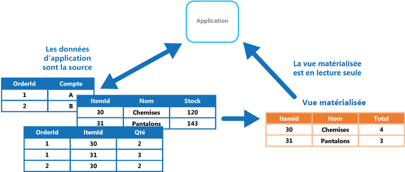
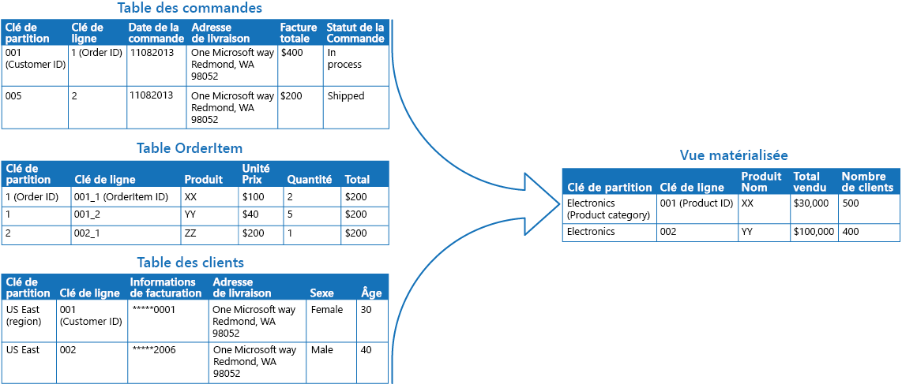

# Modèle de vue matérialiséeMaterialized View pattern

[!INCLUDE [header](../_includes/header.md)]

Générez des vues préremplies sur les données d’un ou de plusieurs magasins de données lorsque les données ne sont pas adéquatement formatées pour les opérations de requête requises.Generate prepopulated views over the data in one or more data stores when the data isn't ideally formatted for required query operations. Cela peut aider à la prise en charge efficace des requêtes et de l’extraction de données, et améliorer les performances de l’application.This can help support efficient querying and data extraction, and improve application performance.

## Contexte et problèmeContext and problem

Lorsque vous stockez des données, la priorité pour les développeurs et les administrateurs de données porte souvent sur la méthode de stockage des données, et non sur leur lecture.When storing data, the priority for developers and data administrators is often focused on how the data is stored, as opposed to how it's read. En général, le format de stockage choisi est étroitement lié au format des données, aux exigences de gestion de la taille des données et de l’intégrité des données, ainsi qu’au type de magasin utilisé.The chosen storage format is usually closely related to the format of the data, requirements for managing data size and data integrity, and the kind of store in use. Par exemple, lorsque vous utilisez le stockage de documents NoSQL, les données sont souvent représentées comme une série d’agrégats, contenant chacun toutes les informations de cette entité.For example, when using NoSQL document store, the data is often represented as a series of aggregates, each containing all of the information for that entity.

Toutefois, cela peut avoir un effet négatif sur les requêtes.However, this can have a negative effect on queries. Lorsqu’une requête nécessite uniquement un sous-ensemble des données de certaines entités (par exemple, un résumé des commandes de plusieurs clients sans tous les détails des commandes), il faut extraire toutes les données des entités pertinentes afin d’obtenir les informations requises.When a query only needs a subset of the data from some entities, such as a summary of orders for several customers without all of the order details, it must extract all of the data for the relevant entities in order to obtain the required information.

## SolutionSolution

Pour une prise en charge efficace des requêtes, une solution courante consiste à générer, à l’avance, une vue qui matérialise les données dans un format adapté à l’ensemble de résultats requis.To support efficient querying, a common solution is to generate, in advance, a view that materializes the data in a format suited to the required results set. Le modèle de vue matérialisée décrit la génération de vues préremplies de données dans les environnements où la source de données n’est pas dans un format approprié pour les requêtes, où il est difficile de générer une requête appropriée et où les performances des requêtes sont faibles en raison de la nature de la les données ou du magasin de données.The Materialized View pattern describes generating prepopulated views of data in environments where the source data isn't in a suitable format for querying, where generating a suitable query is difficult, or where query performance is poor due to the nature of the data or the data store.

Ces vues matérialisées, qui contiennent uniquement les données requises par une requête, permettent aux applications d’obtenir rapidement les informations que dont elles ont besoin.These materialized views, which only contain data required by a query, allow applications to quickly obtain the information they need. En plus des jointures de tables ou de la combinaison des entités de données, les vues matérialisées peuvent inclure les valeurs actuelles des colonnes calculées ou des éléments de données, les résultats de la combinaison de valeurs ou de l’exécution de transformations sur les éléments de données, et les valeurs spécifiées dans le cadre de la requête.In addition to joining tables or combining data entities, materialized views can include the current values of calculated columns or data items, the results of combining values or executing transformations on the data items, and values specified as part of the query. Une vue matérialisée peut même être optimisée pour une seule requête.A materialized view can even be optimized for just a single query.

Important : une vue matérialisée (avec les données qu’elle contient) peut être complètement supprimée, car elle peut être reconstruite entièrement à partir des magasins de données source.A key point is that a materialized view and the data it contains is completely disposable because it can be entirely rebuilt from the source data stores. Une vue matérialisée n’est jamais mise à jour directement par une application, et il s’agit donc d’un cache spécialisé.A materialized view is never updated directly by an application, and so it's a specialized cache.

En cas de modification des données source de la vue, celle-ci doit être mise à jour pour inclure les nouvelles informations.When the source data for the view changes, the view must be updated to include the new information. Vous pouvez planifier l’exécution de cette action automatiquement ou lorsque le système détecte une modification des données d’origine.You can schedule this to happen automatically, or when the system detects a change to the original data. Dans certains cas, il peut être nécessaire de régénérer la vue manuellement.In some cases it might be necessary to regenerate the view manually. L’illustration montre un exemple d’utilisation du modèle de vue matérialisée.The figure shows an example of how the Materialized View pattern might be used.

## Problèmes et considérationsIssues and considerations

Prenez en compte les points suivants lorsque vous choisissez comment implémenter ce modèle :Consider the following points when deciding how to implement this pattern:

Comment et quand la vue sera mise à jour.How and when the view will be updated. Dans l’idéal, il se régénère en réponse à un événement une modification des données source, bien que cela puisse entraîner une charge excessive si les données source changent rapidement.Ideally it'll regenerate in response to an event indicating a change to the source data, although this can lead to excessive overhead if the source data changes rapidly. Vous pouvez également envisager d’utiliser une tâche planifiée, un déclencheur externe ou une action manuelle pour régénérer la vue.Alternatively, consider using a scheduled task, an external trigger, or a manual action to regenerate the view.

Dans certains systèmes (par exemple, lorsque vous utilisez le modèle d’approvisionnement en événements pour tenir à jour un magasin contenant uniquement les événements qui ont modifié les données), les vues matérialisées sont nécessaires.In some systems, such as when using the Event Sourcing pattern to maintain a store of only the events that modified the data, materialized views are necessary. Le préremplissage des vues en examinant tous les événements pour déterminer l’état actuel peut être la seule façon d’obtenir des informations à partir du magasin d’événements.Prepopulating views by examining all events to determine the current state might be the only way to obtain information from the event store. Si vous n’utilisez pas l’approvisionnement en événements, vous devez déterminer si une vue matérialisée est utile ou non.If you're not using Event Sourcing, you need to consider whether a materialized view is helpful or not. Les vues matérialisées sont généralement adaptées à une requête ou à un petit nombre de requêtes.Materialized views tend to be specifically tailored to one, or a small number of queries. Si de nombreuses requêtes sont utilisées, les vues matérialisées peuvent entraîner des besoins en capacité de stockage et des coûts de stockage inacceptables.If many queries are used, materialized views can result in unacceptable storage capacity requirements and storage cost.

Tenez compte de l’impact sur la cohérence des données lors de la génération de la vue, ainsi que du moment de mise à jour de la vue si cela se produit selon une planification.Consider the impact on data consistency when generating the view, and when updating the view if this occurs on a schedule. Si la source de données change au point où la vue est générée, la copie des données dans la vue ne sera pas entièrement cohérente avec les données d’origine.If the source data is changing at the point when the view is generated, the copy of the data in the view won't be fully consistent with the original data.

Déterminez où vous allez stocker la vue.Consider where you'll store the view. La vue ne doit pas forcément se trouver dans le même magasin ou la même partition que les données d’origine.The view doesn't have to be located in the same store or partition as the original data. Il peut s’agir d’un sous-ensemble de quelques partitions différentes combinées.It can be a subset from a few different partitions combined.

Une vue perdue peut être reconstruite.A view can be rebuilt if lost. Par conséquent, si la vue est temporaire et utilisée uniquement pour améliorer les performances des requêtes en reflétant l’état actuel des données, ou améliorer l’évolutivité, elle peut être stockée dans un cache ou dans un emplacement moins fiable.Because of that, if the view is transient and is only used to improve query performance by reflecting the current state of the data, or to improve scalability, it can be stored in a cache or in a less reliable location.

Lorsque vous définissez une vue matérialisée, optimisez sa valeur en ajoutant des éléments de données ou des colonnes qui reposent sur un calcul ou une transformation des éléments de données existants, sur les valeurs transmises dans la requête ou sur des combinaisons de ces valeurs, le cas échéant.When defining a materialized view, maximize its value by adding data items or columns to it based on computation or transformation of existing data items, on values passed in the query, or on combinations of these values when appropriate.

Si le mécanisme de stockage le prend en charge, pensez à indexer la vue matérialisée pour accroître davantage les performances.Where the storage mechanism supports it, consider indexing the materialized view to further increase performance. La plupart des bases de données relationnelles prennent en charge l’indexation pour les vues, tout comme les solutions Big Data basées sur Apache Hadoop.Most relational databases support indexing for views, as do big data solutions based on Apache Hadoop.

## Quand utiliser ce modèleWhen to use this pattern

Ce modèle est utile dans les situations suivantes :This pattern is useful when:

- Création de vues matérialisées sur des données qui sont difficiles à interroger directement, ou lorsque les requêtes doivent être très complexes pour extraire des données stockées d’une manière normalisée, non structurée ou semi-structurée.Creating materialized views over data that's difficult to query directly, or where queries must be very complex to extract data that's stored in a normalized, semi-structured, or unstructured way.
- Création de vues temporaires qui peuvent améliorer considérablement les performances des requêtes ou servir directement de vues source ou d’objets de transfert de données pour l’interface utilisateur, pour la création de rapports ou pour l’affichage.Creating temporary views that can dramatically improve query performance, or can act directly as source views or data transfer objects for the UI, for reporting, or for display.
- Prise en charge occasionnelle de scénarios connectés ou déconnectés où la connexion au magasin de données n’est pas toujours disponible.Supporting occasionally connected or disconnected scenarios where connection to the data store isn't always available. La vue peut être mise en cache localement dans ce cas.The view can be cached locally in this case.
- Simplification des requêtes et exposition de données pour une expérimentation d’une manière qui ne nécessite pas la connaissance du format des données source.Simplifying queries and exposing data for experimentation in a way that doesn't require knowledge of the source data format. Par exemple, jointure de tables différentes dans une ou plusieurs bases de données, ou un ou plusieurs domaines dans des banques NoSQL, puis formatage des données en fonction de leur éventuelle utilisation.For example, by joining different tables in one or more databases, or one or more domains in NoSQL stores, and then formatting the data to fit its eventual use.
- Fourniture d’accès à des sous-ensembles spécifiques des données source qui, pour des raisons de confidentialité ou de sécurité, ne doivent pas être accessibles par tous, modifiables ou entièrement exposées aux utilisateurs.Providing access to specific subsets of the source data that, for security or privacy reasons, shouldn't be generally accessible, open to modification, or fully exposed to users.
- Liaison de différents magasins de données pour tirer parti de leurs fonctionnalités individuelles.Bridging different data stores, to take advantage of their individual capabilities. Par exemple, utilisation d’un magasin cloud efficace pour l’écriture en tant que magasin de données de référence, et d’une base de données relationnelle qui offre des performances acceptables de lecture et d’interrogation pour contenir les vues matérialisées.For example, using a cloud store that's efficient for writing as the reference data store, and a relational database that offers good query and read performance to hold the materialized views.

Ce modèle est inutile dans les situations suivantes :This pattern isn't useful in the following situations:

- La source de données est simple et facile à interroger.The source data is simple and easy to query.
- La source de données change très rapidement ou est accessible sans utilisation d’une vue.The source data changes very quickly, or can be accessed without using a view. Dans ces cas de figure, vous devez éviter la charge de traitement inhérente à la création de vues.In these cases, you should avoid the processing overhead of creating views.
- La cohérence est une priorité élevée.Consistency is a high priority. Parfois, les vues ne sont pas entièrement cohérentes avec les données d’origine.The views might not always be fully consistent with the original data.

## ExemplesExample

L’illustration suivante montre un exemple d’utilisation du modèle de vue matérialisée pour générer une synthèse des ventes.The following figure shows an example of using the Materialized View pattern to generate a summary of sales. Les données des tables Order, OrderItem et Customer situées dans des partitions distinctes d’un compte de stockage Azure sont combinées pour générer une vue contenant la valeur totale des ventes pour chaque produit de la catégorie Electronics, ainsi que le nombre de clients ayant acheté chaque article.Data in the Order, OrderItem, and Customer tables in separate partitions in an Azure storage account are combined to generate a view containing the total sales value for each product in the Electronics category, along with a count of the number of customers who made purchases of each item.

La création de cette vue matérialisée nécessite des requêtes complexes.Creating this materialized view requires complex queries. Toutefois, en exposant les résultats de la requête comme une vue matérialisée, les utilisateurs peuvent facilement obtenir les résultats et les utiliser directement ou les incorporer dans une autre requête.However, by exposing the query result as a materialized view, users can easily obtain the results and use them directly or incorporate them in another query. La vue est susceptible d’être utilisée dans un système de création de rapports ou un tableau de bord. Elle peut être mise à jour de manière planifiée, par exemple chaque semaine.The view is likely to be used in a reporting system or dashboard, and can be updated on a scheduled basis such as weekly.

> Bien que cet exemple utilise le stockage de table Azure, de nombreux systèmes de gestion de base de données relationnelle fournissent également une prise en charge native pour les vues matérialisées.Although this example utilizes Azure table storage, many relational database management systems also provide native support for materialized views.

## Conseils et modèles connexesRelated patterns and guidance

Les modèles et les conseils suivants peuvent aussi présenter un intérêt quand il s’agit d’implémenter ce modèle :The following patterns and guidance might also be relevant when implementing this pattern:

- [Primer de cohérence des données](https://msdn.microsoft.com/library/dn589800.aspx).[Data Consistency Primer](https://msdn.microsoft.com/library/dn589800.aspx). Les informations récapitulatives d’une vue matérialisée doivent être tenues à jour afin de refléter les valeurs de données sous-jacentes.The summary information in a materialized view has to be maintained so that it reflects the underlying data values. Lorsque les valeurs de données changent, il n’est pas pratique de mettre à jour les données de synthèse en temps réel. À la place, vous devez adopter une approche cohérente.As the data values change, it might not be practical to update the summary data in real time, and instead you'll have to adopt an eventually consistent approach. Résume les problèmes se rapportant au maintient de la cohérence des données distribuées, et décrit les avantages et les compromis des différents modèles de cohérence.Summarizes the issues surrounding maintaining consistency over distributed data, and describes the benefits and tradeoffs of different consistency models.
- [Modèle de séparation des responsabilités en matière de commande et de requête (CQRS)](./cqrs.md).[Command and Query Responsibility Segregation (CQRS) pattern](./cqrs.md). Utilisez ce modèle pour mettre à jour les informations contenues dans une vue matérialisée en réponse aux événements qui se produisent lorsque les valeurs de données sous-jacentes changent.Use to update the information in a materialized view by responding to events that occur when the underlying data values change.
- [Modèle d'approvisionnement en événements](./event-sourcing.md).[Event Sourcing pattern](./event-sourcing.md). Utilisez-le conjointement au modèle CQRS pour gérer les informations dans une vue matérialisée.Use in conjunction with the CQRS pattern to maintain the information in a materialized view. Lorsque les valeurs de données sur lesquelles repose une vue matérialisée changent, le système peut déclencher des événements qui décrivent ces modifications et les enregistrent dans un magasin d’événements.When the data values a materialized view is based on are changed, the system can raise events that describe these changes and save them in an event store.
- [Modèle de table d’index](./index-table.md).[Index Table pattern](./index-table.md). Les données d’une vue matérialisée sont généralement organisées par clé primaire, mais les requêtes doivent parfois récupérer les informations de cette vue en examinant les données d’autres champs.The data in a materialized view is typically organized by a primary key, but queries might need to retrieve information from this view by examining data in other fields. Utilisez ce modèle pour créer des index secondaires sur des jeux de données des magasins de données qui ne prennent pas en charge les index secondaires natifs.Use to create secondary indexes over data sets for data stores that don't support native secondary indexes.
