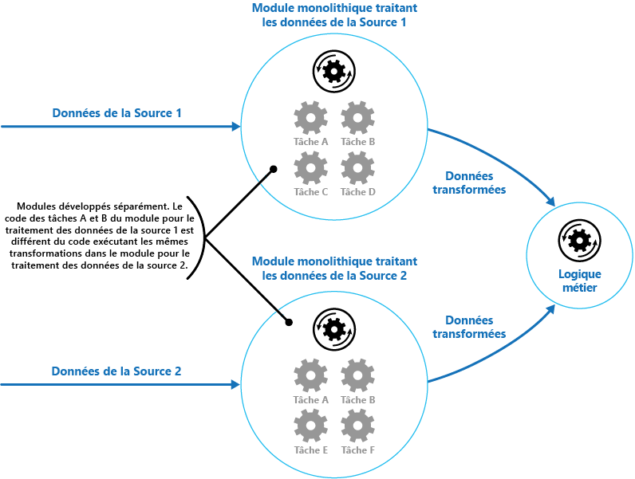
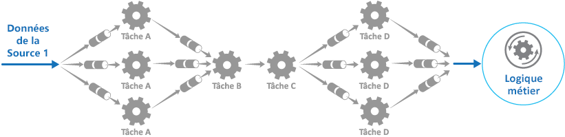
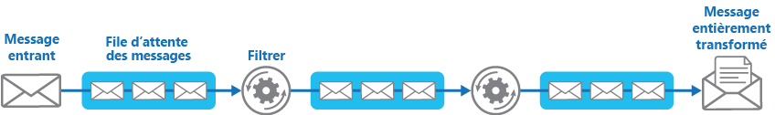

# <a name="pipes-and-filters-pattern"></a>Modèle de canaux et de filtres

[!INCLUDE [header](../_includes/header.md)]

Décomposez une tâche qui exécute un traitement complexe en une série d’éléments séparés qui peuvent être réutilisés. Cela peut améliorer les performances, l’extensibilité et la réutilisabilité en permettant à des éléments de tâches qui effectuent le traitement d’être déployés et mis à l’échelle indépendamment.

## <a name="context-and-problem"></a>Contexte et problème

Une application est nécessaire pour exécuter une série de tâches plus ou moins complexes sur les informations qu’elle traite. Il existe une approche simple, mais assez rigide, permettant d’implémenter une application. Elle consiste à effectuer ce traitement comme un module monolithique. Toutefois, cette approche est susceptible de réduire les opportunités de refactorisation, d’optimisation ou de réutilisation du code, si certaines parties du même processus de traitement doivent être utilisées à un autre emplacement de l’application.

La figure illustre les problèmes de traitement des données à l’aide de l’approche monolithique. Une application reçoit et traite les données de deux sources. Les données de chaque source sont traitées par un module distinct qui effectue une série de tâches pour transformer ces données, avant de passer le résultat vers la logique métier de l’application.



Certaines des tâches que les modules monolithiques effectuent sont très similaires, mais les modules ont été conçus séparément. Le code qui implémente les tâches est étroitement couplé dans un module. Il a été développé avec peu ou aucune attention accordée à la réutilisabilité ou l’extensibilité.

Toutefois, les tâches de traitement effectuées par chaque module, ou les spécifications de déploiement pour chaque tâche, peuvent changer lorsque les besoins de l’entreprise sont mis à jour. Certaines tâches nécessitent beaucoup de ressources système et pourraient tirer avantage du fait d’être exécutées sur un matériel puissant, tandis que d’autres ne nécessitent pas de ressources aussi coûteuses. En outre, un traitement supplémentaire peut être requis dans le futur, ou l’ordre dans lequel les tâches effectuées par le traitement peut changer. Une solution est requise pour résoudre ces problèmes et augmenter les possibilités de réutilisation du code.

## <a name="solution"></a>Solution

Décomposez le traitement requis pour chaque flux en un ensemble de composants distincts (ou de filtres), qui exécuteront chacun une tâche unique. En normalisant le format des données que chaque composant reçoit et envoie, vous pouvez combiner ces filtres dans un pipeline. Cela permet d’éviter la duplication de code et de faciliter la suppression, le remplacement ou l’intégration des composants supplémentaires, si les exigences de traitement changent. La figure suivante illustre une solution implémentée à l’aide de canaux et de filtres.


Le temps nécessaire pour traiter une requête unique dépend de la vitesse du filtre le plus lent dans le pipeline. Un ou plusieurs filtres peuvent être un goulot d’étranglement, surtout si un grand nombre de demandes s’affichent dans un flux à partir d’une source de données particulière. Le principal avantage de la structure du pipeline est qu’elle fournit des possibilités d’exécution d’instances parallèles de filtres lents, permettant au système de répartir la charge et d’améliorer le débit.

Les filtres qui composent un pipeline peuvent être exécutés sur des machines différentes, ce qui permet leur mise à l’échelle de manière indépendante et vous permet de bénéficier de l’élasticité fournie par de nombreux environnements de cloud. Un filtre qui nécessite beaucoup de ressources système peut être exécuté sur du matériel de haute performance, tandis que d’autres filtres moins exigeants peuvent être exécutés sur du matériel standard moins coûteux. Il n’est pas nécessaire que les filtres se trouvent dans le même centre de données ou le même emplacement géographique, ce qui permet que chaque élément dans un pipeline s’exécute dans un environnement proche des ressources qu’il requiert.  La figure suivante montre un exemple appliqué au pipeline pour les données de la source 1.



Si l’entrée et la sortie d’un filtre sont structurées sous forme de flux, il est possible de réaliser le traitement pour chaque filtre en parallèle. Le premier filtre dans le pipeline peut démarrer son travail et sortir ses résultats, qui passent directement au filtre suivant dans la séquence avant que le premier filtre n’ait terminé son travail.

La résilience que ce modèle fournit constitue un autre avantage. Si un filtre échoue ou si l’ordinateur sur lequel il s’exécute n’est plus disponible, le pipeline peut replanifier le travail que le filtre effectuait et diriger ce travail vers une autre instance du composant. L’échec d’un filtre unique n’entraîne pas nécessairement la défaillance du pipeline tout entier.

L’utilisation du modèle de canaux et de filtres conjointement avec le [Modèle de transaction de compensation](compensating-transaction.md) est une approche alternative à l’implémentation des transactions distribuées. Une transaction distribuée peut être décomposée en tâches compensables distinctes, qui peuvent chacune être implémentées à l’aide d’un filtre qui implémente également le modèle de transaction de compensation. Les filtres dans un pipeline peuvent être implémentés en tant que tâches hébergées distinctes s’exécutant près des données qu’ils gèrent.

## <a name="issues-and-considerations"></a>Problèmes et considérations

Prenez en compte les points suivants quand vous choisissez comment implémenter ce modèle :
- **Complexité** : La flexibilité accrue fournie par ce modèle peut également introduire de la complexité, surtout si les filtres dans un pipeline sont répartis sur différents serveurs.

- **Fiabilité**. Utilisez une infrastructure qui permet de s’assurer que la circulation des données entre les filtres dans un pipeline ne sera pas perdue.

- **Idempotence**. Si un filtre dans un pipeline échoue après la réception d’un message et que le travail est replanifié vers une autre instance du filtre, une partie du travail peut déjà être terminée. Si ce travail met à jour certains aspects de l’état global (par exemple, les informations stockées dans une base de données), cette même mise à jour peut être répétée. Un problème similaire peut se produire si un filtre échoue après la publication de ses résultats dans le filtre suivant dans le pipeline, mais avant d’indiquer qu’il a terminé son travail avec succès. Dans ce cas, le même travail peut être répété par une autre instance du filtre, entraînant ainsi une seconde publication des mêmes résultats. Cela peut entraîner un second traitement des mêmes données par les filtres suivants dans le pipeline. Par conséquent, les filtres dans un pipeline doivent être conçus pour être idempotents. Pour en savoir plus, consultez l’article [Idempotency Patterns](https://blog.jonathanoliver.com/idempotency-patterns/) sur le blog de Jonathan Oliver.

- **Répétition des messages**. Si un filtre dans un pipeline échoue après la publication d’un message à l’étape suivante du pipeline, une autre instance du filtre peut être exécutée, qui publiera une copie du même message dans le pipeline. Deux instances du même message seraient alors transmises vers le filtre suivant. Pour éviter cela, le pipeline doit détecter et éliminer les messages en double.

    >  Si vous implémentez le pipeline à l’aide de files d’attente de message (telles que les files d’attente Microsoft Azure Service Bus), l’infrastructure de la file d’attente de messages peut proposer la détection et la suppression automatique des messages en double.

- **Contexte et état**. Dans un pipeline, chaque filtre s’exécute principalement de manière isolée et ne doit pas faire d’estimations concernant la manière dont il a été appelé. Cela signifie que chaque filtre doit être accompagné d’un contexte suffisant pour effectuer son travail. Ce contexte peut inclure une grande quantité d’informations d’état.

## <a name="when-to-use-this-pattern"></a>Quand utiliser ce modèle

Utilisez ce modèle dans les situations suivantes :
- Le traitement requis par une application peut facilement être décomposé en un ensemble d’étapes indépendantes.

- Les étapes de traitement réalisées par une application possèdent différentes exigences d’extensibilité.

    >  Il est possible de regrouper les filtres qui doivent être mis à l’échelle ensemble dans le même processus. Pour en savoir plus, consultez le [Modèle de consolidation des ressources de calcul](compute-resource-consolidation.md).

- Une certaine flexibilité est nécessaire pour permettre la réorganisation des étapes de traitement effectuées par une application ou la possibilité d’ajouter et de supprimer des étapes.

- Le système peut bénéficier de la distribution du traitement des étapes sur différents serveurs.

- Une solution fiable est requise pour minimiser les effets de l’échec dans une étape lors du traitement des données.

Ce modèle peut ne pas avoir d’utilité dans les cas suivants :
- Les étapes de traitement effectuées par une application ne sont pas indépendantes, mais elles doivent être exécutées simultanément dans le cadre de la même transaction.

- La quantité d’informations de contexte ou d’état requise par une étape rend cette approche inefficace. Il est possible de conserver les informations d’état dans une base de données à la place, mais n’utilisez pas cette stratégie si la charge supplémentaire sur la base de données provoque une contention excessive.

## <a name="example"></a>Exemples

Vous pouvez utiliser une séquence de files d’attente de message pour fournir l’infrastructure requise pour implémenter un pipeline. Une file d’attente de messages initiale reçoit des messages non traités. Un composant implémenté en tant que tâche de filtre attend un message dans cette file d’attente, effectue son travail puis publie le message transformé dans la file d’attente suivante dans la séquence. Une autre tâche de filtre peut attendre les messages dans cette file d’attente, les traiter, poster les résultats dans une autre file d’attente, et ainsi de suite jusqu’à ce que les données intégralement transformées s’affichent dans le message final dans la file d’attente. La figure suivante illustre l’implémentation d’un pipeline à l’aide de files d’attente.




Si vous générez une solution sur Azure, vous pouvez utiliser les files d’attente Service Bus pour fournir un mécanisme de file d’attente fiable et évolutif. La classe `ServiceBusPipeFilter` ci-dessous, en C#, montre comment vous pouvez implémenter un filtre qui reçoit des messages d’entrée de la part d’une file d’attente, qui traite ces messages et qui publie les résultats vers une autre file.

>  La classe `ServiceBusPipeFilter` est définie dans le projet PipesAndFilters.Shared disponible à partir de [GitHub](https://github.com/mspnp/cloud-design-patterns/tree/master/pipes-and-filters).

```csharp
public class ServiceBusPipeFilter
{
  ...
  private readonly string inQueuePath;
  private readonly string outQueuePath;
  ...
  private QueueClient inQueue;
  private QueueClient outQueue;
  ...

  public ServiceBusPipeFilter(..., string inQueuePath, string outQueuePath = null)
  {
     ...
     this.inQueuePath = inQueuePath;
     this.outQueuePath = outQueuePath;
  }

  public void Start()
  {
    ...
    // Create the outbound filter queue if it doesn't exist.
    ...
    this.outQueue = QueueClient.CreateFromConnectionString(...);

    ...
    // Create the inbound and outbound queue clients.
    this.inQueue = QueueClient.CreateFromConnectionString(...);
  }

  public void OnPipeFilterMessageAsync(
    Func<BrokeredMessage, Task<BrokeredMessage>> asyncFilterTask, ...)
  {
    ...

    this.inQueue.OnMessageAsync(
      async (msg) =>
    {
      ...
      // Process the filter and send the output to the
      // next queue in the pipeline.
      var outMessage = await asyncFilterTask(msg);

      // Send the message from the filter processor
      // to the next queue in the pipeline.
      if (outQueue != null)
      {
        await outQueue.SendAsync(outMessage);
      }

      // Note: There's a chance that the same message could be sent twice
      // or that a message gets processed by an upstream or downstream
      // filter at the same time.
      // This would happen in a situation where processing of a message was
      // completed, it was sent to the next pipe/queue, and then failed
      // to complete when using the PeekLock method.
      // Idempotent message processing and concurrency should be considered
      // in a real-world implementation.
    },
    options);
  }

  public async Task Close(TimeSpan timespan)
  {
    // Pause the processing threads.
    this.pauseProcessingEvent.Reset();

    // There's no clean approach for waiting for the threads to complete
    // the processing. This example simply stops any new processing, waits
    // for the existing thread to complete, then closes the message pump
    // and finally returns.
    Thread.Sleep(timespan);

    this.inQueue.Close();
    ...
  }

  ...
}
```

La méthode `Start` dans la classe `ServiceBusPipeFilter` se connecte à une paire de files d’attente d’entrée et de sortie, et la méthode `Close` se déconnecte de la file d’attente d’entrée. La méthode `OnPipeFilterMessageAsync` effectue le traitement des messages, le paramètre `asyncFilterTask` de cette méthode spécifie le traitement à effectuer. La méthode `OnPipeFilterMessageAsync` attend les messages entrants dans la file d’attente d’entrée, exécute le code spécifié par le paramètre `asyncFilterTask` sur chaque message qui arrive, et publie les résultats dans la file d’attente de sortie. Les files d’attente elles-mêmes sont spécifiées par le constructeur.

L’exemple de solution implémente les filtres dans un ensemble de rôles de travail. Chaque rôle de travail peut être mis à l’échelle indépendamment, selon la complexité du traitement entreprise qu’il effectue ou des ressources requises pour le traitement. En outre, plusieurs instances de chaque rôle de travail peuvent être exécutées en parallèle pour améliorer le débit.

Le code suivant montre un rôle de travail Azure nommé `PipeFilterARoleEntry`, défini dans le projet PipeFilterA dans l’exemple de solution.

```csharp
public class PipeFilterARoleEntry : RoleEntryPoint
{
  ...
  private ServiceBusPipeFilter pipeFilterA;

  public override bool OnStart()
  {
    ...
    this.pipeFilterA = new ServiceBusPipeFilter(
      ...,
      Constants.QueueAPath,
      Constants.QueueBPath);

    this.pipeFilterA.Start();
    ...
  }

  public override void Run()
  {
    this.pipeFilterA.OnPipeFilterMessageAsync(async (msg) =>
    {
      // Clone the message and update it.
      // Properties set by the broker (Deliver count, enqueue time, ...)
      // aren't cloned and must be copied over if required.
      var newMsg = msg.Clone();

      await Task.Delay(500); // DOING WORK

      Trace.TraceInformation("Filter A processed message:{0} at {1}",
        msg.MessageId, DateTime.UtcNow);

      newMsg.Properties.Add(Constants.FilterAMessageKey, "Complete");

      return newMsg;
    });

    ...
  }

  ...
}
```

Ce rôle contient un objet `ServiceBusPipeFilter`. La méthode `OnStart` dans le rôle se connecte aux files d’attente pour recevoir les messages d’entrée et publier les messages de sortie (les noms des files d’attente sont définis dans la classe `Constants`). La méthode `Run` appelle la méthode `OnPipeFilterMessagesAsync` pour effectuer un traitement sur chaque message reçu (dans cet exemple, le traitement est simulé via une courte attente). Lorsque le traitement est terminé, un nouveau message est construit, contenant les résultats (dans ce cas, le message d’entrée possède une propriété personnalisée ajoutée), et ce message est publié dans la file d’attente de sortie.

L’exemple de code contient un autre rôle de travail nommé `PipeFilterBRoleEntry` dans le projet PipeFilterB. Ce rôle est similaire à `PipeFilterARoleEntry`, à l’exception qu’il effectue un traitement différent dans la méthode `Run`. Dans l’exemple de solution, ces deux rôles sont combinés pour construire un pipeline, la file d’attente de sortie pour le rôle `PipeFilterARoleEntry` est la file d’attente d’entrée pour le rôle `PipeFilterBRoleEntry`.

L’exemple de solution fournit également deux rôles supplémentaires nommés `InitialSenderRoleEntry` (dans le projet InitialSender) et `FinalReceiverRoleEntry` (dans le projet FinalReceiver). Le rôle `InitialSenderRoleEntry` fournit le message initial dans le pipeline. La méthode `OnStart` se connecte à une seule file d’attente et la méthode `Run` publie une méthode pour cette file d’attente. Cette file d’attente est la file d’attente d’entrée utilisée par le rôle `PipeFilterARoleEntry`, ainsi la publication d’un message entraîne la réception et le traitement du message par le rôle `PipeFilterARoleEntry`. Le message traité traverse ensuite le rôle `PipeFilterBRoleEntry`.

La file d’attente d’entrée pour le rôle `FinalReceiveRoleEntry` est la file d’attente de sortie pour le rôle `PipeFilterBRoleEntry`. La méthode `Run` dans le rôle `FinalReceiveRoleEntry`, illustré ci-dessous, reçoit le message et exécute un traitement final. Il écrit ensuite les valeurs des propriétés personnalisées ajoutées par les filtres dans le pipeline à la sortie de trace.

```csharp
public class FinalReceiverRoleEntry : RoleEntryPoint
{
  ...
  // Final queue/pipe in the pipeline to process data from.
  private ServiceBusPipeFilter queueFinal;

  public override bool OnStart()
  {
    ...
    // Set up the queue.
    this.queueFinal = new ServiceBusPipeFilter(...,Constants.QueueFinalPath);
    this.queueFinal.Start();
    ...
  }

  public override void Run()
  {
    this.queueFinal.OnPipeFilterMessageAsync(
      async (msg) =>
      {
        await Task.Delay(500); // DOING WORK

        // The pipeline message was received.
        Trace.TraceInformation(
          "Pipeline Message Complete - FilterA:{0} FilterB:{1}",
          msg.Properties[Constants.FilterAMessageKey],
          msg.Properties[Constants.FilterBMessageKey]);

        return null;
      });
    ...
  }

  ...
}
```

## <a name="related-patterns-and-guidance"></a>Conseils et modèles connexes

Les modèles et les conseils suivants peuvent aussi présenter un intérêt quand il s’agit d’implémenter ce modèle :
- Un exemple illustrant ce modèle est disponible sur [GitHub](https://github.com/mspnp/cloud-design-patterns/tree/master/pipes-and-filters).
- [Modèle des consommateurs concurrents](competing-consumers.md). Un pipeline peut contenir plusieurs instances d’un ou plusieurs filtres. Cette approche est utile pour l’exécution d’instances parallèles de filtres lents, permettant au système de répartir la charge et d’améliorer le débit. Chaque instance d’un filtre est en concurrence avec les autres pour l’entrée, deux instances d’un même filtre ne doivent pas être en mesure de traiter les mêmes données. Fournit une explication de cette approche.
- [Modèle de consolidation des ressources de calcul](compute-resource-consolidation.md). Il est possible de regrouper les filtres qui doivent être mis à l’échelle ensemble dans le même processus. Fournit plus d’informations sur les avantages et les inconvénients de cette stratégie.
- [Modèle de transaction de compensation](compensating-transaction.md). Un filtre peut être implémenté comme une opération qui peut être inversée ou qui possède une opération de compensation qui rétablit la version antérieure de l’état en cas de défaillance. Explique comment cela peut être implémenté pour maintenir ou garantir la cohérence éventuelle.
- [Idempotency Patterns](https://blog.jonathanoliver.com/idempotency-patterns/) sur le blog de Jonathan Oliver.
