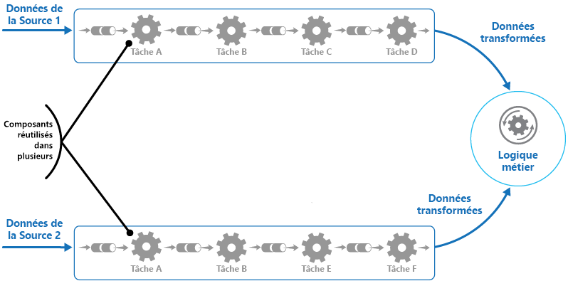

# <a name="pipes-and-filters-pattern"></a><span data-ttu-id="c4f7e-104">Modèle de canaux et de filtres</span><span class="sxs-lookup"><span data-stu-id="c4f7e-104">Pipes and Filters pattern</span></span>

[!INCLUDE [header](../_includes/header.md)]

<span data-ttu-id="c4f7e-105">Décomposez une tâche qui exécute un traitement complexe en une série d’éléments séparés qui peuvent être réutilisés.</span><span class="sxs-lookup"><span data-stu-id="c4f7e-105">Decompose a task that performs complex processing into a series of separate elements that can be reused.</span></span> <span data-ttu-id="c4f7e-106">Cela peut améliorer les performances, l’extensibilité et la réutilisabilité en permettant à des éléments de tâches qui effectuent le traitement d’être déployés et mis à l’échelle indépendamment.</span><span class="sxs-lookup"><span data-stu-id="c4f7e-106">This can improve performance, scalability, and reusability by allowing task elements that perform the processing to be deployed and scaled independently.</span></span>

## <a name="context-and-problem"></a><span data-ttu-id="c4f7e-107">Contexte et problème</span><span class="sxs-lookup"><span data-stu-id="c4f7e-107">Context and problem</span></span>

<span data-ttu-id="c4f7e-108">Une application est nécessaire pour exécuter une série de tâches plus ou moins complexes sur les informations qu’elle traite.</span><span class="sxs-lookup"><span data-stu-id="c4f7e-108">An application is required to perform a variety of tasks of varying complexity on the information that it processes.</span></span> <span data-ttu-id="c4f7e-109">Il existe une approche simple, mais assez rigide, permettant d’implémenter une application. Elle consiste à effectuer ce traitement comme un module monolithique.</span><span class="sxs-lookup"><span data-stu-id="c4f7e-109">A straightforward but inflexible approach to implementing an application is to perform this processing as a monolithic module.</span></span> <span data-ttu-id="c4f7e-110">Toutefois, cette approche est susceptible de réduire les opportunités de refactorisation, d’optimisation ou de réutilisation du code, si certaines parties du même processus de traitement doivent être utilisées à un autre emplacement de l’application.</span><span class="sxs-lookup"><span data-stu-id="c4f7e-110">However, this approach is likely to reduce the opportunities for refactoring the code, optimizing it, or reusing it if parts of the same processing are required elsewhere within the application.</span></span>

<span data-ttu-id="c4f7e-111">La figure illustre les problèmes de traitement des données à l’aide de l’approche monolithique.</span><span class="sxs-lookup"><span data-stu-id="c4f7e-111">The figure illustrates the issues with processing data using the monolithic approach.</span></span> <span data-ttu-id="c4f7e-112">Une application reçoit et traite les données de deux sources.</span><span class="sxs-lookup"><span data-stu-id="c4f7e-112">An application receives and processes data from two sources.</span></span> <span data-ttu-id="c4f7e-113">Les données de chaque source sont traitées par un module distinct qui effectue une série de tâches pour transformer ces données, avant de passer le résultat vers la logique métier de l’application.</span><span class="sxs-lookup"><span data-stu-id="c4f7e-113">The data from each source is processed by a separate module that performs a series of tasks to transform this data, before passing the result to the business logic of the application.</span></span>


<span data-ttu-id="c4f7e-115">Certaines des tâches que les modules monolithiques effectuent sont très similaires, mais les modules ont été conçus séparément.</span><span class="sxs-lookup"><span data-stu-id="c4f7e-115">Some of the tasks that the monolithic modules perform are functionally very similar, but the modules have been designed separately.</span></span> <span data-ttu-id="c4f7e-116">Le code qui implémente les tâches est étroitement couplé dans un module. Il a été développé avec peu ou aucune attention accordée à la réutilisabilité ou l’extensibilité.</span><span class="sxs-lookup"><span data-stu-id="c4f7e-116">The code that implements the tasks is closely coupled in a module, and has been developed with little or no thought given to reuse or scalability.</span></span>

<span data-ttu-id="c4f7e-117">Toutefois, les tâches de traitement effectuées par chaque module, ou les spécifications de déploiement pour chaque tâche, peuvent changer lorsque les besoins de l’entreprise sont mis à jour.</span><span class="sxs-lookup"><span data-stu-id="c4f7e-117">However, the processing tasks performed by each module, or the deployment requirements for each task, could change as business requirements are updated.</span></span> <span data-ttu-id="c4f7e-118">Certaines tâches nécessitent beaucoup de ressources système et pourraient tirer avantage du fait d’être exécutées sur un matériel puissant, tandis que d’autres ne nécessitent pas de ressources aussi coûteuses.</span><span class="sxs-lookup"><span data-stu-id="c4f7e-118">Some tasks might be compute intensive and could benefit from running on powerful hardware, while others might not require such expensive resources.</span></span> <span data-ttu-id="c4f7e-119">En outre, un traitement supplémentaire peut être requis dans le futur, ou l’ordre dans lequel les tâches effectuées par le traitement peut changer.</span><span class="sxs-lookup"><span data-stu-id="c4f7e-119">Also, additional processing might be required in the future, or the order in which the tasks performed by the processing could change.</span></span> <span data-ttu-id="c4f7e-120">Une solution est requise pour résoudre ces problèmes et augmenter les possibilités de réutilisation du code.</span><span class="sxs-lookup"><span data-stu-id="c4f7e-120">A solution is required that addresses these issues, and increases the possibilities for code reuse.</span></span>

## <a name="solution"></a><span data-ttu-id="c4f7e-121">Solution</span><span class="sxs-lookup"><span data-stu-id="c4f7e-121">Solution</span></span>

<span data-ttu-id="c4f7e-122">Décomposez le traitement requis pour chaque flux en un ensemble de composants distincts (ou de filtres), qui exécuteront chacun une tâche unique.</span><span class="sxs-lookup"><span data-stu-id="c4f7e-122">Break down the processing required for each stream into a set of separate components (or filters), each performing a single task.</span></span> <span data-ttu-id="c4f7e-123">En normalisant le format des données que chaque composant reçoit et envoie, vous pouvez combiner ces filtres dans un pipeline.</span><span class="sxs-lookup"><span data-stu-id="c4f7e-123">By standardizing the format of the data that each component receives and sends, these filters can be combined together into a pipeline.</span></span> <span data-ttu-id="c4f7e-124">Cela permet d’éviter la duplication de code et de faciliter la suppression, le remplacement ou l’intégration des composants supplémentaires, si les exigences de traitement changent.</span><span class="sxs-lookup"><span data-stu-id="c4f7e-124">This helps to avoid duplicating code, and makes it easy to remove, replace, or integrate additional components if the processing requirements change.</span></span> <span data-ttu-id="c4f7e-125">La figure suivante illustre une solution implémentée à l’aide de canaux et de filtres.</span><span class="sxs-lookup"><span data-stu-id="c4f7e-125">The next figure shows a solution implemented using pipes and filters.</span></span>




<span data-ttu-id="c4f7e-127">Le temps nécessaire pour traiter une requête unique dépend de la vitesse du filtre le plus lent dans le pipeline.</span><span class="sxs-lookup"><span data-stu-id="c4f7e-127">The time it takes to process a single request depends on the speed of the slowest filter in the pipeline.</span></span> <span data-ttu-id="c4f7e-128">Un ou plusieurs filtres peuvent être un goulot d’étranglement, surtout si un grand nombre de demandes s’affichent dans un flux à partir d’une source de données particulière.</span><span class="sxs-lookup"><span data-stu-id="c4f7e-128">One or more filters could be a bottleneck, especially if a large number of requests appear in a stream from a particular data source.</span></span> <span data-ttu-id="c4f7e-129">Le principal avantage de la structure du pipeline est qu’elle fournit des possibilités d’exécution d’instances parallèles de filtres lents, permettant au système de répartir la charge et d’améliorer le débit.</span><span class="sxs-lookup"><span data-stu-id="c4f7e-129">A key advantage of the pipeline structure is that it provides opportunities for running parallel instances of slow filters, enabling the system to spread the load and improve throughput.</span></span>

<span data-ttu-id="c4f7e-130">Les filtres qui composent un pipeline peuvent être exécutés sur des machines différentes, ce qui permet leur mise à l’échelle de manière indépendante et vous permet de bénéficier de l’élasticité fournie par de nombreux environnements de cloud.</span><span class="sxs-lookup"><span data-stu-id="c4f7e-130">The filters that make up a pipeline can run on different machines, enabling them to be scaled independently and take advantage of the elasticity that many cloud environments provide.</span></span> <span data-ttu-id="c4f7e-131">Un filtre qui nécessite beaucoup de ressources système peut être exécuté sur du matériel de haute performance, tandis que d’autres filtres moins exigeants peuvent être exécutés sur du matériel standard moins coûteux.</span><span class="sxs-lookup"><span data-stu-id="c4f7e-131">A filter that is computationally intensive can run on high performance hardware, while other less demanding filters can be hosted on less expensive commodity hardware.</span></span> <span data-ttu-id="c4f7e-132">Il n’est pas nécessaire que les filtres se trouvent dans le même centre de données ou le même emplacement géographique, ce qui permet que chaque élément dans un pipeline s’exécute dans un environnement proche des ressources qu’il requiert.</span><span class="sxs-lookup"><span data-stu-id="c4f7e-132">The filters don't even have to be in the same data center or geographical location, which allows each element in a pipeline to run in an environment that is close to the resources it requires.</span></span>  <span data-ttu-id="c4f7e-133">La figure suivante montre un exemple appliqué au pipeline pour les données de la source 1.</span><span class="sxs-lookup"><span data-stu-id="c4f7e-133">The next figure shows an example applied to the pipeline for the data from Source 1.</span></span>


<span data-ttu-id="c4f7e-135">Si l’entrée et la sortie d’un filtre sont structurées sous forme de flux, il est possible de réaliser le traitement pour chaque filtre en parallèle.</span><span class="sxs-lookup"><span data-stu-id="c4f7e-135">If the input and output of a filter are structured as a stream, it's possible to perform the processing for each filter in parallel.</span></span> <span data-ttu-id="c4f7e-136">Le premier filtre dans le pipeline peut démarrer son travail et sortir ses résultats, qui passent directement au filtre suivant dans la séquence avant que le premier filtre n’ait terminé son travail.</span><span class="sxs-lookup"><span data-stu-id="c4f7e-136">The first filter in the pipeline can start its work and output its results, which are passed directly on to the next filter in the sequence before the first filter has completed its work.</span></span>

<span data-ttu-id="c4f7e-137">La résilience que ce modèle fournit constitue un autre avantage.</span><span class="sxs-lookup"><span data-stu-id="c4f7e-137">Another benefit is the resiliency that this model can provide.</span></span> <span data-ttu-id="c4f7e-138">Si un filtre échoue ou si l’ordinateur sur lequel il s’exécute n’est plus disponible, le pipeline peut replanifier le travail que le filtre effectuait et diriger ce travail vers une autre instance du composant.</span><span class="sxs-lookup"><span data-stu-id="c4f7e-138">If a filter fails or the machine it's running on is no longer available, the pipeline can reschedule the work that the filter was performing and direct this work to another instance of the component.</span></span> <span data-ttu-id="c4f7e-139">L’échec d’un filtre unique n’entraîne pas nécessairement la défaillance du pipeline tout entier.</span><span class="sxs-lookup"><span data-stu-id="c4f7e-139">Failure of a single filter doesn't necessarily result in failure of the entire pipeline.</span></span>

<span data-ttu-id="c4f7e-140">L’utilisation du modèle de canaux et de filtres conjointement avec le [Modèle de transaction de compensation](compensating-transaction.md) est une approche alternative à l’implémentation des transactions distribuées.</span><span class="sxs-lookup"><span data-stu-id="c4f7e-140">Using the Pipes and Filters pattern in conjunction with the [Compensating Transaction pattern](compensating-transaction.md) is an alternative approach to implementing distributed transactions.</span></span> <span data-ttu-id="c4f7e-141">Une transaction distribuée peut être décomposée en tâches compensables distinctes, qui peuvent chacune être implémentées à l’aide d’un filtre qui implémente également le modèle de transaction de compensation.</span><span class="sxs-lookup"><span data-stu-id="c4f7e-141">A distributed transaction can be broken down into separate, compensable tasks, each of which can be implemented by using a filter that also implements the Compensating Transaction pattern.</span></span> <span data-ttu-id="c4f7e-142">Les filtres dans un pipeline peuvent être implémentés en tant que tâches hébergées distinctes s’exécutant près des données qu’ils gèrent.</span><span class="sxs-lookup"><span data-stu-id="c4f7e-142">The filters in a pipeline can be implemented as separate hosted tasks running close to the data that they maintain.</span></span>

## <a name="issues-and-considerations"></a><span data-ttu-id="c4f7e-143">Problèmes et considérations</span><span class="sxs-lookup"><span data-stu-id="c4f7e-143">Issues and considerations</span></span>

<span data-ttu-id="c4f7e-144">Prenez en compte les points suivants quand vous choisissez comment implémenter ce modèle :</span><span class="sxs-lookup"><span data-stu-id="c4f7e-144">You should consider the following points when deciding how to implement this pattern:</span></span>
- <span data-ttu-id="c4f7e-145">**Complexité** :</span><span class="sxs-lookup"><span data-stu-id="c4f7e-145">**Complexity**.</span></span> <span data-ttu-id="c4f7e-146">La flexibilité accrue fournie par ce modèle peut également introduire de la complexité, surtout si les filtres dans un pipeline sont répartis sur différents serveurs.</span><span class="sxs-lookup"><span data-stu-id="c4f7e-146">The increased flexibility that this pattern provides can also introduce complexity, especially if the filters in a pipeline are distributed across different servers.</span></span>

- <span data-ttu-id="c4f7e-147">**Fiabilité**.</span><span class="sxs-lookup"><span data-stu-id="c4f7e-147">**Reliability**.</span></span> <span data-ttu-id="c4f7e-148">Utilisez une infrastructure qui permet de s’assurer que la circulation des données entre les filtres dans un pipeline ne sera pas perdue.</span><span class="sxs-lookup"><span data-stu-id="c4f7e-148">Use an infrastructure that ensures that data flowing between filters in a pipeline won't be lost.</span></span>

- <span data-ttu-id="c4f7e-149">**Idempotence**.</span><span class="sxs-lookup"><span data-stu-id="c4f7e-149">**Idempotency**.</span></span> <span data-ttu-id="c4f7e-150">Si un filtre dans un pipeline échoue après la réception d’un message et que le travail est replanifié vers une autre instance du filtre, une partie du travail peut déjà être terminée.</span><span class="sxs-lookup"><span data-stu-id="c4f7e-150">If a filter in a pipeline fails after receiving a message and the work is rescheduled to another instance of the filter, part of the work might have already been completed.</span></span> <span data-ttu-id="c4f7e-151">Si ce travail met à jour certains aspects de l’état global (par exemple, les informations stockées dans une base de données), cette même mise à jour peut être répétée.</span><span class="sxs-lookup"><span data-stu-id="c4f7e-151">If this work updates some aspect of the global state (such as information stored in a database), the same update could be repeated.</span></span> <span data-ttu-id="c4f7e-152">Un problème similaire peut se produire si un filtre échoue après la publication de ses résultats dans le filtre suivant dans le pipeline, mais avant d’indiquer qu’il a terminé son travail avec succès.</span><span class="sxs-lookup"><span data-stu-id="c4f7e-152">A similar issue might occur if a filter fails after posting its results to the next filter in the pipeline, but before indicating that it's completed its work successfully.</span></span> <span data-ttu-id="c4f7e-153">Dans ce cas, le même travail peut être répété par une autre instance du filtre, entraînant ainsi une seconde publication des mêmes résultats.</span><span class="sxs-lookup"><span data-stu-id="c4f7e-153">In these cases, the same work could be repeated by another instance of the filter, causing the same results to be posted twice.</span></span> <span data-ttu-id="c4f7e-154">Cela peut entraîner un second traitement des mêmes données par les filtres suivants dans le pipeline.</span><span class="sxs-lookup"><span data-stu-id="c4f7e-154">This could result in subsequent filters in the pipeline processing the same data twice.</span></span> <span data-ttu-id="c4f7e-155">Par conséquent, les filtres dans un pipeline doivent être conçus pour être idempotents.</span><span class="sxs-lookup"><span data-stu-id="c4f7e-155">Therefore filters in a pipeline should be designed to be idempotent.</span></span> <span data-ttu-id="c4f7e-156">Pour en savoir plus, consultez l’article [Idempotency Patterns](https://blog.jonathanoliver.com/idempotency-patterns/) sur le blog de Jonathan Oliver.</span><span class="sxs-lookup"><span data-stu-id="c4f7e-156">For more information see [Idempotency Patterns](https://blog.jonathanoliver.com/idempotency-patterns/) on Jonathan Oliver’s blog.</span></span>

- <span data-ttu-id="c4f7e-157">**Répétition des messages**.</span><span class="sxs-lookup"><span data-stu-id="c4f7e-157">**Repeated messages**.</span></span> <span data-ttu-id="c4f7e-158">Si un filtre dans un pipeline échoue après la publication d’un message à l’étape suivante du pipeline, une autre instance du filtre peut être exécutée, qui publiera une copie du même message dans le pipeline.</span><span class="sxs-lookup"><span data-stu-id="c4f7e-158">If a filter in a pipeline fails after posting a message to the next stage of the pipeline, another instance of the filter might be run, and it'll post a copy of the same message to the pipeline.</span></span> <span data-ttu-id="c4f7e-159">Deux instances du même message seraient alors transmises vers le filtre suivant.</span><span class="sxs-lookup"><span data-stu-id="c4f7e-159">This could cause two instances of the same message to be passed to the next filter.</span></span> <span data-ttu-id="c4f7e-160">Pour éviter cela, le pipeline doit détecter et éliminer les messages en double.</span><span class="sxs-lookup"><span data-stu-id="c4f7e-160">To avoid this, the pipeline should detect and eliminate duplicate messages.</span></span>

    >  <span data-ttu-id="c4f7e-161">Si vous implémentez le pipeline à l’aide de files d’attente de message (telles que les files d’attente Microsoft Azure Service Bus), l’infrastructure de la file d’attente de messages peut proposer la détection et la suppression automatique des messages en double.</span><span class="sxs-lookup"><span data-stu-id="c4f7e-161">If you're implementing the pipeline by using message queues (such as Microsoft Azure Service Bus queues), the message queuing infrastructure might provide automatic duplicate message detection and removal.</span></span>

- <span data-ttu-id="c4f7e-162">**Contexte et état**.</span><span class="sxs-lookup"><span data-stu-id="c4f7e-162">**Context and state**.</span></span> <span data-ttu-id="c4f7e-163">Dans un pipeline, chaque filtre s’exécute principalement de manière isolée et ne doit pas faire d’estimations concernant la manière dont il a été appelé.</span><span class="sxs-lookup"><span data-stu-id="c4f7e-163">In a pipeline, each filter essentially runs in isolation and shouldn't make any assumptions about how it was invoked.</span></span> <span data-ttu-id="c4f7e-164">Cela signifie que chaque filtre doit être accompagné d’un contexte suffisant pour effectuer son travail.</span><span class="sxs-lookup"><span data-stu-id="c4f7e-164">This means that each filter should be provided with sufficient context to perform its work.</span></span> <span data-ttu-id="c4f7e-165">Ce contexte peut inclure une grande quantité d’informations d’état.</span><span class="sxs-lookup"><span data-stu-id="c4f7e-165">This context could include a large amount of state information.</span></span>

## <a name="when-to-use-this-pattern"></a><span data-ttu-id="c4f7e-166">Quand utiliser ce modèle</span><span class="sxs-lookup"><span data-stu-id="c4f7e-166">When to use this pattern</span></span>

<span data-ttu-id="c4f7e-167">Utilisez ce modèle dans les situations suivantes :</span><span class="sxs-lookup"><span data-stu-id="c4f7e-167">Use this pattern when:</span></span>
- <span data-ttu-id="c4f7e-168">Le traitement requis par une application peut facilement être décomposé en un ensemble d’étapes indépendantes.</span><span class="sxs-lookup"><span data-stu-id="c4f7e-168">The processing required by an application can easily be broken down into a set of independent steps.</span></span>

- <span data-ttu-id="c4f7e-169">Les étapes de traitement réalisées par une application possèdent différentes exigences d’extensibilité.</span><span class="sxs-lookup"><span data-stu-id="c4f7e-169">The processing steps performed by an application have different scalability requirements.</span></span>

    >  <span data-ttu-id="c4f7e-170">Il est possible de regrouper les filtres qui doivent être mis à l’échelle ensemble dans le même processus.</span><span class="sxs-lookup"><span data-stu-id="c4f7e-170">It's possible to group filters that should scale together in the same process.</span></span> <span data-ttu-id="c4f7e-171">Pour en savoir plus, consultez le [Modèle de consolidation des ressources de calcul](compute-resource-consolidation.md).</span><span class="sxs-lookup"><span data-stu-id="c4f7e-171">For more information, see the [Compute Resource Consolidation pattern](compute-resource-consolidation.md).</span></span>

- <span data-ttu-id="c4f7e-172">Une certaine flexibilité est nécessaire pour permettre la réorganisation des étapes de traitement effectuées par une application ou la possibilité d’ajouter et de supprimer des étapes.</span><span class="sxs-lookup"><span data-stu-id="c4f7e-172">Flexibility is required to allow reordering of the processing steps performed by an application, or the capability to add and remove steps.</span></span>

- <span data-ttu-id="c4f7e-173">Le système peut bénéficier de la distribution du traitement des étapes sur différents serveurs.</span><span class="sxs-lookup"><span data-stu-id="c4f7e-173">The system can benefit from distributing the processing for steps across different servers.</span></span>

- <span data-ttu-id="c4f7e-174">Une solution fiable est requise pour minimiser les effets de l’échec dans une étape lors du traitement des données.</span><span class="sxs-lookup"><span data-stu-id="c4f7e-174">A reliable solution is required that minimizes the effects of failure in a step while data is being processed.</span></span>

<span data-ttu-id="c4f7e-175">Ce modèle peut ne pas avoir d’utilité dans les cas suivants :</span><span class="sxs-lookup"><span data-stu-id="c4f7e-175">This pattern might not be useful when:</span></span>
- <span data-ttu-id="c4f7e-176">Les étapes de traitement effectuées par une application ne sont pas indépendantes, mais elles doivent être exécutées simultanément dans le cadre de la même transaction.</span><span class="sxs-lookup"><span data-stu-id="c4f7e-176">The processing steps performed by an application aren't independent, or they have to be performed together as part of the same transaction.</span></span>

- <span data-ttu-id="c4f7e-177">La quantité d’informations de contexte ou d’état requise par une étape rend cette approche inefficace.</span><span class="sxs-lookup"><span data-stu-id="c4f7e-177">The amount of context or state information required by a step makes this approach inefficient.</span></span> <span data-ttu-id="c4f7e-178">Il est possible de conserver les informations d’état dans une base de données à la place, mais n’utilisez pas cette stratégie si la charge supplémentaire sur la base de données provoque une contention excessive.</span><span class="sxs-lookup"><span data-stu-id="c4f7e-178">It might be possible to persist state information to a database instead, but don't use this strategy if the additional load on the database causes excessive contention.</span></span>

## <a name="example"></a><span data-ttu-id="c4f7e-179">Exemples</span><span class="sxs-lookup"><span data-stu-id="c4f7e-179">Example</span></span>

<span data-ttu-id="c4f7e-180">Vous pouvez utiliser une séquence de files d’attente de message pour fournir l’infrastructure requise pour implémenter un pipeline.</span><span class="sxs-lookup"><span data-stu-id="c4f7e-180">You can use a sequence of message queues to provide the infrastructure required to implement a pipeline.</span></span> <span data-ttu-id="c4f7e-181">Une file d’attente de messages initiale reçoit des messages non traités.</span><span class="sxs-lookup"><span data-stu-id="c4f7e-181">An initial message queue receives unprocessed messages.</span></span> <span data-ttu-id="c4f7e-182">Un composant implémenté en tant que tâche de filtre attend un message dans cette file d’attente, effectue son travail puis publie le message transformé dans la file d’attente suivante dans la séquence.</span><span class="sxs-lookup"><span data-stu-id="c4f7e-182">A component implemented as a filter task listens for a message on this queue, performs its work, and then posts the transformed message to the next queue in the sequence.</span></span> <span data-ttu-id="c4f7e-183">Une autre tâche de filtre peut attendre les messages dans cette file d’attente, les traiter, poster les résultats dans une autre file d’attente, et ainsi de suite jusqu’à ce que les données intégralement transformées s’affichent dans le message final dans la file d’attente.</span><span class="sxs-lookup"><span data-stu-id="c4f7e-183">Another filter task can listen for messages on this queue, process them, post the results to another queue, and so on until the fully transformed data appears in the final message in the queue.</span></span> <span data-ttu-id="c4f7e-184">La figure suivante illustre l’implémentation d’un pipeline à l’aide de files d’attente.</span><span class="sxs-lookup"><span data-stu-id="c4f7e-184">The next figure illustrates implementing a pipeline using message queues.</span></span>


<span data-ttu-id="c4f7e-186">Si vous générez une solution sur Azure, vous pouvez utiliser les files d’attente Service Bus pour fournir un mécanisme de file d’attente fiable et évolutif.</span><span class="sxs-lookup"><span data-stu-id="c4f7e-186">If you're building a solution on Azure you can use Service Bus queues to provide a reliable and scalable queuing mechanism.</span></span> <span data-ttu-id="c4f7e-187">La classe `ServiceBusPipeFilter` ci-dessous, en C#, montre comment vous pouvez implémenter un filtre qui reçoit des messages d’entrée de la part d’une file d’attente, qui traite ces messages et qui publie les résultats vers une autre file.</span><span class="sxs-lookup"><span data-stu-id="c4f7e-187">The `ServiceBusPipeFilter` class shown below in C# demonstrates how you can implement a filter that receives input messages from a queue, processes these messages, and posts the results to another queue.</span></span>

>  <span data-ttu-id="c4f7e-188">La classe `ServiceBusPipeFilter` est définie dans le projet PipesAndFilters.Shared disponible à partir de [GitHub](https://github.com/mspnp/cloud-design-patterns/tree/master/pipes-and-filters).</span><span class="sxs-lookup"><span data-stu-id="c4f7e-188">The `ServiceBusPipeFilter` class is defined in the PipesAndFilters.Shared project available from [GitHub](https://github.com/mspnp/cloud-design-patterns/tree/master/pipes-and-filters).</span></span>

```csharp
public class ServiceBusPipeFilter
{
  ...
  private readonly string inQueuePath;
  private readonly string outQueuePath;
  ...
  private QueueClient inQueue;
  private QueueClient outQueue;
  ...

  public ServiceBusPipeFilter(..., string inQueuePath, string outQueuePath = null)
  {
     ...
     this.inQueuePath = inQueuePath;
     this.outQueuePath = outQueuePath;
  }

  public void Start()
  {
    ...
    // Create the outbound filter queue if it doesn't exist.
    ...
    this.outQueue = QueueClient.CreateFromConnectionString(...);

    ...
    // Create the inbound and outbound queue clients.
    this.inQueue = QueueClient.CreateFromConnectionString(...);
  }

  public void OnPipeFilterMessageAsync(
    Func<BrokeredMessage, Task<BrokeredMessage>> asyncFilterTask, ...)
  {
    ...

    this.inQueue.OnMessageAsync(
      async (msg) =>
    {
      ...
      // Process the filter and send the output to the
      // next queue in the pipeline.
      var outMessage = await asyncFilterTask(msg);

      // Send the message from the filter processor
      // to the next queue in the pipeline.
      if (outQueue != null)
      {
        await outQueue.SendAsync(outMessage);
      }

      // Note: There's a chance that the same message could be sent twice
      // or that a message gets processed by an upstream or downstream
      // filter at the same time.
      // This would happen in a situation where processing of a message was
      // completed, it was sent to the next pipe/queue, and then failed
      // to complete when using the PeekLock method.
      // Idempotent message processing and concurrency should be considered
      // in a real-world implementation.
    },
    options);
  }

  public async Task Close(TimeSpan timespan)
  {
    // Pause the processing threads.
    this.pauseProcessingEvent.Reset();

    // There's no clean approach for waiting for the threads to complete
    // the processing. This example simply stops any new processing, waits
    // for the existing thread to complete, then closes the message pump
    // and finally returns.
    Thread.Sleep(timespan);

    this.inQueue.Close();
    ...
  }

  ...
}
```

<span data-ttu-id="c4f7e-189">La méthode `Start` dans la classe `ServiceBusPipeFilter` se connecte à une paire de files d’attente d’entrée et de sortie, et la méthode `Close` se déconnecte de la file d’attente d’entrée.</span><span class="sxs-lookup"><span data-stu-id="c4f7e-189">The `Start` method in the `ServiceBusPipeFilter` class connects to a pair of input and output queues, and the `Close` method disconnects from the input queue.</span></span> <span data-ttu-id="c4f7e-190">La méthode `OnPipeFilterMessageAsync` effectue le traitement des messages, le paramètre `asyncFilterTask` de cette méthode spécifie le traitement à effectuer.</span><span class="sxs-lookup"><span data-stu-id="c4f7e-190">The `OnPipeFilterMessageAsync` method performs the actual processing of messages, the `asyncFilterTask` parameter to this method specifies the processing to be performed.</span></span> <span data-ttu-id="c4f7e-191">La méthode `OnPipeFilterMessageAsync` attend les messages entrants dans la file d’attente d’entrée, exécute le code spécifié par le paramètre `asyncFilterTask` sur chaque message qui arrive, et publie les résultats dans la file d’attente de sortie.</span><span class="sxs-lookup"><span data-stu-id="c4f7e-191">The `OnPipeFilterMessageAsync` method waits for incoming messages on the input queue, runs the code specified by the `asyncFilterTask` parameter over each message as it arrives, and posts the results to the output queue.</span></span> <span data-ttu-id="c4f7e-192">Les files d’attente elles-mêmes sont spécifiées par le constructeur.</span><span class="sxs-lookup"><span data-stu-id="c4f7e-192">The queues themselves are specified by the constructor.</span></span>

<span data-ttu-id="c4f7e-193">L’exemple de solution implémente les filtres dans un ensemble de rôles de travail.</span><span class="sxs-lookup"><span data-stu-id="c4f7e-193">The sample solution implements filters in a set of worker roles.</span></span> <span data-ttu-id="c4f7e-194">Chaque rôle de travail peut être mis à l’échelle indépendamment, selon la complexité du traitement entreprise qu’il effectue ou des ressources requises pour le traitement.</span><span class="sxs-lookup"><span data-stu-id="c4f7e-194">Each worker role can be scaled independently, depending on the complexity of the business processing that it performs or the resources required for processing.</span></span> <span data-ttu-id="c4f7e-195">En outre, plusieurs instances de chaque rôle de travail peuvent être exécutées en parallèle pour améliorer le débit.</span><span class="sxs-lookup"><span data-stu-id="c4f7e-195">Additionally, multiple instances of each worker role can be run in parallel to improve throughput.</span></span>

<span data-ttu-id="c4f7e-196">Le code suivant montre un rôle de travail Azure nommé `PipeFilterARoleEntry`, défini dans le projet PipeFilterA dans l’exemple de solution.</span><span class="sxs-lookup"><span data-stu-id="c4f7e-196">The following code shows an Azure worker role named `PipeFilterARoleEntry`, defined in the PipeFilterA project in the sample solution.</span></span>

```csharp
public class PipeFilterARoleEntry : RoleEntryPoint
{
  ...
  private ServiceBusPipeFilter pipeFilterA;

  public override bool OnStart()
  {
    ...
    this.pipeFilterA = new ServiceBusPipeFilter(
      ...,
      Constants.QueueAPath,
      Constants.QueueBPath);

    this.pipeFilterA.Start();
    ...
  }

  public override void Run()
  {
    this.pipeFilterA.OnPipeFilterMessageAsync(async (msg) =>
    {
      // Clone the message and update it.
      // Properties set by the broker (Deliver count, enqueue time, ...)
      // aren't cloned and must be copied over if required.
      var newMsg = msg.Clone();

      await Task.Delay(500); // DOING WORK

      Trace.TraceInformation("Filter A processed message:{0} at {1}",
        msg.MessageId, DateTime.UtcNow);

      newMsg.Properties.Add(Constants.FilterAMessageKey, "Complete");

      return newMsg;
    });

    ...
  }

  ...
}
```

<span data-ttu-id="c4f7e-197">Ce rôle contient un objet `ServiceBusPipeFilter`.</span><span class="sxs-lookup"><span data-stu-id="c4f7e-197">This role contains a `ServiceBusPipeFilter` object.</span></span> <span data-ttu-id="c4f7e-198">La méthode `OnStart` dans le rôle se connecte aux files d’attente pour recevoir les messages d’entrée et publier les messages de sortie (les noms des files d’attente sont définis dans la classe `Constants`).</span><span class="sxs-lookup"><span data-stu-id="c4f7e-198">The `OnStart` method in the role connects to the queues for receiving input messages and posting output messages (the names of the queues are defined in the `Constants` class).</span></span> <span data-ttu-id="c4f7e-199">La méthode `Run` appelle la méthode `OnPipeFilterMessagesAsync` pour effectuer un traitement sur chaque message reçu (dans cet exemple, le traitement est simulé via une courte attente).</span><span class="sxs-lookup"><span data-stu-id="c4f7e-199">The `Run` method invokes the `OnPipeFilterMessagesAsync` method to perform some processing on each message that's received (in this example, the processing is simulated by waiting for a short period of time).</span></span> <span data-ttu-id="c4f7e-200">Lorsque le traitement est terminé, un nouveau message est construit, contenant les résultats (dans ce cas, le message d’entrée possède une propriété personnalisée ajoutée), et ce message est publié dans la file d’attente de sortie.</span><span class="sxs-lookup"><span data-stu-id="c4f7e-200">When processing is complete, a new message is constructed containing the results (in this case, the input message has a custom property added), and this message is posted to the output queue.</span></span>

<span data-ttu-id="c4f7e-201">L’exemple de code contient un autre rôle de travail nommé `PipeFilterBRoleEntry` dans le projet PipeFilterB.</span><span class="sxs-lookup"><span data-stu-id="c4f7e-201">The sample code contains another worker role named `PipeFilterBRoleEntry` in the PipeFilterB project.</span></span> <span data-ttu-id="c4f7e-202">Ce rôle est similaire à `PipeFilterARoleEntry`, à l’exception qu’il effectue un traitement différent dans la méthode `Run`.</span><span class="sxs-lookup"><span data-stu-id="c4f7e-202">This role is similar to `PipeFilterARoleEntry` except that it performs different processing in the `Run` method.</span></span> <span data-ttu-id="c4f7e-203">Dans l’exemple de solution, ces deux rôles sont combinés pour construire un pipeline, la file d’attente de sortie pour le rôle `PipeFilterARoleEntry` est la file d’attente d’entrée pour le rôle `PipeFilterBRoleEntry`.</span><span class="sxs-lookup"><span data-stu-id="c4f7e-203">In the example solution, these two roles are combined to construct a pipeline, the output queue for the `PipeFilterARoleEntry` role is the input queue for the `PipeFilterBRoleEntry` role.</span></span>

<span data-ttu-id="c4f7e-204">L’exemple de solution fournit également deux rôles supplémentaires nommés `InitialSenderRoleEntry` (dans le projet InitialSender) et `FinalReceiverRoleEntry` (dans le projet FinalReceiver).</span><span class="sxs-lookup"><span data-stu-id="c4f7e-204">The sample solution also provides two additional roles named `InitialSenderRoleEntry` (in the InitialSender project) and `FinalReceiverRoleEntry` (in the FinalReceiver project).</span></span> <span data-ttu-id="c4f7e-205">Le rôle `InitialSenderRoleEntry` fournit le message initial dans le pipeline.</span><span class="sxs-lookup"><span data-stu-id="c4f7e-205">The `InitialSenderRoleEntry` role provides the initial message in the pipeline.</span></span> <span data-ttu-id="c4f7e-206">La méthode `OnStart` se connecte à une seule file d’attente et la méthode `Run` publie une méthode pour cette file d’attente.</span><span class="sxs-lookup"><span data-stu-id="c4f7e-206">The `OnStart` method connects to a single queue and the `Run` method posts a method to this queue.</span></span> <span data-ttu-id="c4f7e-207">Cette file d’attente est la file d’attente d’entrée utilisée par le rôle `PipeFilterARoleEntry`, ainsi la publication d’un message entraîne la réception et le traitement du message par le rôle `PipeFilterARoleEntry`.</span><span class="sxs-lookup"><span data-stu-id="c4f7e-207">This queue is the input queue used by the `PipeFilterARoleEntry` role, so posting a message to it causes the message to be received and processed by the `PipeFilterARoleEntry` role.</span></span> <span data-ttu-id="c4f7e-208">Le message traité traverse ensuite le rôle `PipeFilterBRoleEntry`.</span><span class="sxs-lookup"><span data-stu-id="c4f7e-208">The processed message then passes through the `PipeFilterBRoleEntry` role.</span></span>

<span data-ttu-id="c4f7e-209">La file d’attente d’entrée pour le rôle `FinalReceiveRoleEntry` est la file d’attente de sortie pour le rôle `PipeFilterBRoleEntry`.</span><span class="sxs-lookup"><span data-stu-id="c4f7e-209">The input queue for the `FinalReceiveRoleEntry` role is the output queue for the `PipeFilterBRoleEntry` role.</span></span> <span data-ttu-id="c4f7e-210">La méthode `Run` dans le rôle `FinalReceiveRoleEntry`, illustré ci-dessous, reçoit le message et exécute un traitement final.</span><span class="sxs-lookup"><span data-stu-id="c4f7e-210">The `Run` method in the `FinalReceiveRoleEntry` role, shown below, receives the message and performs some final processing.</span></span> <span data-ttu-id="c4f7e-211">Il écrit ensuite les valeurs des propriétés personnalisées ajoutées par les filtres dans le pipeline à la sortie de trace.</span><span class="sxs-lookup"><span data-stu-id="c4f7e-211">Then it writes the values of the custom properties added by the filters in the pipeline to the trace output.</span></span>

```csharp
public class FinalReceiverRoleEntry : RoleEntryPoint
{
  ...
  // Final queue/pipe in the pipeline to process data from.
  private ServiceBusPipeFilter queueFinal;

  public override bool OnStart()
  {
    ...
    // Set up the queue.
    this.queueFinal = new ServiceBusPipeFilter(...,Constants.QueueFinalPath);
    this.queueFinal.Start();
    ...
  }

  public override void Run()
  {
    this.queueFinal.OnPipeFilterMessageAsync(
      async (msg) =>
      {
        await Task.Delay(500); // DOING WORK

        // The pipeline message was received.
        Trace.TraceInformation(
          "Pipeline Message Complete - FilterA:{0} FilterB:{1}",
          msg.Properties[Constants.FilterAMessageKey],
          msg.Properties[Constants.FilterBMessageKey]);

        return null;
      });
    ...
  }

  ...
}
```

## <a name="related-patterns-and-guidance"></a><span data-ttu-id="c4f7e-212">Conseils et modèles connexes</span><span class="sxs-lookup"><span data-stu-id="c4f7e-212">Related patterns and guidance</span></span>

<span data-ttu-id="c4f7e-213">Les modèles et les conseils suivants peuvent aussi présenter un intérêt quand il s’agit d’implémenter ce modèle :</span><span class="sxs-lookup"><span data-stu-id="c4f7e-213">The following patterns and guidance might also be relevant when implementing this pattern:</span></span>
- <span data-ttu-id="c4f7e-214">Un exemple illustrant ce modèle est disponible sur [GitHub](https://github.com/mspnp/cloud-design-patterns/tree/master/pipes-and-filters).</span><span class="sxs-lookup"><span data-stu-id="c4f7e-214">A sample that demonstrates this pattern is available on [GitHub](https://github.com/mspnp/cloud-design-patterns/tree/master/pipes-and-filters).</span></span>
- <span data-ttu-id="c4f7e-215">[Modèle des consommateurs concurrents](competing-consumers.md).</span><span class="sxs-lookup"><span data-stu-id="c4f7e-215">[Competing Consumers pattern](competing-consumers.md).</span></span> <span data-ttu-id="c4f7e-216">Un pipeline peut contenir plusieurs instances d’un ou plusieurs filtres.</span><span class="sxs-lookup"><span data-stu-id="c4f7e-216">A pipeline can contain multiple instances of one or more filters.</span></span> <span data-ttu-id="c4f7e-217">Cette approche est utile pour l’exécution d’instances parallèles de filtres lents, permettant au système de répartir la charge et d’améliorer le débit.</span><span class="sxs-lookup"><span data-stu-id="c4f7e-217">This approach is useful for running parallel instances of slow filters, enabling the system to spread the load and improve throughput.</span></span> <span data-ttu-id="c4f7e-218">Chaque instance d’un filtre est en concurrence avec les autres pour l’entrée, deux instances d’un même filtre ne doivent pas être en mesure de traiter les mêmes données.</span><span class="sxs-lookup"><span data-stu-id="c4f7e-218">Each instance of a filter will compete for input with the other instances, two instances of a filter shouldn't be able to process the same data.</span></span> <span data-ttu-id="c4f7e-219">Fournit une explication de cette approche.</span><span class="sxs-lookup"><span data-stu-id="c4f7e-219">Provides an explanation of this approach.</span></span>
- <span data-ttu-id="c4f7e-220">[Modèle de consolidation des ressources de calcul](compute-resource-consolidation.md).</span><span class="sxs-lookup"><span data-stu-id="c4f7e-220">[Compute Resource Consolidation pattern](compute-resource-consolidation.md).</span></span> <span data-ttu-id="c4f7e-221">Il est possible de regrouper les filtres qui doivent être mis à l’échelle ensemble dans le même processus.</span><span class="sxs-lookup"><span data-stu-id="c4f7e-221">It might be possible to group filters that should scale together into the same process.</span></span> <span data-ttu-id="c4f7e-222">Fournit plus d’informations sur les avantages et les inconvénients de cette stratégie.</span><span class="sxs-lookup"><span data-stu-id="c4f7e-222">Provides more information about the benefits and tradeoffs of this strategy.</span></span>
- <span data-ttu-id="c4f7e-223">[Modèle de transaction de compensation](compensating-transaction.md).</span><span class="sxs-lookup"><span data-stu-id="c4f7e-223">[Compensating Transaction pattern](compensating-transaction.md).</span></span> <span data-ttu-id="c4f7e-224">Un filtre peut être implémenté comme une opération qui peut être inversée ou qui possède une opération de compensation qui rétablit la version antérieure de l’état en cas de défaillance.</span><span class="sxs-lookup"><span data-stu-id="c4f7e-224">A filter can be implemented as an operation that can be reversed, or that has a compensating operation that restores the state to a previous version in the event of a failure.</span></span> <span data-ttu-id="c4f7e-225">Explique comment cela peut être implémenté pour maintenir ou garantir la cohérence éventuelle.</span><span class="sxs-lookup"><span data-stu-id="c4f7e-225">Explains how this can be implemented to maintain or achieve eventual consistency.</span></span>
- <span data-ttu-id="c4f7e-226">[Idempotency Patterns](https://blog.jonathanoliver.com/idempotency-patterns/) sur le blog de Jonathan Oliver.</span><span class="sxs-lookup"><span data-stu-id="c4f7e-226">[Idempotency Patterns](https://blog.jonathanoliver.com/idempotency-patterns/) on Jonathan Oliver’s blog.</span></span>
