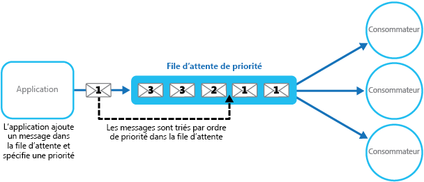
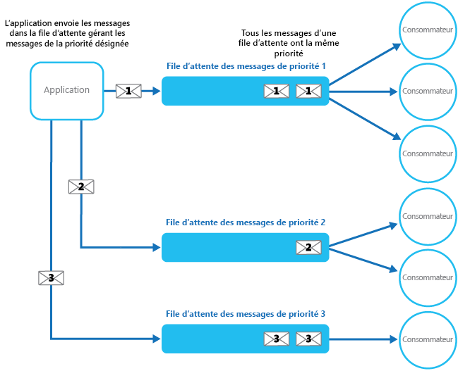

# <a name="priority-queue-pattern"></a><span data-ttu-id="2bea7-104">Modèle de file d’attente avec un ordre de priorité</span><span class="sxs-lookup"><span data-stu-id="2bea7-104">Priority Queue pattern</span></span>

[!INCLUDE [header](../_includes/header.md)]

<span data-ttu-id="2bea7-105">Classez par ordre de priorité les demandes envoyées aux services de telle sorte que les demandes à plus haute priorité soient reçues et traitées plus rapidement que celles à plus basse priorité.</span><span class="sxs-lookup"><span data-stu-id="2bea7-105">Prioritize requests sent to services so that requests with a higher priority are received and processed more quickly than those with a lower priority.</span></span> <span data-ttu-id="2bea7-106">Ce modèle est utile dans les applications qui offrent différentes garanties de niveau de service aux clients individuels.</span><span class="sxs-lookup"><span data-stu-id="2bea7-106">This pattern is useful in applications that offer different service level guarantees to individual clients.</span></span>

## <a name="context-and-problem"></a><span data-ttu-id="2bea7-107">Contexte et problème</span><span class="sxs-lookup"><span data-stu-id="2bea7-107">Context and Problem</span></span>

<span data-ttu-id="2bea7-108">Les applications peuvent déléguer des tâches spécifiques à d’autres services pour, par exemple, assurer le traitement en arrière-plan ou s’intégrer à d’autres applications ou services.</span><span class="sxs-lookup"><span data-stu-id="2bea7-108">Applications can delegate specific tasks to other services, for example, to perform background processing or to integrate with other applications or services.</span></span> <span data-ttu-id="2bea7-109">Dans le cloud, une file d’attente de messages sert généralement à déléguer des tâches à un traitement en arrière-plan.</span><span class="sxs-lookup"><span data-stu-id="2bea7-109">In the cloud, a message queue is typically used to delegate tasks to background processing.</span></span> <span data-ttu-id="2bea7-110">Si dans de nombreux cas l’ordre dans lequel les demandes sont reçues par un service n’a pas d’importance,</span><span class="sxs-lookup"><span data-stu-id="2bea7-110">In many cases the order requests are received in by a service isn't important.</span></span> <span data-ttu-id="2bea7-111">dans d’autres, il est nécessaire de classer les certaines demandes par ordre de priorité.</span><span class="sxs-lookup"><span data-stu-id="2bea7-111">In some cases, though, it's necessary to prioritize specific requests.</span></span> <span data-ttu-id="2bea7-112">Ces demandes doivent être traitées avant les demandes à plus basse priorité que l’application a envoyées précédemment.</span><span class="sxs-lookup"><span data-stu-id="2bea7-112">These requests should be processed earlier than lower priority requests that were sent previously by the application.</span></span>

## <a name="solution"></a><span data-ttu-id="2bea7-113">Solution</span><span class="sxs-lookup"><span data-stu-id="2bea7-113">Solution</span></span>

<span data-ttu-id="2bea7-114">Une file d’attente est généralement une structure FIFO (premier entré, premier sorti), et les consommateurs reçoivent généralement les messages dans l’ordre où ils ont été postés dans la file d’attente.</span><span class="sxs-lookup"><span data-stu-id="2bea7-114">A queue is usually a first-in, first-out (FIFO) structure, and consumers typically receive messages in the same order that they were posted to the queue.</span></span> <span data-ttu-id="2bea7-115">Cependant, certaines files d’attente de messages prennent en charge un ordre de priorité des messages.</span><span class="sxs-lookup"><span data-stu-id="2bea7-115">However, some message queues support priority messaging.</span></span> <span data-ttu-id="2bea7-116">L’application qui poste un message peut attribuer une priorité. Dans ce cas, les messages de la file d’attente sont réorganisés automatiquement de sorte que ceux dont la priorité est la plus élevée sont reçus avant ceux de plus basse priorité.</span><span class="sxs-lookup"><span data-stu-id="2bea7-116">The application posting a message can assign a priority and the messages in the queue are automatically reordered so that those with a higher priority will be received before those with a lower priority.</span></span> <span data-ttu-id="2bea7-117">La figure illustre une file d’attente qui prend en charge les messages prioritaires.</span><span class="sxs-lookup"><span data-stu-id="2bea7-117">The figure illustrates a queue with priority messaging.</span></span>



> <span data-ttu-id="2bea7-119">La plupart des implémentations de files d’attente de messages prennent en charge plusieurs consommateurs (à l’exemple du [modèle de consommateurs concurrents](https://msdn.microsoft.com/library/dn568101.aspx)), et le nombre de processus consommateur peut être adapté à la hausse ou à la baisse en fonction de la demande.</span><span class="sxs-lookup"><span data-stu-id="2bea7-119">Most message queue implementations support multiple consumers (following the [Competing Consumers pattern](https://msdn.microsoft.com/library/dn568101.aspx)), and the number of consumer processes can be scaled up or down depending on demand.</span></span>

<span data-ttu-id="2bea7-120">Dans les systèmes qui ne prennent pas en charge les files d’attente de messages basées sur la priorité, une autre solution consiste à tenir à jour une file d’attente distincte pour chaque priorité.</span><span class="sxs-lookup"><span data-stu-id="2bea7-120">In systems that don't support priority-based message queues, an alternative solution is to maintain a separate queue for each priority.</span></span> <span data-ttu-id="2bea7-121">Il revient à l’application de poster les messages dans la file d’attente appropriée.</span><span class="sxs-lookup"><span data-stu-id="2bea7-121">The application is responsible for posting messages to the appropriate queue.</span></span> <span data-ttu-id="2bea7-122">À chaque file d’attente peut correspondre un pool de consommateurs distinct.</span><span class="sxs-lookup"><span data-stu-id="2bea7-122">Each queue can have a separate pool of consumers.</span></span> <span data-ttu-id="2bea7-123">Les files d’attente à plus haute priorité peuvent avoir un pool de consommateurs plus étoffé s’exécutant sur du matériel plus rapide que les files d’attente à plus basse priorité.</span><span class="sxs-lookup"><span data-stu-id="2bea7-123">Higher priority queues can have a larger pool of consumers running on faster hardware than lower priority queues.</span></span> <span data-ttu-id="2bea7-124">La figure suivante illustre l’utilisation de files d’attente de messages différentes pour chaque priorité.</span><span class="sxs-lookup"><span data-stu-id="2bea7-124">The next figure illustrates using separate message queues for each priority.</span></span>




<span data-ttu-id="2bea7-126">Il existe une variante de cette stratégie qui repose sur l’utilisation d’un pool unique de consommateurs qui recherchent d’abord la présence de messages dans les files d’attente à haute priorité avant de passer aux files d’attente à plus basse priorité.</span><span class="sxs-lookup"><span data-stu-id="2bea7-126">A variation on this strategy is to have a single pool of consumers that check for messages on high priority queues first, and only then start to fetch messages from lower priority queues.</span></span> <span data-ttu-id="2bea7-127">Des différences sémantiques existent entre une solution qui utilise un seul pool de processus consommateur (avec une file d’attente unique qui prend en charge des messages de différentes priorités ou avec plusieurs files d’attente qui traitent chacune des messages de même priorité) et une solution qui utilise plusieurs files d’attente avec un pool distinct pour chaque file d’attente.</span><span class="sxs-lookup"><span data-stu-id="2bea7-127">There are some semantic differences between a solution that uses a single pool of consumer processes (either with a single queue that supports messages with different priorities or with multiple queues that each handle messages of a single priority), and a solution that uses multiple queues with a separate pool for each queue.</span></span>

<span data-ttu-id="2bea7-128">Dans l’approche du pool unique, les messages à plus haute priorité sont toujours reçus et traités avant les messages à plus basse priorité.</span><span class="sxs-lookup"><span data-stu-id="2bea7-128">In the single pool approach, higher priority messages are always received and processed before lower priority messages.</span></span> <span data-ttu-id="2bea7-129">En théorie, les messages à très basse priorité pourraient constamment être remplacés et ne jamais être traités.</span><span class="sxs-lookup"><span data-stu-id="2bea7-129">In theory, messages that have a very low priority could be continually superseded and might never be processed.</span></span> <span data-ttu-id="2bea7-130">Dans l’approche à plusieurs pools, les messages à plus basse priorité sont toujours traités, mais pas aussi rapidement que ceux dont la priorité est plus élevée (selon la taille relative des pools et les ressources dont ils disposent).</span><span class="sxs-lookup"><span data-stu-id="2bea7-130">In the multiple pool approach, lower priority messages will always be processed, just not as quickly as those of a higher priority (depending on the relative size of the pools and the resources that they have available).</span></span>

<span data-ttu-id="2bea7-131">Le recours à un mécanisme de mise en file d’attente avec un ordre de priorité peut procurer les avantages suivants :</span><span class="sxs-lookup"><span data-stu-id="2bea7-131">Using a priority queuing mechanism can provide the following advantages:</span></span>

- <span data-ttu-id="2bea7-132">Il permet aux applications de répondre aux besoins métier qui exigent une définition des priorités de disponibilité ou de performances, telles que l’offre de différents niveaux de service à des groupes spécifiques de clients.</span><span class="sxs-lookup"><span data-stu-id="2bea7-132">It allows applications to meet business requirements that require prioritization of availability or performance, such as offering different levels of service to specific groups of customers.</span></span>

- <span data-ttu-id="2bea7-133">Il peut contribuer à réduire les coûts d’exploitation.</span><span class="sxs-lookup"><span data-stu-id="2bea7-133">It can help to minimize operational costs.</span></span> <span data-ttu-id="2bea7-134">Dans l’approche à une seule file d’attente, vous pouvez réduire le nombre de consommateurs, si nécessaire.</span><span class="sxs-lookup"><span data-stu-id="2bea7-134">In the single queue approach, you can scale back the number of consumers if necessary.</span></span> <span data-ttu-id="2bea7-135">Les messages à haute priorité sont toujours traités en premier (quoique peut-être plus lentement) et les messages à plus basse priorité peuvent être retenus plus longuement.</span><span class="sxs-lookup"><span data-stu-id="2bea7-135">High priority messages will still be processed first (although possibly more slowly), and lower priority messages might be delayed for longer.</span></span> <span data-ttu-id="2bea7-136">Si vous avez implémenté l’approche à plusieurs files d’attente de messages avec des pools de consommateurs différents pour chaque file d’attente, vous pouvez réduire le pool de consommateurs pour les files d’attente à plus basse priorité, voire suspendre le traitement de certaines files d’attente à très basse priorité en arrêtant tous les consommateurs qui écoutent les messages sur ces files d’attente.</span><span class="sxs-lookup"><span data-stu-id="2bea7-136">If you've implemented the multiple message queue approach with separate pools of consumers for each queue, you can reduce the pool of consumers for lower priority queues, or even suspend processing for some very low priority queues by stopping all the consumers that listen for messages on those queues.</span></span>

- <span data-ttu-id="2bea7-137">L’approche à plusieurs files d’attente de messages peut aider à optimiser les performances et la scalabilité d’une application en répartissant les messages en fonction des exigences de traitement.</span><span class="sxs-lookup"><span data-stu-id="2bea7-137">The multiple message queue approach can help maximize application performance and scalability by partitioning messages based on processing requirements.</span></span> <span data-ttu-id="2bea7-138">Par exemple, les tâches essentielles peuvent être définies pour être traitées en priorité par des récepteurs qui s’exécutent immédiatement, alors que les tâches d’arrière-plan moins importantes peuvent être traitées par des récepteurs prévus pour s’exécuter à des périodes creuses.</span><span class="sxs-lookup"><span data-stu-id="2bea7-138">For example, vital tasks can be prioritized to be handled by receivers that run immediately while less important background tasks can be handled by receivers that are scheduled to run at less busy periods.</span></span>

## <a name="issues-and-considerations"></a><span data-ttu-id="2bea7-139">Problèmes et considérations</span><span class="sxs-lookup"><span data-stu-id="2bea7-139">Issues and Considerations</span></span>

<span data-ttu-id="2bea7-140">Prenez en compte les points suivants lorsque vous choisissez comment implémenter ce modèle :</span><span class="sxs-lookup"><span data-stu-id="2bea7-140">Consider the following points when deciding how to implement this pattern:</span></span>

<span data-ttu-id="2bea7-141">Définissez les priorités en tenant compte du contexte de la solution.</span><span class="sxs-lookup"><span data-stu-id="2bea7-141">Define the priorities in the context of the solution.</span></span> <span data-ttu-id="2bea7-142">Par exemple, une priorité élevée peut signifier un traitement des messages en moins de dix secondes.</span><span class="sxs-lookup"><span data-stu-id="2bea7-142">For example, high priority could mean that messages should be processed within ten seconds.</span></span> <span data-ttu-id="2bea7-143">Identifiez les besoins en matière de traitement des éléments à haute priorité, ainsi que les autres ressources qui doivent être allouées pour répondre à ces critères.</span><span class="sxs-lookup"><span data-stu-id="2bea7-143">Identify the requirements for handling high priority items, and the other resources that should be allocated to meet these criteria.</span></span>

<span data-ttu-id="2bea7-144">Décidez si tous les éléments à haute priorité doivent être traités avant les éléments à plus basse priorité.</span><span class="sxs-lookup"><span data-stu-id="2bea7-144">Decide if all high priority items must be processed before any lower priority items.</span></span> <span data-ttu-id="2bea7-145">Si les messages sont traités par un seul pool de consommateurs, vous devez prévoir un mécanisme capable de préempter et de suspendre une tâche qui traite un message à basse priorité si un message à plus haute priorité devient disponible.</span><span class="sxs-lookup"><span data-stu-id="2bea7-145">If the messages are being processed by a single pool of consumers, you have to provide a mechanism that can preempt and suspend a task that's handling a low priority message if a higher priority message becomes available.</span></span>

<span data-ttu-id="2bea7-146">Dans l’approche à plusieurs files d’attente, si un pool unique de processus consommateur écoutant toutes les files d’attente est préféré à un pool de consommateurs dédié pour chaque file d’attente, le consommateur doit appliquer un algorithme pour faire en sorte qu’il traite toujours les messages issus de files d’attente à plus haute priorité avant ceux issus de files d’attente à plus basse priorité.</span><span class="sxs-lookup"><span data-stu-id="2bea7-146">In the multiple queue approach, when using a single pool of consumer processes that listen on all queues rather than a dedicated consumer pool for each queue, the consumer must apply an algorithm that ensures it always services messages from higher priority queues before those from lower priority queues.</span></span>

<span data-ttu-id="2bea7-147">Surveillez la vitesse de traitement dans les files d’attente à haute et basse priorité pour être certain que les messages de ces files d’attente sont traités dans les délais prévus.</span><span class="sxs-lookup"><span data-stu-id="2bea7-147">Monitor the processing speed on high and low priority queues to ensure that messages in these queues are processed at the expected rates.</span></span>

<span data-ttu-id="2bea7-148">Si vous devez garantir le traitement des messages à basse priorité, il est nécessaire d’implémenter l’approche à plusieurs files d’attente de messages avec plusieurs pools de consommateurs.</span><span class="sxs-lookup"><span data-stu-id="2bea7-148">If you need to guarantee that low priority messages will be processed, it's necessary to implement the multiple message queue approach with multiple pools of consumers.</span></span> <span data-ttu-id="2bea7-149">Autre possibilité : dans une file d’attente qui prend en charge la définition des priorités des messages, il est possible d’augmenter dynamiquement la priorité d’un message en file d’attente à mesure qu’il gagne en maturité.</span><span class="sxs-lookup"><span data-stu-id="2bea7-149">Alternatively, in a queue that supports message prioritization, it's possible to dynamically increase the priority of a queued message as it ages.</span></span> <span data-ttu-id="2bea7-150">Cependant, cette approche dépend de la file d’attente de messages qui fournit cette fonctionnalité.</span><span class="sxs-lookup"><span data-stu-id="2bea7-150">However, this approach depends on the message queue providing this feature.</span></span>

<span data-ttu-id="2bea7-151">L’utilisation d’une file d’attente différente pour chaque priorité de message est plus indiquée pour les systèmes qui ont un petit nombre de priorités bien définies.</span><span class="sxs-lookup"><span data-stu-id="2bea7-151">Using a separate queue for each message priority works best for systems that have a small number of well-defined priorities.</span></span>

<span data-ttu-id="2bea7-152">La priorité des messages peut être déterminée logiquement par le système.</span><span class="sxs-lookup"><span data-stu-id="2bea7-152">Message priorities can be determined logically by the system.</span></span> <span data-ttu-id="2bea7-153">Par exemple, plutôt que de parler explicitement de messages à haute et basse priorité, ils peuvent être désignés sous les termes « client payant des frais » ou « client ne payant pas de frais ».</span><span class="sxs-lookup"><span data-stu-id="2bea7-153">For example, rather than having explicit high and low priority messages, they could be designated as “fee paying customer,” or “non-fee paying customer.”</span></span> <span data-ttu-id="2bea7-154">Selon votre modèle d’entreprise, votre système peut allouer davantage de ressources au traitement des messages en provenance des clients payant des frais qu’à celui des messages en provenance des clients de payant pas de frais.</span><span class="sxs-lookup"><span data-stu-id="2bea7-154">Depending on your business model, your system can allocate more resources to processing messages from fee paying customers than non-fee paying ones.</span></span>

<span data-ttu-id="2bea7-155">La recherche de messages dans une file d’attente peut induire des coûts financiers et de traitement (certains systèmes de messagerie commerciaux facturent de légers frais chaque fois qu’un message est posté ou récupéré et chaque fois que des messages sont recherchés dans une file d’attente).</span><span class="sxs-lookup"><span data-stu-id="2bea7-155">There might be a financial and processing cost associated with checking a queue for a message (some commercial messaging systems charge a small fee each time a message is posted or retrieved, and each time a queue is queried for messages).</span></span> <span data-ttu-id="2bea7-156">Ces coûts augmentent quand la recherche porte sur plusieurs files d’attente.</span><span class="sxs-lookup"><span data-stu-id="2bea7-156">This cost increases when checking multiple queues.</span></span>

<span data-ttu-id="2bea7-157">Il est possible d’ajuster dynamiquement la taille d’un pool de consommateurs en fonction de la longueur de la file d’attente gérée par le pool.</span><span class="sxs-lookup"><span data-stu-id="2bea7-157">It's possible to dynamically adjust the size of a pool of consumers based on the length of the queue that the pool is servicing.</span></span> <span data-ttu-id="2bea7-158">Pour plus d’informations, consultez [Recommandations en matière de mise à l’échelle automatique](https://msdn.microsoft.com/library/dn589774.aspx).</span><span class="sxs-lookup"><span data-stu-id="2bea7-158">For more information, see the [Autoscaling Guidance](https://msdn.microsoft.com/library/dn589774.aspx).</span></span>

## <a name="when-to-use-this-pattern"></a><span data-ttu-id="2bea7-159">Quand utiliser ce modèle</span><span class="sxs-lookup"><span data-stu-id="2bea7-159">When to use this pattern</span></span>

<span data-ttu-id="2bea7-160">Ce modèle est utile dans les scénarios où :</span><span class="sxs-lookup"><span data-stu-id="2bea7-160">This pattern is useful in scenarios where:</span></span>

- <span data-ttu-id="2bea7-161">le système doit traiter plusieurs tâches ayant des priorités différentes ;</span><span class="sxs-lookup"><span data-stu-id="2bea7-161">The system must handle multiple tasks that have different priorities.</span></span>

- <span data-ttu-id="2bea7-162">différents utilisateurs ou locataires doivent être traités avec une priorité différente.</span><span class="sxs-lookup"><span data-stu-id="2bea7-162">Different users or tenants should be served with different priority.</span></span>

## <a name="example"></a><span data-ttu-id="2bea7-163">Exemple</span><span class="sxs-lookup"><span data-stu-id="2bea7-163">Example</span></span>

<span data-ttu-id="2bea7-164">Microsoft Azure ne propose pas de mécanisme de mise en file d’attente prenant en charge en mode natif la définition automatique de priorités pour les messages via le tri.</span><span class="sxs-lookup"><span data-stu-id="2bea7-164">Microsoft Azure doesn't provide a queuing mechanism that natively supports automatic prioritization of messages through sorting.</span></span> <span data-ttu-id="2bea7-165">Cependant, il propose des rubriques et des abonnements Azure Service Bus qui prennent en charge un mécanisme de mise en file d’attente capable de filtrer les messages, avec en outre un large éventail de fonctionnalités flexibles qui en font une solution idéale dans la plupart des implémentations de files d’attente avec un ordre de priorité.</span><span class="sxs-lookup"><span data-stu-id="2bea7-165">However, it does provide Azure Service Bus topics and subscriptions that support a queuing mechanism that provides message filtering, together with a wide range of flexible capabilities that make it ideal for use in most priority queue implementations.</span></span>

<span data-ttu-id="2bea7-166">Une solution Azure peut implémenter une rubrique Service Bus dans laquelle une application peut poster des messages, de la même façon qu’une file d’attente.</span><span class="sxs-lookup"><span data-stu-id="2bea7-166">An Azure solution can implement a Service Bus topic an application can post messages to, in the same way as a queue.</span></span> <span data-ttu-id="2bea7-167">Les messages peuvent contenir des métadonnées sous la forme de propriétés personnalisées définies par l’application.</span><span class="sxs-lookup"><span data-stu-id="2bea7-167">Messages can contain metadata in the form of application-defined custom properties.</span></span> <span data-ttu-id="2bea7-168">Des abonnements Service Bus peuvent être associés à la rubrique, et ces abonnements peuvent filtrer les messages en fonction de leurs propriétés.</span><span class="sxs-lookup"><span data-stu-id="2bea7-168">Service Bus subscriptions can be associated with the topic, and these subscriptions can filter messages based on their properties.</span></span> <span data-ttu-id="2bea7-169">Quand une application envoie un message à une rubrique, le message est dirigé vers l’abonnement approprié, où il peut être lu par un consommateur.</span><span class="sxs-lookup"><span data-stu-id="2bea7-169">When an application sends a message to a topic, the message is directed to the appropriate subscription where it can be read by a consumer.</span></span> <span data-ttu-id="2bea7-170">Les processus consommateur peuvent récupérer les messages d’un abonnement en utilisant la même sémantique qu’une file d’attente de messages (un abonnement est une file d’attente logique).</span><span class="sxs-lookup"><span data-stu-id="2bea7-170">Consumer processes can retrieve messages from a subscription using the same semantics as a message queue (a subscription is a logical queue).</span></span> <span data-ttu-id="2bea7-171">La figure suivante illustre l’implémentation d’une file d’attente avec un ordre priorité avec des rubriques et des abonnements Azure Service Bus.</span><span class="sxs-lookup"><span data-stu-id="2bea7-171">The following figure illustrates implementing a priority queue with Azure Service Bus topics and subscriptions.</span></span>


<span data-ttu-id="2bea7-173">Dans la figure ci-dessus, l’application crée plusieurs messages et assigne une valeur à une propriété personnalisée appelée `Priority` dans chaque message, à savoir `High` ou `Low`.</span><span class="sxs-lookup"><span data-stu-id="2bea7-173">In the figure above, the application creates several messages and assigns a custom property called `Priority` in each message with a value, either `High` or `Low`.</span></span> <span data-ttu-id="2bea7-174">L’application poste ces messages dans une rubrique.</span><span class="sxs-lookup"><span data-stu-id="2bea7-174">The application posts these messages to a topic.</span></span> <span data-ttu-id="2bea7-175">La rubrique est associée à deux abonnements qui filtrent tous deux les messages en examinant la propriété `Priority`.</span><span class="sxs-lookup"><span data-stu-id="2bea7-175">The topic has two associated subscriptions that both filter messages by examining the `Priority` property.</span></span> <span data-ttu-id="2bea7-176">L’un des deux abonnements accepte les messages dont la propriété `Priority` a la valeur `High`, tandis que l’autre accepte les messages dont la propriété `Priority` a la valeur `Low`.</span><span class="sxs-lookup"><span data-stu-id="2bea7-176">One subscription accepts messages where the `Priority` property is set to `High`, and the other accepts messages where the `Priority` property is set to `Low`.</span></span> <span data-ttu-id="2bea7-177">Un pool de consommateurs lit les messages de chaque abonnement.</span><span class="sxs-lookup"><span data-stu-id="2bea7-177">A pool of consumers reads messages from each subscription.</span></span> <span data-ttu-id="2bea7-178">L’abonnement à haute priorité dispose d’un pool plus étoffé, et ces consommateurs peuvent s’exécuter sur des ordinateurs plus puissants, disposant de plus de ressources que les consommateurs du pool à basse priorité.</span><span class="sxs-lookup"><span data-stu-id="2bea7-178">The high priority subscription has a larger pool, and these consumers might be running on more powerful computers with more resources available than the consumers in the low priority pool.</span></span>

<span data-ttu-id="2bea7-179">Notez que les messages à haute et basse priorité n’ont pas de désignation particulière dans cet exemple.</span><span class="sxs-lookup"><span data-stu-id="2bea7-179">Note that there's nothing special about the designation of high and low priority messages in this example.</span></span> <span data-ttu-id="2bea7-180">Il s’agit simplement de libellés spécifiés sous forme de propriétés dans chaque message, qui servent à diriger les messages vers un abonnement spécifique.</span><span class="sxs-lookup"><span data-stu-id="2bea7-180">They're simply labels specified as properties in each message, and are used to direct messages to a specific subscription.</span></span> <span data-ttu-id="2bea7-181">Si des priorités supplémentaires sont nécessaires, il est relativement facile de créer d’autres abonnements et pools de processus consommateur pour traiter ces priorités.</span><span class="sxs-lookup"><span data-stu-id="2bea7-181">If additional priorities are required, it's relatively easy to create further subscriptions and pools of consumer processes to handle these priorities.</span></span>

<span data-ttu-id="2bea7-182">La solution PriorityQueue disponible sur [GitHub](https://github.com/mspnp/cloud-design-patterns/tree/master/priority-queue) propose une implémentation de cette approche.</span><span class="sxs-lookup"><span data-stu-id="2bea7-182">The PriorityQueue solution available on [GitHub](https://github.com/mspnp/cloud-design-patterns/tree/master/priority-queue) contains an implementation of this approach.</span></span> <span data-ttu-id="2bea7-183">Cette solution contient deux projets de rôle de travail nommés `PriorityQueue.High` et `PriorityQueue.Low`.</span><span class="sxs-lookup"><span data-stu-id="2bea7-183">This solution contains two worker role projects named `PriorityQueue.High` and `PriorityQueue.Low`.</span></span> <span data-ttu-id="2bea7-184">Ces rôles de travail héritent de la classe `PriorityWorkerRole` qui contient la fonctionnalité permettant de se connecter à un abonnement spécifié dans la méthode `OnStart`.</span><span class="sxs-lookup"><span data-stu-id="2bea7-184">These worker roles inherit from the `PriorityWorkerRole` class that contains the functionality for connecting to a specified subscription in the `OnStart` method.</span></span>

<span data-ttu-id="2bea7-185">Les rôles de travail `PriorityQueue.High` et `PriorityQueue.Low` se connectent à différents abonnements, définis dans leurs paramètres de configuration.</span><span class="sxs-lookup"><span data-stu-id="2bea7-185">The `PriorityQueue.High` and `PriorityQueue.Low` worker roles connect to different subscriptions, defined by their configuration settings.</span></span> <span data-ttu-id="2bea7-186">Un administrateur peut configurer des nombres différents de chaque rôle à exécuter.</span><span class="sxs-lookup"><span data-stu-id="2bea7-186">An administrator can configure different numbers of each role to be run.</span></span> <span data-ttu-id="2bea7-187">En règle générale, il existe davantage d’instances du rôle de travail `PriorityQueue.High` que du rôle de travail `PriorityQueue.Low`.</span><span class="sxs-lookup"><span data-stu-id="2bea7-187">Typically there'll be more instances of the `PriorityQueue.High` worker role than the `PriorityQueue.Low` worker role.</span></span>

<span data-ttu-id="2bea7-188">La méthode `Run` de la classe `PriorityWorkerRole` fait en sorte que la méthode virtuelle `ProcessMessage` (aussi définie dans la classe `PriorityWorkerRole`) s’exécute pour chaque message reçu dans la file d’attente.</span><span class="sxs-lookup"><span data-stu-id="2bea7-188">The `Run` method in the `PriorityWorkerRole` class arranges for the virtual `ProcessMessage` method (also defined in the `PriorityWorkerRole` class) to be run for each message received on the queue.</span></span> <span data-ttu-id="2bea7-189">Le code suivant représente les méthodes `Run` et `ProcessMessage`.</span><span class="sxs-lookup"><span data-stu-id="2bea7-189">The following code shows the `Run` and `ProcessMessage` methods.</span></span> <span data-ttu-id="2bea7-190">La classe `QueueManager`, définie dans le projet PriorityQueue.Shared, fournit des méthodes d’assistance pour utiliser des files d’attente Azure Service Bus.</span><span class="sxs-lookup"><span data-stu-id="2bea7-190">The `QueueManager` class, defined in the PriorityQueue.Shared project, provides helper methods for using Azure Service Bus queues.</span></span>

```csharp
public class PriorityWorkerRole : RoleEntryPoint
{
  private QueueManager queueManager;
  ...

  public override void Run()
  {
    // Start listening for messages on the subscription.
    var subscriptionName = CloudConfigurationManager.GetSetting("SubscriptionName");
    this.queueManager.ReceiveMessages(subscriptionName, this.ProcessMessage);
    ...;
  }
  ...

  protected virtual async Task ProcessMessage(BrokeredMessage message)
  {
    // Simulating processing.
    await Task.Delay(TimeSpan.FromSeconds(2));
  }
}
```
<span data-ttu-id="2bea7-191">Les rôles de travail `PriorityQueue.High` et `PriorityQueue.Low` remplacent tous deux la fonctionnalité par défaut de la méthode `ProcessMessage`.</span><span class="sxs-lookup"><span data-stu-id="2bea7-191">The `PriorityQueue.High` and `PriorityQueue.Low` worker roles both override the default functionality of the `ProcessMessage` method.</span></span> <span data-ttu-id="2bea7-192">Le code ci-dessous représente la méthode `ProcessMessage` pour le rôle de travail `PriorityQueue.High`.</span><span class="sxs-lookup"><span data-stu-id="2bea7-192">The code below shows the `ProcessMessage` method for the `PriorityQueue.High` worker role.</span></span>

```csharp
protected override async Task ProcessMessage(BrokeredMessage message)
{
  // Simulate message processing for High priority messages.
  await base.ProcessMessage(message);
  Trace.TraceInformation("High priority message processed by " +
    RoleEnvironment.CurrentRoleInstance.Id + " MessageId: " + message.MessageId);
}
```

<span data-ttu-id="2bea7-193">Quand une application poste des messages dans la rubrique associée aux abonnements utilisés par les rôles de travail `PriorityQueue.High` et `PriorityQueue.Low`, elle spécifie la priorité à l’aide de la propriété personnalisée `Priority`, comme dans l’exemple de code suivant.</span><span class="sxs-lookup"><span data-stu-id="2bea7-193">When an application posts messages to the topic associated with the subscriptions used by the `PriorityQueue.High` and `PriorityQueue.Low` worker roles, it specifies the priority by using the `Priority` custom property, as shown in the following code example.</span></span> <span data-ttu-id="2bea7-194">Ce code (implémenté dans la classe `WorkerRole` du projet PriorityQueue.Sender) utilise la méthode d’assistance `SendBatchAsync` de la classe `QueueManager` pour poster les messages dans une rubrique par lots.</span><span class="sxs-lookup"><span data-stu-id="2bea7-194">This code (implemented in the `WorkerRole` class in the PriorityQueue.Sender project), uses the `SendBatchAsync` helper method of the `QueueManager` class to post messages to a topic in batches.</span></span>

```csharp
// Send a low priority batch.
var lowMessages = new List<BrokeredMessage>();

for (int i = 0; i < 10; i++)
{
  var message = new BrokeredMessage() { MessageId = Guid.NewGuid().ToString() };
  message.Properties["Priority"] = Priority.Low;
  lowMessages.Add(message);
}

this.queueManager.SendBatchAsync(lowMessages).Wait();
...

// Send a high priority batch.
var highMessages = new List<BrokeredMessage>();

for (int i = 0; i < 10; i++)
{
  var message = new BrokeredMessage() { MessageId = Guid.NewGuid().ToString() };
  message.Properties["Priority"] = Priority.High;
  highMessages.Add(message);
}

this.queueManager.SendBatchAsync(highMessages).Wait();
```

## <a name="related-patterns-and-guidance"></a><span data-ttu-id="2bea7-195">Conseils et modèles connexes</span><span class="sxs-lookup"><span data-stu-id="2bea7-195">Related patterns and guidance</span></span>

<span data-ttu-id="2bea7-196">Les modèles et les conseils suivants peuvent aussi s’avérer intéressants quand il s’agit d’implémenter ce modèle :</span><span class="sxs-lookup"><span data-stu-id="2bea7-196">The following patterns and guidance might also be relevant when implementing this pattern:</span></span>

- <span data-ttu-id="2bea7-197">Un exemple illustrant ce modèle est disponible sur [GitHub](https://github.com/mspnp/cloud-design-patterns/tree/master/priority-queue).</span><span class="sxs-lookup"><span data-stu-id="2bea7-197">A sample that demonstrates this pattern is available on [GitHub](https://github.com/mspnp/cloud-design-patterns/tree/master/priority-queue).</span></span>

- <span data-ttu-id="2bea7-198">[Notions élémentaires sur la messagerie asynchrone](https://msdn.microsoft.com/library/dn589781.aspx) :</span><span class="sxs-lookup"><span data-stu-id="2bea7-198">[Asynchronous Messaging Primer](https://msdn.microsoft.com/library/dn589781.aspx).</span></span> <span data-ttu-id="2bea7-199">un service consommateur qui traite une demande peut être amené à envoyer une réponse à l’instance de l’application qui a posté la demande.</span><span class="sxs-lookup"><span data-stu-id="2bea7-199">A consumer service that processes a request might need to send a reply to the instance of the application that posted the request.</span></span> <span data-ttu-id="2bea7-200">Fournit des informations sur les stratégies que vous pouvez employer pour implémenter une messagerie demande/réponse.</span><span class="sxs-lookup"><span data-stu-id="2bea7-200">Provides information on the strategies that you can use to implement request/response messaging.</span></span>

- <span data-ttu-id="2bea7-201">[Modèle des consommateurs concurrents](competing-consumers.md) :</span><span class="sxs-lookup"><span data-stu-id="2bea7-201">[Competing Consumers pattern](competing-consumers.md).</span></span> <span data-ttu-id="2bea7-202">pour accroître le débit des files d’attente, il est possible d’avoir plusieurs consommateurs à l’écoute d’une même file d’attente et de traiter les tâches en parallèle.</span><span class="sxs-lookup"><span data-stu-id="2bea7-202">To increase the throughput of the queues, it’s possible to have multiple consumers that listen on the same queue, and process the tasks in parallel.</span></span> <span data-ttu-id="2bea7-203">Ces consommateurs sont en concurrence pour les messages, mais un seul d’entre eux doit pouvoir traiter chaque message.</span><span class="sxs-lookup"><span data-stu-id="2bea7-203">These consumers will compete for messages, but only one should be able to process each message.</span></span> <span data-ttu-id="2bea7-204">Fournit des informations sur les avantages et les inconvénients de l’implémentation de cette approche.</span><span class="sxs-lookup"><span data-stu-id="2bea7-204">Provides more information on the benefits and tradeoffs of implementing this approach.</span></span>

- <span data-ttu-id="2bea7-205">[Modèle de limitation](throttling.md) :</span><span class="sxs-lookup"><span data-stu-id="2bea7-205">[Throttling pattern](throttling.md).</span></span> <span data-ttu-id="2bea7-206">vous pouvez implémenter la limitation en utilisant des files d’attente.</span><span class="sxs-lookup"><span data-stu-id="2bea7-206">You can implement throttling by using queues.</span></span> <span data-ttu-id="2bea7-207">La messagerie avec prise en compte des priorités permet d’assurer que les demandes en provenance d’applications critiques ou d’applications exécutées par des clients majeurs sont prioritaires sur les demandes en provenance d’applications moins importantes.</span><span class="sxs-lookup"><span data-stu-id="2bea7-207">Priority messaging can be used to ensure that requests from critical applications, or applications being run by high-value customers, are given priority over requests from less important applications.</span></span>

- <span data-ttu-id="2bea7-208">[Recommandations en matière de mise à l’échelle automatique](https://msdn.microsoft.com/library/dn589774.aspx) :</span><span class="sxs-lookup"><span data-stu-id="2bea7-208">[Autoscaling Guidance](https://msdn.microsoft.com/library/dn589774.aspx).</span></span> <span data-ttu-id="2bea7-209">la possibilité ou non d’adapter la taille du pool de processus consommateur gérant une file d’attente dépend de la longueur de celle-ci.</span><span class="sxs-lookup"><span data-stu-id="2bea7-209">It might be possible to scale the size of the pool of consumer processes handling a queue depending on the length of the queue.</span></span> <span data-ttu-id="2bea7-210">Cette stratégie peut contribuer à améliorer les performances, surtout pour les pools qui traitent des messages à haute priorité.</span><span class="sxs-lookup"><span data-stu-id="2bea7-210">This strategy can help to improve performance, especially for pools handling high priority messages.</span></span>

- <span data-ttu-id="2bea7-211">[Modèles Intégration Entreprise avec Service Bus](http://abhishekrlal.com/2013/01/11/enterprise-integration-patterns-with-service-bus-part-2/) sur le blog d’Abhishek Lal.</span><span class="sxs-lookup"><span data-stu-id="2bea7-211">[Enterprise Integration Patterns with Service Bus](http://abhishekrlal.com/2013/01/11/enterprise-integration-patterns-with-service-bus-part-2/) on Abhishek Lal’s blog.</span></span>

