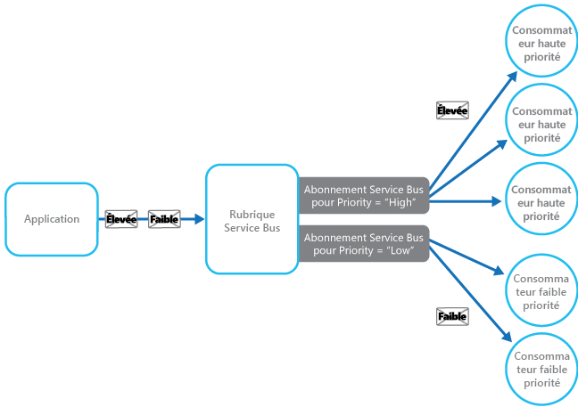

# <a name="priority-queue-pattern"></a>Modèle de file d’attente avec un ordre de priorité

[!INCLUDE [header](../_includes/header.md)]

Classez par ordre de priorité les demandes envoyées aux services de telle sorte que les demandes à plus haute priorité soient reçues et traitées plus rapidement que celles à plus basse priorité. Ce modèle est utile dans les applications qui offrent différentes garanties de niveau de service aux clients individuels.

## <a name="context-and-problem"></a>Contexte et problème

Les applications peuvent déléguer des tâches spécifiques à d’autres services pour, par exemple, assurer le traitement en arrière-plan ou s’intégrer à d’autres applications ou services. Dans le cloud, une file d’attente de messages sert généralement à déléguer des tâches à un traitement en arrière-plan. Si dans de nombreux cas l’ordre dans lequel les demandes sont reçues par un service n’a pas d’importance, dans d’autres, il est nécessaire de classer les certaines demandes par ordre de priorité. Ces demandes doivent être traitées avant les demandes à plus basse priorité que l’application a envoyées précédemment.

## <a name="solution"></a>Solution

Une file d’attente est généralement une structure FIFO (premier entré, premier sorti), et les consommateurs reçoivent généralement les messages dans l’ordre où ils ont été postés dans la file d’attente. Cependant, certaines files d’attente de messages prennent en charge un ordre de priorité des messages. L’application qui poste un message peut attribuer une priorité. Dans ce cas, les messages de la file d’attente sont réorganisés automatiquement de sorte que ceux dont la priorité est la plus élevée sont reçus avant ceux de plus basse priorité. La figure illustre une file d’attente qui prend en charge les messages prioritaires.


> La plupart des implémentations de files d’attente de messages prennent en charge plusieurs consommateurs (à l’exemple du [modèle de consommateurs concurrents](https://msdn.microsoft.com/library/dn568101.aspx)), et le nombre de processus consommateur peut être adapté à la hausse ou à la baisse en fonction de la demande.

Dans les systèmes qui ne prennent pas en charge les files d’attente de messages basées sur la priorité, une autre solution consiste à tenir à jour une file d’attente distincte pour chaque priorité. Il revient à l’application de poster les messages dans la file d’attente appropriée. À chaque file d’attente peut correspondre un pool de consommateurs distinct. Les files d’attente à plus haute priorité peuvent avoir un pool de consommateurs plus étoffé s’exécutant sur du matériel plus rapide que les files d’attente à plus basse priorité. La figure suivante illustre l’utilisation de files d’attente de messages différentes pour chaque priorité.


Il existe une variante de cette stratégie qui repose sur l’utilisation d’un pool unique de consommateurs qui recherchent d’abord la présence de messages dans les files d’attente à haute priorité avant de passer aux files d’attente à plus basse priorité. Des différences sémantiques existent entre une solution qui utilise un seul pool de processus consommateur (avec une file d’attente unique qui prend en charge des messages de différentes priorités ou avec plusieurs files d’attente qui traitent chacune des messages de même priorité) et une solution qui utilise plusieurs files d’attente avec un pool distinct pour chaque file d’attente.

Dans l’approche du pool unique, les messages à plus haute priorité sont toujours reçus et traités avant les messages à plus basse priorité. En théorie, les messages à très basse priorité pourraient constamment être remplacés et ne jamais être traités. Dans l’approche à plusieurs pools, les messages à plus basse priorité sont toujours traités, mais pas aussi rapidement que ceux dont la priorité est plus élevée (selon la taille relative des pools et les ressources dont ils disposent).

Le recours à un mécanisme de mise en file d’attente avec un ordre de priorité peut procurer les avantages suivants :

- Il permet aux applications de répondre aux besoins métier qui exigent une définition des priorités de disponibilité ou de performances, telles que l’offre de différents niveaux de service à des groupes spécifiques de clients.

- Il peut contribuer à réduire les coûts d’exploitation. Dans l’approche à une seule file d’attente, vous pouvez réduire le nombre de consommateurs, si nécessaire. Les messages à haute priorité sont toujours traités en premier (quoique peut-être plus lentement) et les messages à plus basse priorité peuvent être retenus plus longuement. Si vous avez implémenté l’approche à plusieurs files d’attente de messages avec des pools de consommateurs différents pour chaque file d’attente, vous pouvez réduire le pool de consommateurs pour les files d’attente à plus basse priorité, voire suspendre le traitement de certaines files d’attente à très basse priorité en arrêtant tous les consommateurs qui écoutent les messages sur ces files d’attente.

- L’approche à plusieurs files d’attente de messages peut aider à optimiser les performances et la scalabilité d’une application en répartissant les messages en fonction des exigences de traitement. Par exemple, les tâches essentielles peuvent être définies pour être traitées en priorité par des récepteurs qui s’exécutent immédiatement, alors que les tâches d’arrière-plan moins importantes peuvent être traitées par des récepteurs prévus pour s’exécuter à des périodes creuses.

## <a name="issues-and-considerations"></a>Problèmes et considérations

Prenez en compte les points suivants lorsque vous choisissez comment implémenter ce modèle :

Définissez les priorités en tenant compte du contexte de la solution. Par exemple, une priorité élevée peut signifier un traitement des messages en moins de dix secondes. Identifiez les besoins en matière de traitement des éléments à haute priorité, ainsi que les autres ressources qui doivent être allouées pour répondre à ces critères.

Décidez si tous les éléments à haute priorité doivent être traités avant les éléments à plus basse priorité. Si les messages sont traités par un seul pool de consommateurs, vous devez prévoir un mécanisme capable de préempter et de suspendre une tâche qui traite un message à basse priorité si un message à plus haute priorité devient disponible.

Dans l’approche à plusieurs files d’attente, si un pool unique de processus consommateur écoutant toutes les files d’attente est préféré à un pool de consommateurs dédié pour chaque file d’attente, le consommateur doit appliquer un algorithme pour faire en sorte qu’il traite toujours les messages issus de files d’attente à plus haute priorité avant ceux issus de files d’attente à plus basse priorité.

Surveillez la vitesse de traitement dans les files d’attente à haute et basse priorité pour être certain que les messages de ces files d’attente sont traités dans les délais prévus.

Si vous devez garantir le traitement des messages à basse priorité, il est nécessaire d’implémenter l’approche à plusieurs files d’attente de messages avec plusieurs pools de consommateurs. Autre possibilité : dans une file d’attente qui prend en charge la définition des priorités des messages, il est possible d’augmenter dynamiquement la priorité d’un message en file d’attente à mesure qu’il gagne en maturité. Cependant, cette approche dépend de la file d’attente de messages qui fournit cette fonctionnalité.

L’utilisation d’une file d’attente différente pour chaque priorité de message est plus indiquée pour les systèmes qui ont un petit nombre de priorités bien définies.

La priorité des messages peut être déterminée logiquement par le système. Par exemple, plutôt que de parler explicitement de messages à haute et basse priorité, ils peuvent être désignés sous les termes « client payant des frais » ou « client ne payant pas de frais ». Selon votre modèle d’entreprise, votre système peut allouer davantage de ressources au traitement des messages en provenance des clients payant des frais qu’à celui des messages en provenance des clients de payant pas de frais.

La recherche de messages dans une file d’attente peut induire des coûts financiers et de traitement (certains systèmes de messagerie commerciaux facturent de légers frais chaque fois qu’un message est posté ou récupéré et chaque fois que des messages sont recherchés dans une file d’attente). Ces coûts augmentent quand la recherche porte sur plusieurs files d’attente.

Il est possible d’ajuster dynamiquement la taille d’un pool de consommateurs en fonction de la longueur de la file d’attente gérée par le pool. Pour plus d’informations, consultez [Recommandations en matière de mise à l’échelle automatique](https://msdn.microsoft.com/library/dn589774.aspx).

## <a name="when-to-use-this-pattern"></a>Quand utiliser ce modèle

Ce modèle est utile dans les scénarios où :

- le système doit traiter plusieurs tâches ayant des priorités différentes ;

- différents utilisateurs ou locataires doivent être traités avec une priorité différente.

## <a name="example"></a>Exemple

Microsoft Azure ne propose pas de mécanisme de mise en file d’attente prenant en charge en mode natif la définition automatique de priorités pour les messages via le tri. Cependant, il propose des rubriques et des abonnements Azure Service Bus qui prennent en charge un mécanisme de mise en file d’attente capable de filtrer les messages, avec en outre un large éventail de fonctionnalités flexibles qui en font une solution idéale dans la plupart des implémentations de files d’attente avec un ordre de priorité.

Une solution Azure peut implémenter une rubrique Service Bus dans laquelle une application peut poster des messages, de la même façon qu’une file d’attente. Les messages peuvent contenir des métadonnées sous la forme de propriétés personnalisées définies par l’application. Des abonnements Service Bus peuvent être associés à la rubrique, et ces abonnements peuvent filtrer les messages en fonction de leurs propriétés. Quand une application envoie un message à une rubrique, le message est dirigé vers l’abonnement approprié, où il peut être lu par un consommateur. Les processus consommateur peuvent récupérer les messages d’un abonnement en utilisant la même sémantique qu’une file d’attente de messages (un abonnement est une file d’attente logique). La figure suivante illustre l’implémentation d’une file d’attente avec un ordre priorité avec des rubriques et des abonnements Azure Service Bus.




Dans la figure ci-dessus, l’application crée plusieurs messages et assigne une valeur à une propriété personnalisée appelée `Priority` dans chaque message, à savoir `High` ou `Low`. L’application poste ces messages dans une rubrique. La rubrique est associée à deux abonnements qui filtrent tous deux les messages en examinant la propriété `Priority`. L’un des deux abonnements accepte les messages dont la propriété `Priority` a la valeur `High`, tandis que l’autre accepte les messages dont la propriété `Priority` a la valeur `Low`. Un pool de consommateurs lit les messages de chaque abonnement. L’abonnement à haute priorité dispose d’un pool plus étoffé, et ces consommateurs peuvent s’exécuter sur des ordinateurs plus puissants, disposant de plus de ressources que les consommateurs du pool à basse priorité.

Notez que les messages à haute et basse priorité n’ont pas de désignation particulière dans cet exemple. Il s’agit simplement de libellés spécifiés sous forme de propriétés dans chaque message, qui servent à diriger les messages vers un abonnement spécifique. Si des priorités supplémentaires sont nécessaires, il est relativement facile de créer d’autres abonnements et pools de processus consommateur pour traiter ces priorités.

La solution PriorityQueue disponible sur [GitHub](https://github.com/mspnp/cloud-design-patterns/tree/master/priority-queue) propose une implémentation de cette approche. Cette solution contient deux projets de rôle de travail nommés `PriorityQueue.High` et `PriorityQueue.Low`. Ces rôles de travail héritent de la classe `PriorityWorkerRole` qui contient la fonctionnalité permettant de se connecter à un abonnement spécifié dans la méthode `OnStart`.

Les rôles de travail `PriorityQueue.High` et `PriorityQueue.Low` se connectent à différents abonnements, définis dans leurs paramètres de configuration. Un administrateur peut configurer des nombres différents de chaque rôle à exécuter. En règle générale, il existe davantage d’instances du rôle de travail `PriorityQueue.High` que du rôle de travail `PriorityQueue.Low`.

La méthode `Run` de la classe `PriorityWorkerRole` fait en sorte que la méthode virtuelle `ProcessMessage` (aussi définie dans la classe `PriorityWorkerRole`) s’exécute pour chaque message reçu dans la file d’attente. Le code suivant représente les méthodes `Run` et `ProcessMessage`. La classe `QueueManager`, définie dans le projet PriorityQueue.Shared, fournit des méthodes d’assistance pour utiliser des files d’attente Azure Service Bus.

```csharp
public class PriorityWorkerRole : RoleEntryPoint
{
  private QueueManager queueManager;
  ...

  public override void Run()
  {
    // Start listening for messages on the subscription.
    var subscriptionName = CloudConfigurationManager.GetSetting("SubscriptionName");
    this.queueManager.ReceiveMessages(subscriptionName, this.ProcessMessage);
    ...;
  }
  ...

  protected virtual async Task ProcessMessage(BrokeredMessage message)
  {
    // Simulating processing.
    await Task.Delay(TimeSpan.FromSeconds(2));
  }
}
```
Les rôles de travail `PriorityQueue.High` et `PriorityQueue.Low` remplacent tous deux la fonctionnalité par défaut de la méthode `ProcessMessage`. Le code ci-dessous représente la méthode `ProcessMessage` pour le rôle de travail `PriorityQueue.High`.

```csharp
protected override async Task ProcessMessage(BrokeredMessage message)
{
  // Simulate message processing for High priority messages.
  await base.ProcessMessage(message);
  Trace.TraceInformation("High priority message processed by " +
    RoleEnvironment.CurrentRoleInstance.Id + " MessageId: " + message.MessageId);
}
```

Quand une application poste des messages dans la rubrique associée aux abonnements utilisés par les rôles de travail `PriorityQueue.High` et `PriorityQueue.Low`, elle spécifie la priorité à l’aide de la propriété personnalisée `Priority`, comme dans l’exemple de code suivant. Ce code (implémenté dans la classe `WorkerRole` du projet PriorityQueue.Sender) utilise la méthode d’assistance `SendBatchAsync` de la classe `QueueManager` pour poster les messages dans une rubrique par lots.

```csharp
// Send a low priority batch.
var lowMessages = new List<BrokeredMessage>();

for (int i = 0; i < 10; i++)
{
  var message = new BrokeredMessage() { MessageId = Guid.NewGuid().ToString() };
  message.Properties["Priority"] = Priority.Low;
  lowMessages.Add(message);
}

this.queueManager.SendBatchAsync(lowMessages).Wait();
...

// Send a high priority batch.
var highMessages = new List<BrokeredMessage>();

for (int i = 0; i < 10; i++)
{
  var message = new BrokeredMessage() { MessageId = Guid.NewGuid().ToString() };
  message.Properties["Priority"] = Priority.High;
  highMessages.Add(message);
}

this.queueManager.SendBatchAsync(highMessages).Wait();
```

## <a name="related-patterns-and-guidance"></a>Conseils et modèles connexes

Les modèles et les conseils suivants peuvent aussi s’avérer intéressants quand il s’agit d’implémenter ce modèle :

- Un exemple illustrant ce modèle est disponible sur [GitHub](https://github.com/mspnp/cloud-design-patterns/tree/master/priority-queue).

- [Notions élémentaires sur la messagerie asynchrone](https://msdn.microsoft.com/library/dn589781.aspx) : un service consommateur qui traite une demande peut être amené à envoyer une réponse à l’instance de l’application qui a posté la demande. Fournit des informations sur les stratégies que vous pouvez employer pour implémenter une messagerie demande/réponse.

- [Modèle des consommateurs concurrents](competing-consumers.md) : pour accroître le débit des files d’attente, il est possible d’avoir plusieurs consommateurs à l’écoute d’une même file d’attente et de traiter les tâches en parallèle. Ces consommateurs sont en concurrence pour les messages, mais un seul d’entre eux doit pouvoir traiter chaque message. Fournit des informations sur les avantages et les inconvénients de l’implémentation de cette approche.

- [Modèle de limitation](throttling.md) : vous pouvez implémenter la limitation en utilisant des files d’attente. La messagerie avec prise en compte des priorités permet d’assurer que les demandes en provenance d’applications critiques ou d’applications exécutées par des clients majeurs sont prioritaires sur les demandes en provenance d’applications moins importantes.

- [Recommandations en matière de mise à l’échelle automatique](https://msdn.microsoft.com/library/dn589774.aspx) : la possibilité ou non d’adapter la taille du pool de processus consommateur gérant une file d’attente dépend de la longueur de celle-ci. Cette stratégie peut contribuer à améliorer les performances, surtout pour les pools qui traitent des messages à haute priorité.

- [Modèles Intégration Entreprise avec Service Bus](http://abhishekrlal.com/2013/01/11/enterprise-integration-patterns-with-service-bus-part-2/) sur le blog d’Abhishek Lal.

