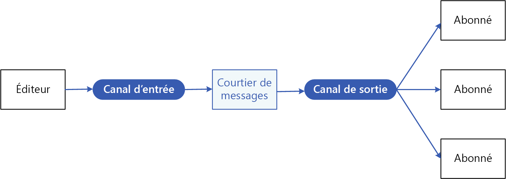
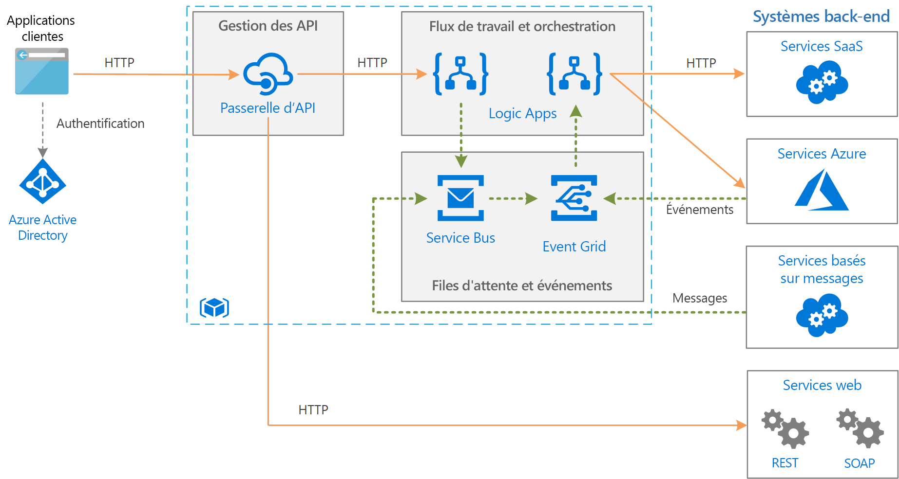

# Modèle éditeur-abonné

Activez une application pour annoncer des événements à plusieurs consommateurs intéressés de manière asynchrone, sans coupler les expéditeurs aux destinataires.

**Également appelé** : Messagerie de publication/d’abonnement

## Contexte et problème

Dans les applications cloud et distribuées, les composants du système ont souvent besoin de fournir des informations à d’autres composants au fur et à mesure que se produisent des événements.

La messagerie asynchrone est un moyen efficace de dissocier les expéditeurs des consommateurs et permet d’éviter de bloquer l’expéditeur dans l’attente d’une réponse. En revanche, l’utilisation d’une file d’attente de messages dédiée pour chaque consommateur ne permet pas d’évoluer efficacement vers un grand nombre de consommateurs. En outre, certains consommateurs peuvent s’intéresser uniquement à un sous-ensemble des informations. Comment est-ce que l’expéditeur peut annoncer des événements à tous les consommateurs intéressés sans connaître leurs identités ?

## Solution

Introduisez un sous-système de messagerie asynchrone qui inclut les éléments suivants :

- Un canal de messagerie en entrée utilisé par l’expéditeur. L’expéditeur empaquète des événements dans des messages, en utilisant un format de message connu, puis il envoie ces messages par le biais du canal d’entrée. Dans ce modèle, l’expéditeur est également appelé *éditeur*.

  > [!NOTE]
  > Un *message* est un paquet de données. Un *événement* est un message qui informe d’autres composants à propos d’une modification ou d’une action qui a eu lieu.

- Un seul canal de messagerie en sortie par consommateur. Les consommateurs sont appelés *abonnés*.

- Un mécanisme de copie de chaque message depuis le canal d’entrée jusqu’aux canaux de sortie pour tous les abonnés intéressés par ce message. Cette opération est généralement gérée par un intermédiaire comme un courtier de messages ou un bus d’événements.

Le diagramme suivant montre les composants logiques de ce modèle :

 
La messagerie de publication/d’abonnement offre les avantages suivants :

- Elle dissocie les sous-systèmes qui ont quand même besoin de communiquer. Les sous-systèmes peuvent être gérés indépendamment et les messages correctement gérés même si un ou plusieurs destinataires sont hors connexion.

- Elle accroît la scalabilité et améliore la réactivité de l’expéditeur. L’expéditeur peut rapidement envoyer un message unique au canal d’entrée, puis revenir à ses principales responsabilités de traitement. L’infrastructure de messagerie se charge de vérifier que les messages sont remis aux abonnés intéressés.

- Elle améliore la fiabilité. La messagerie asynchrone permet aux applications de continuer à s’exécuter sans interruption en cas de charge accrue et de gérer plus efficacement les défaillances intermittentes.

- Elle permet un traitement différé ou planifié. Les abonnés peuvent attendre les heures creuses pour récupérer les messages ou bien router ou traiter les messages selon une planification spécifique.

- Elle permet une intégration plus simple entre des systèmes qui utilisent des plateformes, langages de programmation ou protocoles de communication différents, ainsi qu’entre des systèmes locaux et des applications qui s’exécutent dans le cloud.

- Elle facilite les workflows asynchrones au sein d’une entreprise.

- Elle améliore la testabilité. Les canaux peuvent être supervisés et les messages inspectés ou journalisés dans le cadre d’une stratégie de test d’intégration globale.

- Elle permet de séparer les préoccupations de vos applications. Chaque application peut se concentrer sur ses fonctionnalités principales, pendant que l’infrastructure de messagerie gère tout ce qui est obligatoire pour router les messages de manière fiable vers plusieurs consommateurs. 

## Problèmes et considérations

Prenez en compte les points suivants lorsque vous choisissez comment implémenter ce modèle :

- **Technologies existantes.** Il est fortement recommandé d’utiliser des produits et services de messagerie disponibles qui prennent en charge un éditeur-abonné, plutôt que de créer le vôtre. Dans Azure, envisagez d’utiliser [Service Bus](/azure/service-bus-messaging/) ou [Event Grid](/azure/event-grid/). D’autres technologies utilisables pour la messagerie de publication/d’abonnement incluent Redis, RabbitMQ et Apache Kafka.

- **Gestion de l’abonnement.** L’infrastructure de messagerie doit fournir des mécanismes que les consommateurs peuvent utiliser pour s’abonner ou se désabonner des canaux disponibles.

- **Sécurité.** La connexion à un canal de messages doit être limitée par une stratégie de sécurité afin d’éviter toute écoute électronique par des utilisateurs ou applications non autorisés.

- **Sous-ensembles de messages.** Les abonnés ne s’intéressent généralement qu’à un sous-ensemble des messages distribués par un éditeur. Les services de messagerie permettent souvent aux abonnés d’affiner l’ensemble de messages reçus par :

  - **Rubriques.** Chaque rubrique dispose d’un canal de sortie dédié et chaque consommateur peut s’abonner à toutes les rubriques correspondantes.
  - **Filtrage du contenu.** Les messages sont inspectés et distribués en fonction de leur contenu. Chaque abonné peut spécifier le contenu qui l’intéresse.

- **Abonnement avec des caractères génériques.** Envisagez d’autoriser les abonnés à utiliser des caractères génériques pour s’abonner à plusieurs rubriques.

- **Communication bidirectionnelle.** Les canaux d’un système de publication-abonnement sont traités comme des canaux unidirectionnels. Si un abonné spécifique a besoin d’envoyer un accusé de réception ou de communiquer un état au serveur de publication, envisagez d’utiliser le [modèle requête/réponse](http://www.enterpriseintegrationpatterns.com/patterns/messaging/RequestReply.html). Ce dernier utilise un seul canal pour envoyer un message à l’abonné et un canal de réponse distinct pour la communication avec le serveur de publication.

- **Classement des messages.** L’ordre dans lequel les instances du consommateur reçoivent les messages n’est pas garanti et ne reflète pas nécessairement l’ordre dans lequel les messages ont été créés. Concevez le système de sorte à garantir que le traitement des messages est idempotent afin d’éliminer toute dépendance vis-à-vis de l’ordre de gestion des messages.

- **Priorité des messages.** Certaines solutions peuvent exiger que les messages soient traités dans un ordre spécifique. Le [modèle de file d’attente avec un ordre de priorité](priority-queue.md) fournit un mécanisme qui permet de garantir que certains messages soient remis avant les autres.

- **Messages incohérents.** un message au format incorrect ou une tâche qui nécessite un accès à des ressources non disponibles peut entraîner l’échec d’une instance de service. Le système doit éviter que de tels messages soient retournés à la file d’attente. Essayez plutôt de capturer et stocker les détails de ces messages ailleurs afin de pouvoir les analyser si nécessaire.

- **Répétition des messages**. Le même message peut être envoyé plusieurs fois. Par exemple, l’expéditeur peut subir un échec après avoir posté un message. Une nouvelle instance de l’expéditeur peut alors démarrer et répéter ce message. L’infrastructure de messagerie doit implémenter la détection et la suppression des messages en double en fonction des ID de message afin de veiller à ce qu’ils soient au maximum remis une fois.

- **Expiration des messages.** Un message peut avoir une durée de vie limitée. S’il n’est pas traité pendant cette durée, il n’est peut-être plus pertinent et doit alors être ignoré. Un expéditeur peut spécifier un délai d’expiration dans le cadre des données du message. Un destinataire peut examiner ces informations avant de décider d’exécuter la logique métier associée au message.

- **Planification des messages.** Un message peut être temporairement interdit et ne pas être traité avant une date et une heure spécifiques. Il ne doit pas être disponible pour un destinataire avant cette date.

## Quand utiliser ce modèle

Utilisez ce modèle dans les situations suivantes :

- Une application a besoin de diffuser des informations à un nombre important de consommateurs.

- Une application a besoin communiquer avec des applications ou services développés indépendamment, susceptibles d’utiliser des plateformes, langages de programmation et protocoles de communication différents.

- Une application peut envoyer des informations aux consommateurs sans avoir besoin de réponses en temps réel de la part de ces consommateurs.

- Les systèmes en cours d’intégration sont conçus pour prendre en charge un modèle de cohérence finale pour leurs données.

- Une application a besoin de communiquer des informations à plusieurs consommateurs, dont les exigences de disponibilité ou les planifications de durée de fonctionnement peuvent différer de celles de l’expéditeur.

Ce modèle peut ne pas avoir d’utilité dans les cas suivants :

- Une application comporte seulement quelques consommateurs qui ont besoin d’informations considérablement différentes de l’application de production.

- Une application exige une interaction en temps réel avec les consommateurs.

## Exemples

Le diagramme suivant montre une architecture d’intégration d’entreprise qui utilise Service Bus pour coordonner des workflows et Event Grid pour avertir les sous-systèmes des événements qui se produisent. Pour plus d’informations, consultez [Intégration d’entreprise sur Azure avec des files d’attente de messages et des événements](../reference-architectures/enterprise-integration/queues-events.md).

## Conseils et modèles connexes

Les modèles et les conseils suivants peuvent présenter un intérêt quand il s’agit d’implémenter ce modèle :

- [Choisir entre des services Azure qui remettent des messages](/azure/event-grid/compare-messaging-services).

- Le [style d’architecture basée sur les événements](../guide/architecture-styles/event-driven.md) est un style d’architecture qui utilise la messagerie de publication/d’abonnement.

- [Primer de messagerie asynchrone](https://msdn.microsoft.com/library/dn589781.aspx). les files d’attente de messages sont un mécanisme de communication asynchrone. Si un service consommateur doit envoyer une réponse à une application, il peut être nécessaire d’implémenter une certaine forme de messagerie de réponse. Le document Notions élémentaires sur la messagerie asynchrone fournit des informations sur la façon d’implémenter une messagerie de demande/réponse en utilisant des files d’attente de messages.

- [Modèle observateur](https://en.wikipedia.org/wiki/Observer_pattern). Le modèle éditeur-abonné s’appuie sur le modèle observateur en dissociant les sujets des observateurs par le biais d’une messagerie asynchrone.

- [Modèle du courtier de messages](https://en.wikipedia.org/wiki/Message_broker). De nombreux sous-systèmes de messagerie qui prennent en charge le modèle éditeur-abonné sont implémentés par le biais d’un courtier de messages.
