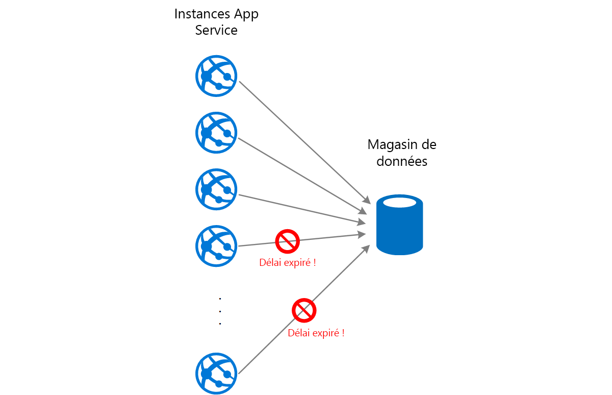

# Modèle de nivellement de charge basé sur une file d’attente

Utilisez une file d’attente qui agit comme une mémoire tampon entre une tâche et un service qu’elle appelle, afin d’atténuer les surcharges intermittentes qui entraînent l’échec du service ou l’expiration de la tâche. Cela permet de réduire l’impact des pics de demande sur la disponibilité et la réactivité de la tâche et du service.

## Contexte et problème

De nombreuses solutions cloud impliquent l’exécution de tâches qui appellent des services. Dans cet environnement, si un service est soumis à des surcharges intermittentes, cela peut provoquer des problèmes de performances et de fiabilité.

Un service peut faire partie de la même solution que les tâches qui l’utilisent, ou il peut s’agir d’un service tiers offrant un accès aux ressources fréquemment utilisées, telles qu’un cache ou un service de stockage. Si le même service est utilisé par plusieurs tâches qui s’exécutent simultanément, il peut être difficile de prévoir le volume de requêtes destinées au service un moment donné.

Un service peut connaître des pics de demande qui entraînent sa surcharge et son incapacité à répondre aux requêtes en temps voulu. L’envoi à un service d’un grand nombre de requêtes simultanées peut également entraîner l’échec du service si celui-ci n’est pas en mesure de gérer le conflit causé par ces requêtes.

## Solution

Refactorisez la solution et introduisez une file d’attente entre la tâche et le service. La tâche et le service s’exécutent de façon asynchrone. La tâche publie un message contenant les données requises par le service dans une file d’attente. La file d’attente agit comme une mémoire tampon : elle stocke le message jusqu'à ce qu’il soit récupéré par le service. Le service récupère les messages dans la file d’attente et les traite. Les requêtes issues d’un certain nombre de tâches, qui peuvent être générées à une fréquence très variable, peuvent être transmises au service de la même file d’attente de messages. Cette illustration montre l’utilisation d’une file d’attente pour niveler la charge sur un service.

La file d’attente dissocie les tâches du service, et le service peut gérer les messages à son propre rythme, quel que soit le volume de requêtes des tâches simultanées. En outre, il n’y a pas de retard pour une tâche si le service n’est pas disponible au moment de la publication du message dans la file d’attente.

Ce modèle permet de bénéficier des avantages suivants :

- Il permet d’optimiser la disponibilité, car les retards de services n’ont pas d’impact immédiat et direct sur l’application, qui peut continuer à envoyer des messages à la file d’attente même lorsque le service n’est pas disponible ou ne traite pas actuellement de messages.
- Il permet d’optimiser l’évolutivité, car à la fois le nombre de files d’attente et le nombre de services peuvent être modifiés pour répondre à la demande.
- Il permet de contrôler les coûts, car le nombre d’instances de service déployées doit uniquement être suffisant pour répondre à une charge moyenne plutôt qu’à la charge maximale.

    >  Certains services implémentent une limitation lorsque la demande atteint un seuil au-delà duquel il existe un risque d’échec du système. La limitation peut restreindre les fonctionnalités disponibles. Vous pouvez implémenter le nivellement de la charge avec ces services pour vous assurer que ce seuil n’est pas atteint.

## Problèmes et considérations

Prenez en compte les points suivants lorsque vous choisissez comment implémenter ce modèle :

- Il est nécessaire d’implémenter la logique d’application qui contrôle la fréquence à laquelle les services traitent les messages pour éviter de surcharger la ressource cible. Évitez de transférer des pics de demande à l’étape suivante du système. Testez le système avec la charge pour vous assurer qu’il fournit le niveau requise, puis ajustez le nombre de files d’attente et le nombre d’instances de service qui traitent les messages pour obtenir le résultat souhaité.
- Les files d’attente de messages constituent un mécanisme de communication unidirectionnelle. Si une tâche attend une réponse d’un service, il peut être nécessaire implémenter un mécanisme que le service peut utiliser pour envoyer une réponse. Pour en savoir plus, voir [Primer de messagerie asynchrone](https://msdn.microsoft.com/library/dn589781.aspx).
- Soyez prudent si vous appliquez la mise à l’échelle automatique aux services qui écoutent les requêtes sur la file d’attente. Cela peut entraîner une augmentation des conflits pour les ressources partagées par ces services et diminuer l’efficacité de la file d’attente pour niveler la charge.

## Quand utiliser ce modèle

Ce modèle est utile pour toute application qui utilise des services soumis à une surcharge.

Ce modèle n’est pas utile si l’application attend une réponse du service avec une latence minimale.

## Exemples

Une application web écrit des données dans un magasin de données externes. Si un grand nombre d’instances de l’application web s’exécutent simultanément, le magasin de données risque de ne pas pouvoir répondre aux requêtes assez rapidement, ce qui va entraîner l’expiration du délai d’exécution des requêtes, leur limitation ou leur échec. Le diagramme suivant montre un magasin de données saturé par un grand nombre de requêtes simultanées émanant des instances d’une application.

Pour résoudre ce problème, vous pouvez utiliser une file d’attente afin de niveler la charge entre les instances d’application et le magasin de données. Une application Azure Functions lit les messages de la file d’attente et exécute les requêtes de lecture/écriture dans le magasin de données. La logique d’application de l’application de fonction peut contrôler la fréquence à laquelle les requêtes sont passées au magasin de données pour éviter la surcharge de ce dernier. (Sinon, l’application de fonction réintroduit simplement le même problème sur le serveur back-end.)

## Conseils et modèles connexes

Les modèles et les conseils suivants peuvent aussi présenter un intérêt quand il s’agit d’implémenter ce modèle :

- [Primer de messagerie asynchrone](https://msdn.microsoft.com/library/dn589781.aspx). Les files d’attente sont par nature asynchrones. Il peut être nécessaire de reconcevoir la logique d’application dans une tâche si elle est adaptée de sorte à ne plus communiquer directement avec un service mais à utiliser une file d’attente. De même, il peut être nécessaire de refactoriser un service pour accepter les requêtes provenant d’une file d’attente. Sinon, il est parfois possible d’implémenter un service proxy, comme décrit dans l’exemple.

- [Modèle des consommateurs concurrents](./competing-consumers.md). Il est parfois possible d’exécuter plusieurs instances d’un service, chacune agissant comme un consommateur de messages à partir de la file d’attente de nivellement de charge. Vous pouvez utiliser cette approche pour ajuster la fréquence à laquelle les messages sont reçus et transmis à un service.

- [Modèle de limitation](./throttling.md). Un moyen simple d’implémenter la limitation avec un service consiste à utiliser le nivellement de charge basé sur la file d’attente et à acheminer toutes les requêtes vers un service via une file d’attente de messages. Le service peut traiter des requêtes à un rythme qui garantit que les ressources requises par le service ne sont pas épuisées, de façon à réduire le nombre de conflits éventuels.

- [Choisir entre les différents services de messagerie Azure](/azure/event-grid/compare-messaging-services). Informations sur le choix d’un mécanisme de messagerie et de file d’attente dans les applications Azure.

- [Améliorer la scalabilité dans une application web Azure](../reference-architectures/app-service-web-app/scalable-web-app.md). Cette architecture de référence inclut le nivellement de charge basé sur la file d’attente dans le cadre de l’architecture.
