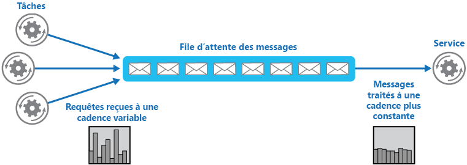

# Modèle de nivellement de charge basé sur une file d’attenteQueue-Based Load Leveling pattern

[!INCLUDE [header](../_includes/header.md)]

Utilisez une file d’attente qui agit comme une mémoire tampon entre une tâche et un service qu’elle appelle, afin d’atténuer les surcharges intermittentes qui entraînent l’échec du service ou l’expiration de la tâche. Cela permet de réduire l’impact des pics de demande sur la disponibilité et la réactivité de la tâche et du service.Use a queue that acts as a buffer between a task and a service it invokes in order to smooth intermittent heavy loads that can cause the service to fail or the task to time out. This can help to minimize the impact of peaks in demand on availability and responsiveness for both the task and the service.

## Contexte et problèmeContext and problem

De nombreuses solutions cloud impliquent l’exécution de tâches qui appellent des services.Many solutions in the cloud involve running tasks that invoke services. Dans cet environnement, si un service est soumis à des surcharges intermittentes, cela peut provoquer des problèmes de performances et de fiabilité.In this environment, if a service is subjected to intermittent heavy loads, it can cause performance or reliability issues.

Un service peut faire partie de la même solution que les tâches qui l’utilisent, ou il peut s’agir d’un service tiers offrant un accès aux ressources fréquemment utilisées, telles qu’un cache ou un service de stockage.A service could be part of the same solution as the tasks that use it, or it could be a third-party service providing access to frequently used resources such as a cache or a storage service. Si le même service est utilisé par plusieurs tâches qui s’exécutent simultanément, il peut être difficile de prévoir le volume de requêtes destinées au service un moment donné.If the same service is used by a number of tasks running concurrently, it can be difficult to predict the volume of requests to the service at any time.

Un service peut connaître des pics de demande qui entraînent sa surcharge et son incapacité à répondre aux requêtes en temps voulu.A service might experience peaks in demand that cause it to overload and be unable to respond to requests in a timely manner. L’envoi à un service d’un grand nombre de requêtes simultanées peut également entraîner l’échec du service si celui-ci n’est pas en mesure de gérer le conflit causé par ces requêtes.Flooding a service with a large number of concurrent requests can also result in the service failing if it's unable to handle the contention these requests cause.

## SolutionSolution

Refactorisez la solution et introduisez une file d’attente entre la tâche et le service.Refactor the solution and introduce a queue between the task and the service. La tâche et le service s’exécutent de façon asynchrone.The task and the service run asynchronously. La tâche publie un message contenant les données requises par le service dans une file d’attente.The task posts a message containing the data required by the service to a queue. La file d’attente agit comme une mémoire tampon : elle stocke le message jusqu'à ce qu’il soit récupéré par le service.The queue acts as a buffer, storing the message until it's retrieved by the service. Le service récupère les messages dans la file d’attente et les traite.The service retrieves the messages from the queue and processes them. Les requêtes issues d’un certain nombre de tâches, qui peuvent être générées à une fréquence très variable, peuvent être transmises au service de la même file d’attente de messages.Requests from a number of tasks, which can be generated at a highly variable rate, can be passed to the service through the same message queue. Cette illustration montre l’utilisation d’une file d’attente pour niveler la charge sur un service.This figure shows using a queue to level the load on a service.

La file d’attente dissocie les tâches du service, et le service peut gérer les messages à son propre rythme, quel que soit le volume de requêtes des tâches simultanées.The queue decouples the tasks from the service, and the service can handle the messages at its own pace regardless of the volume of requests from concurrent tasks. En outre, il n’y a pas de retard pour une tâche si le service n’est pas disponible au moment de la publication du message dans la file d’attente.Additionally, there's no delay to a task if the service isn't available at the time it posts a message to the queue.

Ce modèle permet de bénéficier des avantages suivants :This pattern provides the following benefits:

- Il permet d’optimiser la disponibilité, car les retards de services n’ont pas d’impact immédiat et direct sur l’application, qui peut continuer à envoyer des messages à la file d’attente même lorsque le service n’est pas disponible ou ne traite pas actuellement de messages.It can help to maximize availability because delays arising in services won't have an immediate and direct impact on the application, which can continue to post messages to the queue even when the service isn't available or isn't currently processing messages.
- Il permet d’optimiser l’évolutivité, car à la fois le nombre de files d’attente et le nombre de services peuvent être modifiés pour répondre à la demande.It can help to maximize scalability because both the number of queues and the number of services can be varied to meet demand.
- Il permet de contrôler les coûts, car le nombre d’instances de service déployées doit uniquement être suffisant pour répondre à une charge moyenne plutôt qu’à la charge maximale.It can help to control costs because the number of service instances deployed only have to be adequate to meet average load rather than the peak load.

    >  Certains services implémentent une limitation lorsque la demande atteint un seuil au-delà duquel il existe un risque d’échec du système.Some services implement throttling when demand reaches a threshold beyond which the system could fail. La limitation peut restreindre les fonctionnalités disponibles.Throttling can reduce the functionality available. Vous pouvez implémenter le nivellement de la charge avec ces services pour vous assurer que ce seuil n’est pas atteint.You can implement load leveling with these services to ensure that this threshold isn't reached.

## Problèmes et considérationsIssues and considerations

Prenez en compte les points suivants lorsque vous choisissez comment implémenter ce modèle :Consider the following points when deciding how to implement this pattern:

- Il est nécessaire d’implémenter la logique d’application qui contrôle la fréquence à laquelle les services traitent les messages pour éviter de surcharger la ressource cible.It's necessary to implement application logic that controls the rate at which services handle messages to avoid overwhelming the target resource. Évitez de transférer des pics de demande à l’étape suivante du système.Avoid passing spikes in demand to the next stage of the system. Testez le système avec la charge pour vous assurer qu’il fournit le niveau requise, puis ajustez le nombre de files d’attente et le nombre d’instances de service qui traitent les messages pour obtenir le résultat souhaité.Test the system under load to ensure that it provides the required leveling, and adjust the number of queues and the number of service instances that handle messages to achieve this.
- Les files d’attente de messages constituent un mécanisme de communication unidirectionnelle.Message queues are a one-way communication mechanism. Si une tâche attend une réponse d’un service, il peut être nécessaire implémenter un mécanisme que le service peut utiliser pour envoyer une réponse.If a task expects a reply from a service, it might be necessary to implement a mechanism that the service can use to send a response. Pour en savoir plus, voir [Primer de messagerie asynchrone](https://msdn.microsoft.com/library/dn589781.aspx).For more information, see the [Asynchronous Messaging Primer](https://msdn.microsoft.com/library/dn589781.aspx).
- Soyez prudent si vous appliquez la mise à l’échelle automatique aux services qui écoutent les requêtes sur la file d’attente.Be careful if you apply autoscaling to services that are listening for requests on the queue. Cela peut entraîner une augmentation des conflits pour les ressources partagées par ces services et diminuer l’efficacité de la file d’attente pour niveler la charge.This can result in increased contention for any resources that these services share and diminish the effectiveness of using the queue to level the load.

## Quand utiliser ce modèleWhen to use this pattern

Ce modèle est utile pour toute application qui utilise des services soumis à une surcharge.This pattern is useful to any application that uses services that are subject to overloading.

Ce modèle n’est pas utile si l’application attend une réponse du service avec une latence minimale.This pattern isn't useful if the application expects a response from the service with minimal latency.

## exemplesExample

Un rôle web Microsoft Azure stocke les données à l’aide d’un service de stockage distinct.A Microsoft Azure web role stores data using a separate storage service. Si un grand nombre d’instances du rôle web s’exécutent simultanément, le service de stockage risque de ne pas répondre aux requêtes assez vite pour les empêcher d’expirer ou d’échouer.If a large number of instances of the web role run concurrently, it's possible that the storage service will be unable to respond to requests quickly enough to prevent these requests from timing out or failing. Cette illustration met en évidence un service saturé par un grand nombre de requêtes simultanées émises des instances de rôle web.This figure highlights a service being overwhelmed by a large number of concurrent requests from instances of a web role.

Pour résoudre ce problème, vous pouvez utiliser une file d’attente pour niveler la charge entre les instances de rôle web et le service de stockage.To resolve this, you can use a queue to level the load between the web role instances and the storage service. Toutefois, le service de stockage est conçu pour accepter des requêtes synchrones et ne peut pas être facilement modifié pour lire les messages et gérer le débit.However, the storage service is designed to accept synchronous requests and can't be easily modified to read messages and manage throughput. Vous pouvez introduire un rôle de travail agissant en tant que service proxy, qui reçoit des requêtes de la file d’attente et les transmet au service de stockage.You can introduce a worker role to act as a proxy service that receives requests from the queue and forwards them to the storage service. La logique d’application du rôle de travail peut contrôler la fréquence à laquelle les requêtes sont transmises au service de stockage pour empêcher la surcharge de ce dernier.The application logic in the worker role can control the rate at which it passes requests to the storage service to prevent the storage service from being overwhelmed. Cette figure illustre l’utilisation d’une file d’attente et d’un rôle de travail pour niveler la charge entre les instances du rôle Web et le service.This figure illustrates using a queue and a worker role to level the load between instances of the web role and the service.

## Conseils et modèles connexesRelated patterns and guidance

Les modèles et les conseils suivants peuvent aussi présenter un intérêt quand il s’agit d’implémenter ce modèle :The following patterns and guidance might also be relevant when implementing this pattern:

- [Primer de messagerie asynchrone](https://msdn.microsoft.com/library/dn589781.aspx).[Asynchronous Messaging Primer](https://msdn.microsoft.com/library/dn589781.aspx). Les files d’attente sont par nature asynchrones.Message queues are inherently asynchronous. Il peut être nécessaire de reconcevoir la logique d’application dans une tâche si elle est adaptée de sorte à ne plus communiquer directement avec un service mais à utiliser une file d’attente.It might be necessary to redesign the application logic in a task if it's adapted from communicating directly with a service to using a message queue. De même, il peut être nécessaire de refactoriser un service pour accepter les requêtes provenant d’une file d’attente.Similarly, it might be necessary to refactor a service to accept requests from a message queue. Sinon, il est parfois possible d’implémenter un service proxy, comme décrit dans l’exemple.Alternatively, it might be possible to implement a proxy service, as described in the example.
- [Modèle des consommateurs concurrents](competing-consumers.md).[Competing Consumers pattern](competing-consumers.md). Il est parfois possible d’exécuter plusieurs instances d’un service, chacune agissant comme un consommateur de messages à partir de la file d’attente de nivellement de charge.It might be possible to run multiple instances of a service, each acting as a message consumer from the load-leveling queue. Vous pouvez utiliser cette approche pour ajuster la fréquence à laquelle les messages sont reçus et transmis à un service.You can use this approach to adjust the rate at which messages are received and passed to a service.
- [Modèle de limitation](throttling.md).[Throttling pattern](throttling.md). Un moyen simple d’implémenter la limitation avec un service consiste à utiliser le nivellement de charge basé sur la file d’attente et à acheminer toutes les requêtes vers un service via une file d’attente de messages.A simple way to implement throttling with a service is to use queue-based load leveling and route all requests to a service through a message queue. Le service peut traiter des requêtes à un rythme qui garantit que les ressources requises par le service ne sont pas épuisées, de façon à réduire le nombre de conflits éventuels.The service can process requests at a rate that ensures that resources required by the service aren't exhausted, and to reduce the amount of contention that could occur.
- [Concepts du service de file d’attente](https://msdn.microsoft.com/library/azure/dd179353.aspx).[Queue Service Concepts](https://msdn.microsoft.com/library/azure/dd179353.aspx). Informations sur le choix d’un mécanisme de messagerie et de file d’attente dans les applications Azure.Information about choosing a messaging and queuing mechanism in Azure applications.
