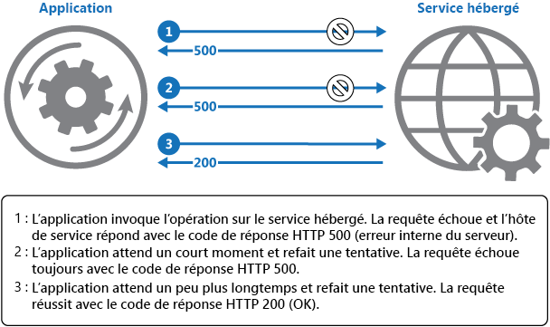

# <a name="retry-pattern"></a><span data-ttu-id="fbd0b-104">Modèle Nouvelle tentative</span><span class="sxs-lookup"><span data-stu-id="fbd0b-104">Retry pattern</span></span>

[!INCLUDE [header](../_includes/header.md)]

<span data-ttu-id="fbd0b-105">Permettez à une application de gérer les défaillances temporaires quand elle tente de se connecter à un service ou à une ressource réseau en réessayant d’exécuter en toute transparence une opération qui a échoué.</span><span class="sxs-lookup"><span data-stu-id="fbd0b-105">Enable an application to handle transient failures when it tries to connect to a service or network resource, by transparently retrying a failed operation.</span></span> <span data-ttu-id="fbd0b-106">Cela peut améliorer la stabilité de l’application.</span><span class="sxs-lookup"><span data-stu-id="fbd0b-106">This can improve the stability of the application.</span></span>

## <a name="context-and-problem"></a><span data-ttu-id="fbd0b-107">Contexte et problème</span><span class="sxs-lookup"><span data-stu-id="fbd0b-107">Context and problem</span></span>

<span data-ttu-id="fbd0b-108">Une application qui communique avec des éléments en cours d’exécution dans le cloud doit être sensible aux défaillances temporaires qui peuvent se produire dans cet environnement.</span><span class="sxs-lookup"><span data-stu-id="fbd0b-108">An application that communicates with elements running in the cloud has to be sensitive to the transient faults that can occur in this environment.</span></span> <span data-ttu-id="fbd0b-109">Les défaillances incluent la perte momentanée de la connectivité réseau aux composants et aux services, l’indisponibilité passagère d’un service ou les expirations de délai qui surviennent lorsqu’un service est occupé.</span><span class="sxs-lookup"><span data-stu-id="fbd0b-109">Faults include the momentary loss of network connectivity to components and services, the temporary unavailability of a service, or timeouts that occur when a service is busy.</span></span>

<span data-ttu-id="fbd0b-110">Ces défaillances se corrigent généralement d’elles-mêmes, et si l’action qui a déclenché une défaillance est répétée après un délai approprié, il est probable qu’elle aboutisse.</span><span class="sxs-lookup"><span data-stu-id="fbd0b-110">These faults are typically self-correcting, and if the action that triggered a fault is repeated after a suitable delay it's likely to be successful.</span></span> <span data-ttu-id="fbd0b-111">Par exemple, un service de base de données qui traite un grand nombre de requêtes simultanées peut implémenter une stratégie de limitation qui rejette temporairement toute requête supplémentaire jusqu’à allègement de sa charge de travail.</span><span class="sxs-lookup"><span data-stu-id="fbd0b-111">For example, a database service that's processing a large number of concurrent requests can implement a throttling strategy that temporarily rejects any further requests until its workload has eased.</span></span> <span data-ttu-id="fbd0b-112">Il est possible qu’une application qui tente d’accéder à la base de données ne parvienne pas à se connecter, mais si elle tente à nouveau après un certain délai, elle peut réussir.</span><span class="sxs-lookup"><span data-stu-id="fbd0b-112">An application trying to access the database might fail to connect, but if it tries again after a delay it might succeed.</span></span>

## <a name="solution"></a><span data-ttu-id="fbd0b-113">Solution</span><span class="sxs-lookup"><span data-stu-id="fbd0b-113">Solution</span></span>

<span data-ttu-id="fbd0b-114">Dans le cloud, les défaillances temporaires ne sont pas rares et une application doit être conçue pour les gérer avec soin et en toute transparence.</span><span class="sxs-lookup"><span data-stu-id="fbd0b-114">In the cloud, transient faults aren't uncommon and an application should be designed to handle them elegantly and transparently.</span></span> <span data-ttu-id="fbd0b-115">Cela permet de limiter les conséquences que peuvent avoir les défaillances sur les tâches professionnelles exécutées par l’application.</span><span class="sxs-lookup"><span data-stu-id="fbd0b-115">This minimizes the effects faults can have on the business tasks the application is performing.</span></span>

<span data-ttu-id="fbd0b-116">Si une application détecte un échec lorsqu’elle tente d’envoyer une requête à un service distant, elle peut gérer l’échec à l’aide des méthodes suivantes :</span><span class="sxs-lookup"><span data-stu-id="fbd0b-116">If an application detects a failure when it tries to send a request to a remote service, it can handle the failure using the following strategies:</span></span>

- <span data-ttu-id="fbd0b-117">**Annulation**.</span><span class="sxs-lookup"><span data-stu-id="fbd0b-117">**Cancel**.</span></span> <span data-ttu-id="fbd0b-118">Si l’erreur indique que l’échec n’est pas temporaire ou qu’il est probable qu’il se répète, l’application doit annuler l’opération et générer une exception.</span><span class="sxs-lookup"><span data-stu-id="fbd0b-118">If the fault indicates that the failure isn't transient or is unlikely to be successful if repeated, the application should cancel the operation and report an exception.</span></span> <span data-ttu-id="fbd0b-119">Par exemple, il est fort probable qu’un échec d’authentification dû à la saisie d’informations d’identification non valides se répète, peu importe le nombre de tentatives.</span><span class="sxs-lookup"><span data-stu-id="fbd0b-119">For example, an authentication failure caused by providing invalid credentials is not likely to succeed no matter how many times it's attempted.</span></span>

- <span data-ttu-id="fbd0b-120">**Nouvelle tentative**.</span><span class="sxs-lookup"><span data-stu-id="fbd0b-120">**Retry**.</span></span> <span data-ttu-id="fbd0b-121">Si l’erreur spécifique signalée est inhabituelle ou rare, elle peut avoir été provoquée par des circonstances inhabituelles telles qu’un paquet réseau endommagé au cours de sa transmission.</span><span class="sxs-lookup"><span data-stu-id="fbd0b-121">If the specific fault reported is unusual or rare, it might have been caused by unusual circumstances such as a network packet becoming corrupted while it was being transmitted.</span></span> <span data-ttu-id="fbd0b-122">Dans ce cas, l’application pourrait relancer immédiatement la requête ayant échoué, car la même erreur est peu susceptible de se reproduire et qu’il est probable que la requête aboutisse.</span><span class="sxs-lookup"><span data-stu-id="fbd0b-122">In this case, the application could retry the failing request again immediately because the same failure is unlikely to be repeated and the request will probably be successful.</span></span>

- <span data-ttu-id="fbd0b-123">**Nouvelle tentative après un délai.**</span><span class="sxs-lookup"><span data-stu-id="fbd0b-123">**Retry after delay.**</span></span> <span data-ttu-id="fbd0b-124">Si l’échec est causé par un problème courant de connectivité ou de disponibilité, le réseau ou le service nécessitera certainement un certain délai le temps que les problèmes de connectivité soient corrigés ou que la file d’attente de tâches soit vidée.</span><span class="sxs-lookup"><span data-stu-id="fbd0b-124">If the fault is caused by one of the more commonplace connectivity or busy failures, the network or service might need a short period while the connectivity issues are corrected or the backlog of work is cleared.</span></span> <span data-ttu-id="fbd0b-125">L’application doit attendre un délai approprié avant de relancer la requête.</span><span class="sxs-lookup"><span data-stu-id="fbd0b-125">The application should wait for a suitable time before retrying the request.</span></span>

<span data-ttu-id="fbd0b-126">Pour les échecs temporaires les plus courants, le délai entre chaque tentative doit être choisi de façon à pouvoir répartir les requêtes provenant de plusieurs instances de l’application de manière aussi équitable que possible.</span><span class="sxs-lookup"><span data-stu-id="fbd0b-126">For the more common transient failures, the period between retries should be chosen to spread requests from multiple instances of the application as evenly as possible.</span></span> <span data-ttu-id="fbd0b-127">Cela réduit le risque de surcharger encore davantage un service déjà occupé.</span><span class="sxs-lookup"><span data-stu-id="fbd0b-127">This reduces the chance of a busy service continuing to be overloaded.</span></span> <span data-ttu-id="fbd0b-128">Si de nombreuses instances d’une application inondent en permanence un service de demandes de nouvelles tentatives, le service aura besoin de plus de temps pour récupérer un fonctionnement normal.</span><span class="sxs-lookup"><span data-stu-id="fbd0b-128">If many instances of an application are continually overwhelming a service with retry requests, it'll take the service longer to recover.</span></span>

<span data-ttu-id="fbd0b-129">Si la demande n’aboutit toujours pas, l’application peut attendre et effectuer une nouvelle tentative.</span><span class="sxs-lookup"><span data-stu-id="fbd0b-129">If the request still fails, the application can wait and make another attempt.</span></span> <span data-ttu-id="fbd0b-130">Le cas échéant, ce processus peut être répété en augmentant le délai d’attente entre chaque nouvelle tentative, jusqu’à ce qu’un nombre maximal de demandes a été atteint.</span><span class="sxs-lookup"><span data-stu-id="fbd0b-130">If necessary, this process can be repeated with increasing delays between retry attempts, until some maximum number of requests have been attempted.</span></span> <span data-ttu-id="fbd0b-131">Le délai d’attente peut être augmenté de façon incrémentielle ou exponentielle, selon le type d’échec et la probabilité de résolution de l’erreur dans le délai spécifié.</span><span class="sxs-lookup"><span data-stu-id="fbd0b-131">The delay can be increased incrementally or exponentially, depending on the type of failure and the probability that it'll be corrected during this time.</span></span>

<span data-ttu-id="fbd0b-132">Le diagramme suivant illustre l’appel d’une opération dans un service hébergé à l’aide de ce modèle.</span><span class="sxs-lookup"><span data-stu-id="fbd0b-132">The following diagram illustrates invoking an operation in a hosted service using this pattern.</span></span> <span data-ttu-id="fbd0b-133">Si la requête échoue après un nombre prédéfini de tentatives, l’application doit traiter l’erreur en tant qu’exception et la gérer en conséquence.</span><span class="sxs-lookup"><span data-stu-id="fbd0b-133">If the request is unsuccessful after a predefined number of attempts, the application should treat the fault as an exception and handle it accordingly.</span></span>



<span data-ttu-id="fbd0b-135">L’application doit inclure toutes les tentatives d’accès à un service distant dans un code qui implémente une stratégie de nouvelle tentative correspondant à l’une des méthodes répertoriées ci-dessus.</span><span class="sxs-lookup"><span data-stu-id="fbd0b-135">The application should wrap all attempts to access a remote service in code that implements a retry policy matching one of the strategies listed above.</span></span> <span data-ttu-id="fbd0b-136">Les requêtes envoyées aux différents services peuvent être soumises à des stratégies différentes.</span><span class="sxs-lookup"><span data-stu-id="fbd0b-136">Requests sent to different services can be subject to different policies.</span></span> <span data-ttu-id="fbd0b-137">Certains éditeurs proposent des bibliothèques qui implémentent des stratégies de nouvelle tentative, où l’application peut spécifier le nombre maximal de nouvelles tentatives, le délai d’attente entre chaque tentative, ainsi que d’autres paramètres.</span><span class="sxs-lookup"><span data-stu-id="fbd0b-137">Some vendors provide libraries that implement retry policies, where the application can specify the maximum number of retries, the time between retry attempts, and other parameters.</span></span>

<span data-ttu-id="fbd0b-138">Une application doit consigner les détails des erreurs et des opérations ayant échoué.</span><span class="sxs-lookup"><span data-stu-id="fbd0b-138">An application should log the details of faults and failing operations.</span></span> <span data-ttu-id="fbd0b-139">Ces informations sont utiles pour les opérateurs.</span><span class="sxs-lookup"><span data-stu-id="fbd0b-139">This information is useful to operators.</span></span> <span data-ttu-id="fbd0b-140">Si un service est fréquemment occupé ou indisponible, cela signifie souvent que le service a épuisé ses ressources.</span><span class="sxs-lookup"><span data-stu-id="fbd0b-140">If a service is frequently unavailable or busy, it's often because the service has exhausted its resources.</span></span> <span data-ttu-id="fbd0b-141">Vous pouvez réduire la fréquence de ces erreurs en procédant à une montée en charge du service.</span><span class="sxs-lookup"><span data-stu-id="fbd0b-141">You can reduce the frequency of these faults by scaling out the service.</span></span> <span data-ttu-id="fbd0b-142">Par exemple, si un service de base de données est surchargé en permanence, il peut être utile de partitionner la base de données et de répartir la charge sur plusieurs serveurs.</span><span class="sxs-lookup"><span data-stu-id="fbd0b-142">For example, if a database service is continually overloaded, it might be beneficial to partition the database and spread the load across multiple servers.</span></span>

> <span data-ttu-id="fbd0b-143">[Microsoft Entity Framework](https://docs.microsoft.com/ef/) fournit des fonctionnalités pour relancer les opérations de base de données.</span><span class="sxs-lookup"><span data-stu-id="fbd0b-143">[Microsoft Entity Framework](https://docs.microsoft.com/ef/) provides facilities for retrying database operations.</span></span> <span data-ttu-id="fbd0b-144">De même, la plupart des services Azure et des kits de développement logiciel (SDK) clients incluent un mécanisme de nouvelle tentative.</span><span class="sxs-lookup"><span data-stu-id="fbd0b-144">Also, most Azure services and client SDKs include a retry mechanism.</span></span> <span data-ttu-id="fbd0b-145">Pour plus d’informations, consultez [Guide du mécanisme de nouvelle tentative relatif aux différents services](https://docs.microsoft.com/azure/architecture/best-practices/retry-service-specific).</span><span class="sxs-lookup"><span data-stu-id="fbd0b-145">For more information, see [Retry guidance for specific services](https://docs.microsoft.com/azure/architecture/best-practices/retry-service-specific).</span></span>

## <a name="issues-and-considerations"></a><span data-ttu-id="fbd0b-146">Problèmes et considérations</span><span class="sxs-lookup"><span data-stu-id="fbd0b-146">Issues and considerations</span></span>

<span data-ttu-id="fbd0b-147">Prenez en compte les points suivants quand vous choisissez comment implémenter ce modèle.</span><span class="sxs-lookup"><span data-stu-id="fbd0b-147">You should consider the following points when deciding how to implement this pattern.</span></span>

<span data-ttu-id="fbd0b-148">La stratégie de nouvelle tentative doit être configurée en fonction des exigences métiers de l’application et de la nature de l’échec.</span><span class="sxs-lookup"><span data-stu-id="fbd0b-148">The retry policy should be tuned to match the business requirements of the application and the nature of the failure.</span></span> <span data-ttu-id="fbd0b-149">Pour certaines opérations non critiques, il est préférable d’effectuer un Fail-fast plutôt que d’effectuer plusieurs autres tentatives qui peuvent avoir un impact sur le débit de l’application.</span><span class="sxs-lookup"><span data-stu-id="fbd0b-149">For some noncritical operations, it's better to fail fast rather than retry several times and impact the throughput of the application.</span></span> <span data-ttu-id="fbd0b-150">Par exemple, dans le cas d’une application web interactive souhaitant accéder à un service distant, il est préférable d’accepter un échec après un plus petit nombre de tentatives avec un délai d’attente court entre chaque nouvelle tentative et d’afficher un message à l’intention de l’utilisateur (par exemple, « Veuillez réessayer ultérieurement »).</span><span class="sxs-lookup"><span data-stu-id="fbd0b-150">For example, in an interactive web application accessing a remote service, it's better to fail after a smaller number of retries with only a short delay between retry attempts, and display a suitable message to the user (for example, “please try again later”).</span></span> <span data-ttu-id="fbd0b-151">Pour une application de traitement par lot, il peut être plus judicieux d’augmenter le nombre de tentatives de connexion en augmentant de manière exponentielle le délai d’attente entre chaque tentative.</span><span class="sxs-lookup"><span data-stu-id="fbd0b-151">For a batch application, it might be more appropriate to increase the number of retry attempts with an exponentially increasing delay between attempts.</span></span>

<span data-ttu-id="fbd0b-152">Une stratégie de relance agressive avec un délai minimal entre les tentatives et un grand nombre de nouvelles tentatives peut affecter encore davantage les performances d’un service occupé qui a déjà atteint ou est sur le point d’atteindre sa capacité maximale.</span><span class="sxs-lookup"><span data-stu-id="fbd0b-152">An aggressive retry policy with minimal delay between attempts, and a large number of retries, could further degrade a busy service that's running close to or at capacity.</span></span> <span data-ttu-id="fbd0b-153">Cette stratégie de relance peut également affecter la réactivité de l’application si elle tente en permanence de relancer une opération ayant échoué.</span><span class="sxs-lookup"><span data-stu-id="fbd0b-153">This retry policy could also affect the responsiveness of the application if it's continually trying to perform a failing operation.</span></span>

<span data-ttu-id="fbd0b-154">Si une requête continue d’échouer après un nombre important de nouvelles tentatives, il est préférable que l’application cesse d’envoyer de nouvelles requêtes à la même ressource et qu’elle signale immédiatement l’erreur.</span><span class="sxs-lookup"><span data-stu-id="fbd0b-154">If a request still fails after a significant number of retries, it's better for the application to prevent further requests going to the same resource and simply report a failure immediately.</span></span> <span data-ttu-id="fbd0b-155">Lorsque le délai expire, l’application peut, à titre d’essai, envoyer une ou plusieurs requêtes pour voir si elles aboutissent.</span><span class="sxs-lookup"><span data-stu-id="fbd0b-155">When the period expires, the application can tentatively allow one or more requests through to see whether they're successful.</span></span> <span data-ttu-id="fbd0b-156">Pour plus d’informations sur cette stratégie, consultez l’article [Modèle Disjoncteur](circuit-breaker.md).</span><span class="sxs-lookup"><span data-stu-id="fbd0b-156">For more details of this strategy, see the [Circuit Breaker pattern](circuit-breaker.md).</span></span>

<span data-ttu-id="fbd0b-157">Déterminez si l’opération est idempotente.</span><span class="sxs-lookup"><span data-stu-id="fbd0b-157">Consider whether the operation is idempotent.</span></span> <span data-ttu-id="fbd0b-158">Si c’est le cas, une nouvelle tentative peut être lancée sans risque.</span><span class="sxs-lookup"><span data-stu-id="fbd0b-158">If so, it's inherently safe to retry.</span></span> <span data-ttu-id="fbd0b-159">Dans le cas contraire, les nouvelles tentatives pourraient entraîner plusieurs exécutions de la même opération, causant des effets secondaires inattendus.</span><span class="sxs-lookup"><span data-stu-id="fbd0b-159">Otherwise, retries could cause the operation to be executed more than once, with unintended side effects.</span></span> <span data-ttu-id="fbd0b-160">Par exemple, un service peut recevoir la requête, la traiter avec succès, mais ne pas parvenir à envoyer une réponse.</span><span class="sxs-lookup"><span data-stu-id="fbd0b-160">For example, a service might receive the request, process the request successfully, but fail to send a response.</span></span> <span data-ttu-id="fbd0b-161">À ce stade, la logique de nouvelle tentative peut consister à renvoyer la requête en supposant que la première requête n’a pas été reçue.</span><span class="sxs-lookup"><span data-stu-id="fbd0b-161">At that point, the retry logic might re-send the request, assuming that the first request wasn't received.</span></span>

<span data-ttu-id="fbd0b-162">Une requête envoyée à un service peut échouer pour diverses raisons et déclencher différentes exceptions selon la nature de l’échec.</span><span class="sxs-lookup"><span data-stu-id="fbd0b-162">A request to a service can fail for a variety of reasons raising different exceptions depending on the nature of the failure.</span></span> <span data-ttu-id="fbd0b-163">Certaines exceptions indiquent un échec qui peut être résolu rapidement, tandis que d’autres indiquent une défaillance plus complexe.</span><span class="sxs-lookup"><span data-stu-id="fbd0b-163">Some exceptions indicate a failure that can be resolved quickly, while others indicate that the failure is longer lasting.</span></span> <span data-ttu-id="fbd0b-164">Il est recommandé que la stratégie de relance configure le délai d’attente entre les nouvelles tentatives en fonction du type d’exception générée.</span><span class="sxs-lookup"><span data-stu-id="fbd0b-164">It's useful for the retry policy to adjust the time between retry attempts based on the type of the exception.</span></span>

<span data-ttu-id="fbd0b-165">Tenez compte de la manière dont la relance d’une opération faisant partie d’une transaction affectera la cohérence globale de la transaction.</span><span class="sxs-lookup"><span data-stu-id="fbd0b-165">Consider how retrying an operation that's part of a transaction will affect the overall transaction consistency.</span></span> <span data-ttu-id="fbd0b-166">Ajustez la stratégie de relance pour les opérations transactionnelles afin de maximiser les chances de réussite et d’éviter autant que possible d’avoir à annuler toutes les étapes de la transaction.</span><span class="sxs-lookup"><span data-stu-id="fbd0b-166">Fine tune the retry policy for transactional operations to maximize the chance of success and reduce the need to undo all the transaction steps.</span></span>

<span data-ttu-id="fbd0b-167">Vérifiez que l’ensemble du code de relance a été testé pour un large éventail de conditions d’échec.</span><span class="sxs-lookup"><span data-stu-id="fbd0b-167">Ensure that all retry code is fully tested against a variety of failure conditions.</span></span> <span data-ttu-id="fbd0b-168">Vérifiez qu’il ne nuit pas gravement aux performances ou à la fiabilité de l’application, qu’il ne créé pas une charge excessive au niveau des services et des ressources, et qu’il ne génère pas des conditions de concurrence ou des goulots d’étranglement.</span><span class="sxs-lookup"><span data-stu-id="fbd0b-168">Check that it doesn't severely impact the performance or reliability of the application, cause excessive load on services and resources, or generate race conditions or bottlenecks.</span></span>

<span data-ttu-id="fbd0b-169">Implémentez la logique de nouvelle tentative uniquement lorsque vous avez identifié le contexte à l’origine de l’échec d’une opération.</span><span class="sxs-lookup"><span data-stu-id="fbd0b-169">Implement retry logic only where the full context of a failing operation is understood.</span></span> <span data-ttu-id="fbd0b-170">Par exemple, si une tâche qui contient une stratégie de nouvelle tentative appelle une autre tâche qui contient également une stratégie de nouvelle tentative, cette couche supplémentaire de nouvelles tentatives peut retarder de manière considérable le processus de traitement.</span><span class="sxs-lookup"><span data-stu-id="fbd0b-170">For example, if a task that contains a retry policy invokes another task that also contains a retry policy, this extra layer of retries can add long delays to the processing.</span></span> <span data-ttu-id="fbd0b-171">Il peut être préférable d’effectuer un Fail-fast de la tâche de niveau inférieur et d’indiquer la raison de l’échec à la tâche qui l’a appelée.</span><span class="sxs-lookup"><span data-stu-id="fbd0b-171">It might be better to configure the lower-level task to fail fast and report the reason for the failure back to the task that invoked it.</span></span> <span data-ttu-id="fbd0b-172">Cette tâche de niveau supérieur peut alors gérer l’échec en fonction de sa propre stratégie.</span><span class="sxs-lookup"><span data-stu-id="fbd0b-172">This higher-level task can then handle the failure based on its own policy.</span></span>

<span data-ttu-id="fbd0b-173">Il est important de consigner tous les échecs de connexion qui entraînent une nouvelle tentative afin que les problèmes sous-jacents liés à l’application, aux services ou aux ressources puissent être identifiés.</span><span class="sxs-lookup"><span data-stu-id="fbd0b-173">It's important to log all connectivity failures that cause a retry so that underlying problems with the application, services, or resources can be identified.</span></span>

<span data-ttu-id="fbd0b-174">Recherchez les erreurs qui sont les plus susceptibles de se produire pour un service ou une ressource afin de découvrir si elles sont susceptibles d’être longues ou définitives.</span><span class="sxs-lookup"><span data-stu-id="fbd0b-174">Investigate the faults that are most likely to occur for a service or a resource to discover if they're likely to be long lasting or terminal.</span></span> <span data-ttu-id="fbd0b-175">Si elles le sont, il est préférable de gérer l’erreur comme une exception.</span><span class="sxs-lookup"><span data-stu-id="fbd0b-175">If they are, it's better to handle the fault as an exception.</span></span> <span data-ttu-id="fbd0b-176">L’application peut signaler ou consigner l’exception, puis retenter l’opération en appelant un autre service (le cas échéant) ou en fournissant un niveau de fonctionnalité inférieur.</span><span class="sxs-lookup"><span data-stu-id="fbd0b-176">The application can report or log the exception, and then try to continue either by invoking an alternative service (if one is available), or by offering degraded functionality.</span></span> <span data-ttu-id="fbd0b-177">Pour plus d’informations sur la façon de détecter et de gérer les erreurs de longue durée, consultez l’article [Modèle Disjoncteur](circuit-breaker.md).</span><span class="sxs-lookup"><span data-stu-id="fbd0b-177">For more information on how to detect and handle long-lasting faults, see the [Circuit Breaker pattern](circuit-breaker.md).</span></span>

## <a name="when-to-use-this-pattern"></a><span data-ttu-id="fbd0b-178">Quand utiliser ce modèle</span><span class="sxs-lookup"><span data-stu-id="fbd0b-178">When to use this pattern</span></span>

<span data-ttu-id="fbd0b-179">Utilisez ce modèle lorsqu’une application rencontre des erreurs temporaires au moment d’interagir avec un service distant ou d’accéder à une ressource distante.</span><span class="sxs-lookup"><span data-stu-id="fbd0b-179">Use this pattern when an application could experience transient faults as it interacts with a remote service or accesses a remote resource.</span></span> <span data-ttu-id="fbd0b-180">Ces erreurs sont normalement de courte durée et une requête ayant échoué précédemment peut aboutir lors d’une nouvelle tentative.</span><span class="sxs-lookup"><span data-stu-id="fbd0b-180">These faults are expected to be short lived, and repeating a request that has previously failed could succeed on a subsequent attempt.</span></span>

<span data-ttu-id="fbd0b-181">Ce modèle peut ne pas avoir d’utilité dans les cas suivants :</span><span class="sxs-lookup"><span data-stu-id="fbd0b-181">This pattern might not be useful:</span></span>

- <span data-ttu-id="fbd0b-182">Lorsqu’une erreur est susceptible d’être de longue durée, car cela peut affecter la réactivité d’une application.</span><span class="sxs-lookup"><span data-stu-id="fbd0b-182">When a fault is likely to be long lasting, because this can affect the responsiveness of an application.</span></span> <span data-ttu-id="fbd0b-183">L’application peut perdre du temps et des ressources à essayer de répéter une requête qui est susceptible d’échouer.</span><span class="sxs-lookup"><span data-stu-id="fbd0b-183">The application might be wasting time and resources trying to repeat a request that's likely to fail.</span></span>
- <span data-ttu-id="fbd0b-184">Pour gérer les échecs qui ne sont pas dus à des erreurs temporaires, tels que les exceptions internes générées par des erreurs dans la logique métier d’une application.</span><span class="sxs-lookup"><span data-stu-id="fbd0b-184">For handling failures that aren't due to transient faults, such as internal exceptions caused by errors in the business logic of an application.</span></span>
- <span data-ttu-id="fbd0b-185">Pour éviter de résoudre les problèmes d’extensibilité dans un système.</span><span class="sxs-lookup"><span data-stu-id="fbd0b-185">As an alternative to addressing scalability issues in a system.</span></span> <span data-ttu-id="fbd0b-186">Si une application génère fréquemment des erreurs liées à la disponibilité, cela indique souvent que le service ou la ressource concerné(e) doit être mis(e) à l’échelle.</span><span class="sxs-lookup"><span data-stu-id="fbd0b-186">If an application experiences frequent busy faults, it's often a sign that the service or resource being accessed should be scaled up.</span></span>

## <a name="example"></a><span data-ttu-id="fbd0b-187">exemples</span><span class="sxs-lookup"><span data-stu-id="fbd0b-187">Example</span></span>

<span data-ttu-id="fbd0b-188">Cet exemple en C# illustre une implémentation du modèle Nouvelle tentative.</span><span class="sxs-lookup"><span data-stu-id="fbd0b-188">This example in C# illustrates an implementation of the Retry pattern.</span></span> <span data-ttu-id="fbd0b-189">La méthode `OperationWithBasicRetryAsync`, illustrée ci-dessous, appelle un service externe en mode asynchrone via la méthode `TransientOperationAsync`.</span><span class="sxs-lookup"><span data-stu-id="fbd0b-189">The `OperationWithBasicRetryAsync` method, shown below, invokes an external service asynchronously through the `TransientOperationAsync` method.</span></span> <span data-ttu-id="fbd0b-190">Les détails de la méthode `TransientOperationAsync` sont propres au service et ne sont donc pas spécifiés dans l’exemple de code.</span><span class="sxs-lookup"><span data-stu-id="fbd0b-190">The details of the `TransientOperationAsync` method will be specific to the service and are omitted from the sample code.</span></span>

```csharp
private int retryCount = 3;
private readonly TimeSpan delay = TimeSpan.FromSeconds(5);

public async Task OperationWithBasicRetryAsync()
{
  int currentRetry = 0;

  for (;;)
  {
    try
    {
      // Call external service.
      await TransientOperationAsync();

      // Return or break.
      break;
    }
    catch (Exception ex)
    {
      Trace.TraceError("Operation Exception");

      currentRetry++;

      // Check if the exception thrown was a transient exception
      // based on the logic in the error detection strategy.
      // Determine whether to retry the operation, as well as how
      // long to wait, based on the retry strategy.
      if (currentRetry > this.retryCount || !IsTransient(ex))
      {
        // If this isn't a transient error or we shouldn't retry, 
        // rethrow the exception.
        throw;
      }
    }

    // Wait to retry the operation.
    // Consider calculating an exponential delay here and
    // using a strategy best suited for the operation and fault.
    await Task.Delay(delay);
  }
}

// Async method that wraps a call to a remote service (details not shown).
private async Task TransientOperationAsync()
{
  ...
}
```

<span data-ttu-id="fbd0b-191">L’instruction qui appelle cette méthode se trouve dans un bloc try/catch encapsulé dans une boucle for.</span><span class="sxs-lookup"><span data-stu-id="fbd0b-191">The statement that invokes this method is contained in a try/catch block wrapped in a for loop.</span></span> <span data-ttu-id="fbd0b-192">La boucle for s’arrête si l’appel envoyé à la méthode `TransientOperationAsync` aboutit sans générer d’exception.</span><span class="sxs-lookup"><span data-stu-id="fbd0b-192">The for loop exits if the call to the `TransientOperationAsync` method succeeds without throwing an exception.</span></span> <span data-ttu-id="fbd0b-193">Si la méthode `TransientOperationAsync` échoue, le bloc catch recherche la raison de l’échec.</span><span class="sxs-lookup"><span data-stu-id="fbd0b-193">If the `TransientOperationAsync` method fails, the catch block examines the reason for the failure.</span></span> <span data-ttu-id="fbd0b-194">Si l’erreur est considérée comme temporaire, le code attend un court délai avant de retenter l’opération.</span><span class="sxs-lookup"><span data-stu-id="fbd0b-194">If it's believed to be a transient error the code waits for a short delay before retrying the operation.</span></span>

<span data-ttu-id="fbd0b-195">La boucle for enregistre également le nombre de fois où l’opération a été tentée. Si le code échoue à trois reprises, l’exception est considérée comme plus longue.</span><span class="sxs-lookup"><span data-stu-id="fbd0b-195">The for loop also tracks the number of times that the operation has been attempted, and if the code fails three times the exception is assumed to be more long lasting.</span></span> <span data-ttu-id="fbd0b-196">Si l’exception n’est pas temporaire ou qu’elle est de longue durée, le gestionnaire catch génère une exception.</span><span class="sxs-lookup"><span data-stu-id="fbd0b-196">If the exception isn't transient or it's long lasting, the catch handler throws an exception.</span></span> <span data-ttu-id="fbd0b-197">Cette exception ferme la boucle for et doit être interceptée par le code qui appelle la méthode `OperationWithBasicRetryAsync`.</span><span class="sxs-lookup"><span data-stu-id="fbd0b-197">This exception exits the for loop and should be caught by the code that invokes the `OperationWithBasicRetryAsync` method.</span></span>

<span data-ttu-id="fbd0b-198">La méthode `IsTransient`, illustrée ci-dessous, recherche un ensemble spécifique d’exceptions en fonction de l’environnement dans lequel le code est exécuté.</span><span class="sxs-lookup"><span data-stu-id="fbd0b-198">The `IsTransient` method, shown below, checks for a specific set of exceptions that are relevant to the environment the code is run in.</span></span> <span data-ttu-id="fbd0b-199">La définition d’une exception temporaire varie selon les ressources ciblées et l’environnement dans lequel l’opération est exécutée.</span><span class="sxs-lookup"><span data-stu-id="fbd0b-199">The definition of a transient exception will vary according to the resources being accessed and the environment the operation is being performed in.</span></span>

```csharp
private bool IsTransient(Exception ex)
{
  // Determine if the exception is transient.
  // In some cases this is as simple as checking the exception type, in other
  // cases it might be necessary to inspect other properties of the exception.
  if (ex is OperationTransientException)
    return true;

  var webException = ex as WebException;
  if (webException != null)
  {
    // If the web exception contains one of the following status values
    // it might be transient.
    return new[] {WebExceptionStatus.ConnectionClosed,
                  WebExceptionStatus.Timeout,
                  WebExceptionStatus.RequestCanceled }.
            Contains(webException.Status);
  }

  // Additional exception checking logic goes here.
  return false;
}
```

## <a name="related-patterns-and-guidance"></a><span data-ttu-id="fbd0b-200">Conseils et modèles connexes</span><span class="sxs-lookup"><span data-stu-id="fbd0b-200">Related patterns and guidance</span></span>

- <span data-ttu-id="fbd0b-201">[Modèle Disjoncteur](circuit-breaker.md).</span><span class="sxs-lookup"><span data-stu-id="fbd0b-201">[Circuit Breaker pattern](circuit-breaker.md).</span></span> <span data-ttu-id="fbd0b-202">Le modèle Nouvelle tentative est idéal pour gérer les erreurs temporaires.</span><span class="sxs-lookup"><span data-stu-id="fbd0b-202">The Retry pattern is useful for handling transient faults.</span></span> <span data-ttu-id="fbd0b-203">Lorsque l’erreur semble être de plus longue durée, il peut être plus judicieux d’implémenter le modèle Disjoncteur.</span><span class="sxs-lookup"><span data-stu-id="fbd0b-203">If a failure is expected to be more long lasting, it might be more appropriate to implement the Circuit Breaker pattern.</span></span> <span data-ttu-id="fbd0b-204">Le modèle Nouvelle tentative peut également être combiné à un modèle Disjoncteur afin de mettre en place une approche complète de gestion des erreurs.</span><span class="sxs-lookup"><span data-stu-id="fbd0b-204">The Retry pattern can also be used in conjunction with a circuit breaker to provide a comprehensive approach to handling faults.</span></span>
- [<span data-ttu-id="fbd0b-205">Guide du mécanisme de nouvelle tentative relatif aux différents services</span><span class="sxs-lookup"><span data-stu-id="fbd0b-205">Retry guidance for specific services</span></span>](https://docs.microsoft.com/azure/architecture/best-practices/retry-service-specific)
- [<span data-ttu-id="fbd0b-206">Résilience de connexion</span><span class="sxs-lookup"><span data-stu-id="fbd0b-206">Connection Resiliency</span></span>](https://docs.microsoft.com/ef/core/miscellaneous/connection-resiliency)
