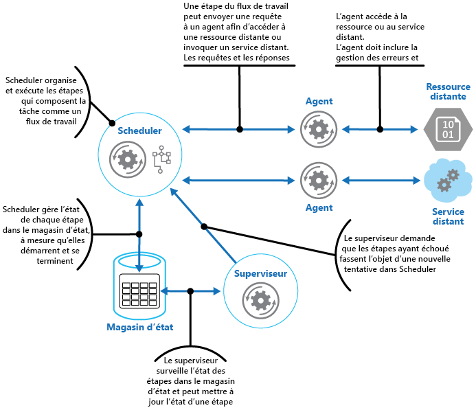
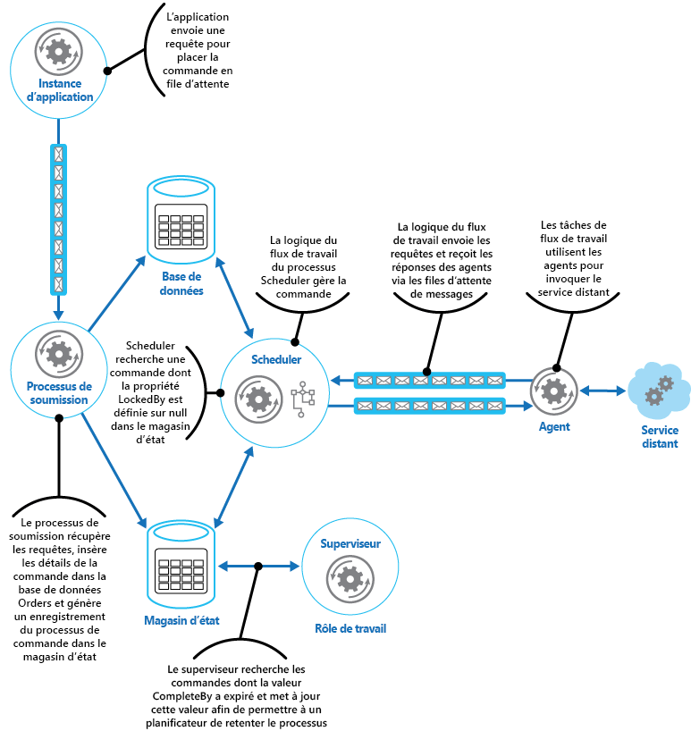

# Modèle de superviseur de l’agent du planificateurScheduler Agent Supervisor pattern

[!INCLUDE [header](../_includes/header.md)]

Coordonnez un ensemble d’actions distribuées en une seule opération.Coordinate a set of distributed actions as a single operation. Si une des actions échoue, essayez de gérer les échecs de façon transparente ou annulez le travail qui était effectué, de sorte que l’intégralité de l’opération réussisse ou échoue.If any of the actions fail, try to handle the failures transparently, or else undo the work that was performed, so the entire operation succeeds or fails as a whole. Cela peut doter un système distribué de capacités de résilience en lui permettant de récupérer et de réessayer des actions qui échouent en raison d’exceptions temporaires, d’erreurs de longue durée et d’échecs de processus.This can add resiliency to a distributed system, by enabling it to recover and retry actions that fail due to transient exceptions, long-lasting faults, and process failures.

## Contexte et problèmeContext and problem

Une application effectue des tâches comprenant plusieurs étapes, dont certaines nécessitent l’utilisation de services distants ou l’accès à des ressources distantes.An application performs tasks that include a number of steps, some of which might invoke remote services or access remote resources. Les étapes peuvent être indépendantes les unes des autres, mais elles restent orchestrées par la logique d’application qui implémente la tâche.The individual steps might be independent of each other, but they are orchestrated by the application logic that implements the task.

Dès que possible, l’application doit s’assurer que la tâche s’exécute jusqu’au bout et résoudre les échecs susceptibles de se produire lors de l’accès à des ressources ou des services distants.Whenever possible, the application should ensure that the task runs to completion and resolve any failures that might occur when accessing remote services or resources. Les échecs peuvent avoir de nombreuses causes.Failures can occur for many reasons. Par exemple, le réseau peut être hors service, les communications peuvent être interrompues, un service distant peut ne pas répondre ou se trouver dans un état instable, ou une ressource distante peut être temporairement inaccessible, notamment en raison de contraintes de ressources.For example, the network might be down, communications could be interrupted, a remote service might be unresponsive or in an unstable state, or a remote resource might be temporarily inaccessible, perhaps due to resource constraints. Dans de nombreux cas, les échecs sont temporaires et peuvent être gérés à l’aide du [modèle Nouvelle tentative](./retry.md).In many cases the failures will be transient and can be handled by using the [Retry pattern](./retry.md).

Si l’application détecte une erreur plus permanente de laquelle elle ne peut pas récupérer facilement, elle doit être en mesure de restaurer le système à un état cohérent et de garantir l’intégrité de l’ensemble de l’opération.If the application detects a more permanent fault it can't easily recover from, it must be able to restore the system to a consistent state and ensure integrity of the entire operation.

## SolutionSolution

Le modèle de superviseur de l’agent du planificateur définit les acteurs suivants.The Scheduler Agent Supervisor pattern defines the following actors. Ces acteurs orchestrent les étapes à effectuer dans le cadre de la tâche globale.These actors orchestrate the steps to be performed as part of the overall task.

- Le **planificateur** fait en sorte que les étapes qui composent la tâche soient exécutées et orchestre leur opération.The **Scheduler** arranges for the steps that make up the task to be executed and orchestrates their operation. Ces étapes peuvent être combinées dans un pipeline ou un flux de travail.These steps can be combined into a pipeline or workflow. Le planificateur est chargé de s’assurer que les étapes de ce flux de travail sont effectuées dans le bon ordre.The Scheduler is responsible for ensuring that the steps in this workflow are performed in the right order. Lors de l’exécution de chaque étape, le planificateur enregistre l’état du flux de travail, par exemple « step not yet started » (étape pas encore démarrée), « step running » (étape en cours d’exécution) ou « step completed » (étape terminée).As each step is performed, the Scheduler records the state of the workflow, such as "step not yet started," "step running," or "step completed." Les informations d’état doivent également inclure une limite maximale de temps pour l’exécution de l’étape, appelée heure limite d’achèvement.The state information should also include an upper limit of the time allowed for the step to finish, called the complete-by time. Si une étape doit pouvoir accéder à une ressource ou un service distant, le planificateur appelle l’agent approprié, en lui transmettant les détails du travail à accomplir.If a step requires access to a remote service or resource, the Scheduler invokes the appropriate Agent, passing it the details of the work to be performed. Le planificateur s’appuie généralement sur une messagerie requête/réponse pour communiquer avec un agent.The Scheduler typically communicates with an Agent using asynchronous request/response messaging. Celle-ci peut être implémentée à l’aide de files d’attente, mais aussi à l’aide des autres technologies de messagerie distribuée.This can be implemented using queues, although other distributed messaging technologies could be used instead.

    > Le planificateur exécute une fonction similaire à celle du gestionnaire de processus dans le [modèle de gestionnaire de processus](https://www.enterpriseintegrationpatterns.com/patterns/messaging/ProcessManager.html).The Scheduler performs a similar function to the Process Manager in the [Process Manager pattern](https://www.enterpriseintegrationpatterns.com/patterns/messaging/ProcessManager.html). Le flux de travail proprement dit est généralement défini et implémenté par un moteur de flux de travail contrôlé par le planificateur.The actual workflow is typically defined and implemented by a workflow engine that's controlled by the Scheduler. Cette approche permet de dissocier du planificateur la logique métier incluse dans le flux de travail.This approach decouples the business logic in the workflow from the Scheduler.

- L’**agent** contient une logique qui encapsule un appel à un service distant ou l’accès à une ressource distante référencée par une étape d’une tâche.The **Agent** contains logic that encapsulates a call to a remote service, or access to a remote resource referenced by a step in a task. Chaque agent inclut généralement dans un wrapper les appels à un service ou une ressource unique, en implémentant la logique de gestion des erreurs ou de nouvelle tentative appropriée (soumise à un délai d’attente limite, comme décrit plus loin dans cet article).Each Agent typically wraps calls to a single service or resource, implementing the appropriate error handling and retry logic (subject to a timeout constraint, described later). Si les étapes du flux de travail exécuté par le planificateur utilisent plusieurs services et ressources pour les différentes étapes, chaque étape peut référencer un autre agent (il s’agit d’un détail d’implémentation du modèle).If the steps in the workflow being run by the Scheduler use several services and resources across different steps, each step might reference a different Agent (this is an implementation detail of the pattern).

- Le **superviseur** surveille l’état des étapes de la tâche exécutée par le planificateur.The **Supervisor** monitors the status of the steps in the task being performed by the Scheduler. Il s’exécute régulièrement (la fréquence est propre au système) et examine l’état des étapes gérées par le planificateur.It runs periodically (the frequency will be system specific), and examines the status of steps maintained by the Scheduler. S’il détecte des étapes dont le délai d’attente a expiré ou qui ont échoué, il fait en sorte que l’agent approprié récupère l’étape ou mette en œuvre la mesure corrective appropriée (cela peut impliquer la modification de l’état d’une étape).If it detects any that have timed out or failed, it arranges for the appropriate Agent to recover the step or execute the appropriate remedial action (this might involve modifying the status of a step). Notez que les mesures de récupération ou correctives sont implémentées par le planificateur et les agents.Note that the recovery or remedial actions are implemented by the Scheduler and Agents. Le superviseur doit simplement demander que ces mesures soient mises en œuvre.The Supervisor should simply request that these actions be performed.

Le planificateur, l’agent et le superviseur sont des composants logiques dont l’implémentation physique dépend de la technologie utilisée.The Scheduler, Agent, and Supervisor are logical components and their physical implementation depends on the technology being used. Par exemple, plusieurs agents logiques peuvent être implémentés dans un même service web.For example, several logical agents might be implemented as part of a single web service.

Le planificateur conserve les informations sur la progression de la tâche et l’état de chaque étape dans un magasin de données durable, appelé magasin d’état.The Scheduler maintains information about the progress of the task and the state of each step in a durable data store, called the state store. Le superviseur peut utiliser ces informations pour déterminer si une étape a échoué.The Supervisor can use this information to help determine whether a step has failed. La figure suivante illustre la relation entre le planificateur, les agents, le superviseur et le magasin d’état.The figure illustrates the relationship between the Scheduler, the Agents, the Supervisor, and the state store.

> [!NOTE]
> Ce diagramme présente une version simplifiée du modèle.This diagram shows a simplified version of the pattern. Dans une implémentation réelle, plusieurs instances du planificateur peuvent s’exécuter simultanément, chacune constituée d’un sous-ensemble de tâches.In a real implementation, there might be many instances of the Scheduler running concurrently, each a subset of tasks. De même, le système peut exécuter plusieurs instances de chaque agent, voire plusieurs superviseurs.Similarly, the system could run multiple instances of each Agent, or even multiple Supervisors. Dans ce cas, les superviseurs doivent coordonner soigneusement leur travail entre eux pour s’assurer qu’ils ne cherchent pas à récupérer les mêmes étapes et tâches ayant échoué.In this case, Supervisors must coordinate their work with each other carefully to ensure that they don’t compete to recover the same failed steps and tasks. Le [modèle d’élection du responsable](./leader-election.md) offre une solution possible à ce problème.The [Leader Election pattern](./leader-election.md) provides one possible solution to this problem.

Quand l’application est prête à exécuter une tâche, elle soumet une requête au planificateur.When the application is ready to run a task, it submits a request to the Scheduler. Le planificateur enregistre les informations d’état initiales sur la tâche et ses étapes (par exemple, « step not yet started » (étape pas encore démarrée)) dans le magasin d’état, puis commence à exécuter les opérations définies par le flux de travail.The Scheduler records initial state information about the task and its steps (for example, step not yet started) in the state store and then starts performing the operations defined by the workflow. Quand le planificateur commence chaque étape, il met à jour les informations sur l’état de l’étape en question dans le magasin d’état (par exemple, « step running » (étape en cours d’exécution)).As the Scheduler starts each step, it updates the information about the state of that step in the state store (for example, step running).

Si une étape référence une ressource ou un service distant, le planificateur envoie un message à l’agent approprié.If a step references a remote service or resource, the Scheduler sends a message to the appropriate Agent. Le message contient les informations que l’agent doit transmettre au service ou dont il a besoin pour accéder à la ressource, ainsi que l’heure limite d’achèvement de l’opération.The message contains the information that the Agent needs to pass to the service or access the resource, in addition to the complete-by time for the operation. Si l’agent accomplit son opération avec succès, il renvoie une réponse au planificateur.If the Agent completes its operation successfully, it returns a response to the Scheduler. Le planificateur peut alors mettre à jour les informations d’état dans le magasin d’état (par exemple, « step completed » (étape terminée)) et effectuer l’étape suivante.The Scheduler can then update the state information in the state store (for example, step completed) and perform the next step. Ce processus se poursuit jusqu’à ce que la tâche entière soit terminée.This process continues until the entire task is complete.

Un agent peut implémenter n’importe quelle logique de nouvelle tentative nécessaire pour accomplir son travail.An Agent can implement any retry logic that's necessary to perform its work. Cependant, si l’agent ne termine son travail avant le dépassement de l’heure limite d’achèvement, le planificateur suppose que l’opération a échoué.However, if the Agent doesn't complete its work before the complete-by period expires, the Scheduler will assume that the operation has failed. Dans ce cas, l’agent doit arrêter son travail et ne doit pas essayer de renvoyer quoi que ce soit au planificateur (pas même un message d’erreur) ou tenter de mettre en œuvre une forme quelconque de récupération.In this case, the Agent should stop its work and not try to return anything to the Scheduler (not even an error message), or try any form of recovery. En effet, après que le délai d’attente d’une étape a expiré ou que celle-ci a échoué, une autre instance de l’agent peut être programmée pour exécuter l’étape ayant échoué (ce processus est décrit plus loin).The reason for this restriction is that, after a step has timed out or failed, another instance of the Agent might be scheduled to run the failing step (this process is described later).

Si l’agent échoue, le planificateur ne reçoit pas de réponse.If the Agent fails, the Scheduler won't receive a response. Le modèle ne fait pas de distinction entre une étape dont le délai d’attente a expiré et une étape qui a réellement échoué.The pattern doesn't make a distinction between a step that has timed out and one that has genuinely failed.

Si le délai d’attente d’une étape expire ou si celle-ci échoue, le magasin d’état contiendra un enregistrement indiquant que l’étape est en cours d’exécution, mais l’heure limite d’achèvement sera dépassée.If a step times out or fails, the state store will contain a record that indicates that the step is running, but the complete-by time will have passed. Le superviseur recherche les étapes dans cette situation et essaie de les récupérer.The Supervisor looks for steps like this and tries to recover them. Une stratégie possible pour le superviseur consiste à mettre à jour la valeur de l’heure limite d’achèvement afin d’augmenter le temps disponible pour terminer l’étape, puis à envoyer au planificateur un message identifiant l’étape dont le délai d’attente a expiré. Le planificateur peut alors tenter de répéter cette étape.One possible strategy is for the Supervisor to update the complete-by value to extend the time available to complete the step, and then send a message to the Scheduler identifying the step that has timed out. The Scheduler can then try to repeat this step. Cependant, cette conception requiert que les tâches soient idempotentes.However, this design requires the tasks to be idempotent.

Le superviseur peut avoir besoin d’empêcher que la même étape fasse l’objet de nouvelles tentatives si elle échoue ou si son délai d’attente expire continuellement. Pour ce faire, le superviseur peut conserver un compteur du nombre de nouvelles tentatives pour chaque étape, en plus des informations d’état, dans le magasin d’état.The Supervisor might need to prevent the same step from being retried if it continually fails or times out. To do this, the Supervisor could maintain a retry count for each step, along with the state information, in the state store. Si ce nombre dépasse un seuil prédéfini, le superviseur peut adopter une stratégie consistant à attendre plus longtemps avant de signaler au planificateur qu’il doit réessayer cette étape, en partant du principe que l’erreur pourra être résolue pendant cette période.If this count exceeds a predefined threshold the Supervisor can adopt a strategy of waiting for an extended period before notifying the Scheduler that it should retry the step, in the expectation that the fault will be resolved during this period. Le superviseur peut également envoyer un message au planificateur pour demander l’annulation de la tâche entière en implémentant un [modèle de transaction de compensation](./compensating-transaction.md).Alternatively, the Supervisor can send a message to the Scheduler to request the entire task be undone by implementing a [Compensating Transaction pattern](./compensating-transaction.md). Cette approche implique que le planificateur et les agents fournissent les informations nécessaires afin d’implémenter les opérations de compensation pour chaque étape qui s’est terminée correctement.This approach will depend on the Scheduler and Agents providing the information necessary to implement the compensating operations for each step that completed successfully.

> Le superviseur n’a pas pour rôle de surveiller le planificateur et les agents, et de les redémarrer s’ils venaient à échouer.It isn't the purpose of the Supervisor to monitor the Scheduler and Agents, and restart them if they fail. Cet aspect du système doit être géré par l’infrastructure dans laquelle ces composants sont exécutés.This aspect of the system should be handled by the infrastructure these components are running in. De même, le superviseur ne doit pas avoir connaissance des opérations métier exécutées par les tâches accomplies par le planificateur (y compris le mode de compensation en cas d’échec de ces tâches).Similarly, the Supervisor shouldn't have knowledge of the actual business operations that the tasks being performed by the Scheduler are running (including how to compensate should these tasks fail). C’est le rôle de la logique de flux de travail implémentée par le planificateur.This is the purpose of the workflow logic implemented by the Scheduler. La seule responsabilité du superviseur consiste à déterminer si une étape a échoué et à faire en sorte qu’elle soit répétée ou que l’intégralité de la tâche contenant l’étape qui a échoué soit annulée.The sole responsibility of the Supervisor is to determine whether a step has failed and arrange either for it to be repeated or for the entire task containing the failed step to be undone.

Si le planificateur est redémarré après un échec ou si le flux de travail exécuté par le planificateur s’arrête de manière inattendue, le planificateur doit être en mesure de déterminer l’état des tâches en cours au moment de l’échec et être prêt à reprendre cette tâche à partir de ce point.If the Scheduler is restarted after a failure, or the workflow being performed by the Scheduler terminates unexpectedly, the Scheduler should be able to determine the status of any inflight task that it was handling when it failed, and be prepared to resume this task from that point. Les détails d’implémentation de ce processus sont le plus souvent propres au système.The implementation details of this process are likely to be system specific. Si la tâche ne peut pas être récupérée, il peut être nécessaire d’annuler le travail déjà effectué par la tâche.If the task can't be recovered, it might be necessary to undo the work already performed by the task. L’implémentation d’une [transaction de compensation](./compensating-transaction.md) peut également être requise.This might also require implementing a [compensating transaction](./compensating-transaction.md).

Le principal avantage de ce modèle est que le système est résilient en cas d’échec temporaire ou irrécupérable inattendu.The key advantage of this pattern is that the system is resilient in the event of unexpected temporary or unrecoverable failures. Le système peut être construit de manière à être doté d’une capacité de réparation spontanée.The system can be constructed to be self healing. Par exemple, si un agent ou le planificateur échoue, un nouvel agent peut être démarré et le superviseur peut faire en sorte que l’exécution d’une tâche reprenne.For example, if an Agent or the Scheduler fails, a new one can be started and the Supervisor can arrange for a task to be resumed. Si le superviseur échoue, une autre instance peut être démarrée et peut reprendre là où l’échec s’est produit.If the Supervisor fails, another instance can be started and can take over from where the failure occurred. Si le superviseur est programmé pour s’exécuter périodiquement, une nouvelle instance peut être démarrée automatiquement après un intervalle prédéfini.If the Supervisor is scheduled to run periodically, a new instance can be automatically started after a predefined interval. Le magasin d’état peut être répliqué afin d’augmenter encore plus le degré de résilience.The state store can be replicated to reach an even greater degree of resiliency.

## Problèmes et considérationsIssues and considerations

Prenez en compte les points suivants quand vous choisissez comment implémenter ce modèle :You should consider the following points when deciding how to implement this pattern:

- Ce modèle peut être difficile à implémenter et nécessite des tests approfondis de chaque mode d’échec possible du système.This pattern can be difficult to implement and requires thorough testing of each possible failure mode of the system.

- La logique de récupération/nouvelle tentative implémentée par le planificateur est complexe et dépend des informations d’état stockées dans le magasin d’état.The recovery/retry logic implemented by the Scheduler is complex and dependent on state information held in the state store. Il peut également être nécessaire d’enregistrer les informations requises pour implémenter une transaction de compensation dans un magasin de données durable.It might also be necessary to record the information required to implement a compensating transaction in a durable data store.

- La fréquence d’exécution du superviseur a de l’importance.How often the Supervisor runs will be important. Il doit s’exécuter assez souvent pour empêcher des étapes ayant échoué de bloquer une application pendant une période prolongée, mais pas non plus trop souvent, sous peine de devenir une surcharge.It should run often enough to prevent any failed steps from blocking an application for an extended period, but it shouldn't run so often that it becomes an overhead.

- Les étapes effectuées par un agent peuvent être exécutées plusieurs fois.The steps performed by an Agent could be run more than once. La logique qui implémente ces étapes doit être idempotente.The logic that implements these steps should be idempotent.

## Quand utiliser ce modèleWhen to use this pattern

Utilisez ce modèle si un processus qui s’exécute dans un environnement distribué, tel que le cloud, doit être résistant aux échecs de communication ou opérationnels.Use this pattern when a process that runs in a distributed environment, such as the cloud, must be resilient to communications failure and/or operational failure.

Ce modèle peut ne pas être adapté aux tâches qui n’appellent pas de services distants ou qui n’accèdent pas à des ressources distantes.This pattern might not be suitable for tasks that don't invoke remote services or access remote resources.

## ExemplesExample

Une application web qui implémente un système de commerce électronique a été déployée sur Microsoft Azure.A web application that implements an ecommerce system has been deployed on Microsoft Azure. Les utilisateurs peuvent exécuter cette application pour parcourir les produits disponibles et passer des commandes.Users can run this application to browse the available products and to place orders. L’interface utilisateur s’exécute comme un rôle Web, et les éléments de traitement des commandes de l’application sont implémentés comme un ensemble de rôles de travail.The user interface runs as a web role, and the order processing elements of the application are implemented as a set of worker roles. Une partie de cette logique de traitement des commandes implique l’accès à un service distant, et cet aspect du système peut être sujet à des erreurs temporaires ou de longue durée.Part of the order processing logic involves accessing a remote service, and this aspect of the system could be prone to transient or more long-lasting faults. Par conséquent, les concepteurs ont utilisé le modèle de superviseur de l’agent du planificateur pour implémenter les éléments de traitement des commandes du système.For this reason, the designers used the Scheduler Agent Supervisor pattern to implement the order processing elements of the system.

Quand un client passe une commande, l’application construit un message qui décrit la commande et publie ce message dans une file d’attente.When a customer places an order, the application constructs a message that describes the order and posts this message to a queue. Un processus de soumission distinct, s’exécutant dans un rôle de travail, récupère le message, insère les détails de la commande dans la base de données de commandes et crée un enregistrement pour le processus de commande dans le magasin d’état.A separate submission process, running in a worker role, retrieves the message, inserts the order details into the orders database, and creates a record for the order process in the state store. Notez que les insertions dans la base de données de commandes et le magasin d’état sont effectuées dans le cadre de la même opération.Note that the inserts into the orders database and the state store are performed as part of the same operation. Le processus de soumission est conçu pour garantir que les deux insertions se terminent ensemble.The submission process is designed to ensure that both inserts complete together.

Les informations d’état créées pour la commande par le processus de soumission incluent :The state information that the submission process creates for the order includes:

- **OrderID**.**OrderID**. ID de la commande dans la base de données de commandes.The ID of the order in the orders database.

- **LockedBy**.**LockedBy**. ID d’instance du rôle de travail gérant la commande.The instance ID of the worker role handling the order. Il peut y avoir plusieurs instances actuelles du rôle de travail qui exécutent le planificateur, mais chaque commande doit être gérée par une instance unique.There might be multiple current instances of the worker role running the Scheduler, but each order should only be handled by a single instance.

- **CompleteBy**.**CompleteBy**. Heure avant laquelle la commande doit être traitée.The time the order should be processed by.

- **ProcessState**.**ProcessState**. État actuel de la tâche gérant la commande.The current state of the task handling the order. Les états possibles sont :The possible states are:

  - **Pending**.**Pending**. La commande a été créée, mais le traitement n’a pas encore commencé.The order has been created but processing hasn't yet been started.
  - **Processing**.**Processing**. La commande est en cours de traitement.The order is currently being processed.
  - **Processed**.**Processed**. La commande a été traitée avec succès.The order has been processed successfully.
  - **Error**.**Error**. Le traitement de la commande a échoué.The order processing has failed.

- **FailureCount**.**FailureCount**. Nombre de fois que le traitement a été tenté pour la commande.The number of times that processing has been tried for the order.

Dans ces informations d’état, le champ `OrderID` est copié à partir de l’ID de commande de la nouvelle commande.In this state information, the `OrderID` field is copied from the order ID of the new order. Les champs `LockedBy` et `CompleteBy` sont définis sur `null`, le champ `ProcessState` sur `Pending` et le champ `FailureCount` sur 0.The `LockedBy` and `CompleteBy` fields are set to `null`, the `ProcessState` field is set to `Pending`, and the `FailureCount` field is set to 0.

> [!NOTE]
> Dans cet exemple, la logique de traitement des commandes est relativement simple et ne comprend qu’une seule étape qui appelle un service distant.In this example, the order handling logic is relatively simple and only has a single step that invokes a remote service. Dans un scénario à plusieurs étapes plus complexe, le processus de soumission impliquerait probablement plusieurs étapes, et plusieurs enregistrements seraient donc créés dans le magasin d’état, chacun d’entre eux décrivant l’état d’une étape individuelle.In a more complex multistep scenario, the submission process would likely involve several steps, and so several records would be created in the state store—each one describing the state of an individual step.

Le planificateur s’exécute également dans le cadre d’un rôle de travail et implémente la logique métier qui gère la commande.The Scheduler also runs as part of a worker role and implements the business logic that handles the order. Une instance du planificateur cherchant à déterminer s’il existe de nouvelles commandes examine le magasin d’état pour détecter des enregistrements dont le champ `LockedBy` présente la valeur « null » et le champ `ProcessState` la valeur « Pending ».An instance of the Scheduler polling for new orders examines the state store for records where the `LockedBy` field is null and the `ProcessState` field is pending. Quand le planificateur trouve une nouvelle commande, il renseigne immédiatement le champ `LockedBy` avec son propre ID d’instance, définit le champ `CompleteBy` sur une heure appropriée et définit le champ `ProcessState` sur « Processing ».When the Scheduler finds a new order, it immediately populates the `LockedBy` field with its own instance ID, sets the `CompleteBy` field to an appropriate time, and sets the `ProcessState` field to processing. Le code est conçu pour être exclusif et atomique afin de garantir que deux instances simultanées du planificateur ne peuvent pas essayer de gérer la même commande en même temps.The code is designed to be exclusive and atomic to ensure that two concurrent instances of the Scheduler can't try to handle the same order simultaneously.

Le planificateur exécute ensuite le flux de travail métier pour traiter la commande de façon asynchrone, en lui transmettant la valeur du champ `OrderID` à partir du magasin d’état.The Scheduler then runs the business workflow to process the order asynchronously, passing it the value in the `OrderID` field from the state store. Le flux de travail gérant la commande récupère les détails de la commande à partir de la base de données de commandes et accomplit son travail.The workflow handling the order retrieves the details of the order from the orders database and performs its work. Quand une étape du flux de travail de traitement des commandes doit appeler le service distant, elle utilise un agent.When a step in the order processing workflow needs to invoke the remote service, it uses an Agent. L’étape du flux de travail communique avec l’agent à l’aide de deux files d’attente de messages Azure Service Bus qui jouent le rôle de canal de requête/réponse.The workflow step communicates with the Agent using a pair of Azure Service Bus message queues acting as a request/response channel. La figure suivante présente une vue d’ensemble de la solution.The figure shows a high level view of the solution.

Le message envoyé à l’agent par une étape du flux de travail décrit la commande et inclut l’heure limite d’achèvement.The message sent to the Agent from a workflow step describes the order and includes the complete-by time. Si l’agent reçoit une réponse du service distant avant l’heure limite d’achèvement, il publie un message de réponse dans la file d’attente Service Bus sur laquelle le flux de travail écoute.If the Agent receives a response from the remote service before the complete-by time expires, it posts a reply message on the Service Bus queue on which the workflow is listening. Quand l’étape du flux de travail reçoit le message de réponse valide, il termine son traitement et le planificateur définit le champ ProcessState de l’état de la commande sur « Processed ».When the workflow step receives the valid reply message, it completes its processing and the Scheduler sets the \`ProcessState field of the order state to processed. Le traitement de la commande est alors terminé.At this point, the order processing has completed successfully.

Si l’heure limite d’achèvement est dépassée avant que l’agent reçoive une réponse du service distant, l’agent cesse simplement son traitement et arrête de gérer la commande.If the complete-by time expires before the Agent receives a response from the remote service, the Agent simply halts its processing and terminates handling the order. De même, si le flux de travail qui gère la commande dépasse l’heure limite d’achèvement, il s’arrête également.Similarly, if the workflow handling the order exceeds the complete-by time, it also terminates. Dans les deux cas, l’état de la commande dans le magasin d’état reste défini sur « Processing », mais l’heure limite d’achèvement indique que le délai autorisé pour le traitement de la commande a été dépassé et le processus est considéré comme ayant échoué.In both cases, the state of the order in the state store remains set to processing, but the complete-by time indicates that the time for processing the order has passed and the process is deemed to have failed. Notez que si l’agent qui accède au service distant ou le flux de travail qui gère la commande (ou les deux) s’arrête de manière inattendue, les informations contenues dans le magasin d’état resteront aussi définies sur « Processing » et finiront par présenter une valeur d’heure limite d’achèvement dépassée.Note that if the Agent that's accessing the remote service, or the workflow that's handling the order (or both) terminate unexpectedly, the information in the state store will again remain set to processing and eventually will have an expired complete-by value.

Si l’agent détecte une erreur irrécupérable et non temporaire pendant qu’il tente de contacter le service distant, il peut renvoyer une réponse d’erreur au flux de travail.If the Agent detects an unrecoverable, nontransient fault while it's trying to contact the remote service, it can send an error response back to the workflow. Le planificateur peut définir l’état de la commande sur « Error » et déclencher un événement qui alerte un opérateur.The Scheduler can set the status of the order to error and raise an event that alerts an operator. L’opérateur peut ensuite tenter d’éliminer manuellement la cause de l’échec, puis soumettre à nouveau l’étape de traitement ayant échoué.The operator can then try to resolve the reason for the failure manually and resubmit the failed processing step.

Le superviseur examine régulièrement le magasin d’état à la recherche de commandes présentant une valeur d’heure limite d’achèvement dépassée.The Supervisor periodically examines the state store looking for orders with an expired complete-by value. Si le superviseur trouve un tel enregistrement, il incrémente le champ `FailureCount`.If the Supervisor finds a record, it increments the `FailureCount` field. Si le nombre d’échecs est inférieur à un seuil spécifié, le superviseur réinitialise le champ `LockedBy` sur « null », met à jour le champ `CompleteBy` avec une nouvelle heure d’expiration et définit le champ `ProcessState` sur « pending ».If the failure count value is below a specified threshold value, the Supervisor resets the `LockedBy` field to null, updates the `CompleteBy` field with a new expiration time, and sets the `ProcessState` field to pending. Une instance du planificateur peut récupérer cette commande et effectuer son traitement comme avant.An instance of the Scheduler can pick up this order and perform its processing as before. Si le nombre d’échecs dépasse un seuil spécifié, la cause de l’échec est considérée comme non temporaire.If the failure count value exceeds a specified threshold, the reason for the failure is assumed to be nontransient. Le superviseur définit l’état de la commande sur « Error » et déclenche un événement qui alerte un opérateur.The Supervisor sets the status of the order to error and raises an event that alerts an operator.

> Dans cet exemple, le superviseur est implémenté dans un rôle de travail distinct.In this example, the Supervisor is implemented in a separate worker role. Vous pouvez utiliser diverses stratégies pour faire en sorte que la tâche du superviseur soit exécutée, notamment en recourant au service Azure Scheduler.You can use a variety of strategies to arrange for the Supervisor task to be run, including using the Azure Scheduler service (not to be confused with the Scheduler component in this pattern). Pour plus d’informations sur le service Azure Scheduler, rendez-vous sur la page [Scheduler](https://azure.microsoft.com/services/scheduler/).For more information about the Azure Scheduler service, visit the [Scheduler](https://azure.microsoft.com/services/scheduler/) page.

Bien que cela ne soit pas illustré dans cet exemple, le planificateur peut avoir besoin de tenir informée de la progression et de l’état de la commande l’application qui a soumis la commande.Although it isn't shown in this example, the Scheduler might need to keep the application that submitted the order informed about the progress and status of the order. L’application et le planificateur sont isolés l’un de l’autre afin d’éliminer les dépendances entre eux.The application and the Scheduler are isolated from each other to eliminate any dependencies between them. L’application ignore quelle instance du planificateur gère la commande, et le planificateur ne sait pas quelle instance d’application spécifique a publié la commande.The application has no knowledge of which instance of the Scheduler is handling the order, and the Scheduler is unaware of which specific application instance posted the order.

Pour permettre le signalement de l’état de la commande, l’application peut utiliser sa propre file de réponse privée.To allow the order status to be reported, the application could use its own private response queue. Les détails de cette file de réponse sont alors inclus dans la requête envoyée au processus de soumission, qui inclut ces informations dans le magasin d’état.The details of this response queue would be included as part of the request sent to the submission process, which would include this information in the state store. Le planificateur publie ensuite dans cette file des messages indiquant l’état de la commande (requête reçue, commande terminée, échec de la commande, etc.).The Scheduler would then post messages to this queue indicating the status of the order (request received, order completed, order failed, and so on). L’ID de commande doit être inclus dans ces messages afin qu’ils puissent être corrélés avec la requête d’origine envoyée par l’application.It should include the order ID in these messages so they can be correlated with the original request by the application.

## Conseils et modèles connexesRelated patterns and guidance

Les modèles et les conseils suivants peuvent aussi présenter un intérêt quand il s’agit d’implémenter ce modèle :The following patterns and guidance might also be relevant when implementing this pattern:

- [Modèle Nouvelle tentative](./retry.md).[Retry pattern](./retry.md). Un agent peut utiliser ce modèle pour réessayer de manière transparente une opération qui accède à une ressource ou un service distant ayant échoué précédemment.An Agent can use this pattern to transparently retry an operation that accesses a remote service or resource that has previously failed. À utiliser quand la cause de l’échec est considérée comme temporaire et pouvant être corrigée.Use when the expectation is that the cause of the failure is transient and can be corrected.
- [Modèle Disjoncteur](./circuit-breaker.md).[Circuit Breaker pattern](./circuit-breaker.md). Un agent peut utiliser ce modèle pour gérer les erreurs dont la correction prend un certain temps lors de la connexion à une ressource ou à un service distant.An Agent can use this pattern to handle faults that take a variable amount of time to correct when connecting to a remote service or resource.
- [Modèle de transaction de compensation](./compensating-transaction.md).[Compensating Transaction pattern](./compensating-transaction.md). Si le flux de travail exécuté par un planificateur ne peut pas être mené à bien, il peut être nécessaire d’annuler tout le travail qu’il a déjà effectué.If the workflow being performed by a Scheduler can't be completed successfully, it might be necessary to undo any work it's previously performed. Le modèle de transaction de compensation décrit comment le faire pour les opérations qui suivent le modèle de cohérence éventuelle.The Compensating Transaction pattern describes how this can be achieved for operations that follow the eventual consistency model. Ces types d’opérations sont généralement implémentées par un planificateur qui exécute des flux de travail et des processus métier complexes.These types of operations are commonly implemented by a Scheduler that performs complex business processes and workflows.
- [Primer de messagerie asynchrone](https://msdn.microsoft.com/library/dn589781.aspx).[Asynchronous Messaging Primer](https://msdn.microsoft.com/library/dn589781.aspx). En général, les composants du modèle de superviseur de l’agent du planificateur s’exécutent indépendamment les uns des autres et communiquent de manière asynchrone.The components in the Scheduler Agent Supervisor pattern typically run decoupled from each other and communicate asynchronously. Cet article décrit quelques-unes des approches qui peuvent être utilisées pour implémenter une communication asynchrone basée sur les files d’attente de messages.Describes some of the approaches that can be used to implement asynchronous communication based on message queues.
- [Modèle d’élection du responsable](./leader-election.md).[Leader Election pattern](./leader-election.md). Il peut être nécessaire de coordonner les actions de plusieurs instances d’un superviseur pour empêcher ces instances de tenter de récupérer le même processus ayant échoué.It might be necessary to coordinate the actions of multiple instances of a Supervisor to prevent them from attempting to recover the same failed process. Le modèle d’élection du responsable décrit comment faire cela.The Leader Election pattern describes how to do this.
- [Cloud Architecture: The Scheduler-Agent-Supervisor Pattern](https://blogs.msdn.microsoft.com/clemensv/2010/09/27/cloud-architecture-the-scheduler-agent-supervisor-pattern/) sur le blob de Clemens Vasters[Cloud Architecture: The Scheduler-Agent-Supervisor Pattern](https://blogs.msdn.microsoft.com/clemensv/2010/09/27/cloud-architecture-the-scheduler-agent-supervisor-pattern/) on Clemens Vasters' blog
- [Modèle de gestionnaire de processusProcess Manager pattern](https://www.enterpriseintegrationpatterns.com/patterns/messaging/ProcessManager.html)
- [Référence 6 : une saga de sagas](https://msdn.microsoft.com/library/jj591569.aspx).[Reference 6: A Saga on Sagas](https://msdn.microsoft.com/library/jj591569.aspx). Exemple illustrant la manière dont le modèle CQRS utilise un gestionnaire de processus (partie de la documentation relative au projet CQRS Journey).An example showing how the CQRS pattern uses a process manager (part of the CQRS Journey guidance).
- [Microsoft Azure SchedulerMicrosoft Azure Scheduler](https://azure.microsoft.com/services/scheduler/)
