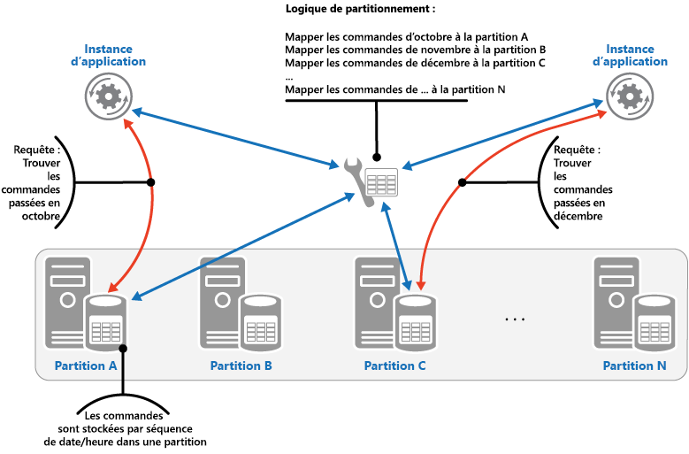

# <a name="sharding-pattern"></a><span data-ttu-id="913b1-104">Modèle de partitionnement</span><span class="sxs-lookup"><span data-stu-id="913b1-104">Sharding pattern</span></span>

[!INCLUDE [header](../_includes/header.md)]

<span data-ttu-id="913b1-105">Divisez un magasin de données en un ensemble de partitions horizontales ou de partitions de base de données.</span><span class="sxs-lookup"><span data-stu-id="913b1-105">Divide a data store into a set of horizontal partitions or shards.</span></span> <span data-ttu-id="913b1-106">Cela peut améliorer l’extensibilité lors du stockage et de l’accès à grands volumes de données.</span><span class="sxs-lookup"><span data-stu-id="913b1-106">This can improve scalability when storing and accessing large volumes of data.</span></span>

## <a name="context-and-problem"></a><span data-ttu-id="913b1-107">Contexte et problème</span><span class="sxs-lookup"><span data-stu-id="913b1-107">Context and problem</span></span>

<span data-ttu-id="913b1-108">Un magasin de données hébergé par un serveur unique peut être soumis aux limitations suivantes :</span><span class="sxs-lookup"><span data-stu-id="913b1-108">A data store hosted by a single server might be subject to the following limitations:</span></span>

- <span data-ttu-id="913b1-109">**Espace de stockage**.</span><span class="sxs-lookup"><span data-stu-id="913b1-109">**Storage space**.</span></span> <span data-ttu-id="913b1-110">Un magasin de données pour une application cloud à grande échelle est censé contenir un volume considérable de données qui peut augmenter sensiblement au fil du temps.</span><span class="sxs-lookup"><span data-stu-id="913b1-110">A data store for a large-scale cloud application is expected to contain a huge volume of data that could increase significantly over time.</span></span> <span data-ttu-id="913b1-111">En général, un serveur ne fournit qu’une quantité fixe de stockage sur disque, mais vous pouvez remplacer les disques existants par de plus gros disques, ou ajouter des disques supplémentaires à une machine à mesure que les volumes de données augmentent.</span><span class="sxs-lookup"><span data-stu-id="913b1-111">A server typically provides only a finite amount of disk storage, but you can replace existing disks with larger ones, or add further disks to a machine as data volumes grow.</span></span> <span data-ttu-id="913b1-112">Toutefois, il arrivera un moment où il ne sera plus possible d’augmenter facilement la capacité de stockage sur un serveur donné.</span><span class="sxs-lookup"><span data-stu-id="913b1-112">However, the system will eventually reach a limit where it isn't possible to easily increase the storage capacity on a given server.</span></span>

- <span data-ttu-id="913b1-113">**Ressources informatiques**.</span><span class="sxs-lookup"><span data-stu-id="913b1-113">**Computing resources**.</span></span> <span data-ttu-id="913b1-114">Une application cloud est requise pour prendre en charge un grand nombre d’utilisateurs simultanés, qui exécutent tous des requêtes pour récupérer des informations à partir du magasin de données.</span><span class="sxs-lookup"><span data-stu-id="913b1-114">A cloud application is required to support a large number of concurrent users, each of which run queries that retrieve information from the data store.</span></span> <span data-ttu-id="913b1-115">Si un seul serveur héberge le magasin de données, il n’est pas toujours en mesure de fournir la puissance de traitement nécessaire pour prendre en charge cette charge. Cela allonge les temps de réponse pour les utilisateurs et entraîne des défaillances fréquentes lorsque les applications qui tentent de stocker et de récupérer des données atteignent le délai d’expiration. Il est possible d’ajouter de la mémoire ou de mettre à niveau les processeurs, mais le système arrivera à sa limite lorsqu’il ne sera plus possible d’augmenter les ressources de traitement.</span><span class="sxs-lookup"><span data-stu-id="913b1-115">A single server hosting the data store might not be able to provide the necessary computing power to support this load, resulting in extended response times for users and frequent failures as applications attempting to store and retrieve data time out. It might be possible to add memory or upgrade processors, but the system will reach a limit when it isn't possible to increase the compute resources any further.</span></span>

- <span data-ttu-id="913b1-116">**Bande passante réseau**.</span><span class="sxs-lookup"><span data-stu-id="913b1-116">**Network bandwidth**.</span></span> <span data-ttu-id="913b1-117">Enfin, les performances d’un magasin de données exécuté sur un serveur unique sont régies par le débit auquel le serveur peut recevoir des requêtes et envoyer des réponses.</span><span class="sxs-lookup"><span data-stu-id="913b1-117">Ultimately, the performance of a data store running on a single server is governed by the rate the server can receive requests and send replies.</span></span> <span data-ttu-id="913b1-118">Il est possible que le volume de trafic réseau dépasse la capacité du réseau utilisé pour se connecter au serveur, ce qui entraîne l’échec des requêtes.</span><span class="sxs-lookup"><span data-stu-id="913b1-118">It's possible that the volume of network traffic might exceed the capacity of the network used to connect to the server, resulting in failed requests.</span></span>

- <span data-ttu-id="913b1-119">**Géographie**.</span><span class="sxs-lookup"><span data-stu-id="913b1-119">**Geography**.</span></span> <span data-ttu-id="913b1-120">Il peut être nécessaire de stocker les données générées par des utilisateurs spécifiques dans leur région pour des raisons juridiques, de conformité ou de performances, ou pour réduire la latence d’accès aux données.</span><span class="sxs-lookup"><span data-stu-id="913b1-120">It might be necessary to store data generated by specific users in the same region as those users for legal, compliance, or performance reasons, or to reduce latency of data access.</span></span> <span data-ttu-id="913b1-121">Si les utilisateurs sont répartis dans différents pays ou régions, il n’est pas toujours possible de stocker la totalité des données de l’application dans un même magasin de données.</span><span class="sxs-lookup"><span data-stu-id="913b1-121">If the users are dispersed across different countries or regions, it might not be possible to store the entire data for the application in a single data store.</span></span>

<span data-ttu-id="913b1-122">Une mise à l’échelle verticale, via l’ajout de capacité de disque, de puissance de traitement, de mémoire et de connexions réseau, peuvent différer les effets de certaines de ces limitations. Mais il ne s’agit là que d’une solution temporaire.</span><span class="sxs-lookup"><span data-stu-id="913b1-122">Scaling vertically by adding more disk capacity, processing power, memory, and network connections can postpone the effects of some of these limitations, but it's likely to only be a temporary solution.</span></span> <span data-ttu-id="913b1-123">Une application cloud commerciale capable de prendre en charge un grand nombre d’utilisateurs et de gros volumes de données doit permettre une mise à l’échelle presque infinie. Une mise à l’échelle verticale n’est donc pas nécessairement la meilleure solution.</span><span class="sxs-lookup"><span data-stu-id="913b1-123">A commercial cloud application capable of supporting large numbers of users and high volumes of data must be able to scale almost indefinitely, so vertical scaling isn't necessarily the best solution.</span></span>

## <a name="solution"></a><span data-ttu-id="913b1-124">Solution</span><span class="sxs-lookup"><span data-stu-id="913b1-124">Solution</span></span>

<span data-ttu-id="913b1-125">Divisez le magasin de données en partitions horizontales ou en partitions de base de données.</span><span class="sxs-lookup"><span data-stu-id="913b1-125">Divide the data store into horizontal partitions or shards.</span></span> <span data-ttu-id="913b1-126">Chaque partition a le même schéma, mais conserve son propre sous-ensemble de données.</span><span class="sxs-lookup"><span data-stu-id="913b1-126">Each shard has the same schema, but holds its own distinct subset of the data.</span></span> <span data-ttu-id="913b1-127">Une partition est un magasin de données à part entière (il peut contenir les données de nombreuses entités de types différents), exécuté sur un serveur agissant comme un nœud de stockage.</span><span class="sxs-lookup"><span data-stu-id="913b1-127">A shard is a data store in its own right (it can contain the data for many entities of different types), running on a server acting as a storage node.</span></span>

<span data-ttu-id="913b1-128">Ce modèle permet de bénéficier des avantages suivants :</span><span class="sxs-lookup"><span data-stu-id="913b1-128">This pattern has the following benefits:</span></span>

- <span data-ttu-id="913b1-129">Vous pouvez faire évoluer le système en ajoutant des partitions exécutées sur des nœuds de stockage supplémentaires.</span><span class="sxs-lookup"><span data-stu-id="913b1-129">You can scale the system out by adding further shards running on additional storage nodes.</span></span>

- <span data-ttu-id="913b1-130">Un système peut utiliser du matériel prêt à l’emploi au lieu d’ordinateurs spécialisés et coûteux pour chaque nœud de stockage.</span><span class="sxs-lookup"><span data-stu-id="913b1-130">A system can use off-the-shelf hardware rather than specialized and expensive computers for each storage node.</span></span>

- <span data-ttu-id="913b1-131">Vous pouvez réduire les conflits et améliorer les performances en équilibrant la charge de travail entre les partitions.</span><span class="sxs-lookup"><span data-stu-id="913b1-131">You can reduce contention and improve performance by balancing the workload across shards.</span></span>

- <span data-ttu-id="913b1-132">Dans le cloud, les partitions peuvent se trouver physiquement à proximité des utilisateurs qui accéderont aux données.</span><span class="sxs-lookup"><span data-stu-id="913b1-132">In the cloud, shards can be located physically close to the users that'll access the data.</span></span>

<span data-ttu-id="913b1-133">Lors de la division d’un magasin de données en partitions, décidez quelles données doivent être placées dans chaque partition.</span><span class="sxs-lookup"><span data-stu-id="913b1-133">When dividing a data store up into shards, decide which data should be placed in each shard.</span></span> <span data-ttu-id="913b1-134">En général, une partition contient des éléments compris dans une plage déterminée par un ou plusieurs attributs des données.</span><span class="sxs-lookup"><span data-stu-id="913b1-134">A shard typically contains items that fall within a specified range determined by one or more attributes of the data.</span></span> <span data-ttu-id="913b1-135">Ces attributs forment la clé de partition.</span><span class="sxs-lookup"><span data-stu-id="913b1-135">These attributes form the shard key (sometimes referred to as the partition key).</span></span> <span data-ttu-id="913b1-136">La clé de partition doit être statique.</span><span class="sxs-lookup"><span data-stu-id="913b1-136">The shard key should be static.</span></span> <span data-ttu-id="913b1-137">Elle ne doit pas reposer sur des données variables.</span><span class="sxs-lookup"><span data-stu-id="913b1-137">It shouldn't be based on data that might change.</span></span>

<span data-ttu-id="913b1-138">Le partitionnement organise physiquement les données.</span><span class="sxs-lookup"><span data-stu-id="913b1-138">Sharding physically organizes the data.</span></span> <span data-ttu-id="913b1-139">Lorsqu’une application stocke et récupère des données, la logique de partitionnement dirige l’application vers la partition appropriée.</span><span class="sxs-lookup"><span data-stu-id="913b1-139">When an application stores and retrieves data, the sharding logic directs the application to the appropriate shard.</span></span> <span data-ttu-id="913b1-140">Cette logique de partitionnement peut être implémentée comme partie intégrante du code d’accès aux données dans l’application, ou elle peut être implémentée par le système de stockage de données si elle prend en charge le partitionnement en toute transparence.</span><span class="sxs-lookup"><span data-stu-id="913b1-140">This sharding logic can be implemented as part of the data access code in the application, or it could be implemented by the data storage system if it transparently supports sharding.</span></span>

<span data-ttu-id="913b1-141">L’abstraction de l’emplacement physique des données dans la logique de partitionnement permet un niveau élevé de contrôle sur les données contenues dans des partitions spécifiques.</span><span class="sxs-lookup"><span data-stu-id="913b1-141">Abstracting the physical location of the data in the sharding logic provides a high level of control over which shards contain which data.</span></span> <span data-ttu-id="913b1-142">Elle permet également de migrer les données entre les partitions sans réviser la logique métier d’une application, si les données présentes dans les partitions doivent être redistribuées ultérieurement (par exemple, si les partitions deviennent déséquilibrées).</span><span class="sxs-lookup"><span data-stu-id="913b1-142">It also enables data to migrate between shards without reworking the business logic of an application if the data in the shards need to be redistributed later (for example, if the shards become unbalanced).</span></span> <span data-ttu-id="913b1-143">En contrepartie, l’accès aux données suppose une surcharge supplémentaire pour déterminer l’emplacement de chaque élément de données récupéré.</span><span class="sxs-lookup"><span data-stu-id="913b1-143">The tradeoff is the additional data access overhead required in determining the location of each data item as it's retrieved.</span></span>

<span data-ttu-id="913b1-144">Pour garantir l’extensibilité et des performances optimales, il est important fractionner les données d’une manière appropriée pour les types de requêtes que l’application exécute.</span><span class="sxs-lookup"><span data-stu-id="913b1-144">To ensure optimal performance and scalability, it's important to split the data in a way that's appropriate for the types of queries that the application performs.</span></span> <span data-ttu-id="913b1-145">Dans de nombreux cas, il est peu probable que le schéma de partitionnement corresponde exactement aux besoins de chaque requête.</span><span class="sxs-lookup"><span data-stu-id="913b1-145">In many cases, it's unlikely that the sharding scheme will exactly match the requirements of every query.</span></span> <span data-ttu-id="913b1-146">Par exemple, dans un système mutualisé, une application peut avoir besoin de récupérer des données sur les locataires à l’aide de l’ID de locataire, mais aussi de rechercher ces données en fonction d’autres attributs, tels que le nom ou l’emplacement du locataire.</span><span class="sxs-lookup"><span data-stu-id="913b1-146">For example, in a multi-tenant system an application might need to retrieve tenant data using the tenant ID, but it might also need to look up this data based on some other attribute such as the tenant’s name or location.</span></span> <span data-ttu-id="913b1-147">Pour gérer ces situations, mettez en œuvre une stratégie de partitionnement avec une clé de partition qui prend en charge les requêtes les plus courantes.</span><span class="sxs-lookup"><span data-stu-id="913b1-147">To handle these situations, implement a sharding strategy with a shard key that supports the most commonly performed queries.</span></span>

<span data-ttu-id="913b1-148">Si les requêtes récupèrent régulièrement les données à l’aide d’une combinaison de valeurs d’attributs, vous pouvez probablement définir une clé de partition composite en associant des attributs.</span><span class="sxs-lookup"><span data-stu-id="913b1-148">If queries regularly retrieve data using a combination of attribute values, you can likely define a composite shard key by linking attributes together.</span></span> <span data-ttu-id="913b1-149">Vous pouvez également utiliser un modèle tel qu’une [table d’index](index-table.md) pour permettre une recherche rapide des données en fonction des attributs qui ne sont pas couverts par la clé de partition.</span><span class="sxs-lookup"><span data-stu-id="913b1-149">Alternatively, use a pattern such as [Index Table](index-table.md) to provide fast lookup to data based on attributes that aren't covered by the shard key.</span></span>

## <a name="sharding-strategies"></a><span data-ttu-id="913b1-150">Stratégies de partitionnement</span><span class="sxs-lookup"><span data-stu-id="913b1-150">Sharding strategies</span></span>

<span data-ttu-id="913b1-151">Trois stratégies sont couramment utilisées lors de la sélection de la clé de partition et au moment de décider comment distribuer les données dans les partitions.</span><span class="sxs-lookup"><span data-stu-id="913b1-151">Three strategies are commonly used when selecting the shard key and deciding how to distribute data across shards.</span></span> <span data-ttu-id="913b1-152">Notez qu’il ne doit pas nécessairement y avoir une correspondance exacte entre les partitions et les serveurs qui les hébergent &mdash;un même serveur pouvant héberger plusieurs partitions.</span><span class="sxs-lookup"><span data-stu-id="913b1-152">Note that there doesn't have to be a one-to-one correspondence between shards and the servers that host them&mdash;a single server can host multiple shards.</span></span> <span data-ttu-id="913b1-153">Les stratégies sont les suivantes :</span><span class="sxs-lookup"><span data-stu-id="913b1-153">The strategies are:</span></span>

<span data-ttu-id="913b1-154">**Stratégie de recherche**.</span><span class="sxs-lookup"><span data-stu-id="913b1-154">**The Lookup strategy**.</span></span> <span data-ttu-id="913b1-155">Dans cette stratégie, la logique de partitionnement implémente un mappage qui achemine une requête de données vers la partition qui contient ces données à l’aide de la clé de partition.</span><span class="sxs-lookup"><span data-stu-id="913b1-155">In this strategy the sharding logic implements a map that routes a request for data to the shard that contains that data using the shard key.</span></span> <span data-ttu-id="913b1-156">Dans une application mutualisée, toutes les données d’un locataire peuvent être stockées ensemble dans une partition en utilisant l’ID de locataire en tant que clé de partition.</span><span class="sxs-lookup"><span data-stu-id="913b1-156">In a multi-tenant application all the data for a tenant might be stored together in a shard using the tenant ID as the shard key.</span></span> <span data-ttu-id="913b1-157">Plusieurs locataires peuvent partager la même partition, mais les données d’un locataire spécifique ne sont pas réparties sur plusieurs partitions.</span><span class="sxs-lookup"><span data-stu-id="913b1-157">Multiple tenants might share the same shard, but the data for a single tenant won't be spread across multiple shards.</span></span> <span data-ttu-id="913b1-158">L’image illustre le partitionnement des données de locataire en fonction des ID de locataire.</span><span class="sxs-lookup"><span data-stu-id="913b1-158">The figure illustrates sharding tenant data based on tenant IDs.</span></span>

   


   <span data-ttu-id="913b1-160">Le mappage entre la clé de partition et le stockage physique peut reposer sur des partitions physiques où chaque clé de partition est mappée à une partition physique.</span><span class="sxs-lookup"><span data-stu-id="913b1-160">The mapping between the shard key and the physical storage can be based on physical shards where each shard key maps to a physical partition.</span></span> <span data-ttu-id="913b1-161">Une autre technique plus souple de rééquilibrage des partitions est le partitionnement virtuel, où les clés de partition sont mappées au même nombre de partitions virtuelles, qui sont à leur tour mappées à moins de partitions physiques.</span><span class="sxs-lookup"><span data-stu-id="913b1-161">Alternatively, a more flexible technique for rebalancing shards is virtual partitioning, where shard keys map to the same number of virtual shards, which in turn map to fewer physical partitions.</span></span> <span data-ttu-id="913b1-162">Dans cette approche, une application localise les données à l’aide d’une clé de partition qui fait référence à une partition virtuelle, et le système mappe de façon transparente les partitions virtuelles aux partitions physiques.</span><span class="sxs-lookup"><span data-stu-id="913b1-162">In this approach, an application locates data using a shard key that refers to a virtual shard, and the system transparently maps virtual shards to physical partitions.</span></span> <span data-ttu-id="913b1-163">Le mappage entre une partition virtuelle et une partition physique peut changer sans nécessiter la modification du code d’application afin d’utiliser un autre ensemble de clés de partition.</span><span class="sxs-lookup"><span data-stu-id="913b1-163">The mapping between a virtual shard and a physical partition can change without requiring the application code be modified to use a different set of shard keys.</span></span>

<span data-ttu-id="913b1-164">**Stratégie de plage**.</span><span class="sxs-lookup"><span data-stu-id="913b1-164">**The Range strategy**.</span></span> <span data-ttu-id="913b1-165">Cette stratégie regroupe les éléments associés dans la même partition et les trie par clé de partition &mdash;les clés de partition étant séquentielles.</span><span class="sxs-lookup"><span data-stu-id="913b1-165">This strategy groups related items together in the same shard, and orders them by shard key&mdash;the shard keys are sequential.</span></span> <span data-ttu-id="913b1-166">Elle est utile pour les applications qui récupèrent fréquemment des ensembles d’éléments à l’aide de requêtes de plage (des requêtes qui renvoient un ensemble d’éléments de données pour une clé de partition comprise dans une certaine plage).</span><span class="sxs-lookup"><span data-stu-id="913b1-166">It's useful for applications that frequently retrieve sets of items using range queries (queries that return a set of data items for a shard key that falls within a given range).</span></span> <span data-ttu-id="913b1-167">Par exemple, si une application doit régulièrement rechercher toutes les commandes passées au cours d’un mois spécifique, ces données peuvent être récupérées plus rapidement si toutes les commandes d’un mois sont stockées par date et heure dans la même partition.</span><span class="sxs-lookup"><span data-stu-id="913b1-167">For example, if an application regularly needs to find all orders placed in a given month, this data can be retrieved more quickly if all orders for a month are stored in date and time order in the same shard.</span></span> <span data-ttu-id="913b1-168">Si les commandes ont été stockées dans des partitions différentes, elles doivent être extraites individuellement via un grand nombre de requêtes ponctuelles (des requêtes qui renvoient un seul élément de données).</span><span class="sxs-lookup"><span data-stu-id="913b1-168">If each order was stored in a different shard, they'd have to be fetched individually by performing a large number of point queries (queries that return a single data item).</span></span> <span data-ttu-id="913b1-169">L’image suivante illustre le stockage d’ensembles de données séquentiels (plages) dans la partition.</span><span class="sxs-lookup"><span data-stu-id="913b1-169">The next figure illustrates storing sequential sets (ranges) of data in shard.</span></span>

   

<span data-ttu-id="913b1-171">Dans cet exemple, la clé de partition est une clé composite contenant le mois de la commande en tant qu’élément le plus significatif, suivi du jour et de l’heure de la commande.</span><span class="sxs-lookup"><span data-stu-id="913b1-171">In this example, the shard key is a composite key containing the order month as the most significant element, followed by the order day and the time.</span></span> <span data-ttu-id="913b1-172">Les données relatives aux commandes sont naturellement triées lorsque des commandes sont créées et ajoutées à une partition.</span><span class="sxs-lookup"><span data-stu-id="913b1-172">The data for orders is naturally sorted when new orders are created and added to a shard.</span></span> <span data-ttu-id="913b1-173">Certains magasins de données prennent en charge les clés de partition en deux parties contenant un élément clé de partition qui identifie la partition et une clé de ligne qui identifie de façon unique un élément dans la partition.</span><span class="sxs-lookup"><span data-stu-id="913b1-173">Some data stores support two-part shard keys containing a partition key element that identifies the shard and a row key that uniquely identifies an item in the shard.</span></span> <span data-ttu-id="913b1-174">Les données sont généralement conservées selon l’ordre de clé de ligne dans la partition.</span><span class="sxs-lookup"><span data-stu-id="913b1-174">Data is usually held in row key order in the shard.</span></span> <span data-ttu-id="913b1-175">Les éléments soumis à des requêtes de plage et qui doivent être regroupés peuvent utiliser une clé de partition qui a la même valeur pour la clé de partition, mais une valeur unique pour la clé de ligne.</span><span class="sxs-lookup"><span data-stu-id="913b1-175">Items that are subject to range queries and need to be grouped together can use a shard key that has the same value for the partition key but a unique value for the row key.</span></span>

<span data-ttu-id="913b1-176">**Stratégie de hachage**.</span><span class="sxs-lookup"><span data-stu-id="913b1-176">**The Hash strategy**.</span></span> <span data-ttu-id="913b1-177">L’objectif de cette stratégie est de réduire le risque de zones réactives (partitions qui reçoivent une charge disproportionnée).</span><span class="sxs-lookup"><span data-stu-id="913b1-177">The purpose of this strategy is to reduce the chance of hotspots (shards that receive a disproportionate amount of load).</span></span> <span data-ttu-id="913b1-178">Elle distribue les données dans les partitions d’une façon qui permet d’obtenir un équilibre entre la taille de chaque partition et la charge moyenne que rencontre chaque partition.</span><span class="sxs-lookup"><span data-stu-id="913b1-178">It distributes the data across the shards in a way that achieves a balance between the size of each shard and the average load that each shard will encounter.</span></span> <span data-ttu-id="913b1-179">La logique de partitionnement traite la partition dans laquelle stocker un élément en fonction du hachage d’un ou plusieurs attributs des données.</span><span class="sxs-lookup"><span data-stu-id="913b1-179">The sharding logic computes the shard to store an item in based on a hash of one or more attributes of the data.</span></span> <span data-ttu-id="913b1-180">La fonction de hachage choisie doit distribuer les données uniformément parmi les partitions, éventuellement en introduisant un élément aléatoire dans le calcul.</span><span class="sxs-lookup"><span data-stu-id="913b1-180">The chosen hashing function should distribute data evenly across the shards, possibly by introducing some random element into the computation.</span></span> <span data-ttu-id="913b1-181">L’image suivante illustre le partitionnement des données de locataire en fonction du hachage des ID de locataire.</span><span class="sxs-lookup"><span data-stu-id="913b1-181">The next figure illustrates sharding tenant data based on a hash of tenant IDs.</span></span>

   

<span data-ttu-id="913b1-183">Pour comprendre l’avantage de la stratégie de hachage sur les autres stratégies de partitionnement, considérez la manière dont une application mutualisée qui inscrit les nouveaux locataires séquentiellement peut affecter les locataires à des partitions dans le magasin de données.</span><span class="sxs-lookup"><span data-stu-id="913b1-183">To understand the advantage of the Hash strategy over other sharding strategies, consider how a multi-tenant application that enrolls new tenants sequentially might assign the tenants to shards in the data store.</span></span> <span data-ttu-id="913b1-184">Avec la stratégie de plage, les données des locataires 1 à n sont stockées dans la partition A, les données des locataires n+1 à m sont stockées dans la partition B, et ainsi de suite.</span><span class="sxs-lookup"><span data-stu-id="913b1-184">When using the Range strategy, the data for tenants 1 to n will all be stored in shard A, the data for tenants n+1 to m will all be stored in shard B, and so on.</span></span> <span data-ttu-id="913b1-185">Si les derniers locataires enregistrés sont également les plus actifs, la majorité de l’activité des données survient dans un petit nombre de partitions, ce qui peut entraîner des zones réactives.</span><span class="sxs-lookup"><span data-stu-id="913b1-185">If the most recently registered tenants are also the most active, most data activity will occur in a small number of shards, which could cause hotspots.</span></span> <span data-ttu-id="913b1-186">En revanche, la stratégie de hachage alloue des locataires à des partitions en fonction d’un hachage de leur ID de locataire.</span><span class="sxs-lookup"><span data-stu-id="913b1-186">In contrast, the Hash strategy allocates tenants to shards based on a hash of their tenant ID.</span></span> <span data-ttu-id="913b1-187">Cela signifie que des locataires séquentiels sont plus susceptibles d’être alloués à des partitions différentes, ce qui distribue la charge entre celles-ci.</span><span class="sxs-lookup"><span data-stu-id="913b1-187">This means that sequential tenants are most likely to be allocated to different shards, which will distribute the load across them.</span></span> <span data-ttu-id="913b1-188">L’illustration précédente montre ceci pour les locataires 55 et 56.</span><span class="sxs-lookup"><span data-stu-id="913b1-188">The previous figure shows this for tenants 55 and 56.</span></span>

<span data-ttu-id="913b1-189">Les trois stratégies de partitionnement ont les avantages et les considérations suivantes :</span><span class="sxs-lookup"><span data-stu-id="913b1-189">The three sharding strategies have the following advantages and considerations:</span></span>

- <span data-ttu-id="913b1-190">**Recherche**.</span><span class="sxs-lookup"><span data-stu-id="913b1-190">**Lookup**.</span></span> <span data-ttu-id="913b1-191">Cette stratégie offre davantage de contrôle sur la façon dont les partitions sont configurées et utilisées.</span><span class="sxs-lookup"><span data-stu-id="913b1-191">This offers more control over the way that shards are configured and used.</span></span> <span data-ttu-id="913b1-192">Les partitions virtuelles permettent de réduire l’impact lors du rééquilibrage des données, car de nouvelles partitions physiques peuvent être ajoutées pour répartir la charge de travail.</span><span class="sxs-lookup"><span data-stu-id="913b1-192">Using virtual shards reduces the impact when rebalancing data because new physical partitions can be added to even out the workload.</span></span> <span data-ttu-id="913b1-193">Le mappage entre une partition virtuelle et les partitions physiques qui implémentent cette partition peut être modifié sans influer sur le code d’application qui utilise une clé de partition pour stocker et récupérer des données.</span><span class="sxs-lookup"><span data-stu-id="913b1-193">The mapping between a virtual shard and the physical partitions that implement the shard can be modified without affecting application code that uses a shard key to store and retrieve data.</span></span> <span data-ttu-id="913b1-194">La recherche des emplacements de partition peut imposer une surcharge supplémentaire.</span><span class="sxs-lookup"><span data-stu-id="913b1-194">Looking up shard locations can impose an additional overhead.</span></span>

- <span data-ttu-id="913b1-195">**Plage**.</span><span class="sxs-lookup"><span data-stu-id="913b1-195">**Range**.</span></span> <span data-ttu-id="913b1-196">Cette stratégie est facile à implémenter et fonctionne bien avec les requêtes de plage, car elles peuvent souvent extraire plusieurs éléments de données d’une même partition en une seule opération.</span><span class="sxs-lookup"><span data-stu-id="913b1-196">This is easy to implement and works well with range queries because they can often fetch multiple data items from a single shard in a single operation.</span></span> <span data-ttu-id="913b1-197">Cette stratégie facilite la gestion des données.</span><span class="sxs-lookup"><span data-stu-id="913b1-197">This strategy offers easier data management.</span></span> <span data-ttu-id="913b1-198">Par exemple, si des utilisateurs de la même région se trouvent dans la même partition, les mises à jour peuvent être planifiées dans chaque fuseau horaire selon le modèle local de charge et de demande.</span><span class="sxs-lookup"><span data-stu-id="913b1-198">For example, if users in the same region are in the same shard, updates can be scheduled in each time zone based on the local load and demand pattern.</span></span> <span data-ttu-id="913b1-199">Toutefois, cette stratégie ne fournit pas un équilibrage optimal entre les partitions.</span><span class="sxs-lookup"><span data-stu-id="913b1-199">However, this strategy doesn't provide optimal balancing between shards.</span></span> <span data-ttu-id="913b1-200">Le rééquilibrage des partitions est difficile et peut ne pas résoudre le problème de charge inégale si la majorité de l’activité concerne des clés de partition adjacentes.</span><span class="sxs-lookup"><span data-stu-id="913b1-200">Rebalancing shards is difficult and might not resolve the problem of uneven load if the majority of activity is for adjacent shard keys.</span></span>

- <span data-ttu-id="913b1-201">**Hachage**.</span><span class="sxs-lookup"><span data-stu-id="913b1-201">**Hash**.</span></span> <span data-ttu-id="913b1-202">Cette stratégie offre plus de chances pour une meilleure distribution de la charge et des données.</span><span class="sxs-lookup"><span data-stu-id="913b1-202">This strategy offers a better chance of more even data and load distribution.</span></span> <span data-ttu-id="913b1-203">Le routage des requêtes peut être effectué directement à l’aide de la fonction de hachage.</span><span class="sxs-lookup"><span data-stu-id="913b1-203">Request routing can be accomplished directly by using the hash function.</span></span> <span data-ttu-id="913b1-204">Il n’est pas nécessaire de maintenir un mappage.</span><span class="sxs-lookup"><span data-stu-id="913b1-204">There's no need to maintain a map.</span></span> <span data-ttu-id="913b1-205">Notez que le calcul du hachage peut imposer une surcharge supplémentaire.</span><span class="sxs-lookup"><span data-stu-id="913b1-205">Note that computing the hash might impose an additional overhead.</span></span> <span data-ttu-id="913b1-206">En outre, il est difficile de rééquilibrer les partitions.</span><span class="sxs-lookup"><span data-stu-id="913b1-206">Also, rebalancing shards is difficult.</span></span>

<span data-ttu-id="913b1-207">Les systèmes de partitionnement les plus courants implémentent l’une des approches décrites ci-dessus, mais vous devez également envisager les exigences métier de vos applications et leurs modèles d’utilisation des données.</span><span class="sxs-lookup"><span data-stu-id="913b1-207">Most common sharding systems implement one of the approaches described above, but you should also consider the business requirements of your applications and their patterns of data usage.</span></span> <span data-ttu-id="913b1-208">Par exemple, dans une application mutualisée :</span><span class="sxs-lookup"><span data-stu-id="913b1-208">For example, in a multi-tenant application:</span></span>

- <span data-ttu-id="913b1-209">Vous pouvez partitionner les données en fonction de la charge de travail.</span><span class="sxs-lookup"><span data-stu-id="913b1-209">You can shard data based on workload.</span></span> <span data-ttu-id="913b1-210">Vous pouvez séparer les données des locataires hautement volatiles dans des partitions distinctes.</span><span class="sxs-lookup"><span data-stu-id="913b1-210">You could segregate the data for highly volatile tenants in separate shards.</span></span> <span data-ttu-id="913b1-211">Cela peut améliorer la vitesse d’accès aux données pour les autres locataires.</span><span class="sxs-lookup"><span data-stu-id="913b1-211">The speed of data access for other tenants might be improved as a result.</span></span>

- <span data-ttu-id="913b1-212">Vous pouvez partitionner les données en fonction de l’emplacement des locataires.</span><span class="sxs-lookup"><span data-stu-id="913b1-212">You can shard data based on the location of tenants.</span></span> <span data-ttu-id="913b1-213">Vous pouvez mettre hors connexion les données des locataires dans une région géographique spécifique à des fins de sauvegarde et de maintenance pendant les heures creuses dans cette région, tandis que les données des locataires dans d’autres régions de données restent en ligne et accessibles pendant leurs heures de travail.</span><span class="sxs-lookup"><span data-stu-id="913b1-213">You can take the data for tenants in a specific geographic region offline for backup and maintenance during off-peak hours in that region, while the data for tenants in other regions remains online and accessible during their business hours.</span></span>

- <span data-ttu-id="913b1-214">Les locataires à valeur élevée peuvent disposer de leurs propres partitions privées, hautes performances et à faible charge, tandis que les locataires de faible valeur partagent des partitions plus compactes et plus sollicitées.</span><span class="sxs-lookup"><span data-stu-id="913b1-214">High-value tenants could be assigned their own private, high performing, lightly loaded shards, whereas lower-value tenants might be expected to share more densely-packed, busy shards.</span></span>

- <span data-ttu-id="913b1-215">Les données pour les locataires nécessitant un niveau élevé d’isolation et de confidentialité peuvent être stockées sur un serveur complètement séparé.</span><span class="sxs-lookup"><span data-stu-id="913b1-215">The data for tenants that need a high degree of data isolation and privacy can be stored on a completely separate server.</span></span>

## <a name="scaling-and-data-movement-operations"></a><span data-ttu-id="913b1-216">Opérations de déplacement de données et de mise à l’échelle</span><span class="sxs-lookup"><span data-stu-id="913b1-216">Scaling and data movement operations</span></span>

<span data-ttu-id="913b1-217">Chacune des stratégies de partitionnement implique des fonctionnalités différentes et des niveaux de complexité distincts pour la gestion de l’augmentation/diminution de la taille des instances, le déplacement des données et la maintenance de l’état.</span><span class="sxs-lookup"><span data-stu-id="913b1-217">Each of the sharding strategies implies different capabilities and levels of complexity for managing scale in, scale out, data movement, and maintaining state.</span></span>

<span data-ttu-id="913b1-218">La stratégie de recherche permet d’effectuer les opérations de déplacement des données et de mise à l’échelle au niveau de l’utilisateur, que ce soit en ligne ou hors connexion.</span><span class="sxs-lookup"><span data-stu-id="913b1-218">The Lookup strategy permits scaling and data movement operations to be carried out at the user level, either online or offline.</span></span> <span data-ttu-id="913b1-219">La technique consiste à suspendre certaines ou toutes les activités des utilisateurs (par exemple, pendant les périodes creuses), déplacer les données vers la nouvelle partition virtuelle ou partition physique, modifier les mappages, invalider ou actualiser les caches qui contiennent ces données, puis autoriser la reprise des activités des utilisateurs.</span><span class="sxs-lookup"><span data-stu-id="913b1-219">The technique is to suspend some or all user activity (perhaps during off-peak periods), move the data to the new virtual partition or physical shard, change the mappings, invalidate or refresh any caches that hold this data, and then allow user activity to resume.</span></span> <span data-ttu-id="913b1-220">Ce type d’opération peut souvent être géré de manière centralisée.</span><span class="sxs-lookup"><span data-stu-id="913b1-220">Often this type of operation can be centrally managed.</span></span> <span data-ttu-id="913b1-221">La stratégie de recherche nécessite un état hautement compatible avec le cache et les réplicas.</span><span class="sxs-lookup"><span data-stu-id="913b1-221">The Lookup strategy requires state to be highly cacheable and replica friendly.</span></span>

<span data-ttu-id="913b1-222">La stratégie de plage impose certaines restrictions sur les opérations de déplacement de données et de mise à l’échelle, qui doivent généralement être effectuées lorsqu’une partie ou la totalité du magasin de données est hors connexion, car elles impliquent un fractionnement et une fusion des données entre les partitions.</span><span class="sxs-lookup"><span data-stu-id="913b1-222">The Range strategy imposes some limitations on scaling and data movement operations, which must typically be carried out when a part or all of the data store is offline because the data must be split and merged across the shards.</span></span> <span data-ttu-id="913b1-223">Le déplacement des données pour rééquilibrer les partitions ne résout pas forcément le problème de la charge inégale si la majorité de l’activité concerne des clés de partition adjacentes ou des identificateurs de données qui se trouvent dans la même plage.</span><span class="sxs-lookup"><span data-stu-id="913b1-223">Moving the data to rebalance shards might not resolve the problem of uneven load if the majority of activity is for adjacent shard keys or data identifiers that are within the same range.</span></span> <span data-ttu-id="913b1-224">La stratégie de plage peut également nécessiter la maintenance d’un état pour mapper des plages avec les partitions physiques.</span><span class="sxs-lookup"><span data-stu-id="913b1-224">The Range strategy might also require some state to be maintained in order to map ranges to the physical partitions.</span></span>

<span data-ttu-id="913b1-225">La stratégie de hachage rend les opérations de déplacement de données et de mise à l’échelle plus complexe, car les clés de partition sont des hachages des identificateurs de données ou des clés de partition.</span><span class="sxs-lookup"><span data-stu-id="913b1-225">The Hash strategy makes scaling and data movement operations more complex because the partition keys are hashes of the shard keys or data identifiers.</span></span> <span data-ttu-id="913b1-226">Le nouvel emplacement de chaque partition doit être déterminé à partir de la fonction de hachage, ou la fonction modifiée pour fournir les mappages corrects.</span><span class="sxs-lookup"><span data-stu-id="913b1-226">The new location of each shard must be determined from the hash function, or the function modified to provide the correct mappings.</span></span> <span data-ttu-id="913b1-227">Toutefois, la stratégie de hachage ne requiert pas la maintenance de l’état.</span><span class="sxs-lookup"><span data-stu-id="913b1-227">However, the Hash strategy doesn't require maintenance of state.</span></span>

## <a name="issues-and-considerations"></a><span data-ttu-id="913b1-228">Problèmes et considérations</span><span class="sxs-lookup"><span data-stu-id="913b1-228">Issues and considerations</span></span>

<span data-ttu-id="913b1-229">Prenez en compte les points suivants lorsque vous choisissez comment implémenter ce modèle :</span><span class="sxs-lookup"><span data-stu-id="913b1-229">Consider the following points when deciding how to implement this pattern:</span></span>

- <span data-ttu-id="913b1-230">Le partitionnement de base de données est complémentaire d’autres formes de partitionnement, telles que le partitionnement vertical et le partitionnement fonctionnel.</span><span class="sxs-lookup"><span data-stu-id="913b1-230">Sharding is complementary to other forms of partitioning, such as vertical partitioning and functional partitioning.</span></span> <span data-ttu-id="913b1-231">Par exemple, une même partition peut contenir des entités qui ont été partitionnées verticalement, et une partition fonctionnelle peut être implémentée sous la forme de plusieurs partitions.</span><span class="sxs-lookup"><span data-stu-id="913b1-231">For example, a single shard can contain entities that have been partitioned vertically, and a functional partition can be implemented as multiple shards.</span></span> <span data-ttu-id="913b1-232">Pour plus d’informations sur le partitionnement, voir [Conseils sur le partitionnement des données](https://msdn.microsoft.com/library/dn589795.aspx).</span><span class="sxs-lookup"><span data-stu-id="913b1-232">For more information about partitioning, see the [Data Partitioning Guidance](https://msdn.microsoft.com/library/dn589795.aspx).</span></span>

- <span data-ttu-id="913b1-233">Veillez à l’équilibre des partitions afin qu’elles gèrent un volume similaire d’E/S.</span><span class="sxs-lookup"><span data-stu-id="913b1-233">Keep shards balanced so they all handle a similar volume of I/O.</span></span> <span data-ttu-id="913b1-234">Au fur et à mesure que des données sont insérées et supprimées, il est nécessaire de régulièrement rééquilibrer les partitions pour garantir une distribution uniforme et réduire les risques de zones réactives.</span><span class="sxs-lookup"><span data-stu-id="913b1-234">As data is inserted and deleted, it's necessary to periodically rebalance the shards to guarantee an even distribution and to reduce the chance of hotspots.</span></span> <span data-ttu-id="913b1-235">Le rééquilibrage peut s’avérer une opération coûteuse.</span><span class="sxs-lookup"><span data-stu-id="913b1-235">Rebalancing can be an expensive operation.</span></span> <span data-ttu-id="913b1-236">Pour réduire la nécessité de rééquilibrage, planifiez la croissance en vous assurant que chaque partition contient suffisamment d’espace libre pour gérer le volume attendu de modifications.</span><span class="sxs-lookup"><span data-stu-id="913b1-236">To reduce the necessity of rebalancing, plan for growth by ensuring that each shard contains sufficient free space to handle the expected volume of changes.</span></span> <span data-ttu-id="913b1-237">Vous devez également développer des stratégies et des scripts pour rééquilibrer rapidement les partitions si cela s’avère nécessaire.</span><span class="sxs-lookup"><span data-stu-id="913b1-237">You should also develop strategies and scripts you can use to quickly rebalance shards if this becomes necessary.</span></span>

- <span data-ttu-id="913b1-238">Utilisez des données stables pour la clé de partition.</span><span class="sxs-lookup"><span data-stu-id="913b1-238">Use stable data for the shard key.</span></span> <span data-ttu-id="913b1-239">Si la clé de partition est modifiée, l’élément de données correspondant doit peut-être changer de partition, augmentant ainsi la quantité de travail effectué par les opérations de mise à jour.</span><span class="sxs-lookup"><span data-stu-id="913b1-239">If the shard key changes, the corresponding data item might have to move between shards, increasing the amount of work performed by update operations.</span></span> <span data-ttu-id="913b1-240">Pour cette raison, évitez de baser la clé de partition sur des informations potentiellement volatiles.</span><span class="sxs-lookup"><span data-stu-id="913b1-240">For this reason, avoid basing the shard key on potentially volatile information.</span></span> <span data-ttu-id="913b1-241">Au lieu de cela, recherchez des attributs fixes ou qui forment naturellement une clé.</span><span class="sxs-lookup"><span data-stu-id="913b1-241">Instead, look for attributes that are invariant or that naturally form a key.</span></span>

- <span data-ttu-id="913b1-242">Assurez-vous que les clés de partition sont uniques.</span><span class="sxs-lookup"><span data-stu-id="913b1-242">Ensure that shard keys are unique.</span></span> <span data-ttu-id="913b1-243">Par exemple, évitez d’utiliser les champs incrémentés automatiquement comme clé de partition.</span><span class="sxs-lookup"><span data-stu-id="913b1-243">For example, avoid using autoincrementing fields as the shard key.</span></span> <span data-ttu-id="913b1-244">Dans certains systèmes, les champs incrémentés automatiquement ne peuvent pas être coordonnés entre les partitions. Des éléments de partitions différentes risquent alors de se retrouver avec la même clé de partition.</span><span class="sxs-lookup"><span data-stu-id="913b1-244">Is some systems, autoincremented fields can't be coordinated across shards, possibly resulting in items in different shards having the same shard key.</span></span>

    >  <span data-ttu-id="913b1-245">Les valeurs incrémentées automatiquement dans d’autres champs (même si elles ne sont pas des clés de partition) peuvent également entraîner des problèmes.</span><span class="sxs-lookup"><span data-stu-id="913b1-245">Autoincremented values in other fields that are not shard keys can also cause problems.</span></span> <span data-ttu-id="913b1-246">Par exemple, si vous utilisez des champs incrémentés automatiquement pour générer des ID uniques, deux éléments distincts situés dans des partitions différentes risquent d’avoir le même ID.</span><span class="sxs-lookup"><span data-stu-id="913b1-246">For example, if you use autoincremented fields to generate unique IDs, then two different items located in different shards might be assigned the same ID.</span></span>

- <span data-ttu-id="913b1-247">Il n’est pas toujours possible de créer une clé de partition qui répond aux besoins de chaque requête possible sur les données.</span><span class="sxs-lookup"><span data-stu-id="913b1-247">It might not be possible to design a shard key that matches the requirements of every possible query against the data.</span></span> <span data-ttu-id="913b1-248">Partitionnez les données pour prendre en charge les requêtes les plus fréquentes et, si nécessaire, créez des tables d’index secondaires pour prendre en charge les requêtes qui récupèrent des données à l’aide de critères basés sur des attributs qui ne font pas partie de la clé de partition.</span><span class="sxs-lookup"><span data-stu-id="913b1-248">Shard the data to support the most frequently performed queries, and if necessary create secondary index tables to support queries that retrieve data using criteria based on attributes that aren't part of the shard key.</span></span> <span data-ttu-id="913b1-249">Pour plus d'informations, voir le [modèle de table d’index](index-table.md).</span><span class="sxs-lookup"><span data-stu-id="913b1-249">For more information, see the [Index Table pattern](index-table.md).</span></span>

- <span data-ttu-id="913b1-250">Les requêtes qui accèdent à une seule partition sont plus efficaces que celles qui récupèrent des données de plusieurs partitions. Par conséquent, évitez d’implémenter un système de partitionnement où les applications exécutent de nombreuses requêtes qui joignent les données contenues dans des partitions différentes.</span><span class="sxs-lookup"><span data-stu-id="913b1-250">Queries that access only a single shard are more efficient than those that retrieve data from multiple shards, so avoid implementing a sharding system that results in applications performing large numbers of queries that join data held in different shards.</span></span> <span data-ttu-id="913b1-251">N’oubliez pas qu’une même partition peut contenir les données de plusieurs types d’entités.</span><span class="sxs-lookup"><span data-stu-id="913b1-251">Remember that a single shard can contain the data for multiple types of entities.</span></span> <span data-ttu-id="913b1-252">Envisagez la dénormalisation de vos données pour conserver les entités associées qui sont fréquemment interrogées ensemble (par exemple, les détails des clients et des commandes qu’ils ont passées) dans la même partition pour réduire le nombre de lectures effectuées par une application.</span><span class="sxs-lookup"><span data-stu-id="913b1-252">Consider denormalizing your data to keep related entities that are commonly queried together (such as the details of customers and the orders that they have placed) in the same shard to reduce the number of separate reads that an application performs.</span></span>

    >  <span data-ttu-id="913b1-253">Si une entité dans une partition fait référence à une entité stockée dans une autre partition, incluez la clé de partition de la deuxième entité dans le schéma de la première entité.</span><span class="sxs-lookup"><span data-stu-id="913b1-253">If an entity in one shard references an entity stored in another shard, include the shard key for the second entity as part of the schema for the first entity.</span></span> <span data-ttu-id="913b1-254">Cela permet d’améliorer les performances des requêtes qui font référence à des données liées dans les partitions.</span><span class="sxs-lookup"><span data-stu-id="913b1-254">This can help to improve the performance of queries that reference related data across shards.</span></span>

- <span data-ttu-id="913b1-255">Si une application doit effectuer des requêtes qui récupèrent des données dans plusieurs partitions, il est possible extraire ces données à l’aide de tâches parallèles.</span><span class="sxs-lookup"><span data-stu-id="913b1-255">If an application must perform queries that retrieve data from multiple shards, it might be possible to fetch this data by using parallel tasks.</span></span> <span data-ttu-id="913b1-256">Par exemple, il peut s’agir de requêtes de distribution ramifiée, où les données de plusieurs partitions sont récupérées en parallèle, puis regroupées en un résultat unique.</span><span class="sxs-lookup"><span data-stu-id="913b1-256">Examples include fan-out queries, where data from multiple shards is retrieved in parallel and then aggregated into a single result.</span></span> <span data-ttu-id="913b1-257">Toutefois, cette approche ajoute inévitablement une certaine complexité à la logique d’accès aux données d’une solution.</span><span class="sxs-lookup"><span data-stu-id="913b1-257">However, this approach inevitably adds some complexity to the data access logic of a solution.</span></span>

- <span data-ttu-id="913b1-258">Pour de nombreuses applications, la création d’un plus grand nombre de petites partitions peut s’avérer plus efficace que d’avoir un petit nombre de grandes partitions, car elles offrent plus d’opportunités pour l’équilibrage de charge.</span><span class="sxs-lookup"><span data-stu-id="913b1-258">For many applications, creating a larger number of small shards can be more efficient than having a small number of large shards because they can offer increased opportunities for load balancing.</span></span> <span data-ttu-id="913b1-259">Cela peut également être utile si vous envisagez de migrer des partitions d’un emplacement physique vers un autre.</span><span class="sxs-lookup"><span data-stu-id="913b1-259">This can also be useful if you anticipate the need to migrate shards from one physical location to another.</span></span> <span data-ttu-id="913b1-260">Une petite partition est plus rapide à déplacer qu’une grande partition.</span><span class="sxs-lookup"><span data-stu-id="913b1-260">Moving a small shard is quicker than moving a large one.</span></span>

- <span data-ttu-id="913b1-261">Assurez-vous que les ressources disponibles pour chaque nœud de stockage de partition sont suffisantes pour gérer les exigences d’extensibilité en termes de débit et de taille des données.</span><span class="sxs-lookup"><span data-stu-id="913b1-261">Make sure the resources available to each shard storage node are sufficient to handle the scalability requirements in terms of data size and throughput.</span></span> <span data-ttu-id="913b1-262">Pour plus d’informations, consultez la section « Concevoir des partitions évolutives » dans le [guide sur le partitionnement de données](https://msdn.microsoft.com/library/dn589795.aspx).</span><span class="sxs-lookup"><span data-stu-id="913b1-262">For more information, see the section “Designing Partitions for Scalability” in the [Data Partitioning Guidance](https://msdn.microsoft.com/library/dn589795.aspx).</span></span>

- <span data-ttu-id="913b1-263">Envisagez de répliquer les données de référence pour toutes les partitions.</span><span class="sxs-lookup"><span data-stu-id="913b1-263">Consider replicating reference data to all shards.</span></span> <span data-ttu-id="913b1-264">Si une opération qui récupère des données à partir d’une partition fait également référence à des données statiques ou lentes dans la même requête, ajoutez ces données à la partition.</span><span class="sxs-lookup"><span data-stu-id="913b1-264">If an operation that retrieves data from a shard also references static or slow-moving data as part of the same query, add this data to the shard.</span></span> <span data-ttu-id="913b1-265">L’application peut ensuite récupérer facilement toutes les données pour la requête, sans avoir à effectuer un aller-retour supplémentaire vers un magasin de données distinct.</span><span class="sxs-lookup"><span data-stu-id="913b1-265">The application can then fetch all of the data for the query easily, without having to make an additional round trip to a separate data store.</span></span>

    >  <span data-ttu-id="913b1-266">Si les données de référence sont stockées dans plusieurs modifications de partitions, le système doit synchroniser ces modifications sur toutes les partitions.</span><span class="sxs-lookup"><span data-stu-id="913b1-266">If reference data held in multiple shards changes, the system must synchronize these changes across all shards.</span></span> <span data-ttu-id="913b1-267">Le système peut rencontrer une certaine incohérence pendant cette synchronisation.</span><span class="sxs-lookup"><span data-stu-id="913b1-267">The system can experience a degree of inconsistency while this synchronization occurs.</span></span> <span data-ttu-id="913b1-268">Si vous faites cela, vous devez vous assurer que vos applications sont en mesure de gérer cette situation.</span><span class="sxs-lookup"><span data-stu-id="913b1-268">If you do this, you should design your applications to be able to handle it.</span></span>

- <span data-ttu-id="913b1-269">Il peut être difficile de maintenir l’intégrité référentielle et la cohérence entre les partitions. Vous devez donc limiter les opérations qui influent sur les données de plusieurs partitions.</span><span class="sxs-lookup"><span data-stu-id="913b1-269">It can be difficult to maintain referential integrity and consistency between shards, so you should minimize operations that affect data in multiple shards.</span></span> <span data-ttu-id="913b1-270">Si une application doit modifier des données dans plusieurs partitions, évaluez si une cohérence totale des données est nécessaire.</span><span class="sxs-lookup"><span data-stu-id="913b1-270">If an application must modify data across shards, evaluate whether complete data consistency is actually required.</span></span> <span data-ttu-id="913b1-271">Une approche courante alternative dans le cloud consiste à mettre en œuvre une cohérence finale.</span><span class="sxs-lookup"><span data-stu-id="913b1-271">Instead, a common approach in the cloud is to implement eventual consistency.</span></span> <span data-ttu-id="913b1-272">Les données de chaque partition sont mises à jour séparément, et la logique d’application doit garantir que le succès de toutes les mises à jour, ainsi que la gestion des incohérences qui peuvent survenir lors de l’interrogation des données pendant l’exécution d’une opération éventuellement cohérente.</span><span class="sxs-lookup"><span data-stu-id="913b1-272">The data in each partition is updated separately, and the application logic must take responsibility for ensuring that the updates all complete successfully, as well as handling the inconsistencies that can arise from querying data while an eventually consistent operation is running.</span></span> <span data-ttu-id="913b1-273">Pour plus d’informations sur l’implémentation de la cohérence éventuelle, voir [Data Consistency Primer](https://msdn.microsoft.com/library/dn589800.aspx)(Manuel d’introduction à la cohérence des données).</span><span class="sxs-lookup"><span data-stu-id="913b1-273">For more information about implementing eventual consistency, see the [Data Consistency Primer](https://msdn.microsoft.com/library/dn589800.aspx).</span></span>

- <span data-ttu-id="913b1-274">La configuration et la gestion d’un grand nombre de partitions peuvent se révéler complexes.</span><span class="sxs-lookup"><span data-stu-id="913b1-274">Configuring and managing a large number of shards can be a challenge.</span></span> <span data-ttu-id="913b1-275">Les tâches telles que la surveillance, la sauvegarde, la vérification de la cohérence et la journalisation/l’audit doivent être effectuées sur plusieurs partitions et serveurs, éventuellement situés à plusieurs emplacements.</span><span class="sxs-lookup"><span data-stu-id="913b1-275">Tasks such as monitoring, backing up, checking for consistency, and logging or auditing must be accomplished on multiple shards and servers, possibly held in multiple locations.</span></span> <span data-ttu-id="913b1-276">Ces tâches sont susceptibles d’être implémentées à l’aide de scripts ou autres solutions d’automatisation, mais sans pour autant éliminer entièrement les besoins d’administration supplémentaires.</span><span class="sxs-lookup"><span data-stu-id="913b1-276">These tasks are likely to be implemented using scripts or other automation solutions, but that might not completely eliminate the additional administrative requirements.</span></span>

- <span data-ttu-id="913b1-277">Les partitions peuvent être géolocalisées, afin de rapprocher les données qu’elles contiennent des instances d’une application qui les utilisent.</span><span class="sxs-lookup"><span data-stu-id="913b1-277">Shards can be geolocated so that the data that they contain is close to the instances of an application that use it.</span></span> <span data-ttu-id="913b1-278">Cette approche peut améliorer considérablement les performances, mais elle nécessite une attention particulière pour les tâches qui doivent accéder à plusieurs partitions à différents emplacements.</span><span class="sxs-lookup"><span data-stu-id="913b1-278">This approach can considerably improve performance, but requires additional consideration for tasks that must access multiple shards in different locations.</span></span>

## <a name="when-to-use-this-pattern"></a><span data-ttu-id="913b1-279">Quand utiliser ce modèle</span><span class="sxs-lookup"><span data-stu-id="913b1-279">When to use this pattern</span></span>

<span data-ttu-id="913b1-280">Utilisez ce modèle quand un magasin de données est susceptible d’avoir besoin de plus de ressources disponibles pour un nœud de stockage unique, ou pour améliorer les performances en réduisant les conflits dans un magasin de données.</span><span class="sxs-lookup"><span data-stu-id="913b1-280">Use this pattern when a data store is likely to need to scale beyond the resources available to a single storage node, or to improve performance by reducing contention in a data store.</span></span>

>  <span data-ttu-id="913b1-281">Le principal objectif du partitionnement est d’améliorer les performances et l’extensibilité d’un système, mais il peut au passage améliorer la disponibilité selon la répartition des données dans les partitions.</span><span class="sxs-lookup"><span data-stu-id="913b1-281">The primary focus of sharding is to improve the performance and scalability of a system, but as a by-product it can also improve availability due to how the data is divided into separate partitions.</span></span> <span data-ttu-id="913b1-282">Un échec dans une partition n’empêche pas nécessairement une application d’accéder aux données contenues dans les autres partitions. Un opérateur peut exécuter une maintenance ou une récupération sur une ou plusieurs partitions sans rendre inaccessible la totalité des données d’une application.</span><span class="sxs-lookup"><span data-stu-id="913b1-282">A failure in one partition doesn't necessarily prevent an application from accessing data held in other partitions, and an operator can perform maintenance or recovery of one or more partitions without making the entire data for an application inaccessible.</span></span> <span data-ttu-id="913b1-283">Pour plus d’informations, consultez les [recommandations en matière de partitionnement de données](https://msdn.microsoft.com/library/dn589795.aspx).</span><span class="sxs-lookup"><span data-stu-id="913b1-283">For more information, see the [Data Partitioning Guidance](https://msdn.microsoft.com/library/dn589795.aspx).</span></span>

## <a name="example"></a><span data-ttu-id="913b1-284">Exemple</span><span class="sxs-lookup"><span data-stu-id="913b1-284">Example</span></span>

<span data-ttu-id="913b1-285">L’exemple suivant en C# utilise un ensemble de bases de données SQL Server qui agissent en tant que partitions.</span><span class="sxs-lookup"><span data-stu-id="913b1-285">The following example in C# uses a set of SQL Server databases acting as shards.</span></span> <span data-ttu-id="913b1-286">Chaque base de données contient un sous-ensemble des données utilisées par une application.</span><span class="sxs-lookup"><span data-stu-id="913b1-286">Each database holds a subset of the data used by an application.</span></span> <span data-ttu-id="913b1-287">L’application récupère des données distribuées dans les partitions à l’aide de sa propre logique de partitionnement (il s’agit d’un exemple de requête de distribution ramifiée).</span><span class="sxs-lookup"><span data-stu-id="913b1-287">The application retrieves data that's distributed across the shards using its own sharding logic (this is an example of a fan-out query).</span></span> <span data-ttu-id="913b1-288">Les détails des données situées dans chaque partition sont renvoyés par une méthode appelée `GetShards`.</span><span class="sxs-lookup"><span data-stu-id="913b1-288">The details of the data that's located in each shard is returned by a method called `GetShards`.</span></span> <span data-ttu-id="913b1-289">Cette méthode renvoie une liste énumérable d’objets `ShardInformation`, où le type `ShardInformation` contient un identificateur pour chaque partition et la chaîne de connexion SQL Server qu’une application doit utiliser pour se connecter à la partition (les chaînes de connexion ne sont pas visibles dans l’exemple de code).</span><span class="sxs-lookup"><span data-stu-id="913b1-289">This method returns an enumerable list of `ShardInformation` objects, where the `ShardInformation` type contains an identifier for each shard and the SQL Server connection string that an application should use to connect to the shard (the connection strings aren't shown in the code example).</span></span>

```csharp
private IEnumerable<ShardInformation> GetShards()
{
  // This retrieves the connection information from a shard store
  // (commonly a root database).
  return new[]
  {
    new ShardInformation
    {
      Id = 1,
      ConnectionString = ...
    },
    new ShardInformation
    {
      Id = 2,
      ConnectionString = ...
    }
  };
}
```

<span data-ttu-id="913b1-290">Le code suivant montre comment l’application utilise une liste des objets `ShardInformation` pour effectuer une requête qui extrait les données de chaque partition en parallèle.</span><span class="sxs-lookup"><span data-stu-id="913b1-290">The code below shows how the application uses the list of `ShardInformation` objects to perform a query that fetches data from each shard in parallel.</span></span> <span data-ttu-id="913b1-291">Les détails de la requête ne sont pas visibles, mais dans cet exemple, les données récupérées contiennent une chaîne qui peut renfermer des informations telles que le nom d’un client, si les partitions contiennent des détails sur les clients.</span><span class="sxs-lookup"><span data-stu-id="913b1-291">The details of the query aren't shown, but in this example the data that's retrieved contains a string that could hold information such as the name of a customer if the shards contain the details of customers.</span></span> <span data-ttu-id="913b1-292">Les résultats sont regroupés dans une collection `ConcurrentBag` en vue de leur traitement par l’application.</span><span class="sxs-lookup"><span data-stu-id="913b1-292">The results are aggregated into a `ConcurrentBag` collection for processing by the application.</span></span>

```csharp
// Retrieve the shards as a ShardInformation[] instance.
var shards = GetShards();

var results = new ConcurrentBag<string>();

// Execute the query against each shard in the shard list.
// This list would typically be retrieved from configuration
// or from a root/master shard store.
Parallel.ForEach(shards, shard =>
{
  // NOTE: Transient fault handling isn't included,
  // but should be incorporated when used in a real world application.
  using (var con = new SqlConnection(shard.ConnectionString))
  {
    con.Open();
    var cmd = new SqlCommand("SELECT ... FROM ...", con);

    Trace.TraceInformation("Executing command against shard: {0}", shard.Id);

    var reader = cmd.ExecuteReader();
    // Read the results in to a thread-safe data structure.
    while (reader.Read())
    {
      results.Add(reader.GetString(0));
    }
  }
});

Trace.TraceInformation("Fanout query complete - Record Count: {0}",
                        results.Count);
```

## <a name="related-patterns-and-guidance"></a><span data-ttu-id="913b1-293">Conseils et modèles connexes</span><span class="sxs-lookup"><span data-stu-id="913b1-293">Related patterns and guidance</span></span>

<span data-ttu-id="913b1-294">Les modèles et les conseils suivants peuvent aussi présenter un intérêt quand il s’agit d’implémenter ce modèle :</span><span class="sxs-lookup"><span data-stu-id="913b1-294">The following patterns and guidance might also be relevant when implementing this pattern:</span></span>
- <span data-ttu-id="913b1-295">[Manuel d’introduction à la cohérence des données](https://msdn.microsoft.com/library/dn589800.aspx).</span><span class="sxs-lookup"><span data-stu-id="913b1-295">[Data Consistency Primer](https://msdn.microsoft.com/library/dn589800.aspx).</span></span> <span data-ttu-id="913b1-296">Il peut être nécessaire de maintenir la cohérence des données réparties dans les différentes partitions.</span><span class="sxs-lookup"><span data-stu-id="913b1-296">It might be necessary to maintain consistency for data distributed across different shards.</span></span> <span data-ttu-id="913b1-297">Résume les problèmes se rapportant au maintien de la cohérence des données distribuées, et décrit les avantages et les compromis des différents modèles de cohérence.</span><span class="sxs-lookup"><span data-stu-id="913b1-297">Summarizes the issues surrounding maintaining consistency over distributed data, and describes the benefits and tradeoffs of different consistency models.</span></span>
- <span data-ttu-id="913b1-298">[Conseils sur le partitionnement des données](https://msdn.microsoft.com/library/dn589795.aspx).</span><span class="sxs-lookup"><span data-stu-id="913b1-298">[Data Partitioning Guidance](https://msdn.microsoft.com/library/dn589795.aspx).</span></span> <span data-ttu-id="913b1-299">Le partitionnement d’un magasin de données peut entraîner d’autres problèmes.</span><span class="sxs-lookup"><span data-stu-id="913b1-299">Sharding a data store can introduce a range of additional issues.</span></span> <span data-ttu-id="913b1-300">Décrit ces problèmes liés au partitionnement des magasins de données dans le cloud pour améliorer l’extensibilité, réduire les conflits et optimiser les performances.</span><span class="sxs-lookup"><span data-stu-id="913b1-300">Describes these issues in relation to partitioning data stores in the cloud to improve scalability, reduce contention, and optimize performance.</span></span>
- <span data-ttu-id="913b1-301">[Modèle de table d’index](index-table.md).</span><span class="sxs-lookup"><span data-stu-id="913b1-301">[Index Table pattern](index-table.md).</span></span> <span data-ttu-id="913b1-302">Parfois, il n’est pas possible de prendre entièrement en charge les requêtes uniquement par le biais de la conception de la clé de partition.</span><span class="sxs-lookup"><span data-stu-id="913b1-302">Sometimes it isn't possible to completely support queries just through the design of the shard key.</span></span> <span data-ttu-id="913b1-303">Permet à une application de récupérer rapidement des données à partir d’un vaste magasin de données en spécifiant une clé autre que la clé de partition.</span><span class="sxs-lookup"><span data-stu-id="913b1-303">Enables an application to quickly retrieve data from a large data store by specifying a key other than the shard key.</span></span>
- <span data-ttu-id="913b1-304">[Modèle de vue matérialisée](materialized-view.md).</span><span class="sxs-lookup"><span data-stu-id="913b1-304">[Materialized View pattern](materialized-view.md).</span></span> <span data-ttu-id="913b1-305">Pour maintenir les performances de certaines opérations de requête, il est utile de créer des vues matérialisées qui agrègent et synthétisent les données, surtout si ces données reposent sur les informations distribuées dans plusieurs partitions.</span><span class="sxs-lookup"><span data-stu-id="913b1-305">To maintain the performance of some query operations, it's useful to create materialized views that aggregate and summarize data, especially if this summary data is based on information that's distributed across shards.</span></span> <span data-ttu-id="913b1-306">Décrit comment générer et remplir ces vues.</span><span class="sxs-lookup"><span data-stu-id="913b1-306">Describes how to generate and populate these views.</span></span>
- <span data-ttu-id="913b1-307">[Leçons sur les partitions](http://www.addsimplicity.com/adding_simplicity_an_engi/2008/08/shard-lessons.html) sur le blog « Adding Simplicity ».</span><span class="sxs-lookup"><span data-stu-id="913b1-307">[Shard Lessons](http://www.addsimplicity.com/adding_simplicity_an_engi/2008/08/shard-lessons.html) on the Adding Simplicity blog.</span></span>
- <span data-ttu-id="913b1-308">[Partitionnement de base de données](http://dbshards.com/database-sharding/) sur le site web CodeFutures.</span><span class="sxs-lookup"><span data-stu-id="913b1-308">[Database Sharding](http://dbshards.com/database-sharding/) on the CodeFutures web site.</span></span>
- <span data-ttu-id="913b1-309">[Manuel d’introduction aux stratégies d’extensibilité : partitionnement de base de données](http://blog.maxindelicato.com/2008/12/scalability-strategies-primer-database-sharding.html) sur le blog de Max Indelicato.</span><span class="sxs-lookup"><span data-stu-id="913b1-309">[Scalability Strategies Primer: Database Sharding](http://blog.maxindelicato.com/2008/12/scalability-strategies-primer-database-sharding.html) on Max Indelicato's blog.</span></span>
- <span data-ttu-id="913b1-310">[Création des bases de données extensives : avantages et inconvénients de plusieurs schémas de partitionnement de bases de données](http://www.25hoursaday.com/weblog/2009/01/16/BuildingScalableDatabasesProsAndConsOfVariousDatabaseShardingSchemes.aspx) sur le blog de Dare Obasanjo.</span><span class="sxs-lookup"><span data-stu-id="913b1-310">[Building Scalable Databases: Pros and Cons of Various Database Sharding Schemes](http://www.25hoursaday.com/weblog/2009/01/16/BuildingScalableDatabasesProsAndConsOfVariousDatabaseShardingSchemes.aspx) on Dare Obasanjo's blog.</span></span>
