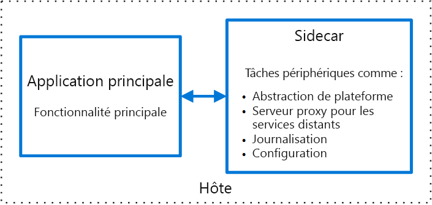

# Modèle side-carSidecar pattern

Déployez les composants d’une application sur un processus ou conteneur distinct pour fournir l’isolation et l’encapsulation.Deploy components of an application into a separate process or container to provide isolation and encapsulation. Ce modèle permet également aux applications d’être constituées de technologies et de composants hétérogènes.This pattern can also enable applications to be composed of heterogeneous components and technologies.

Ce modèle est nommé *side-car*, car il ressemble à un side-car attaché à une moto.This pattern is named *Sidecar* because it resembles a sidecar attached to a motorcycle. Dans ce modèle, le side-car est attaché à une application parente et fournit des fonctionnalités de prise en charge pour l’application.In the pattern, the sidecar is attached to a parent application and provides supporting features for the application. De plus, le side-car partage le même cycle de vie que l’application parente, étant créé et mis hors service en même temps que celle-ci.The sidecar also shares the same lifecycle as the parent application, being created and retired alongside the parent. Le modèle side-car est parfois appelé « modèle assistant » et est un modèle de décomposition.The sidecar pattern is sometimes referred to as the sidekick pattern and is a decomposition pattern.

## Contexte et problèmeContext and Problem

Les applications et services nécessitent souvent des fonctionnalités connexes, telles que la surveillance, la journalisation, la configuration et les services réseau.Applications and services often require related functionality, such as monitoring, logging, configuration, and networking services. Ces tâches périphériques peuvent être implémentées en tant que composants ou services distincts.These peripheral tasks can be implemented as separate components or services. 

Si elles sont étroitement intégrées à l’application, elles peuvent s’exécuter dans le même processus que l’application, optimisant l’utilisation des ressources partagées.If they are tightly integrated into the application, they can run in the same process as the application, making efficient use of shared resources. Toutefois, cela signifie également qu’elles ne sont pas bien isolées ; une panne dans un de ces composants peut affecter les autres composants ou l’ensemble de l’application.However, this also means they are not well isolated, and an outage in one of these components can affect other components or the entire application. De plus, elles doivent généralement être implémentées à l’aide du même langage que l’application parente.Also, they usually need to be implemented using the same language as the parent application. Ainsi, le composant et l’application sont étroitement interdépendants.As a result, the component and the application have close interdependence on each other.

Si l’application est décomposée en services, chaque service peut être généré à l’aide de technologies et de langages différents.If the application is decomposed into services, then each service can be built using different languages and technologies. Bien que cela procure davantage de souplesse, chaque composant a ses propres dépendances et nécessite des bibliothèques spécifiques au langage pour accéder à la plateforme sous-jacente et à toutes les ressources partagées avec l’application parente.While this gives more flexibility, it means that each component has its own dependencies and requires language-specific libraries to access the underlying platform and any resources shared with the parent application. Par ailleurs, le déploiement de ces fonctionnalités en tant que services distincts peut ajouter de la latence à l’application.In addition, deploying these features as separate services can add latency to the application. La gestion du code et des dépendances pour ces interfaces spécifiques au langage peut également ajouter une part importante de complexité, en particulier pour l’hébergement, le déploiement et la gestion.Managing the code and dependencies for these language-specific interfaces can also add considerable complexity, especially for hosting, deployment, and management.

## SolutionSolution

Colocalisez un ensemble cohérent de tâches avec l’application principale, mais placez-les à l’intérieur de leur propre processus ou conteneur, en fournissant une interface homogène pour les services de plateforme entre les langages.Co-locate a cohesive set of tasks with the primary application, but place them inside their own process or container, providing a homogeneous interface for platform services across languages. 

Un service side-car ne fait pas nécessairement partie de l’application, mais il est connecté à celle-ci.A sidecar service is not necessarily part of the application, but is connected to it. Il est présent partout où l’application parente est présente.It goes wherever the parent application goes. Les side-cars sont des processus ou services de prise en charge qui sont déployés avec l’application principale.Sidecars are supporting processes or services that are deployed with the primary application. Dans le cas d’une motocyclette, le side-car est attaché à celle-ci, et chaque motocyclette peut avoir son propre side-car.On a motorcycle, the sidecar is attached to one motorcycle, and each motorcycle can have its own sidecar. De la même façon, un service side-car partage le devenir de son application parente.In the same way, a sidecar service shares the fate of its parent application. Pour chaque instance de l’application, une instance du side-car est déployée et hébergée à ses côtés.For each instance of the application, an instance of the sidecar is deployed and hosted alongside it. 

Avantages de l’utilisation d’un modèle side-car :Advantages of using a sidecar pattern include:

- Un side-car étant indépendant de son application principale en termes d’environnement d’exécution et de langage de programmation, vous n’avez pas besoin de développer un side-car par langage.A sidecar is independent from its primary application in terms of runtime environment and programming language, so you don't need to develop one sidecar per language. 

- Le side-car peut accéder aux mêmes ressources que l’application principale.The sidecar can access the same resources as the primary application. Par exemple, un side-car peut surveiller les ressources système utilisées par lui-même et l’application principale.For example, a sidecar can monitor system resources used by both the sidecar and the primary application. 

- En raison de sa proximité avec l’application principale, il n’existe aucune latence importante quand l’un et l’autre communiquent.Because of its proximity to the primary application, there’s no significant latency when communicating between them.

- Même pour les applications qui ne fournissent pas de mécanisme d’extensibilité, vous pouvez utiliser un side-car pour étendre les fonctionnalités en le joignant en tant que processus propre dans le même hôte ou sous-conteneur que l’application principale.Even for applications that don’t provide an extensibility mechanism, you can use a sidecar to extend functionality by attaching it as own process in the same host or sub-container as the primary application.

Le modèle side-car est souvent utilisé avec des conteneurs et est appelé « conteneur side-car » ou « conteneur assistant ».The sidecar pattern is often used with containers and referred to as a sidecar container or sidekick container. 

## Problèmes et considérationsIssues and Considerations

- Envisagez le format de déploiement et d’empaquetage à utiliser pour déployer des services, processus ou conteneurs.Consider the deployment and packaging format you will use to deploy services, processes, or containers. Les conteneurs sont particulièrement bien adaptés au modèle side-car.Containers are particularly well suited to the sidecar pattern.
- Quand vous concevez un service side-car, choisissez avec soin le mécanisme de communication entre processus.When designing a sidecar service, carefully decide on the interprocess communication mechanism. Essayez d’utiliser des technologies indépendantes du langage ou du framework, sauf si des exigences de niveau de performance rendent cela peu pratique.Try to use language- or framework-agnostic technologies unless performance requirements make that impractical.
- Avant de placer des fonctionnalités dans un side-car, déterminez si elles ne seraient pas plus efficaces sous la forme d’un service distinct ou d’un démon plus traditionnel.Before putting functionality into a sidecar, consider whether it would work better as a separate service or a more traditional daemon.
- Déterminez également si les fonctionnalités peuvent être implémentées en tant que bibliothèque ou à l’aide d’un mécanisme d’extension traditionnel.Also consider whether the functionality could be implemented as a library or using a traditional extension mechanism. Les bibliothèques spécifiques au langage peuvent offrir un niveau d’intégration plus profond et une surcharge réseau inférieure.Language-specific libraries may have a deeper level of integration and less network overhead.

## Quand utiliser ce modèleWhen to Use this Pattern

Utilisez ce modèle dans les situations suivantes :Use this pattern when:

- Votre application principale utilise un ensemble hétérogène de langages et de frameworks.Your primary application uses a heterogenous set of languages and frameworks. Un composant situé dans un service side-car peut être utilisé par des applications écrites dans des langages différents à l’aide de différents frameworks.A component located in a sidecar service can be consumed by applications written in different languages using different frameworks.
- Un composant est détenu par une équipe à distance ou une autre organisation.A component is owned by a remote team or a different organization.
- Un composant ou fonctionnalité doit coexister sur le même hôte que l’application.A component or feature must be co-located on the same host as the application
- Vous avez besoin d’un service qui partage le cycle de vie global de votre application principale, mais qui peut être mis à jour indépendamment.You need a service that shares the overall lifecycle of your main application, but can be independently updated.
- Vous avez besoin d’un contrôle affiné des limites de ressources pour une ressource ou un composant particulier.You need fine-grained control over resource limits for a particular resource or component. Par exemple, vous souhaitez limiter la quantité de mémoire utilisée par un composant spécifique.For example, you may want to restrict the amount of memory a specific component uses. Vous pouvez déployer le composant en tant que side-car et gérer l’utilisation de la mémoire indépendamment de l’application principale.You can deploy the component as a sidecar and manage memory usage independently of the main application.

Ce modèle peut ne pas convenir :This pattern may not be suitable:

- Quand la communication entre processus doit être optimisée.When interprocess communication needs to be optimized. La communication entre une application parente et des services side-car engendre une surcharge, notamment de la latence dans les appels.Communication between a parent application and sidecar services includes some overhead, notably latency in the calls. Ce compromis peut ne pas convenir pour les interfaces gourmandes en communication.This may not be an acceptable trade-off for chatty interfaces.
- Pour les petites applications où l’avantage procuré par l’isolation ne contrebalance pas le coût en ressources lié au déploiement d’un service side-car pour chaque instance.For small applications where the resource cost of deploying a sidecar service for each instance is not worth the advantage of isolation.
- Quand le service doit se mettre à l’échelle différemment ou indépendamment des applications principales.When the service needs to scale differently than or independently from the main applications. Dans ce cas, il peut être préférable de déployer la fonctionnalité en tant que service distinct.If so, it may be better to deploy the feature as a separate service.

## ExempleExample

Ce modèle side-car s’applique à de nombreux scénarios.The sidecar pattern is applicable to many scenarios. Voici quelques exemples courants :Some common examples:

- API d’infrastructure.Infrastructure API. L’équipe de développement de l’infrastructure crée un service qui est déployé en même temps que chaque application, au lieu d’une bibliothèque cliente spécifique au langage pour accéder à l’infrastructure.The infrastructure development team creates a service that's deployed alongside each application, instead of a language-specific client library to access the infrastructure. Le service est chargé en tant que side-car et fournit une couche commune pour les services de l’infrastructure, notamment la journalisation, les données de l’environnement, le magasin de configuration, la découverte, les contrôles d’intégrité et les services de surveillance.The service is loaded as a sidecar and provides a common layer for infrastructure services, including logging, environment data, configuration store, discovery, health checks, and watchdog services. De plus, le side-car surveille le processus (ou conteneur) et l’environnement hôte de l’application parente et journalise les informations dans un service centralisé.The sidecar also monitors the parent application's host environment and process (or container) and logs the information to a centralized service.
- Gérer NGINX/HAProxy.Manage NGINX/HAProxy. Déployer NGINX avec un service side-car qui surveille l’état de l’environnement, puis met à jour le fichier de configuration NGINX et recycle le processus quand une modification d’état est nécessaire.Deploy NGINX with a sidecar service that monitors environment state, then updates the NGINX configuration file and recycles the process when a change in state is needed.
- Side-car ambassadeur.Ambassador sidecar. Déployer un service [Ambassadeur][ambassador] en tant que side-car.Deploy an [ambassador][ambassador] service as a sidecar. L’application fait appel à l’ambassadeur, qui gère la journalisation des demandes, le routage, la rupture de circuit (circuit breaking) et autres fonctionnalités liées à la connectivité.The application calls through the ambassador, which handles request logging, routing, circuit breaking, and other connectivity related features.
- Proxy de déchargement.Offload proxy. Placer un proxy NGINX devant une instance de service node.js afin de gérer la fourniture de contenu de fichier statique pour le service.Place an NGINX proxy in front of a node.js service instance, to handle serving static file content for the service.

## Aide connexeRelated guidance

- [Modèle ambassadeur][ambassador][Ambassador pattern][ambassador]

[ambassador]: ./ambassador.md

