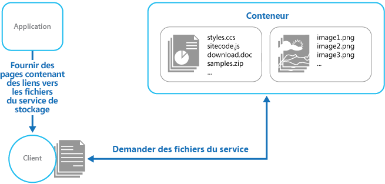

# <a name="static-content-hosting-pattern"></a><span data-ttu-id="d0ce0-104">Modèle d’hébergement de contenu statique</span><span class="sxs-lookup"><span data-stu-id="d0ce0-104">Static Content Hosting pattern</span></span>

<span data-ttu-id="d0ce0-105">Déployez un contenu statique dans un service de stockage cloud qui peut distribuer ce contenu directement au client.</span><span class="sxs-lookup"><span data-stu-id="d0ce0-105">Deploy static content to a cloud-based storage service that can deliver them directly to the client.</span></span> <span data-ttu-id="d0ce0-106">Cela peut réduire le besoin en instances de calcul éventuellement coûteuses.</span><span class="sxs-lookup"><span data-stu-id="d0ce0-106">This can reduce the need for potentially expensive compute instances.</span></span>

## <a name="context-and-problem"></a><span data-ttu-id="d0ce0-107">Contexte et problème</span><span class="sxs-lookup"><span data-stu-id="d0ce0-107">Context and problem</span></span>

<span data-ttu-id="d0ce0-108">En règle générale, les applications web comprennent certains éléments de contenu statique.</span><span class="sxs-lookup"><span data-stu-id="d0ce0-108">Web applications typically include some elements of static content.</span></span> <span data-ttu-id="d0ce0-109">Ce contenu statique peut inclure des pages HTML et d’autres ressources telles que des images et des documents qui sont disponibles pour le client, que ce soit en tant que composant d’une page HTML (par exemple, images incorporées, feuilles de style et fichiers JavaScript côté client) ou sous forme de téléchargements distincts (par exemple, documents PDF).</span><span class="sxs-lookup"><span data-stu-id="d0ce0-109">This static content might include HTML pages and other resources such as images and documents that are available to the client, either as part of an HTML page (such as inline images, style sheets, and client-side JavaScript files) or as separate downloads (such as PDF documents).</span></span>

<span data-ttu-id="d0ce0-110">Bien que les serveurs web soient optimisés pour le rendu dynamique et la mise en cache de sortie, ils doivent néanmoins gérer les requêtes pour le téléchargement de contenu statique.</span><span class="sxs-lookup"><span data-stu-id="d0ce0-110">Although web servers are optimized for dynamic rendering and output caching, they still have to handle requests to download static content.</span></span> <span data-ttu-id="d0ce0-111">Cela fait appel à des cycles de traitement qui peuvent souvent être mieux utilisés ailleurs.</span><span class="sxs-lookup"><span data-stu-id="d0ce0-111">This consumes processing cycles that could often be put to better use.</span></span>

## <a name="solution"></a><span data-ttu-id="d0ce0-112">Solution</span><span class="sxs-lookup"><span data-stu-id="d0ce0-112">Solution</span></span>

<span data-ttu-id="d0ce0-113">Dans la plupart des environnements d’hébergement cloud, vous pouvez placer certaines des ressources et des pages statiques d’une application dans un service de stockage.</span><span class="sxs-lookup"><span data-stu-id="d0ce0-113">In most cloud hosting environments, you can put some of an application's resources and static pages in a storage service.</span></span> <span data-ttu-id="d0ce0-114">Le service de stockage peut traiter les requêtes de ces ressources, ce qui permet ainsi de réduire la charge des ressources de calcul qui gèrent d’autres requêtes web.</span><span class="sxs-lookup"><span data-stu-id="d0ce0-114">The storage service can serve requests for these resources, reducing load on the compute resources that handle other web requests.</span></span> <span data-ttu-id="d0ce0-115">Le coût du stockage hébergé sur le cloud est généralement moindre par rapport à celui des instances de calcul.</span><span class="sxs-lookup"><span data-stu-id="d0ce0-115">The cost for cloud-hosted storage is typically much less than for compute instances.</span></span>

<span data-ttu-id="d0ce0-116">Lors de l’hébergement de certaines parties d’une application dans un service de stockage, les principales considérations à prendre en compte sont celles liées au déploiement de l’application et à la sécurisation des ressources qui ne sont pas destinées à être accessibles pour les utilisateurs anonymes.</span><span class="sxs-lookup"><span data-stu-id="d0ce0-116">When hosting some parts of an application in a storage service, the main considerations are related to deployment of the application and to securing resources that aren't intended to be available to anonymous users.</span></span>

## <a name="issues-and-considerations"></a><span data-ttu-id="d0ce0-117">Problèmes et considérations</span><span class="sxs-lookup"><span data-stu-id="d0ce0-117">Issues and considerations</span></span>

<span data-ttu-id="d0ce0-118">Prenez en compte les points suivants lorsque vous choisissez comment implémenter ce modèle :</span><span class="sxs-lookup"><span data-stu-id="d0ce0-118">Consider the following points when deciding how to implement this pattern:</span></span>

- <span data-ttu-id="d0ce0-119">Le service de stockage hébergé doit exposer un point de terminaison HTTP auquel les utilisateurs peuvent accéder pour télécharger les ressources statiques.</span><span class="sxs-lookup"><span data-stu-id="d0ce0-119">The hosted storage service must expose an HTTP endpoint that users can access to download the static resources.</span></span> <span data-ttu-id="d0ce0-120">Certains services de stockage prenant également en charge HTTPS, il est possible d’héberger des ressources dans les services de stockage qui exigent SSL.</span><span class="sxs-lookup"><span data-stu-id="d0ce0-120">Some storage services also support HTTPS, so it's possible to host resources in storage services that require SSL.</span></span>

- <span data-ttu-id="d0ce0-121">Pour optimiser les performances et la disponibilité, envisagez d’utiliser un réseau de distribution de contenu (CDN) pour mettre en cache le contenu du conteneur de stockage dans plusieurs centres de données dans le monde entier.</span><span class="sxs-lookup"><span data-stu-id="d0ce0-121">For maximum performance and availability, consider using a content delivery network (CDN) to cache the contents of the storage container in multiple datacenters around the world.</span></span> <span data-ttu-id="d0ce0-122">Toutefois, vous devrez probablement payer pour utiliser le CDN.</span><span class="sxs-lookup"><span data-stu-id="d0ce0-122">However, you'll likely have to pay for using the CDN.</span></span>

- <span data-ttu-id="d0ce0-123">Les comptes de stockage sont souvent géorépliqués par défaut pour assurer la résilience par rapport aux événements susceptibles d’affecter un centre de données.</span><span class="sxs-lookup"><span data-stu-id="d0ce0-123">Storage accounts are often geo-replicated by default to provide resiliency against events that might affect a datacenter.</span></span> <span data-ttu-id="d0ce0-124">Cela signifie que l’adresse IP peut être changée, mais que l’URL restera la même.</span><span class="sxs-lookup"><span data-stu-id="d0ce0-124">This means that the IP address might change, but the URL will remain the same.</span></span>

- <span data-ttu-id="d0ce0-125">Quand un contenu se trouve dans un compte de stockage et qu’un autre contenu se trouve dans une instance de calcul hébergée, il devient plus difficile de déployer une application et de la mettre à jour.</span><span class="sxs-lookup"><span data-stu-id="d0ce0-125">When some content is located in a storage account and other content is in a hosted compute instance, it becomes more challenging to deploy and update the application.</span></span> <span data-ttu-id="d0ce0-126">Vous devrez peut-être effectuer des déploiements distincts et contrôler la version de l’application et du contenu pour les gérer de façon plus simple&mdash;particulièrement quand le contenu statique inclut des fichiers de script ou des composants d’interface utilisateur.</span><span class="sxs-lookup"><span data-stu-id="d0ce0-126">You might have to perform separate deployments, and version the application and content to manage it more easily&mdash;especially when the static content includes script files or UI components.</span></span> <span data-ttu-id="d0ce0-127">Toutefois, si seules les ressources statiques doivent être mises à jour, elles peuvent simplement être chargées sur le compte de stockage sans avoir à redéployer le package d’application.</span><span class="sxs-lookup"><span data-stu-id="d0ce0-127">However, if only static resources have to be updated, they can simply be uploaded to the storage account without needing to redeploy the application package.</span></span>

- <span data-ttu-id="d0ce0-128">Les services de stockage peuvent ne pas prendre en charge l’utilisation de noms de domaine personnalisés.</span><span class="sxs-lookup"><span data-stu-id="d0ce0-128">Storage services might not support the use of custom domain names.</span></span> <span data-ttu-id="d0ce0-129">Dans ce cas, il est nécessaire de spécifier l’URL complète des ressources dans les liens, car ils seront dans un autre domaine que le contenu généré dynamiquement qui contient les liens.</span><span class="sxs-lookup"><span data-stu-id="d0ce0-129">In this case it's necessary to specify the full URL of the resources in links because they'll be in a different domain from the dynamically-generated content containing the links.</span></span>

- <span data-ttu-id="d0ce0-130">Les conteneurs de stockage doivent être configurés pour un accès en lecture public, mais il est essentiel de vous assurer qu’ils ne sont pas configurés pour l’accès en écriture public, afin d’empêcher les utilisateurs de charger du contenu.</span><span class="sxs-lookup"><span data-stu-id="d0ce0-130">The storage containers must be configured for public read access, but it's vital to ensure that they aren't configured for public write access to prevent users being able to upload content.</span></span>

- <span data-ttu-id="d0ce0-131">Utilisez une clé de valet ou un jeton pour contrôler l’accès aux ressources qui ne doivent pas être disponibles de façon anonyme.</span><span class="sxs-lookup"><span data-stu-id="d0ce0-131">Consider using a valet key or token to control access to resources that shouldn't be available anonymously.</span></span> <span data-ttu-id="d0ce0-132">Pour plus d’informations, consultez [Modèle de clé de valet](./valet-key.md).</span><span class="sxs-lookup"><span data-stu-id="d0ce0-132">See the [Valet Key pattern](./valet-key.md) for more information.</span></span>

## <a name="when-to-use-this-pattern"></a><span data-ttu-id="d0ce0-133">Quand utiliser ce modèle</span><span class="sxs-lookup"><span data-stu-id="d0ce0-133">When to use this pattern</span></span>

<span data-ttu-id="d0ce0-134">Ce modèle est utile dans les situations suivantes :</span><span class="sxs-lookup"><span data-stu-id="d0ce0-134">This pattern is useful for:</span></span>

- <span data-ttu-id="d0ce0-135">Pour réduire le coût d’hébergement des sites web et des applications qui contiennent certaines ressources statiques.</span><span class="sxs-lookup"><span data-stu-id="d0ce0-135">Minimizing the hosting cost for websites and applications that contain some static resources.</span></span>

- <span data-ttu-id="d0ce0-136">Pour réduire le coût d’hébergement des sites web qui comprennent uniquement des ressources et du contenu statiques.</span><span class="sxs-lookup"><span data-stu-id="d0ce0-136">Minimizing the hosting cost for websites that consist of only static content and resources.</span></span> <span data-ttu-id="d0ce0-137">En fonction des capacités du système de stockage du fournisseur d’hébergement, il est possible d’héberger intégralement un site web complètement statique dans un compte de stockage.</span><span class="sxs-lookup"><span data-stu-id="d0ce0-137">Depending on the capabilities of the hosting provider's storage system, it might be possible to entirely host a fully static website in a storage account.</span></span>

- <span data-ttu-id="d0ce0-138">Pour exposer du contenu et des ressources statiques pour les applications s’exécutant dans d’autres environnements d’hébergement ou sur des serveurs locaux.</span><span class="sxs-lookup"><span data-stu-id="d0ce0-138">Exposing static resources and content for applications running in other hosting environments or on-premises servers.</span></span>

- <span data-ttu-id="d0ce0-139">Pour localiser du contenu dans plus d’une zone géographique à l’aide d’un CDN qui met en cache les contenus du compte de stockage dans plusieurs centres de données partout dans le monde.</span><span class="sxs-lookup"><span data-stu-id="d0ce0-139">Locating content in more than one geographical area using a content delivery network that caches the contents of the storage account in multiple datacenters around the world.</span></span>

- <span data-ttu-id="d0ce0-140">Pour surveiller les coûts et l’utilisation de la bande passante.</span><span class="sxs-lookup"><span data-stu-id="d0ce0-140">Monitoring costs and bandwidth usage.</span></span> <span data-ttu-id="d0ce0-141">Utiliser un compte de stockage distinct pour certains ou l’ensemble des contenus statiques permet de séparer plus facilement les coûts d’exécution et d’hébergement.</span><span class="sxs-lookup"><span data-stu-id="d0ce0-141">Using a separate storage account for some or all of the static content allows the costs to be more easily separated from hosting and runtime costs.</span></span>

<span data-ttu-id="d0ce0-142">Ce modèle peut s’avérer inutile dans les situations suivantes :</span><span class="sxs-lookup"><span data-stu-id="d0ce0-142">This pattern might not be useful in the following situations:</span></span>

- <span data-ttu-id="d0ce0-143">L’application doit effectuer une partie du traitement du contenu statique avant de le fournir au client.</span><span class="sxs-lookup"><span data-stu-id="d0ce0-143">The application needs to perform some processing on the static content before delivering it to the client.</span></span> <span data-ttu-id="d0ce0-144">Par exemple, il peut être nécessaire d’ajouter un timestamp à un document.</span><span class="sxs-lookup"><span data-stu-id="d0ce0-144">For example, it might be necessary to add a timestamp to a document.</span></span>

- <span data-ttu-id="d0ce0-145">Le volume du contenu statique est très faible.</span><span class="sxs-lookup"><span data-stu-id="d0ce0-145">The volume of static content is very small.</span></span> <span data-ttu-id="d0ce0-146">La surcharge liée à la récupération de ce contenu à partir du stockage distinct peut annuler l’avantage en termes de coûts de sa séparation de la ressource de calcul.</span><span class="sxs-lookup"><span data-stu-id="d0ce0-146">The overhead of retrieving this content from separate storage can outweigh the cost benefit of separating it out from the compute resource.</span></span>

## <a name="example"></a><span data-ttu-id="d0ce0-147">Exemples</span><span class="sxs-lookup"><span data-stu-id="d0ce0-147">Example</span></span>

<span data-ttu-id="d0ce0-148">Le Stockage Azure prend en charge la fourniture de contenu statique directement à partir d’un conteneur de stockage.</span><span class="sxs-lookup"><span data-stu-id="d0ce0-148">Azure Storage supports serving static content directly from a storage container.</span></span> <span data-ttu-id="d0ce0-149">Les fichiers sont traités via des requêtes d’accès anonymes.</span><span class="sxs-lookup"><span data-stu-id="d0ce0-149">Files are served through anonymous access requests.</span></span> <span data-ttu-id="d0ce0-150">Par défaut, les fichiers ont une URL dans un sous-domaine de `core.windows.net`, par exemple `https://contoso.z4.web.core.windows.net/image.png`.</span><span class="sxs-lookup"><span data-stu-id="d0ce0-150">By default, files have a URL in a subdomain of `core.windows.net`, such as `https://contoso.z4.web.core.windows.net/image.png`.</span></span> <span data-ttu-id="d0ce0-151">Vous pouvez configurer un nom de domaine personnalisé et utiliser Azure CDN pour accéder aux fichiers via une connexion HTTPS.</span><span class="sxs-lookup"><span data-stu-id="d0ce0-151">You can configure a custom domain name, and use Azure CDN to access the files over HTTPS.</span></span> <span data-ttu-id="d0ce0-152">Pour plus d’informations, consultez [Hébergement de sites web statiques dans le service Stockage Azure](/azure/storage/blobs/storage-blob-static-website).</span><span class="sxs-lookup"><span data-stu-id="d0ce0-152">For more information, see [Static website hosting in Azure Storage](/azure/storage/blobs/storage-blob-static-website).</span></span>



<span data-ttu-id="d0ce0-154">L’hébergement de sites web statiques permet l’accès anonyme aux fichiers.</span><span class="sxs-lookup"><span data-stu-id="d0ce0-154">Static website hosting makes the files available for anonymous access.</span></span> <span data-ttu-id="d0ce0-155">Si vous devez contrôler l’accès aux fichiers de manière individualisée, stockez ces derniers dans le Stockage Blob Azure, puis générez des [signatures d’accès partagé](/azure/storage/common/storage-dotnet-shared-access-signature-part-1) pour limiter l’accès.</span><span class="sxs-lookup"><span data-stu-id="d0ce0-155">If you need to control who can access the files, you can store files in Azure blob storage and then generate [shared access signatures](/azure/storage/common/storage-dotnet-shared-access-signature-part-1) to limit access.</span></span>

<span data-ttu-id="d0ce0-156">Les liens des pages distribuées au client doivent spécifier l’URL complète de la ressource.</span><span class="sxs-lookup"><span data-stu-id="d0ce0-156">The links in the pages delivered to the client must specify the full URL of the resource.</span></span> <span data-ttu-id="d0ce0-157">Si la ressource est protégée à l’aide d’une clé de valet, par exemple une signature d’accès partagé Azure, cette signature doit être incluse dans l’URL.</span><span class="sxs-lookup"><span data-stu-id="d0ce0-157">If the resource is protected with a valet key, such as a shared access signature, this signature must be included in the URL.</span></span>

<span data-ttu-id="d0ce0-158">Un exemple d’application illustrant l’utilisation du stockage externe pour les ressources statiques est disponible sur [GitHub][sample-app].</span><span class="sxs-lookup"><span data-stu-id="d0ce0-158">A sample application that demonstrates using external storage for static resources is available on [GitHub][sample-app].</span></span> <span data-ttu-id="d0ce0-159">Cet exemple utilise des fichiers config pour spécifier le compte de stockage ainsi que le conteneur qui détient le contenu statique.</span><span class="sxs-lookup"><span data-stu-id="d0ce0-159">This sample uses configuration files to specify the storage account and container that holds the static content.</span></span>

```xml
<Setting name="StaticContent.StorageConnectionString"
         value="UseDevelopmentStorage=true" />
<Setting name="StaticContent.Container" value="static-content" />
```

<span data-ttu-id="d0ce0-160">La classe `Settings` dans le fichier Settings.cs du projet StaticContentHosting.Web contient des méthodes pour extraire ces valeurs et générer une valeur de chaîne contenant l’URL de conteneur du compte de stockage cloud.</span><span class="sxs-lookup"><span data-stu-id="d0ce0-160">The `Settings` class in the file Settings.cs of the StaticContentHosting.Web project contains methods to extract these values and build a string value containing the cloud storage account container URL.</span></span>

```csharp
public class Settings
{
  public static string StaticContentStorageConnectionString {
    get
    {
      return RoleEnvironment.GetConfigurationSettingValue(
                              "StaticContent.StorageConnectionString");
    }
  }

  public static string StaticContentContainer
  {
    get
    {
      return RoleEnvironment.GetConfigurationSettingValue("StaticContent.Container");
    }
  }

  public static string StaticContentBaseUrl
  {
    get
    {
      var account = CloudStorageAccount.Parse(StaticContentStorageConnectionString);

      return string.Format("{0}/{1}", account.BlobEndpoint.ToString().TrimEnd('/'),
                                      StaticContentContainer.TrimStart('/'));
    }
  }
}
```

<span data-ttu-id="d0ce0-161">La classe `StaticContentUrlHtmlHelper` dans le fichier StaticContentUrlHtmlHelper.cs expose une méthode nommée `StaticContentUrl` qui génère une URL contenant le chemin d’accès au compte de stockage cloud si l’URL transmise à ce dernier commence par le caractère de chemin d’accès ASP.NET racine (~).</span><span class="sxs-lookup"><span data-stu-id="d0ce0-161">The `StaticContentUrlHtmlHelper` class in the file StaticContentUrlHtmlHelper.cs exposes a method named `StaticContentUrl` that generates a URL containing the path to the cloud storage account if the URL passed to it starts with the ASP.NET root path character (~).</span></span>

```csharp
public static class StaticContentUrlHtmlHelper
{
  public static string StaticContentUrl(this HtmlHelper helper, string contentPath)
  {
    if (contentPath.StartsWith("~"))
    {
      contentPath = contentPath.Substring(1);
    }

    contentPath = string.Format("{0}/{1}", Settings.StaticContentBaseUrl.TrimEnd('/'),
                                contentPath.TrimStart('/'));

    var url = new UrlHelper(helper.ViewContext.RequestContext);

    return url.Content(contentPath);
  }
}
```

<span data-ttu-id="d0ce0-162">Le fichier Index.cshtml dans le dossier Views\Home contient un élément d’image qui utilise la méthode `StaticContentUrl` pour créer l’URL pour son attribut `src`.</span><span class="sxs-lookup"><span data-stu-id="d0ce0-162">The file Index.cshtml in the Views\Home folder contains an image element that uses the `StaticContentUrl` method to create the URL for its `src` attribute.</span></span>

```html

```

## <a name="related-patterns-and-guidance"></a><span data-ttu-id="d0ce0-163">Conseils et modèles connexes</span><span class="sxs-lookup"><span data-stu-id="d0ce0-163">Related patterns and guidance</span></span>

- <span data-ttu-id="d0ce0-164">[Exemple d’hébergement de contenu statique][sample-app].</span><span class="sxs-lookup"><span data-stu-id="d0ce0-164">[Static Content Hosting sample][sample-app].</span></span> <span data-ttu-id="d0ce0-165">Exemple d’application qui illustre ce modèle.</span><span class="sxs-lookup"><span data-stu-id="d0ce0-165">A sample application that demonstrates this pattern.</span></span>
- <span data-ttu-id="d0ce0-166">[Valet Key pattern](./valet-key.md) (Modèle de clé de valet).</span><span class="sxs-lookup"><span data-stu-id="d0ce0-166">[Valet Key pattern](./valet-key.md).</span></span> <span data-ttu-id="d0ce0-167">Si les ressources cibles ne sont pas censées être accessibles aux utilisateurs anonymes, utilisez ce modèle pour restreindre l’accès direct.</span><span class="sxs-lookup"><span data-stu-id="d0ce0-167">If the target resources aren't supposed to be available to anonymous users, use this pattern to restrict direct access.</span></span>
- <span data-ttu-id="d0ce0-168">[Application web serverless sur Azure](../reference-architectures/serverless/web-app.md).</span><span class="sxs-lookup"><span data-stu-id="d0ce0-168">[Serverless web application on Azure](../reference-architectures/serverless/web-app.md).</span></span> <span data-ttu-id="d0ce0-169">Architecture de référence utilisant un hébergement web statique avec Azure Functions pour implémenter une application web serverless.</span><span class="sxs-lookup"><span data-stu-id="d0ce0-169">A reference architecture that uses static website hosting with Azure Functions to implement a serverless web app.</span></span>

[sample-app]: https://github.com/mspnp/cloud-design-patterns/tree/master/static-content-hosting
