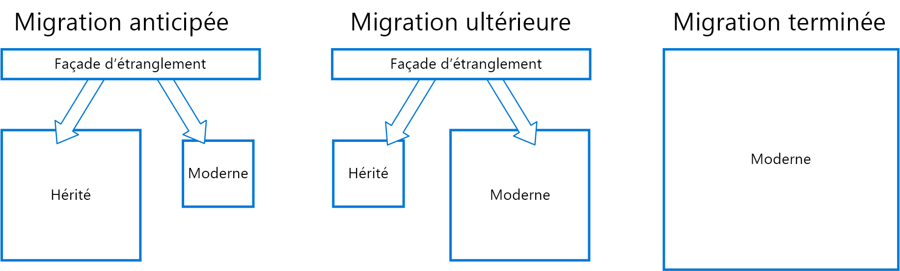

# Modèle d’étranglementStrangler pattern

Faites migrer un système hérité de façon incrémentielle en remplaçant progressivement des parties spécifiques des fonctionnalités par de nouveaux services et applications.Incrementally migrate a legacy system by gradually replacing specific pieces of functionality with new applications and services. Lorsque les fonctionnalités d’un système hérité sont remplacées, le nouveau système finit par remplacer toutes les fonctionnalités de l’ancien système. Il étrangle alors l’ancien système et vous permet ainsi de le désactiver.As features from the legacy system are replaced, the new system eventually replaces all of the old system's features, strangling the old system and allowing you to decommission it. 

## Contexte et problèmeContext and problem

À mesure que les systèmes vieillissent, les outils de développement, la technologie d’hébergement et même les architectures système sur lesquels reposent ces systèmes peuvent devenir de plus en plus obsolètes.As systems age, the development tools, hosting technology, and even system architectures they were built on can become increasingly obsolete. L’ajout progressif de nouvelles fonctions et fonctionnalités peut considérablement accroître la complexité de ces applications et compliquer ainsi la mise à jour ou l’enrichissement de ces dernières.As new features and functionality are added, the complexity of these applications can increase dramatically, making them harder to maintain or add new features to.

Le remplacement complet d’un système complexe peut constituer un défi de taille.Completely replacing a complex system can be a huge undertaking. Vous serez généralement contraint d’effectuer une migration progressive vers un nouveau système, tout en conservant l’ancien système pour gérer les fonctionnalités qui n’ont pas encore fait l’objet d’une migration.Often, you will need a gradual migration to a new system, while keeping the old system to handle features that haven't been migrated yet. Toutefois, l’exécution de deux versions distinctes d’une application signifie que les clients doivent connaître l’emplacement des différentes fonctionnalités.However, running two separate versions of an application means that clients have to know where particular features are located. Chaque fois que vous faites migrer une fonctionnalité ou un service, vous devez donc mettre à jour les clients pour qu’ils pointent vers le nouvel emplacement.Every time a feature or service is migrated, clients need to be updated to point to the new location.

## SolutionSolution

Remplacez progressivement des parties spécifiques des fonctionnalités par de nouveaux services et applications.Incrementally replace specific pieces of functionality with new applications and services. Créez une façade qui intercepte les requêtes destinées au système hérité principal.Create a façade that intercepts requests going to the backend legacy system. La façade route ces requêtes soit vers l’application héritée, soit vers les nouveaux services.The façade routes these requests either to the legacy application or the new services. Les fonctionnalités existantes peuvent faire l’objet d’une migration progressive vers le nouveau système, et les clients peuvent continuer à utiliser la même interface sans savoir qu’une migration a été effectuée.Existing features can be migrated to the new system gradually, and consumers can continue using the same interface, unaware that any migration has taken place.

  

Ce modèle contribue à minimiser les risques liés à la migration et à étaler l’effort de développement dans le temps.This pattern helps to minimize risk from the migration, and spread the development effort over time. Étant donné que la façade route les utilisateurs en toute sécurité vers l’application adéquate, vous pouvez ajouter des fonctionnalités au nouveau système à votre rythme, tout en ayant l’assurance que l’application héritée continue à fonctionner.With the façade safely routing users to the correct application, you can add functionality to the new system at whatever pace you like, while ensuring the legacy application continues to function. Avec le temps, à mesure que les fonctionnalités font l’objet d’une migration vers le nouveau système, le système hérité finit par être « étranglé » et par devenir inutile.Over time, as features are migrated to the new system, the legacy system is eventually "strangled" and is no longer necessary. Une fois ce processus terminé, le système hérité peut alors être mis hors service sans problème.Once this process is complete, the legacy system can safely be retired.

## Problèmes et considérationsIssues and considerations

- Déterminez comment gérer les services et les magasins de données potentiellement utilisés à la fois par un nouveau système et par un système hérité.Consider how to handle services and data stores that are potentially used by both new and legacy systems. Assurez-vous que les deux systèmes peuvent accéder à ces ressources côte à côte.Make sure both can access these resources side-by-side.
- Structurez les nouveaux services et applications de façon à faciliter leur interception et leur remplacement dans les futures migrations d’étranglement.Structure new applications and services in a way that they can easily be intercepted and replaced in future strangler migrations.
- À un moment donné, une fois la migration terminée, la façade d’étranglement finit soit par disparaître, soit par évoluer sous la forme d’un adaptateur pour les clients hérités.At some point, when the migration is complete, the strangler façade will either go away or evolve into an adaptor for legacy clients.
- Assurez-vous que la façade suive le rythme de la migration.Make sure the façade keeps up with the migration.
- Assurez-vous que la façade ne devienne pas un point de défaillance unique ou un goulot d’étranglement.Make sure the façade doesn't become a single point of failure or a performance bottleneck.

## Quand utiliser ce modèleWhen to use this pattern

Utilisez ce modèle lorsque vous faites migrer progressivement une application principale vers une nouvelle architecture.Use this pattern when gradually migrating a back-end application to a new architecture.

Ce modèle peut ne pas convenir dans les cas suivants :This pattern may not be suitable:

- lorsque les requêtes adressées au système principal ne peuvent pas être interceptées ;When requests to the back-end system cannot be intercepted.
- pour les systèmes plus modestes dont le remplacement global présente peu de difficultés.For smaller systems where the complexity of wholesale replacement is low.

## Aide connexeRelated guidance

- [Anti-Corruption Layer pattern (Modèle de couche de lutte contre la corruption)Anti-Corruption Layer pattern](./anti-corruption-layer.md)
- [Gateway Routing pattern (Modèle de routage de passerelle)Gateway Routing pattern](./gateway-routing.md)

 

