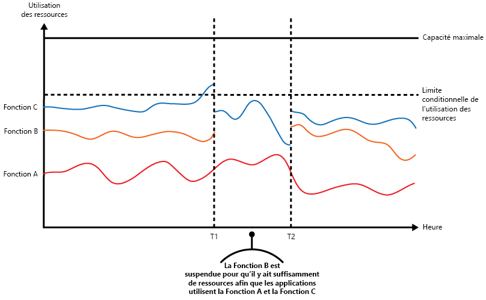
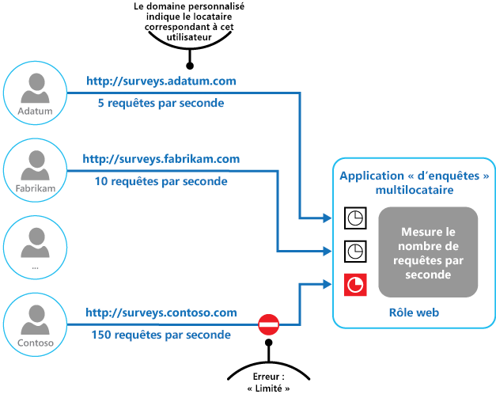

# Modèle de limitationThrottling pattern

[!INCLUDE [header](../_includes/header.md)]

Contrôlez la consommation des ressources utilisées par une instance d’une application, un locataire ou un service entier.Control the consumption of resources used by an instance of an application, an individual tenant, or an entire service. Cela peut permettre au système de continuer à fonctionner et de répondre aux contrats de niveau de service, même lorsqu’une augmentation de la demande implique une charge extrême sur les ressources.This can allow the system to continue to function and meet service level agreements, even when an increase in demand places an extreme load on resources.

## Contexte et problèmeContext and problem

Généralement, la charge sur une application cloud varie au fil du temps, selon le nombre d’utilisateurs actifs ou les types d’activités qu’ils effectuent.The load on a cloud application typically varies over time based on the number of active users or the types of activities they are performing. Par exemple, plus d’utilisateurs sont susceptibles d’être actifs pendant les heures de bureau, ou le système doit effectuer des analyses requérant davantage de ressources de calcul à la fin de chaque mois.For example, more users are likely to be active during business hours, or the system might be required to perform computationally expensive analytics at the end of each month. Il peut également y avoir des pics soudains et imprévus dans l’activité.There might also be sudden and unanticipated bursts in activity. Si les besoins de traitement du système dépassent la capacité des ressources qui sont disponibles, ses performances seront médiocres et des défaillances peuvent même se produire.If the processing requirements of the system exceed the capacity of the resources that are available, it'll suffer from poor performance and can even fail. Si le système doit répondre à un niveau de service défini, de telles défaillances peuvent être inacceptables.If the system has to meet an agreed level of service, such failure could be unacceptable.

Plusieurs stratégies sont disponibles pour gérer les variations de charge dans le cloud, selon les objectifs métier de l’application.There're many strategies available for handling varying load in the cloud, depending on the business goals for the application. Une stratégie consiste à utiliser la mise à l’échelle automatique pour faire correspondre les ressources configurées aux besoins de l’utilisateur à un moment donné.One strategy is to use autoscaling to match the provisioned resources to the user needs at any given time. Cela permet de répondre en permanence à la demande de l’utilisateur tout en optimisant les coûts d’exécution.This has the potential to consistently meet user demand, while optimizing running costs. Toutefois, même si la mise à l’échelle automatique peut déclencher la configuration des ressources supplémentaires, cette configuration n’est pas immédiate.However, while autoscaling can trigger the provisioning of additional resources, this provisioning isn't immediate. Si la demande augmente rapidement, il peut y avoir une période pendant laquelle des ressources manquent.If demand grows quickly, there can be a window of time where there's a resource deficit.

## SolutionSolution

Plutôt que d’opter pour la mise à l’échelle automatique, vous pouvez autoriser les applications à utiliser des ressources uniquement jusqu’à une certaine limite, puis de les bloquer une fois cette limite atteinte.An alternative strategy to autoscaling is to allow applications to use resources only up to a limit, and then throttle them when this limit is reached. Le système doit surveiller son utilisation des ressources de façon que, une fois que l’utilisation dépasse le seuil, il puisse limiter les requêtes d’un ou de plusieurs utilisateurs.The system should monitor how it's using resources so that, when usage exceeds the threshold, it can throttle requests from one or more users. Cela permettra au système de continuer à fonctionner et de respecter les contrats de niveau de service (SLA) en place.This will enable the system to continue functioning and meet any service level agreements (SLAs) that are in place. Pour plus d’informations sur la surveillance de l’utilisation des ressources, consultez [Monitoring and diagnostics](https://msdn.microsoft.com/library/dn589775.aspx) (Surveillance et diagnostics).For more information on monitoring resource usage, see the [Instrumentation and Telemetry Guidance](https://msdn.microsoft.com/library/dn589775.aspx).

Le système peut implémenter plusieurs stratégies de limitation, y compris :The system could implement several throttling strategies, including:

- Le rejet de requêtes d’un utilisateur individuel qui a déjà accédé à des API système plus de n fois par seconde pendant une période donnée.Rejecting requests from an individual user who's already accessed system APIs more than n times per second over a given period of time. Cela nécessite que le système mesure l’utilisation des ressources pour chaque locataire ou utilisateur exécutant une application.This requires the system to meter the use of resources for each tenant or user running an application. Pour plus d’informations, consultez [Service Metering Guidance](https://msdn.microsoft.com/library/dn589796.aspx) (Conseils sur la mesure des services).For more information, see the [Service Metering Guidance](https://msdn.microsoft.com/library/dn589796.aspx).

- La désactivation ou la dégradation des fonctionnalités des services non essentiels sélectionnés, afin que les services essentiels puissent s’exécuter normalement avec suffisamment de ressources.Disabling or degrading the functionality of selected nonessential services so that essential services can run unimpeded with sufficient resources. Par exemple, si l’application diffuse une vidéo, elle peut basculer sur une résolution plus faible.For example, if the application is streaming video output, it could switch to a lower resolution.

- L’utilisation du nivellement de la charge pour lisser le volume d’activité (cette approche est abordée plus en détail dans [Queue-based Load Leveling pattern](./queue-based-load-leveling.md)(Modèle de nivellement de la charge basé sur une file d’attente)).Using load leveling to smooth the volume of activity (this approach is covered in more detail by the [Queue-based Load Leveling pattern](./queue-based-load-leveling.md)). Dans un environnement multi-locataire, cette approche réduira les performances de chaque locataire.In a multi-tenant environment, this approach will reduce the performance for every tenant. Si le système doit prendre en charge un mélange de locataires avec différents SLA, le travail des locataires prioritaires peut être effectué immédiatement.If the system must support a mix of tenants with different SLAs, the work for high-value tenants might be performed immediately. Les requêtes des autres locataires peuvent être retenues et gérées lorsque le backlog a été allégé.Requests for other tenants can be held back, and handled when the backlog has eased. Le [modèle de file d’attente de priorité](./priority-queue.md) peut être utilisé pour aider à implémenter cette approche.The [Priority Queue pattern](./priority-queue.md) could be used to help implement this approach.

- Le report d’opérations en cours d’exécution pour le compte d’applications ou de locataires basse priorité.Deferring operations being performed on behalf of lower priority applications or tenants. Ces opérations peuvent être suspendues ou limitées, avec une exception générée pour informer le locataire que le système est occupé et que l’opération doit être retentée ultérieurement.These operations can be suspended or limited, with an exception generated to inform the tenant that the system is busy and that the operation should be retried later.

L’illustration montre un graphique par zone pour l’utilisation des ressources (combinaison de mémoire, processeur, bande passante et d’autres facteurs) en fonction de l’heure pour des applications se servant de trois fonctionnalités.The figure shows an area graph for resource use (a combination of memory, CPU, bandwidth, and other factors) against time for applications that are making use of three features. Une fonction est une zone de fonctionnalités, comme un composant qui effectue un ensemble spécifique de tâches, une partie de code qui effectue un calcul complexe ou un élément qui fournit un service tel qu’un cache en mémoire.A feature is an area of functionality, such as a component that performs a specific set of tasks, a piece of code that performs a complex calculation, or an element that provides a service such as an in-memory cache. Ces fonctions sont étiquetées A, B et C.These features are labeled A, B, and C.

> La zone se trouvant immédiatement en dessous de la ligne d’une fonctionnalité indique les ressources utilisées par les applications lorsqu’elles appellent cette fonctionnalité.The area immediately below the line for a feature indicates the resources that are used by applications when they invoke this feature. Par exemple, la zone en dessous de la ligne de la fonctionnalité A montre les ressources utilisées par les applications qui se servent de la fonctionnalité A, et la zone entre les lignes de la fonctionnalité A et de la fonctionnalité B indique les ressources utilisées par les applications qui appellent la fonctionnalité B. L’agrégation des zones pour chaque fonctionnalité illustre l’utilisation de ressources totale du système.For example, the area below the line for Feature A shows the resources used by applications that are making use of Feature A, and the area between the lines for Feature A and Feature B indicates the resources used by applications invoking Feature B. Aggregating the areas for each feature shows the total resource use of the system.

L’illustration précédente présente les effets des opérations de report.The previous figure illustrates the effects of deferring operations. Juste avant l’heure T1, le total des ressources allouées à toutes les applications utilisant ces fonctionnalités atteint un seuil (la limite d’utilisation des ressources).Just prior to time T1, the total resources allocated to all applications using these features reach a threshold (the limit of resource use). À ce stade, les applications risquent d’épuiser les ressources disponibles.At this point, the applications are in danger of exhausting the resources available. Dans ce système, la fonctionnalité B étant moins importante que la fonctionnalité A ou C, elle est temporairement désactivée et les ressources qu’elle utilisait sont libérées.In this system, Feature B is less critical than Feature A or Feature C, so it's temporarily disabled and the resources that it was using are released. Entre les heures T1 et T2, les applications utilisant la fonctionnalité A et la fonctionnalité C continuent de s’exécuter normalement.Between times T1 and T2, the applications using Feature A and Feature C continue running as normal. Finalement, l’utilisation des ressources de ces deux fonctionnalités diminue jusqu’à ce que, à l’heure T2, il y ait suffisamment de capacité pour activer de nouveau la fonctionnalité B.Eventually, the resource use of these two features diminishes to the point when, at time T2, there is sufficient capacity to enable Feature B again.

Les approches de mise à l’échelle automatique et de limite peuvent également être combinées pour permettre de garantir la réactivité des applications et leur respect des SLA.The autoscaling and throttling approaches can also be combined to help keep the applications responsive and within SLAs. Si la demande doit rester élevée, la limitation fournit une solution temporaire, tandis que le système peut augmenter la taille des instances. À ce stade, les fonctionnalités complètes du système peuvent être restaurées.If the demand is expected to remain high, throttling provides a temporary solution while the system scales out. At this point, the full functionality of the system can be restored.

La figure suivante montre un graphique par zone de l’utilisation globale des ressources par toutes les applications s’exécutant dans un système en fonction de l’heure. Elle illustre également la façon dont la limitation peut être combinée avec la mise à l’échelle automatique.The next figure shows an area graph of the overall resource use by all applications running in a system against time, and illustrates how throttling can be combined with autoscaling.

À l’heure T1, le seuil spécifiant la limite logicielle de l’utilisation des ressources est atteint.At time T1, the threshold specifying the soft limit of resource use is reached. À ce stade, le système peut commencer à augmenter la taille des instances. Toutefois, si les nouvelles ressources ne sont pas disponibles assez rapidement, les ressources existantes peuvent s’épuiser et le système peut tomber en panne.At this point, the system can start to scale out. However, if the new resources don't become available quickly enough, then the existing resources might be exhausted and the system could fail. Pour éviter ce problème, le système est temporairement limité, comme décrit précédemment.To prevent this from occurring, the system is temporarily throttled, as described earlier. Une fois la mise à l’échelle automatique terminée et les ressources supplémentaires disponibles, la limitation peut être retirée.When autoscaling has completed and the additional resources are available, throttling can be relaxed.

## Problèmes et considérationsIssues and considerations

Prenez en compte les points suivants quand vous choisissez comment implémenter ce modèle :You should consider the following points when deciding how to implement this pattern:

- La limitation d’une application, ainsi que la stratégie à utiliser, est une décision à prendre en matière d’architecture, qui a des conséquences sur l’ensemble de la conception d’un système.Throttling an application, and the strategy to use, is an architectural decision that impacts the entire design of a system. La limitation doit être envisagée tôt dans le processus de conception d’application, car il n’est pas facile de l’ajouter une fois qu’un système a été implémenté.Throttling should be considered early in the application design process because it isn't easy to add once a system has been implemented.

- La limitation doit être effectuée rapidement.Throttling must be performed quickly. Le système doit être capable de détecter une augmentation de l’activité et de réagir en conséquence.The system must be capable of detecting an increase in activity and react accordingly. Le système doit également être en mesure de revenir rapidement à son état d’origine une fois que la charge a été allégée.The system must also be able to revert to its original state quickly after the load has eased. Cela nécessite la capture et la surveillance permanentes des données de performances appropriées.This requires that the appropriate performance data is continually captured and monitored.

- Si un service doit temporairement refuser une requête de l’utilisateur, il doit renvoyer un code d’erreur spécifique pour que l’application cliente comprenne que la raison du refus d’exécution d’une opération est liée à la limitation.If a service needs to temporarily deny a user request, it should return a specific error code so the client application understands that the reason for the refusal to perform an operation is due to throttling. L’application cliente peut attendre un certain temps avant de faire une nouvelle tentative de requête.The client application can wait for a period before retrying the request.

- La limitation peut être utilisée en tant que mesure temporaire pendant la mise à l’échelle automatique d’un système.Throttling can be used as a temporary measure while a system autoscales. Dans certaines situations, il est préférable de mettre en place une limitation plutôt qu’une mise à l’échelle (par exemple, en cas d’augmentation soudaine de l’activité se produisant de façon ponctuelle), car la mise à l’échelle peut entraîner des coûts d’exécution supplémentaires importants.In some cases it's better to simply throttle, rather than to scale, if a burst in activity is sudden and isn't expected to be long lived because scaling can add considerably to running costs.

- Si la limitation est utilisée en tant que mesure temporaire pendant la mise à l’échelle automatique d’un système, et si les demandes de ressources augmentent très rapidement, le système peut ne pas être en mesure de continuer à fonctionner correctement&mdash;même lorsqu’il opère en mode limité.If throttling is being used as a temporary measure while a system autoscales, and if resource demands grow very quickly, the system might not be able to continue functioning&mdash;even when operating in a throttled mode. Si cela n’est pas acceptable, pensez à conserver des réserves de capacité plus importantes et à configurer une mise à l’échelle automatique plus agressive.If this isn't acceptable, consider maintaining larger capacity reserves and configuring more aggressive autoscaling.

## Quand utiliser ce modèleWhen to use this pattern

Utilisez ce modèle :Use this pattern:

- Pour vous assurer qu’un système continue à répondre aux contrats de niveau de service.To ensure that a system continues to meet service level agreements.

- Pour éviter qu’un seul locataire monopolise les ressources fournies par une application.To prevent a single tenant from monopolizing the resources provided by an application.

- Pour gérer des augmentations de l’activité.To handle bursts in activity.

- Pour aider à optimiser les coûts d’un système en limitant les niveaux de ressources maximum nécessaires pour qu’il continue à fonctionner.To help cost-optimize a system by limiting the maximum resource levels needed to keep it functioning.

## ExemplesExample

La dernière figure illustre la façon dont la limitation peut être implémentée dans un système multi-locataire.The final figure illustrates how throttling can be implemented in a multi-tenant system. Les utilisateurs de chaque organisation de locataire accèdent à une application hébergée dans le cloud, dans laquelle ils remplissent et envoient des enquêtes.Users from each of the tenant organizations access a cloud-hosted application where they fill out and submit surveys. L’application contient une instrumentation qui surveille la vitesse d’envoi des requêtes à l’application par ces utilisateurs.The application contains instrumentation that monitors the rate at which these users are submitting requests to the application.

Afin d’empêcher les utilisateurs d’un locataire de nuire à la réactivité et à la disponibilité de l’application de tous les autres utilisateurs, une limite est appliquée au nombre de requêtes par seconde que les utilisateurs d’un locataire peuvent envoyer.In order to prevent the users from one tenant affecting the responsiveness and availability of the application for all other users, a limit is applied to the number of requests per second the users from any one tenant can submit. L’application bloque les requêtes qui dépassent cette limite.The application blocks requests that exceed this limit.

## Conseils et modèles connexesRelated patterns and guidance

Les modèles et les conseils suivants peuvent également être pertinents lors de l'implémentation de ce modèle :The following patterns and guidance may also be relevant when implementing this pattern:

- [Recommandations relatives à l’instrumentation et la télémétrie](https://msdn.microsoft.com/library/dn589775.aspx).[Instrumentation and Telemetry Guidance](https://msdn.microsoft.com/library/dn589775.aspx). La limitation dépend de la collecte d’informations sur la façon dont un service est utilisé.Throttling depends on gathering information about how heavily a service is being used. Décrit comment générer et capturer des informations de surveillance personnalisées.Describes how to generate and capture custom monitoring information.
- [Service Metering Guidance](https://msdn.microsoft.com/library/dn589796.aspx) (Conseils sur la mesure des services).[Service Metering Guidance](https://msdn.microsoft.com/library/dn589796.aspx). Décrit comment mesurer l’utilisation des services afin de mieux comprendre la façon dont ils sont utilisés.Describes how to meter the use of services in order to gain an understanding of how they are used. Ces informations peuvent être utiles pour déterminer la manière de limiter un service.This information can be useful in determining how to throttle a service.
- [Autoscaling](https://msdn.microsoft.com/library/dn589774.aspx) (Mise à l’échelle automatique).[Autoscaling Guidance](https://msdn.microsoft.com/library/dn589774.aspx). La limitation peut être utilisée en tant que mesure intermédiaire pendant la mise à l’échelle automatique d’un système ou pour éliminer le besoin de mise à l’échelle automatique d’un système.Throttling can be used as an interim measure while a system autoscales, or to remove the need for a system to autoscale. Contient des informations sur les stratégies de mise à l’échelle automatique.Contains information on autoscaling strategies.
- [Queue-based Load Leveling pattern](./queue-based-load-leveling.md) (Modèle de nivellement de charge basé sur une file d’attente).[Queue-based Load Leveling pattern](./queue-based-load-leveling.md). Le nivellement de charge basé sur une file d’attente est un mécanisme couramment utilisé pour l’implémentation de la limitation.Queue-based load leveling is a commonly used mechanism for implementing throttling. Une file d’attente peut agir comme une mémoire tampon qui permet d’équilibrer la vitesse à laquelle les requêtes envoyées par une application sont remises à un service.A queue can act as a buffer that helps to even out the rate at which requests sent by an application are delivered to a service.
- [Priority Queue pattern](./priority-queue.md) (Modèle de file d’attente de priorité).[Priority Queue pattern](./priority-queue.md). Un système peut utiliser la file d’attente de priorité dans le cadre de la stratégie de limitation pour maintenir les performances des applications critiques ou très importantes tout en réduisant les performances des applications moins importantes.A system can use priority queuing as part of its throttling strategy to maintain performance for critical or higher value applications, while reducing the performance of less important applications.
