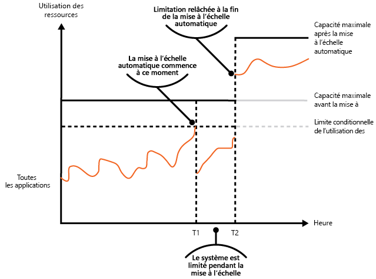

# Modèle de limitation

[!INCLUDE [header](../_includes/header.md)]

Contrôlez la consommation des ressources utilisées par une instance d’une application, un locataire ou un service entier. Cela peut permettre au système de continuer à fonctionner et de répondre aux contrats de niveau de service, même lorsqu’une augmentation de la demande implique une charge extrême sur les ressources.

## Contexte et problème

Généralement, la charge sur une application cloud varie au fil du temps, selon le nombre d’utilisateurs actifs ou les types d’activités qu’ils effectuent. Par exemple, plus d’utilisateurs sont susceptibles d’être actifs pendant les heures de bureau, ou le système doit effectuer des analyses requérant davantage de ressources de calcul à la fin de chaque mois. Il peut également y avoir des pics soudains et imprévus dans l’activité. Si les besoins de traitement du système dépassent la capacité des ressources qui sont disponibles, ses performances seront médiocres et des défaillances peuvent même se produire. Si le système doit répondre à un niveau de service défini, de telles défaillances peuvent être inacceptables.

Plusieurs stratégies sont disponibles pour gérer les variations de charge dans le cloud, selon les objectifs métier de l’application. Une stratégie consiste à utiliser la mise à l’échelle automatique pour faire correspondre les ressources configurées aux besoins de l’utilisateur à un moment donné. Cela permet de répondre en permanence à la demande de l’utilisateur tout en optimisant les coûts d’exécution. Toutefois, même si la mise à l’échelle automatique peut déclencher la configuration des ressources supplémentaires, cette configuration n’est pas immédiate. Si la demande augmente rapidement, il peut y avoir une période pendant laquelle des ressources manquent.

## Solution

Plutôt que d’opter pour la mise à l’échelle automatique, vous pouvez autoriser les applications à utiliser des ressources uniquement jusqu’à une certaine limite, puis de les bloquer une fois cette limite atteinte. Le système doit surveiller son utilisation des ressources de façon que, une fois que l’utilisation dépasse le seuil, il puisse limiter les requêtes d’un ou de plusieurs utilisateurs. Cela permettra au système de continuer à fonctionner et de respecter les contrats de niveau de service (SLA) en place. Pour plus d’informations sur la surveillance de l’utilisation des ressources, consultez [Monitoring and diagnostics](https://msdn.microsoft.com/library/dn589775.aspx) (Surveillance et diagnostics).

Le système peut implémenter plusieurs stratégies de limitation, y compris :

- Le rejet de requêtes d’un utilisateur individuel qui a déjà accédé à des API système plus de n fois par seconde pendant une période donnée. Cela nécessite que le système mesure l’utilisation des ressources pour chaque locataire ou utilisateur exécutant une application. Pour plus d’informations, consultez [Service Metering Guidance](https://msdn.microsoft.com/library/dn589796.aspx) (Conseils sur la mesure des services).

- La désactivation ou la dégradation des fonctionnalités des services non essentiels sélectionnés, afin que les services essentiels puissent s’exécuter normalement avec suffisamment de ressources. Par exemple, si l’application diffuse une vidéo, elle peut basculer sur une résolution plus faible.

- L’utilisation du nivellement de la charge pour lisser le volume d’activité (cette approche est abordée plus en détail dans [Queue-based Load Leveling pattern](./queue-based-load-leveling.md)(Modèle de nivellement de la charge basé sur une file d’attente)). Dans un environnement multi-locataire, cette approche réduira les performances de chaque locataire. Si le système doit prendre en charge un mélange de locataires avec différents SLA, le travail des locataires prioritaires peut être effectué immédiatement. Les requêtes des autres locataires peuvent être retenues et gérées lorsque le backlog a été allégé. Vous pouvez vous servir du [modèle de file d’attente de priorité][] pour implémenter cette approche.

- Le report d’opérations en cours d’exécution pour le compte d’applications ou de locataires basse priorité. Ces opérations peuvent être suspendues ou limitées, avec une exception générée pour informer le locataire que le système est occupé et que l’opération doit être retentée ultérieurement.

L’illustration montre un graphique par zone pour l’utilisation des ressources (combinaison de mémoire, processeur, bande passante et d’autres facteurs) en fonction de l’heure pour des applications se servant de trois fonctionnalités. Une fonction est une zone de fonctionnalités, comme un composant qui effectue un ensemble spécifique de tâches, une partie de code qui effectue un calcul complexe ou un élément qui fournit un service tel qu’un cache en mémoire. Ces fonctions sont étiquetées A, B et C.

> La zone se trouvant immédiatement en dessous de la ligne d’une fonctionnalité indique les ressources utilisées par les applications lorsqu’elles appellent cette fonctionnalité. Par exemple, la zone en dessous de la ligne de la fonctionnalité A montre les ressources utilisées par les applications qui se servent de la fonctionnalité A, et la zone entre les lignes de la fonctionnalité A et de la fonctionnalité B indique les ressources utilisées par les applications qui appellent la fonctionnalité B. L’agrégation des zones pour chaque fonctionnalité illustre l’utilisation de ressources totale du système.

L’illustration précédente présente les effets des opérations de report. Juste avant l’heure T1, le total des ressources allouées à toutes les applications utilisant ces fonctionnalités atteint un seuil (la limite d’utilisation des ressources). À ce stade, les applications risquent d’épuiser les ressources disponibles. Dans ce système, la fonctionnalité B étant moins importante que la fonctionnalité A ou C, elle est temporairement désactivée et les ressources qu’elle utilisait sont libérées. Entre les heures T1 et T2, les applications utilisant la fonctionnalité A et la fonctionnalité C continuent de s’exécuter normalement. Finalement, l’utilisation des ressources de ces deux fonctionnalités diminue jusqu’à ce que, à l’heure T2, il y ait suffisamment de capacité pour activer de nouveau la fonctionnalité B.

Les approches de mise à l’échelle automatique et de limite peuvent également être combinées pour permettre de garantir la réactivité des applications et leur respect des SLA. Si la demande doit rester élevée, la limitation fournit une solution temporaire, tandis que le système peut augmenter la taille des instances. À ce stade, les fonctionnalités complètes du système peuvent être restaurées.

La figure suivante montre un graphique par zone de l’utilisation globale des ressources par toutes les applications s’exécutant dans un système en fonction de l’heure. Elle illustre également la façon dont la limitation peut être combinée avec la mise à l’échelle automatique.

À l’heure T1, le seuil spécifiant la limite logicielle de l’utilisation des ressources est atteint. À ce stade, le système peut commencer à augmenter la taille des instances. Toutefois, si les nouvelles ressources ne sont pas disponibles assez rapidement, les ressources existantes peuvent s’épuiser et le système peut tomber en panne. Pour éviter ce problème, le système est temporairement limité, comme décrit précédemment. Une fois la mise à l’échelle automatique terminée et les ressources supplémentaires disponibles, la limitation peut être retirée.

## Problèmes et considérations

Prenez en compte les points suivants quand vous choisissez comment implémenter ce modèle :

- La limitation d’une application, ainsi que la stratégie à utiliser, est une décision à prendre en matière d’architecture, qui a des conséquences sur l’ensemble de la conception d’un système. La limitation doit être envisagée tôt dans le processus de conception d’application, car il n’est pas facile de l’ajouter une fois qu’un système a été implémenté.

- La limitation doit être effectuée rapidement. Le système doit être capable de détecter une augmentation de l’activité et de réagir en conséquence. Le système doit également être en mesure de revenir rapidement à son état d’origine une fois que la charge a été allégée. Cela nécessite la capture et la surveillance permanentes des données de performances appropriées.

- Si un service doit temporairement refuser une requête de l’utilisateur, il doit renvoyer un code d’erreur spécifique pour que l’application cliente comprenne que la raison du refus d’exécution d’une opération est liée à la limitation. L’application cliente peut attendre un certain temps avant de faire une nouvelle tentative de requête.

- La limitation peut être utilisée en tant que mesure temporaire pendant la mise à l’échelle automatique d’un système. Dans certaines situations, il est préférable de mettre en place une limitation plutôt qu’une mise à l’échelle (par exemple, en cas d’augmentation soudaine de l’activité se produisant de façon ponctuelle), car la mise à l’échelle peut entraîner des coûts d’exécution supplémentaires importants.

- Si la limitation est utilisée en tant que mesure temporaire pendant la mise à l’échelle automatique d’un système, et si les demandes de ressources augmentent très rapidement, le système peut ne pas être en mesure de continuer à fonctionner correctement&mdash;même lorsqu’il opère en mode limité. Si cela n’est pas acceptable, pensez à conserver des réserves de capacité plus importantes et à configurer une mise à l’échelle automatique plus agressive.

## Quand utiliser ce modèle

Utilisez ce modèle :

- Pour vous assurer qu’un système continue à répondre aux contrats de niveau de service.

- Pour éviter qu’un seul locataire monopolise les ressources fournies par une application.

- Pour gérer des augmentations de l’activité.

- Pour aider à optimiser les coûts d’un système en limitant les niveaux de ressources maximum nécessaires pour qu’il continue à fonctionner.

## Exemples

La dernière figure illustre la façon dont la limitation peut être implémentée dans un système multi-locataire. Les utilisateurs de chaque organisation de locataire accèdent à une application hébergée dans le cloud, dans laquelle ils remplissent et envoient des enquêtes. L’application contient une instrumentation qui surveille la vitesse d’envoi des requêtes à l’application par ces utilisateurs.

Afin d’empêcher les utilisateurs d’un locataire de nuire à la réactivité et à la disponibilité de l’application de tous les autres utilisateurs, une limite est appliquée au nombre de requêtes par seconde que les utilisateurs d’un locataire peuvent envoyer. L’application bloque les requêtes qui dépassent cette limite.

## Conseils et modèles connexes

Les modèles et les conseils suivants peuvent également être pertinents lors de l'implémentation de ce modèle :

- [Recommandations relatives à l’instrumentation et la télémétrie](https://msdn.microsoft.com/library/dn589775.aspx). La limitation dépend de la collecte d’informations sur la façon dont un service est utilisé. Décrit comment générer et capturer des informations de surveillance personnalisées.
- [Service Metering Guidance](https://msdn.microsoft.com/library/dn589796.aspx) (Conseils sur la mesure des services). Décrit comment mesurer l’utilisation des services afin de mieux comprendre la façon dont ils sont utilisés. Ces informations peuvent être utiles pour déterminer la manière de limiter un service.
- [Autoscaling](https://msdn.microsoft.com/library/dn589774.aspx) (Mise à l’échelle automatique). La limitation peut être utilisée en tant que mesure intermédiaire pendant la mise à l’échelle automatique d’un système ou pour éliminer le besoin de mise à l’échelle automatique d’un système. Contient des informations sur les stratégies de mise à l’échelle automatique.
- [Queue-based Load Leveling pattern](./queue-based-load-leveling.md) (Modèle de nivellement de charge basé sur une file d’attente). Le nivellement de charge basé sur une file d’attente est un mécanisme couramment utilisé pour l’implémentation de la limitation. Une file d’attente peut agir comme une mémoire tampon qui permet d’équilibrer la vitesse à laquelle les requêtes envoyées par une application sont remises à un service.
- [Priority Queue pattern](./priority-queue.md) (Modèle de file d’attente de priorité). Un système peut utiliser la file d’attente de priorité dans le cadre de la stratégie de limitation pour maintenir les performances des applications critiques ou très importantes tout en réduisant les performances des applications moins importantes.
