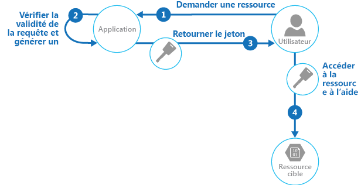

# <a name="valet-key-pattern"></a>Modèle de clé de valet

[!INCLUDE [header](../_includes/header.md)]

Utilisez un jeton qui fournit aux clients un accès direct limité à une ressource spécifique, afin de décharger le transfert de données depuis l’application. Cela est particulièrement utile dans les applications qui utilisent des files d’attente ou des systèmes de stockage hébergés sur le cloud, et permet de réduire les coûts et d’optimiser l’extensibilité et les performances.

## <a name="context-and-problem"></a>Contexte et problème

Les navigateurs web et les programmes clients ont souvent besoin de fichiers de lecture et d’écriture ou de flux de données en provenance ou à destination du stockage d’une application. En règle générale, l’application traitera le déplacement des données &mdash; soit en les extrayant du stockage et en les transmettant au client, soit en lisant le flux chargé depuis le client et en le stockant dans le magasin de données. Toutefois, cette approche consomme des ressources précieuses comme des ressources de calcul, de la mémoire et de la bande passante.

Les magasins de données ont la possibilité de gérer directement le chargement et le téléchargement des données sans que l’application ait besoin d’effectuer de traitement particulier pour déplacer ces données. Toutefois, cela requiert généralement que le client ait accès aux informations d’identification de sécurité du magasin. Cette technique peut être utile pour réduire les coûts inhérents au transfert de données et la nécessité d’augmenter la taille des instances de l’application, ainsi que pour accroître les performances. Cela signifie néanmoins que l’application n’est plus en mesure de gérer la sécurité des données. Une fois que le client dispose d’une connexion au magasin de données pour l’accès direct, l’application ne peut pas agir en tant qu’opérateur de contrôle. Elle ne contrôle plus le processus et ne peut pas empêcher les chargements et téléchargements suivants depuis le magasin de données.

Cette approche n’est pas réaliste dans des systèmes distribués devant traiter des clients non approuvés. Au lieu de cela, les applications doivent être en mesure de contrôler en toute sécurité l’accès aux données de façon précise tout en réduisant la charge sur le serveur en configurant cette connexion, puis en autorisant le client à communiquer directement avec le magasin de données pour effectuer les opérations de lecture ou d’écriture requises.

## <a name="solution"></a>Solution

Vous devez résoudre le problème de contrôle d’accès à un magasin de données quand le magasin ne peut pas gérer l’authentification et l’autorisation des clients. Une solution classique consiste à limiter l’accès à la connexion publique du magasin de données et à fournir au client une clé ou un jeton que le magasin de données peut valider.

Cette clé ou ce jeton est généralement appelé clé de valet. Il fournit un accès limité dans le temps à des ressources spécifiques et autorise uniquement des opérations prédéfinies telles que la lecture et l’écriture dans le stockage ou les files d’attente, ou le chargement et le téléchargement dans un navigateur web. Les applications peuvent rapidement et facilement créer et émettre des clés de valet pour les appareils clients et les navigateurs web, ce qui permet aux clients d’effectuer les opérations requises sans que l’application ait besoin de traiter directement le transfert de données. Cela supprime la surcharge de traitement, ainsi que l’impact sur les performances et l’extensibilité, de l’application et du serveur.

Le client utilise ce jeton pour accéder à une ressource spécifique du magasin de données pour une période particulière uniquement et avec certaines restrictions sur les autorisations d’accès, comme indiqué dans la figure. Après la période spécifiée, la clé n’est plus valide et ne permettra pas d’accéder à la ressource.



Vous avez également la possibilité de configurer une clé possédant d’autres dépendances, comme l’étendue des données. Par exemple, selon les fonctionnalités du magasin de données, la clé peut spécifier une table complète dans un magasin de données ou uniquement des lignes spécifiques d’une table. Dans les systèmes de stockage cloud, la clé peut spécifier un conteneur, ou simplement un élément particulier d’un conteneur.

La clé peut également être rendue. non valide par l’application. Cette approche se révèle utile si le client informe le serveur de la fin de l’opération de transfert de données. Le serveur peut alors rendre cette clé non valide pour empêcher que d’autres opérations soient effectuées.

L’utilisation de ce modèle peut simplifier la gestion de l’accès aux ressources, car vous n’avez plus de besoin de créer et d’authentifier un utilisateur, d’accorder des autorisations, puis de supprimer à nouveau l’utilisateur. Cela permet également de limiter l’emplacement, l’autorisation et la période de validité&mdash;le tout en générant simplement une clé lors de l’exécution. Les facteurs importants consistent à limiter autant que possible la période de validité, et particulièrement l’emplacement de la ressource, pour que le destinataire puisse uniquement utiliser la clé pour le but prévu.

## <a name="issues-and-considerations"></a>Problèmes et considérations

Prenez en compte les points suivants lorsque vous choisissez comment implémenter ce modèle :

**Gestion de l’état et de la période de validité de la clé**. En cas de divulgation ou de compromission, la clé déverrouille l’élément cible et celui-ci peut faire l’objet d’utilisations malveillantes pendant la période de validité. Une clé peut généralement être révoquée ou désactivée, selon la façon dont elle a été émise. Les stratégies côté serveur peuvent être modifiées, ou la clé du serveur avec laquelle la connexion a été effectuée peut être rendue non valide. Spécifiez une période de validité courte pour réduire le risque que des opérations non autorisées se produisent sur le magasin de données. Toutefois, si la période de validité est trop courte, le client peut ne pas être en mesure de terminer l’opération avant l’expiration de la clé. Permettez aux utilisateurs autorisés de renouveler la clé avant l’expiration de la période de validité si plusieurs accès à la ressource protégée sont requis.

**Contrôle du niveau d’accès fourni par la clé**. En règle générale, la clé doit autoriser l’utilisateur à effectuer uniquement les actions nécessaires pour terminer l’opération, telles que l’accès en lecture seule si le client ne doit pas être en mesure de charger des données dans le magasin de données. Pour les chargements de fichiers, il est courant de spécifier une clé qui fournit une autorisation en écriture seule, ainsi que l’emplacement et la période de validité. Il est essentiel de spécifier précisément la ressource ou l’ensemble de ressources auxquels s’applique la clé.

**Détermination de la façon de contrôler le comportement des utilisateurs**. Implémenter ce modèle signifie que vous perdrez un certain degré de contrôle sur les ressources auxquelles les utilisateurs ont le droit d’accéder. Le niveau de contrôle pouvant être exercé est limité par les capacités des stratégies et des autorisations disponibles pour le service ou le magasin de données cible. Par exemple, il est généralement impossible de créer une clé qui limite la taille des données à écrire dans le stockage ou le nombre de fois où la clé peut être utilisée pour accéder à un fichier. Cela peut entraîner des coûts imprévus considérables pour le transfert de données, même en cas d’utilisation par le client prévu et peut être dû à une erreur dans le code qui provoque un chargement ou un téléchargement répétés. Pour limiter le nombre de fois où un fichier peut être chargé, lorsque cela est possible, forcez le client à informer l’application lorsqu’une opération est terminée. Par exemple, certains magasins de données déclenchent des événements que le code d’application peut utiliser pour surveiller les opérations et contrôler le comportement de l’utilisateur. Toutefois, il est difficile d’appliquer des quotas pour les utilisateurs individuels dans un scénario multi-locataire dans lequel la même clé est utilisée par tous les utilisateurs d’un seul locataire.

**Validation (et assainissement éventuel) de toutes les données chargées**. Un utilisateur malveillant qui accède à la clé peut charger des données conçues pour compromettre le système. Des utilisateurs autorisés peuvent également charger des données non valides qui, une fois traitées, peuvent entraîner une erreur ou une panne dans le système. Pour vous protéger contre cela, assurez-vous que toutes les données chargées sont validées et qu’elles ne contiennent pas de contenus malveillants avant des utiliser.

**Audit de toutes les opérations**. De nombreux mécanismes basés sur une clé peuvent journaliser des opérations comme des chargements, des téléchargements et des échecs. Ces journaux peuvent généralement être intégrés à un processus d’audit et utilisés pour la facturation si l’utilisateur est facturé en fonction du volume de données ou de la taille de fichiers. Utilisez les journaux pour détecter des échecs d’authentification qui peuvent être dus à des problèmes avec le fournisseur de clés ou une suppression accidentelle d’une stratégie d’accès stockée.

**Distribution sécurisée de la clé**. Elle peut être incorporée dans une URL que l’utilisateur active sur une page web, ou elle peut être utilisée dans une opération de redirection du serveur afin que le téléchargement se produise automatiquement. Utilisez toujours le protocole HTTPS pour distribuer la clé sur un canal sécurisé.

**Protection des données sensibles en transit**. Les données sensibles distribuées via l’application le seront généralement à l’aide des protocoles SSL ou TLS, et cela doit être appliqué pour les clients qui accèdent directement au magasin de données.

Les autres problèmes à connaître lors de l’implémentation de ce modèle sont :

- Si le client n’informe pas, ou ne peut pas informer, le serveur de la fin de l’opération et que la seule limite est la période d’expiration de la clé, l’application ne sera pas en mesure d’effectuer des opérations d’audit comme compter le nombre de chargements ou téléchargements ou empêcher plusieurs chargements ou téléchargements.

- La flexibilité des stratégies de clé pouvant être générées peut se trouver limitée. Par exemple, certains mécanismes autorisent uniquement l’utilisation d’une période d’expiration horodatée. D’autres ne sont pas en mesure de spécifier une granularité suffisante pour les autorisations de lecture/d’écriture.

- Si l’heure de début de la période de validité du jeton ou de la clé est spécifiée, vérifiez qu’elle est légèrement antérieure à l’heure actuelle du serveur pour que les clients dont les horloges sont légèrement en dehors de la synchronisation puissent quand même utiliser le jeton ou la clé. La valeur par défaut, si elle n’est pas spécifiée, est généralement l’heure actuelle du serveur.

- L’URL qui contient la clé sera enregistrée dans les fichiers journaux du serveur. Alors que la clé aura généralement expiré avant que les fichiers journaux soient utilisés pour l’analyse, assurez-vous de limiter l’accès à ces derniers. Si les données du journal sont transmises à un système de surveillance ou stockées dans un autre emplacement, envisagez d’implémenter un délai pour éviter toute divulgation de clés après l’expiration de la période de validité.

- Si le code du client s’exécute dans un navigateur web, le navigateur peut devoir prendre en charge le partage des ressources cross-origin (CORS) pour permettre au code qui s’exécute dans le navigateur web d’accéder aux données dans un domaine différent de celui qui a traité la page. Certains navigateurs plus anciens et magasins de données ne prennent pas en charge le CORS, et le code qui s’exécute dans ces navigateurs peut être en mesure d’utiliser une clé de valet pour fournir un accès aux données dans un domaine différent, tel qu’un compte de stockage cloud.

## <a name="when-to-use-this-pattern"></a>Quand utiliser ce modèle

Ce modèle est utile dans les situations suivantes :

- Pour réduire le chargement des ressources et optimiser les performances et l’extensibilité. L’utilisation d’une clé de valet ne nécessite pas que la ressource soit verrouillée, que d’appel soit passé au serveur distant, n’implique pas de limite en termes de nombre de clés de valet pouvant être émises, et permet d’éviter qu’un point de défaillance unique résultant de l’exécution du transfert de données via le code d’application. La création d’une clé de valet est généralement une simple opération de chiffrement de signature d’une chaîne avec une clé.

- Pour réduire les coûts d’exploitation. Activer l’accès direct aux magasins et files d’attente permet d’économiser de l’argent et des ressources, peut réduire les allers-retours réseau et permettre de diminuer le nombre de ressources de calcul nécessaires.

- Lorsque des clients chargent ou téléchargent régulièrement des données, notamment en cas de volume important ou quand chaque opération implique de gros fichiers.

- Lorsque l’application a des ressources de calcul disponibles limitées, en raison de limitations d’hébergement ou de considérations en termes de coûts. Dans ce scénario, le modèle est encore plus utile s’il existe plusieurs chargements ou téléchargements de données simultanés, car il libère l’application de la gestion du transfert de données.

- Lorsque les données sont stockées dans un magasin de données distant ou dans un autre centre de données. Si vous avez demandé à l’application d’agir en tant qu’opérateur de contrôle, des coûts peuvent s’appliquer pour la bande passante supplémentaire liée au transfert de données entre les centres de données, ou sur des réseaux publics ou privés entre le client et l’application, puis entre l’application et le magasin de données.

Ce modèle peut s’avérer inutile dans les situations suivantes :

- Si l’application doit effectuer certaines tâches sur les données avant leur stockage ou leur envoi au client. Par exemple, si l’application doit effectuer des opérations de validation, d’accès au journal ou d’exécution d’une transformation sur les données. Toutefois, certains magasins de données et clients sont en mesure de négocier et d’effectuer des transformations simples telles que la compression et la décompression (par exemple, un navigateur web peut généralement traiter les formats GZip).

- Si la conception d’une application existante complique l’incorporation du modèle. L’utilisation de ce modèle nécessite généralement une approche architecturale distincte pour transmettre et recevoir des données.

- S’il est nécessaire de conserver les journaux d’audit ou de contrôler le nombre de fois où une opération de transfert de données est exécutée, et si le mécanisme de clé de valet utilisé ne prend pas en charge les notifications que le serveur peut utiliser pour gérer ces opérations.

- S’il est nécessaire de limiter la taille des données, en particulier au cours des opérations de chargement. La seule solution à ce problème consiste à ce que l’application vérifie la taille des données une fois l’opération terminée, ou qu’elle vérifie la taille des chargements après une période spécifiée ou selon une planification.

## <a name="example"></a>Exemple

Azure prend en charge des signatures d’accès partagé sur le stockage Azure pour le contrôle d’accès granulaire aux données dans les objets blob, tables et files d’attente et pour les rubriques et files d’attente Service Bus. Un jeton de signature d’accès partagé peut être configuré pour fournir des droits d’accès spécifiques telles que la lecture, l’écriture, la mise à jour et la suppression d’une table spécifique ; un groupe de clés dans une table ; une file d’attente ; un objet blob ; ou un conteneur d’objets blob. La validité peut être une période spécifiée ou n’avoir aucune limite de temps.

Les signatures d’accès partagé Azure prennent également en charge les stratégies d’accès stockées sur serveur qui peuvent être associées à une ressource spécifique comme une table ou un objet blob. Cette fonctionnalité offre davantage de contrôle et de flexibilité par rapport aux jetons de signature d’accès partagé générés par l’application et doit être utilisée chaque fois que cela est possible. Les paramètres définis dans une stratégie stockée sur serveur peuvent être modifiés et sont reflétés dans le jeton sans qu’un nouveau jeton doive être émis, mais les paramètres définis dans le jeton ne peuvent pas être modifiés sans émettre un nouveau jeton. Cette approche permet également de révoquer un jeton de signature d’accès partagé valide avant son expiration.

> Pour plus d’informations, consultez [Introducing Table SAS (Shared Access Signature), Queue SAS and update to Blob SAS](https://blogs.msdn.microsoft.com/windowsazurestorage/2012/06/12/introducing-table-sas-shared-access-signature-queue-sas-and-update-to-blob-sas/) (Présentation de la SAP (signature d’accès partagé) de table, de la SAP de file d’attente et de la mise à jour vers la SAP d’objet blob) et [Utilisation des signatures d’accès partagé (SAP)](https://azure.microsoft.com/documentation/articles/storage-dotnet-shared-access-signature-part-1/) sur MSDN.

Le code suivant montre comment créer un jeton de signature d’accès partagé valide pendant cinq minutes. La méthode `GetSharedAccessReferenceForUpload` renvoie un jeton de signatures d’accès partagé qui peut être utilisé pour charger un fichier dans le stockage Blob Azure.

```csharp
public class ValuesController : ApiController
{
  private readonly CloudStorageAccount account;
  private readonly string blobContainer;
  ...
  /// <summary>
  /// Return a limited access key that allows the caller to upload a file
  /// to this specific destination for a defined period of time.
  /// </summary>
  private StorageEntitySas GetSharedAccessReferenceForUpload(string blobName)
  {
    var blobClient = this.account.CreateCloudBlobClient();
    var container = blobClient.GetContainerReference(this.blobContainer);

    var blob = container.GetBlockBlobReference(blobName);

    var policy = new SharedAccessBlobPolicy
    {
      Permissions = SharedAccessBlobPermissions.Write,

      // Specify a start time five minutes earlier to allow for client clock skew.
      SharedAccessStartTime = DateTime.UtcNow.AddMinutes(-5),

      // Specify a validity period of five minutes starting from now.
      SharedAccessExpiryTime = DateTime.UtcNow.AddMinutes(5)
    };

    // Create the signature.
    var sas = blob.GetSharedAccessSignature(policy);

    return new StorageEntitySas
    {
      BlobUri = blob.Uri,
      Credentials = sas,
      Name = blobName
    };
  }

  public struct StorageEntitySas
  {
    public string Credentials;
    public Uri BlobUri;
    public string Name;
  }
}
```

> L’exemple complet est disponible dans la solution ValetKey disponible au téléchargement sur [GitHub](https://github.com/mspnp/cloud-design-patterns/tree/master/valet-key). Le projet ValetKey.Web de cette solution contient une application web qui inclut la classe `ValuesController` présentée ci-dessus. Un exemple d’application cliente qui utilise cette application web pour récupérer une clé de signatures d’accès partagé et charger un fichier dans le stockage d’objets blob est disponible dans le projet ValetKey.Client.

## <a name="next-steps"></a>Étapes suivantes

Les modèles et les conseils suivants peuvent aussi présenter un intérêt quand il s’agit d’implémenter ce modèle :
- Un exemple illustrant ce modèle est disponible sur [GitHub](https://github.com/mspnp/cloud-design-patterns/tree/master/valet-key).
- [Modèle d’opérateur de contrôle](gatekeeper.md). Ce modèle peut être utilisé avec le modèle de clé de valet pour protéger les applications et services à l’aide d’une instance d’hôte dédiée qui agit comme un répartiteur entre les clients et l’application ou le service. L’opérateur de contrôle valide et assainit les requêtes, et transmet les requêtes et les données entre le client et l’application. Il peut fournir une couche supplémentaire de sécurité et réduire la surface d’attaque du système.
- [Modèle d’hébergement de contenu statique](static-content-hosting.md). Décrit comment déployer des ressources statiques dans un service de stockage cloud qui peut fournir ces ressources directement au client afin de réduire le besoin d’instances de calcul coûteuses. Lorsque les ressources ne sont pas destinées à être publiquement disponibles, le modèle de clé de valet peut être utilisé afin de les sécuriser.
- [Introducing Table SAS (Shared Access Signature), Queue SAS and update to Blob SAS](https://blogs.msdn.microsoft.com/windowsazurestorage/2012/06/12/introducing-table-sas-shared-access-signature-queue-sas-and-update-to-blob-sas/) (Présentation de la SAP (signature d’accès partagé) de table, de la SAP de file d’attente et de la mise à jour vers la SAP d’objet blob)
- [Utilisation des signatures d’accès partagé (SAP)](https://azure.microsoft.com/documentation/articles/storage-dotnet-shared-access-signature-part-1/)
- [Authentification par signature d’accès partagé avec Service Bus](https://azure.microsoft.com/documentation/articles/service-bus-shared-access-signature-authentication/)
