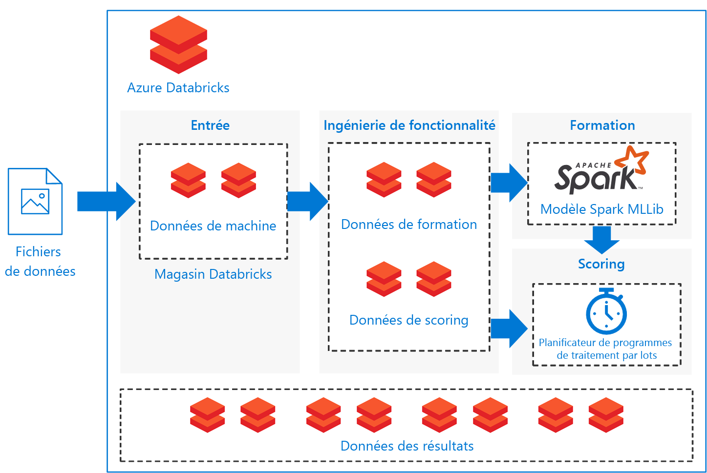

# Scoring par lots de modèles Spark sur Azure Databricks

Cette architecture de référence montre comment construire une solution évolutive pour le scoring par lots d’un modèle de classification Apache Spark basé sur une planification à l’aide d’Azure Databricks, une plateforme d’analyse basée sur Apache Spark optimisée pour Azure. La solution peut servir de modèle généralisé à d’autres scénarios.

Une implémentation de référence pour cette architecture est disponible sur [GitHub][github].

**Scénario** : Une entreprise de l’industrie lourde veut minimiser les coûts et les temps d’arrêt associés à des défaillances mécaniques imprévues. En utilisant les données IoT collectées sur les machines, elle peut créer un modèle de maintenance prédictive. Ce modèle permet à l’entreprise de gérer les composants de manière proactive et de les réparer avant qu’ils ne tombent en panne. En maximisant l’utilisation des composants mécaniques, elle peut contrôler les coûts et réduire les temps d’arrêt.

Un modèle de maintenance prédictive recueille les données des machines et conserve les exemples historiques de défaillances des composants. Le modèle peut ensuite être utilisé pour superviser l’état actuel des composants et prédire si un composant donné connaîtra une défaillance prochainement. Pour les cas d’usage courants et les approches de modélisation, voir le [Guide Azure AI pour les solutions de maintenance prédictive][ai-guide].

Cette architecture de référence a été conçue pour les charges de travail qui sont déclenchées par la présence de nouvelles données recueillies auprès des machines. Le traitement est constitué des étapes suivantes :

1. Ingérer les données de la base de données externe dans un magasin de données Azure Databricks.

2. Former un modèle Machine Learning en transformant les données en un ensemble de données d’apprentissage, puis en construisant un modèle MLlib Spark. MLlib se compose des algorithmes Machine Learning les plus courants et des utilitaires optimisés pour tirer parti des capacités d’évolutivité des données Spark.

3. Appliquer le modèle formé pour prédire (classer) les défaillances des composants en transformant les données en un ensemble de données de scoring. Noter les données avec le modèle Spark MLLib.

4. Stocker les résultats dans la base de données Databricks en vue de leur exploitation post-traitement.

Des notebooks sont fournis sur [GitHub][github] pour effectuer chacune de ces tâches.

## Architecture

L’architecture définit un flux de données qui est entièrement contenu dans [Azure Databricks][databricks] basé sur un ensemble de [notebooks ][notebooks] exécutés de manière séquentielle. Elle se compose des éléments suivants :

**[Fichiers de données][github]**. L’implémentation de référence utilise un jeu de données simulées contenues dans cinq fichiers de données statiques.

**[Ingestion][notebooks]**. Le notebook d’ingestion de données télécharge les fichiers de données d’entrée dans une collection de jeux de données Databricks. Dans un cas réel, les données des appareils IoT seraient diffusées en continu sur un stockage accessible par Databricks, comme Azure SQL Server ou Azure Blob. Databricks supporte plusieurs [sources de données][data-sources].

**Pipeline de formation**. Ce notebook exécute le notebook technique de fonctionnalités pour créer un jeu de données d’analyse à partir des données ingérées. Il exécute ensuite un notebook de construction de modèle qui forme le modèle de Machine Learning à l’aide de la bibliothèque de Machine Learning évolutive [Apache Spark MLlib][mllib].

**Pipeline de scoring**. Ce notebook exécute le notebook technique de fonctionnalités pour créer un jeu de données de scoring, puis exécute le notebook de scoring. Le notebook s’appuie sur le modèle [Spark MLlib][mllib-spark] formé pour produire des prédictions pour les observations dans le jeu de données de scoring. Les prédictions sont stockées dans le magasin de données des résultats, nouveau jeu de données du magasin de données Databricks.

**Planificateur**. Un [travail][job] Databricks planifié gère le scoring par lots avec le modèle Spark. Le travail exécute le notebook du pipeline de scoring en transmettant des arguments variables par le biais des paramètres du notebook, ce qui spécifie les détails de construction du jeu de données de scoring et l’emplacement de stockage du jeu de données de résultats.

Le scénario est construit comme un flux de pipeline. Chaque notebook est optimisé pour fonctionner en mode par lots pour chacune des opérations : ingestion, ingénierie des fonctionnalités, construction de modèles et scorings de modèles. Pour ce faire, le notebook d’ingénierie des fonctionnalités est conçu pour générer un jeu de données général pour toutes les opérations de formation, d’étalonnage, de test ou de scoring. Dans ce scénario, nous utilisons une stratégie de fractionnement temporel pour ces opérations de sorte que les paramètres du notebook sont utilisés pour définir le filtrage de la plage de dates.

Du fait que le scénario crée un pipeline par lots, nous fournissons un ensemble de notebooks d’examen en option pour explorer la sotie des notebooks de pipeline. Ils sont disponibles dans le dépôt GitHub :

- `1a_raw-data_exploring`
- `2a_feature_exploration`
- `2b_model_testing`
- `3b_model_scoring_evaluation`

## Recommandations

Databricks est configuré pour que vous puissiez charger et déployer vos modèles formés afin de faire des prédictions avec de nouvelles données. Nous avons utilisé Databricks pour ce scénario parce qu’il offre ces avantages supplémentaires :

- Prise en charge de l’authentification unique à l’aide des informations d’identification Azure Active Directory.
- Planificateur de tâches permettant l’exécution des travaux pour les pipelines de production.
- Notebook entièrement interactif avec collaboration, tableaux de bord, API REST.
- Clusters illimités pouvant s’adapter à n’importe quelle taille.
- Sécurité avancée, contrôles d’accès en fonction du rôles et journaux d’audit.

Pour interagir avec le service Azure Databricks, utilisez l’interface Databricks [Workspace][workspace] dans un navigateur web ou l’[interface de ligne de commande][cli] (CLI). Accédez à l’interface de ligne de commande Databricks depuis n’importe quelle plate-forme prenant en charge Python 2.7.9 à 3.6.

L’implémentation de référence utilise des [notebooks][notebooks] pour exécuter les tâches séquentiellement. Chaque notebook stocke les artefacts de données intermédiaires (formation, test, scoring ou jeux de données de résultats) dans la même base de données que les données d’entrée. L’objectif est de vous permettre de l’utiliser facilement en fonction de votre cas d’usage particulier. En pratique, vous connecteriez votre source de données à votre instance Azure Databricks pour que les notebooks puissent lire et écrire directement dans votre stockage.

Vous pouvez superviser l’exécution du travail via l’interface utilisateur de Databricks, le magasin de données ou l’[interface de ligne de commande][cli] Databricks, si nécessaire. Supervisez le cluster à l’aide du [journal des événements][log] et des autres [métriques][metrics] que Databricks fournit.

## Considérations relatives aux performances

Un cluster Azure Databricks permet la mise à l’échelle automatique par défaut de sorte que, pendant l’exécution, Databricks réaffecte dynamiquement les Workers pour tenir compte des caractéristiques de votre travail. Certains éléments de votre pipeline peuvent être plus exigeants que d’autres sur le plan informatique. Databricks ajoute des Workers supplémentaires pendant ces phases de votre travail (et les supprime lorsqu’ils ne sont plus nécessaires). La mise à l’échelle automatique facilite l’optimisation de l’[utilisation ducluster][cluster], car vous n’avez pas besoin de dimensionner le cluster en fonction d’une charge de travail.

De plus, il est possible de développer des pipelines planifiés plus complexes en utilisant [Azure Data Factory][adf] avec Azure Databricks.

## Considérations relatives au stockage

Dans cette implémentation de référence, les données sont stockées directement dans le stockage Databricks pour plus de simplicité. Dans un environnement de production, cependant, les données peuvent être stockées dans un stockage de données cloud tel que [Stockage Blob Azure][blob]. [Databricks][databricks-connect] prend également en charge Azure Data Lake Store, Azure SQL Data Warehouse, Azure Cosmos DB, Apache Kafka et Hadoop.

## Considérations relatives au coût

Azure Databricks est une offre Spark premium avec un coût associé. En outre, il existe des [niveaux de tarification][pricing] standard et premium pour Databricks.

Pour ce scénario, le niveau de tarification standard est suffisant. Cependant, si votre application spécifique nécessite la mise à l’échelle automatique des clusters pour traiter des charges de travail plus importantes ou des tableaux de bord interactifs de Databricks, le niveau premium pourrait augmenter encore les coûts.

Les notebooks de la solution peuvent fonctionner sur n’importe quelle plateforme Spark avec un minimum de modifications pour supprimer les packages spécifiques à Databricks. Envisagez d’utiliser les solutions similaires suivantes pour les différentes plateformes Azure :

- [Python sur Azure Machine Learning Studio][python-aml]
- [Services SQL Server R][sql-r]
- [PySpark sur une machine virtuelle Azure Data Science Virtual Machine][py-dvsm]

## Déployer la solution

Pour déployer cette architecture de référence, suivez les étapes décrites dans le dépôt  [GitHub][github] afin de construire une solution évolutive de scoring de modèles Spark par lots sur Azure Databricks.

## Architectures connexes

Nous avons également élaboré une architecture de référence qui utilise Spark pour construire des [systèmes de recommandation en temps réel][recommendation] avec des scores pré-calculés et hors ligne. Ces systèmes de recommandation font partie de scénarios courants dans lesquels les scores traités par lots.

[adf]: https://azure.microsoft.com/blog/operationalize-azure-databricks-notebooks-using-data-factory/
[ai-guide]: /azure/machine-learning/team-data-science-process/cortana-analytics-playbook-predictive-maintenance
[blob]: https://docs.databricks.com/spark/latest/data-sources/azure/azure-storage.html
[cli]: https://docs.databricks.com/user-guide/dev-tools/databricks-cli.html
[cluster]: https://docs.azuredatabricks.net/user-guide/clusters/sizing.html
[databricks]: /azure/azure-databricks/
[databricks-connect]: /azure/azure-databricks/databricks-connect-to-data-sources
[data-sources]: https://docs.databricks.com/spark/latest/data-sources/index.html
[github]: https://github.com/Azure/BatchSparkScoringPredictiveMaintenance
[job]: https://docs.databricks.com/user-guide/jobs.html
[log]: https://docs.databricks.com/user-guide/clusters/event-log.html
[metrics]: https://docs.databricks.com/user-guide/clusters/metrics.html
[mllib]: https://docs.databricks.com/spark/latest/mllib/index.html
[mllib-spark]: https://docs.databricks.com/spark/latest/mllib/index.html#apache-spark-mllib
[notebooks]: https://docs.databricks.com/user-guide/notebooks/index.html
[pricing]: https://azure.microsoft.com/en-us/pricing/details/databricks/
[python-aml]: https://gallery.azure.ai/Notebook/Predictive-Maintenance-Modelling-Guide-Python-Notebook-1
[py-dvsm]: https://gallery.azure.ai/Tutorial/Predictive-Maintenance-using-PySpark
[recommendation]: /azure/architecture/reference-architectures/ai/real-time-recommendation
[sql-r]: https://gallery.azure.ai/Tutorial/Predictive-Maintenance-Modeling-Guide-using-SQL-R-Services-1
[workspace]: https://docs.databricks.com/user-guide/workspace.html
