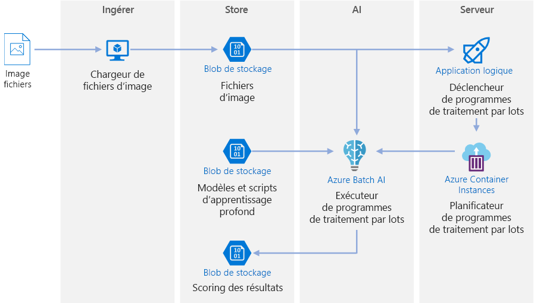
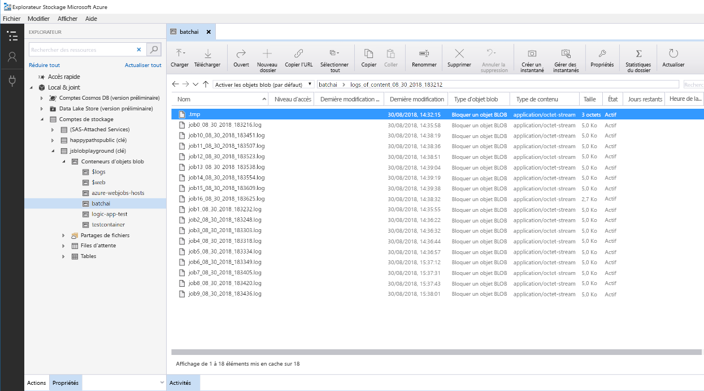

# Scoring par lots dans Azure pour les modèles d’apprentissage profond

Cette architecture de référence montre comment appliquer un transfert de style neuronal à une vidéo à l’aide d’Azure Batch AI. Le *transfert de style* est une technique d’apprentissage profond (« deep learning ») qui compose une image existante dans le style d’une autre image. Cette architecture peut être généralisée à un scénario qui utilise le scoring par lots avec l’apprentissage profond. [**Déployez cette solution**](#deploy-the-solution).

**Scénario** : une société de multimédia souhaite changer le style d’une vidéo pour qu’elle ressemble à une peinture spécifique. L’objectif est d’appliquer ce style à toutes les images de la vidéo en temps voulu et de façon automatisée. Pour plus d’informations sur les algorithmes de transfert de style neuronal, consultez le document [Image Style Transfer Using Convolutional Neural Networks][image-style-transfer] (PDF).

| Image du style : | Vidéo d’entrée/contenu : | Vidéo de sortie : |
|--------|--------|---------|
|  |  *cliquer pour voir la vidéo* |  *cliquer pour voir la vidéo* |

Cette architecture de référence a été conçue pour les charges de travail qui sont déclenchées par la présence de nouveaux médias dans le stockage Azure. Le traitement est constitué des étapes suivantes :

1. Chargez une image de style sélectionnée (comme une peinture de Van Gogh) et un script de transfert de style dans Stockage Blob.
1. Créez un cluster Batch AI avec mise à l’échelle automatique, prêt à commencer à accepter des tâches.
1. Divisez le fichier vidéo en images individuelles et chargez ces images dans Stockage Blob.
1. Une fois que toutes les images ont été chargées, chargez un fichier déclencheur dans Stockage Blob.
1. Ce fichier déclenche une application logique qui crée un conteneur s’exécutant dans Azure Container Instances.
1. Le conteneur exécute un script qui crée des tâches Batch AI. Chaque tâche applique le transfert de style neuronal en parallèle dans tous les nœuds du cluster Batch AI.
1. Une fois générées, les images sont enregistrées dans Stockage Blob.
1. Téléchargez les images générées, puis réincorporez-les dans une vidéo.

## Architecture

Cette architecture est constituée des composants suivants.

### Calcul

**[Azure Batch AI][batch-ai]** sert à exécuter l’algorithme de transfert de style neuronal. Batch AI prend en charge les charges de travail d’apprentissage profond en fournissant des environnements conteneurisés qui sont préconfigurés pour les infrastructures d’apprentissage profond, sur des machines virtuelles compatibles avec les GPU. Batch AI peut aussi connecter le cluster de calcul à Stockage Blob.

### Stockage

**[Stockage Blob][blob-storage]** sert à stocker toutes les images (images d’entrée, images de style et images de sortie), ainsi que tous les journaux générés à partir de Batch AI. Stockage Blob s’intègre à Batch AI via [blobfuse][blobfuse], système de fichiers virtuel open source reposant sur Stockage Blob. Stockage Blob se montre aussi très économique par rapport aux performances qu’exige cette charge de travail.

### Déclenchement/planification

**[Azure Logic Apps][logic-apps]** sert à déclencher le workflow. Quand l’application logique détecte qu’un objet blob a été ajouté au conteneur, elle déclenche le processus Batch AI. Logic Apps est parfaitement adapté à cette architecture de référence, car il permet de détecter facilement les modifications apportées à Stockage Blob et propose un processus simple pour modifier le déclencheur.

**[Azure Container Instances][container-instances]** sert à exécuter les scripts Python qui créent les tâches Batch AI. L’exécution de ces scripts à l’intérieur d’un conteneur Docker est un moyen pratique de les exécuter à la demande. Pour cette architecture, nous utilisons Container Instances, car il existe un connecteur d’application logique prédéfini qui permet à l’application logique de déclencher la tâche Batch AI. Container Instances peut faire tourner rapidement les processus sans état.

**[DockerHub][dockerhub]** sert à stocker l’image Docker utilisée par Container Instances pour exécuter le processus de création de tâche. DockerHub a été choisi pour cette architecture, car il est simple d’utilisation et constitue le référentiel d’images par défaut des utilisateurs de Docker. [Azure Container Registry][container-registry] peut aussi être utilisé.

### Préparation des données

Cette architecture de référence utilise la séquence vidéo d’un orang-outan dans un arbre. Vous pouvez télécharger la séquence [ici][source-video] et la traiter pour le workflow en suivant ces étapes :

1. Utilisez [AzCopy][azcopy] pour télécharger la vidéo à partir de l’objet blob public.
2. Utilisez [FFmpeg][ffmpeg] pour extraire le fichier audio en vue de le réincorporer par la suite dans la vidéo de sortie.
3. Utilisez FFmpeg pour découper la vidéo en images individuelles. Les images seront traitées indépendamment, en parallèle.
4. Utilisez AzCopy pour copier les images individuelles dans votre conteneur d’objets blob.

À ce stade, la séquence vidéo se trouve dans un format utilisable pour le transfert de style neuronal.

## Considérations relatives aux performances

### GPU et UC

Pour les charges de travail d’apprentissage profond, les GPU (processeurs graphiques) sont généralement beaucoup plus performants que les UC (unités centrales), dans la mesure où il faut un cluster d’UC important pour obtenir des performances comparables. Bien qu’il soit possible d’utiliser uniquement des UC dans cette architecture, les GPU offrent un bien meilleur rapport coût/performances. Nous vous recommandons d’utiliser les dernières machines virtuelles optimisées pour les GPU [série NCv3] vm-sizes-gpu.

Les GPU ne sont pas compatibles par défaut dans toutes les régions. Veillez à sélectionner une région compatible avec les GPU. Par ailleurs, les abonnements ont un quota par défaut de zéro cœur pour les machines virtuelles optimisées pour les GPU. Vous pouvez augmenter ce quota en formulant une demande de support. Vérifiez que votre abonnement dispose d’un quota suffisant pour exécuter votre charge de travail.

### Parallélisation dans les machines virtuelles et les cœurs

Quand vous exécutez un processus de transfert de style en tant que traitement par lots, les tâches qui s’exécutent principalement sur les GPU doivent être parallélisées dans toutes les machines virtuelles. Deux approches sont possibles : vous pouvez soit créer un cluster plus grand contenant des machines virtuelles avec un seul GPU, soit créer un cluster plus petit contenant des machines virtuelles avec un grand nombre de GPU.

Pour cette charge de travail, ces deux options offrent des performances comparables. Le fait d’utiliser moins de machines virtuelles avec plus de GPU par machine virtuelle peut contribuer à réduire le déplacement de données. Cependant, le volume de données par tâche pour cette charge de travail n’étant pas très important, la limitation imposée par Stockage Blob n’est pas significative.

### Taille de lot d’images par tâche Batch AI

Un autre paramètre qui doit être configuré est le nombre d’images à traiter par tâche Batch AI. D’un côté, vous voulez faire en sorte que la tâche soit plus ou moins bien répartie entre les nœuds et qu’en cas d’échec d’une tâche, vous n’ayez pas besoin de réessayer avec un trop grand nombre d’images. Cela laisse entrevoir un nombre important de tâches Batch AI et donc peu d’images à traiter par tâche. D’un autre côté, si trop peu d’images sont traitées par tâche, le temps de configuration/démarrage devient exagérément long. Vous pouvez définir un nombre de tâches égal au nombre maximal de nœuds présents dans le cluster. Il s’agit de la solution la plus performante à condition qu’aucune tâche n’échoue, car le coût de configuration/démarrage est limité. En revanche, si une tâche échoue, beaucoup d’images risquent de devoir être retraitées.

### Serveurs de fichiers

Quand vous utilisez Batch AI, vous pouvez choisir plusieurs options de stockage, selon le débit nécessaire à votre scénario. Pour les charges de travail qui demandent peu de débit, l’utilisation de Stockage Blob (via blobfuse) doit suffire. Sinon, Batch AI prend aussi en charge un serveur de fichiers Batch AI, un système NFS à un seul nœud géré, qui peut être monté automatiquement sur les nœuds du cluster pour fournir un emplacement de stockage accessible de façon centralisée pour les tâches. Dans la plupart des cas, un seul serveur de fichiers s’avère nécessaire dans un espace de travail, et vous pouvez répartir les données de vos travaux d’entraînement dans différents répertoires. Si un système NFS à un seul nœud ne convient pas pour vos charges de travail, Batch AI prend en charge d’autres options de stockage, dont Azure Files ou les solutions personnalisées que sont le système de fichiers Gluster ou Lustre.

## Considérations relatives à la sécurité

### Limitation de l’accès à Stockage Blob Azure

Dans cette architecture de référence, Stockage Blob Azure est le composant de stockage principal qui doit être protégé. Le déploiement de référence présenté dans le dépôt GitHub utilise des clés de compte de stockage pour accéder à Stockage Blob. Pour une protection et un contrôle accrus, envisagez d’utiliser une signature d’accès partagé (SAP). Elle octroie un accès limité aux objets contenus dans le stockage, sans qu’il soit nécessaire de coder en dur les clés de compte ou de les enregistrer en texte clair. Cette approche est particulièrement utile, car les clés de compte sont visibles en texte clair à l’intérieur de l’interface du concepteur de l’application logique. L’utilisation d’une signature SAP permet aussi de s’assurer que le compte de stockage obéit à une gouvernance appropriée et que l’accès est octroyé uniquement aux personnes censées en bénéficier.

Dans les scénarios faisant intervenir des données plus sensibles, veillez à ce que toutes vos clés de stockage soient protégées, car elles octroient un accès complet à toutes les données d’entrée et de sortie de la charge de travail.

### Chiffrement des données et déplacement des données

Cette architecture de référence utilise le transfert de style comme exemple de processus de scoring par lots. Pour les scénarios avec des données plus sensibles, les données contenues dans le stockage doivent être chiffrées au repos. Chaque fois que des données sont déplacées d’un emplacement à l’autre, utilisez SSL pour sécuriser le transfert de données. Pour plus d’informations, consultez le [guide de sécurité Stockage Azure][storage-security].

### Sécurisation des données dans un réseau virtuel

Au moment de déployer votre cluster Batch AI, vous pouvez le configurer afin qu’il soit provisionné à l’intérieur d’un sous-réseau de réseau virtuel. Les nœuds de calcul du cluster peuvent ainsi communiquer de façon sécurisée avec d’autres machines virtuelles, voire avec un réseau local. Vous pouvez aussi utiliser des [points de terminaison de service][service-endpoints] avec Stockage Blob pour octroyer un accès à partir d’un réseau virtuel ou utiliser un système NFS à un seul nœud à l’intérieur du réseau virtuel avec Batch AI pour assurer une protection permanente des données.

### Protection contre les activités malveillantes

Dans les scénarios à plusieurs utilisateurs, veillez à ce que les données sensibles soient protégées contre les activités malveillantes. Si l’accès à ce déploiement est octroyé à d’autres utilisateurs pour leur permettre de personnaliser les données d’entrée, prenez note des précautions et des considérations suivantes :

- Utilisez RBAC pour limiter l’accès des utilisateurs aux seules ressources dont ils ont besoin.
- Provisionnez deux comptes de stockage distincts. Stockez les données d’entrée et de sortie dans le premier compte. L’accès à ce compte peut être octroyé à des utilisateurs externes. Stockez les scripts exécutables et les fichiers journaux de sortie dans l’autre compte. Les utilisateurs externes ne doivent pas avoir accès à ce compte. Ainsi, les utilisateurs externes ne pourront pas modifier les fichiers exécutables (pour injecter du code malveillant) ni accéder aux fichiers journaux, qui peuvent contenir des informations sensibles.
- Les utilisateurs malveillants peuvent lancer une attaque DDOS à l’encontre de la file d’attente des travaux ou injecter dans celle-ci des messages incohérents mal formés, entraînant ainsi le blocage du système ou des erreurs de retrait de la file d’attente.

## Surveillance et journalisation

### Supervision des tâches Batch AI

Pendant que vous exécutez votre tâche, il est important de superviser la progression et de vérifier que tout fonctionne comme prévu. Cependant, superviser un cluster de nœuds actifs peut s’avérer ardu.

Pour vous faire une idée de l’état global du cluster, accédez au panneau Batch AI du portail Azure pour inspecter l’état des nœuds du cluster. Si un nœud est inactif ou si une tâche a échoué, les journaux d’erreurs sont enregistrés dans Stockage Blob et sont aussi accessibles dans le panneau Tâches du portail Azure.

La supervision peut encore être enrichie en connectant les journaux à Application Insights ou en exécutant des processus distincts pour demander l’état du cluster Batch AI et de ses tâches.

### Journalisation dans Batch AI

Batch AI journalise automatiquement tous les stdout/stderr dans le compte Stockage Blob associé. L’utilisation d’un outil de navigation de stockage comme l’Explorateur Stockage facilite nettement l’expérience de navigation dans les fichiers journaux.

Les étapes de déploiement pour cette architecture de référence montrent aussi comment configurer un système de journalisation plus simple, de sorte que tous les journaux des différentes tâches soient enregistrés dans un même répertoire de votre conteneur d’objets blob, comme illustré ci-dessous. Ces journaux s’avèrent utiles pour superviser la durée de traitement de chaque tâche et de chaque image. Vous pouvez ainsi vous faire une idée plus précise de la façon de mieux optimiser le processus.

## Considérations relatives au coût

Par rapport aux composants de stockage et de planification, les ressources de calcul utilisées dans cette architecture de référence s’avèrent nettement plus coûteuses. L’une des principales difficultés est de paralléliser efficacement les tâches dans un cluster de machines compatibles avec les GPU.

La taille du cluster Batch AI peut être mise automatiquement à l’échelle à la hausse ou à la baisse en fonction des tâches présentes dans la file d’attente. Avec Batch AI, vous pouvez activer la mise à l’échelle automatique de deux façons différentes. Vous pouvez le faire par programmation, ce que vous pouvez configurer dans le fichier `.env` lors des [étapes de déploiement][deployment], ou vous pouvez changer la formule de mise à l’échelle directement dans le portail une fois le cluster créé.

Pour les tâches qui ne nécessitent pas un traitement immédiat, configurez la formule de mise à l’échelle automatique de sorte que l’état par défaut (minimum) soit un cluster sans nœud. Avec cette configuration, le cluster démarre sans nœud et ne monte en puissance que s’il détecte des tâches dans la file d’attente. Si le processus de scoring par lots ne s’enclenche que quelques fois par jour, ce paramètre permet de réaliser des économies significatives.

La mise à l’échelle peut ne pas convenir pour les tâches Batch trop rapprochées les unes des autres. Le temps nécessaire au lancement et à l’arrêt d’un cluster a aussi un coût. De ce fait, si une charge de travail Batch commence seulement quelques minutes après la fin de la tâche précédente, il peut être plus rentable de laisser le cluster s’exécuter entre les tâches.

## Déployer la solution

Pour déployer cette architecture de référence, suivez les étapes décrites dans le [dépôt GitHub][deployment].

<!-- links -->

[azcopy]: /azure/storage/common/storage-use-azcopy-linux
[batch-ai]: /azure/batch-ai/
[blobfuse]: https://github.com/Azure/azure-storage-fuse
[blob-storage]: /azure/storage/blobs/storage-blobs-introduction
[container-instances]: /azure/container-instances/
[container-registry]: /azure/container-registry/
[deployment]: https://github.com/Azure/batch-scoring-for-dl-models
[dockerhub]: https://hub.docker.com/
[ffmpeg]: https://www.ffmpeg.org/
[image-style-transfer]: https://www.cv-foundation.org/openaccess/content_cvpr_2016/papers/Gatys_Image_Style_Transfer_CVPR_2016_paper.pdf
[logic-apps]: /azure/logic-apps/
[service-endpoints]: /azure/storage/common/storage-network-security?toc=%2fazure%2fvirtual-network%2ftoc.json#grant-access-from-a-virtual-network
[source-video]: https://happypathspublic.blob.core.windows.net/videos/orangutan.mp4
[storage-security]: /azure/storage/common/storage-security-guide
[vm-sizes-gpu]: /azure/virtual-machines/windows/sizes-gpu