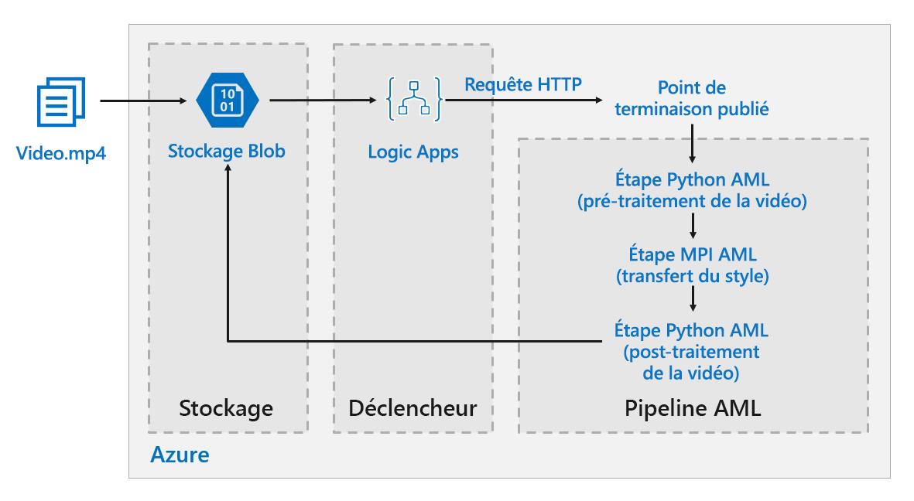

# Modèles de notation par lot d’apprentissage profond sur Azure

Cette architecture de référence montre comment appliquer un transfert de style neuronal à une vidéo avec Azure Machine Learning. Le *transfert de style* est une technique d’apprentissage profond (« deep learning ») qui compose une image existante dans le style d’une autre image. Cette architecture peut être généralisée à un scénario qui utilise le scoring par lots avec l’apprentissage profond. [**Déployez cette solution**](#deploy-the-solution).

**Scénario** : une société de multimédia souhaite changer le style d’une vidéo pour qu’elle ressemble à une peinture spécifique. L’objectif est d’appliquer ce style à toutes les images de la vidéo en temps voulu et de façon automatisée. Pour plus d’informations sur les algorithmes de transfert de style neuronal, consultez le document [Image Style Transfer Using Convolutional Neural Networks][image-style-transfer] (PDF).

<!-- markdownlint-disable MD033 -->

| Image du style : | Vidéo d’entrée/contenu : | Vidéo de sortie : |
|--------|--------|---------|
|  |  *cliquer pour voir la vidéo* |  *cliquer pour voir la vidéo* |

<!-- markdownlint-enable MD033 -->

Cette architecture de référence a été conçue pour les charges de travail qui sont déclenchées par la présence de nouveaux contenus multimédias dans le stockage Azure.

Le traitement est constitué des étapes suivantes :

1. Charger un fichier vidéo sur le stockage.
1. Le fichier vidéo déclenche l’envoi par Logic App d’une demande au point de terminaison publié du pipeline Azure Machine Learning.
1. Le pipeline traite la vidéo, applique le transfert de style avec MPI et effectue le post-traitement de la vidéo.
1. La sortie est réenregistrée dans le stockage blob une fois le pipeline terminé.

## Architecture

Cette architecture est constituée des composants suivants.

### Calcul

**[Azure Machine Learning Service][amls]** utilise des pipelines Azure Machine Learning pour créer des séquences de calcul reproductibles et faciles à gérer. Il offre également une cible de calcul managée (sur laquelle un calcul de pipeline peut s’exécuter) appelée [Capacité de calcul Azure Machine Learning][aml-compute] pour l’entraînement, le déploiement et le scoring des modèles Machine Learning.

### Stockage

**[Stockage Blob][blob-storage]** est utilisé pour stocker toutes les images (images d’entrée, images de style et images de sortie). Azure Machine Learning Service s’intègre à Stockage Blob : les utilisateurs ne doivent donc pas déplacer manuellement les données entre les plateformes de calcul et Stockage Blob. Stockage Blob se montre aussi très économique par rapport aux performances qu’exige cette charge de travail.

### Déclenchement/planification

**[Azure Logic Apps][logic-apps]** sert à déclencher le workflow. Quand l’application logique détecte qu’un objet blob a été ajouté au conteneur, elle déclenche le pipeline Azure Machine Learning. Logic Apps est parfaitement adapté à cette architecture de référence, car il permet de détecter facilement les modifications apportées à Stockage Blob et propose un processus simple pour modifier le déclencheur.

### Prétraitement et post-traitement de nos données

Cette architecture de référence utilise la séquence vidéo d’un orang-outan dans un arbre. Vous pouvez télécharger la séquence vidéo [ici][source-video].

1. Utilisez [FFmpeg][ffmpeg] pour extraire le fichier audio de la séquence vidéo, de façon à pouvoir le réincorporer par la suite dans la vidéo en sortie.
1. Utilisez FFmpeg pour découper la vidéo en images individuelles. Les images seront traitées indépendamment, en parallèle.
1. À ce stade, nous pouvons appliquer le transfert de style neuronal en parallèle à chaque trame individuelle.
1. Quand chaque trame a été traitée, nous devons utiliser FFmpeg pour les réassembler.
1. Enfin, nous réattachons le fichier audio à la séquence vidéo réassemblée.

## Considérations relatives aux performances

### GPU et UC

Pour les charges de travail d’apprentissage profond, les GPU (processeurs graphiques) sont généralement beaucoup plus performants que les CPU (processeurs centraux), dans la mesure où il faut un cluster de CPU important pour obtenir des performances comparables. Bien qu’il soit possible d’utiliser uniquement des CPU dans cette architecture, les GPU offrent un bien meilleur rapport coût/performances. Nous vous recommandons d’utiliser les dernières machines virtuelles optimisées pour les GPU [série NCv3] vm-sizes-gpu.

Les GPU ne sont pas compatibles par défaut dans toutes les régions. Veillez à sélectionner une région compatible avec les GPU. Par ailleurs, les abonnements ont un quota par défaut de zéro cœur pour les machines virtuelles optimisées pour les GPU. Vous pouvez augmenter ce quota en formulant une demande de support. Vérifiez que votre abonnement dispose d’un quota suffisant pour exécuter votre charge de travail.

### Parallélisation entre machines virtuelles par rapport aux cœurs

Quand vous exécutez un processus de transfert de style en tant que traitement par lots, les tâches qui s’exécutent principalement sur les GPU doivent être parallélisées dans toutes les machines virtuelles. Deux approches sont possibles : vous pouvez soit créer un cluster plus grand contenant des machines virtuelles avec un seul GPU, soit créer un cluster plus petit contenant des machines virtuelles avec un grand nombre de GPU.

Pour cette charge de travail, ces deux options offrent des performances comparables. Le fait d’utiliser moins de machines virtuelles avec plus de GPU par machine virtuelle peut contribuer à réduire le déplacement de données. Cependant, le volume de données par tâche pour cette charge de travail n’étant pas très important, la limitation imposée par Stockage Blob n’est pas significative.

### Étape MPI

Lors de la création du pipeline dans Azure Machine Learning, une des étapes utilisées pour effectuer le calcul parallèle est l’étape MPI. L’étape MPI aide à fractionner les données uniformément entre les nœuds disponibles. L’étape MPI n’est pas exécutée tant que tous les nœuds demandés ne sont pas prêts. Si un nœud échoue ou est préempté (s’il s’agit d’une machine virtuelle de faible priorité), l’étape MPI doit être réexécutée.

## Considérations relatives à la sécurité

### Limitation de l’accès à Stockage Blob Azure

Dans cette architecture de référence, Stockage Blob Azure est le composant de stockage principal qui doit être protégé. Le déploiement de référence présenté dans le dépôt GitHub utilise des clés de compte de stockage pour accéder à Stockage Blob. Pour une protection et un contrôle accrus, envisagez d’utiliser une signature d’accès partagé (SAP). Elle octroie un accès limité aux objets contenus dans le stockage, sans qu’il soit nécessaire de coder en dur les clés de compte ou de les enregistrer en texte clair. Cette approche est particulièrement utile, car les clés de compte sont visibles en texte clair à l’intérieur de l’interface du concepteur de l’application logique. L’utilisation d’une signature SAP permet aussi de s’assurer que le compte de stockage obéit à une gouvernance appropriée et que l’accès est octroyé uniquement aux personnes censées en bénéficier.

Dans les scénarios faisant intervenir des données plus sensibles, veillez à ce que toutes vos clés de stockage soient protégées, car elles octroient un accès complet à toutes les données d’entrée et de sortie de la charge de travail.

### Chiffrement des données et déplacement des données

Cette architecture de référence utilise le transfert de style comme exemple de processus de scoring par lots. Pour les scénarios avec des données plus sensibles, les données contenues dans le stockage doivent être chiffrées au repos. Chaque fois que des données sont déplacées d’un emplacement à l’autre, utilisez SSL pour sécuriser le transfert de données. Pour plus d’informations, consultez le [guide de sécurité Stockage Azure][storage-security].

### Sécurisation de votre calcul dans un réseau virtuel

Lors du déploiement de votre cluster de capacité de calcul Machine Learning, vous pouvez le configurer pour qu’il soit provisionné à l’intérieur du sous-réseau d’un [réseau virtuel][virtual-network]. Ceci permet aux nœuds de calcul du cluster de communiquer de façon sécurisée avec d’autres machines virtuelles.

### Protection contre les activités malveillantes

Dans les scénarios à plusieurs utilisateurs, veillez à ce que les données sensibles soient protégées contre les activités malveillantes. Si l’accès à ce déploiement est octroyé à d’autres utilisateurs pour leur permettre de personnaliser les données d’entrée, prenez note des précautions et des considérations suivantes :

- Utilisez RBAC pour limiter l’accès des utilisateurs aux seules ressources dont ils ont besoin.
- Provisionnez deux comptes de stockage distincts. Stockez les données d’entrée et de sortie dans le premier compte. L’accès à ce compte peut être octroyé à des utilisateurs externes. Stockez les scripts exécutables et les fichiers journaux de sortie dans l’autre compte. Les utilisateurs externes ne doivent pas avoir accès à ce compte. Ainsi, les utilisateurs externes ne pourront pas modifier les fichiers exécutables (pour injecter du code malveillant) ni accéder aux fichiers journaux, qui peuvent contenir des informations sensibles.
- Les utilisateurs malveillants peuvent lancer une attaque DDOS à l’encontre de la file d’attente des travaux ou injecter dans celle-ci des messages incohérents mal formés, entraînant ainsi le blocage du système ou des erreurs de retrait de la file d’attente.

## Surveillance et journalisation

### Supervision des travaux Batch

Pendant que vous exécutez votre tâche, il est important de superviser la progression et de vérifier que tout fonctionne comme prévu. Cependant, superviser un cluster de nœuds actifs peut s’avérer ardu.

Pour vous faire une idée de l’état global du cluster, accédez au panneau Machine Learning du portail Azure pour inspecter l’état des nœuds du cluster. Si un nœud est inactif ou si un travail a échoué, vous pouvez consulter les journaux d’activité d’erreurs enregistrés dans Stockage Blob. Ils sont également accessibles dans le portail Azure.

La supervision peut encore être approfondie en connectant les journaux d’activité à Application Insights, ou en exécutant des processus distincts pour interroger l’état du cluster et de ses travaux.

### Journalisation avec Azure Machine Learning

Azure Machine Learning enregistrera automatiquement tous les stdout/stderr au compte de stockage blob associé. Sauf indication contraire, votre espace de travail Azure Machine Learning provisionne automatiquement un compte de stockage et y enregistre vos journaux d’activité. Vous pouvez aussi utiliser un outil de navigation de stockage comme l’Explorateur Stockage, qui facilite nettement l’expérience de navigation dans les fichiers journaux.

## Considérations relatives au coût

Par rapport aux composants de stockage et de planification, les ressources de calcul utilisées dans cette architecture de référence s’avèrent nettement plus coûteuses. L’une des principales difficultés est de paralléliser efficacement les tâches dans un cluster de machines compatibles avec les GPU.

La taille du cluster de capacité de calcul Machine Learning peut faire l’objet d’un scale-up ou d’un scale-down automatique, en fonction des travaux présents dans la file d’attente. Vous pouvez activer la mise à l’échelle automatique par programmation en définissant le nombre minimal et le nombre maximal de nœuds.

Pour les tâches qui ne nécessitent pas un traitement immédiat, configurez la mise à l’échelle automatique, de sorte que l’état par défaut (minimal) soit un cluster sans nœud. Avec cette configuration, le cluster démarre sans nœud et ne monte en puissance que s’il détecte des tâches dans la file d’attente. Si le processus de scoring par lots ne s’enclenche que quelques fois par jour, ce paramètre permet de réaliser des économies significatives.

La mise à l’échelle peut ne pas convenir pour les tâches Batch trop rapprochées les unes des autres. Le temps nécessaire au lancement et à l’arrêt d’un cluster a aussi un coût. De ce fait, si une charge de travail Batch commence seulement quelques minutes après la fin de la tâche précédente, il peut être plus rentable de laisser le cluster s’exécuter entre les tâches.

Capacité de calcul Machine Learning prend également en charge les machines virtuelles de faible priorité. Ceci vous permet d’exécuter votre calcul sur des machines virtuelles avec remise, avec cette limitation qu’elles peuvent être préemptées à tout moment. Les machines virtuelles de faible priorité sont idéales pour les charges de travail de scoring par lots qui ne sont pas critiques.

## Déployer la solution

Pour déployer cette architecture de référence, suivez les étapes décrites dans le [dépôt GitHub][deployment].

> [!NOTE]
> Vous pouvez également déployer une architecture de scoring par lots pour les modèles d’apprentissage profond avec Azure Kubernetes Service. Suivez les étapes décrites dans ce [dépôt GitHub][deployment2].

<!-- links -->

[aml-compute]: /azure/machine-learning/service/how-to-set-up-training-targets#amlcompute
[amls]: /azure/machine-learning/service/overview-what-is-azure-ml
[azcopy]: /azure/storage/common/storage-use-azcopy-linux
[blob-storage]: /azure/storage/blobs/storage-blobs-introduction
[container-instances]: /azure/container-instances/
[container-registry]: /azure/container-registry/
[deployment]: https://github.com/Azure/Batch-Scoring-Deep-Learning-Models-With-AML
[deployment2]: https://github.com/Azure/Batch-Scoring-Deep-Learning-Models-With-AKS
[ffmpeg]: https://www.ffmpeg.org/
[image-style-transfer]: https://www.cv-foundation.org/openaccess/content_cvpr_2016/papers/Gatys_Image_Style_Transfer_CVPR_2016_paper.pdf
[logic-apps]: /azure/logic-apps/
[source-video]: https://happypathspublic.blob.core.windows.net/videos/orangutan.mp4
[storage-security]: /azure/storage/common/storage-security-guide
[vm-sizes-gpu]: /azure/virtual-machines/windows/sizes-gpu
[virtual-network]: /azure/machine-learning/service/how-to-enable-virtual-network
