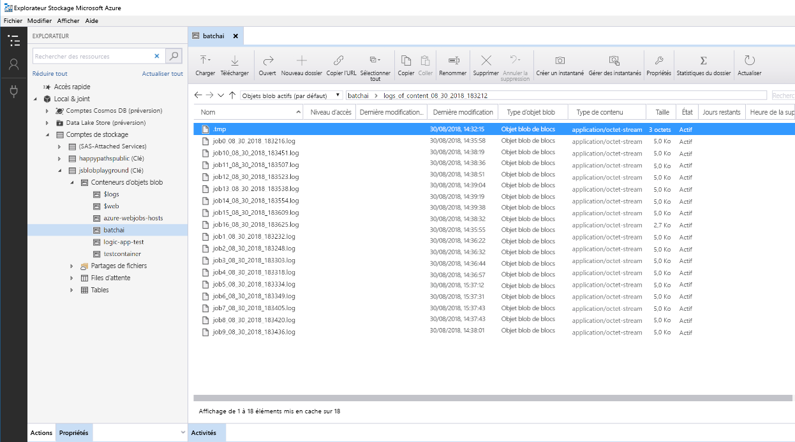

# Scoring par lots des modèles Python sur AzureBatch scoring of Python models on Azure

Cette architecture de référence montre comment générer une solution scalable pour le scoring par lots de nombreux modèles selon une planification en parallèle à l’aide d’Azure Batch AI.This reference architecture shows how to build a scalable solution for batch scoring many models on a schedule in parallel using Azure Batch AI. La solution peut être utilisée comme modèle et appliquée à différents problèmes.The solution can be used as a template and can generalize to different problems.

Une implémentation de référence pour cette architecture est disponible sur [GitHub][github].A reference implementation for this architecture is available on [GitHub][github].

**Scénario** : Cette solution supervise le fonctionnement d’un grand nombre d’appareils dans un paramètre IoT où chaque appareil envoie des lectures de capteurs en permanence.**Scenario**: This solution monitors the operation of a large number of devices in an IoT setting where each device sends sensor readings continuously. Il est supposé que chaque appareil dispose de modèles de détection des anomalies préentraînés qui doivent être utilisés pour prédire si une série de mesures, agrégées sur un intervalle de temps prédéfini, correspondent ou non à une anomalie.Each device is assumed to have pre-trained anomaly detection models that need to be used to predict whether a series of measurements, that are aggregated over a predefined time interval, correspond to an anomaly or not. Dans les scénarios réels, il peut s’agir d’un flux de lectures de capteurs qui doivent être filtrées et agrégées avant d’être utilisées dans l’entraînement ou le scoring en temps réel.In real-world scenarios, this could be a stream of sensor readings that need to be filtered and aggregated before being used in training or real-time scoring. Par souci de simplicité, la solution utilise le même fichier de données lors de l’exécution des travaux de scoring.For simplicity, the solution uses the same data file when executing scoring jobs.

## ArchitectureArchitecture

Cette architecture est constituée des composants suivants :This architecture consists of the following components:

[Azure Event Hubs][event-hubs].[Azure Event Hubs][event-hubs]. Ce service d’ingestion de messages peut recevoir des millions de messages d’événement par seconde.This message ingestion service can ingest millions of event messages per second. Dans cette architecture, les capteurs envoient un flux de données au hub d’événements.In this architecture, sensors send a stream of data to the event hub.

[Azure Stream Analytics][stream-analytics].[Azure Stream Analytics][stream-analytics]. Moteur de traitement des événements.An event-processing engine. Un travail Stream Analytics lit les flux de données provenant du hub d’événements et effectue le traitement des flux.A Stream Analytics job reads the data streams from the event hub and performs stream processing.

[Azure Batch AI][batch-ai].[Azure Batch AI][batch-ai]. Ce moteur de calcul distribué est utilisé pour entraîner et tester les modèles de machine learning et d’intelligence artificielle à grande échelle dans Azure.This distributed computing engine is used to train and test machine learning and AI models at scale in Azure. Batch AI crée des machines virtuelles à la demande avec une option de mise à l’échelle automatique, où chaque nœud du cluster Batch AI exécute un travail de scoring pour un capteur spécifique.Batch AI creates virtual machines on demand with an automatic scaling option, where each node in the Batch AI cluster runs a scoring job for a specific sensor. Le [script][python-script] Python de scoring s’exécute dans des conteneurs Docker qui sont créés sur chaque nœud du cluster, où il lit les données de capteurs pertinentes, génère des prédictions et les stocke dans le stockage Blob.The scoring Python [script][python-script] runs in Docker containers that are created on each node of the cluster, where it reads the relevant sensor data, generates predictions and stores them in Blob storage.

[Stockage Blob Azure][storage].[Azure Blob Storage][storage]. Les conteneurs d’objets blob sont utilisés pour stocker les modèles préentraînés, les données et les prédictions de sortie.Blob containers are used to store the pretrained models, the data, and the output predictions. Les modèles sont chargés sur le stockage Blob dans le notebook [create\_resources.ipynb][create-resources].The models are uploaded to Blob storage in the [create\_resources.ipynb][create-resources] notebook. Ces modèles [SVM à une classe][one-class-svm] sont entraînés sur des données qui représentent les valeurs de différents capteurs pour différents appareils.These [one-class SVM][one-class-svm] models are trained on data that represents values of different sensors for different devices. Cette solution part du principe que les valeurs de données sont agrégées sur un intervalle de temps fixe.This solution assumes that the data values are aggregated over a fixed interval of time.

[Azure Logic Apps][logic-apps].[Azure Logic Apps][logic-apps]. Cette solution crée une application logique qui exécute toutes les heures des travaux Batch AI.This solution creates a Logic App that runs hourly Batch AI jobs. Logic Apps offre un moyen facile de créer le workflow du runtime et la planification de la solution.Logic Apps provides an easy way to create the runtime workflow and scheduling for the solution. Les travaux Batch AI sont envoyés à l’aide d’un [script][script] Python qui s’exécute également dans un conteneur Docker.The Batch AI jobs are submitted using a Python [script][script] that also runs in a Docker container.

[Azure Container Registry][acr].[Azure Container Registry][acr]. Les images Docker sont utilisées à la fois dans Batch AI et Logic Apps, et sont créées dans le notebook [create\_resources.ipynb][create-resources], puis envoyées (push) à Container Registry.Docker images are used in both Batch AI and Logic Apps and are created in the [create\_resources.ipynb][create-resources] notebook, then pushed to Container Registry. Cela représente un moyen pratique d’héberger des images et d’instancier des conteneurs via d’autres services Azure, Logic Apps et Batch AI dans cette solution.This provides a convenient way to host images and instantiate containers through other Azure services—Logic Apps and Batch AI in this solution.

## Considérations relatives aux performancesPerformance considerations

Pour les modèles Python standard, il est généralement admis que les processeurs sont suffisants pour gérer la charge de travail.For standard Python models, it's generally accepted that CPUs are sufficient to handle the workload. Cette architecture utilise des processeurs.This architecture uses CPUs. Toutefois, pour les [charges de travail d’apprentissage profond][deep], les GPU sont généralement beaucoup plus performants que les CPU, dans la mesure où un cluster de CPU important est nécessaire pour obtenir des performances comparables.However, for [deep learning workloads][deep], GPUs generally outperform CPUs by a considerable amount—a sizeable cluster of CPUs is usually needed to get comparable performance.

### Parallélisation dans les machines virtuelles et les cœursParallelizing across VMs vs cores

Lors de l’exécution des processus de scoring de nombreux modèles en mode Batch, le travail doit être mis en parallèle sur les machines virtuelles.When running scoring processes of many models in batch mode, the jobs need to be parallelized across VMs. Deux approches sont possibles :Two approaches are possible: 

* Créer un cluster plus grand avec des machines virtuelles de faible coût.Create a larger cluster using low-cost VMs.

* Créer un cluster plus petit avec des machines virtuelles hautes performances et plus de cœurs disponibles sur chacune.Create a smaller cluster using high performing VMs with more cores available on each.

En général, le scoring des modèles Python standard n’est pas aussi exigeant que celui des modèles d’apprentissage profond, et un petit cluster doit être en mesure de gérer efficacement un grand nombre de modèles en file d’attente.In general, scoring of standard Python models is not as demanding as scoring of deep learning models, and a small cluster should be able to handle a large number of queued models efficiently. Vous pouvez accroître le nombre de nœuds de cluster à mesure que les tailles des jeux de données augmentent.You can increase the number of cluster nodes as the dataset sizes increase.

Pour des raisons pratiques dans ce scénario, une tâche de scoring est envoyée au sein d’un travail Batch AI unique.For convenience in this scenario, one scoring task is submitted within a single Batch AI job. Toutefois, il peut être plus efficace de scorer plusieurs blocs de données au sein du même travail Batch AI.However, it can be more efficient to score multiple data chunks within the same Batch AI job. Dans ce cas, écrivez un code personnalisé à lire dans plusieurs jeux de données et exécutez le script de scoring pour ceux-ci lors d’un travail Batch AI unique.In those cases, write custom code to read in multiple datasets and execute the scoring script for those during a single Batch AI job execution.

### Serveurs de fichiersFile servers

Quand vous utilisez Batch AI, vous pouvez choisir plusieurs options de stockage, selon le débit nécessaire à votre scénario.When using Batch AI, you can choose multiple storage options depending on the throughput needed for your scenario. Pour les charges de travail qui demandent peu de débit, l’utilisation du stockage Blob doit suffire.For workloads with low throughput requirements, using blob storage should be enough. Sinon, Batch AI prend aussi en charge un [serveur de fichiers Batch AI][bai-file-server], un système NFS à un seul nœud géré, qui peut être monté automatiquement sur les nœuds du cluster pour fournir un emplacement de stockage accessible de façon centralisée pour les travaux.Alternatively, Batch AI also supports a [Batch AI File Server][bai-file-server], a managed, single-node NFS, which can be automatically mounted on cluster nodes to provide a centrally accessible storage location for jobs. Dans la plupart des cas, un seul serveur de fichiers s’avère nécessaire dans un espace de travail, et vous pouvez répartir les données de vos travaux d’entraînement dans différents répertoires.For most cases, only one file server is needed in a workspace, and you can separate data for your training jobs into different directories.

Si un système NFS à un seul nœud ne convient pas pour vos charges de travail, Batch AI prend en charge d’autres options de stockage, dont [Azure Files][azure-files] et les solutions personnalisées que sont le système de fichiers Gluster ou Lustre.If a single-node NFS isn't appropriate for your workloads, Batch AI supports other storage options, including [Azure Files][azure-files] and custom solutions such as a Gluster or Lustre file system.

## Considérations relatives à la gestionManagement considerations

### Supervision des tâches Batch AIMonitoring Batch AI jobs

Il est important de superviser la progression de l’exécution de travaux, mais cela peut s’avérer ardu sur un cluster de nœuds actifs.It's important to monitor the progress of running jobs, but it can be a challenge to monitor across a cluster of active nodes. Pour vous faire une idée de l’état global du cluster, accédez au panneau **Batch AI** du [portail Azure][portal] pour inspecter l’état des nœuds du cluster.To get a sense of the overall state of the cluster, go to the **Batch AI** blade of the [Azure Portal][portal] to inspect the state of the nodes in the cluster. Si un nœud est inactif ou si un travail a échoué, les journaux d’erreurs sont enregistrés dans le stockage Blob et sont aussi accessibles dans le panneau **Travaux** du portail.If a node is inactive or a job has failed, the error logs are saved to blob storage, and are also accessible in the **Jobs** blade of the portal.

Pour une supervision plus complète, connectez les journaux à [Application Insights][ai] ou exécutez des processus distincts pour demander l’état du cluster Batch AI et de ses travaux.For richer monitoring, connect logs to [Application Insights][ai], or run separate processes to poll for the state of the Batch AI cluster and its jobs.

### Journalisation dans Batch AILogging in Batch AI

Batch AI journalise tous les stdout/stderr dans le compte de stockage Azure associé.Batch AI logs all stdout/stderr to the associated Azure storage account. L’utilisation d’un outil de navigation de stockage comme l’[Explorateur Stockage Azure][explorer] facilite la navigation dans les fichiers journaux.For easy navigation of the log files, use a storage navigation tool such as [Azure Storage Explorer][explorer].

Quand vous déployez cette architecture de référence, vous pouvez configurer un système de journalisation plus simple.When you deploy this reference architecture, you have the option to set up a simpler logging system. Avec cette option, tous les journaux des différents travaux sont enregistrés dans un même répertoire de votre conteneur d’objets blob, comme illustré ci-dessous.With this option, all the logs across the different jobs are saved to the same directory in your blob container as shown below. Ces journaux s’avèrent utiles pour superviser la durée de traitement de chaque travail et de chaque image, et vous pouvez ainsi vous faire une idée plus précise de la façon d’optimiser le processus.Use these logs to monitor how long it takes for each job and each image to process, so you have a better sense of how to optimize the process.

## Considérations relatives au coûtCost considerations

Les composants les plus coûteux utilisés dans cette architecture de référence sont les ressources de calcul.The most expensive components used in this reference architecture are the compute resources.

La taille du cluster Batch AI peut être mise à l’échelle à la hausse ou à la baisse en fonction des travaux présents dans la file d’attente.The Batch AI cluster size scales up and down depending on the jobs in the queue. Avec Batch AI, vous pouvez activer la [mise à l’échelle automatique][automatic-scaling] de deux façons différentes.You can enable [automatic scaling][automatic-scaling] with Batch AI in one of two ways. Vous pouvez le faire par programmation, ce que vous pouvez configurer dans le fichier .env lors des [étapes de déploiement][github], ou vous pouvez changer la formule de mise à l’échelle directement dans le portail une fois le cluster créé.You can do so programmatically, which can be configured in the .env file that is part of the [deployment steps][github], or you can change the scale formula directly in the portal after the cluster is created.

Pour les tâches qui ne nécessitent pas un traitement immédiat, configurez la formule de mise à l’échelle automatique de sorte que l’état par défaut (minimum) soit un cluster sans nœud.For work that doesn't require immediate processing, configure the automatic scaling formula so the default state (minimum) is a cluster of zero nodes. Avec cette configuration, le cluster démarre sans nœud et ne monte en puissance que s’il détecte des tâches dans la file d’attente.With this configuration, the cluster starts with zero nodes and only scales up when it detects jobs in the queue. Si le processus de scoring par lots ne s’enclenche que quelques fois par jour, ce paramètre permet de réaliser des économies significatives.If the batch scoring process only happens a few times a day or less, this setting enables significant cost savings.

La mise à l’échelle automatique peut ne pas convenir pour les traitements par lots trop rapprochés les uns des autres.Automatic scaling may not be appropriate for batch jobs that happen too close to each other. Le temps nécessaire au lancement et à l’arrêt d’un cluster a aussi un coût. De ce fait, si une charge de travail Batch commence seulement quelques minutes après la fin de la tâche précédente, il peut être plus rentable de laisser le cluster s’exécuter entre les tâches.The time that it takes for a cluster to spin up and spin down also incur a cost, so if a batch workload begins only a few minutes after the previous job ends, it might be more cost effective to keep the cluster running between jobs. Cela dépend si les processus de scoring sont planifiés pour s’exécuter très fréquemment (toutes les heures, par exemple) ou moins fréquemment (une fois par mois, par exemple).That depends on whether scoring processes are scheduled to run at a high frequency (every hour, for example), or less frequently (once a month, for example).

## Déployer la solutionDeploy the solution

L’implémentation de référence de cette architecture est disponible sur [GitHub][github].The reference implementation of this architecture is available on [GitHub][github]. Suivez les étapes de configuration ici afin de générer une solution scalable pour le scoring de nombreux modèles en parallèle à l’aide de Batch AI.Follow the setup steps there to build a scalable solution for scoring many models in parallel using Batch AI.

[acr]: /azure/container-registry/container-registry-intro
[ai]: /azure/application-insights/app-insights-overview
[automatic-scaling]: /azure/batch/batch-automatic-scaling
[azure-files]: /azure/storage/files/storage-files-introduction
[batch-ai]: /azure/batch-ai/
[bai-file-server]: /azure/batch-ai/resource-concepts#file-server
[create-resources]: https://github.com/Azure/BatchAIAnomalyDetection/blob/master/create_resources.ipynb
[deep]: /azure/architecture/reference-architectures/ai/batch-scoring-deep-learning
[event-hubs]: /azure/event-hubs/event-hubs-geo-dr
[explorer]: https://azure.microsoft.com/en-us/features/storage-explorer/
[github]: https://github.com/Azure/BatchAIAnomalyDetection
[logic-apps]: /azure/logic-apps/logic-apps-overview
[one-class-svm]: http://scikit-learn.org/stable/modules/generated/sklearn.svm.OneClassSVM.html
[portal]: https://portal.azure.com
[python-script]: https://github.com/Azure/BatchAIAnomalyDetection/blob/master/batchai/predict.py
[script]: https://github.com/Azure/BatchAIAnomalyDetection/blob/master/sched/submit_jobs.py
[storage]: /azure/storage/blobs/storage-blobs-overview
[stream-analytics]: /azure/stream-analytics/
