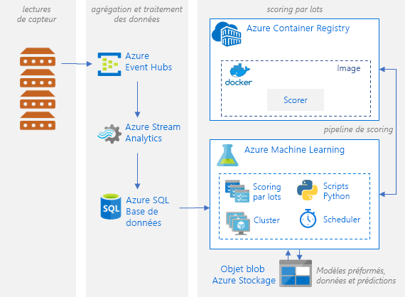

# Modèles de notation par lot de l’apprentissage de Python sur AzureBatch scoring of Python machine learning models on Azure

Cette architecture de référence montre comment créer une solution scalable pour le scoring par lots d’un grand nombre de modèles selon une planification en parallèle avec Azure Machine Learning Service.This reference architecture shows how to build a scalable solution for batch scoring many models on a schedule in parallel using Azure Machine Learning Service. La solution peut être utilisée comme modèle et appliquée à différents problèmes.The solution can be used as a template and can generalize to different problems.

Une implémentation de référence pour cette architecture est disponible sur [GitHub][github].A reference implementation for this architecture is available on [GitHub][github].

**Scénario** : Cette solution supervise le fonctionnement d’un grand nombre d’appareils dans un paramètre IoT où chaque appareil envoie des lectures de capteurs en permanence.**Scenario**: This solution monitors the operation of a large number of devices in an IoT setting where each device sends sensor readings continuously. Chaque appareil est supposé être associé à des modèles de détection des anomalies préentraînés, qui doivent être utilisés pour prédire si une série de mesures, agrégées sur un intervalle de temps prédéfini, correspondent ou non à une anomalie.Each device is assumed to be associated with pretrained anomaly detection models that need to be used to predict whether a series of measurements, that are aggregated over a predefined time interval, correspond to an anomaly or not. Dans les scénarios réels, il peut s’agir d’un flux de lectures de capteurs qui doivent être filtrées et agrégées avant d’être utilisées dans l’entraînement ou le scoring en temps réel.In real-world scenarios, this could be a stream of sensor readings that need to be filtered and aggregated before being used in training or real-time scoring. Pour simplifier, cette solution utilise le même fichier de données lors de l’exécution des travaux de scoring.For simplicity, this solution uses the same data file when executing scoring jobs.

Cette architecture de référence est conçue pour des charges de travail déclenchées selon une planification.This reference architecture is designed for workloads that are triggered on a schedule. Le traitement est constitué des étapes suivantes :Processing involves the following steps:
1.  Envoyer des lectures de capteurs pour ingestion à Azure Event Hubs.Send sensor readings for ingestion to Azure Event Hubs.
2.  Effectuer le traitement des flux et stocker les données brutes.Perform stream processing and store the raw data.
3.  Envoyer les données à un cluster Machine Learning prêt à travailler.Send the data to a Machine Learning cluster that is ready to start taking work. Chaque nœud du cluster exécute un travail de scoring pour un capteur spécifique.Each node in the cluster runs a scoring job for a specific sensor. 
4.  Exécuter le pipeline de scoring, qui exécute les travaux de scoring en parallèle avec des scripts Python Machine Learning.Execute the scoring pipeline, which runs the scoring jobs in parallel using Machine Learning Python scripts. Le pipeline est créé et publié, et son exécution est planifiée à un intervalle de temps prédéfini.The pipeline is created, published, and scheduled to run on a predefined interval of time.
5.  Générer des prédictions et les stocker dans Stockage Blob pour les utiliser plus tard.Generate predictions and store them in Blob storage for later consumption.

## ArchitectureArchitecture

Cette architecture est constituée des composants suivants :This architecture consists of the following components:

[Azure Event Hubs][event-hubs].[Azure Event Hubs][event-hubs]. Ce service d’ingestion de messages peut recevoir des millions de messages d’événement par seconde.This message ingestion service can ingest millions of event messages per second. Dans cette architecture, les capteurs envoient un flux de données au hub d’événements.In this architecture, sensors send a stream of data to the event hub.

[Azure Stream Analytics][stream-analytics].[Azure Stream Analytics][stream-analytics]. Moteur de traitement des événements.An event-processing engine. Un travail Stream Analytics lit les flux de données provenant du hub d’événements et effectue le traitement des flux.A Stream Analytics job reads the data streams from the event hub and performs stream processing.

[Azure SQL Database][sql-database].[Azure SQL Database][sql-database]. Les données des lectures des capteurs sont chargées dans SQL Database.Data from the sensor readings is loaded into SQL Database. SQL est un moyen bien connu de stocker les données en flux traitées (qui sont tabulaires et structurées), mais d’autres magasins de données peuvent être utilisés.SQL is a familiar way to store the processed, streamed data (which is tabular and structured), but other data stores can be used.

[Service Azure Machine Learning][amls].[Azure Machine Learning Service][amls]. Machine Learning est un service cloud pour l’entraînement, le scoring, le déploiement et la gestion des modèles de machine learning à grande échelle.Machine Learning is a cloud service for training, scoring, deploying, and managing machine learning models at scale. Dans le contexte du scoring par lots, Machine Learning crée un cluster de machines virtuelles à la demande avec une option de mise à l’échelle automatique, où chaque nœud du cluster exécute un travail de scoring pour un capteur spécifique.In the context of batch scoring, Machine Learning creates a cluster of virtual machines on demand with an automatic scaling option, where each node in the cluster runs a scoring job for a specific sensor. Les travaux de scoring sont exécutés en parallèle sous forme d’étapes de script Python qui sont placés en file d’attente et gérés par Machine Learning.The scoring jobs are executed in parallel as Python-script steps that are queued and managed by Machine Learning. Ces étapes font partie d’un pipeline Machine Learning qui est créé et publié, et dont l’exécution est planifiée à un intervalle de temps prédéfini.These steps are part of a Machine Learning pipeline that is created, published, and scheduled to run on a predefined interval of time.

[Stockage Blob Azure][storage].[Azure Blob Storage][storage]. Les conteneurs d’objets blob sont utilisés pour stocker les modèles préentraînés, les données et les prédictions de sortie.Blob containers are used to store the pretrained models, the data, and the output predictions. Les modèles sont chargés sur Stockage Blob dans le notebook [01_create_resources.ipynb][create-resources].The models are uploaded to Blob storage in the [01_create_resources.ipynb][create-resources] notebook. Ces modèles [SVM à une classe][one-class-svm] sont entraînés sur des données qui représentent les valeurs de différents capteurs pour différents appareils.These [one-class SVM][one-class-svm] models are trained on data that represents values of different sensors for different devices. Cette solution part du principe que les valeurs de données sont agrégées sur un intervalle de temps fixe.This solution assumes that the data values are aggregated over a fixed interval of time.

[Azure Container Registry][acr].[Azure Container Registry][acr]. Le [script][pyscript] Python de scoring s’exécute dans des conteneurs Docker qui sont créés sur chaque nœud du cluster, où il lit les données des capteurs appropriés, génère des prédictions et les stocke dans Stockage Blob.The scoring Python [script][pyscript] runs in Docker containers that are created on each node of the cluster, where it reads the relevant sensor data, generates predictions and stores them in Blob storage.

## Considérations relatives aux performancesPerformance considerations

Pour les modèles Python standard, il est généralement admis que les processeurs sont suffisants pour gérer la charge de travail.For standard Python models, it's generally accepted that CPUs are sufficient to handle the workload. Cette architecture utilise des processeurs.This architecture uses CPUs. Toutefois, pour [charges de travail d’apprentissage approfondi][deep], GPU généralement plus performantes que les unités centrales par une quantité considérable &mdash; un cluster important d’UC est généralement nécessaire pour obtenir des performances comparables.However, for [deep learning workloads][deep], GPUs generally outperform CPUs by a considerable amount &mdash; a sizeable cluster of CPUs is usually needed to get comparable performance.

### Parallélisation entre machines virtuelles par rapport aux cœursParallelizing across VMs versus cores

Lors de l’exécution des processus de scoring de nombreux modèles en mode Batch, le travail doit être mis en parallèle sur les machines virtuelles.When running scoring processes of many models in batch mode, the jobs need to be parallelized across VMs. Deux approches sont possibles :Two approaches are possible:

* Créer un cluster plus grand avec des machines virtuelles de faible coût.Create a larger cluster using low-cost VMs.

* Créer un cluster plus petit avec des machines virtuelles hautes performances et plus de cœurs disponibles sur chacune.Create a smaller cluster using high performing VMs with more cores available on each.

En général, le scoring des modèles Python standard n’est pas aussi exigeant que celui des modèles d’apprentissage profond, et un petit cluster doit être en mesure de gérer efficacement un grand nombre de modèles en file d’attente.In general, scoring of standard Python models is not as demanding as scoring of deep learning models, and a small cluster should be able to handle a large number of queued models efficiently. Vous pouvez accroître le nombre de nœuds de cluster à mesure que les tailles des jeux de données augmentent.You can increase the number of cluster nodes as the dataset sizes increase.

Pour des raisons pratiques, dans ce scénario, une seule tâche de scoring est envoyée dans une étape du pipeline Machine Learning.For convenience in this scenario, one scoring task is submitted within a single Machine Learning pipeline step. Il peut cependant être plus efficace d’effectuer le scoring de plusieurs blocs de données dans la même étape de pipeline.However, it can be more efficient to score multiple data chunks within the same pipeline step. Dans ce cas, écrivez un code personnalisé pour lire dans plusieurs jeux de données et exécutez le script de scoring pour ceux-ci au cours d’une même étape.In those cases, write custom code to read in multiple datasets and execute the scoring script for those during a single-step execution.

## Considérations relatives à la gestionManagement considerations

- **Superviser les travaux**.**Monitor jobs**. Il est important de superviser la progression de l’exécution de travaux, mais cela peut s’avérer ardu sur un cluster de nœuds actifs.It's important to monitor the progress of running jobs, but it can be a challenge to monitor across a cluster of active nodes. Pour examiner l’état des nœuds du cluster, utilisez le [portail Azure][portal] pour gérer l’[espace de travail Machine Learning][ml-workspace].To inspect the state of the nodes in the cluster, use the [Azure Portal][portal] to manage the [machine learning workspace][ml-workspace]. Si un nœud est inactif ou si un travail a échoué, vous pouvez consulter les journaux d’erreurs enregistrés dans Stockage Blob. Ils sont également accessibles dans la section Pipelines.If a node is inactive or a job has failed, the error logs are saved to blob storage, and are also accessible in the Pipelines section. Pour une supervision approfondie, connectez les journaux à [Application Insights][app-insights], ou exécutez des processus distincts pour interroger l’état du cluster et de ses travaux.For richer monitoring, connect logs to [Application Insights][app-insights], or run separate processes to poll for the state of the cluster and its jobs.
-   **Journalisation**.**Logging**. Machine Learning Service journalise tous les stdout/stderr dans le compte de stockage Azure associé.Machine Learning Service logs all stdout/stderr to the associated Azure Storage account. Pour consulter facilement les fichiers journaux, utilisez un outil de navigation dans le stockage comme [Explorateur Stockage Azure][explorer].To easily view the log files, use a storage navigation tool such as [Azure Storage Explorer][explorer].

## Considérations relatives au coûtCost considerations

Les composants les plus coûteux utilisés dans cette architecture de référence sont les ressources de calcul.The most expensive components used in this reference architecture are the compute resources. La taille du cluster de calcul peut faire l’objet d’un scale-up ou d’un scale-down en fonction des travaux présents dans la file d’attente.The compute cluster size scales up and down depending on the jobs in the queue. Activez la mise à l’échelle automatique programmatiquement via le SDK Python en modifiant la configuration du provisionnement de la capacité de calcul.Enable automatic scaling programmatically through the Python SDK by modifying the compute’s provisioning configuration. Vous pouvez aussi utiliser [Azure CLI][cli] pour définir les paramètres de mise à l’échelle automatique du cluster.Or use the [Azure CLI][cli] to set the automatic scaling parameters of the cluster.

Pour les tâches qui ne nécessitent pas un traitement immédiat, configurez la formule de mise à l’échelle automatique de sorte que l’état par défaut (minimum) soit un cluster sans nœud.For work that doesn't require immediate processing, configure the automatic scaling formula so the default state (minimum) is a cluster of zero nodes. Avec cette configuration, le cluster démarre sans nœud et ne monte en puissance que s’il détecte des tâches dans la file d’attente.With this configuration, the cluster starts with zero nodes and only scales up when it detects jobs in the queue. Si le processus de scoring par lots ne se produit que quelques fois par jour ou moins, ce paramètre permet de réaliser des économies significatives.If the batch scoring process happens only a few times a day or less, this setting enables significant cost savings.

La mise à l’échelle automatique peut ne pas convenir pour les traitements par lots trop rapprochés les uns des autres.Automatic scaling may not be appropriate for batch jobs that happen too close to each other. Le temps nécessaire au lancement et à l’arrêt d’un cluster a aussi un coût. De ce fait, si une charge de travail par lots commence seulement quelques minutes après la fin du travail précédent, il peut être plus rentable de laisser le cluster en fonctionnement entre les travaux.The time that it takes for a cluster to spin up and spin down also incurs a cost, so if a batch workload begins only a few minutes after the previous job ends, it might be more cost effective to keep the cluster running between jobs. Cela dépend si les processus de scoring sont planifiés pour s’exécuter très fréquemment (toutes les heures, par exemple) ou moins fréquemment (une fois par mois, par exemple).That depends on whether scoring processes are scheduled to run at a high frequency (every hour, for example), or less frequently (once a month, for example).

## DéploiementDeployment

Pour déployer cette architecture de référence, suivez les étapes décrites dans le [dépôt GitHub][github].To deploy this reference architecture, follow the steps described in the [GitHub repo][github].

[acr]: /azure/container-registry/container-registry-intro
[ai]: /azure/application-insights/app-insights-overview
[aml-compute]: /azure/machine-learning/service/how-to-set-up-training-targets#amlcompute
[amls]: /azure/machine-learning/service/overview-what-is-azure-ml
[automatic-scaling]: /azure/batch/batch-automatic-scaling
[azure-files]: /azure/storage/files/storage-files-introduction
[cli]: /cli/azure
[create-resources]: https://github.com/Microsoft/AMLBatchScoringPipeline/blob/master/01_create_resources.ipynb
[deep]: /azure/architecture/reference-architectures/ai/batch-scoring-deep-learning
[event-hubs]: /azure/event-hubs/event-hubs-geo-dr
[explorer]: https://azure.microsoft.com/en-us/features/storage-explorer/
[github]: https://github.com/Microsoft/AMLBatchScoringPipeline
[one-class-svm]: http://scikit-learn.org/stable/modules/generated/sklearn.svm.OneClassSVM.html
[portal]: https://portal.azure.com
[ml-workspace]: /azure/machine-learning/studio/create-workspace
[python-script]: https://github.com/Azure/BatchAIAnomalyDetection/blob/master/batchai/predict.py
[pyscript]: https://github.com/Microsoft/AMLBatchScoringPipeline/blob/master/scripts/predict.py
[storage]: /azure/storage/blobs/storage-blobs-overview
[stream-analytics]: /azure/stream-analytics/
[sql-database]: /azure/sql-database/
[app-insights]: /azure/application-insights/app-insights-overview
