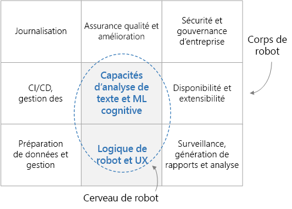

# Bot de conversation de classe Entreprise

Cette architecture de référence décrit comment générer un bot de conversation (chatbot) de classe entreprise à l’aide d’[Azure Bot Framework][bot-framework]. Chaque bot est différent, mais ils ont en commun des modèles, des workflows et des technologies à connaître. Pour ce qui est des bots au service de charges de travail d’entreprise, il existe de nombreuses considérations liées à leur conception au-delà de leur simple fonctionnalité. Cet article couvre les aspects les plus importants de cette conception et présente les outils nécessaires pour générer un bot robuste, sécurisé et actif dans son apprentissage.

[![Diagramme de l’architecture][0]][0]

Les exemples d’utilitaires de bonnes pratiques utilisés dans cette architecture sont entièrement open source et sont disponibles sur [GitHub][git-repo-base]. 

## Architecture

L’architecture présentée ici utilise les services Azure suivants. Votre bot personnel n’utilise peut-être pas tous ces services, ou peut-être en incorpore-t-il d’autres.

### Logique de bot et expérience utilisateur

- **[Bot Framework Service][bot-framework-service]** (BFS). Ce service connecte votre bot à une application de communication comme Cortana, Facebook Messenger ou Slack. Il facilite la communication entre votre bot et l’utilisateur.
- **[Azure App Service][app-service]**. La logique d’application du bot est hébergée dans Azure App Service.

### Cognition et intelligence du bot

- **[Language Understanding][luis]** (LUIS). Dans le cadre d’[Azure Cognitive Services][cognitive-services], LUIS permet à votre bot de comprendre le langage naturel en identifiant les intentions et les entités de l’utilisateur.
- **[Recherche Azure][search]**. Recherche est un service géré qui fournit un index de documents dans lequel vous pouvez effectuer des recherches rapides.
- **[QnA Maker][qna-maker]**. QnA Maker est un service d’API cloud qui crée une couche de questions-réponses conversationnelle sur vos données. En règle générale, il se charge avec du contenu semi-structuré comme des questions fréquentes (FAQ). Utilisez-le pour créer une base de connaissances afin de répondre à des questions en langage naturel.
- **[Application web][webapp]**. Si votre bot a besoin de solutions d’intelligence artificielle (IA) non fournies par un service existant, vous pouvez implémenter votre propre IA personnalisée et l’héberger comme application web. Cette dernière fournit un point de terminaison web que votre bot peut appeler.

### Ingestion de données

Le bot compte sur les données brutes que vous devez ingérer et préparer. Envisagez l’une des options suivantes pour orchestrer ce processus :

- **[Azure Data Factory][data-factory]**. Data Factory orchestre et automatise le déplacement et la transformation des données.
- **[Logic Apps][logic-apps]**. Logic Apps est une plateforme serverless pour la création de workflows qui intègrent des applications, des données et des services. Logic Apps fournit des connecteurs de données pour de nombreuses applications, notamment Office 365.
- **[Azure Functions][functions]**. Vous pouvez utiliser Azure Functions pour écrire du code serverless personnalisé, appelé par un [déclencheur][functions-triggers] &mdash;, par exemple, chaque fois qu’un document est ajouté au stockage blob ou à Cosmos DB.

### Enregistrement et surveillance

- **[Application Insights][app-insights]**. Utilisez Application Insights pour journaliser les métriques d’application du bot à des fins de supervision, de diagnostic et d’analyse.
- **[Stockage Blob Azure][blob]**. Le stockage Blob est optimisé pour stocker de grandes quantités de données non structurées.
- **[Cosmos DB][cosmosdb]**. Cosmos DB convient parfaitement au stockage de données de journal semi-structurées comme les conversations.
- **[Power BI][power-bi]**. Utilisez Power BI pour créer des tableaux de bord de supervision pour votre bot.

### Sécurité et gouvernance

- **[Azure Active Directory][aad]** (Azure AD). Les utilisateurs s’authentifient par le biais d’un fournisseur d’identité comme Azure AD. Bot Service gère le flux d’authentification et la gestion des jetons OAuth. Consultez [Ajouter l’authentification à votre bot par le biais d’Azure Bot Service][bot-authentication].
- **[Azure Key Vault][key-vault]**. Stockez les informations d’identification et d’autres secrets à l’aide de Key Vault.

### Assurance qualité et améliorations

- **[Azure DevOps][devops]**. Fournit de nombreux services de gestion des applications, notamment le contrôle de code source, la génération, le test, le déploiement et le suivi de projet.
- **[VS Code][vscode]** Éditeur de code léger pour le développement d’applications. Vous pouvez utiliser n’importe quel autre environnement de développement intégré (IDE) doté de fonctionnalités similaires.

## Remarques relatives à la conception

Globalement, un bot de conversation comporte, d’un côté, la fonctionnalité du bot (le « cerveau ») et de l’autre, un ensemble de critères environnants (le « corps »). Le cerveau comprend les composants qui tiennent compte du domaine, notamment la logique de bot et les fonctionnalités ML (Machine Learning). Les autres composants ne dépendent pas du domaine et s’occupent des exigences non fonctionnelles comme les CI/CD, l’assurance qualité et la sécurité.

Avant d’aborder les spécificités de cette architecture, commençons par nous intéresser au flux de données qui traverse chaque sous-composant de la conception. Le flux de données inclut ceux lancés par l’utilisateur et par le système.

### Flux de messages utilisateur

**Authentification**. Les utilisateurs commencent par s’authentifier à l’aide du mécanisme fourni par leur canal de communication auprès du bot. Le framework du bot prend en charge plusieurs canaux de communication, notamment Cortana, Microsoft Teams, Facebook Messenger, Kik et Slack. Pour obtenir la liste des canaux, consultez [Connecter un bot à des canaux](/azure/bot-service/bot-service-manage-channels). Quand vous créez un bot avec Azure Bot Service, le canal [Web Chat][webchat] est automatiquement configuré. Ce canal permet aux utilisateurs d’interagir avec votre bot directement dans une page web. Vous pouvez également connecter le bot à une application personnalisée à l’aide du canal [Direct Line](/azure/bot-service/bot-service-channel-connect-directline). L’identité de l’utilisateur est utilisée pour fournir un contrôle d’accès en fonction du rôle, ainsi que pour servir du contenu personnalisé.

**Message utilisateur**. Une fois authentifié, l’utilisateur envoie un message au bot. Le bot lit le message et le route vers un service de compréhension du langage naturel comme [LUIS](/azure/cognitive-services/luis/). Cette étape permet d’obtenir les **intentions** (ce que l’utilisateur veut faire) et les **entités** (ce à quoi l’utilisateur s’intéresse). Le bot génère ensuite une requête qu’il transmet à un service qui sert des informations, comme [Recherche Azure][search] pour récupérer des documents, [QnA Maker](https://www.qnamaker.ai/) pour des questions fréquentes (FAQ) ou une base de connaissances personnalisée. Le bot utilise ces résultats pour construire une réponse. Pour obtenir les meilleurs résultats d’une requête donnée, le bot peut effectuer plusieurs appels bidirectionnels à ces services à distance.

**Réponse**. À ce stade, le bot a déterminé la meilleure réponse et l’envoie à l’utilisateur. Si le score de confiance de la meilleure réponse est faible, la réponse peut être une question visant à lever les ambiguïtés ou une reconnaissance de l’incapacité du bot à répondre de manière adéquate.

**Journalisation**. Lors de la réception d’une demande de l’utilisateur ou de l’envoi d’une réponse, toutes les actions de conversation doivent être journalisées dans un magasin de journalisation, ainsi que les mesures de performances et les erreurs générales des services externes. Ces journaux se montreront utiles ultérieurement pour diagnostiquer les problèmes et améliorer le système.

**Commentaires**. Une autre bonne pratique consiste à collecter les commentaires des utilisateurs et les niveaux de satisfaction. Dans le cadre d’un suivi consécutif à la réponse finale du bot, ce dernier doit demander à l’utilisateur d’évaluer s’il est satisfait de la réponse. Les commentaires peuvent vous aider à résoudre le problème lié à la compréhension du langage naturel lors du démarrage à froid, afin d’améliorer constamment la précision des réponses.

### Flux de données système

**ETL**. Le bot s’appuie sur les informations et les connaissances extraites des données brutes par un processus ETL dans le back-end. Ces données peuvent être structurées (base de données SQL), semi-structurées (système CRM, questions fréquentes (FAQ)) ou non structurées (documents Word, PDF, journaux web). Un sous-système ETL extrait les données selon une planification fixe. Le contenu est transformé et enrichi, puis chargé dans un magasin de données intermédiaire, comme Cosmos DB ou Stockage Blob Azure.

Les données contenues dans le magasin intermédiaire sont ensuite indexées dans Recherche Azure à des fins de récupération de documents, chargées dans QnA Maker pour créer des paires question/réponse ou chargées dans une application web personnalisée à des fins de traitement de texte non structuré. Les données sont également utilisées pour entraîner un modèle LUIS à l’extraction des intentions et entités.

**Assurance qualité**. Les journaux de conversation sont utilisés pour diagnostiquer et corriger des bogues, fournir un aperçu de la façon dont le bot est utilisé et effectuer le suivi des performances globales. Les données de commentaires s’avèrent utiles pour réentraîner les modèles d’intelligence artificielle afin d’améliorer les performances du bot.

## Création d’un bot

Avant même d’écrire la moindre ligne de code, il est important d’écrire une spécification fonctionnelle pour donner à l’équipe de développeurs une idée précise de ce que le bot est censé faire. Cette spécification doit inclure la liste relativement complète des entrées utilisateur et les réponses attendues du bot dans différents domaines de connaissances. Ce document vital constitue un guide précieux pour développer et tester votre bot.

### Réception de données

Ensuite, identifiez les sources de données qui vont permettre au bot d’interagir de façon intelligente avec les utilisateurs. Comme mentionné précédemment, ces sources de données peuvent contenir des jeux de données structurées, semi-structurées ou non structurées. Dans un premier temps, une bonne approche consiste à effectuer une copie unique des données dans un magasin central, comme Cosmos DB ou Stockage Azure. Par la suite, il est préférable de créer un pipeline d’ingestion de données automatisée pour tenir ces données à jour. Les options utilisables pour un pipeline d’ingestion automatisée incluent Data Factory, Functions et Logic Apps. Selon les magasins de données et les schémas, vous pouvez peut-être utiliser une combinaison de ces approches.

À vos débuts, il est judicieux d’utiliser le portail Azure pour créer manuellement des ressources Azure. Par la suite, pensez plutôt à automatiser le déploiement de ces ressources.

### Logique de bot principale et expérience utilisateur

Une fois que vous avez une spécification et quelques données, il est temps de commencer à confronter votre bot à la réalité. Concentrons-nous sur la logique de bot principale. Il s’agit du code qui gère la conversation avec l’utilisateur, notamment la logique de routage, la logique de levée d’ambiguïté et la journalisation. Commencez par vous familiariser avec [Bot Framework][bot-framework], notamment les éléments suivants :

- Concepts et terminologie de base utilisés dans le framework, en particulier les [conversations], les [tours] et les [activités].
- [service Bot Connector](/azure/bot-service/rest-api/bot-framework-rest-connector-quickstart), qui gère les réseaux entre le bot et vos canaux.
- Gestion de l’[état](/azure/bot-service/bot-builder-concept-state) de la conversation, soit dans la mémoire, soit, encore mieux, dans un magasin comme Stockage Blob Azure ou Azure Cosmos DB.
- [Middleware (intergiciel)](/azure/bot-service/bot-builder-basics#middleware) et la façon dont il peut servir à raccorder votre bot avec des services externes, comme Cognitive Services.

Pour enrichir [l’expérience utilisateur](/azure/bot-service/bot-service-design-user-experience), il existe de nombreuses options.

- Vous pouvez utiliser des [cartes](/azure/bot-service/bot-service-design-user-experience#cards) pour inclure des boutons, des images, des carrousels et des menus.
- Un bot peut prendre en charge des fonctions vocales.
- Vous pouvez même incorporer votre bot dans une application ou un site web pour utiliser les fonctionnalités de l’application qui l’héberge.

Pour commencer, vous pouvez générer votre bot en ligne à l’aide d’[Azure Bot Service](/azure/bot-service/bot-service-quickstart), en sélectionnant parmi les modèles C# et Node.js disponibles. À mesure que votre bot devient plus sophistiqué, en revanche, vous avez besoin de le créer localement, puis de le déployer sur le web. Choisissez un environnement de développement intégré (IDE), comme Visual Studio ou Visual Studio Code, ainsi qu’un langage de programmation. Des SDK sont disponibles pour les langages suivants :

- [C#](https://github.com/microsoft/botbuilder-dotnet)
- [JavaScript](https://github.com/microsoft/botbuilder-js)
- [Java](https://github.com/microsoft/botbuilder-java) (préversion)
- [Python](https://github.com/microsoft/botbuilder-python) (préversion)

Pour démarrer, vous pouvez télécharger le code source du bot que vous avez créé à l’aide d’Azure Bot Service. Vous pouvez également rechercher un [exemple de code](https://github.com/Microsoft/BotBuilder-Samples/blob/master/README.md), qu’il s’agisse de simples bots d’écho ou de bots plus sophistiqués qui s’intègrent à divers services d’intelligence artificielle.

### Donner de la jugeote à votre bot

Pour un bot simple doté d’une liste de commandes bien définie, vous pouvez peut-être utiliser une approche qui s’appuie sur des règles pour analyser l’entrée utilisateur par le biais de l’expression régulière. Cela présente l’avantage d’être déterministe et compréhensible. Toutefois, quand votre bot a besoin de comprendre les intentions et les entités d’un message en langage plus naturel, des services d’intelligence artificielle peuvent aider.

- LUIS est particulièrement conçu pour comprendre les intentions et les entités de l’utilisateur. Vous l’entraînez avec une collection ni trop grande ni trop petite d’[entrées utilisateur](/azure/cognitive-services/luis/luis-concept-utterance) pertinentes et de réponses souhaitées, et il retourne les intentions et les entités du message donné d’un utilisateur.

- Le service Recherche Azure peut fonctionner de concert avec LUIS. Avec Recherche, vous créez des index de recherche sur toutes les données pertinentes. Le bot interroge ces index pour obtenir les entités extraites par LUIS. Recherche Azure prend également en charge les [synonymes][synonyms], ce qui permet d’élargir le champ des correspondances de mots corrects.

- QnA Maker est un autre service conçu pour retourner des réponses à des questions données. En règle générale, il est entraîné sur des données semi-structurées comme les questions fréquentes (FAQ).

Votre bot peut utiliser d’autres services d’intelligence artificielle pour enrichir davantage l’expérience utilisateur. La [suite Cognitive Services des services d’intelligence artificielle prédéfinis](https://azure.microsoft.com/en-us/services/cognitive-services/?v=18.44a) (qui inclut LUIS et QnA Maker) propose des services de vision, voix, langue, recherche et localisation. Vous pouvez ajouter rapidement des fonctionnalités comme la traduction linguistique, la vérification orthographique, l’analyse des sentiments, la reconnaissance optique de caractères, la localisation et la modération du contenu. Ces services peuvent être connectés sous forme de modules de middleware dans votre bot pour interagir de manière plus naturelle et intelligente avec l’utilisateur.

Une autre option consiste à intégrer votre propre service d’intelligence artificielle personnalisé. Cette approche est plus complexe, mais elle vous donne une entière flexibilité dans l’algorithme de machine learning, l’entraînement et le modèle. Par exemple, vous pouvez implémenter votre propre modélisation et utiliser un algorithme comme [LDA][lda] pour rechercher des documents similaires ou pertinents. Une bonne approche consiste à exposer votre solution d’intelligence artificielle personnalisée en tant que point de terminaison de service web, puis à appeler le point de terminaison à partir de la logique de bot principale. Le service web peut être hébergé dans App Service ou dans un cluster de machines virtuelles. [Azure Machine Learning][aml] propose plusieurs services et bibliothèques pour vous aider à [entraîner](https://github.com/Azure/MachineLearningNotebooks/tree/master/how-to-use-azureml/training) et à [déployer](https://github.com/Azure/MachineLearningNotebooks/tree/master/how-to-use-azureml/deployment) vos modèles.

## Assurance qualité et amélioration

**Journalisation**. Journalisez les conversations de l’utilisateur avec le bot, notamment les mesures de performances sous-jacentes et les erreurs éventuelles. Ces journaux s’avèrent très précieux pour déboguer les problèmes, comprendre les interactions de l’utilisateur et améliorer le système. Différents magasins de données peuvent convenir à différents types de journaux. Par exemple, envisagez d’utiliser Application Insights pour les journaux web, Cosmos DB pour les conversations et Stockage Azure pour les grosses charges utiles. Consultez [Écrire directement dans Stockage Azure][transcript-storage].

**Commentaires**. Il est également important de comprendre le niveau de satisfaction des utilisateurs vis-à-vis de leurs interactions avec le bot. Si vous avez recueilli les commentaires des utilisateurs, vous pouvez utiliser ces données pour concentrer vos efforts sur l’amélioration de certaines interactions et sur le réentraînement des modèles d’intelligence artificielle à des fins d’amélioration des performances. Utilisez les commentaires pour réentraîner les modèles, comme LUIS, dans votre système.

**Test**. Tester un bot implique des tests unitaires, des tests d’intégration, des tests de régression et des tests fonctionnels. À des fins de test, nous recommandons d’enregistrer des réponses HTTP réelles des services externes, comme Recherche Azure ou QnA Maker, pour qu’elles puissent être lues pendant le test unitaire sans avoir à effectuer des appels réseau réels aux services externes.

>[!NOTE]
> Pour lancer votre développement dans ces domaines, consultez [Utilitaires de génération de bots pour JavaScript][git-repo-base]. Ce dépôt contient des exemples de code d’utilitaire pour les bots générés avec [Microsoft Bot Framework v4][bot-framework] et exécutant Node.js. Il inclut les packages suivants :
>
> - [Magasin de journalisation de Cosmos DB][cosmosdb-logger]. Montre comment stocker et interroger des journaux de bot dans Cosmos DB.
> - [Magasin de journalisation d’Application Insights][appinsights-logger]. Montre comment stocker et interroger des journaux de bot dans Application Insights.
> - [Middleware de collecte de commentaires][feedback-util]. Exemple de middleware (intergiciel) fournissant un mécanisme de demande de commentaires d’utilisateur de bot.
> - [Enregistreur de test HTTP][testing util]. Enregistre le trafic HTTP de services externes vers le bot. Ce package est préintégré avec la prise en charge de LUIS, Recherche Azure et QnAMaker, mais des extensions sont disponibles pour prendre en charge n’importe quel service. Ceci vous permet d’automatiser les tests de bot.
>
> Ces packages sont fournis sous forme d’exemple de code d’utilitaire, sans aucune garantie de prise en charge ni mise à jour.

## Considérations relatives à la disponibilité

Quand vous lancez de nouvelles fonctionnalités ou de nouveaux correctifs de bugs dans votre bot, préférez utiliser plusieurs environnements de déploiement, tels que des environnements de préproduction et de production. L’utilisation des [emplacements][slots] de déploiement [Azure DevOps][devops] vous permet de le faire sans temps d’arrêt. Vous pouvez tester vos dernières mises à niveau dans l’environnement de préproduction avant de les passer à l’environnement de production. En termes de gestion de la charge, App Service est conçu pour effectuer un scale-up ou un scale-out manuellement ou automatiquement. Étant donné que votre bot est hébergé dans l’infrastructure mondiale des centres de données de Microsoft, vous bénéficiez de garanties sur la haute disponibilité du SLA App Service.

## Considérations relatives à la sécurité

Comme avec toute autre application, le bot peut être conçu pour gérer des données sensibles. Ainsi, veillez à limiter les personnes qui peuvent se connecter au bot et l’utiliser. Limitez également les données accessibles, en fonction de l’identité ou du rôle de l’utilisateur. Utilisez Azure AD pour l’identité et le contrôle d’accès et Key Vault pour gérer les clés et les secrets.

## Considérations relatives à la facilité de gestion

### Surveillance et création de rapports

Une fois que votre bot s’exécute en production, vous avez besoin d’une équipe DevOps pour que cela continue. Supervisez en permanence le système pour maintenir le fonctionnement du bot à son niveau optimal. Utilisez les journaux envoyés à Application Insights ou Cosmos DB pour créer des tableaux de bord de supervision, en utilisant Application Insights lui-même, Power BI ou un tableau de bord d’application web personnalisé. Envoyez des alertes à l’équipe DevOps si des erreurs critiques se produisent ou si les performances chutent en dessous d’un seuil acceptable.

### Déploiement automatisé des ressources

Le bot lui-même n’est qu’une partie d’un système plus large qui lui fournit les données les plus récentes et garantit son bon fonctionnement. Toutes ces autres ressources Azure &mdash; services d’orchestration des données comme Data Factory, services de stockage comme Cosmos DB, etc. &mdash; doivent être déployées. Azure Resource Manager fournit une couche de gestion cohérente à laquelle vous pouvez accéder par le biais du portail Azure, de PowerShell ou d’Azure CLI. À des fins de rapidité et de cohérence, il est préférable d’automatiser votre déploiement en utilisant l’une de ces approches.

### Déploiement en continu du bot

Vous pouvez déployer la logique de bot directement à partir de votre environnement de développement intégré (IDE) ou à partir d’une ligne de commande, comme Azure CLI. Toutefois, quand votre bot est plus abouti, il est préférable d’utiliser un processus de déploiement continu à l’aide d’une solution CI/CD comme Azure DevOps, comme décrit dans l’article [Configurer le déploiement continu](/azure/bot-service/bot-service-build-continuous-deployment). Ainsi, vous réduisez les frictions liées au test des nouvelles fonctionnalités et nouveaux correctifs dans votre bot dans un environnement proche de celui de production. Il est également judicieux d’avoir plusieurs environnements de déploiement, en général au moins un environnement de préproduction et un environnement de production. Azure DevOps prend en charge cette approche.

<!-- links -->

[0]: ./_images/conversational-bot.png
[aad]: /azure/active-directory/
[activités]: /azure/bot-service/rest-api/bot-framework-rest-connector-activities
[aml]: /azure/machine-learning/service/
[app-insights]: /azure/azure-monitor/app/app-insights-overview
[app-service]: /azure/app-service/
[blob]: /azure/storage/blobs/storage-blobs-introduction
[bot-authentication]: /azure/bot-service/bot-builder-authentication
[bot-framework]: https://dev.botframework.com/
[bot-framework-service]: /azure/bot-service/bot-builder-basics
[cognitive-services]: /azure/cognitive-services/welcome
[conversations]: /azure/bot-service/bot-service-design-conversation-flow
[cosmosdb]: /azure/cosmos-db/
[data-factory]: /azure/data-factory/
[data-factory-ref-arch]: ../data/enterprise-bi-adf.md
[devops]: https://azure.microsoft.com/solutions/devops/
[functions]: /azure/azure-functions/
[functions-triggers]: /azure/azure-functions/functions-triggers-bindings
[git-repo-appinsights-logger]: https://github.com/Microsoft/botbuilder-utils-js/tree/master/packages/botbuilder-transcript-app-insights
[git-repo-base]: https://github.com/Microsoft/botbuilder-utils-js
[git-repo-cosmosdb-logger]: https://github.com/Microsoft/botbuilder-utils-js/tree/master/packages/botbuilder-transcript-cosmosdb
[git-repo-feedback-util]: https://github.com/Microsoft/botbuilder-utils-js/tree/master/packages/botbuilder-feedback
[git-repo-testing-util]: https://github.com/Microsoft/botbuilder-utils-js/tree/master/packages/botbuilder-http-test-recorder
[testing-util]: https://github.com/Microsoft/botbuilder-utils-js/tree/master/packages/botbuilder-http-test-recorder
[key-vault]: /azure/key-vault/
[lda]: https://wikipedia.org/wiki/Latent_Dirichlet_allocation/
[logic-apps]: /azure/logic-apps/logic-apps-overview
[luis]: /azure/cognitive-services/luis/
[power-bi]: /power-bi/
[qna-maker]: /azure/cognitive-services/QnAMaker/
[search]: /azure/search/
[slots]: /azure/app-service/deploy-staging-slots/
[synonyms]: /azure/search/search-synonyms
[transcript-storage]: /azure/bot-service/bot-builder-howto-v4-storage
[tours]: /azure/bot-service/bot-builder-basics#defining-a-turn
[vscode]: https://azure.microsoft.com/products/visual-studio-code/
[webapp]: /azure/app-service/overview
[webchat]: /azure/bot-service/bot-service-channel-connect-webchat?view=azure-bot-service-4.0/

[cosmosdb-logger]: https://github.com/Microsoft/botbuilder-utils-js/tree/master/packages/botbuilder-transcript-cosmosdb
[appinsights-logger]: https://github.com/Microsoft/botbuilder-utils-js/tree/master/packages/botbuilder-transcript-app-insights
[feedback-util]: https://github.com/Microsoft/botbuilder-utils-js/tree/master/packages/botbuilder-feedback
[testing util]: https://github.com/Microsoft/botbuilder-utils-js/tree/master/packages/botbuilder-http-test-recorder

