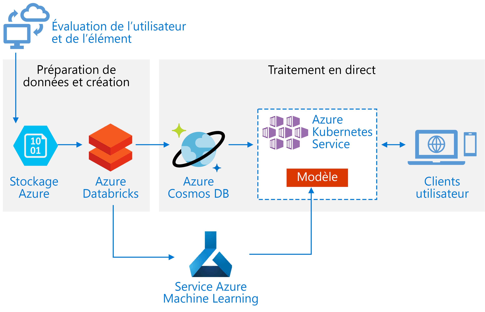
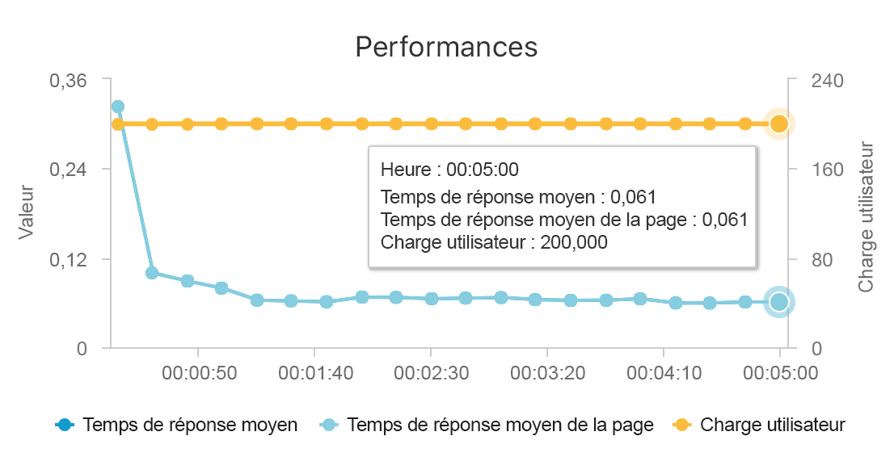
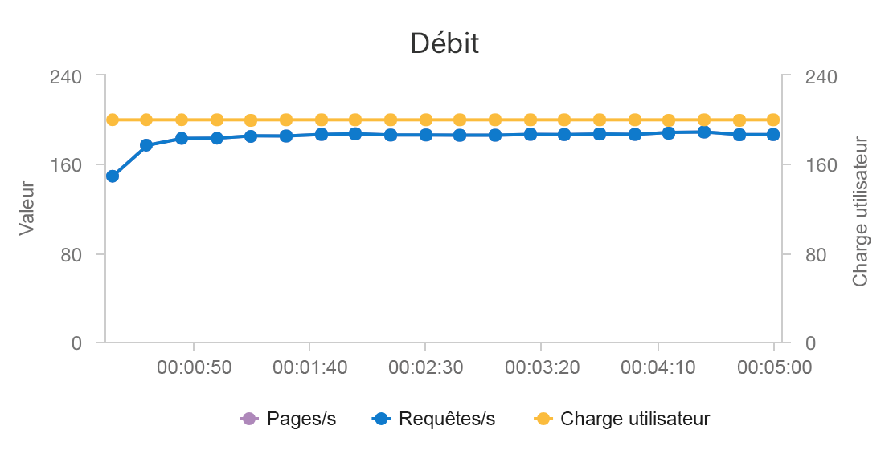

# <a name="build-a-real-time-recommendation-api-on-azure"></a>Générer une API de recommandation en temps réel sur Azure

Cette architecture de référence montre comment entraîner un modèle de recommandation à l’aide d’Azure Databricks et le déployer en tant qu’API en utilisant Azure Cosmos DB, Azure Machine Learning et Azure Kubernetes Service (AKS). Cette architecture peut être étendue à la plupart des scénarios de moteur de recommandation, notamment des recommandations pour des produits, films et actualités.

Une implémentation de référence pour cette architecture est disponible sur [GitHub](https://github.com/Microsoft/Recommenders/blob/master/notebooks/04_operationalize/als_movie_o16n.ipynb).



**Scénario** : Une société de multimédia souhaite fournir des recommandations sur des vidéos ou des films à ses utilisateurs. En proposant des recommandations personnalisées, la société répond à plusieurs objectifs de l’entreprise, dont des taux de clic plus élevés, un niveau d’engagement accru sur site et une plus grande satisfaction des utilisateurs.

Cette architecture de référence concerne l’entraînement et le déploiement d’une API de service de recommandation en temps réel qui peut fournir les 10 meilleures recommandations de films pour un utilisateur donné.

Le flux de données pour ce modèle de recommandation se présente comme suit :

1. Suivre les comportements des utilisateurs. Par exemple, un service back-end peut enregistrer quand un utilisateur évalue un film, ou clique sur un produit ou un article de presse.

2. Charger les données dans Azure Databricks à partir d’une [source de données][data-source] disponible.

3. Préparer les données et les diviser en jeux d’entraînement et de test pour entraîner le modèle. ([Ce guide][guide] décrit les options de division des données.)

4. Adapter le modèle [Spark Collaborative Filtering][als] aux données.

5. Évaluer la qualité du modèle à l’aide de métriques d’évaluation et de classement. ([Ce guide][eval-guide] fournit des détails sur les métriques selon lesquelles vous pouvez évaluer votre recommandation.)

6. Précalculer les 10 meilleures recommandations par utilisateur et les stocker en tant que cache dans Azure Cosmos DB.

7. Déployer un service API sur AKS à l’aide des API Azure Machine Learning pour conteneuriser et déployer l’API.

8. Quand le service back-end reçoit une demande d’un utilisateur, appeler l’API de recommandation hébergée dans AKS pour obtenir les 10 meilleures recommandations et les afficher à l’intention de l’utilisateur.

## <a name="architecture"></a>Architecture

Cette architecture est constituée des composants suivants :

[Azure Databricks][databricks]. Databricks est un environnement de développement utilisé pour préparer des données d’entrée et entraîner le modèle de recommandation sur un cluster Spark. Azure Databricks offre également un espace de travail interactif afin d’exécuter des notebooks et de collaborer sur ceux-ci pour toute tâche de traitement de données ou de machine learning.

[Azure Kubernetes Service][aks] (AKS). AKS est utilisé pour déployer et rendre opérationnelle une API de service de modèle Machine Learning sur un cluster Kubernetes. AKS héberge le modèle conteneurisé, en offrant une scalabilité qui répond à vos besoins en débit, la gestion des identités et des accès ainsi que la journalisation et la supervision de l’intégrité.

[Azure Cosmos DB][cosmosdb]. Cosmos DB est un service de base de données mondialement distribué qui permet de stocker les 10 premiers films recommandés pour chaque utilisateur. Azure Cosmos DB convient bien pour ce scénario, car il fournit une faible latence (10 ms au 99e centile) pour lire les premiers articles recommandés pour un utilisateur donné.

[Service Azure Machine Learning][mls]. Ce service est utilisé pour suivre et gérer des modèles Machine Learning, puis empaqueter et déployer ces modèles sur un environnement AKS scalable.

[Microsoft Recommenders][github]. Ce dépôt open source contient le code des utilitaires et des exemples permettant aux utilisateurs de prendre en main la génération, l’évaluation et la mise en place d’un système de recommandation.

## <a name="performance-considerations"></a>Considérations relatives aux performances

Les performances représentent un aspect primordial pour les recommandations en temps réel, car celles-ci se situent généralement sur le chemin critique de la demande effectuée par un utilisateur sur votre site.

L’association d’AKS et d’Azure Cosmos DB permet à cette architecture de fournir un bon point de départ pour proposer des recommandations destinées à une charge de travail de taille moyenne avec une surcharge minimale. Sous un test de charge avec 200 utilisateurs simultanés, cette architecture fournit des recommandations à une latence moyenne d’environ 60 ms et fonctionne à un débit de 180 demandes par seconde. Le test de charge a été exécuté sur la configuration de déploiement par défaut (un cluster AKS 3x D3 v2 avec 12 processeurs virtuels, 42 Go de mémoire et 11 000 [unités de requête par seconde][ru] provisionnées pour Azure Cosmos DB).





Azure Cosmos DB est recommandé pour sa distribution mondiale clés en main et son utilité pour répondre à toutes les exigences en matière de base de données de votre application. Pour une [latence légèrement plus rapide][latency], envisagez d’utiliser le [Cache Redis Azure][redis] au lieu d’Azure Cosmos DB pour traiter les recherches. Le Cache Redis peut améliorer les performances des systèmes qui reposent fortement sur les données dans les magasins back-end.

## <a name="scalability-considerations"></a>Considérations relatives à l’extensibilité

Si vous n’envisagez pas d’utiliser Spark ou si vous avez une charge de travail plus petite où vous n’avez pas besoin de distribution, pensez à utiliser [Data Science Virtual Machine][dsvm] (DSVM) au lieu d’Azure Databricks. DSVM est une machine virtuelle Azure avec des outils et frameworks d’apprentissage profond pour le machine learning et la science des données. Comme avec Azure Databricks, n’importe quel modèle que vous créez dans une machine virtuelle DSVM peut être rendu opérationnel en tant que service sur AKS via Azure Machine Learning.

Pendant l’entraînement, provisionnez un cluster Spark de taille fixe plus grand dans Azure Databricks ou configurez la [mise à l’échelle automatique][autoscaling]. Quand la mise à l’échelle automatique est activée, Databricks supervise la charge sur votre cluster et effectue un scale-up et un scale-down si nécessaire. Provisionnez un cluster plus grand ou effectuez un scale-out de celui-ci si vous avez une taille de données importante et que vous souhaitez réduire la quantité de temps nécessaire pour la préparation des données ou les tâches de modélisation.

Mettez le cluster AKS à l’échelle pour répondre à vos besoins en termes de performances et de débit. Prenez soin d’effectuer un scale-up du nombre de [pods][scale] pour utiliser pleinement le cluster et de mettre à l’échelle les [nœuds][nodes] du cluster pour répondre à la demande de votre service. Pour plus d’informations sur la façon de mettre à l’échelle votre cluster afin de répondre aux besoins en termes de performances et de débit de votre service de recommandation, consultez [Scaling Azure Container Service Clusters][blog].

Pour gérer les performances Azure Cosmos DB, estimez le nombre de lectures nécessaires par seconde et provisionnez le nombre d’[unités de requête par seconde][ru] (débit) nécessaire. Utilisez les bonnes pratiques pour [le partitionnement et la mise à l’échelle horizontale][partition-data].

## <a name="cost-considerations"></a>Considérations relatives au coût

Les principaux facteurs de coût dans ce scénario sont :

- Taille du cluster Azure Databricks nécessaire pour l’entraînement.
- Taille du cluster AKS nécessaire pour répondre à vos besoins de performance.
- Unités de requête Azure Cosmos DB provisionnées pour répondre à vos besoins de performance.

Gérez les coûts Azure Databricks en réentraînant moins fréquemment et en désactivant le cluster Spark quand il n’est pas utilisé. Les coûts AKS et Azure Cosmos DB sont liés aux performances et au débit requis par votre site, et augmentent et baissent selon le volume de trafic sur votre site.

## <a name="deploy-the-solution"></a>Déployer la solution

Pour déployer cette architecture, commencez par créer un environnement Azure Databricks pour préparer des données et entraîner un modèle de recommandation :

1. Créez un [espace de travail Azure Databricks][workspace].

2. Créez un cluster dans Azure Databricks. La configuration suivante est requise :

    - Mode de cluster : standard
    - Version de Databricks Runtime : 4.1 (comprend Apache Spark 2.3.0, Scala 2.11)
    - Version de Python : 3
    - Type de pilote : Standard\_DS3\_v2
    - Type de traitement web : Standard\_DS3\_v2 (min et max en fonction des besoins)
    - Arrêt automatique : (en fonction des besoins)
    - Configuration Spark : (en fonction des besoins)
    - Variables d’environnement : (en fonction des besoins)

3. Clonez le dépôt [Microsoft Recommenders][github] sur votre ordinateur local.

4. Compressez le contenu dans le dossier Recommenders :

    ```console
    cd Recommenders
    zip -r Recommenders.zip
    ```

5. Attachez la bibliothèque Recommenders à votre cluster comme suit :

    1. Dans le menu suivant, utilisez l’option pour importer une bibliothèque (« pour importer une bibliothèque, comme un fichier jar ou egg, cliquez ici ») et appuyez sur **cliquer ici**.

    2. Dans le premier menu déroulant, sélectionnez l’option **Upload Python egg or PyPI** (Charger Python Egg ou PyPi).

    3. Sélectionnez **Drop library egg here to upload** (Déposer la bibliothèque Egg ici à charger) et le fichier Recommenders.zip que vous venez de créer.

    4. Sélectionnez **Créer une bibliothèque** pour charger le fichier .zip et le rendre disponible dans votre espace de travail.

    5. Dans le menu suivant, attachez la bibliothèque à votre cluster.

6. Dans votre espace de travail, importez l’[exemple ALS Movie Operationalization][als-example].

7. Exécutez le notebook ALS Movie Operationalization afin de générer les ressources requises pour créer une API de recommandation qui fournit les 10 meilleures recommandations de films pour un utilisateur donné.

<!-- links -->
[aci]: /azure/container-instances/container-instances-overview
[aad]: /azure/active-directory-b2c/active-directory-b2c-overview
[aks]: /azure/aks/intro-kubernetes
[als]: https://spark.apache.org/docs/latest/ml-collaborative-filtering.html
[als-example]: https://github.com/Microsoft/Recommenders/blob/master/notebooks/04_operationalize/als_movie_o16n.ipynb
[autoscaling]: https://docs.azuredatabricks.net/user-guide/clusters/sizing.html
[autoscale]: https://docs.azuredatabricks.net/user-guide/clusters/sizing.html#autoscaling
[availability]: /azure/architecture/checklist/availability
[blob]: /azure/storage/blobs/storage-blobs-introduction
[blog]: https://blogs.technet.microsoft.com/machinelearning/2018/03/20/scaling-azure-container-service-cluster/
[clusters]: https://docs.azuredatabricks.net/user-guide/clusters/configure.html
[cosmosdb]: /azure/cosmos-db/introduction
[data-source]: https://docs.azuredatabricks.net/spark/latest/data-sources/index.html
[databricks]: /azure/azure-databricks/what-is-azure-databricks
[dsvm]: /azure/machine-learning/data-science-virtual-machine/overview
[dsvm-ubuntu]: /azure/machine-learning/data-science-virtual-machine/dsvm-ubuntu-intro
[eval-guide]: https://github.com/Microsoft/Recommenders/blob/master/notebooks/03_evaluate/evaluation.ipynb
[free]: https://azure.microsoft.com/free/?WT.mc_id=A261C142F
[github]: https://github.com/Microsoft/Recommenders
[guide]: https://github.com/Microsoft/Recommenders/blob/master/notebooks/01_prepare_data/data_split.ipynb
[latency]: https://github.com/jessebenson/azure-performance
[mls]: /azure/machine-learning/service/
[n-tier]: /azure/architecture/reference-architectures/n-tier/n-tier-cassandra
[ndcg]: https://en.wikipedia.org/wiki/Discounted_cumulative_gain
[nodes]: /azure/aks/scale-cluster
[notebook]: https://github.com/Microsoft/Recommenders/notebooks/00_quick_start/als_pyspark_movielens.ipynb
[partition-data]: /azure/cosmos-db/partition-data
[redis]: /azure/redis-cache/cache-overview
[regions]: https://azure.microsoft.com/en-us/global-infrastructure/services/?products=virtual-machines&regions=all
[resiliency]: /azure/architecture/resiliency/
[ru]: /azure/cosmos-db/request-units
[sec-docs]: /azure/security/
[setup]: https://github.com/Microsoft/Recommenders/blob/master/SETUP.md%60
[scale]: /azure/aks/tutorial-kubernetes-scale
[sla]: https://azure.microsoft.com/en-us/support/legal/sla/virtual-machines/v1_8/
[vm-size]: /azure/virtual-machines/virtual-machines-linux-change-vm-size
[workspace]: https://docs.azuredatabricks.net/getting-started/index.html
