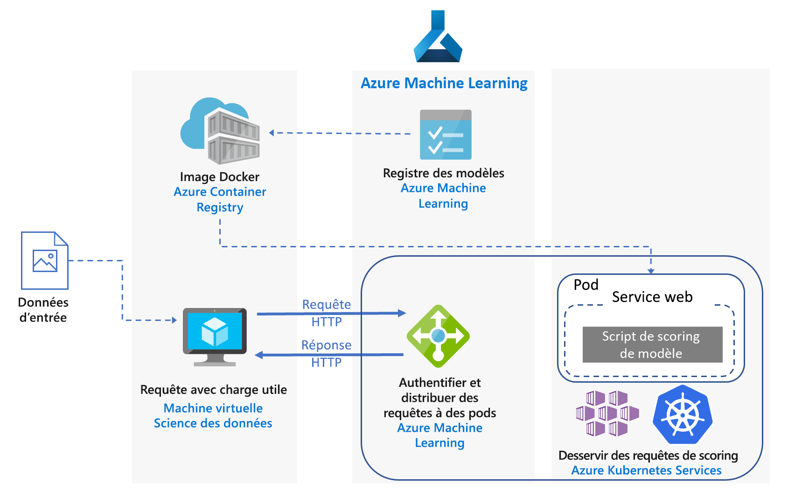

# Scoring en temps réel des modèles Python Scikit-Learn et Apprentissage profond sur AzureReal-time scoring of Python Scikit-Learn and deep learning models on Azure

Cette architecture de référence montre comment déployer des modèles Python en tant que services web pour élaborer des prédictions en temps réel.This reference architecture shows how to deploy Python models as web services to make real-time predictions. Deux scénarios sont couverts : le déploiement de modèles Python standards et les exigences spécifiques du déploiement de modèles d’apprentissage profond.Two scenarios are covered: deploying regular Python models, and the specific requirements of deploying deep learning models. Les deux scénarios utilisent l’architecture illustrée.Both scenarios use the architecture shown.

Deux implémentations de référence pour cette architecture sont disponibles sur GitHub, une pour [les modèles Python standards][github-python] et l’autre pour [les modèles d’apprentissage profond][github-dl].Two reference implementations for this architecture are available on GitHub, one for [regular Python models][github-python] and one for [deep learning models][github-dl].

## ScénariosScenarios

Les implémentations de référence montrent deux scénarios à l’aide de cette architecture.The reference implementations demonstrate two scenarios using this architecture.

**Scénario 1 : Correspondance du Forum aux questions**.**Scenario 1: FAQ matching**. Ce scénario montre comment déployer un modèle de correspondance des questions fréquentes (FAQ) comme un service web pour fournir des prédictions pour les questions de l’utilisateur.This scenario shows how to deploy a frequently asked questions (FAQ) matching model as a web service to provide predictions for user questions. Pour ce scénario, la mention « Entrée de données » dans le diagramme d’architecture fait référence aux chaînes de texte contenant les questions de l’utilisateur à faire correspondre avec une liste des questions fréquentes.For this scenario, "Input Data" in the architecture diagram refers to text strings containing user questions to match with a list of FAQs. Ce scénario est conçu pour la bibliothèque de Machine Learning [scikit-learn][scikit] pour Python, mais il peut être étendu à n’importe quel scénario utilisant des modèles Python pour effectuer des prédictions en temps réel.This scenario is designed for the [scikit-learn][scikit] machine learning library for Python, but can be generalized to any scenario that uses Python models to make real-time predictions.

Ce scénario utilise un sous-ensemble de données de question Stack Overflow qui comprend des questions d’origine marquées comme JavaScript, leurs questions dupliquées et leurs réponses.This scenario uses a subset of Stack Overflow question data that includes original questions tagged as JavaScript, their duplicate questions, and their answers. Il effectue l’apprentissage d’un pipeline scikit-learn pour prédire la probabilité de correspondance d’une question dupliquée avec chacune des questions d’origine.It trains a scikit-learn pipeline to predict the match probability of a duplicate question with each of the original questions. Ces prédictions sont faites en temps réel à l’aide d’un point de terminaison API REST.These predictions are made in real time using a REST API endpoint.

Le flux d’application pour cette architecture est le suivant :The application flow for this architecture is as follows:

1. Le client envoie une requête HTTP POST avec les données encodées de la question.The client sends an HTTP POST request with the encoded question data.

2. L’application Flask extrait la question à partir de la requête.The Flask app extracts the question from the request.

3. La question est envoyée au modèle de pipeline scikit-learn pour la personnalisation et le scoring.The question is sent to the scikit-learn pipeline model for featurization and scoring.

4. Les questions fréquentes correspondantes avec leurs scores sont transmises dans un objet JSON et retournées au client.The matching FAQ questions with their scores are piped into a JSON object and returned to the client.

Voici une capture d’écran de l’exemple d’application qui consomme les résultats :Here is a screenshot of the example app that consumes the results:

**Scénario 2 : Classification d’image**.**Scenario 2: Image classification**. Ce scénario montre comment déployer un modèle de réseau de neurones convolutifs (CNN) comme un service web pour fournir des prévisions sur des images.This scenario shows how to deploy a Convolutional Neural Network (CNN) model as a web service to provide predictions on images. Pour ce scénario, la mention « Entrée de données » dans le diagramme d’architecture fait référence aux fichiers d’image.For this scenario, "Input Data" in the architecture diagram refers to image files. Les CNN sont très efficaces dans la vision par ordinateur pour des tâches telles que la classification d’images et la détection d’objets.CNNs are very effective in computer vision for tasks such as image classification and object detection. Ce scénario est conçu pour les infrastructures TensorFlow, Keras (avec le serveur principal TensorFlow) et PyTorch.This scenario is designed for the frameworks TensorFlow, Keras (with the TensorFlow back end), and PyTorch. Toutefois, il peut être généralisé aux scénarios utilisant des modèles d’apprentissage profond pour effectuer des prédictions en temps réel.However, it can be generalized to any scenario that uses deep learning models to make real-time predictions.

Ce scénario utilise un modèle ResNet-152 préentraîné formé sur un jeu de données ImageNet-1 K (1 000 classes) pour prédire la catégorie (voir la figure ci-dessous) à laquelle appartient une image.This scenario uses a pre-trained ResNet-152 model trained on ImageNet-1K (1,000 classes) dataset to predict which category (see figure below) an image belongs to. Ces prédictions sont faites en temps réel à l’aide d’un point de terminaison API REST.These predictions are made in real time using a REST API endpoint.

Le flux d’application pour le modèle d’apprentissage profond est comme suit :The application flow for the deep learning model is as follows:

1. Le client envoie une requête HTTP POST avec les données encodées de l’image.The client sends an HTTP POST request with the encoded image data.

2. L’application Flask extrait l’image à partir de la requête.The Flask app extracts the image from the request.

3. L’image est prétraitée et envoyée au modèle pour le scoring.The image is preprocessed and sent to the model for scoring.

4. Le résultat du scoring est transmis dans un objet JSON et retourné au client.The scoring result is piped into a JSON object and returned to the client.

## ArchitectureArchitecture

Cette architecture est constituée des composants suivants.This architecture consists of the following components.

**[Machine virtuelle][vm]**.**[Virtual machine][vm]** (VM). La machine virtuelle est affichée comme un exemple d’appareil &mdash; local ou dans le cloud &mdash; pouvant envoyer une requête HTTP.The VM is shown as an example of a device &mdash; local or in the cloud &mdash; that can send an HTTP request.

**[Azure Kubernetes Service][aks]** (AKS) est utilisé pour déployer l’application au sein d’un cluster Kubernetes.**[Azure Kubernetes Service][aks]** (AKS) is used to deploy the application on a Kubernetes cluster. AKS simplifie le déploiement et les opérations de Kubernetes.AKS simplifies the deployment and operations of Kubernetes. Le cluster peut être configuré à l’aide de machines virtuelles compatibles processeur uniquement pour des modèles Python standards ou des machines virtuelles compatibles GPU pour les modèles d’apprentissage profond.The cluster can be configured using CPU-only VMs for regular Python models or GPU-enabled VMs for deep learning models.

**[Équilibreur de charge][lb]**.**[Load balancer][lb]**. Un équilibreur de charge approvisionné par AKS est utilisé pour exposer le service en externe.A load balancer, provisioned by AKS, is used to expose the service externally. Le trafic venant de l’équilibreur de charge est dirigé vers les pods principaux.Traffic from the load balancer is directed to the back-end pods.

**[Docker Hub][docker]** est utilisé pour stocker l’image Docker déployée sur un cluster Kubernetes.**[Docker Hub][docker]** is used to store the Docker image that is deployed on Kubernetes cluster. DockerHub a été choisi pour cette architecture, car il est simple d’utilisation et constitue le référentiel d’images par défaut des utilisateurs de Docker.Docker Hub was chosen for this architecture because it's easy to use and is the default image repository for Docker users. [Azure Container Registry][acr] peut aussi être utilisé pour cette architecture.[Azure Container Registry][acr] can also be used for this architecture.

## Considérations relatives aux performancesPerformance considerations

Pour les architectures de scoring en temps réel, les performances de débit constituent un facteur important.For real-time scoring architectures, throughput performance becomes a dominant consideration. Pour les modèles Python standards, il est généralement admis que les processeurs sont suffisants pour gérer la charge de travail.For regular Python models, it's generally accepted that CPUs are sufficient to handle the workload.

Toutefois pour les charges de travail d’apprentissage profond, où la vitesse constitue un goulot d’étranglement, les GPU offrent généralement de meilleures [performances][gpus-vs-cpus] par rapport aux processeurs.However for deep learning workloads, when speed is a bottleneck, GPUs generally provide better [performance][gpus-vs-cpus] compared to CPUs. Pour faire correspondre les performances de GPU en utilisant des processeurs, un cluster disposant d’un grand nombre de processeurs est généralement nécessaire.To match GPU performance using CPUs, a cluster with large number of CPUs is usually needed.

Vous pouvez utiliser des processeurs pour cette architecture dans les deux cas, mais pour les modèles d’apprentissage profond, les GPU offrent des débits considérablement supérieurs par rapport à un cluster de processeurs d’un coût similaire.You can use CPUs for this architecture in either scenario, but for deep learning models, GPUs provide significantly higher throughput values compared to a CPU cluster of similar cost. AKS prend en charge l’utilisation de GPU, qui est l’un des avantages de l’utilisation d’AKS pour cette architecture.AKS supports the use of GPUs, which is one advantage of using AKS for this architecture. En outre, les déploiements d’apprentissage profond utilisent généralement modèles comportant un grand nombre de paramètres.Also, deep learning deployments typically use models with a high number of parameters. L’utilisation des GPU empêche la contention de ressources entre le modèle et le service web, ce qui constitue un problème dans les déploiements constitués uniquement de processeurs.Using GPUs prevents contention for resources between the model and the web service, which is an issue in CPU-only deployments.

## Considérations relatives à l’extensibilitéScalability considerations

Pour les modèles Python standards, où le cluster AKS est fourni avec des machines virtuelles pourvues uniquement de processeurs, faites attention lors de [l’extension du nombre de pods][manually-scale-pods].For regular Python models, where AKS cluster is provisioned with CPU-only VMs, take care when [scaling out the number of pods][manually-scale-pods]. L’objectif est d’utiliser pleinement le cluster.The goal is to fully utilize the cluster. L’extensibilité dépend des requêtes du processeur et des limites définies pour les pods.Scaling depends on the CPU requests and limits defined for the pods. Kubernetes prend également en charge [l’extension automatique][autoscale-pods] des pods pour ajuster le nombre de pods dans un déploiement en fonction de l’utilisation du processeur ou d’autres métriques.Kubernetes also supports [autoscaling][autoscale-pods] of the pods to adjust the number of pods in a deployment depending on CPU utilization or other select metrics. L’[autoscaler de cluster][autoscaler] (en préversion) peut mettre à l’échelle vos nœuds d’agent en fonction des pods en attente.The [cluster autoscaler][autoscaler] (in preview) can scale agent nodes based on pending pods.

Pour des scénarios d’apprentissage profond, à l’aide de machines virtuelles compatibles GPU, les limites de ressources sur les pods sont telles qu’un GPU est attribué à un pod.For deep learning scenarios, using GPU-enabled VMs, resource limits on pods are such that one GPU is assigned to one pod. Selon le type de machine virtuelle utilisé, vous devez [mettre à l’échelle les nœuds du cluster][scale-cluster] pour répondre à la demande du service.Depending on the type of VM used, you must [scale the nodes of the cluster][scale-cluster] to meet the demand for the service. Vous pouvez faire cela facilement à l’aide d’Azure CLI et de kubectl.You can do this easily using the Azure CLI and kubectl.

## Supervision et enregistrement des considérationsMonitoring and logging considerations

### Supervision AKSAKS monitoring

Pour visualiser les performances de AKS, utilisez la fonctionnalité [Azure Monitor pour les conteneurs][monitor-containers].For visibility into AKS performance, use the [Azure Monitor for containers][monitor-containers] feature. Cela collecte des métriques sur la mémoire et le processeur à partir des contrôleurs, des nœuds et des conteneurs qui sont disponibles dans Kubernetes via l’API Metrics.It collects memory and processor metrics from controllers, nodes, and containers that are available in Kubernetes through the Metrics API.

Lors du déploiement de votre application, surveillez le cluster AKS pour vous assurer qu’il fonctionne comme prévu, tous les nœuds sont opérationnels, et tous les pods sont en cours d’exécution.While deploying your application, monitor the AKS cluster to make sure it's working as expected, all the nodes are operational, and all pods are running. Bien que vous puissiez utiliser l’outil en ligne de commande [kubectl][kubectl] pour récupérer l’état du pod, Kubernetes comprend également un tableau de bord web pour la surveillance de l’état du cluster et la gestion de base.Although you can use the [kubectl][kubectl] command-line tool to retrieve pod status, Kubernetes also includes a web dashboard for basic monitoring of the cluster status and management.

Pour afficher l’état global du cluster et des nœuds, accédez à la section **Nœuds** du tableau de bord Kubernetes.To see the overall state of the cluster and nodes, go to the **Nodes** section of the Kubernetes dashboard. Si un nœud est inactif ou a échoué, vous pouvez afficher les journaux d’erreurs à partir de cette page.If a node is inactive or has failed, you can display the error logs from that page. De même, accédez aux sections **Pods** et **Déploiements** pour plus d’informations sur le nombre de pods et l’état de votre déploiement.Similarly, go to the **Pods** and **Deployments** sections for information about the number of pods and status of your deployment.

### Journaux AKSAKS logs

AKS enregistre automatiquement tous les stdout/stderr au sein des journaux des pods dans le cluster.AKS automatically logs all stdout/stderr to the logs of the pods in the cluster. Utilisez kubectl pour les voir, de même que les événements et les journaux au niveau du nœud.Use kubectl to see these and also node-level events and logs. Pour plus d’informations, consultez les étapes de déploiement.For details, see the deployment steps.

Utilisez [Azure Monitor pour les conteneurs][monitor-containers] pour collecter des métriques et des journaux par l’intermédiaire d’une version en conteneur de l’agent Log Analytics pour Linux, stocké dans votre espace de travail Log Analytics.Use [Azure Monitor for containers][monitor-containers] to collect metrics and logs through a containerized version of the Log Analytics agent for Linux, which is stored in your Log Analytics workspace.

## Considérations relatives à la sécuritéSecurity considerations

[Azure Security Center][security-center] vous offre un aperçu global de l’état de toutes vos ressources Azure en termes de sécurité.Use [Azure Security Center][security-center] to get a central view of the security state of your Azure resources. Il surveille les problèmes potentiels de sécurité et fournit une image complète de la sécurité de votre déploiement, même s’il ne surveille pas les nœuds d’agent AKS.Security Center monitors potential security issues and provides a comprehensive picture of the security health of your deployment, although it doesn't monitor AKS agent nodes. Le Centre de sécurité est configuré pour chaque abonnement Azure.Security Center is configured per Azure subscription. Activez la collecte de données de sécurité comme décrit dans [Intégrer un abonnement Azure à Security Center Standard][get-started].Enable security data collection as described in [Onboard your Azure subscription to Security Center Standard][get-started]. Une fois la collecte de données activée, le Centre de sécurité analyse automatiquement les machines virtuelles créées dans le cadre de cet abonnement.When data collection is enabled, Security Center automatically scans any VMs created under that subscription.

**Opérations**.**Operations**. Pour vous connecter à un cluster AKS à l’aide de votre jeton d’authentification Azure Active Directory (Azure AD), configurez AKS pour utiliser Azure AD pour [l’authentification utilisateur][aad-auth].To sign in to an AKS cluster using your Azure Active Directory (Azure AD) authentication token, configure AKS to use Azure AD for [user authentication][aad-auth]. Les administrateurs de cluster peuvent également configurer le contrôle d’accès en fonction du rôle (RBAC) Kubernetes basé sur une identité utilisateur ou l’appartenance à un groupe de répertoires.Cluster administrators can also configure Kubernetes role-based access control (RBAC) based on a user's identity or directory group membership.

Utilisez le contrôle [RBAC][rbac] pour contrôler l’accès aux ressources Azure que vous déployez.Use [RBAC][rbac] to control access to the Azure resources that you deploy. Le contrôle RBAC vous permet d’affecter des rôles d’autorisation aux membres de votre équipe DevOps.RBAC lets you assign authorization roles to members of your DevOps team. Un utilisateur peut être affecté à plusieurs rôles, et vous pouvez créer des rôles personnalisés pour d’autres [autorisations] plus affinées.A user can be assigned to multiple roles, and you can create custom roles for even more fine-grained [permissions].

**HTTPS**.**HTTPS**. Comme meilleure pratique de sécurité, l’application doit appliquer le protocole HTTPS et rediriger les requêtes HTTP.As a security best practice, the application should enforce HTTPS and redirect HTTP requests. Utilisez un [contrôleur d’entrée][ingress-controller] pour déployer un proxy inverse qui arrête le protocole SSL et redirige les requêtes HTTP.Use an [ingress controller][ingress-controller] to deploy a reverse proxy that terminates SSL and redirects HTTP requests. Pour plus d’informations, consultez [Créer un contrôleur d’entrée HTTPS dans Azure Kubernetes Service (AKS)][https-ingress].For more information, see [Create an HTTPS ingress controller on Azure Kubernetes Service (AKS)][https-ingress].

**Authentification**.**Authentication**. Cette solution ne restreint pas l’accès aux points de terminaison.This solution doesn't restrict access to the endpoints. Pour déployer l’architecture dans un environnement d’entreprise, sécurisez les points de terminaison via des clés API et ajoutez une forme d’authentification utilisateur à l’application cliente.To deploy the architecture in an enterprise setting, secure the endpoints through API keys and add some form of user authentication to the client application.

**Registre de conteneurs**.**Container registry**. Cette solution utilise un registre public pour stocker l’image Docker.This solution uses a public registry to store the Docker image. Le code dont dépend l’application, ainsi que le modèle, sont contenus dans cette image.The code that the application depends on, and the model, are contained within this image. Les applications d’entreprise doivent utiliser un registre privé pour se prémunir contre l’exécution de code malveillant et pour mieux éviter que les informations contenues dans le conteneur soient compromises.Enterprise applications should use a private registry to help guard against running malicious code and to help keep the information inside the container from being compromised.

**Protection DDOS**.**DDoS protection**. Envisagez l’activation de la [Protection DDoS Standard][ddos].Consider enabling [DDoS Protection Standard][ddos]. Bien que la protection DDoS soit activée sur la plateforme Azure, la protection DDoS standard offre des capacités d’atténuation des risques spécifiquement adaptées aux ressources de réseau virtuel Azure.Although basic DDoS protection is enabled as part of the Azure platform, DDoS Protection Standard provides mitigation capabilities that are tuned specifically to Azure virtual network resources.

**Journalisation**.**Logging**. Utilisez les meilleures pratiques avant de stocker des données de journal, comme le nettoyage des mots de passe utilisateur et d’autres informations pouvant être utilisées pour commettre une usurpation de sécurité.Use best practices before storing log data, such as scrubbing user passwords and other information that could be used to commit security fraud.

## DéploiementDeployment

Pour déployer cette architecture de référence, suivez les étapes décrites dans les dépôts GitHub :To deploy this reference architecture, follow the steps described in the GitHub repos:

- [Modèles Python standards][github-python][Regular Python models][github-python]
- [Modèles d’apprentissage profond][github-dl][Deep learning models][github-dl]

<!-- links -->

[aad-auth]: /azure/aks/aad-integration
[acr]: /azure/container-registry/
[something]: https://kubernetes.io/docs/reference/access-authn-authz/authentication/
[aks]: /azure/aks/intro-kubernetes
[autoscaler]: /azure/aks/autoscaler
[autoscale-pods]: /azure/aks/tutorial-kubernetes-scale#autoscale-pods
[azcopy]: /azure/storage/common/storage-use-azcopy-linux
[ddos]: /azure/virtual-network/ddos-protection-overview
[docker]: https://hub.docker.com/
[get-started]: /azure/security-center/security-center-get-started
[github-python]: https://github.com/Azure/MLAKSDeployment
[github-dl]: https://github.com/Microsoft/AKSDeploymentTutorial
[gpus-vs-cpus]: https://azure.microsoft.com/en-us/blog/gpus-vs-cpus-for-deployment-of-deep-learning-models/
[https-ingress]: /azure/aks/ingress-tls
[ingress-controller]: https://kubernetes.io/docs/concepts/services-networking/ingress/
[kubectl]: https://kubernetes.io/docs/tasks/tools/install-kubectl/
[lb]: /azure/load-balancer/load-balancer-overview
[manually-scale-pods]: /azure/aks/tutorial-kubernetes-scale#manually-scale-pods
[monitor-containers]: /azure/monitoring/monitoring-container-insights-overview
[autorisations]: /azure/aks/concepts-identity
[permissions]: /azure/aks/concepts-identity
[rbac]: /azure/active-directory/role-based-access-control-what-is
[scale-cluster]: /azure/aks/scale-cluster
[scikit]: https://pypi.org/project/scikit-learn/
[security-center]: /azure/security-center/security-center-intro
[vm]: /azure/virtual-machines/
